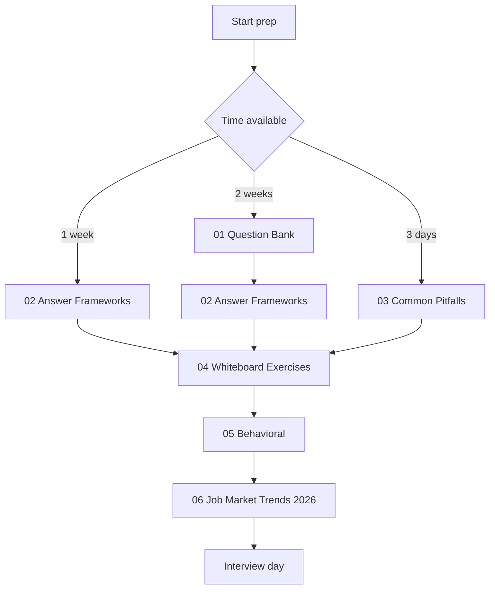
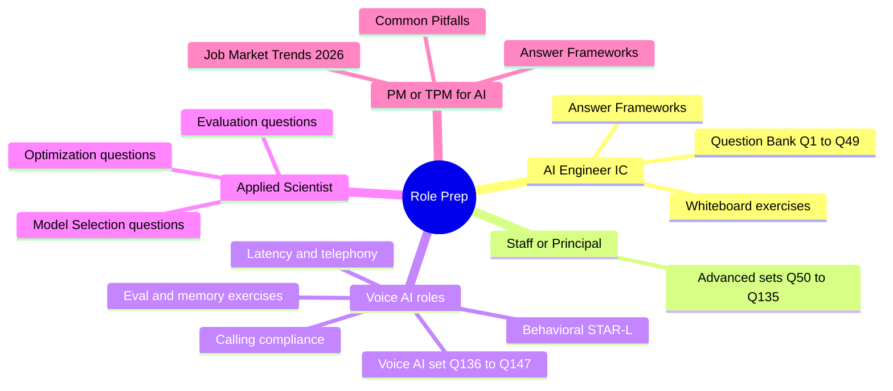

# AI System Design Interview Preparation

Interview prep for senior and staff AI engineering roles: 147 system design questions (including a dedicated Voice AI set), answer frameworks with a worked mock-interview transcript, common pitfalls, ten whiteboard exercises, behavioral prep, a quick-answer FAQ, and October 2026 hiring trends.

> **What's new (October 2026):** the question bank gained seven September-2026 questions (operating an agent on a model rated Critical for cyber, full-duplex voice front ends that delegate to a backend model, providers removing sampling parameters and forced tool calls, managed agent platforms, reading benchmark claims against public leaderboards, open-weight license gates, and patching a self-hosted inference stack) plus a new twelve-question [Voice AI](01-question-bank.md#voice-ai-questions) section covering architecture choice, latency budgets, turn-taking on phone audio, per-minute cost, evaluation, and calling compliance. The bank now runs continuously Q1-Q147, and the whiteboard set gained a tenth exercise on inference batching.

## Before You Start

This folder assumes you already write production code and know LLM basics (tokens, context windows, embeddings, what RAG is). If those are shaky, spend a week in [01-foundations](../01-foundations/) and the [Courses guide](../COURSES.md) first; interview prep on top of missing fundamentals produces fluent-sounding wrong answers, which is the worst possible outcome in a senior loop.

The files in this folder are designed to be read in order. Each builds on the last: questions teach the surface area, frameworks teach how to structure answers, pitfalls teach what kills offers, exercises rehearse the motion, behavioral covers the staff-level signal, and job-market trends cover the current hiring landscape.

## Read in Order

## Role-Specific Prep Paths

## Files in This Folder

| File | Purpose |
|------|---------|
| [01-question-bank.md](01-question-bank.md) | 147 real interview questions (Q1-Q147, continuously numbered) grouped by topic, with model answers and follow-ups (through September 2026), including a twelve-question Voice AI section. |
| [02-answer-frameworks.md](02-answer-frameworks.md) | Five structured answer frameworks (SPIDER, ETA, tradeoff, debugging, STAR-L) plus a worked 45-minute SPIDER mock-interview transcript. |
| [03-common-pitfalls.md](03-common-pitfalls.md) | Patterns that kill staff-level offers: hand-waving on tradeoffs, missing observability, ignoring failure modes. |
| [04-whiteboard-exercises.md](04-whiteboard-exercises.md) | Ten system design exercises with worked solutions, including evaluation pipeline design, agent memory, and inference batching. The closest simulation of a real loop. |
| [05-behavioral-for-ai-roles.md](05-behavioral-for-ai-roles.md) | Behavioral prep for AI-specific scenarios with six worked STAR-L examples, compensation and leveling questions, and an out-loud practice guide. |
| [06-job-market-trends-2026.md](06-job-market-trends-2026.md) | Role taxonomy, comp ranges (with re-swept levels.fyi rows marked), entry-level and layoff data, per-company AI-in-interview policies, and emerging titles (FDE, AI Eval Engineer, AI Reliability Engineer, MCP Engineer). |
| [07-faq.md](07-faq.md) | Short, direct answers to the most-asked questions about AI engineering, RAG, agents, models, eval, inference, memory, and security. Useful for quick reference and for newcomers to the field. |

## Practice With a Real Interviewer

Everything in this folder can be self-studied, but one part of the loop cannot: defending a design out loud while an interviewer interrupts, changes a constraint, and asks why you did not pick the other option. That is a skill, and it improves fastest with reps and direct feedback.

If you want those reps, Om offers 1:1 mock AI system design interviews, reviews of your written answers and stories, and ongoing mentorship for engineers moving into senior or staff AI roles. Book on [EngineBogie](https://enginebogie.com/u/om) or [Topmate](https://topmate.io/ombharatiya). A good time to book is after you have worked through the answer frameworks and at least three whiteboard exercises, so the session tests your delivery rather than your reading.

## Companion Resources

- [Role Transition Guide](../TRANSITION_GUIDE.md) for prepping from backend, frontend, QA, PM, or EM into AI.
- [Recommended Courses](../COURSES.md) for foundational learning before interview prep.
- [Glossary](../GLOSSARY.md) for quick term definitions during prep.
- [Case Studies](../16-case-studies/) for production architectures that map directly to whiteboard prompts.

## Key Takeaways

- The files are designed to be read in order; jumping straight to questions without absorbing answer frameworks leaves answers unstructured.
- Whiteboard exercises (file 04) are the closest simulation to real interviews; do at least three before any loop.
- Behavioral prep (file 05) is what separates staff candidates from senior candidates; do not skip it.
- The October 2026 job market chapter (file 06) is a moat: candidates who know the hiring landscape can ask better questions and tailor stories.
- Recheck this folder monthly; new question batches are added as hiring trends shift.
