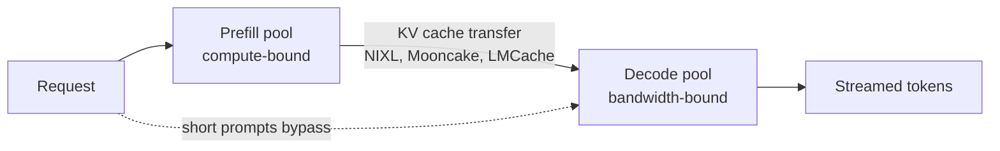

# Inference Pipeline

This chapter covers how LLMs generate text at inference time, the computational phases involved, and the key metrics for production serving.

## Table of Contents

- [Generation Basics](#generation-basics)
- [Prefill and Decode Phases](#prefill-and-decode-phases)
- [Sampling Strategies](#sampling-strategies)
- [Stopping Conditions](#stopping-conditions)
- [Speculative Decoding](#speculative-decoding)
- [Latency Metrics, Goodput & Speed Tiers](#latency-metrics)
- [Memory and Compute Requirements](#memory-and-compute-requirements)
- [Streaming](#streaming)
- [Production Considerations](#production-considerations)
- [Continuous Batching & Prefix Caching](#continuous-batching-and-prefix-caching)
- [Multi-LoRA Serving](#multi-lora-serving)
- [Interview Questions](#interview-questions)
- [References](#references)

---

## Generation Basics

LLMs generate text autoregressively: one token at a time, using all previous tokens as context.

```
Input: "The quick brown"
Step 1: Generate "fox" -> "The quick brown fox"
Step 2: Generate "jumps" -> "The quick brown fox jumps"
Step 3: Generate "over" -> "The quick brown fox jumps over"
...
```

### The Generation Loop

```python
def generate(prompt: str, max_tokens: int, model) -> str:
    tokens = tokenize(prompt)
    
    for _ in range(max_tokens):
        # Forward pass: get logits for next token
        logits = model.forward(tokens)
        
        # Sample next token from probability distribution
        next_token = sample(logits[-1])
        
        # Check for stop condition
        if next_token == EOS_TOKEN:
            break
        
        tokens.append(next_token)
    
    return detokenize(tokens)
```

---

## Prefill and Decode Phases

Inference has two distinct phases with different characteristics:

### Prefill Phase

Processes the entire input prompt in parallel.

```
Input: "The quick brown fox" (4 tokens)

Prefill:
- Process all 4 tokens simultaneously
- Compute attention across all pairs
- Populate KV cache for all positions
- Output: logits for next token
```

**Characteristics:**
- Compute-bound (lots of matrix operations)
- Parallelizable across tokens
- Time scales with prompt length
- Happens once per generation

### Decode Phase

Generates one token at a time.

```
Decode step 1:
- Input: new token position only
- Attend to all KV cache (prompt + previously generated)
- Generate one token

Decode step 2:
- Append new K, V to cache
- Input: newest token position
- Generate next token

...repeat until done
```

**Characteristics:**
- Memory-bound (every step re-reads the weights and the KV cache from HBM)
- Sequential (must complete each step to start next)
- Time per token roughly constant
- Repeated until stopping condition

### Why This Matters

| Phase | Bottleneck | Optimization |
|-------|------------|--------------|
| Prefill | Compute (GPU cores) | Flash Attention, better GPU |
| Decode | Memory bandwidth | GQA, batching, quantization, speculative decoding |

**Implication for serving:**
- Long prompts increase prefill time (affects TTFT)
- Long generations increase decode time (affects total latency)
- Batching helps decode efficiency more than prefill

### Disaggregated Prefill and Decode

Because the two phases have opposite bottlenecks, large deployments run them on separate pools: prefill workers build the KV cache and hand it over, decode workers stream tokens.



- **The win is goodput, not peak throughput**: the request rate that meets both the TTFT and inter-token-latency SLOs. Prefill bursts stop stalling in-flight decodes. (vLLM's September 2026 disaggregated-serving guide frames it this way.)
- **The cost is KV transfer**: Llama-3.1-70B in BF16 stores 320 KiB per token, so a 10K-token prompt hands decode about 3 GB, roughly 65 ms at 400 Gb/s added to TTFT. Short prompts often are not worth it; NVIDIA Dynamo 1.5 added a conditional bypass that sends them straight to decode.
- **Cross-chip versions** put prefill on HBM GPUs and decode on SRAM or wafer-scale parts for premium-latency tiers: NVIDIA Rubin plus Groq 3 LPX (in production), AMD Helios plus Cerebras (announced, via Cerebras Cloud), and an Intel plus SambaNova blueprint.
- **Models are now designed around the split**: DeepSeek V4.1-Flash activates 8B parameters per token in prefill and 16B in decode.

---

## Sampling Strategies

After computing logits, we need to select the next token. Different strategies produce different outputs.

### Greedy Decoding

Always pick the highest probability token:

```python
def greedy_sample(logits):
    return torch.argmax(logits)
```

**Properties:**
- Deterministic
- Often repetitive for long generations
- Good for factual/structured outputs

### Temperature Sampling

Scale logits before softmax to control randomness:

```python
def temperature_sample(logits, temperature=1.0):
    scaled_logits = logits / temperature
    probs = torch.softmax(scaled_logits, dim=-1)
    return torch.multinomial(probs, num_samples=1)
```

**Temperature effects:**

| Temperature | Behavior | Use Case |
|-------------|----------|----------|
| 0 | Greedy (deterministic in math, not bit-exact on batched GPU serving) | Factual Q&A, code |
| 0.3-0.7 | Low randomness | General tasks |
| 1.0 | Baseline | Creative writing |
| 1.5+ | High randomness | Brainstorming |

### Top-K Sampling

Only consider the K highest probability tokens:

```python
def top_k_sample(logits, k=50):
    values, indices = torch.topk(logits, k)
    probs = torch.softmax(values, dim=-1)
    sampled_idx = torch.multinomial(probs, num_samples=1)
    return indices[sampled_idx]
```

**Effect:** Filters out low-probability tokens that might be nonsensical.

### Top-P (Nucleus) Sampling

Include tokens until cumulative probability exceeds P:

```python
def top_p_sample(logits, p=0.9):
    sorted_probs, sorted_indices = torch.sort(
        torch.softmax(logits, dim=-1), descending=True
    )
    cumulative_probs = torch.cumsum(sorted_probs, dim=-1)
    
    # Find cutoff
    cutoff_idx = torch.searchsorted(cumulative_probs, p)
    
    # Sample from truncated distribution
    selected_probs = sorted_probs[:cutoff_idx + 1]
    selected_probs = selected_probs / selected_probs.sum()
    sampled_idx = torch.multinomial(selected_probs, num_samples=1)
    
    return sorted_indices[sampled_idx]
```

**Advantage over Top-K:** Dynamically adjusts based on probability distribution. High-confidence predictions include fewer tokens; uncertain predictions include more.

### Common Configurations

| Use Case | Temperature | Top-P | Top-K |
|----------|-------------|-------|-------|
| Code generation | 0-0.2 | 0.95 | - |
| Factual Q&A | 0.1-0.3 | 1.0 | - |
| General chat | 0.7 | 0.9 | - |
| Creative writing | 1.0 | 0.95 | - |
| Brainstorming | 1.2 | 1.0 | - |

These settings apply to self-hosted engines and to hosted models that still accept sampling parameters. Many hosted frontier models no longer do; see [Sampling Controls on Hosted Frontier Models](#sampling-controls-on-hosted-frontier-models).

### Repetition Penalties

Reduce probability of recently generated tokens:

```python
def apply_repetition_penalty(logits, generated_tokens, penalty=1.2):
    for token_id in set(generated_tokens):
        logits[token_id] /= penalty
    return logits
```

**Variants:**
- Presence penalty: Penalize all tokens that appeared
- Frequency penalty: Penalize proportional to occurrence count

### Sampling Controls on Hosted Frontier Models

Everything above still applies to self-hosted engines: vLLM, SGLang and llama.cpp expose the full set. Hosted reasoning models are removing the knobs:

| Provider | What changed |
|----------|--------------|
| Anthropic | The Claude API returns 400 for non-default `temperature`, `top_p` or `top_k` on Claude Opus 4.7 and every newer Claude model. Python SDK 1.0 (August 20, 2026) removed them from the Messages method signatures, so passing them raises `TypeError` (older models can still receive them through `extra_body`). |
| Google | Deprecated `temperature`, `top_p` and `top_k` in the Gemini API on July 21, 2026. Gemini 3.8 Flash replaces `thinking_budget` with `thinking_level` (`low`, `medium` default, `high`). |
| OpenAI | GPT-6 Astra (September 3, 2026) accepts no custom `temperature` or `top_p` and returns no logprobs. |

The control surface is now **reasoning effort** (or thinking level), not the sampler. What that changes:
- **Determinism**: code that sets `temperature=0` "for reproducibility" now breaks or is being phased out (a 400 on the Claude API, a `TypeError` in Anthropic's Python SDK 1.0, unsupported on GPT-6 Astra, deprecated on Gemini), and it never guaranteed bit-identical output anyway. Batched GPU serving, MoE routing and floating-point reduction order make outputs vary run to run unless the engine runs a deterministic, batch-invariant mode at some throughput cost.
- **Confidence signals**: logprob-based scoring for routing, abstention or human escalation does not work on Astra. Use calibrated classifiers, verifier passes or structured self-assessment instead.
- **Diversity**: best-of-n variety now comes from prompt variation, different models or the provider's own sampling, not from raising temperature.
- **Abstraction layers**: wrappers that hard-code sampling parameters break when you switch to these models. Keep provider-specific parameters behind a thin, per-model config.

---

## Stopping Conditions

Generation continues until a stopping condition is met:

### EOS Token

Model generates end-of-sequence token:

```python
if next_token == tokenizer.eos_token_id:
    break
```

### Max Tokens

Hard limit on generation length:

```python
for i in range(max_tokens):
    # generate...
```

### Stop Sequences

Custom strings that terminate generation:

```python
stop_sequences = ["###", "\n\n", "Human:"]

for seq in stop_sequences:
    if output.endswith(seq):
        output = output[:-len(seq)]
        break
```

---

## Speculative Decoding

**Standard on every major serving engine for latency-sensitive decode.**

A cheap drafter proposes the next K tokens; the target model verifies all K in one forward pass and keeps the longest prefix it agrees with, plus one token it samples itself. With standard rejection-sampling verification the output distribution matches the target's exactly, so speculation changes speed, not quality.

```
Drafter (cheap): proposes "The", "quick", "brown", "fox", "jumps"
Target (large):  verifies all 5 in ONE forward pass
Result: if the target accepts 4, it adds 1 of its own: 5 tokens for one
        large forward pass (plus the drafter's cost)
```

| Method | Where drafts come from | Status (October 2026) |
|--------|------------------------|-----------------------|
| Draft model | Separate small model with the same tokenizer | Still supported; needs a matched small model |
| EAGLE-3 | Lightweight head trained on the target's hidden states | Common choice for models without built-in heads |
| MTP heads | Multi-token-prediction modules shipped with the model | DeepSeek V3 onward; MiMo-V2.6-Pro (5-layer MTP, 7 tokens per pass); Qwen3.8-Flash-Next (4B MTP module) |
| DSpark | DeepSeek's drafter, bundled in the checkpoint | DeepSeek-V4-Flash-DSpark and V4-Pro-DSpark (June 27, 2026) are the same checkpoints with a draft module attached; vLLM `method: "dspark"` with 7 speculative tokens |
| DFlash 2 | Block-diffusion drafter that proposes a whole block in parallel | Inco AI, August 18, 2026; 2.7x to 3.4x on Qwen3.8-27B (vendor-reported); merged into SGLang, vLLM and llama.cpp August 19-27 |
| N-gram, prompt lookup, suffix decoding | Substrings of the prompt or prior output | No extra model; strong for RAG, code edits and agent loops that repeat text |

Medusa heads, the 2024 favorite, are no longer documented in vLLM (the `medusa` method value is still accepted); prefer EAGLE-3 or the model's own MTP heads.

**The batch-size catch.** Speculation spends extra compute to save bandwidth-bound decode steps. At low concurrency that compute is free; at high concurrency the GPU is already busy and every rejected draft token is waste, which is why the classic advice was "turn it off at large batch." vLLM's **adaptive verification** (August 14, 2026; extended in v0.30 to MTP, EAGLE-3 and DFlash drafters) scores each draft position's survival probability and admits only a global top-B set of draft slots per step. On DeepSeek-V4-Pro-0813 the first of 7 draft tokens survives over 70% of the time and the last under 10%; vLLM reports speculation staying beneficial up to concurrency 256.

**Operational consequences:**
- Publishers now ship drafters with the weights, so self-host throughput estimates should assume speculation is on, and eval parity checks should run through the same speculative path you serve.
- MLPerf Inference v6.1 (September 2026) allows speculative decoding in the gpt-oss-120b Interactive scenario, so results on that test may include it.

See [Speculative Decoding](../04-inference-optimization/03-speculative-decoding.md) for the full treatment.

---

## Latency Metrics

### Time to First Token (TTFT)

Time from request to first generated token.

```
TTFT = network_latency + queue_time + prefill_time
```

**What affects TTFT:**
- Prompt length (prefill grows linearly with prompt length, faster at long context where quadratic attention dominates)
- Model size
- GPU speed
- Queue depth

**Targets:**
- Interactive chat: < 500ms
- Real-time: < 200ms
- Batch: Less critical

### Tokens Per Second (TPS)

Rate of token generation after first token. Per-request TPS is the inverse of **inter-token latency** (ITL, also called time per output token).

```
TPS = (total_tokens - 1) / (total_time - TTFT)
```

**What affects TPS:**
- Model size (active parameters for MoE)
- Batch size
- GPU memory bandwidth
- KV cache size
- Speculative decoding acceptance rate

**Typical values:**
- Llama 70B on H100: 30-50 tokens/sec per request
- Hosted frontier APIs, standard tier: tens of tokens/sec per request, varying with model, reasoning effort and load
- Small model (7B): 100+ tokens/sec

For reasoning models, hidden thinking tokens stream before the first visible token, so user-perceived TTFT includes part of the decode phase. Measure time to first *visible* token separately.

### Speed Is a Priced Tier

Providers now sell speed separately from the model:
- **OpenAI**: Fast tier (renamed from Priority on July 30, 2026) at 2x Standard (2.5x on GPT-5.5); Ultrafast at 6x, GA on GPT-6 Astra since September 29, 2026. GPT-5.6 Sol Ultrafast, in preview for select customers, runs on Cerebras at up to 750 output tok/s.
- **Anthropic**: fast mode on Claude Opus 5.5 at $8/$40 per 1M (2x standard), a research preview on the Claude API only.
- **Diffusion LMs** replace token-by-token decode with parallel refinement: Inception reports Mercury 2.5 at 1,107 tok/s on NVIDIA GPUs, at $0.20/$0.75 per 1M list.

Latency is now a routing dimension: send the user-facing turn to a fast tier and background agent steps to Standard or Batch.

### Total Latency

```
Total = TTFT + (output_tokens / TPS)
```

**Example:**
- TTFT: 200ms
- TPS: 50 tokens/sec
- Output: 100 tokens
- Total: 200ms + 2000ms = 2.2s

### Throughput

Requests completed per unit time:

```
Throughput = concurrent_requests * TPS / average_output_tokens
```

Higher batch sizes increase throughput but may increase per-request latency.

### Goodput and Pareto Curves

Peak throughput and batch-1 speed both mislead on their own. **Goodput** is the request rate that meets your TTFT and ITL SLOs at the same time. When comparing engines or accelerators, compare **throughput-versus-interactivity Pareto curves** at your SLO, on traffic shaped like yours.

SemiAnalysis's AgentX scenario (multi-turn, long-context agent traffic with high prefix reuse) shows how much the operating point matters. On DeepSeek V4 Pro it reports Vera Rubin NVL72 at about 67x GB300's throughput per TCO at 170 tok/s per user under ownership-cost assumptions, but only 62% more tokens than GB300 NVL72 at an 80 tok/s P90 SLA on 3-year rental pricing (analyst-reported). Same hardware, same model: a 67x headline or a 1.6x result, depending on the interactivity target and the cost basis you pick. Ask for both before accepting any accelerator claim.

---

## Memory and Compute Requirements

### Model Weights

```
Memory = parameters * bytes_per_parameter

70B model in BF16: 70B * 2 bytes   = 140 GB
70B model in FP8:  70B * 1 byte    = 70 GB
70B model in INT4 or FP4: 70B * 0.5 bytes = 35 GB
  (plus block scales: NVFP4 ~4.5 bits/weight, ~39 GB; MXFP4 ~4.25 bits, ~37 GB)
```

**Precision in 2026:** FP4 weights (NVFP4 on NVIDIA, MXFP4 on AMD and other OCP-format hardware) plus an FP8 KV cache is the headline serving configuration, and SGLang can requantize NVFP4 checkpoints to MXFP4 at load to run them on AMD. Lower precision only wins with a good kernel: NVIDIA Dynamo's Nemotron 3.5 Lightning recipe measured BF16 80% faster than NVFP4 on Marlin kernels and 12% faster than NVFP4 on CuTeDSL kernels. Benchmark the exact kernel path before assuming FP4 is faster.

For MoE models, size memory for **total** parameters (every expert must be resident) and compute for **active** parameters.

### KV Cache

```
Per token: 2 * layers * kv_heads * head_dim * bytes
Per request: per_token * sequence_length

Llama 3.x 70B (80 layers, 8 KV heads via GQA, head_dim 128, BF16):
= 2 * 80 * 8 * 128 * 2 bytes
= 320 KiB per token

At 4K context:   ~1.3 GB per request
At 8K context:   ~2.7 GB per request
At 128K context: ~43 GB per request
(FP8 KV halves these. Full MHA with 64 KV heads would be 8x larger.)
```

This formula only holds for standard GQA/MHA layers. Sliding-window, linear-attention and compressed-KV models need their own math; see [Hybrid and Sparse Attention](03-attention-mechanisms.md#hybrid-and-sparse-attention-in-2026-open-models).

### Total GPU Memory

```
Total = model_weights + kv_cache * batch_size + activations

Example: Llama 3.x 70B, 8K context, batch 16
- Weights (INT4/FP4): ~35-40 GB
- KV cache (BF16, 8K, batch 16): 16 * 2.7 GB = ~43 GB
- Activations and runtime overhead: ~5 GB
- Total: ~83-88 GB, just over one H100 80GB. Fits one H200 141GB,
  or one H100 with FP8 KV (~21 GB of KV instead of ~43 GB)
```

### FLOPs per Token

```
Forward pass FLOPs ≈ 2 * active parameters

70B dense model:
≈ 140 GFLOPs per token

At 40 tokens/sec for one request:
≈ 5.6 TFLOPS sustained, under 1% of an H100's ~989 dense BF16 TFLOPS.
Decode is bound by memory bandwidth, not FLOPs, until batching
raises arithmetic intensity.
```

---

## Streaming

For interactive applications, stream tokens as they are generated:

### Server-Sent Events (SSE)

```python
# Server
async def generate_stream(prompt: str):
    for token in model.generate_iter(prompt):
        yield f"data: {json.dumps({'token': token})}\n\n"
    yield "data: [DONE]\n\n"

# Client
async for event in sse_client.stream("/generate"):
    token = json.loads(event.data)["token"]
    display(token)
```

### Benefits

| Aspect | Streaming | Non-streaming |
|--------|-----------|---------------|
| Perceived latency | TTFT only | Full generation time |
| User experience | Progressive | Waiting, then complete |
| Early termination | User can stop | Must wait |
| Memory | Lower | Higher (buffer response) |

### Implementation Details

- Flush after each token
- Handle connection drops gracefully
- Consider buffering for very fast generation
- Some frameworks buffer by default; disable for streaming
- Fail over only before the first token reaches the client; after that, a retry on another backend duplicates or contradicts output already shown. Gateways now implement this directly (Envoy AI Gateway 1.1's `streamIdleTimeout` moves to the next backend if no first token arrives)

---

## Production Considerations

### Batching for Throughput

Combine multiple requests to maximize GPU utilization:

```python
# Without batching: GPU underutilized
for request in requests:
    response = model.generate(request)

# With batching: parallel processing
batch = collect_requests(timeout_s=0.010, max_batch=32)
responses = model.generate_batch(batch)
```

### Continuous Batching and Prefix Caching

**Continuous Batching (Iteration-level Scheduling):**
Unlike static batching, continuous batching injects new requests as soon as any request in the batch hits an EOS token. Anyscale measured up to 23x throughput over naive static batching in 2023; every major engine does this by default now. Pair it with admission control: vLLM 0.29 added `--max-num-queued-reqs` and `--max-num-queued-tokens` so overload returns a fast error instead of an unbounded queue and runaway TTFT.

**Prefix Caching (vLLM automatic prefix caching, SGLang RadixAttention):**
Caches the KV tensors of common prefixes (system prompts, tool definitions, few-shot examples, prior agent turns).
- **TTFT reduction**: Prefill for the shared prefix is skipped, so savings scale with the shared fraction of the prompt. Agent loops with long, stable prefixes benefit most.
- **Mechanism**: vLLM hashes fixed-size KV blocks into a chain keyed by everything before them; SGLang stores prefixes in a radix tree. Evicted blocks can spill down a tier chain: GPU HBM, then host DRAM, then disk, object storage or peer nodes.
- **Security**: A shared prefix cache is a cross-tenant timing side channel, because a hit returns faster than a miss. Salt cache keys per tenant (vLLM `cache_salt`) and keep the engine patched: vLLM advisory GHSA-935w-9g4m-p28p, fixed in 0.30.0, found tool-continuation turns on one API path dropping the salt. Treat vLLM 0.30.0 as the floor; the August-September 2026 advisory wave also included a single-request engine kill and a model-load RCE (both fixed in 0.28.0).

### Multi-LoRA Serving

**Scenario:** Serving 1000 different fine-tuned models (adapters) on one base model.
**The Challenge:** Loading 1000 separate models would take terabytes of VRAM.

**The Solution (pioneered by LoRAX / S-LoRA, now native in vLLM and SGLang):**
1. Load one base model in VRAM.
2. Store LoRA adapters (megabytes) in host RAM or SSD.
3. Dynamically swap adapters during the forward pass based on the request ID.
4. **Implementation**: Use a specialized kernel (S-LoRA) that performs matrix-vector multiplication for multiple different adapters in the same batch.

### Request Prioritization

```python
class RequestQueue:
    def __init__(self):
        self.high_priority = asyncio.Queue()
        self.low_priority = asyncio.Queue()
    
    async def get_next(self):
        if not self.high_priority.empty():
            return await self.high_priority.get()
        return await self.low_priority.get()
```

**Priority criteria:**
- Customer tier
- Request type
- Wait time
- Estimated compute cost

### Timeout Handling

```python
async def generate_with_timeout(prompt: str, timeout: float):
    try:
        result = await asyncio.wait_for(
            model.generate(prompt),
            timeout=timeout
        )
        return result
    except asyncio.TimeoutError:
        return {"error": "timeout", "partial": partial_output}
```

### Graceful Degradation

```python
async def generate_with_fallback(prompt: str):
    try:
        return await primary_model.generate(prompt)
    except RateLimitError:
        return await fallback_model.generate(prompt)
    except TimeoutError:
        return await small_fast_model.generate(prompt)
```

Make at least one fallback cross vendors. Provider incidents tend to take down every model and product of that vendor at once, so a fallback to a sibling model often fails at the same moment. Between August 16 and September 29, 2026, Anthropic's status page logged at least 12 major or critical incidents, and OpenAI's September 29 outage (about 5 hours 20 minutes) hit the API, ChatGPT and Codex together.

### Cost Tracking

```python
@dataclass
class RequestMetrics:
    input_tokens: int          # uncached input. Anthropic reports cache reads
                               # separately; OpenAI's input count includes
                               # cached tokens, so subtract them first
    cached_input_tokens: int   # cache reads
    output_tokens: int         # includes reasoning tokens
    model: str
    latency_ms: float
    cost_usd: float

def calculate_cost(metrics: RequestMetrics) -> float:
    # USD per 1M tokens, standard tier list prices as of October 2026.
    # Ignores cache-write premiums, batch discounts and long-context surcharges.
    pricing = {
        "gpt-6-sol": {"input": 2.00, "cached": 0.20, "output": 10.00},
        "claude-sonnet-5-5": {"input": 2.00, "cached": 0.20, "output": 10.00},
    }
    rates = pricing[metrics.model]
    return (
        (metrics.input_tokens / 1_000_000) * rates["input"] +
        (metrics.cached_input_tokens / 1_000_000) * rates["cached"] +
        (metrics.output_tokens / 1_000_000) * rates["output"]
    )
```

---

## Interview Questions

### Q: Explain the difference between prefill and decode phases.

**Strong answer:**
LLM inference has two distinct phases:

**Prefill:**
- Processes the entire input prompt at once
- All tokens attend to each other in parallel
- Populates the KV cache for all prompt positions
- Compute-bound: uses GPU cores efficiently
- Time scales with prompt length

**Decode:**
- Generates one token at a time
- New token attends to all KV cache entries
- Appends new K, V to cache
- Memory-bound: each step re-reads the weights (dominant at small batch) and the KV cache (dominant at long context and large batch)
- Time per token is roughly constant, creeping up as the KV cache grows

This matters for system design because:
- Long prompts increase TTFT (prefill intensive)
- Batching helps decode more than prefill
- Different optimization strategies for each phase

### Q: How do temperature and top-p affect generation?

**Strong answer:**
Both control randomness in token selection:

**Temperature:**
- Scales logits before softmax
- Low (0-0.3): More deterministic, picks high-probability tokens
- High (1.0+): More random, flattens probability distribution
- Zero: Greedy decoding

**Top-p (nucleus sampling):**
- Filters to smallest set of tokens with cumulative probability > p
- Dynamically adjusts cutoff based on distribution
- High confidence: few tokens considered
- Low confidence: many tokens considered

Typical production settings:
- Factual Q&A: temperature 0.1, top-p 0.95
- General chat: temperature 0.7, top-p 0.9
- Creative: temperature 1.0+, top-p 0.95

The key insight is that these work together. Temperature reshapes the distribution; top-p truncates it.

The 2026 caveat: many hosted reasoning models no longer accept these parameters (the Claude API rejects non-default values from Opus 4.7 on, Google deprecated them in the Gemini API in July 2026, and GPT-6 Astra does not support them). On those models reasoning effort is the main lever, and the sampler settings are the provider's choice. The table above still holds for self-hosted engines.

### Q: How do you get reproducible outputs when the API no longer accepts temperature?

**Strong answer:**
First, separate the goals. Bit-identical output was never guaranteed even at temperature 0 on batched GPU serving, so "reproducible" should mean "stable enough that the system behaves the same," not "same bytes."

What I rely on instead:
1. **Constrain the output space.** Structured outputs with a JSON schema, enums for classifications, and validators that reject and retry. Most "nondeterminism" complaints are about free-form text that did not need to be free-form.
2. **Pin everything that moves.** Exact model ID, effort level, prompt version, tool definitions. Providers have fixed bugs under a stable model ID (OpenAI did this for GPT-6 Sol and Luna image understanding in September 2026), so rerun evals when the provider announces changes.
3. **Cache by input.** For identical requests, a response cache keyed on the normalized input returns the same answer and costs nothing.
4. **Measure variance, not single runs.** Evals run each case several times and track pass rate and spread; a regression is a shift in the distribution.
5. **Self-host when bit-exactness is a requirement** (audit replays, some regulated workflows): open weights, greedy decoding and an engine's deterministic, batch-invariant mode, accepting the throughput cost.

### Q: What determines TTFT vs TPS?

**Strong answer:**
**TTFT (Time to First Token):**
- Network latency to reach the server
- Queue wait time
- Prefill computation time
- Dominated by: prompt length, GPU compute speed

**TPS (Tokens Per Second):**
- Decode phase efficiency
- Memory bandwidth for reading weights and KV cache
- Dominated by: memory bandwidth, batch size, model size (active parameters for MoE)

Optimization strategies differ:
- TTFT: Reduce prompt when possible, use faster networking, minimize queueing
- TPS: Increase batch size, use GQA/MQA models, optimize memory access, enable speculative decoding at low to moderate concurrency

The tradeoff: batching improves TPS (throughput) but may increase TTFT (latency) if requests wait for batch formation.

### Q: How would you estimate GPU requirements for serving a model?

**Strong answer:**
Three main memory consumers:

1. **Model weights:**
   - BF16/FP16: parameters * 2 bytes
   - FP8/INT8: parameters * 1 byte
   - FP4/INT4: parameters * 0.5 bytes (plus block scales)
   - MoE: count total parameters, not active

2. **KV cache:**
   - Per token: 2 * layers * kv_heads * head_dim * 2 bytes (BF16), for standard GQA/MHA models only
   - Per request: per_token * sequence_length
   - Total: per_request * batch_size

3. **Activations:** Typically 5-10% overhead

Example for Llama 3.x 70B serving (GQA, 8 KV heads):
- Weights (INT4/FP4): ~35-40 GB
- KV cache (8K context, batch 8, BF16): 8 * 2.7 GB = ~21 GB
- Need: ~60-65 GB total

Hardware options:
- 1x H100 80GB with 4-bit weights, with room to grow the batch to roughly 13-14 at 8K
- 1x H200 141GB at FP8 weights (70 GB) with a larger batch
- 2x H100 80GB with tensor parallelism at FP8, or for long contexts (at 128K, each request needs ~43 GB of KV)

The mistake to avoid is sizing KV with query heads instead of KV heads: that gives 168 GB for this example, 8x too high. And for hybrid-attention models (sliding-window, linear or compressed KV), use the model's own KV numbers. Then verify throughput at your SLO via benchmarking.

---

## References

- Holtzman et al. "The Curious Case of Neural Text Degeneration" (nucleus sampling, 2020)
- Kwon et al. "Efficient Memory Management for Large Language Model Serving with PagedAttention" (vLLM, 2023)
- Leviathan et al. "Fast Inference from Transformers via Speculative Decoding" (2023)
- [vLLM Documentation](https://docs.vllm.ai/)
- [vLLM: Disaggregated Serving Guide](https://vllm.ai/blog/2026-09-29-disaggregated-serving-guide) (2026)
- [vLLM: Adaptive Verification for Speculative Decoding](https://vllm.ai/blog/2026-08-14-dspark-adaptive-verification) (2026)
- [TensorRT-LLM](https://github.com/NVIDIA/TensorRT-LLM)
- [OpenAI API Documentation](https://platform.openai.com/docs/api-reference)

---

*Previous: [Embeddings and Vector Spaces](05-embeddings-and-vector-spaces.md) | Next: [Model Taxonomy](../02-model-landscape/01-model-taxonomy.md)*
