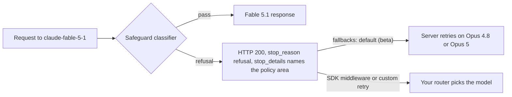

# Model Taxonomy

This chapter provides a comprehensive guide to the model landscape as of **October 1, 2026**, covering model families, capabilities, and selection criteria for production systems.

> **Last verified: October 1, 2026.** The model landscape evolves rapidly. Always cross-check with provider pricing pages and release notes.
>
> **October 2026 headline (mid-August to October 1):** Anthropic, OpenAI, Google, SpaceXAI, and Meta all shipped new models in September, and the story is price as much as capability. **Anthropic** shipped **Claude Fable 5.1 and Mythos 5.1** (September 1, same $10/$50 with cache reads cut to 0.025x), **Claude Opus 5.5** (September 22, the first Opus price cut since Opus 4.5, to $4/$20, and now Anthropic's "start here" default), and **Claude Sonnet 5.5** (September 28, $2/$10). **OpenAI** shipped **GPT-6 Astra** (September 3, $10/$50, a Daybreak-first staged rollout and the first OpenAI model rated Critical for cybersecurity), **GPT-6 Sol and Luna** (September 22, $2/$10 and $0.10/$0.50, about half the GPT-5.6 prices they replace, with no GPT-6 Terra), and **GPT-6.1 Sol** (September 29, same $2/$10 with 0.05x cache reads). **Google** shipped **Gemini 3.8 Flash** (September 2, its third Flash in six weeks, half price until January 1, 2027) plus a Fairwind-gated **3.8 Flash Cyber**, then on September 30 **announced Gemini 4 Argon**, which is rolling out to cyber defenders only and has no API model ID yet. **SpaceXAI** shipped **Grok 4.7** (September 21) on a new, larger base at an unchanged $2/$6, and **Meta** shipped **Muse Spark 1.3** (September 2). The practical consequences: the mid tier converged on **$2/$10** (Sonnet 5.5, GPT-6 Sol, GPT-6.1 Sol), cache-read multipliers now differ by model (0.1x, 0.05x, 0.025x), OpenAI bills the whole request at long-context rates above 272K input, and the newest Claude models reject forced `tool_choice` and bind thinking blocks to the producing model and conversation, which breaks naive routers. Benchmarks reset too: Artificial Analysis re-baselined its Intelligence Index (v4.3, September 7; earlier scores are not comparable), Terminal-Bench 4.0 replaced 3.0, the public SWE-Bench Pro split saturated, and Claude scores now carry a "with fallback" label. On open weights, **Z.ai shipped GLM-5.3's weights on schedule** (August 28) under an MIT-plus license, **Xiaomi's MiMo-V2.6-Pro** (September 21, MIT) took the top open-weight spot, **DeepSeek V4.1-Flash** (September 10, MIT) cut Flash prices less than a month after the August 16 increase, and Qwen's new Community License requires a separate license for any MaaS or coding/office-assistant business. Retirements: the Assistants API shut down August 26, `gpt-5.4-cyber` was shut down October 1 on 20 days' notice, the original `gpt-4o-2024-05-13`, `o1`, `o3-mini`, and `o4-mini` snapshots leave the OpenAI API October 23, and Claude Sonnet 4.5 retires November 30. Vendor-reported numbers below are labeled as such.
>
> **August 2026 headline:** Most of the month's releases were post-training refreshes or derivatives rather than new pretraining runs, and no US frontier lab shipped a new flagship base model. The action moved to prices, licenses, and access control. The clear exception is Alibaba's Qwen3.8-Max, a genuinely new 2.4T base whose weights landed August 12. **Claude Sonnet 5's introductory $2/$10 per 1M became the permanent price on August 10**, and the scheduled September 1 rise to $3/$15 was canceled, making Sonnet 5 permanently cheaper than the Sonnet 4.6 it replaced. Running the other way, **DeepSeek raised V4 prices 3x to 12x effective August 16 at 16:00 UTC**, moving to peak and off-peak billing (off-peak is exactly half peak, and peak covers only 01:00-04:00 and 06:00-10:00 UTC on weekdays, excluding Chinese public holidays). That ended its run as the unambiguous cheap option. **OpenAI shipped GPT-5.6-Cyber** (August 10, $12.50/$75 per 1M) behind a new two-tier Daybreak Blue and Daybreak Red access program, the most concrete production example yet of capability-tiered gating. **Google released Gemini 3.7 Flash** (August 13) at half price through year-end, and **SpaceXAI released Grok 4.6** (August 12) with a 500K context. On open weights the licensing picture split: **Alibaba's Qwen3.8-Max** (August 12, 2.4T/95B active) shipped under a bespoke commercially gated license while its **Qwen3.8-27B** sibling (August 14) shipped plain Apache 2.0, **Meta returned to open weights with Muse Glimmer** (August 10, 30B, Apache 2.0), and **Z.ai withheld GLM-5.3's weights** pending safety evaluation after cyber capability grew faster than expected (the weights then shipped on schedule, August 28). **Claude Opus 4.1 retired on August 5**, closing out the last $15/$75 Opus tier. Benchmark figures throughout this section are largely vendor-reported; confirm on independent leaderboards.
>
> **July 2026 headline:** Anthropic shipped a full generation refresh: **Claude Sonnet 5** (June 30, `claude-sonnet-5`, new default everywhere, introductory $2/$10 per 1M, made permanent on August 10) and **Claude Opus 5** (July 24, `claude-opus-5`, unchanged $5/$25 with an optional Fast mode at $10/$50 about 2.5x faster). **Claude Fable 5 was restored globally July 1** after the export-control suspension, with a new jailbreak-specific cybersecurity classifier; Mythos 5 returned only to roughly 100 US critical-infrastructure organizations via Project Glasswing. **GPT-5.6 (Sol, Terra, Luna) reached general availability July 9**, and on July 30 OpenAI cut Luna 80% to $0.20/$1.20 and Terra 20% to $2/$12 (Sol stayed at $5/$30 until a promotional cut to $4/$20 on August 21). The open-weight frontier had its strongest month ever: **Moonshot Kimi K3** (July 16, weights July 27) is the largest open-weight model to date at 2.8T total / 104B active with a 1M context, and **Thinking Machines Lab** debuted **Inkling** (July 15, 975B / 41B active, open weights), the leading US open-weights model at the time. Google shipped **Gemini 3.6 Flash**, **3.5 Flash-Lite**, and a government-gated **3.5 Flash Cyber** (July 21) while delaying Gemini 3.5 Pro. **Meta Muse Spark 1.1** (July 9) arrived with Meta's first paid self-serve model API ($1.25/$4.25 per 1M). Black Forest Labs announced **FLUX 3** (July 23), a unified image, video, audio, and action model, in gated early access. Benchmark figures across these launches are largely vendor-reported; confirm on independent leaderboards.
>
> **June 2026 headline:** Anthropic released **Claude Fable 5** (June 9, `claude-fable-5`, $10/$50 per 1M, 1M context), its most capable widely released model: a Mythos-class model made safe for general availability, with an Opus 4.8 fallback safeguard on sensitive topics. **Claude Mythos 5** ships the same day as the unrestricted variant for Project Glasswing partners, succeeding Mythos Preview at less than half its price.
>
> **June 10-26 update:** A dense second wave of June launches followed. **Google DeepMind DiffusionGemma** (June 10, Apache 2.0) is Google DeepMind's first open-weight text-diffusion model: a 26B Mixture-of-Experts (~4B active) that denoises blocks of tokens in parallel for roughly 4x faster generation on a single H100, trading some quality versus standard Gemma 4. **Gemini 3.5 Live Translate** (June 9 per launch coverage; Google's changelog has no entry for it, and the current ID is `gemini-3.5-live-translate-preview`) added real-time speech-to-speech translation across 70+ languages in public preview via the Gemini Live API and AI Studio. **Cohere North Mini Code 1.0** (June 9, Apache 2.0) is Cohere's first open coding model, a 30B / 3B-active MoE that runs on one H100. **Moonshot Kimi K2.7 Code** (June 12, Modified MIT) tunes K2.6 for long-horizon software work (1T / 32B-active MoE, roughly 30% fewer thinking tokens). **Z.ai GLM-5.2** (coding-plan access June 13, open weights under MIT June 16-17) is a 744B / 40B-active MoE with a 1M context that reports SWE-Bench Pro 62.1, ahead of GPT-5.5 on that benchmark, at roughly $1.40 / $4.40 per 1M. **xAI Grok Imagine Video 1.5** reached general availability June 16 (image-to-video with synchronized audio, $0.080 per second of video), and **Grok 4.3** arrived on Amazon Bedrock June 15 ($1.25 / $2.50 per 1M, xAI's first model there). Alibaba's official Qwen Cloud changelog lists a June snapshot adding vision to **Qwen 3.7-Max** (text-only at its May launch), though some independent coverage attributes that vision update to Qwen 3.7-Plus instead, so verify before relying on it. Separately, on June 12 Anthropic suspended access to Claude Fable 5 and Claude Mythos 5 following a US export-control directive, with Mythos 5 later cleared for a limited set of US institutions. Then on June 26, OpenAI previewed **GPT-5.6** (Sol, Terra, and Luna), its next-generation line, in a limited release to a small set of US-government-approved partners over dual-use cybersecurity concerns, echoing the Anthropic restriction; Sol claims a new Terminal-Bench 2.1 record and Terra targets GPT-5.5-level quality at about half the cost. Coding scores here are largely vendor-reported; confirm on independent leaderboards.
>
> **May 2026 recap:** Anthropic Claude Opus 4.8 (May 28, same $5/$25 price as Opus 4.7; Dynamic Workflows research preview with hundreds of parallel subagents; fast mode at $10/$50 is 3x cheaper than the Opus 4.7 fast mode); OpenAI GPT-5.5 (April 23) and GPT-5.5 Instant (May 5, default in ChatGPT); Claude Opus 4.7 (April 16, GA on Bedrock/Vertex/Foundry); Google Gemma 4 (April 2, Apache 2.0) and Gemini 3.2 Flash (quiet rollout May 5); DeepSeek V4 Pro and V4 Flash (April 24; 75% V4 Pro discount made **permanent** May 22, new list price $0.435/$0.87 per 1M from June 1); Moonshot Kimi K2.6 (April 20, 1T MoE / 32B active); Alibaba Qwen 3.6 Plus / 3.6-35B-A3B / 3.6 Max-Preview; Mistral Medium 3.5 (April 29, unified chat/reasoning/coding/vision); Meta Muse Spark (April 8, first closed-weight Meta model); Llama 4 Behemoth release paused through fall 2026 amid capability concerns. SWE-bench Verified published leaders before the Fable 5 launch: Claude Mythos Preview 93.9%, GPT-5.5 88.7%, Claude Opus 4.8 88.6%; ARC-AGI-2 leader: GPT-5.5 at 85.0%. Anthropic describes Fable 5 as state of the art on nearly all tested benchmarks; standard numeric scores were not in the launch post, so verify on the leaderboards.

## Table of Contents

- [Model Categories](#model-categories)
- [Frontier Models (October 2026)](#frontier-models-october-2026)
- [Reasoning Models](#reasoning--math)
- [Open Source Models](#open-source-models)
- [Specialized Models](#specialized-models)
- [Embedding Models](#embedding-models)
- [Model Selection Framework & Semantic Routing](#model-selection-framework)
- [Sovereign AI & Data Residency](#sovereign-ai-and-data-residency)
- [Capability Comparison](#capability-comparison)
- [Interview Questions](#interview-questions)
- [References](#references)

---

## Model Categories

### By Capability Level (October 2026)

| Tier | Characteristics | Examples | Use Case |
|------|-----------------|----------|----------|
| **Frontier** | Highest capability ceiling; $10/$50 class or gated | Claude Fable 5.1, GPT-6 Astra, Claude Opus 5.5 (at $4/$20); Gemini 4 Argon announced, not GA | Hardest reasoning, long-horizon agents, ceiling-bound coding |
| **Workhorse ($2/$10 tier)** | Near-frontier agentic quality at mid-tier price | Claude Sonnet 5.5, GPT-6 Sol, GPT-6.1 Sol, Grok 4.7 ($2/$6), Muse Spark 1.3 ($1.25/$4.25) | Production agents, coding at scale, the default routing tier |
| **Fast/Efficient** | Lowest cost per token, high volume | GPT-6 Luna, Gemini 3.8 Flash, Claude Haiku 4.5, DeepSeek V4.1-Flash | Classification, extraction, routing, high-volume streaming |
| **Previous Generation (still served)** | Well characterized, often superseded within weeks | Claude Opus 5 / Sonnet 5 / Fable 5, GPT-5.6 Sol / Terra / Luna, Claude Opus 4.8, Gemini 3.7 Flash | Workloads that value stable, already-evaluated behavior |
| **Small/Edge** | Private, edge, single GPU | Gemma 4 (12B, E4B), Qwen3.8-27B, IBM Granite 4.2, Muse Glimmer 30B | Local privacy, on-device, single-GPU serving |
| **Reasoning-Heavy** | Extended internal reasoning at high effort | GPT-6 Astra (xhigh/max), Claude Fable 5.1, Claude Opus 5.5 at high effort, DeepSeek V4.1-Flash (effort 1-100) | Math, code debugging, multi-step logic |

Anthropic's only Haiku is still Haiku 4.5. Claude Haiku 5.5 was announced for "the coming weeks" but had not shipped as of October 1.

### By Reasoning Mode (October 2026)

| Mode | Capability | Models | Use Case |
|------|------------|--------|----------|
| **Minimal reasoning** | The fastest path the model allows | GPT-6.1 Sol at `low`, GPT-6 Luna at its lowest effort, Gemini 3.8 Flash at `low`, Claude Sonnet 5.5 at `between_tools`, Claude Haiku 4.5 | Chat, simple extraction |
| **Always-on reasoning** | Thinking cannot be switched off | Claude Opus 5.5 and Fable 5.1 (adaptive thinking always on), GPT-6 Astra (no `none` effort; `low` to `max`) | Math, code debugging, planning |
| **Dial-controlled** | Effort or thinking level per request | GPT-6.1 Sol (`low` to `max`, default `medium`), Claude Opus 5.5 (default `medium`), Gemini 3.8 Flash (`thinking_level`), DeepSeek V4.1-Flash (1-100) | Variable-complexity tasks |

**The off switch is going away.** Sonnet 5.5 returns a 400 on `thinking: {type: "disabled"}`, Opus 5.5 cannot disable thinking, and Astra has no `none` effort. Sampling knobs are going too: the Claude API returns a 400 for non-default `temperature` and `top_p` on Opus 4.7 and later, Astra accepts no `temperature`, `top_p`, or logprobs, and Google deprecated those parameters in the Gemini API on July 21. Effort is now the control surface, and defaults move between versions (Opus 5 defaulted to `high`, Opus 5.5 to `medium`), so set it explicitly on every route.

---

## Frontier Models (October 2026)

### Claude Opus 5.5 (Anthropic) - September 2026 NEW

| Attribute | Value |
|-----------|-------|
| Model ID | `claude-opus-5-5` (Bedrock: `anthropic.claude-opus-5-5`) |
| Context Window | 1M tokens; 128K max output (300K on Batch with the beta header) |
| Input / Output Cost | $4.00 / $20.00 per 1M (Opus 5: $5 / $25) |
| Cache / Batch | Cache write $5.00 (5 min) or $8.00 (1 hr); cache read $0.20 (0.05x input); Batch $2 / $10; minimum cacheable prompt 512 tokens |
| Fast mode | $8 / $40 per 1M (research preview, Claude API only), down from $10 / $50 on Opus 5 and Opus 4.8 |
| Thinking | Adaptive thinking always on (cannot be disabled); default effort `medium` (Opus 5 defaulted to `high`) |
| Availability | Claude API, Amazon Bedrock, Google Cloud, Microsoft Foundry, Claude Platform on AWS; zero data retention available |
| Benchmarks | Anthropic-reported: Terminal-Bench 4.0 66.4% at xhigh (SE ±2.6) vs Fable 5.1 55.8% (Anthropic's run) and GPT-6 Astra 57.9% (OpenAI's figure, high effort); OSWorld 2.1 partial 81.8%; GDPval-AA v2.1 1846 Elo; HLE with tools 67.7%. Independent: Artificial Analysis Intelligence Index v4.3.2 58 (max, with fallback), first overall |
| Released | September 22, 2026 (knowledge cutoff June 2026; retirement not sooner than September 22, 2027) |

**What it is:** The second Opus price cut (after Opus 4.5 came down from $15/$75), and the model Anthropic's docs now tell you to start with for most workloads. Fable 5.1 is reserved for demanding reasoning, long-horizon agentic work, or cases where Opus 5.5 at higher effort still falls short in your evals. A cheaper model that beats the more expensive Fable 5.1 on most of Anthropic's own agentic benchmarks inverts the usual "pay more for the ceiling" routing logic. Anthropic claims about 40% lower cost than Opus 5 on typical workloads (vendor-reported).

**Migration traps from Opus 5:** the default effort dropped from `high` to `medium`, so an unpinned upgrade changes both latency and quality; forced `tool_choice` (`any` or `tool`) returns a 400; thinking blocks are bound to the producing model and conversation; and on the Claude API and Google Cloud only `computer_toolset_20260801` is accepted for computer use. Opus 5.5 adds a biology safety classifier alongside the cyber one. When safeguards intervened during Anthropic's evals, cyber tasks were completed by Opus 4.8 and biology and frontier-LLM-development tasks by Opus 5, so the headline scores belong to a routed system, not one set of weights.

### Claude Sonnet 5.5 (Anthropic) - September 2026 NEW

| Attribute | Value |
|-----------|-------|
| Model ID | `claude-sonnet-5-5` |
| Context Window | 1M tokens; 128K max output |
| Input / Output Cost | $2.00 / $10.00 per 1M (unchanged from Sonnet 5) |
| Cache / Batch | Cache write $2.50 (5 min) or $4.00 (1 hr); cache read $0.20; Batch $1 / $5 |
| Thinking | Adaptive thinking on by default; the lowest setting is `between_tools` (accepted at `high` effort or below), and `thinking: {type: "disabled"}` returns a 400. Default effort `high` on the API, medium in Claude Code and the Claude apps |
| Availability | Claude API, Bedrock, Google Cloud, Foundry, Claude Platform on AWS; zero data retention available |
| Benchmarks | Anthropic-reported, with Opus 5.5 in parentheses: Terminal-Bench 4.0 70.6% (66.4%), CursorBench 4.0 55.5% (57.8%), GDPval-AA v2.1 1844 (1846), OSWorld 2.1 partial 80.1% (81.8%), HLE with tools 64.5% (67.7%). Independent: AA Intelligence Index v4.3.2 56 (max, with fallback) |
| Released | September 28, 2026 (knowledge cutoff June 2026; retirement not sooner than September 28, 2027) |

**What it is:** If these numbers hold up independently, a $2/$10 model sits within a few points of the flagship on agentic work, which collapses the case for sending most agent traffic to Opus. Anthropic claims 30%+ faster output than Sonnet 5 and up to 30% lower cost per task (vendor-reported). Anthropic's table puts Sonnet 5 at 10.3% on Terminal-Bench 4.0, against 52.3% for Opus 5 in the same table; treat that outlier with caution and do not use it as a baseline.

**Breaking changes vs Sonnet 5:** disabling thinking returns a 400 (send `between_tools` instead); forced tool use returns a 400; thinking blocks are bound to the model, the conversation, and the producing account (blocks sent from an unlinked account are dropped and recorded as `organization_binding_mismatch`); `computer_20251124` is rejected on the Claude API and Google Cloud; and non-default `temperature`, `top_p`, and `top_k` still return a 400. Sonnet 5 became a legacy model three months after launch.

### Claude Fable 5.1 and Mythos 5.1 (Anthropic) - September 2026 NEW

| Attribute | Value |
|-----------|-------|
| Model IDs | `claude-fable-5-1` (GA; Bedrock `anthropic.claude-fable-5-1`); `claude-mythos-5-1` (Project Glasswing only, per the docs) |
| Relationship | Same weights, different safeguards; Mythos 5.1 is the more permissive variant |
| Input / Output Cost | $10.00 / $50.00 per 1M (unchanged from Fable 5) |
| Cache / Batch | Cache write $12.50 (5 min) or $20.00 (1 hr); cache read $0.25 (0.025x input, down from $1.00 on Fable 5); Batch $5 / $25 |
| Context Window | 1M tokens at standard pricing; 128K max output |
| Thinking | Adaptive thinking always on; default effort `high` |
| Data handling | 30-day retention required; not available under zero data retention unless Anthropic expressly authorizes it (customers eligible for Enterprise Frontier Safeguards can use Fable 5.1 and Fable 5 with ZDR until EFS is ready) |
| Provenance | Anthropic's statistical text watermark on outputs on every platform; signed C2PA Content Credentials on generated media retrieved via the Files API |
| Benchmarks | Terminal-Bench 4.0: 57.88% at max on the tbench.ai leaderboard, 55.8% in Anthropic's own run. AA Intelligence Index v4.3.2: 53 (max, with fallback) |
| Released | September 1, 2026 (knowledge cutoff June 2026; retirement not sooner than September 1, 2027) |

**What changed:** the cost of staying on the ceiling model for long agent loops. Anthropic says the 75% cache-read cut lowers typical bills about 25% and highly agentic ones up to 45%, and that its newest cyber safeguards produce about 60% fewer false positives than Fable 5's earlier ones (both vendor-reported). Fable 5.1 may now be used to discover vulnerabilities but not to develop exploits. Fable 5 remains available.

**Mythos 5.1 access:** Glasswing participants only, as of October 1. Anthropic says it will also be offered through a Life Sciences Verification Program (first participants enrolled with the US government) and, "in the near future", a Cyber Verification Program for a set of US organizations.

**Safeguard fallback is now an API contract.** On Fable 5 a classifier hit handed the request to Opus 4.8 automatically. On Fable 5.1 it is explicit and configurable:



From September 24, refusals that arrive before any output in the `bio`, `frontier_llm`, and `reasoning_extraction` categories are billed on all platforms (other categories stay unbilled); mid-stream refusals bill the input plus the output already streamed; and fallback credit refunds the prompt-cache cost of switching models. Budget for refusals, and route on `stop_reason`, not HTTP status.

### Claude 5.5 / 5.1 Migration Checklist

| Change | Applies to | What breaks | Do this instead |
|---|---|---|---|
| Forced `tool_choice` (`any` or `tool`) returns 400 | Fable 5.1, Mythos 5.1, Opus 5.5, Sonnet 5.5 | Structured extraction that forces a tool call | `auto` plus strict tool use, or structured outputs |
| Thinking blocks bound to model and conversation | Fable 5.1, Opus 5.5, Sonnet 5.5 (Mythos 5.1 skips the prefix check) | Replaying history to another model silently drops reasoning; editing anything before a thinking block returns 400 for accounts created on or after August 31, 2026 | Treat history as append-only; opt into `prefix_mismatch_behavior: "drop_block"` with the `thinking-binding-controls-2026-08-01` beta header |
| Thinking cannot be disabled | Opus 5.5; Sonnet 5.5's floor is `between_tools` | Latency budgets that assumed thinking off | Set effort explicitly and re-measure latency |
| Default effort changed | Opus 5.5 is `medium` (Opus 5 was `high`) | Silent quality and latency shift on upgrade | Pin effort on every request |
| `computer_20251124` rejected | Opus 5.5 and Sonnet 5.5 on the Claude API and Google Cloud (Bedrock still accepts it) | Computer-use agents on the old tool version | Move to `computer_toolset_20260801` |
| Pre-output refusals billed in three categories | All platforms since September 24 | Cost models that treat refusals as free | Track `stop_reason: "refusal"` as a cost line |

Two smaller changes trip harnesses: text between tool calls now arrives in `thinking` blocks that are empty at the default `display: "omitted"` (the `display: "updates"` beta returns the text), and supporting betas shipped for per-message effort and turn-scoped system messages (September 1), compaction on demand (`compact-2026-09-04`, September 14), and inline tool definitions mid-conversation without cache loss (`inline-tools-2026-09-15`, September 22).

### Claude Haiku 4.5 (Anthropic) - Still the Only Haiku

Haiku 4.5 remains Anthropic's fast tier. Its retirement floor is "not sooner than October 15, 2026", but it had no deprecation notice as of October 1, and with Anthropic's 60-day minimum notice it should not retire on the Claude API before about December. Microsoft Foundry lists `claude-haiku-4-5` for retirement on November 15, 2026. Haiku 5.5 is announced, not shipped, so fast-tier designs built on Haiku 4.5 should keep a GPT-6 Luna or Gemini 3.8 Flash fallback ready and plan an eval pass when Haiku 5.5 lands.

### Claude Opus 5 (Anthropic) - July 2026, SUPERSEDED by Opus 5.5

| Attribute | Value |
|-----------|-------|
| Model ID | `claude-opus-5` |
| Context Window | 1M tokens (default and max; 128K max output) |
| Input / Output Cost | $5.00 / $25.00 per 1M (unchanged from Opus 4.8) |
| Fast mode | $10.00 / $50.00 per 1M, about 2.5x faster |
| Benchmarks | Anthropic's launch post reported the pre-release benchmark it called Frontier-Bench v0.1 (later Terminal-Bench 3.0, itself replaced by Terminal-Bench 4.0 on August 28; scores do not carry over): 43.3% at max effort vs GPT-5.6 Sol's 34.4%, Fable 5's 33.7%, and Opus 4.8's 18.7%; within 0.5% of Fable 5 on CursorBench 3.2 at about half the cost per task. Vendor-reported. Since then: Terminal-Bench 4.0 leaderboard 53.94% at xhigh; SWE-Bench Pro v2 (Scale, September 22) 99.4% on the saturated public split and 81.6% (222/272) on the private set, the top private score Scale published |
| Released | July 24, 2026 (Claude API, Claude Code, Claude Cowork; new default on Claude Max) |

**What it is:** The Opus line's generational successor at unchanged pricing, aimed at long-horizon agentic coding and computer use. Beta features include mid-conversation tool changes and automatic fallback routing. The dual-price Fast mode continues the pattern Opus 4.8 introduced: one model, two latency tiers.

**Status:** Superseded by Opus 5.5 on September 22 at a lower price ($4/$20 vs $5/$25). Still available as a legacy model, and one of Fable 5.1's two permitted safeguard fallback targets (with Opus 4.8).

### Claude Sonnet 5 (Anthropic) - June 2026, SUPERSEDED by Sonnet 5.5

| Attribute | Value |
|-----------|-------|
| Model ID | `claude-sonnet-5` |
| Context Window | 1M tokens per third-party coverage (not stated in the launch post) |
| Input / Output Cost | $2.00 / $10.00 per 1M (permanent since August 10, 2026) |
| Cache / Batch | Cache write $2.50 per 1M (5 min) or $4.00 (1 hr); cache hit $0.20; Batch API $1.00 / $5.00 |
| Positioning | The most agentic Sonnet at launch: planning, browser and terminal tool use, autonomous operation approaching Opus 4.8 at lower cost |
| Safety posture | Cyber safeguards on by default; deliberately reduced cybersecurity capability relative to Opus-class models |
| Released | June 30, 2026 (default model across consumer and developer products same day) |

**What it is:** The production workhorse that replaced Sonnet 4.6 as the default. On August 10, 2026 Anthropic made the introductory $2/$10 rate permanent and canceled the September 1 increase to $3/$15, so Sonnet 5 is permanently cheaper than the Sonnet 4.6 it succeeded (still $3/$15).

**Status:** Superseded by Sonnet 5.5 on September 28 at the same price; still available as legacy. Separately, Anthropic deprecated Claude Sonnet 4.5 (`claude-sonnet-4-5-20250929`) on September 30, with retirement on November 30, 2026 on the Claude API and Foundry and `claude-sonnet-5-5` as the named replacement.

### Claude Fable 5 (Anthropic) - June 2026, SUPERSEDED by Fable 5.1

| Attribute | Value |
|-----------|-------|
| Model ID | `claude-fable-5` |
| Context Window | 1M tokens (Opus 4.7 tokenizer; roughly 30% more tokens than pre-4.7 models for the same text) |
| Max Output | 128K tokens |
| Input Cost | $10.00 / 1M tokens |
| Output Cost | $50.00 / 1M tokens |
| Thinking | Adaptive thinking, always on (no separate extended-thinking toggle) |
| Multimodal | Text + Vision (new state of the art on vision tasks per Anthropic) |
| Benchmarks | State of the art on nearly all tested benchmarks per Anthropic; highest frontier score on Cognition's FrontierCode, highest on the Hebbia Finance Benchmark, ViBench, and CursorBench. Standard numeric scores (SWE-bench, GPQA) were not published in the launch post. |
| Released | June 9, 2026 (GA on Claude API, Claude Platform on AWS, Amazon Bedrock, Vertex AI, Microsoft Foundry) |

**What it is:** A Mythos-class model made safe for general availability. Until then the Mythos line (SWE-bench Verified 93.9% on Mythos Preview) was restricted to ~11 Project Glasswing partners over dual-use cybersecurity concerns. Fable 5 brought that capability tier to everyone by pairing it with conservative safeguards.

**The Opus 4.8 fallback safeguard:** When Fable 5's classifiers detected a request in one of three categories (offensive cyber techniques, bioweapon-adjacent biology and chemistry, or attempts to distill the model), the response was delegated to **Claude Opus 4.8** and the user was informed. Anthropic said this triggered in under 5% of sessions and was deliberately tuned conservative, so some harmless requests got caught. Architecturally this is a production example of **model-tier routing as a safety control**, not just a cost control. Fable 5.1 turned it into the explicit, billable API contract described above.

**Considerations:** 2x the per-token price of Opus 4.8 ($10/$50 vs $5/$25). Mythos-class traffic carries a 30-day data retention requirement (not used for training; access-logged; deleted after 30 days in almost all cases), which matters for compliance reviews. On subscription plans it was included at no extra cost June 9-22, then moved to usage credits. Fable 5 cache reads were $1.00 per 1M; Fable 5.1 cut them to $0.25 at the same list price, so there is little reason to start new work on Fable 5.

### Claude Mythos 5 (Anthropic) - June 2026, SUPERSEDED by Mythos 5.1

| Attribute | Value |
|-----------|-------|
| Model ID | `claude-mythos-5` |
| Status | Limited availability: Project Glasswing partners and select biology researchers |
| Relationship | Same underlying model as Fable 5 with safeguards lifted in some areas |
| Pricing | $10 / $50 per 1M (less than half of Mythos Preview) |
| Released | June 9, 2026 |

**Why it matters:** Succeeded Claude Mythos Preview at comparable or somewhat stronger capability and much lower price. The Fable/Mythos split formalized a two-track release pattern: one safeguarded general release, one unrestricted release for vetted defenders. Mythos 5.1 continues it.

### Claude Opus 4.8 (Anthropic) - May 2026, Legacy

| Attribute | Value |
|-----------|-------|
| Context Window | 1M tokens (standard pricing across the full window) |
| Input Cost | $5.00 / 1M tokens (same as 4.7) |
| Output Cost | $25.00 / 1M tokens (same as 4.7) |
| Cache: 5m write | $6.25 / 1M tokens |
| Cache: 1h write | $10.00 / 1M tokens |
| Cache: hit / refresh | $0.50 / 1M tokens |
| Batch API | $2.50 / $12.50 per 1M (50% discount) |
| Fast mode (research preview) | $10 / $50 per 1M (about 2.5x faster; 3x cheaper than the Opus 4.7 fast mode which was $30 / $150) |
| Extended Thinking | Native, adaptive mode |
| Multimodal | Text + Higher-resolution Vision |
| SWE-bench Verified | 88.6% |
| SWE-Bench Pro | 69.2% (up from 64.3% on Opus 4.7) |
| Terminal-Bench 2.1 | 74.6% (GPT-5.5 led at 78.2% at release) |
| GDPval-AA | 1890 Elo (up from 1753 on Opus 4.7) |
| OSWorld-Verified | 82.3% |
| Online-Mind2Web | 84% |
| Released | May 28, 2026 (GA on Claude API, AWS Bedrock, Vertex AI) |

**Best for:** Long-running autonomous coding work in Claude Code, codebase-scale migrations, agentic workflows that need parallel subagents, and workloads where the alignment and honesty gains matter. It is also one of Fable 5.1's two permitted safeguard fallback targets (with Opus 5), and Anthropic's Opus 5.5 evals routed cyber tasks to it when safeguards intervened, so it stays in production paths even for teams that never call it directly.

**Key features over Opus 4.7:**
- **Dynamic Workflows** (research preview): Claude plans the work and runs hundreds of parallel subagents in a single Claude Code session, verifies their outputs, and reports back. Suited for codebase-scale migrations across hundreds of thousands of lines.
- **Mid-task system messages**: The Messages API now accepts system messages mid-conversation, useful for steering long agent runs without ending the session.
- **Optional fast mode** at roughly 2.5x speed for $10 / $50 per 1M, priced 3x lower than the Opus 4.7 fast mode.
- **Effort-control toggle** in `claude.ai` and Cowork lets users tune reasoning depth per turn.
- **Expanded Claude Code rate limits**.

**Considerations:** Tokenizer is the same one introduced in Opus 4.7 (up to 35% more tokens than the pre-4.7 tokenizer for the same fixed text). At release, GPT-5.5 held the SWE-Bench Verified leaderboard at 88.7% and led Terminal-Bench 2.1 at 78.2%. GPQA Diamond slipped 0.6 pts versus Opus 4.7. Anthropic's tokenizer change means token counts and bills for the same text are not directly comparable to pre-4.7 models. There was no Claude Sonnet 4.8; the line jumped to **Claude Sonnet 5** on June 30, 2026, which replaced Sonnet 4.6 as the production workhorse. For new work, Opus 5.5 is cheaper ($4/$20) and stronger.

> [!NOTE]
> **Retired August 5, 2026:** `claude-opus-4-1-20250805` was removed from the Claude API, closing out the last $15/$75 per 1M Opus tier. At that point every first-party Opus SKU was $5/$25 ($10/$50 in Fast mode); Opus 5.5 later cut the current Opus to $4/$20. Amazon Bedrock and Google Cloud set their own schedules: on Bedrock, Opus 4.1 moves into higher-priced public extended access on October 8, 2026 and reaches end of life on January 8, 2027. Code pinned to that ID fails on the first-party API while still working on the partner clouds.

### Claude Opus 4.7 (Anthropic) - April 2026, Legacy

| Attribute | Value |
|-----------|-------|
| Context Window | 1M tokens |
| Max Output | 128K tokens |
| Input Cost | $5.00 / 1M tokens (same as 4.6) |
| Output Cost | $25.00 / 1M tokens (same as 4.6) |
| Extended Thinking | Native, Adaptive mode |
| Multimodal | Text + Higher-resolution Vision |
| SWE-bench Verified (Adaptive) | 87.6% (May 13, 2026) |
| Released | April 16, 2026 (GA on API, Bedrock, Vertex, Microsoft Foundry) |

**Status:** Still available as a legacy model. It powered Claude Code at release; Claude Code's default Opus has been Opus 5.5 since 2.1.280. Prefer Opus 5.5 for new work: it is cheaper and stronger.

### Claude Mythos Preview (Anthropic) - SUCCEEDED BY MYTHOS 5 AND 5.1

| Attribute | Value |
|-----------|-------|
| Status | Restricted research preview, Project Glasswing partners only (~11 orgs: AWS, Apple, Cisco, Google, Microsoft, NVIDIA, Palo Alto, etc.); deprecated since June 9, 2026, retirement date to be announced |
| Reason for restriction | Dual-use cybersecurity capabilities |
| SWE-bench Verified | 93.9% (May 13, 2026; the published SOTA before the Fable 5 / Mythos 5 launch) |
| Released | April 7, 2026 (restricted partner preview); succeeded by Claude Mythos 5 on June 9, 2026 at less than half the price |

**Best for:** Historical reference. Its capability tier reached general availability as Claude Fable 5 on June 9, 2026; new Glasswing work should target Mythos 5.1.

### Claude Opus 4.6 (Anthropic) - February 2026, Legacy

| Attribute | Value |
|-----------|-------|
| Context Window | 1M tokens |
| Max Output | 128K tokens |
| Input Cost | $5.00 / 1M tokens |
| Output Cost | $25.00 / 1M tokens |
| Extended Thinking | Native adaptive thinking (configurable budget_tokens) |
| Multimodal | Text + Vision |
| Highlights | Anthropic's flagship at release; now legacy |
| Released | February 2026 |

**Status:** Still available. Opus 5.5 is cheaper ($4/$20 vs $5/$25) and stronger, so there is no cost reason to stay on it.

### Claude Sonnet 4.6 (Anthropic) - February 2026, Legacy

| Attribute | Value |
|-----------|-------|
| Context Window | 1M tokens |
| Input Cost | $3.00 / 1M tokens |
| Output Cost | $15.00 / 1M tokens |
| Extended Thinking | Supported |
| Multimodal | Text + Vision |
| Highlights | Handled tasks that previously required the Opus tier; the cost/quality default through mid-2026 |
| Released | February 2026 |

**Status:** Still available, but at $3/$15 it now costs more than Sonnet 5.5 ($2/$10). Migrate unless your evals say otherwise.

### GPT-6 Astra (OpenAI) - September 2026 NEW

| Attribute | Value |
|-----------|-------|
| Model ID | `gpt-6-astra` |
| Context Window | 1.05M tokens; 128K max output; knowledge cutoff April 30, 2026 |
| Input / Output Cost | $10.00 / $50.00 per 1M; above 272K input the whole request bills at $20 / $75 |
| Cache | Cached input $1.00; cache write $12.50; fixed 30-minute TTL |
| Service tiers | Batch and Flex 50% off; Fast 2x ($20 / $100); Ultrafast 6x ($60 / $300, GA September 29, Responses API) |
| Reasoning | Efforts `low`, `medium`, `high`, `xhigh`, `max`; no `none`; no custom `temperature`, `top_p`, or logprobs; tool calling requires the Responses API |
| Availability | Staged rollout from September 3 (Daybreak organizations first), in the API by September 5; Amazon Bedrock GA September 8 (In-Region and Geo inference $11 / $55, 10% over Global); Microsoft Foundry GA |
| Safety rating | First OpenAI model rated Critical for cybersecurity under its Preparedness Framework; High for biological and chemical capability. OpenAI says covert sandbagging is likely not reliably caught |
| Benchmarks | Terminal-Bench 4.0 leaderboard 58.18% at max (rank 1, tbench.ai, September 21). ARC-AGI-3 (ARC Prize): 62.7% on the provider-neutral Standard harness (max, $26,098) vs 99.9% on OpenAI's Provider Adapter harness (high, $18,817). AA Intelligence Index v4.3.2: 53 (max) |
| Released | September 3, 2026 |

**What it is:** OpenAI's new ceiling model, at the same $10/$50 as Claude Fable 5.1. Three things change cost models. First, speed is a priced axis with three rungs (Standard, Fast at 2x, Ultrafast at 6x), so a latency SLO is a budget decision. Second, the 272K cliff applies to the entire request, so a prompt just over the line costs roughly twice one just under it: prompt-length routing is a cost control. Third, token efficiency: Artificial Analysis measured Astra using about a third of GPT-5.6 Sol's tokens per coding task, so its cost per task sits closer to the mid tier than the list price suggests.

**Read the harness:** the 37-point ARC-AGI-3 swing on the same model and test set comes from whether the scaffold preserves opaque reasoning state between requests. Quote Astra's numbers with harness, effort, and who ran them.

### GPT-6 Sol and GPT-6 Luna (OpenAI) - September 2026 NEW

| Attribute | Value |
|-----------|-------|
| Model IDs | `gpt-6-sol`, `gpt-6-luna` (text and image in, text out; Responses and Chat Completions) |
| Context Window | 1.05M tokens; 128K max output |
| Sol pricing | $2.00 / $10.00 per 1M; cached input $0.20; cache write $2.50; above 272K $4 / $15 |
| Luna pricing | $0.10 / $0.50 per 1M; cached input $0.01; cache write $0.125; above 272K $0.20 / $0.75 |
| Batch / Flex | Sol $1 / $5; Luna $0.05 / $0.25 |
| Lineage | Same types of data and training as GPT-6 Astra, per OpenAI. They replace GPT-5.6 Sol and Luna at about half the price; no GPT-6 Terra was announced |
| Availability | API and Amazon Bedrock GA September 22, 2026 |
| Known issue | An image-encoding bug degraded image understanding and computer use until a September 25 fix shipped under the same model IDs; OpenAI told customers to rerun image evals |
| Released | September 22, 2026 |

**Why it matters:** Luna at $0.10/$0.50 is OpenAI's cheapest model and undercuts DeepSeek V4.1-Flash even off-peak ($0.15/$0.60); only Gemini 2.5 Flash-Lite ($0.10/$0.40, existing users only) and Meta's data-for-discount Muse Spark contributor tier come in lower. With no Terra successor, three-tier OpenAI routing designs collapse to two, or keep GPT-5.6 Terra at $2/$12, which GPT-6 Sol now undercuts on output. The image bug is the operational lesson: a provider-side fix changed behavior under a stable ID, so evals must rerun on vendor changelog events, not only on model-ID changes. OpenAI's Sol post reports GPT-6 Sol at xhigh 60.5% vs Claude Opus 5 at medium 60.3% on its offline OSWorld 2.0 set (vendor-reported).

### GPT-6.1 Sol (OpenAI) - September 2026 NEW

| Attribute | Value |
|-----------|-------|
| Model ID | `gpt-6.1-sol` |
| Context Window | 1.05M tokens; 128K max output; knowledge cutoff April 30, 2026 |
| Input / Output Cost | $2.00 / $10.00 per 1M; above 272K $4 / $15 |
| Cache | Cached input $0.10 (0.05x, half of GPT-6 Sol's rate); cache write $2.50 |
| Reasoning | `low`, `medium` (default), `high`, `xhigh`, `max` |
| Features | Hosted shell, computer use, MCP, multi-agent delegation (beta, Responses API) |
| Availability | API; Amazon Bedrock, where it follows OpenAI's lifecycle and deprecation terms rather than a Bedrock minimum-availability date |
| Benchmarks | AA Intelligence Index v4.3.2: 52 (max) |
| Released | September 29, 2026 |

**What it is:** OpenAI's model for complex coding and professional work at a lower cost than Astra, shipped one week after GPT-6 Sol at the same list price. Codex CLI switched its default to GPT-6.1 Sol in rust-v0.159.1 the same day, a silent default swap for anyone who had not pinned a model. Note the Bedrock terms: cross-cloud availability no longer implies a cloud-guaranteed support window.

### GPT-5.4 (OpenAI) - March 2026

| Attribute | Value |
|-----------|-------|
| Context Window | 272K tokens (standard); extended available |
| Input Cost | $2.50 / 1M tokens (cached $0.25) |
| Output Cost | $15.00 / 1M tokens |
| Multimodal | Text, Vision, native computer use |
| Highlights | Built-in computer-use capabilities; 33% fewer factual errors vs GPT-5.2; combines coding + agentic strengths |
| Released | March 2026 |

**Best for:** Existing agentic workflows already validated on it.
**Considerations:** Above 272K input tokens the whole request bills at long-context rates ($5 / $22.50). GPT-6 Sol is cheaper ($2/$10) for new builds.

### GPT-5.4-mini (OpenAI) - March 2026

| Attribute | Value |
|-----------|-------|
| Context Window | 272K tokens |
| Input Cost | $0.75 / 1M tokens |
| Output Cost | $4.50 / 1M tokens |
| Highlights | Cost/performance option for high-volume GPT-5 tier workloads |
| Released | March 2026 |

**Best for:** High-volume API calls already tuned on it. For new volume tiers, GPT-6 Luna ($0.10/$0.50) is far cheaper. GPT-5.4-nano is $0.20 / $1.25 and retires April 1, 2027.

### GPT-5.4 Pro (OpenAI) - March 2026

| Attribute | Value |
|-----------|-------|
| Context Window | 272K tokens |
| Input Cost | $30.00 / 1M tokens |
| Output Cost | $180.00 / 1M tokens |
| Highlights | Maximum reasoning power; premium tier for hardest tasks |
| Released | March 2026 |

**Best for:** Competition-level math, complex multi-step reasoning.
**Considerations:** Very expensive. GPT-5.4 Pro is still listed at $30 / $180, the same as GPT-5.5 Pro, the newer dedicated Pro ID. On the GPT-5.6 and GPT-6 families Pro is a mode (`reasoning.mode: "pro"`) billed at the selected model's standard rates.

### GPT-5.6 Sol / Terra / Luna (OpenAI) - GA July 9, 2026 (Sol and Luna superseded by GPT-6)

| Attribute | Value |
|-----------|-------|
| Variants | Sol (flagship), Terra (balanced), Luna (fast, low cost) |
| Context Window | 1M tokens (all three); 128K max output; knowledge cutoff February 16, 2026 |
| Sol pricing | $5.00 / $30.00 per 1M list; promotional $4 / $20 since August 21, 2026, guaranteed only "at least through November 21, 2026", so budget on list |
| Terra pricing | $2.00 / $12.00 per 1M (cut 20% from $2.50/$15 on July 30) |
| Luna pricing | $0.20 / $1.20 per 1M (cut 80% from $1/$6 on July 30) |
| Long context | Above 272K input the whole request bills at Sol $8 / $30 (promotional), Terra $4 / $18, Luna $0.40 / $1.80 |
| Speed tiers | Fast (renamed from Priority on July 30) at 2x; Ultrafast at 6x in preview on Sol |
| Reasoning | "max" reasoning effort plus an "ultra" mode that uses subagents to accelerate complex work |
| API features at GA | Programmatic tool calling, multi-agent support, explicit prompt-cache breakpoints |
| Benchmarks | Sol: 53.6 on Agents' Last Exam (13.1 points ahead of Claude Fable 5) and a Terminal-Bench 2.1 record. Claude Fable 5 led SWE-Bench Pro (80 vs Sol's 64.6), a benchmark OpenAI publicly disputes. Vendor-reported. On the Terminal-Bench 4.0 leaderboard, Sol scores 37.27% at max |
| Released | Limited preview June 26, 2026; general availability July 9, 2026 |

**What it is:** OpenAI's first flagship line shipped as three models. The June 26 preview was gated at the request of the US government over dual-use cybersecurity capability; GA followed a 13-day review. The three-tier structure plus the July 30 cuts reset routing math for tiered model selection.

**Status (October 2026):** GPT-6 Sol and Luna replace Sol and Luna at about half the price. Terra has no GPT-6 successor and stays at $2/$12. This family will stay in production for a while anyway: Foundry moves its retiring o-series deployments to GPT-5.6 Sol and Terra on November 19, and OpenAI's December 11 retirement of the dated GPT-5 and o3 snapshots points to the GPT-5.6 models.

### GPT-5.6-Cyber (OpenAI) - August 2026 (restricted)

| Attribute | Value |
|-----------|-------|
| Model ID | `gpt-5.6-cyber` |
| Context Window | 400K total (272K max input, 128K max output) |
| Input / Output Cost | $12.50 / $75.00 per 1M; cached input $1.25 |
| Access | Daybreak Red tier only, with identity verification, legal attestations, and approved use cases. Responses API only. Hardware security keys were scheduled to become mandatory on individual Daybreak accounts from September 1, 2026 (enforcement not independently confirmed) |
| Refusal posture | Trained for a lower refusal rate on dual-use security work: 95.0% completion on OpenAI's internal Advanced Cybersecurity Completion Rate eval versus 1.5% for GPT-5.6 Sol |
| Released | August 10, 2026 (the Daybreak Blue and Red tier split appears in the API changelog dated August 7) |

**What it is:** A cybersecurity model built on GPT-5.6 Sol, shipped alongside a split of the Daybreak program into two tiers. **Daybreak Blue** gives approved defenders access to general-purpose frontier models for vulnerability discovery, secure code review, detection engineering, and incident response. **Daybreak Red** is separately approved and gates `gpt-5.6-cyber` for vulnerability reproduction, exploit validation, penetration testing, and red teaming.

**Why it matters architecturally:** A model that is deliberately *more* permissive than the frontier default, priced at 2.5x Sol's list price, restricted to a single API surface, and fenced behind identity verification is a reference design for how labs operationalize dual-use access. Gated models also retire fast: OpenAI deprecated the earlier `gpt-5.4-cyber` on September 11 and shut it down October 1, about 20 days' notice against its stated 3-month minimum for specialized variants.

### Capability-Tiered Access Programs (October 2026)

| Lab | Program | Gated model(s) | Who gets in |
|---|---|---|---|
| Anthropic | Project Glasswing; Life Sciences Verification Program; Cyber Verification Program (announced) | Claude Mythos 5.1 (same weights as Fable 5.1, looser safeguards) | Glasswing partners; life-sciences participants enrolled with the US government; a set of US organizations for cyber "in the near future" |
| OpenAI | Daybreak Blue / Daybreak Red | Blue: general frontier models (Daybreak organizations got GPT-6 Astra first); Red: `gpt-5.6-cyber` | Approved defenders; Red is separately approved |
| OpenAI | Trusted access | `gpt-rosalind-research` (life sciences; GA September 8 at $5 / $25 per 1M, billed from October 5) | Approved life-sciences organizations |
| Google | Fairwind Program | Gemini 3.8 Flash Cyber; first access to Gemini 4 Argon, released to them without cyber guardrails | Government authorities, critical infrastructure operators, software maintainers |

**Design implication:** capability-tiered access is now an industry pattern, not a one-off. Treat a gated tier as a separate model with its own identity requirements, API surface, retention terms, and a much shorter retirement runway.

### GPT-5.5 (OpenAI) - April 2026

| Attribute | Value |
|-----------|-------|
| Context Window | 1M tokens |
| Input Cost | $5.00 / 1M tokens (cached $0.50) |
| Output Cost | $30.00 / 1M tokens |
| Long context / Fast | Above 272K input: $10 / $45. Fast is 2.5x ($12.50 / $75), not 2x as on newer models |
| Multimodal | Text, Image, Audio, Video |
| ARC-AGI-2 | 85.0% (leader as of May 13, 2026) |
| Released | April 23, 2026 |

**Best for:** Multimodal workloads already validated on it. Pitched at launch as a "new class of intelligence for real work", it replaced GPT-5.4 for top-tier reasoning and multimodal work.
**Considerations:** ~2× the input cost of GPT-5.4 ($2.50 → $5.00) and ~2× output ($15 → $30). For new builds, GPT-6 Sol ($2/$10) is cheaper and newer.

### GPT-5.5 Instant (OpenAI) - May 2026

| Attribute | Value |
|-----------|-------|
| Status | Became the ChatGPT default and `chat-latest` in the API on May 5, 2026 |
| Hallucination Reduction | 52.5% fewer on high-stakes prompts (medicine/law/finance) vs GPT-5.3 Instant |
| AIME 2025 | 81.2% (up from 65.4% on GPT-5.3 Instant) |
| Response Length | ~30% fewer words/lines than predecessor |
| Released | May 5, 2026 |

**Best for:** ChatGPT-equivalent chat workloads, high-stakes domains where hallucination reduction matters.
**Considerations:** Replaced GPT-5.3 Instant as the chat default. GPT-5.2-chat-latest and GPT-5.3-chat-latest deprecated May 8, 2026.

### OpenAI Voice Models: GPT-Live-1, GPT-Realtime-2.1, Transcription (October 2026)

| Model | Shape | Pricing | Status |
|---|---|---|---|
| `gpt-live-1` | Full-duplex voice front end that delegates reasoning and tools to a backend (an OpenAI Responses model or your own) on `v1/live/sessions` | $0.05 per session minute, billed per second, plus backend model tokens | GA September 10, 2026 |
| `gpt-realtime-2.1` / `gpt-realtime-2.1-mini` | Single speech-to-speech model on the Realtime API; turn-based with `server_vad` or `semantic_vad`; configurable reasoning effort | 2.1: audio $32 in / $0.40 cached / $64 out per 1M; mini: $10 / $0.30 / $20 | July 6, 2026 (succeeds `gpt-realtime-2`, May 7) |
| `gpt-realtime-translate` | Streaming translation, one session per target language | $0.034 per minute | Current |
| `gpt-transcribe` / `gpt-live-transcribe` | Batch / streaming speech-to-text | $0.0045 / $0.017 per minute | July 28, 2026 |
| `gpt-realtime`, `gpt-realtime-mini`, `gpt-4o-realtime`, `gpt-audio` | Legacy speech-to-speech and audio | - | Shut down January 20, 2027 (to `gpt-realtime-2.1`, `-2.1-mini`, or `gpt-audio-1.5`) |
| `whisper-1`, `gpt-4o-transcribe` family | Legacy speech-to-text | - | Shut down February 26, 2027 (to `gpt-transcribe` or `gpt-live-transcribe`) |
| `tts-1`, `tts-1-hd`, `gpt-4o-mini-tts` snapshots | Legacy text-to-speech | - | Shut down January 6, 2027 (announced October 1; to `gpt-realtime-2.1-mini`) |

**Three architectures, not two.** OpenAI's docs now describe full-duplex-plus-delegation (GPT-Live), a single speech-to-speech model (Realtime API), and a chained STT, LLM, TTS pipeline. GPT-Live separates the voice layer from the reasoning layer, so business rules and authoritative task state belong in the backend. Once its 128K context passes 90% full, it restarts the voice engine with the instructions plus at most 8,192 tokens of history (including a summary of older turns), so keep slots and bookings in application state. Realtime sessions cap at 60 minutes and re-send the conversation on every response, so cost grows with call length. OpenAI reports GPT-Live turn-taking latency of 0.798 s vs 1.41 s for `gpt-realtime-2.1` (vendor-reported, and dependent on the backend you pick). The Realtime API beta interface was removed May 12, 2026.

**Other vendors:** Google's `gemini-3.8-live` and `gemini-3.8-live-extended-thinking` went GA September 15 (audio $3 in / $12 out per 1M; asynchronous tool calls by default, and the Extended Thinking variant reasons in the background while it talks). Google reports tau-Voice 68.6% for Extended Thinking against 30.1% for the base model (vendor-reported), which is the pattern to design for: voice task success tracks the reasoning attached to the voice layer, and that reasoning has to fit the turn latency budget. `gemini-3.8-flash-tts` went GA September 22 at a promotional $0.50 / $9 per 1M through December 31 ($1 / $18 from January 1, 2027). xAI's `grok-voice-think-fast-2.0` speaks OpenAI-Realtime-compatible events at $0.08 per minute. Anthropic has no speech API: Claude can only be the text backend in a voice stack, for example behind GPT-Live client delegation. See [Realtime Voice Agents](../18-voice-and-audio-agents/01-realtime-voice-agents.md).

### Gemini 4 Argon (Google) - ANNOUNCED September 30, 2026, NOT GA

| Attribute | Value |
|-----------|-------|
| Status | Announced September 30, 2026. Rolling out first to trusted cyber defenders in the Fairwind Program (without cyber guardrails); paid API customers and Google AI Ultra subscribers come next, with no date given |
| Model ID | None published; not on the Gemini API models page or changelog as of October 1 |
| Announced pricing | Introductory $2 / $10 per 1M (no end date given), then $4 / $20; cached input 95% off |
| Output limit | 1M tokens, up from 64K (Google) |
| Benchmarks | Google-reported: DeepSWE v1.1 77.9%, AutomationBench 51.3%, LVBench 91.7%. AA Intelligence Index v4.3.2: 53 (high, scored before general availability) |
| Target workloads | Real-world software engineering, enterprise knowledge work (legal, finance), cyber defense |

**How to treat it:** as a planning input, not a dependency. Argon is a new Gemini 4 line, not the long-delayed Gemini 3.5 Pro. If the 1M-token output limit reaches the API, whole-repo rewrites and long document generation stop needing chunked generation loops, which is a real architecture change. Until there is a model ID, `gemini-3.1-pro-preview` remains Google's only Pro-tier API model.

### Gemini 3.8 Flash (Google) - September 2026 NEW

| Attribute | Value |
|-----------|-------|
| Model ID | `gemini-3.8-flash` (stable, GA) |
| Context Window | 1,048,576 tokens in / 65,536 out |
| Input / Output Cost | $0.75 / $3.75 per 1M through December 31, 2026; $1.50 / $7.50 from January 1, 2027. Batch and Flex 50% off; Priority $1.35 / $6.75 ($2.70 / $13.50 from January 1); cache read $0.075 per 1M plus storage |
| Modalities | Text, image, video, audio, PDF in; text out |
| Thinking | `thinking_level` `low`, `medium` (default), `high`; no minimal level; replaces `thinking_budget` |
| Tools | Function calling, structured outputs, caching, code execution, computer use (preview), file search, Search and Maps grounding; no Live API |
| Benchmarks | Google-reported: DeepSWE v1.1 73.7% vs Claude Opus 5 74.0%. Independent: AA Intelligence Index v4.3.2 41 (high); SWE-Bench Pro v2 private set 211/272 (Scale) |
| Released | September 2, 2026 |

**What it is:** Further training on Gemini 3.7 Flash rather than a new base, and Google's third Flash in six weeks. It is the Gemini model Google recommends for computer use. The per-token price is low, but coverage notes it spends more reasoning tokens per task. On DeepSWE v1.1, where it tied Astra and Opus 5 near 74%, its cost per task was $2.36 at high effort versus $4.43 for Astra at xhigh and $11.84 for Opus 5 at max. Model the January 2027 price before committing volume: 3.6, 3.7, and 3.8 Flash all double on the same day.

**Gemini 3.8 Flash Cyber:** announced the same day for trusted defenders in the new Fairwind Program, with more permissive cybersecurity mitigations and Google's CodeMender harness for find-verify-fix pipelines (Google reports CyberGym 86.2%). It replaces Gemini 3.5 Flash Cyber in Google's tiered-access lineup.

### Gemini 3.1 Pro Preview (Google) - February 2026

| Attribute | Value |
|-----------|-------|
| Model ID | `gemini-3.1-pro-preview` (Preview) |
| Context Window | 1M tokens |
| Input Cost | $2.00 / 1M tokens (standard); $4.00 (200K+) |
| Output Cost | $12.00 / 1M tokens (standard); $18.00 (200K+) |
| Multimodal | Native: Text, Vision, Audio, Video |
| Highlights | Google's top Pro-tier API model; strong agentic and coding capabilities |
| Released | February 2026 |

**Best for:** Complex reasoning, multimodal analysis, long-context workloads.
**Considerations:** Replaced Gemini 3 Pro Preview. As of October 1 it is the only 3-series Pro model on the Gemini API; there is no Gemini 3.5 Pro. Gemini 2.5 was not deprecated in June as once scheduled: on September 18 Google restricted the 2.5 models to users who had already used them, said they "are not deprecated", and pointed new projects to 3.5 Flash-Lite or 3.8 Flash. Google Cloud (Vertex AI) retires `gemini-2.5-pro`, `gemini-2.5-flash`, and `gemini-2.5-flash-lite` on October 20, 2026.

### Gemini Flash and Flash-Lite Lineup (Google)

| Model | Input / Output per 1M | Status |
|---|---|---|
| `gemini-3.8-flash` | $0.75 / $3.75 intro; $1.50 / $7.50 from January 1, 2027 | GA September 2, 2026; the current default |
| `gemini-3.7-flash`, `gemini-3.6-flash` | Same intro pricing as 3.8 Flash | Superseded by 3.8 Flash |
| Gemini 3.5 Flash | $1.50 / $9.00 | Available |
| Gemini 3.5 Flash-Lite | $0.30 / $2.50 | Google's pointer, with 3.8 Flash, for projects leaving 2.5 |
| Gemini 3.1 Flash-Lite | $0.25 / $1.50 | Shuts down May 7, 2027 (to 3.5 Flash-Lite) |
| Gemini 3 Flash Preview | $0.50 / $3.00 | Preview |
| Gemini 2.5 Flash-Lite | $0.10 / $0.40 | Existing users only since September 18 |

> **Watch for a phantom row:** a "Gemini 3.1 Flash" at $0.10 / $3.00 still circulates in older cost tables. No model with that name and price appears on Google's pricing page; the nearest are Gemini 3 Flash Preview and Gemini 3.1 Flash-Lite. Price new work on Gemini 3.8 Flash.

### Gemini 3.2 Flash (Google) - May 2026, Historical

| Attribute | Value |
|-----------|-------|
| Status | Quiet rollout in iOS Gemini app and Google AI Studio May 5, 2026 (no formal announcement) |
| Released | May 5, 2026 |

**Status:** Historical. Google's Flash line has since moved through 3.5, 3.6, 3.7, and 3.8; build on `gemini-3.8-flash`.

### Gemini Deep Research / Deep Research Max (Google) - April 2026

| Attribute | Value |
|-----------|-------|
| Built on | Gemini 3.1 Pro |
| Capabilities | MCP support; native chart/infographic generation; extended test-time compute; async background workflows |
| Released | April 21, 2026 |

**Best for:** Research agents, document synthesis, long-running async workflows. The MCP support made it the first Google research-agent product with first-class tool integration.

### Gemini Robotics-ER 1.6 (Google DeepMind) - April 2026

| Attribute | Value |
|-----------|-------|
| Domain | Physical robotics, embodied reasoning |
| New capability | Reading gauges/sight glasses |
| Deployment | Boston Dynamics Spot |
| Released | April 14, 2026 |

**Best for:** Robotics applications requiring vision-language grounding for physical actions. Available via Gemini API and AI Studio.

### Gemini 3.7 Flash (Google) - August 2026, SUPERSEDED by 3.8 Flash

| Attribute | Value |
|-----------|-------|
| Model ID | `gemini-3.7-flash` |
| Context Window | 1,048,576 tokens in / 65,536 out |
| Input / Output Cost | $0.75 / $3.75 per 1M through December 31, 2026, then $1.50 / $7.50. Context caching $0.075 per 1M; Batch $0.375 / $1.875 |
| Multimodal | Text, image, audio, video; agentic video understanding is opt-in (`"processing": "agentic"`), not on by default |
| Knowledge cutoff | March 2026 |
| Released | August 13, 2026 (GA) |

**What it is:** Google's workhorse tier, built on Gemini 3.6 Flash with what the model card describes as algorithmic improvements to the reasoning foundation rather than a new pretraining run. Customizable thinking configurations trade quality against cost and latency per request. Google-reported gains over 3.6 Flash include FrontierCode 1.1 Main 43.6% versus 34.4% and WebDev Arena Elo 1588 versus 1538.

**Agentic video (September 1):** with `"processing": "agentic"` on a video input, the model decides which segments to inspect, at what speed, and through which modality, instead of sampling at a fixed 1 FPS (still the default). Google reports up to 88% fewer tokens and up to 66% lower cost at standard token pricing, and the mode now covers 3.8 Flash, 3.7 Flash, 3.6 Flash, and 3.5 Flash-Lite. Video cost models built on fixed-FPS sampling can overestimate tokens by as much as roughly 8x.

**Considerations:** Superseded by 3.8 Flash on September 2 at the same intro price. Gemini 3.5 Pro still had not shipped by October 1; Google's next flagship was announced as Gemini 4 Argon instead.

### Grok 4.7 (SpaceXAI) - September 2026 NEW

| Attribute | Value |
|-----------|-------|
| Model ID | `grok-4.7` |
| Context Window | 500K tokens; text and image in, text out |
| Input / Output Cost | $2.00 / $6.00 per 1M below a 200K prompt; $4.00 / $12.00 on all tokens once the prompt reaches 200K. Cached input $0.50 ($1.00 at 200K+) |
| Fast variant | About 2x output speed at 2x price, offered only in Cursor and Grok Build (not a listed API model) |
| Knowledge cutoff | May 2026 per the API docs |
| Benchmarks | Terminal-Bench 4.0 leaderboard 37.58% at xhigh. AA Intelligence Index v4.3.2: 46, up from 44 for Grok 4.6 |
| Released | September 21, 2026 (Grok API, Grok Build, Cursor on all plans, OpenRouter and other gateways) |

**What it is:** Unlike most August releases, a new and larger base model, with a longer RL run weighted toward multi-hour tasks (per SpaceXAI). It is also this quarter's clearest case of vendor tables outrunning independent indices: large gains in SpaceXAI's own table, about 2 points on AA. Distribution now runs through Cursor, which became part of SpaceX in mid-August, and Grok launches appear on Cursor's blog. The whole-request 200K pricing trap carries over from 4.6.

### Grok 4.6 (SpaceXAI) - August 2026, SUPERSEDED by Grok 4.7

| Attribute | Value |
|-----------|-------|
| Model ID | `grok-4.6` |
| Context Window | 500K tokens |
| Input / Output Cost | $2.00 / $6.00 per 1M below a 200K prompt; $4.00 / $12.00 at or above 200K. Cached input $0.50 |
| Reasoning | Effort settings low, medium, high (default), xhigh |
| Knowledge cutoff | February 1, 2026 |
| Released | August 12, 2026 |

**What it is:** SpaceXAI's frontier model before 4.7, focused on long-running agents and interactive visual work. It scored 61 on the Artificial Analysis Intelligence Index at launch, up from 56 for Grok 4.5 High, but that was on the pre-September index; on the re-baselined v4.3.2 it scores 44, and the two scales cannot be compared.

**Two traps worth knowing.** The higher long-prompt rate applies to *all* tokens in the request once the prompt reaches 200K, not just the tokens past the threshold. And cached input got more expensive than Grok 4.5 ($0.50 versus $0.30 per 1M), so cache-heavy agent loops do not automatically get cheaper on the upgrade. Note the vendor name: xAI completed a rebrand to SpaceXAI, so current docs and release notes use the new name.

### Grok 4 (xAI) - RETIRED on the xAI API

| Attribute | Value |
|-----------|-------|
| Context Window | 256K tokens |
| Input Cost | $3.00 / 1M tokens |
| Output Cost | $15.00 / 1M tokens |
| Highlights | Native tool use and real-time search; competitive reasoning |
| Released | July 2025 (Grok 4.20 beta: February 2026) |

**Status:** Retired from the xAI API on May 15, 2026, along with `grok-4-fast`, Grok 4.1 Fast, `grok-code-fast-1`, and `grok-3`. The retired text-model slugs still resolve but redirect to `grok-4.3` ($1.25 / $2.50) and bill at its rates (`grok-code-fast-1` goes to `grok-build-0.1`), so code keeps "working" while behavior and cost change. Azure Foundry still lists `grok-4` and `grok-4-1-fast` as GA, a reminder that lifecycle is tracked per (model, platform) pair.

### MAI-Thinking-1 (Microsoft) - August 2026 NEW (public preview)

| Attribute | Value |
|-----------|-------|
| Status | Public preview on Microsoft Foundry since August 12, 2026 |
| Architecture | Sparse MoE, about 1T total / 35B active parameters; 256K context |
| API | Chat Completions compatible, function calling |
| Pricing | Not published |
| Benchmarks | Microsoft-reported: AIME 2025 97.0%, SWE-Bench Pro on par with Claude Opus 4.6, blind human preference over Claude Sonnet 4.6 across 1,276 tasks |

**Why it matters:** Microsoft now has a first-party reasoning model in Foundry next to its OpenAI and Anthropic offerings, which matters for vendor diversification and sovereignty discussions. Microsoft says it did not distill from other labs' models. Do not cost a design on it until a price is published.

### Model Comparison: Frontier and Workhorse Tiers (October 2026)

| Model | Input / Output per 1M | Cache read | Context | Access | Status |
|-------|-----------------------|------------|---------|--------|--------|
| Claude Fable 5.1 | $10 / $50 | $0.25 (0.025x) | 1M, flat pricing | 5 platforms; ZDR only if authorized | GA September 1 |
| GPT-6 Astra | $10 / $50 ($20 / $75 above 272K) | $1.00 | 1.05M | API, Bedrock, Foundry | Staged GA from September 3 |
| Claude Opus 5.5 | $4 / $20 | $0.20 (0.05x) | 1M, flat pricing | 5 platforms; ZDR | GA September 22 |
| Gemini 4 Argon | $2 / $10 intro, then $4 / $20 | 95% off | 1M output limit (announced) | Fairwind only | Announced September 30, not GA |
| Claude Sonnet 5.5 | $2 / $10 | $0.20 | 1M, flat pricing | 5 platforms; ZDR | GA September 28 |
| GPT-6.1 Sol | $2 / $10 ($4 / $15 above 272K) | $0.10 (0.05x) | 1.05M | API, Bedrock | GA September 29 |
| GPT-6 Sol | $2 / $10 ($4 / $15 above 272K) | $0.20 | 1.05M | API, Bedrock | GA September 22 |
| GPT-5.6 Terra | $2 / $12 ($4 / $18 above 272K) | $0.20 | 1M | API, Foundry | GA July 9; no GPT-6 successor |
| Grok 4.7 | $2 / $6 ($4 / $12 at 200K+) | $0.50 | 500K | xAI API, Cursor, gateways | GA September 21 |
| Muse Spark 1.3 | $1.25 / $4.25 | $0.15 | 1M | Meta Model API, Muse Code | GA September 2 |
| Gemini 3.8 Flash | $0.75 / $3.75 intro ($1.50 / $7.50 from January 1) | $0.075 | 1M in / 65,536 out | Gemini API, Gemini Enterprise | GA September 2 |
| GPT-6 Luna | $0.10 / $0.50 ($0.20 / $0.75 above 272K) | $0.01 | 1.05M | API, Bedrock | GA September 22 |

"5 platforms" = Claude API, Bedrock, Google Cloud, Microsoft Foundry, Claude Platform on AWS. Standard tier, list prices. Benchmarks for these models are in [Capability Comparison](#capability-comparison); full pricing mechanics (batch, speed tiers, residency premiums) are in [Pricing and Costs](03-pricing-and-costs.md).

### Production Heritage & Maturity

While frontier models lead on benchmarks, many enterprise systems rely on **battle-tested** models, and most of them now have a retirement date:

| Model Family | Production Since | Maturity Note |
|--------------|------------------|---------------|
| **GPT-4o** | May 2024 | Most mature ecosystem. The original `gpt-4o-2024-05-13` snapshot shuts down on the OpenAI API on October 23, 2026 (to GPT-5.6 Sol). On Microsoft Foundry, Standard deployments of it auto-upgrade to GPT-5.6 Sol on December 9: a reasoning-class model swapped in with no code change. |
| **Claude Sonnet 4.5 / 4.6** | Sept 2025 / Feb 2026 | Inherited the tool-use reliability reputation of Claude 3.5 and 3.7 Sonnet. Sonnet 4.5 retires November 30, 2026 (Claude API and Foundry); Sonnet 4.6 is legacy and now costs more than Sonnet 5.5. |
| **Gemini 2.5 Pro** | March 2025 | Proven long-context. Restricted to existing users on the Gemini API since September 18, 2026 ("not deprecated", no shutdown date); Google Cloud (Vertex) retires it October 20, 2026. |
| **o1 / o3** | Sept 2024 | Well-understood reasoning failure modes. The OpenAI API shuts down `o1`, `o1-pro`, `o3-mini`, and `o4-mini` on October 23; Foundry retires o1, o3, o3-pro, and siblings on November 19 (to GPT-5.6 Sol); OpenAI shuts down `o3-2025-04-16` and the dated GPT-5 snapshots on December 11. |

**Why stay on "older" frontier models?**
1. **Consistency**: New models have release-window latency spikes and behavior shifts. GPT-6 Sol's image path was degraded until a fix three days after launch.
2. **Cost is no longer the reason**: Below the ceiling tier (where GPT-6 Astra costs more than GPT-5.6 Sol), September's new generation was cheaper. Opus 5.5 undercuts Opus 5 by 20%, GPT-6 Sol and Luna cost roughly half of GPT-5.6 Sol and Luna, and Sonnet 5.5 costs less than Sonnet 4.6. Staying put now costs money.
3. **Guardrail Tuning**: Security and moderation layers are more refined.
4. **The runway is short**: OpenAI gives 6 months' notice for GA models, 3 months for specialized variants, and as little as 2 weeks for previews; Anthropic gives at least 60 days; new Bedrock models get 6 months or 45 days. Pin dated IDs and track retirements per (model, platform) pair.

### Retirement Calendar (as of October 1, 2026)

| Date | What retires | Move to |
|------|--------------|---------|
| October 5 | `antigravity-preview-05-2026` | `antigravity-preview-09-2026` |
| October 8 | Bedrock Claude Opus 4.1 enters higher-priced public extended access | Opus 5.5 |
| October 14 | Bedrock Claude Sonnet 4; Foundry `gpt-4.1-nano` | Sonnet 5.5; a current small OpenAI model |
| October 15 | Claude Haiku 4.5 retirement floor on the Claude API (no notice yet, so not before about December); Foundry `gpt-4o-transcribe` and `gpt-4o-mini-transcribe` (2025-03-20) | Haiku 5.5 once released; `gpt-transcribe` or `gpt-live-transcribe` |
| October 20 | Google Cloud (Vertex) `gemini-2.5-pro`, `-flash`, `-flash-lite` | Gemini 3.8 Flash or 3.5 Flash-Lite |
| October 23 | OpenAI API legacy snapshots (announced April 22): `gpt-4o-2024-05-13`, `gpt-4-turbo`, `gpt-4-0613`, `gpt-3.5-turbo-0125`, `gpt-4.1-nano`, `o1`, `o1-pro`, `o3-mini`, `o4-mini`, `gpt-image-1` | GPT-5.6 Sol, Terra, or Luna; `gpt-image-2.5-sunburst` or `-flare` for images |
| October 31 | Mistral La Plateforme GLM 5.2; OpenAI Evals become read-only | GLM 5.3; export eval results before shutdown |
| November 2 | `grok-imagine-image-quality` | `grok-imagine-image-2.0` |
| November 15 | Foundry `claude-haiku-4-5` and `codex-mini` | - |
| November 19 | Foundry o1, o1-pro, o3, o3-pro, o3-deep-research; o3-mini, o4-mini | GPT-5.6 Sol; GPT-5.6 Terra |
| November 24 | Foundry `claude-opus-4-5` | - |
| November 26 | Bedrock AI21 Jamba 1.5 | - |
| November 30 | `claude-sonnet-4-5-20250929` (Claude API, Foundry); OpenAI Evals, Agent Builder, and Reusable Prompts | `claude-sonnet-5-5`; Promptfoo (OpenAI-owned, MIT) for evals |
| December 1 | `gpt-image-1.5`, `gpt-image-1-mini`, `chatgpt-image-latest` | `gpt-image-2.5-sunburst` or `gpt-image-2.5-flare` |
| December 9 | Foundry gpt-4o 2024-05-13 auto-upgrade | GPT-5.6 Sol |
| December 11 | `gpt-5-2025-08-07`, `o3-2025-04-16`, and sibling snapshots | GPT-5.6 Sol, Terra, or Luna |
| December 15 | Foundry `whisper`, `tts`, `tts-hd` | Current OpenAI speech models |
| January 6, 2027 | `tts-1`, `tts-1-hd`, `gpt-4o-mini-tts` snapshots; OpenAI fine-tuning job creation ends | `gpt-realtime-2.1-mini` for speech |
| January 8, 2027 | Bedrock Claude Opus 4.1 | Opus 5.5 |
| January 20, 2027 | `gpt-realtime`, `gpt-audio`, and the gpt-4o realtime/audio families | `gpt-realtime-2.1`, `gpt-audio-1.5` |
| February 26, 2027 | `whisper-1`, `gpt-4o-transcribe` family | `gpt-transcribe`, `gpt-live-transcribe` |
| April 1, 2027 | `gpt-5.1`, `gpt-5.3-codex`, `gpt-5.4-nano` | GPT-6 Sol or GPT-6 Luna |

**Already past (August 15 to October 2):**
- **Executed:** Groq free and developer tiers' Llama 3.3 70B and Llama 3.1 8B (August 16), Anthropic Workbench (August 17), OpenAI and Azure Assistants API (August 26, to Responses plus Conversations), Mistral Medium 3.1 (August 31, to Medium 3.5), and `gpt-5.4-cyber` (October 1, on 20 days' notice).
- **Scheduled on vendor lifecycle pages, execution not independently confirmed:** Bedrock Claude 3 Haiku (September 10); Bedrock Amazon Nova Premier and Nova Sonic v1 (September 14) and Nova Canvas and Reel (September 30); OpenAI Sora 2 and the Videos API (September 24, no replacement named); `gpt-3.5-turbo-instruct`, `babbage-002`, and `davinci-002` (September 28); Mistral OCR 4.0 and Leanstral 1.5 on the API (September 30); and `gemini-2.5-flash-image` (October 2).

---

## Open Source Models

### Open-Weight Standings (October 2026)

Artificial Analysis Intelligence Index v4.3.2. The index was re-baselined on September 7, so do not compare these with pre-September figures (Kimi K3's 57.1 at launch was on an older version).

| Model | AA v4.3.2 | Total / active | License |
|-------|-----------|----------------|---------|
| Xiaomi MiMo-V2.6-Pro | 46 | 1.02T / 42B | MIT |
| Z.ai GLM-5.3 | 45 | 744B / 40B | GLM-5.3 License (MIT plus a MaaS security review above US$10B revenue) |
| Moonshot Kimi K3 | 44 | 2.8T / 104B | Kimi K3 License (MaaS agreement above US$20M revenue) |
| Z.ai GLM-5.3-Flash | 42 | 320B / 18B | MIT |
| Alibaba Qwen3.8 2.4T-A95B | 40 (at v4.3 launch) | 2.4T / 95B | Qwen3.8-Max License |
| Alibaba Qwen3.8-Flash-Next | 40 | 125B / 6B (plus 51B N-gram memory) | Qwen Community License 1.0 |
| DeepSeek V4.1-Flash | 39 | 552B backbone; 8B prefill / 16B decode active | MIT |
| Alibaba Qwen3.8-27B | 34 | 27B dense | Apache 2.0 |
| MBZUAI K2 Horizon 375B-A23B | 31 | 375B / 23B | Apache 2.0, open training data |
| MiniMax-M3 | 29 | ~428B / 23B | minimax-community |
| Thinking Machines Inkling-Small | 26 | ~266B / 12B | Apache 2.0 |
| Thinking Machines Inkling | 25 | 975B / 41B | Apache 2.0 |
| NVIDIA Nemotron 3 Ultra | 23 | 550B / 55B | OpenMDW-1.1 |
| Meta Muse Glimmer | 17 | 30B dense | Apache 2.0 |
| Mistral Medium 3.5 | 14 | 128B dense | Modified MIT (no rights above US$20M monthly revenue) |

For scale, the top closed model on the same index is Claude Opus 5.5 at 58. StepFun's Step 5 Preview also scores 44 but is API-only, so AA lists it as proprietary. Inkling-Small is the top US open-weight model. Outside China, South Korea's Motif 3 (34) leads, ahead of the UAE's K2 Horizon 375B (31).

**Architecture note:** the new open flagships all ship non-standard attention or KV schemes: sliding-window plus global layers on MiMo-V2.6-Pro, linear plus sparse attention on GLM-5.3-Flash and Qwen3.8-Flash-Next, sparse attention on Tencent Hy4, and a causal encoder-decoder with 890 bytes of global KV per token on DeepSeek V4.1-Flash. The textbook KV-size formula no longer transfers between models, so size capacity from each model card (see [KV Cache and Context Caching](../04-inference-optimization/02-kv-cache-and-context-caching.md)). Speculative-decoding heads now ship inside checkpoints too: DSpark in DeepSeek V4-Pro-0813, MTP heads in MiMo-V2.6 and Qwen3.8-Flash-Next.

### Llama 4 Family (Meta) - April 2025

| Model | Parameters | Context | Architecture | Notes |
|-------|------------|---------|--------------|-------|
| Llama 4 Scout | 17B active / 16 experts, 109B total (MoE) | 10M | Sparse MoE | Industry-leading 10M context; fits a single H100 at Int4; beat Gemma 3 and Gemini 2.0 Flash-Lite per Meta |
| Llama 4 Maverick | 17B active / 128 experts, 400B total (MoE) | 1M | Sparse MoE | Beat GPT-4o and Gemini 2.0 Flash per Meta; comparable to DeepSeek V3 at half the active params |
| Llama 4 Behemoth | ~288B active, about 2T total | - | Sparse MoE | Never released; Meta paused it in 2026, and its frontier models now ship closed as Muse Spark |

**Strengths:**
- First Llama generation with Mixture-of-Experts architecture
- Natively multimodal from the ground up (text, image, video input)
- Open weights on Hugging Face under the Llama 4 Community License; available via Meta AI on WhatsApp, Messenger, Instagram
- Scout's 10M token context window is industry-leading for open models

**Watch out:** there is no Llama 4 8B, 70B, or 405B. Dense worked examples should use Llama 3.3 70B or Llama 3.1 405B, or a current open model. Fast-inference hosts are also dropping Llama: Groq retired Llama 4 Scout (July 17) and Llama 3.3 70B and Llama 3.1 8B (August 16) on its free and developer tiers.

### Llama 3.x Family (Meta) - Previous Generation

| Model | Parameters | Context | License | Notes |
|-------|------------|---------|---------|-------|
| Llama 3.3 70B | 70B | 128K | Llama 3.3 | Still widely deployed; strong general model |
| Llama 3.1 405B | 405B | 128K | Llama 3.1 | Largest dense Meta model; superseded by Llama 4 |

**Note:** Llama 3.x remains in production, but Llama 4 Scout/Maverick offer better performance with lower active parameter counts thanks to MoE.

### DeepSeek Family

| Model | Parameters | Context | Status | Notes |
|-------|------------|---------|--------|-------|
| **DeepSeek V4.1-Flash** | 552B backbone (763B checkpoint); 8B active for prefill, 16B for decode (MoE) | 1M (384K max output) | GA, September 10, 2026 | MIT; API name `deepseek-flash`. New causal encoder-decoder: the decoder's global KV is projected from encoder states, plus Compressed Sparse Attention 2 and FP4 KV, for 890 bytes of global KV per token (about 1/4 of V4-Flash, per DeepSeek). Native image input; reasoning effort 1-100. **API: peak $0.30 / $1.20 per 1M, cache hit $0.006; off-peak half.** AA v4.3.2: 39. |
| **DeepSeek V4 Pro** | 1.6T total / 49B active (MoE) | 1M | GA (build V4-Pro-0813) | Previewed April 24, 2026. Uses ~27% compute / 10% memory of V3.2 at 1M tokens. SWE-bench Verified 80.6%. NIST CAISI evaluation (May 2026) placed it ~8 months behind the US frontier. V4-Pro-0813 (MIT, August 13) bundles a DSpark speculative-decoding module in the checkpoint. **API since August 16: peak $1.32 / $3.96 per 1M (cache hit $0.044), off-peak half.** DeepSeek announced on September 10 that v4-pro traffic would route to V4.1-Flash from September 14, then reversed that on September 11 "in response to user demand"; V4.1-Pro had not launched as of October 1. |
| DeepSeek V4 Flash | 284B total / 13B active (MoE) | 1M | Superseded | Replaced by V4.1-Flash. The legacy names `deepseek-v4-flash` and `deepseek-v4-flash-vision-exp` now route to V4.1-Flash at its rates. It was $0.14 / $0.28 before the August 16 repricing. |
| DeepSeek-V3.2 | 671B (MoE) | 128K | Previous gen | General-purpose; 98% cache-hit discount ($0.28/$0.42 per 1M base at the time). Superseded by the V4 line for new builds. |
| DeepSeek-V3 | 671B (MoE, 37B active) | 128K | Previous gen | GPT-4o level at a fraction of training cost; open weights. |
| DeepSeek-R1 | 671B (MoE) | 128K | Reasoning | Matched o1 on math/code; first open-source reasoning model. |
| DeepSeek-R1-Distill | 7B to 70B | - | Reasoning | Distilled to smaller models; cost-efficient reasoning. |

**Key October 2026 context:** DeepSeek is no longer the automatic cheap answer, and its prices now depend on the clock. The August 16 repricing moved V4 to peak and off-peak billing: peak is 01:00-04:00 and 06:00-10:00 UTC on weekdays, excluding Chinese public holidays, and everything else, including weekends, is half price. V4.1-Flash then cut Flash prices on September 10, but at peak its $1.20 output only matches GPT-5.6 Luna and sits well above GPT-6 Luna's $0.50. Any cost model still using the pre-August flat $0.14 / $0.28 or $0.435 / $0.87 is off by roughly 2x to 4x. Cache-hit discounts remain steep (about 98% on V4.1-Flash), so cache-friendly batch work scheduled off-peak is where DeepSeek still wins. The V4-Pro reroute-then-reversal within a day is the operational lesson: pin dated builds and alert when a "Pro" endpoint starts serving something else.

### Moonshot Kimi Family

| Model | Parameters | Context | Notes |
|-------|------------|---------|-------|
| **Kimi K3** | 2.8T total / 104B active (MoE) | 1M | July 16, 2026 (open weights July 27). Largest open-weight model to date. Always-on thinking, multimodal. $3 / $15 per 1M ($0.30 cached input). **License: a custom Kimi K3 License, not Modified MIT.** A Model-as-a-Service operator whose revenue (with affiliates) exceeds US$20M over 12 months needs a separate agreement before commercial use, and products above 100M MAU or US$20M monthly revenue must display "Kimi K3"; internal use and Moonshot's certified inference partners are exempt. AA v4.3.2: 44 (the 57.1 quoted at launch was on an earlier index version). First open model to top WebDev Arena at launch. |
| **Kimi K2.6** | 1T total / 32B active (MoE) | - | Released April 20, 2026. Modified MIT license. Native video input; Agent Swarm scaling to 300 sub-agents and 4,000 coordinated steps. Tied GPT-5.5 on SWE-Bench Pro (58.6%); SWE-bench Verified ~80.2%. |
| **Kimi K2.7 Code** | 1T total / 32B active (MoE) | 256K | June 12, 2026. Coding-focused build on K2.6 (Modified MIT) with a MoonViT vision encoder. Reports about +21.8% over K2.6 on Moonshot's own Kimi Code Bench v2 with roughly 30% fewer thinking tokens (vendor benchmark). API about $0.95 / $4.00 per 1M. Superseded by K3 as Moonshot's flagship. |
| Kimi K2-Thinking-0905 | - | - | First model to hit 100% on AIME 2025 (reasoning variant). |

**Best for:** Long-horizon agent workloads, video understanding, open-weight agent stack alternative to closed frontier.

**K3 as a pretraining substitute:** Cognition's SWE-2 (September 10, Devin-only, no weights) is post-trained from K3, and Fireworks' Ember-1 (September 23, research preview at K3's $3 / $15) is built on it, with about 40% fewer tokens than K3 (vendor-reported). Western product labs now buy an open base and compete on RL and post-training, which turns the base model's license into a supply-chain term: K3's MaaS clause is written for exactly this kind of hosted API. Moonshot published no new open model between K3 and October 1.

### Alibaba Qwen Family

| Model | Parameters | License | Notes |
|-------|------------|---------|-------|
| **Qwen3.8-Flash-Next** | 125B total / 6B active MoE, plus a 51B N-gram memory and a 4B MTP module | Qwen Community License 1.0 | August 26, 2026. An early preview of the Qwen4 architecture: Gated DeltaNet linear attention in three of every four layers plus Qwen Sparse Attention, and an N-gram lookup table that can live in host RAM rather than HBM. 262K native, 1M with YaRN; text, image, and video in. AA v4.3.2: 40. **License:** any MaaS or AI coding/office-assistant business needs a separate license from Qwen before commercial use, with no revenue floor; internal use is exempt. Hosted as `qwen3.8-flash` on Qwen Cloud at $0.15 / $0.47 per 1M. |
| **Qwen3.8-Max** | 2.4T total / 95B active MoE | Qwen3.8-Max License (gated) | August 12, 2026; open checkpoint Qwen3.8-2.4T-A95B. 262K context native, extensible to ~1,010,000. Open weights under a bespoke license, not Apache: attribution required above 100M MAU or $20M monthly revenue, and a separate paid license is required for Model-as-a-Service or AI Work Assistant (coding or office) businesses above US$50M aggregate revenue over 12 months. The open checkpoint is text-input-only; the API version is multimodal. AA v4.3: 40. |
| **Qwen3.8-Max-0902** | Same 2.4T / 95B | API only | September 2, 2026 post-training refresh with no weights; US$2 / $6 per 1M on Alibaba Model Studio (international), the same as `qwen3.8-max`. The open checkpoint stays at the August 12 build, so self-hosters fall behind the API model within weeks: "open snapshot, closed refresh". |
| **Qwen3.8-27B** | 27B dense | Apache 2.0 | August 14, 2026. The more permissive *and* more modality-complete artifact: accepts image and video input where the open Max checkpoint does not. 262K context, extensible to ~1M. Dense rather than MoE, which makes it the practical single-GPU option. AA v4.3.2: 34. Base for Ternary Bonsai 2; Groq moved its Qwen tier to it on September 14. |
| **Qwen 3.6 Max-Preview** | ~1T MoE | Commercial preview | Released ~April 20-27, 2026. 262K context. Topped six coding benchmarks per Alibaba. |
| **Qwen 3.6-Plus** | - | - | Released April 2, 2026. Enhanced coding. |
| **Qwen 3.6-35B-A3B** | 35B / 3B active MoE | Apache 2.0 | Released April 16, 2026. Open-weight workhorse. |
| Qwen2.5-Coder-32B | 32B | Apache 2.0 | Previous-generation open coding leader. |
| Qwen2.5-72B | 72B | Apache 2.0 | Previous-generation multilingual leader. |
| Qwen2.5-7B | 7B | Apache 2.0 | Efficient self-hosted option. |

Within one family, the newest release (Flash-Next) carries the strictest license and the smaller 27B the most permissive one. Read the LICENSE file for each checkpoint, not the family name.

### Mistral Family

| Model | Parameters | Context | Notes |
|-------|------------|---------|-------|
| **Mistral Medium 3.5** | 128B dense | 256K | Released April 29, 2026. Merges Magistral (reasoning) + Pixtral (vision) + Devstral 2 (coding) into one model. 77.6% on SWE-Bench Verified. $1.50 / $7.50 per 1M. **License: Modified MIT that withdraws all rights from organizations with more than US$20M global monthly revenue** (they need a commercial license or Mistral's hosted API), including derivatives. AA v4.3.2: 14. Replaced Medium 3.1, retired August 31. |
| **Voxtral TTS** | 4B open-weights | streaming | March 23, 2026 release, CC BY-NC 4.0 (non-commercial). 70ms latency, 9 languages, 3-second voice cloning. |
| Mistral Large 3 | 675B (MoE, 41B active) | 256K | Sparse MoE; parity with best open-weight models at launch; #2 OSS non-reasoning on LMArena at the time. $0.50 / $1.50 per 1M on the API. |
| Mistral Small 4 | - | 256K | Hybrid instruct/reasoning/coding; released March 2026. $0.15 / $0.60 per 1M. |
| Mistral 3 (14B/8B/3B) | 3B to 14B | - | Unified family: multilingual, multimodal, Apache 2.0. |
| Mixtral 8x22B | 141B (MoE) | - | Previous gen; still viable for throughput. |

No new Mistral open-weight LLM shipped between August 15 and October 1; the latest open releases are Leanstral 1.5 and Shieldstral 1.0. La Plateforme now also serves Z.ai's GLM 5.3 (GA September 28; GLM 5.2 retires there October 31), so Europe's leading "sovereign" provider resells a Chinese open-weight model. Provenance and hosting jurisdiction are separate questions.

### Google Gemma Family

| Model | Parameters | Context | License | Notes |
|-------|------------|---------|---------|-------|
| **Gemma 4 (31B dense)** | 31B | 256K | Apache 2.0 | Released April 2, 2026. 140+ languages; native vision/audio; function calling. |
| **Gemma 4 (26B-A4B MoE)** | 26B / 4B active | 256K | Apache 2.0 | Sparse MoE variant. |
| **Gemma 4 12B (Unified)** | 11.95B dense | 256K | Apache 2.0 | June 3, 2026. Encoder-free multimodal: raw image patches and audio waveforms are projected into the LLM embedding space through lightweight linear layers; text, image, audio, and video (as frames) in. Official QAT int4 builds. The obvious laptop-class multimodal default. |
| **Gemma 4 E4B** | 8B | 256K | Apache 2.0 | Edge-suitable. |
| **Gemma 4 E2B** | 5.1B / 2.3B active | 256K | Apache 2.0 | Smallest variant; mobile/embedded. |
| **DiffusionGemma (26B-A4B MoE)** | 26B / ~4B active | 256K | Apache 2.0 | June 10, 2026. Google DeepMind's first open-weight text-diffusion model; denoises blocks of tokens in parallel for roughly 4x faster generation (1000+ tokens/sec on one H100). Lower quality than standard Gemma 4; aimed at low-latency and in-line editing. |

Google released no new Gemma model between August 15 and October 1, and Gemma 5 has not been announced.

### Zhipu / Z.ai GLM Family

| Model | Parameters | Context | License | Notes |
|-------|------------|---------|---------|-------|
| **GLM-5.3** | 744B total / 40B active (MoE), same base as GLM-5.2 | 1M | GLM-5.3 License (MIT plus a security-review clause) | Coding Plan August 14, 2026; general API August 18; **open weights August 28, the date Z.ai had targeted**. The entire gain comes from extended post-training rather than a new pretraining run. The license is MIT except that a Model-as-a-Service operator with more than US$10B aggregate revenue over 12 months must pass a Z.ai security review before commercial use, so almost everyone gets effectively MIT terms. API $1.40 / $0.26 cached / $4.40 per 1M. AA v4.3.2: 45. NIST CAISI (September 17) called it the most cyber-capable open-weight model released to date, about four months behind the US frontier. |
| **GLM-5.3-Flash** | 320B total / 18B active (MoE) | 1M (128K max output) | MIT | August 26, 2026, with none of GLM-5.3's review clause. First natively multimodal GLM-5 model, built for GUI observation and interaction. Hybrid linear and sparse attention (Z.ai: 3.01x less attention compute and a 4.44x smaller KV cache than GLM-5.3). $0.15 / $0.50 per 1M, about 1/9 of GLM-5.3. AA v4.3.2: 42. |
| GLM-5.2 | 744B total / 40B active (MoE) | 1M | MIT | Coding-plan access June 13, 2026; open weights June 16-17. Built for long-horizon agentic coding and tool use. Reports SWE-Bench Pro 62.1 (ahead of GPT-5.5 at 58.6 on that benchmark); vendor-reported. API roughly $1.40 / $4.40 per 1M. Superseded by GLM-5.3. |

**Best for:** Open-weight agentic coding and long-horizon tool use where a 1M context and a permissive license matter. GLM-5.3-Flash is the new default self-host candidate in the 18B-active class. Verify benchmark claims on independent leaderboards.

**A safety window is not a safety guarantee.** Within days of the GLM-5.3 weight drop, Hugging Face carried community "uncensored" and abliterated derivatives, including a GLM-5.3-Flash build with roughly 220K monthly downloads. A staged release delays open access; it does not stop safety training from being stripped afterward.

### Thinking Machines Inkling - July 2026

| Model | Parameters | Context | License | Notes |
|-------|------------|---------|---------|-------|
| **Inkling** | 975B total / 41B active (MoE) | 1M (64K or 256K via the lab's Tinker API) | Apache 2.0 | Released July 15, 2026: Thinking Machines Lab's first public model, pretrained on 45T tokens of text, image, audio, and video. SWE-Bench Verified 77.6%; the leading US open-weights model per Artificial Analysis at launch, with safety scores the lab reports as aligning with frontier models. NVFP4 checkpoint optimized for NVIDIA Blackwell. AA v4.3.2: 25. |
| **Inkling-Small** | ~266B total / 12B active | - | Apache 2.0 | Full weights released July 30, 2026 (post-trained beyond the earlier preview checkpoint), plus an NVFP4 build. Text, image, and audio in. Vendor-reported SWE-bench Verified 80.2%, beating its larger sibling. AA v4.3.2: 26, the top US open-weight model. |

**Why it matters:** A brand-new US lab shipping the leading American open-weights family, positioned explicitly as a fine-tuning foundation. Kimi K3 and Inkling landing in the same July week made it the strongest open-weights month on record at the time. By October both Inkling models trail MBZUAI's K2 Horizon 375B (31) and sit well behind the Chinese leaders (44 to 46), and no new Thinking Machines model shipped between August 15 and October 1.

### Meta Muse Spark (Closed Weights) - April 2026 STRATEGIC SHIFT

| Attribute | Value |
|-----------|-------|
| License | **Closed weights** - first proprietary model from Meta Superintelligence Labs |
| Capabilities | Multimodal reasoning with Instant / Thinking / Contemplating modes |
| Released | April 8, 2026 |

**Strategic significance:** Meta's first non-open model since the original Llama era. Signals that frontier-quality work may require a closed-development feedback loop. Llama 4 Behemoth release was simultaneously paused through fall 2026 amid capability concerns. The open-vs-closed equilibrium became two-tier: frontier closed models lead, and open weights catch up via distillation, RL, and ecosystem iteration. The lead was commonly put at 6 to 12 months in April; by September NIST CAISI estimated GLM-5.3 at about four months behind the US frontier on cyber, while AA v4.3.2 still shows a 12-point gap (58 vs 46).

**July 2026 update:** **Muse Spark 1.1** shipped July 9 alongside the public preview of the **Meta Model API**, Meta's first self-serve paid API: OpenAI-compatible, $1.25 / $4.25 per 1M, roughly a quarter of rival flagship rates. Vendor-reported benchmarks lead on scaled tool use (MCP Atlas 88.1) and professional tool use (JobBench 54.7). Meta charging for API access completes the pivot away from open-weight Llama; there is no Llama 5, and Behemoth remains shelved.

**August 2026 update:** **Muse Glimmer** (August 10) is Meta's first open-weight release since Llama 4 and, at Apache 2.0, its most permissive license ever for an open model. It is a 30B dense multimodal model aimed at always-on local agent work (local coding agents, function calling, LLM-as-a-judge), with a 131,072-token context; quantized to 4-bit it fits under 20GB and runs on a single 24GB consumer GPU. **Muse Spark 1.2** and **Muse Code**, a terminal coding agent, shipped alongside it, notable for a `muse-spark-1.2-contributor` tier priced at $0.10 / $0.20 per 1M (against $1.25 / $4.25 standard) in exchange for permission to train on your prompts and completions. Data-for-discount as an explicit, published API tier is new, and worth a policy decision before anyone enables it.

**September 2026 update:** **Muse Spark 1.3** (`muse-spark-1.3`, September 2) keeps the $1.25 / $4.25 price ($0.15 cached) and adds a 1M-token context with text, image, video, and PDF input; the contributor tier (about $0.10 / $0.20, traffic may be used by Meta) continues. The `max` tier launched in limited preview pending safety testing and is now listed on Standard. AA v4.3.2 scores it 48 (max). It is more verbose than 1.2: The Decoder put cost per task at $0.55 versus $0.40 despite flat per-token prices, a clean example of why cost per task, not cost per token, should drive selection. Meta also launched **Muse**, a consumer personal agent that can browse and fill out forms (September 8). Muse Glimmer is still Meta's latest open model.

### Xiaomi MiMo-V2.6 - September 2026 NEW

| Model | Parameters | Context | License | Notes |
|-------|------------|---------|---------|-------|
| **MiMo-V2.6-Pro** | 1.02T total / 42B active (MoE) | 1M | MIT | September 21, 2026, ungated weights. Omni-modal input (text, image, video, audio). 60 sliding-window plus 10 global attention layers and a 5-layer MTP drafter that predicts 7 tokens per pass. AA v4.3.2: 46, #1 among open-weight models. Vendor-reported Terminal-Bench 2.1 89.9, DeepSWE v1.1 71.9. OpenRouter $0.435 / $0.87 per 1M. Xiaomi's SGLang recipe serves it across two nodes with 16-way tensor parallelism. |
| **MiMo-V2.6-Flash** | 309B total / 15B active (MoE) | 1M | MIT | Same date and modalities; fits one 8-GPU node. OpenRouter $0.14 / $0.28 per 1M. |

**Why it matters:** a phone maker now leads the open-weight leaderboard, and its OpenRouter prices are exactly DeepSeek's old V4 Pro and V4 Flash list prices, so it took over the price point DeepSeek vacated in August.

### Other Open-Weight Families to Know (October 2026)

| Model | Released | Size | License | Notes |
|-------|----------|------|---------|-------|
| **Tencent Hy4 preview** | Aug 28, 2026 | 770B / 49B active MoE | Apache 2.0 (standard text; no use-policy appendix, revenue gate, or territorial carve-out) | 1M context; Gated DeepSeek Sparse Attention. Vendor-reported SWE-Bench Pro 65.7. TokenHub $0.834 / $2.501 per 1M. Labeled a preview with known issues such as over-verification. Notable from a lab whose April Hy3 preview license excluded the EU, UK, and South Korea |
| **MBZUAI K2 Horizon** | Sep 3, 2026 | Six models, 0.9B to 375B-A23B | Apache 2.0, with training data, code, intermediate checkpoints, and logs | 512K context (0.9B: 128K). The 375B-A23B scores AA 31, above Inkling and Nemotron 3 Ultra but behind South Korea's Motif 3 (34). The best fully reproducible family for provenance and contamination audits |
| **IBM Granite 4.2** | Aug 25, 2026 | 3B, 8B, 30B dense | Apache 2.0 | 128K native, extendable to 512K; full, non-thinking, and low-effort modes; official FP8, MXFP4, NVFP4, GGUF, and MLX builds. The common answer to "US-origin, Apache, one GPU" |
| **NVIDIA Nemotron 3 Ultra** | Jun 4, 2026 | 550B / 55B active | OpenMDW-1.1 | Not 500B. AA 23. A Labs competitive-coding variant (Sep 3) reached IOI 2026 gold-level scores in an unofficial run using traces distilled from Z.ai's GLM-5.2, so distillation lineage now crosses borders both ways. Nemotron 4 is reportedly still in training; NVIDIA has given no date |
| **MiniMax-M3** | Jun 1, 2026 | ~428B / 23B active | minimax-community | 1M context with MiniMax Sparse Attention; AA 29. M3.1 has no public weights or pay-as-you-go API, only a subscription-plan Flash preview |
| **Ant Group Ling-3.0-flash-VL / LLaDA2.2-mini** | Sep 4 / Sep 5, 2026 | 124B / 5.5B active; 16B / 1.4B active | MIT; Apache 2.0 | A GUI-agent vision-language MoE, and a diffusion LM with DELETE and INSERT edit tokens and a 128K context |
| **StepFun Step 5 Preview** | Sep 20, 2026 | Not confirmed | Weights not released | API-only at $1 / $2.70 per 1M; AA 44. Verbose: about 160M output tokens on AA's suite vs an 81M median, which eats much of its per-token advantage |

---

### The Open-Weight Licensing Split (August to October 2026)

August was the month open weights stopped meaning one thing, and September made the pattern clear: gated licenses converge on one trigger, whether you sell inference or an AI assistant. The license is as much a design input as the benchmark:

| Model | Released | Size | License posture | What the license actually does |
|-------|----------|------|-----------------|-------------------------------|
| **Qwen3.8-Flash-Next** (Alibaba) | Aug 26 | 125B / 6B active | Qwen Community License 1.0 | Any MaaS or AI coding/office-assistant business needs a separate license before commercial use, with no revenue floor; internal use exempt; attribution above 100M MAU or US$20M monthly revenue. Stricter than the flagship's license |
| **Qwen3.8-Max** (Alibaba) | Aug 12 | 2.4T / 95B active | Bespoke, commercially gated | Free use, modification, and resale, but attribution is required above 100M MAU or $20M monthly revenue, and a separate paid license is required to run a Model-as-a-Service or AI-assistant business above $50M aggregate revenue |
| **Kimi K3** (Moonshot) | Jul 27 (weights) | 2.8T / 104B active | Kimi K3 License | Separate agreement for MaaS operators above US$20M revenue over 12 months; attribution above 100M MAU or US$20M monthly revenue; internal use and certified partners exempt |
| **Mistral Medium 3.5** | Apr 29 | 128B dense | Modified MIT | A blanket revenue cap, not a MaaS trigger: no rights at all above US$20M global monthly revenue |
| **GLM-5.3** (Z.ai) | Aug 28 (weights) | 744B / 40B active | GLM-5.3 License (MIT plus review) | Security review before commercial use only for MaaS operators above US$10B aggregate revenue; effectively MIT for almost everyone. Weights shipped on the stated date after a two-week safety window |
| **Qwen3.8-27B** (Alibaba) | Aug 14 | 27B dense | Apache 2.0 | No conditions. The smaller sibling is both more permissive and more modality-complete than the flagship |
| **Muse Glimmer** (Meta) | Aug 10 | 30B dense | Apache 2.0 | No conditions; Meta's most permissive open license to date |
| **Tencent Hy3** | Global Aug 5 (model Jul 6) | 295B / 21B active | Apache 2.0 | Fully permissive with no geographic carve-outs, reversing the April preview's restrictive license that excluded the EU, UK, and South Korea |
| **Tencent Hy4 preview** | Aug 28 | 770B / 49B active | Apache 2.0 | No conditions; verbatim Apache text with no use-policy appendix |
| **MiMo-V2.6-Pro / Flash** (Xiaomi) | Sep 21 | 1.02T / 42B; 309B / 15B | MIT | No conditions |
| **DeepSeek V4.1-Flash** | Sep 10 | 552B backbone | MIT | No conditions |
| **GLM-5.3-Flash** (Z.ai) | Aug 26 | 320B / 18B active | MIT | No conditions; none of GLM-5.3's review clause |
| **K2 Horizon** (MBZUAI) | Sep 3 | 0.9B to 375B | Apache 2.0 | No conditions, plus open training data and code |
| **Ling-3.0-flash / tiny** (Ant Group) | Aug 5 / Aug 11 | 124B / 5.1B active; 7.9B / 1.3B active | MIT | No conditions |
| **Nemotron 3.5 Lightning** (NVIDIA) | Aug 11 | 30B / 3B active | OpenMDW-1.1 | Linux Foundation license, free for commercial use |
| **Qwen3.8-Max-0902**, **Step 5 Preview** | Sep 2, Sep 20 | - | Weights not released | API-only; do not plan around weights until they ship |

Three things follow for anyone building on open weights. First, **read the license before the model card**: the trigger is almost always "are you selling inference or an AI assistant", which is exactly the business many teams (and interview candidates) propose building, and a gated license can make an "open" flagship unusable for it while its smaller sibling is unencumbered. Second, **staged release is now a working precedent, and so is the closed refresh**: Z.ai shipped GLM-5.3 commercially, held the weights for a two-week safety window, and released them on the date it named, while Alibaba's Qwen3.8-Max-0902 refresh stayed API-only, so do not build a roadmap on weights that have not shipped. Third, **mirror what you depend on**: NVIDIA agreed to buy Hugging Face for $12.93B (confirmed September 3; no closing date disclosed), so once the deal closes, the main open-weight distribution hub will be owned by the company selling the GPUs those pipelines run on. Keep internal mirrors of the exact weights and license files you deploy.

### Small and On-Device Models (October 2026)

| Model | Size | Context | License | Notes |
|-------|------|---------|---------|-------|
| **Ling-3.0-tiny** (Ant Group) | 7.9B / 1.3B active | 256K | MIT | Genuinely laptop-class agentic model: roughly 8.3 GiB peak memory at 8K context, 86-90 tok/s on an M4 Pro MacBook at FP8 |
| **LFM2.5-2.6B** (Liquid AI) | 2.6B | 128K | Open weights | Built for on-device tool calling and multi-step planning rather than chat; under 2.5 GB memory, runs down to a Raspberry Pi |
| **LFM2.5-VL-3B** (Liquid AI) | 3B | - | Open weights | On-device vision-language model for screen understanding and GUI grounding (August 12) |
| **Shieldstral 1.0** (Mistral) | 3B | 32K | Apache 2.0 | Policy-adaptive **multimodal** safety classifier (text and image, 12 languages): moderation policies are supplied in natural language at inference time, so a policy change needs no retraining. Runs on one 16GB GPU |
| **Muse Glimmer** (Meta) | 30B dense | 131K | Apache 2.0 | Under 20GB at 4-bit; targets always-on local agents |
| **Gemma 4 12B Unified** (Google) | 11.95B dense | 256K | Apache 2.0 | Encoder-free multimodal (text, image, audio, video frames); official QAT int4 builds |
| **Granite 4.2 3B / 8B** (IBM) | 3B, 8B dense | 128K (512K extended) | Apache 2.0 | Official FP8, MXFP4, NVFP4, GGUF, and MLX builds |
| **K2 Horizon 0.9B / 3.7B / 7B** (MBZUAI) | 0.9B to 7B | 128K (0.9B), 512K | Apache 2.0 | MBZUAI says the 0.9B is small enough for a watch; GGUF builds at launch |
| **Ternary Bonsai 2 27B** (PrismML) | 27.36B at 1.72 bits/weight | 262K | Apache 2.0 | Derived from Qwen3.8-27B. A 5.95 GB file vs ~54 GB at FP16; PrismML reports 98.2% of FP16 quality across 14 thinking-mode benchmarks. Needs PrismML's llama.cpp and MLX forks (stock llama.cpp cannot load it) |
| **Needle 3** (Cactus Compute) | 121M | - | Apache 2.0 | On-device tool calling, structured extraction, and embeddings in an 8-29 MB file at about 2 bits per weight |
| **Apple Foundation Models 3 (on-device)** | 3B dense; 20B sparse activating 1-4B | - | OS-provided | The 20B Core Advanced model keeps its full weights in NAND flash and loads selected experts into DRAM; ships in the iOS 27 cycle |

The shift: the small-model tier stopped competing on chat quality and started competing on **tool calling, planning, and screen grounding**, which are the capabilities a local agent actually needs. September added two hardware-relevant patterns: ternary-native weights that put a 27B reasoner in about 6 GB, and flash-resident MoE that keeps most of a model out of DRAM. Both change the sizing math in [On-Device and Edge Deployment](../04-inference-optimization/09-on-device-and-edge-deployment.md).

---

## Specialized Models

### Coding (October 2026)

SWE-bench Verified and the public SWE-Bench Pro split are saturated (Opus 5 scores 99.4% on the Pro v2 public split versus 81.6% on the private set), so cite Terminal-Bench 4.0 and SWE-Bench Pro v2 private, with effort and runner.

| Model | Role | Evidence |
|-------|------|----------|
| **Claude Opus 5.5** | Default agentic coding pick at $4/$20 | Terminal-Bench 4.0 66.4% at xhigh (Anthropic-reported); Claude Code's default Opus since 2.1.280 |
| **Claude Sonnet 5.5** | Workhorse coding at $2/$10 | Terminal-Bench 4.0 70.6% (Anthropic-reported); Claude Code's Sonnet default since 2.1.284 |
| **GPT-6 Astra** | Ceiling; tops the Terminal-Bench 4.0 leaderboard | 58.18% at max (tbench.ai, September 21); about a third of GPT-5.6 Sol's tokens per coding task (AA) |
| **Claude Fable 5.1** | Ceiling on the Claude side | Terminal-Bench 4.0 57.88% at max (leaderboard); 55.8% in Anthropic's run |
| **GPT-6.1 Sol** | OpenAI's $2/$10 coding default | Codex CLI default since rust-v0.159.1 (September 29) |
| **Gemini 3.8 Flash** | Cheapest near-frontier coder | DeepSWE v1.1 tie near 74% at $2.36 per task (vs Astra xhigh $4.43, Opus 5 max $11.84); SWE-Bench Pro v2 private 211/272 |
| **Claude Opus 5** | Prior Claude flagship | SWE-Bench Pro v2 private 222/272 (81.6%), the top private score Scale published; Terminal-Bench 4.0 53.94% at xhigh |
| **Grok 4.7** | Cursor-native option | Terminal-Bench 4.0 37.58% at xhigh (leaderboard); on all Cursor plans |
| **Kimi K3** | Largest open model | SWE-Bench Pro v2 private 214/272; custom license gates MaaS use |
| **GLM-5.3 / GLM-5.3-Flash** | Open agentic coding | GLM-5.3 SWE-Bench Pro v2 private 211/272; Flash is MIT at $0.15/$0.50 |
| **MiMo-V2.6-Pro** | Top open model overall | AA v4.3.2 46; MIT |

### Reasoning & Math

| Model | Approach | Best For |
|-------|----------|----------|
| **GPT-6 Astra** | Effort `low` to `max`, no `none` | ARC-AGI-3 62.7% on ARC Prize's Standard harness (max, $26,098) and 99.9% on the Provider Adapter harness (high, $18,817); HLE-Diamond without tools 59.9% vs Opus 5.5 54.6% |
| **Claude Opus 5.5 / Fable 5.1** | Always-on adaptive thinking | Anthropic's HLE with tools: Opus 5.5 67.7% vs Astra 57.2% (vendor-reported). On HLE-Diamond with tools the order flips (Astra 82.9%, Opus 5.5 73.9%), so pick the set that matches your task |
| **Gemini 3.1 Pro Deep Think** | Sustained chain-of-thought | Scientific reasoning; Google's top Pro-tier option until Argon reaches the API |
| **DeepSeek V4.1-Flash** | Effort dial 1-100 | Open (MIT) reasoning at peak $0.30/$1.20 |
| **DeepSeek-R1** | RL-based thinking | Historical open reasoning baseline |
| **Grok 4.3 (DeepSearch)** | Web-grounded reasoning | Research tasks needing live information |

GPQA Diamond is saturated (Astra about 96%), so it no longer separates frontier models.

### Long Context (1M+)

| Model | Window | Pricing past the threshold |
|-------|--------|----------------------------|
| **Llama 4 Scout** | 10M | Self-hosted; industry-leading open-weight window |
| **Claude Opus 5.5 / Sonnet 5.5 / Fable 5.1** | 1M | Flat to 1M on Claude 4.6 and later, including fast mode |
| **GPT-6 Astra / Sol / Luna, GPT-6.1 Sol** | 1.05M | The whole request bills at long-context rates (2x input, 1.5x output) above 272K input |
| **Gemini 3.8 Flash / 3.1 Pro Preview** | ~1M input | 3.1 Pro Preview moves to $4/$18 above 200K |
| **Grok 4.7** | 500K | Every token doubled once the prompt reaches 200K |
| **MiMo-V2.6, GLM-5.3, DeepSeek V4.1-Flash, Hy4 preview** | 1M | Open weights; KV cost per token varies by orders of magnitude across architectures |
| **Gemini 4 Argon** | 1M output limit (announced) | Not GA |

---

## Embedding Models

### API Embedding Models (October 2026)

| Model | Max input | Cost/1M | Notes |
|-------|-----------|---------|-------|
| OpenAI text-embedding-3-large | 8,192 | $0.13 | Unchanged; OpenAI shipped no new embedding model in 2026, and there is no "text-embedding-4" |
| OpenAI text-embedding-3-small | 8,192 | $0.02 | Cheapest mainstream API option |
| Voyage voyage-4-large / voyage-4 / voyage-4-lite | 32K | $0.12 / $0.06 / $0.02 | January 15, 2026; one shared embedding space across the three sizes |
| Voyage voyage-context-4, voyage-code-4 | - | $0.12 | voyage-code-4 +27.54% over voyage-code-3 (vendor-reported) |
| Cohere embed-v5.0-pro / embed-v5.0-fast | 128K | $0.12 / $0.08 | September 30, 2026; shared embedding space |
| Google gemini-embedding-2 | - | See Google's pricing page | Stable April 2026; multimodal. Replaces text-embedding-004 (shut down January 14, 2026) |

The MTEB scores this table used to carry were 2024-25 numbers that do not compare with current models. Prefer RTEB (retrieval-focused, with private sets) plus an eval on your own corpus.

### Open Source Embedding Models

| Model | Dimensions | Max Tokens | MTEB (legacy) | Notes |
|-------|------------|------------|---------------|-------|
| Nemotron 3 Embed 8B / 1B (NVIDIA) | - | - | - | July 16, 2026, OpenMDW-1.1; RTEB Multilingual #1 at 78.5 (vendor-reported) |
| pplx-embed-v2-context-9b-preview (Perplexity) | - | - | - | September 25, 2026 preview; do not mix its vectors with later releases |
| BGE-large-en-v1.5 | 1024 | 512 | 63.9 | Instruction-tuned |
| E5-mistral-7b-instruct | 4096 | 32768 | 66.6 | Strong with instructions |
| Nomic-embed-text-v1.5 | 768 | 8192 | 62.3 | Long context, open |
| GTE-Qwen2-7B | 3584 | 32K | 72.1 | Strong 2024 open baseline |

### Embedding Selection Guide

| Requirement | Recommended | Why |
|-------------|-------------|-----|
| Best quality | voyage-4-large or embed-v5.0-pro, validated on your corpus | Current flagship APIs; benchmark on RTEB, not MTEB alone |
| Cost-efficient | voyage-4-lite or text-embedding-3-small | $0.02/1M |
| Self-hosted | Nemotron 3 Embed 8B | Open (OpenMDW-1.1); RTEB Multilingual leader (vendor-reported) |
| Long documents | embed-v5.0 (128K) or voyage-4 (32K) | Long input windows |
| Multilingual | Nemotron 3 Embed | RTEB Multilingual leader (vendor-reported) |
| Multimodal | gemini-embedding-2 | Multimodal input in one model |

See [Embeddings and Vector Spaces](../01-foundations/05-embeddings-and-vector-spaces.md) for how to evaluate them.

---

## Model Selection Framework

### Decision Tree

```
What is your primary constraint?

├── Cost → Use smaller model, consider open source
│   ├── Very cost sensitive → GPT-6 Luna ($0.10/$0.50), Gemini 3.8 Flash (budget on the 2027 price), DeepSeek V4.1-Flash (off-peak), Claude Haiku 4.5
│   └── Moderate budget → Claude Sonnet 5.5, GPT-6 Sol or GPT-6.1 Sol ($2/$10), Muse Spark 1.3
│
├── Quality + Reasoning → Use frontier models
│   ├── Highest reasoning → Claude Fable 5.1, GPT-6 Astra (xhigh/max), Claude Opus 5.5 at high effort
│   └── Coding + reasoning → Claude Opus 5.5 (start here), Claude Sonnet 5.5, GPT-6.1 Sol
│
├── Latency → Use fast models or paid speed tiers
│   ├── Interactive and cheap → GPT-6 Luna, Gemini 3.8 Flash at low thinking, Claude Haiku 4.5
│   └── Frontier quality, faster → Opus 5.5 fast mode ($8/$40), GPT-6 Astra Fast (2x) or Ultrafast (6x)
│
├── Self-hosting → Use open models (read the license first)
│   ├── Maximum capability → MiMo-V2.6-Pro (MIT), GLM-5.3 (MIT plus review above $10B), Kimi K3 (MaaS gate above $20M)
│   ├── Good balance → GLM-5.3-Flash (MIT), Tencent Hy4 preview (Apache 2.0), Qwen3.8-27B (Apache 2.0)
│   └── Edge/mobile → Gemma 4 12B or E4B, Granite 4.2 3B/8B, K2 Horizon 0.9B-7B
│
└── Privacy → Self-host, ZDR, or residency-pinned endpoints
    └── Opus 5.5 and Sonnet 5.5 support ZDR; Fable 5.1 needs authorization; residency costs ~10% more
```

### Semantic Routing

Static decision trees are being replaced by **Semantic Routers**:
- **How it works**: A small, fast embedding model embeds the query. If it matches a "known easy" cluster, route to a cheap model (GPT-6 Luna, Gemini 3.8 Flash, DeepSeek V4.1-Flash off-peak). If it hits an "agentic/logic" cluster, route to Claude Opus 5.5 or GPT-6.1 Sol at higher effort, and reserve Fable 5.1 or GPT-6 Astra for what those still fail.
- **Benefit**: Automates cost-optimization without hardcoded rules.
- **Implementation**: Tools like `semantic-router` (Python), vLLM Semantic Router, or custom Weaviate/Pinecone classifiers.

**What September 2026 changed for routers:**
- **Prompt length is a price input.** OpenAI bills the whole request at long-context rates above 272K input, xAI doubles every token once a prompt reaches 200K, and Anthropic stays flat to 1M. Route long prompts by price, not just by window size.
- **Speed is a tier, not a model.** OpenAI Fast (2x) and Ultrafast (6x on Astra), Claude fast mode ($8/$40 on Opus 5.5), and Gemini Priority (about 1.8x) mean a latency SLO maps to a tier per route.
- **Conversation state is model-bound on Claude.** Fallback chains that replay a Claude 5.5 or Fable 5.1 conversation to another model lose the reasoning blocks, and history rewrites before a thinking block fail with a 400. Fall back at turn boundaries and keep history append-only.
- **Safety refusals are routing events.** Fable 5.1 refusals come back as HTTP 200 with `stop_reason: "refusal"`; handle them with `fallbacks: "default"` or your own retry, and remember that benchmark scores labeled "with fallback" already include that routing.
- **IDs do not pin behavior.** GPT-6 Sol and Luna changed behavior under the same ID on September 25; DeepSeek announced and then reversed a Pro-to-Flash reroute within a day; retired xAI slugs redirect to `grok-4.3` at its rates; Codex CLI and Claude Code swapped default models in point releases. Verify the served model, alert on changes, and rerun evals on vendor changelog events.

---

## Sovereign AI and Data Residency

**The 2026 Regulatory Reality:**
Enterprises must comply with GDPR (EU), DPDPA (India), Saudi Arabia PDPL, and sectoral rules. "Sovereign AI" is now a product category.

| Solution | Provider | Use Case |
|----------|----------|----------|
| **Azure Government/Sovereign** | Microsoft | Dedicated infra in 40+ regions; approved for US Gov/EU NIS2 |
| **AWS Sovereign Cloud** | Amazon | Physically isolated VPCs; GDPR-safe EU regions |
| **Google Distributed Cloud** | Google | Air-gapped on-prem Gemini deployment |
| **Residency-pinned API endpoints** | Anthropic (`inference_geo: "us"`, 1.1x on Claude 4.6 and later), OpenAI (regional endpoints, +10% for models released from March 5, 2026), Bedrock and Google Cloud regional Claude, Bedrock regional GPT-6 Astra, Mistral EU (each about +10%) | Residency without self-hosting, priced as a published line item |
| **Private Llama 4 / 3.3** | Meta (self-host) | Maximum data sovereignty; open weights (Llama 4 MoE or 3.3 dense) |
| **Permissive open weights (self-host)** | Z.ai GLM-5.3-Flash, Tencent Hy4 preview, Xiaomi MiMo-V2.6, IBM Granite 4.2 | MIT or Apache 2.0 weights; no data leaves your infra |
| **DeepSeek (self-host)** | DeepSeek (MIT weights) | Open weights; no data leaves your infra |
| **Mistral Large 3 (self-host)** | Mistral (Apache 2.0) | 675B MoE; open weights; strong multilingual |

**Tradeoff**: Dedicated sovereign clouds are priced by contract and usually carry a premium over standard regions, while per-request residency on the major APIs is now a published ~10% premium. Price residency per tenant and route only residency-bound traffic to pinned geos. Two newer wrinkles matter in regulated designs. Mistral's EU platform now serves Z.ai's GLM 5.3, so model provenance and hosting jurisdiction are separate questions. And frontier zero data retention now comes with monitoring options: Anthropic's Enterprise Frontier Safeguards (announced September 1, rolling out in phases later this fall) let customers opt in to keeping misuse-monitoring data in their own cloud account under customer-managed keys, with fully automated review, and OpenAI began previewing Private Safety Processing with select customers on August 19.

### Cost Comparison at Scale (October 2026)

Assume 1M requests/day, 1K input + 500 output tokens, Standard tier list prices, no caching:

| Model | Input Cost/Day | Output Cost/Day | Total/Month |
|-------|----------------|-----------------|-------------|
| GPT-6 Astra | $10,000 | $25,000 | $1,050,000 |
| Claude Opus 5.5 | $4,000 | $10,000 | $420,000 |
| GPT-5.6 Terra | $2,000 | $6,000 | $240,000 |
| Gemini 3.1 Pro Preview | $2,000 | $6,000 | $240,000 |
| Claude Sonnet 5.5 | $2,000 | $5,000 | $210,000 |
| GPT-6 Sol / GPT-6.1 Sol | $2,000 | $5,000 | $210,000 |
| Gemini 3.8 Flash (from January 1, 2027) | $1,500 | $3,750 | $157,500 |
| Grok 4.7 | $2,000 | $3,000 | $150,000 |
| Muse Spark 1.3 | $1,250 | $2,125 | $101,250 |
| Gemini 3.8 Flash (intro, through December 31) | $750 | $1,875 | $78,750 |
| DeepSeek V4.1-Flash (all at peak) | $300 | $600 | $27,000 |
| GPT-6 Luna | $100 | $250 | $10,500 |

How to read it:
- **Cost per task beats cost per token.** Verbose models eat their price advantage (Muse Spark 1.3 at $0.55 vs $0.40 per task for 1.2; Step 5 Preview at about twice the median output tokens on AA's suite), and token-efficient ones narrow theirs (Astra uses about a third of GPT-5.6 Sol's tokens per coding task). Measure tokens per task on your workload before trusting this table.
- **Caching reorders it.** With a cached system prompt, cache reads cost 0.1x on most models, 0.05x on Opus 5.5 and GPT-6.1 Sol, and 0.025x on Fable 5.1, so per-model break-even matters more than the headline rate.
- **Promotions expire.** Gemini 3.8 Flash doubles on January 1, 2027, and GPT-5.6 Sol's $4/$20 promotion is guaranteed only through at least November 21, 2026.
- **Self-hosting is priced in GPU-hours, not tokens.** On October 1 list prices, an H100 runs $2.69 to $3.99 per hour on demand (RunPod community to Lambda) and a B200 $5.98 to $6.79 (RunPod community to RunPod secure); see [Pricing and Costs](03-pricing-and-costs.md) for the break-even math.

---

## Capability Comparison

### Benchmark Snapshot (October 2026)

| Model | AA Index v4.3.2 | Terminal-Bench 4.0 | SWE-Bench Pro v2 private (of 272) | Notes |
|-------|-----------------|--------------------|-----------------------------------|-------|
| **Claude Opus 5.5** | 58 (max, with fallback) | 66.4% xhigh (Anthropic) | - | OSWorld 2.1 partial 81.8% (Anthropic) |
| **Claude Sonnet 5.5** | 56 (max, with fallback) | 70.6% (Anthropic) | - | GDPval-AA v2.1 within 2 Elo of Opus 5.5 (Anthropic) |
| **Claude Fable 5.1** | 53 (max, with fallback) | 57.88% max (leaderboard); 55.8% (Anthropic) | - | Cache reads 0.025x |
| **GPT-6 Astra** | 53 (max) | 58.18% max (leaderboard, rank 1) | - | ARC-AGI-3 62.7% Standard vs 99.9% Provider Adapter (ARC Prize) |
| **Gemini 4 Argon** (not GA) | 53 (high, pre-GA) | - | - | DeepSWE v1.1 77.9% (Google) |
| **GPT-6.1 Sol** | 52 (max) | - | - | $2/$10 |
| **Muse Spark 1.3** | 48 (max) | - | - | Verbose; check cost per task |
| **MiMo-V2.6-Pro** (open) | 46 | - | - | Top open-weight model |
| **Grok 4.7** | 46 (xhigh) | 37.58% xhigh (leaderboard) | - | +2 over Grok 4.6 on AA |
| **GLM-5.3** (open) | 45 | - | 211 (77.6%) | MIT plus MaaS review |
| **Kimi K3** (open) | 44 | - | 214 (78.7%) | Custom license |
| **Gemini 3.8 Flash** | 41 (high) | - | 211 (77.6%) | Intro price through December 31 |
| **Claude Opus 5** | - | 53.94% xhigh (leaderboard) | 222 (81.6%) | 99.4% on the saturated public split |
| **Inkling** (open) | 25 | - | 184 (67.6%) | Inkling-Small scores 26 |

*Sources: Artificial Analysis Intelligence Index v4.3.2 (early October), the tbench.ai Terminal-Bench 4.0 leaderboard (September 21), Scale's SWE-Bench Pro v2 (September 22), ARC Prize (September 3). Vendor figures are labeled with the vendor's name.* Rules for reading any table like this:
- **Index versions do not mix.** AA v4.3 (launched September 7) re-baselined everything, so pre-September figures elsewhere in this chapter (Kimi K3 57.1, Grok 4.6 61) cannot sit in the same column.
- **"With fallback" means a routed system.** Claude scores include safeguard fallbacks to Opus 4.8 or Opus 5 when a classifier intervened; pin fallback state the way you pin harness and effort.
- **Name the effort and the runner.** Astra is 58.18% at max on the leaderboard but 57.9% at high in OpenAI's figure; Fable 5.1 is 57.88% on the leaderboard but 55.8% in Anthropic's own run.
- **Saturated sets stop discriminating.** SWE-bench Verified, the public SWE-Bench Pro split, and GPQA Diamond no longer separate frontier models; use private or held-out sets. See [Benchmarks and Leaderboards](../14-evaluation-and-observability/03-benchmarks-and-leaderboards.md).

### Task-Specific Recommendations (October 2026)

| Task | Recommended Models | Why |
|------|--------------------|-----|
| **Autonomous Coding Agent** | Claude Opus 5.5, Claude Sonnet 5.5, GPT-6.1 Sol | Top vendor-reported Terminal-Bench 4.0 scores (the two Claude models) at $2-$4 input; defaults in Claude Code and Codex |
| **Complex Reasoning** | Claude Fable 5.1, GPT-6 Astra (xhigh/max), Claude Opus 5.5 at high effort | Ceiling models; Opus 5.5 first, escalate when evals fall short |
| **Agentic Computer Use** | Claude Opus 5.5 / Sonnet 5.5 with `computer_toolset_20260801`, GPT-6 Astra, Gemini 3.8 Flash | OSWorld 2.1 partial 81.8% / 80.1% (Anthropic) and 72.6% for Astra on OpenAI's offline set (OpenAI); Gemini's recommended computer-use model |
| **High-Volume API** | GPT-6 Luna, Gemini 3.8 Flash, DeepSeek V4.1-Flash (off-peak) | Lowest cost per token in class; budget Gemini on its 2027 price |
| **Long Context RAG** | Claude Sonnet 5.5 / Opus 5.5 (flat to 1M), Gemini 3.8 Flash | No long-context surcharge on Claude; keep OpenAI prompts under 272K or price the cliff |
| **Ultra-Long Context** | Llama 4 Scout (10M) | Industry-leading 10M context; open weights |
| **Multimodal Real-time** | GPT-Live-1, Gemini 3.8 Live | Full-duplex voice with delegated reasoning, or native audio with async tools |
| **Private Production** | GLM-5.3-Flash, Qwen3.8-27B, MiMo-V2.6-Flash, IBM Granite 4.2 | Permissive licenses; single-node to single-GPU footprints |
| **Open-source Coding** | GLM-5.3, MiMo-V2.6-Pro, Kimi K3 (check the license) | Top open scores on AA and SWE-Bench Pro v2 private |
| **Gated Cyber or Bio Work** | Claude Mythos 5.1, GPT-5.6-Cyber, Gemini 3.8 Flash Cyber, GPT-Rosalind | Capability-tiered access programs with identity verification |
| **Creative/Chat** | GPT-6 Sol, Claude Sonnet 5.5 | Strong conversation quality and instruction following at $2/$10 |

---

## Interview Questions

### Q: How would you select a model for a production RAG system?

**Strong answer:**
I evaluate across these dimensions:

**1. Quality requirements:**
- Test on representative queries from the actual domain
- Measure answer correctness, hallucination rate, citation accuracy

**2. Cost analysis:**
```
Monthly cost = requests/day × 30 × (input_tokens × input_rate + output_tokens × output_rate)
```
Always calculate for the top 2-3 candidates, at the price that applies next quarter (Gemini 3.8 Flash doubles on January 1, 2027), with your measured cache hit rate and tokens per task.

**3. Latency requirements:**
- Tight TTFT budgets: GPT-6 Luna, Gemini 3.8 Flash at low thinking, Claude Haiku 4.5; measure TTFT yourself
- If quality is paramount: accept multi-second latency with Claude Opus 5.5 or GPT-6.1 Sol, or buy speed with Opus 5.5 fast mode or OpenAI Fast

**4. Operational requirements:**
- Self-hosting: GLM-5.3-Flash, Qwen3.8-27B, or Llama 4 Scout/Maverick, after a license check
- Compliance / data residency: ZDR-eligible models, residency-pinned endpoints (~10% premium), or self-hosted

**5. Practical selection:**
- Start with Claude Sonnet 5.5 or GPT-6 Sol for prototyping
- A/B test GPT-6 Luna or Gemini 3.8 Flash for the 80% of easy queries (cost)
- Keep Opus 5.5 on hard queries via semantic routing, and keep prompts under 272K on OpenAI models

### Q: Explain the tradeoffs between proprietary and open source models.

**Strong answer:**
| Factor | Proprietary (OpenAI, Anthropic, Google) | Open Weights (GLM, Qwen, DeepSeek, MiMo) |
|--------|----------------------------------------|------------------------------------------|
| Quality | Higher at the top end | 12 points behind on AA v4.3.2 (46 vs 58) |
| Cost | Per-token pricing; $0.10/$0.50 at the low end | Compute + ops; cheap only at high utilization |
| Control | Limited | Full |
| Privacy | Data goes to provider (ZDR available on many models) | Stays on-prem |
| Updates | Automatic, sometimes under the same model ID | Manual; you pin the weights |
| Customization | Limited fine-tuning (OpenAI stops new fine-tuning jobs January 6, 2027) | Full fine-tuning |
| License | Terms of service | Ranges from MIT/Apache to MaaS-gated custom licenses |
| Ops overhead | None | Significant |

**Key insight (October 2026):** The gap is real but bounded, and the license is now the bigger variable. On AA v4.3.2 the best open model (MiMo-V2.6-Pro, 46) trails the best closed one (Claude Opus 5.5, 58), and the best US open model (Inkling-Small, 26) trails the best Chinese one by 20 points. Meanwhile GPT-6 Luna at $0.10 / $0.50 undercuts most hosted open models, so "open is cheaper" only holds at high utilization on your own GPUs. Choose open weights for control, residency, and fine-tuning, and read the license first: Qwen Community 1.0, Kimi K3, Mistral Medium 3.5, and GLM-5.3 all gate some commercial uses.

### Q: How do reasoning controls differ between GPT-6 and the Claude 5.5 generation, and what breaks when you route between them?

**Strong answer:**
Both vendors expose reasoning as an effort dial rather than a toggle, but the contracts differ:

- **OpenAI GPT-6 family**: effort `low` to `max` (GPT-6.1 Sol defaults to `medium`; Astra has no `none`). Reasoning tokens are billed but not returned. "Pro" is `reasoning.mode: "pro"` on the GPT-5.6 and GPT-6 families rather than a separate model (GPT-5.4 Pro and GPT-5.5 Pro remain at $30/$180). Astra drops `temperature`, `top_p`, and logprobs, and its tool calling requires the Responses API.
- **Claude Opus 5.5 / Sonnet 5.5 / Fable 5.1**: adaptive thinking is always on (Sonnet 5.5's floor is `between_tools`; `disabled` returns a 400). Default effort differs by model: Opus 5.5 `medium`, Sonnet 5.5 and Fable 5.1 `high` on the API. Thinking, including the text between tool calls, arrives in `thinking` content blocks that are empty at the default `display: "omitted"` (the `display: "updates"` beta returns the text). Blocks are bound to the producing model and conversation.
- **What breaks in a router**: replaying a Claude conversation to another model silently drops its reasoning blocks; editing anything before a thinking block (system prompt, tools, earlier turns, even the image bytes behind a URL) returns a 400 for accounts created on or after August 31, 2026; forced `tool_choice` returns a 400 on the newest Claude models; and an unpinned Opus 5 to 5.5 upgrade quietly moves effort from `high` to `medium`.

**Production choice**: Pin effort per route, keep conversation history append-only, use `auto` tool choice with strict schemas, and rerun evals at the effort you will actually serve. Log `stop_reason`, effort, and the served model on every call; visible reasoning is no longer something you can count on from either vendor.

### Q: You want to launch a hosted coding assistant on an open-weight model. How do you choose one?

**Strong answer:**
I screen in this order, because the first gate eliminates more candidates than benchmarks do:

1. **License triggers**: a hosted coding assistant is exactly what gated licenses target. Qwen3.8-Flash-Next (Qwen Community 1.0) needs a separate license from day one, Kimi K3 needs an agreement once MaaS revenue passes US$20M over 12 months, Mistral Medium 3.5 withdraws all rights above US$20M monthly revenue, and GLM-5.3's security review only bites above US$10B. MiMo-V2.6, GLM-5.3-Flash, DeepSeek V4.1-Flash, Tencent Hy4 preview, and Qwen3.8-27B are MIT or Apache.
2. **Quality on like-for-like scales and on my tasks**: AA v4.3.2 (MiMo-V2.6-Pro 46, GLM-5.3 45, GLM-5.3-Flash 42) and SWE-Bench Pro v2 private (GLM-5.3 211/272, Kimi K3 214/272), then my own eval on real repositories.
3. **Serving cost by architecture**: KV bytes per token differ by orders of magnitude across these models, DeepSeek V4.1-Flash activates 8B parameters at prefill but 16B at decode, and several checkpoints ship their own speculative-decoding heads. Size from the model card, not a generic formula.
4. **Supply chain**: mirror the exact weights and LICENSE files, watch for API-only refreshes that leave the open checkpoint behind (Qwen3.8-Max-0902), and treat post-trained derivatives as inheriting their base license.
5. **The closed baseline**: compare total cost against GPT-6 Luna or Gemini 3.8 Flash. If my utilization is low, the hosted closed model often wins on cost.

### Q: A vendor says its new model beats your current one by 10 points. What do you check before switching?

**Strong answer:**
Six things. Some move a number by a point or two; the harness and index-version effects alone have moved headline numbers by tens of points this year:
- **Runner**: vendor run or public leaderboard? Fable 5.1 is 55.8% on Terminal-Bench 4.0 in Anthropic's run and 57.88% on the leaderboard.
- **Effort**: Astra is 58.18% at max and 57.88% at high on the same leaderboard; compare at the effort you will pay for.
- **Harness**: Astra scores 62.7% on ARC-AGI-3 with ARC Prize's Standard harness and 99.9% with OpenAI's Provider Adapter, same model and test set.
- **Fallback state**: Claude scores "with fallback" belong to a router plus several models.
- **Index version and saturation**: AA v4.3 scores do not compare with earlier versions (Kimi K3 went from 57.1 to 44 by re-baselining alone), and Opus 5 scores 99.4% on the public SWE-Bench Pro split but 81.6% on the private one.
- **Cost per task**: tokens per task differ by about 3x between models of similar quality.

Then I run my own eval at the serving effort, on held-out tasks, with fallback state pinned, and I rerun it after vendor-side changes (GPT-6 Sol's September 25 image fix changed results under the same ID).

---

## References

- Anthropic models overview: https://platform.claude.com/docs/en/about-claude/models/overview
- Anthropic model deprecations: https://platform.claude.com/docs/en/about-claude/model-deprecations
- OpenAI Platform models: https://developers.openai.com/api/docs/models
- OpenAI pricing and deprecations: https://developers.openai.com/api/docs/pricing and https://developers.openai.com/api/docs/deprecations
- Google AI models and changelog: https://ai.google.dev/gemini-api/docs/models and https://ai.google.dev/gemini-api/docs/changelog
- Meta Llama: https://www.llama.com/
- DeepSeek pricing: https://api-docs.deepseek.com/quick_start/pricing
- xAI Grok: https://docs.x.ai/developers/models
- Mistral AI: https://docs.mistral.ai/models/
- Artificial Analysis leaderboards: https://artificialanalysis.ai/leaderboards/models
- Terminal-Bench 4.0: https://www.tbench.ai/news/terminal-bench-4-0
- Scale SWE-Bench Pro v2: https://labs.scale.com/blog/swe-bench-pro-v2
- ARC Prize on GPT-6 Astra: https://arcprize.org/blog/astra
- Arena (formerly LMArena): https://arena.ai/

---

*Next: [Capability Assessment](02-capability-assessment.md)*
