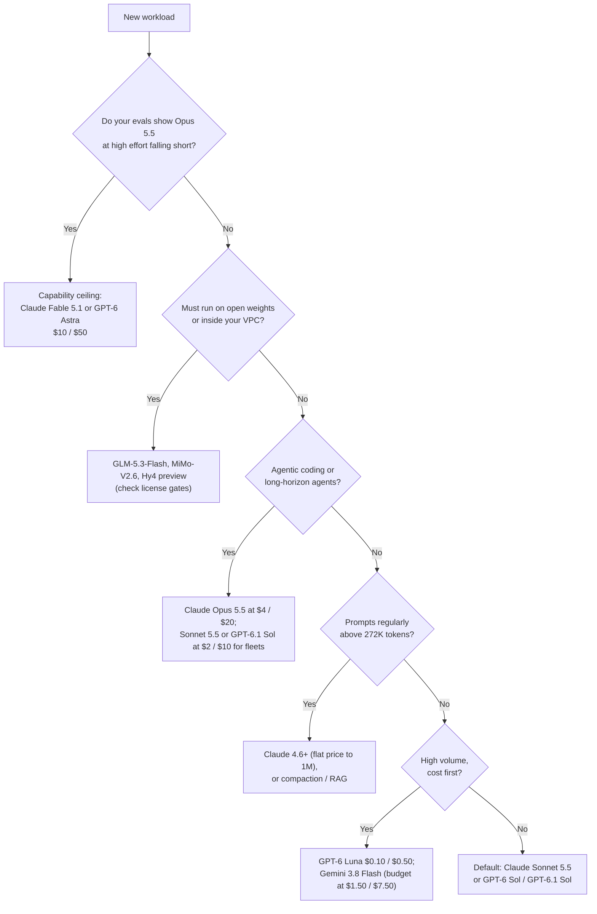

# Model Selection Guide

A practical framework for choosing the right LLM for your use case, considering capability, cost, latency, and operational factors.

## Table of Contents

- [Selection Framework](#selection-framework)
- [Capability Comparison](#capability-comparison)
- [Use Case Mapping](#use-case-mapping)
- [Cost Analysis](#cost-analysis)
- [Operational Considerations](#operational-considerations)
- [Multi-Model Strategies](#multi-model-strategies)
- [Interview Questions](#interview-questions)
- [References](#references)

---

## Selection Framework

### Decision Tree (October 2026)



Two things changed the tree in September 2026. Anthropic now tells customers to start with **Opus 5.5**, which costs 40% of Fable 5.1 and beats it on the agentic and coding benchmarks in Anthropic's own launch table (vendor-reported), so the ceiling tier is an escalation path, not a starting point. And the $2 / $10 mid tier (Sonnet 5.5, GPT-6 Sol, GPT-6.1 Sol) lands close enough to the flagships on vendor-reported agentic evals that most agent traffic may not need Opus-class pricing; confirm that on your own tasks before moving the fleet.

### Key Selection Factors

| Factor | Weight | Considerations |
|--------|--------|----------------|
| **Agentic Reliability** | High | Tool-calling accuracy, multi-step planning, binary task completion |
| **Cost per Task** | High | Tokens per task × price, not price per token. Agentic loops consume 5x-10x more tokens, and models differ several-fold in tokens per task |
| **Context Recall and Pricing** | High | Recall at 1M, and whether the vendor bills a long-context cliff (OpenAI above 272K, xAI at 200K) |
| **Rate Limit Ceiling** | High | **(Principal Nuance)**: Can the provider handle your P99 throughput without 429 errors, and will a monthly spend cap hard-stop traffic? |
| **Data Handling** | High | ZDR availability (yes on Opus 5.5 and Sonnet 5.5; Fable 5.1 only if expressly authorized; none on the OpenAI Agents API) and the ~10% residency premium |
| **Ecosystem Maturity** | High | Production track record, SDK support, and Enterprise SLA |
| **Lifecycle Runway** | Medium | Retirement floor and notice period per platform (Opus 5.5, Sonnet 5.5, Fable 5.1: not before September 2027) |

---

## Capability Comparison

### Frontier Model Comparison (October 2026)

Scores below are labeled by source. "AA" is the Artificial Analysis Intelligence Index v4.3.2 (Claude entries are "with fallback"); earlier index versions are not comparable.

| Model | Strengths | Cons | Context | Best For |
|-------|-----------|------|---------|----------|
| **Claude Opus 5.5** ($4 / $20) | Anthropic's recommended default. AA 58, the top score. Beat Fable 5.1 on every row of Anthropic's launch table and GPT-6 Astra on most (Terminal-Bench 4.0 66.4% at xhigh vs 57.9%), though Astra led on AutomationBench (41.4% vs 40.0%) and Terminal-Bench-Science (64.6% vs 58.7%); all vendor-reported. Sonnet 5.5 later reported a higher Terminal-Bench score. 0.05x cache reads; ZDR available | Default effort dropped to `medium`; thinking cannot be disabled; forced `tool_choice` returns 400; headline scores include safeguard fallback to Opus 4.8 or Opus 5 | 1M / 128K out | Agentic coding, computer use, hard production work |
| **Claude Sonnet 5.5** ($2 / $10) | Within a few points of Opus 5.5 on Anthropic's agentic evals (vendor-reported Terminal-Bench 4.0 70.6%, OSWorld 2.1 80.1% partial). AA 56. ZDR available | Vendor numbers not yet independently reproduced; `thinking: disabled` returns 400; thinking blocks are bound to the producing account | 1M / 128K | Agent fleets, coding at scale, default chat |
| **Claude Fable 5.1** ($10 / $50) | Anthropic's ceiling. Flat $10 / $50 to 1M with 0.025x cache reads. Terminal-Bench 4.0 leaderboard 57.88% (max) | Opus 5.5 beats it on Anthropic's own tables at 40% of the price; AA 53; 30-day retention, ZDR only if authorized | 1M / 128K | Tasks where Opus 5.5 at higher effort still fails your evals |
| **GPT-6 Astra** ($10 / $50) | OpenAI's ceiling. First on the Terminal-Bench 4.0 leaderboard (58.18%, max). About a third of GPT-5.6 Sol's tokens per coding task (AA). AA 53 | Whole request at $20 / $75 above 272K; no temperature, top_p, logprobs or `none` effort; first OpenAI model rated Critical for cyber, so exploit work is restricted outside Daybreak | 1.05M / 128K | Ceiling work on the OpenAI stack; long coding tasks where token efficiency offsets price |
| **GPT-6.1 Sol** ($2 / $10) | AA 52. 0.05x cache reads. Codex CLI's default | Released September 29, one week after GPT-6 Sol, so independent evaluation is thin; 272K cliff; default effort `medium` | 1.05M / 128K | OpenAI-side default for coding and professional work |
| **GPT-6 Sol / GPT-6 Luna** ($2 / $10; $0.10 / $0.50) | Half the GPT-5.6 prices; Luna resets OpenAI's floor | Image understanding was degraded until a September 25 fix shipped under the same IDs; no Terra tier | 1.05M / 128K | Sol: general production. Luna: routing, classification, extraction |
| **Gemini 3.8 Flash** ($0.75 / $3.75 intro; $1.50 / $7.50 from Jan 1, 2027) | Ties GPT-6 Astra and Opus 5 at 74% on DeepSWE v1.1 at the lowest cost per task ($2.36). Google's recommended model for Gemini computer use (preview) | Price doubles January 1; spends more reasoning tokens per task; AA 41; 65,536-token output cap | 1M / 65K | Cost-per-task leader for coding agents; high-volume RAG |
| **Grok 4.7** ($2 / $6) | Cheapest output among $2-input models; new, larger base model | Whole request doubles at 200K; AA 46, only 2 points above 4.6; fast variant only in Cursor and Grok Build | 500K | Output-heavy work under 200K |
| **Muse Spark 1.3** ($1.25 / $4.25) | AA 48 at $1.25 / $4.25, well under the $2 / $10 tier | More verbose than 1.2, so cost per task rose; the contributor tier trades your data for price | 1M | Price-sensitive general work, after a cost-per-task check |

**Superseded but still served:** Claude Opus 5, Sonnet 5, Fable 5 and Opus 4.8; GPT-5.6 Sol, Terra and Luna; GPT-5.5. Claude Sonnet 4.5 retires November 30, 2026.

**Announced, not shipped (as of October 1, 2026):** Google's **Gemini 4 Argon** (announced September 30) is rolling out to cyber defenders in the Fairwind Program first, with paid API and AI Ultra access to follow on no stated date. Its introductory price is $2 / $10 (then $4 / $20), Google says it raises output to 1M tokens, and AA scored a pre-release, high-effort run at 53. Until it ships, Gemini 3.1 Pro Preview is Google's only Pro-tier API model. **Claude Haiku 5.5** is announced for "the coming weeks".

### Budget Model Comparison

| Model | Cost (per 1M input/output) | Quality Signal | Context | Best For |
|-------|----------------------------|----------------|---------|----------|
| **GPT-6 Luna** | $0.10 / $0.50 | Successor to GPT-5.6 Luna at half the price | 1.05M | Routing, classification, extraction |
| **Gemini 3.8 Flash** | $0.75 / $3.75 intro; $1.50 / $7.50 from Jan 1, 2027 | DeepSWE v1.1 74% (three-way tie) | 1M | Coding agents, RAG |
| **DeepSeek V4.1-Flash** | $0.30 / $1.20 peak; half off-peak | AA 39 | 1M | Batch work scheduled off-peak (weekends are entirely off-peak) |
| **GLM-5.3-Flash** | $0.15 / $0.50 | AA 42 | 1M | MIT weights: same model by API or self-hosted |
| **MiMo-V2.6-Flash** | $0.14 / $0.28 (OpenRouter) | - | 1M | MIT, 309B / 15B active; fits one 8-GPU node when you outgrow the API |
| **Claude Haiku 4.5** | $1.00 / $5.00 | Only current Haiku | 200K | Anthropic-stack fast tier; plan for Haiku 5.5 and Foundry's November 15 retirement |

### Open-Weight Models

| Model | Parameters | License | AA v4.3.2 | Best For |
|-------|------------|---------|-----------|----------|
| **Xiaomi MiMo-V2.6-Pro** | 1.02T / 42B active | MIT | 46 | Top open model; two 8-GPU nodes |
| **Z.ai GLM-5.3** | 744B / 40B active | MIT plus security review for MaaS operators above US$10B revenue | 45 | Agentic coding |
| **Moonshot Kimi K3** | 2.8T / 104B active | Custom: separate deal for MaaS above US$20M revenue | 44 | Strong generalist if the license fits |
| **Z.ai GLM-5.3-Flash** | 320B / 18B active | MIT | 42 | Default self-host candidate for agentic coding |
| **Qwen3.8-Flash-Next** | 125B / 6B active + 51B N-gram memory | Qwen Community 1.0 (separate license for any MaaS or coding/office-assistant business) | 40 | Qwen4 architecture preview; host-RAM parameter memory |
| **DeepSeek V4.1-Flash** | 552B (763B checkpoint); 8B / 16B active | MIT | 39 | Cheap 1M-context serving |
| **Tencent Hy4 preview** | 770B / 49B active | Apache 2.0 | - | Cleanest license at frontier-adjacent scale |
| **Qwen3.8-27B** | 27B dense | Apache 2.0 | 34 | Single-GPU class |
| **Inkling-Small** | ~266B / 12B active | Apache 2.0 | 26 | Top US open-weight model |
| **NVIDIA Nemotron 3 Ultra** | 550B / 55B active | OpenMDW-1.1 | 23 | NVIDIA-stack open agents |

Check the license before the benchmark. Several leading open models now carry revenue-gated commercial terms aimed at Model-as-a-Service resellers, and Mistral Medium 3.5's weights withdraw all rights above US$20M monthly revenue. Llama 4 shipped only Scout (109B total) and Maverick (about 400B total); there is no Llama 4 8B, 70B or 405B.

---

## Use Case Mapping

### By Application Type (October 2026)

| Use Case | Recommended Models | Rationale |
|----------|-------------------|-----------|
| **Capability-ceiling research / hardest problems** | Claude Fable 5.1, GPT-6 Astra | Escalate here only after Opus 5.5 at higher effort fails your evals; Fable stays flat-priced to 1M, Astra doubles above 272K |
| **Autonomous Dev** | Claude Opus 5.5, Claude Sonnet 5.5, GPT-6.1 Sol; Gemini 3.8 Flash for cost per task | Opus 5.5 beat Fable 5.1 on every row of Anthropic's launch table and Astra on the coding rows (Astra led on AutomationBench and Terminal-Bench-Science), and Sonnet 5.5 reports scores within a few points of it (both vendor-reported); Sonnet 5.5 and GPT-6.1 Sol cover fleets at $2 / $10 |
| **Enterprise RAG** | Claude Sonnet 5.5, Gemini 3.8 Flash, GPT-6 Luna for extraction | Flat 1M pricing on Claude; Flash for volume; keep OpenAI prompts under 272K |
| **Customer Support** | GPT-6 Luna, Gemini 3.8 Flash (low thinking), Claude Haiku 4.5 | Low latency and cost; escalate hard tickets to a mid-tier model |
| **Reasoning / Debug** | Claude Opus 5.5 (high or xhigh effort), GPT-6 Astra, Claude Fable 5.1 | Effort is the dial; pay for max only where evals show a gain |
| **Computer Use** | Claude Opus 5.5, Gemini 3.8 Flash, GPT-6 Astra | OSWorld 2.0 leaderboard (v2.1 full set): Opus 5 at max effort, 44.33% binary. Vendor-reported partial scores: Opus 5.5 81.8%, Astra 72.6% (not comparable with each other or with binary) |
| **Voice Agents** | `gpt-live-1`, Gemini 3.8 Live, `gpt-realtime-2.1` | Per-minute and per-token billing models differ; see [Realtime Voice Agents](../18-voice-and-audio-agents/01-realtime-voice-agents.md) |
| **Video / Multimodal** | Gemini 3.8 Flash for video and audio; GPT-6 Sol or Claude Opus 5.5 for image-heavy work | Gemini takes text, image, video, audio and PDF input natively; GPT-6 Sol and current Claude models take text and image input, with no audio or video |
| **Private Agent** | GLM-5.3-Flash, MiMo-V2.6, Hy4 preview (open weights) | Strongest permissively licensed agentic models |

### By Constraint

| Constraint | Approach |
|------------|----------|
| **Latency-critical** | Speed tiers (OpenAI Fast 2x, Ultrafast 6x; Anthropic fast mode on Opus), small models (GPT-6 Luna, Gemini 3.8 Flash at low thinking, Claude Haiku 4.5), diffusion models (Mercury 2.5, 1,107 tokens/s vendor-reported), or self-hosted small models |
| **Prompts > 272K tokens** | Claude 4.6 and later (flat to 1M), Gemini 3.8 Flash; on OpenAI and xAI the whole request reprices, though GPT-6 Luna stays cheap even at its $0.20 / $0.75 long-context rate. Llama 4 Scout's 10M window degrades fast past 32K |
| **Zero-data Leakage** | Self-hosted GLM-5.3-Flash, MiMo-V2.6 or Hy4 preview inside your VPC, or ZDR-eligible APIs (Claude Opus 5.5, Sonnet 5.5) |
| **Complex Tool Use** | Claude Opus 5.5 or GPT-6.1 Sol. On the newest Claude models, use `auto` plus strict tool schemas; forced `tool_choice` returns 400 |
| **Long-lived regulated workload** | Models with published floors (Opus 5.5, Sonnet 5.5, Fable 5.1 not before September 2027; GPT-6 Astra on Bedrock not before September 8, 2027) |

---

## Cost Analysis

### Cost Modeling (October 2026)

| Model | Input / 1M | Output / 1M | Notes |
|-------|------------|-------------|-------|
| **Claude Fable 5.1** | $10.00 | $50.00 | Flat to 1M; cache read $0.25 |
| **GPT-6 Astra** | $10.00 | $50.00 | $20 / $75 for the whole request above 272K |
| **Claude Opus 5.5** | $4.00 | $20.00 | Anthropic's default; cache read $0.20 |
| **GPT-5.6 Sol** | $4.00 promo ($5.00 list) | $20.00 promo ($30.00 list) | Promo guaranteed only through November 21, 2026 |
| **Claude Sonnet 5.5** | $2.00 | $10.00 | Same price as Sonnet 5 |
| **GPT-6.1 Sol / GPT-6 Sol** | $2.00 | $10.00 | $4 / $15 above 272K; 6.1 caches at 0.05x |
| **Gemini 3.1 Pro Preview** | $2.00 | $12.00 | $4 / $18 above 200K |
| **Grok 4.7** | $2.00 | $6.00 | $4 / $12 for every token at or above a 200K prompt |
| **Muse Spark 1.3** | $1.25 | $4.25 | Watch tokens per task |
| **Gemini 3.8 Flash** | $0.75 intro, $1.50 from Jan 1, 2027 | $3.75 intro, $7.50 from Jan 1, 2027 | Use the 2027 numbers for anything long-lived |
| **DeepSeek V4.1-Flash** | $0.30 peak | $1.20 peak | Half price off-peak |
| **GPT-6 Luna** | $0.10 | $0.50 | Volume tier |

Full rate cards, cache terms and the retirement calendar are in [Pricing and Costs](03-pricing-and-costs.md).

### Cost Comparison Example

Assume 1K input tokens + 500 output tokens per query, Standard tier, no caching:

| Volume | GPT-6 Astra | Claude Opus 5.5 | Sonnet 5.5 / GPT-6 Sol | Gemini 3.8 Flash (intro / list) | GPT-6 Luna |
|--------|-------------|-----------------|------------------------|---------------------------------|------------|
| 10K queries/mo | $350 | $140 | $70 | $26.25 / $52.50 | $3.50 |
| 1M queries/mo | $35,000 | $14,000 | $7,000 | $2,625 / $5,250 | $350 |

*Insight: per-token tables overstate the spread. On DeepSWE v1.1, a three-way tie at 74% cost $2.36 per task on Gemini 3.8 Flash, $4.43 on GPT-6 Astra and $11.84 on Claude Opus 5. A 13x list-price gap between Flash (at its introductory price) and Astra became a 1.9x gap per task, because tokens per task differ. Price the task, not the token.*

---

## Operational Considerations

### Rate Limits and Quotas

| Provider | Tier | Example Limits | Notes |
|----------|------|----------------|-------|
| Anthropic | Start / Build / Scale | Monthly spend caps $500 / $1,000 / $200,000. Scale: 10,000 RPM, 10M ITPM, 2M OTPM for Opus 5.5 and Sonnet 5.5; 4,000 RPM, 4M ITPM, 800K OTPM for Fable 5.x | A spend cap returns 429 `enforced_spend_limit_reached` with no `retry-after` until 00:00 UTC on the 1st. Cache reads do not count toward ITPM |
| OpenAI | Tiers 1-5 | Per model. GPT-6 Astra Ultrafast: 500K TPM (tiers 1-3), 1M (tier 4), 5M (tier 5). `gpt-live-1`: 25 to 500 concurrent sessions | Since September 2, traffic that ramps too fast gets 429 `slow_down`; overload returns 503, both with optional `Retry-After` |
| Amazon Bedrock | Service quotas | GPT-6 Astra output tokens burn TPM quota at 10x | Models in Legacy block new customers, and existing customers can lose access after 15 days idle |

Check your organization's limits page for exact numbers; they change with tier and model.

### Reliability Patterns

```python
class ReliableModelClient:
    def __init__(self):
        self.providers = {
            "primary": AnthropicClient(model="claude-sonnet-5-5"),
            "fallback1": OpenAIClient(model="gpt-6-sol"),
            "fallback2": GoogleClient(model="gemini-3.8-flash"),
        }

    async def generate(self, prompt: str) -> str:
        for name, client in self.providers.items():
            try:
                return await client.generate(prompt)
            except RateLimitError as e:
                if e.code == "enforced_spend_limit_reached":
                    alert_finops(name)      # hard monthly cap: retrying will not help
                elif e.code == "slow_down":
                    await ramp_down(name)   # traffic grew too fast; back off this provider
                continue
            except ServiceError:            # includes 503 overload
                continue

        raise AllProvidersUnavailable()
```

**Fallbacks must cross vendors.** Anthropic had at least 12 major or critical incidents between August 16 and September 29, 2026, and OpenAI had an outage of about 5 hours 20 minutes across the API, ChatGPT and Codex on September 29. A same-vendor fallback shares the failure.

**Failing over mid-conversation between Claude models needs care.** On Fable 5.1, Opus 5.5 and Sonnet 5.5, thinking blocks are bound to the model that produced them and to the conversation prefix. A fallback model silently drops blocks it cannot read, and rewriting anything before a thinking block returns a 400 for accounts created on or after August 31, 2026. Replay history append-only; do not edit it on the way to the fallback.

### Abstraction Layer

```python
class LLMClient:
    """Unified interface for multiple providers."""
    
    def __init__(self, config: dict):
        self.default_model = config["default_model"]
        self.clients = self._init_clients(config)
    
    async def generate(
        self,
        messages: list[dict],
        model: str = None,
        **kwargs
    ) -> str:
        model = model or self.default_model
        client = self._get_client(model)
        
        # Normalize request format
        normalized = self._normalize_request(model, messages, kwargs)
        
        # Call provider
        response = await client.generate(**normalized)
        
        # Normalize response
        return self._normalize_response(response)
    
    def _normalize_request(self, model: str, messages: list[dict], kwargs: dict) -> dict:
        # Handle differences between providers and model generations:
        # - Newest Claude models and GPT-6 Astra reject temperature/top_p: drop them
        # - Claude Fable 5.1 / Opus 5.5 / Sonnet 5.5 return 400 on forced tool_choice
        #   ("any" or "tool"): send "auto" plus strict tool schemas instead
        # - GPT-6 Astra tool calling requires the Responses API
        # - Set reasoning effort explicitly; defaults change between versions
        pass
```

---

## Multi-Model Strategies

### Model Routing

```python
class ModelRouter:
    def __init__(self):
        self.classifier = QueryClassifier()
        self.models = {
            "simple": "gpt-6-luna",
            "complex": "claude-sonnet-5-5",
            "code": "claude-opus-5-5",
            "long_context": "claude-sonnet-5-5",  # flat price to 1M
            "reasoning": "gpt-6.1-sol"
        }
    
    async def route(self, query: str, context_length: int) -> str:
        # Classify query complexity
        query_type = await self.classifier.classify(query)
        
        # Override for long context: avoid whole-request repricing
        # above 272K on OpenAI (and at 200K on xAI)
        if context_length > 272_000:
            return self.models["long_context"]
        
        return self.models[query_type]
```

### Cascade Pattern

**The Logic**: Never use a 70B model for a task a 1B model can do. Use a "Router" to score confidence.

```python
class ModelCascade:
    """The 'Efficiency First' Pattern."""
    
    async def generate_optimized(self, query: str):
        # 1. Draft check (SLM / Classifier)
        if is_simple_intent(query):
            return await gpt_6_luna.generate(query)
            
        # 2. Main Generation (Efficient model)
        response = await claude_sonnet_5_5.generate(query)
        
        # 3. Validation / Escalate
        if needs_verification(response):
            return await claude_opus_5_5.generate(
                f"Verify this: {response}", effort="high"
            )
            
        return response
```

**Principal-level Tip:** Implement "Semantic Fallback" where you don't just retry the same model on error, but immediately jump to a larger model or a different provider (OpenAI -> Anthropic) to avoid correlated failures.

---

## Interview Questions

### Q: How do you choose between OpenAI, Anthropic, and Google models for a production application?

**Strong answer:**

"My selection depends on specific requirements:

**For most production workloads**, I start with Claude Sonnet 5.5 or GPT-6 Sol / GPT-6.1 Sol, all at $2 / $10. For agentic coding I test Claude Opus 5.5 at $4 / $20, which Anthropic now recommends as the default. I route to Claude Fable 5.1 or GPT-6 Astra ($10 / $50) only for tasks my evals show need the ceiling.

**For long-context applications**, pricing matters as much as window size. Claude 4.6 and later bill flat to 1M, while OpenAI reprices the whole request above 272K and xAI at 200K. The cliff matters less on cheap models: GPT-6 Luna at its long-context rate ($0.20 / $0.75) is still cheaper than Gemini 3.8 Flash's introductory $0.75 / $3.75, and Flash doubles on January 1, 2027. I check recall at depth on my own documents before trusting either.

**For cost-sensitive high volume**, GPT-6 Luna ($0.10 / $0.50) or Gemini 3.8 Flash, compared on cost per task rather than per token.

**My practical approach:**
1. Prototype with a mid-tier model to validate the use case
2. Evaluate on MY specific task, at the effort level I will ship
3. Build an abstraction layer with cross-vendor fallback so I can switch easily
4. Optimize costs by routing simpler requests to cheaper models
5. Track retirement dates per (model, platform) pair

I never rely solely on benchmark scores. A vendor's headline number reflects its best harness and effort setting; a model that ranks lower on a leaderboard might excel on my domain."

### Q: When would you self-host vs use API providers?

**Strong answer:**

"It is a tradeoff of control vs operational burden.

**Use APIs when:**
- Traffic cannot keep a GPU node busy around the clock (an 8x H100 node runs $16K-23K a month; against GPT-6 Luna it takes tens of millions of requests a month to break even)
- Need latest models immediately
- Team lacks GPU infrastructure expertise
- Variable workload hard to capacity plan
- Time-to-market is critical

**Self-host when:**
- Data cannot leave infrastructure (compliance) and no ZDR or residency option fits
- Sustained volume saturates nodes, priced against a routed API bill rather than frontier list prices
- Need latency under 100ms P99
- Need custom model weights or fine-tuning (OpenAI stops new fine-tuning jobs for existing customers on January 6, 2027)
- Full control over model behavior and version, with no silent swaps or forced retirements

**Check the license first:** MIT and Apache 2.0 options (GLM-5.3-Flash, MiMo-V2.6, DeepSeek V4.1-Flash, Hy4 preview) are clean; Kimi K3, GLM-5.3, the Qwen community licenses and Mistral Medium 3.5 carry commercial gates.

**Hybrid often works best:**
- Self-host for high-volume predictable workloads
- API for spikes and specialized models
- API as fallback when self-hosted fails

Hidden costs of self-hosting: GPU procurement, engineering time, model updates, monitoring. Factor in 1-2 dedicated engineers for infrastructure."

### Q: Model versions now ship weekly. How do you keep model selection current without breaking production?

**Strong answer:**

"Anthropic replaced Sonnet 5 with Sonnet 5.5 three months after launch, and OpenAI shipped GPT-6.1 Sol one week after GPT-6 Sol. I treat model upgrades as a standing pipeline, not a project:

1. **Pin exact model IDs, then verify what is served.** Pinning is necessary but not sufficient: DeepSeek routes its retired `deepseek-v4-flash` names to V4.1-Flash, xAI's retired Grok slugs bill at grok-4.3 rates, and Azure Foundry auto-upgrades even the dated gpt-4o 2024-05-13 to gpt-5.6-sol on December 9, 2026. I log the model each response reports and alert when it changes.
2. **Diff the API contract, not just quality.** Opus 5.5 changed the default effort from high to medium; Sonnet 5.5 rejects `thinking: disabled`; the newest Claude models reject forced `tool_choice`; GPT-6 Astra drops temperature and logprobs. Each of these breaks code or shifts latency without any quality regression showing up in a benchmark.
3. **Gate every change on my own eval suite at production effort**, including provider-side fixes under an unchanged ID. OpenAI fixed GPT-6 Sol's image understanding on September 25 without a new model name and told customers to rerun image evals.
4. **Shadow, then canary**, comparing cost per task, latency, refusal rate (some Anthropic refusals are now billed) and escalation rate, not just a quality score.
5. **Keep a registry of retirement dates per (model, platform)** with alerts at 90, 60 and 30 days. Notice periods range from 60 days (Anthropic) and 6 months (OpenAI GA) down to 2 weeks for previews and 20 days for OpenAI's `gpt-5.4-cyber`.

The cost is a small permanent eval-and-migrate budget. The alternative is discovering the change from an incident."

---

## References

- OpenAI API: https://developers.openai.com/api/docs
- Anthropic API: https://platform.claude.com/docs
- Anthropic models overview: https://platform.claude.com/docs/en/models/overview
- Google AI: https://ai.google.dev/
- Artificial Analysis: https://artificialanalysis.ai/
- Arena (formerly LMArena): https://arena.ai/
- Terminal-Bench leaderboard: https://www.tbench.ai/

---

*Previous: [Pricing and Costs](03-pricing-and-costs.md) | Next: [Fine-Tuning Guide](../03-training-and-adaptation/02-fine-tuning-strategies.md)*
