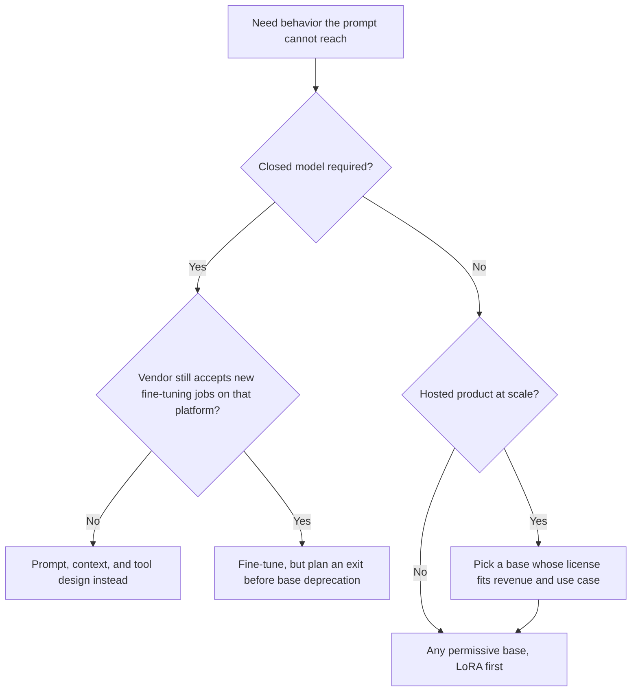

# Fine-Tuning Strategies

Fine-tuning adapts a pretrained model to specific tasks, domains, or styles. Today, fine-tuning is less about "teaching facts" and more about "teaching format and behavior."

## Table of Contents

- [When to Fine-Tune](#when-to-fine-tune)
- [Supervised Fine-Tuning (SFT)](#supervised-fine-tuning-sft)
- [Continued Pretraining (Domain Adaptation)](#continued-pretraining-domain-adaptation)
- [PEFT vs. Full-Parameter](#peft-vs-full-parameter)
- [Hyperparameter Tuning](#hyperparameter-tuning)
- [Where Fine-Tuning Runs](#where-fine-tuning-runs)
- [Interview Questions](#interview-questions)
- [References](#references)

---

## When to Fine-Tune

Before fine-tuning, ask: **Can this be solved with Prompt Engineering or RAG?**

| Requirement | Better Solution | Why |
|-------------|-----------------|-----|
| New Facts / Knowledge | **RAG** | LLMs are bad at memorizing facts from FT; RAG is easier to update. |
| Specific Output Format | **Fine-Tuning** | Teaches the model to reliably output JSON/XML without complex prompting. |
| Tone / Persona | **Fine-Tuning** | Much more consistent than system prompts. |
| Latency Reduction | **Fine-Tuning** | Reduces the need for long few-shot prompts. |
| Private Domain Language| **Continued Pretraining** | Teaches specialized vocabulary (medical, legal, custom code). |

---

## Supervised Fine-Tuning (SFT)

The first step after pretraining. The model is trained on `(Prompt, Response)` pairs. Instruction tuning is SFT where the pairs are instructions and ideal responses across many task types, which is what turns a base model into an assistant.

### The Quality Hierarchy
**1,000 "Perfect" examples beat 1,000,000 noisy examples.**
- **Golden Sets:** Hand-curated by domain experts (PhD level for technical tasks).
- **Negative Constraint Training:** Including examples of what the model **should not** do (e.g., "Don't apologize," "Don't mention you are an AI").
- **Trace-derived sets:** Production traces filtered by eval scores or human review are now the cheapest source of in-distribution SFT data; LLMOps platforms ship this path directly (LangSmith Fine-Tuning, public beta since September 24, 2026).

---

## Continued Pretraining (Domain Adaptation)

Also known as "Second-stage Pretraining."
- **How**: Train on raw text from a specific domain (e.g., all SEC filings for a finance model).
- **Objective**: Learn the statistical distribution of the domain language.
- **Nuance**: Requires a much lower learning rate (~1/10th of original) to prevent "catastrophic forgetting."

---

## PEFT vs. Full-Parameter

| Feature | Full-Parameter FT | PEFT (LoRA, QLoRA) |
|---------|-------------------|--------------------|
| GPU VRAM | Very High (Model Size * 4-12) | Low (Model Size * 1.5) |
| Speed | Base | 2x-3x Faster |
| Risk | High (Catastrophic Forgetting) | Low |
| Deployment | One model per task | One base model + multiple adapters |
| **Verdict**| Reserved for foundation training | **The Production Standard** |

---

## Hyperparameter Tuning

### 1. Learning Rate (LR)
- **Full-parameter SFT**: `1e-5` to `5e-5` is standard.
- **LoRA**: roughly 10x higher (`1e-4` to `2e-4`), because only the small adapter matrices move.
- **Too high**: Model "collapses" and starts repeating or speaking gibberish.

### 2. Rank (r) for LoRA
- Higher ranks (`r=64` to `r=256`) for complex reasoning tasks.
- Lower ranks (`r=8`) for simple style/tone changes.

### 3. Packaged Training (Packing)
To maximize throughput, we "pack" multiple short examples into a single 4k or 8k sequence, separated by EOS tokens.
- **Challenge**: Self-attention might leak across examples.
- **Solution**: **FlashAttention with block-masking** to prevent cross-example attention.

---

## Where Fine-Tuning Runs

The "fine-tune the closed model later" plan is getting harder to execute, and open bases now come with license terms you must read like a supplier contract.

**Closed-model fine-tuning is shrinking.** OpenAI is winding down self-serve fine-tuning (announced May 7, 2026): organizations that never fine-tuned cannot create jobs; since July 2 only organizations with fine-tuned-model inference in the prior 60 days can; from **January 6, 2027** active customers can no longer create new jobs. Existing fine-tuned models keep serving until their base models are deprecated. Azure OpenAI keeps its own fine-tuned-model schedules, so check the platform, not just the model family.

**Open-weight fine-tuning is the default path.** Training runs on your own GPUs or through inference partners (LangSmith routes trace-derived SFT jobs for open-weight models to Fireworks and Baseten). The pattern scales to the frontier: Cognition's SWE-2 is post-trained from Kimi K3 (2.8T parameters, per Cognition) and Fireworks' Ember-1 is built on K3 to shorten reasoning (about 40% fewer tokens than K3, vendor-reported). Product labs buy the base and compete on post-training.

**The base license becomes a supply-chain term.** Check it before you invest in a dataset:

| Base | License gate that matters for a hosted product |
|------|-----------------------------------------------|
| Kimi K3 | Custom license: a separate deal is needed for model-as-a-service above US$20M revenue in 12 months |
| Qwen3.8-Flash-Next | Qwen Community License 1.0: separate license for any MaaS or coding/office-assistant business, no revenue floor |
| GLM-5.3 | MIT plus a security-review clause for MaaS providers above US$10B revenue in 12 months |
| DeepSeek V4.1-Flash, MiMo-V2.6 | MIT |
| Gemma 4 12B, IBM Granite 4.2, Qwen3.8-27B | Apache 2.0 |

---

## Interview Questions

### Q: Why use Continued Pretraining instead of just putting domain data in the SFT set?

**Strong answer:**
SFT is "expensive" in terms of data creation: you need prompt/answer pairs. Continued Pretraining lets you use massive amounts of raw, unlabeled domain text to teach the model's inner representations the specialized vocabulary and style. Once the model "speaks the language," you use a small SFT set to teach it the "tasks" (e.g., classification, summarization) in that language.

### Q: How do you prevent a model from "unlearning" general capabilities during fine-tuning?

**Strong answer:**
This is "Catastrophic Forgetting." Two main mitigations:
1. **Rehearsal:** Mix in 5-10% of the original pretraining data into your fine-tuning set.
2. **PEFT (LoRA):** Since we only train a small percentage of weights, the original "knowledge" remains frozen in the base model weights, significantly reducing the risk of forgetting.

### Q: Your roadmap says "fine-tune GPT on our support transcripts in Q1 2027." What do you change?

**Strong answer:**
First, check whether the plan is still executable: OpenAI stops new self-serve fine-tuning jobs for active customers on January 6, 2027, and organizations without recent fine-tuned-model inference already cannot create jobs. So either run the job before the cutoff with an exit plan for when the base model is deprecated, or move the customization. Second, ask whether fine-tuning is needed at all: most "support tone and format" goals are reachable with a system prompt, few-shot examples, and structured outputs, which survive model upgrades. If the behavior truly needs weights, I would fine-tune an open-weight base with LoRA on filtered, trace-derived data, choose the base by license (Apache 2.0 or MIT if we host it as a service), and keep the dataset and eval suite portable so the adapter can be retrained on the next base. The durable assets are the curated data and the evals, not the checkpoint.

---

## References
- Hu et al. "LoRA: Low-Rank Adaptation of Large Language Models" (2021)
- Ouyang et al. "Training language models to follow instructions" (InstructGPT, 2022)
- Dettmers et al. "QLoRA: Efficient Finetuning of Quantized LLMs" (2023)
- OpenAI. [Deprecations](https://developers.openai.com/api/docs/deprecations) (fine-tuning wind-down)

---

*Next: [LoRA, QLoRA, and PEFT](03-lora-qlora-peft.md)*
