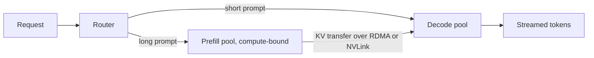

# Batching Strategies

Batching is the primary lever for increasing LLM throughput and reducing cost. Serving frameworks have moved beyond simple request-level batching to sub-token, iteration-level orchestration, and at scale to splitting prefill and decode onto separate hardware.

## Table of Contents

- [Static vs. Dynamic Batching](#static-vs-dynamic-batching)
- [Continuous Batching](#continuous-batching-iteration-level)
- [In-Flight Batching (Prefill-Decode Fusion)](#in-flight-batching-prefill-decode-fusion)
- [Chunked Prefill](#chunked-prefill)
- [Disaggregated Prefill and Decode](#disaggregated-prefill-and-decode)
- [Interview Questions](#interview-questions)
- [References](#references)

---

## Static vs. Dynamic Batching

In traditional ML (Classification), we use **Static Batching** where all requests must be the same size and start/end together. This is inefficient for LLMs due to variable response lengths. **Dynamic Batching** (as in NVIDIA Triton) waits up to a short timeout to collect requests into a batch, which improves utilization but still runs each batch to completion as a unit.

---

## Continuous Batching (Iteration-level)

Continuous batching (pioneered by Orca and vLLM) allows new requests to join the batch and finished requests to leave at the end of every individual token generation step.

| Aspect | Static Batching | Continuous Batching |
|--------|-----------------|---------------------|
| **Join/Leave** | Only at start/end | Any iteration |
| **GPU Utilization**| Low (waiting for longest) | High (always saturated) |
| **Throughput** | 1x | **4x - 10x** |
| **Latency** | Highest for shortest | Balanced |

**Admission control matters as much as batching.** A continuous batcher will happily accept work until queueing delay destroys TTFT for everyone. vLLM v0.29.0 added `--max-num-queued-reqs` and `--max-num-queued-tokens` so the engine can reject excess load early, which the gateway can treat as a signal to send the request to another replica, instead of building an unbounded queue.

---

## In-Flight Batching (Prefill-Decode Fusion)

Previously, serving engines processed a batch of "Prefill" (heavy compute) OR a batch of "Decode" (heavy memory). 
**In-Flight Batching** (TensorRT-LLM; vLLM and SGLang do the same through chunked prefill) allows mixing them:
- 1 request is in the Prefill phase.
- 15 requests are in the Decode phase.
- **Benefit**: The Prefill request utilizes the GPU's idle compute cores while the Decode requests utilize the memory bandwidth.

---

## Chunked Prefill

Massive context prompts (1M+ tokens) can hang a batch for seconds during the Prefill phase, causing "stalls."

**The fix: Chunked Prefill**
Instead of prefilling 128k tokens at once, the engine breaks the prefill into smaller chunks and interleaves them with the ongoing Decode steps of other users. This maintains a steady **TPOT** even when heavy requests arrive. The per-step token budget is the tuning knob: vLLM raised the default `max_num_batched_tokens` from 8,192 to 16,384 in v0.28.0 (August 2026), trading slightly higher inter-token latency for better prefill throughput. Lower it if your SLO is ITL-bound.

---

## Disaggregated Prefill and Decode

Chunked prefill shares one GPU pool between two phases with opposite bottlenecks. **Disaggregated serving** gives each phase its own pool, sized and even built from different hardware, and moves the KV cache between them.

- **Frame the win as goodput**, the request rate that meets both TTFT and ITL SLOs, not peak throughput. Prefill bursts no longer stall decode, and each pool scales independently.
- **Price the KV transfer.** Llama-3.1-70B in BF16 stores 320 KiB per token, so a 10k-token prompt hands decode about 3 GB, roughly 65 ms at 400 Gb/s, added to TTFT. For short prompts the transfer costs more than it saves, which is why NVIDIA Dynamo v1.5 sends short requests straight to decode (conditional disaggregation bypass).
- **The plumbing is upstream now.** vLLM ships more than a dozen KV connectors (NIXL, LMCache, Mooncake, FlexKV, AMD MoRI-IO, plus a chaining MultiConnector), and tokenization can move to a CPU-only frontend so GPUs see tokens in and tokens out.
- **It goes beyond P/D.** Encoder disaggregation splits multimodal encoders out; an experimental vLLM plugin (July 2026) splits attention and FFN/expert layers into separately scaled services for MoE. Hardware vendors pitch cross-chip versions: GPU prefill with SRAM or wafer-scale decode (NVIDIA Rubin plus Groq 3 LPX, AMD Helios plus Cerebras), covered in [Serving Infrastructure](06-serving-infrastructure.md).

---

## Interview Questions

### Q: Why is Continuous Batching superior to Static Batching for LLMs?

**Strong answer:**
Static batching forces all requests in a batch to wait for the longest generation to complete (the "longest tail" problem). If one user asks for 500 tokens and another for 5 tokens, the GPU remains idle for the 5-token user for 495 cycles. Continuous batching allows the 5-token user's request to exit the GPU immediately after its last token, freeing up VRAM and compute slots for a new request from the queue. This maximizes "Tokens per Second" across the entire hardware cluster.

### Q: What is a "stall" in LLM serving, and how does Chunked Prefill mitigate it?

**Strong answer:**
A "stall" occurs when a massive new request arrives and its Prefill phase (which is compute-hungry) takes 2-3 seconds to complete. During this time, the GPU is so busy with the prefill that it cannot generate tokens for existing users in the "Decode" phase, causing their TPOT to spike. Chunked Prefill breaks that 3-second prefill into small 200ms "chunks," processing one chunk and then doing one round of decoding for everyone else, before returning to the next prefill chunk. This ensures a consistent, smooth experience for all users.

### Q: When does disaggregated prefill/decode beat chunked prefill on one pool?

**Strong answer:**
When prompts are long and the SLO is tight on both TTFT and inter-token latency. Chunked prefill still makes decode steps share compute with prefill chunks, so ITL jitters under bursts of long prompts; disaggregation removes that interference and lets me scale prefill and decode capacity separately, which raises goodput. The cost is KV transfer: at about 320 KiB per token for a BF16 70B dense model, a 10k-token prompt moves about 3 GB, roughly 65 ms at 400 Gb/s, so I need fast interconnect and I should bypass disaggregation for short prompts. It also adds operational surface (two pools, a KV-aware router, connector failures). For short-prompt chat at moderate scale, a single pool with chunked prefill and prefix caching is simpler and usually good enough; for long-context agentic traffic at scale, disaggregation usually wins on goodput, and models with compact KV (latent or sparse attention) make the transfer cheaper.

---

## References
- Yu et al. "Orca: A Distributed Serving System for Transformer-Based Generative Models" (2022)
- NVIDIA. "TensorRT-LLM: In-Flight Batching" (2023)
- vLLM Project. "Iteration-Level Scheduling" (2023)
- Zhong et al. "DistServe: Disaggregating Prefill and Decoding for Goodput-optimized Large Language Model Serving" (2024)
- vLLM Blog. ["Disaggregated serving guide"](https://vllm.ai/blog/2026-09-29-disaggregated-serving-guide) (2026)

---

*Next: [PagedAttention](05-paged-attention.md)*
