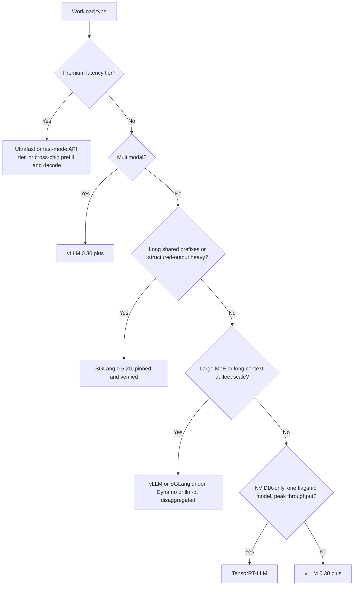

# Serving Infrastructure

Deploying LLMs at scale requires an infrastructure layer that handles load balancing, model parallelism, and multi-tenant isolation. The focus has shifted from "serving a model" to "orchestrating an inference fleet": KV-aware routing, separate prefill and decode pools, and in the premium tier, different chips for different phases.

## Table of Contents

- [The Inference Gateway](#the-inference-gateway)
- [Model Parallelism (Tensor, Pipeline, Expert, Context)](#model-parallelism)
- [Multi-GPU Orchestration](#multi-gpu-orchestration)
- [Streaming and Long-Lived Connections](#streaming-and-long-lived-connections)
- [Inference Engines (October 2026)](#inference-engines-october-2026)
- [Interview Questions](#interview-questions)
- [References](#references)

---

## The Inference Gateway

The gateway is the "Traffic Controller" for your AI workload.

| Component | Responsibility |
|-----------|---------------------------|
| **Auth & Rate Limiting** | Token-based quotas and tenant isolation. |
| **Model Router** | Directing requests to specific model versions (Canary/A-B). |
| **KV-Aware Router** | Sending a request to the replica that already holds its prefix in cache, weighted by load and predicted latency. This replaced plain sticky sessions: Kubernetes Gateway API Inference Extension (GAIE) plus the llm-d Endpoint Picker, or NVIDIA Dynamo's router. Google reports under 1% routing overhead for multi-cluster GKE Inference Gateway. |
| **Admission & Failover** | Rejecting over-context or over-capacity requests before a stream opens, and failing over to another backend if no token arrives in time (Envoy AI Gateway v1.1's `streamIdleTimeout`). |
| **Output Filter** | Real-time safety and PII scrubbing on streaming responses. |

The gateway also concentrates every provider credential you own, which makes it a prime target. In 2026 LiteLLM alone had an unauthenticated RCE (CVE-2026-37004, CVSS 9.8) and an authenticated `api_base` redirect that sent the operator's stored provider keys to an attacker host (CVE-2026-84377). Pin and patch the gateway like any internet-facing service, and allowlist routing parameters instead of accepting them from clients. Failover has to cross vendors when you call hosted APIs, because a vendor outage takes down its API, chat app, and coding agent together: OpenAI's September 29, 2026 incident ran about 5 hours 20 minutes across all three, and Anthropic's status page logged at least 12 major or critical incidents between August 16 and September 29. Gateway design is covered in depth in the [AI gateways chapter](../11-infrastructure-and-mlops/03-ai-gateways-and-model-routing.md).

---

## Model Parallelism

For models that don't fit on a single GPU (e.g., Llama 3.1 405B needs about 810 GB for BF16 weights alone, before any KV cache), we must split them.

### 1. Tensor Parallelism (TP)
Splits individual layers/tensors across multiple GPUs.
- **Latency**: Low (Fastest).
- **Communication**: High (Requires NVLink).
- **Standard**: Used for 90% of production serving within a single node (8x GPUs) or a single NVLink domain (up to 72 GPUs on an NVL72 rack).

### 2. Pipeline Parallelism (PP)
Splits different layers (e.g., layers 1-40 on GPU 1, 41-80 on GPU 2).
- **Latency**: High on GPUs (Micro-batching overhead).
- **Efficiency**: Lower util (Bubble time).
- **Standard**: Used for massive models spanning multiple nodes. The exception proves the rule: wafer-scale systems pipeline at layer boundaries because only activations cross between wafers; OpenAI's GPT-5.6 Sol Ultrafast preview runs this way across multiple Cerebras CS-3 systems at up to 750 output tok/s.

### 3. Expert Parallelism (EP)
Spreads the experts of an MoE model across GPUs and routes each token's hidden state to the GPUs holding its selected experts with an all-to-all exchange (DeepEP is the common kernel library). EP plus data-parallel attention is the standard layout for DeepSeek, Kimi, and Qwen-class MoE models.

### 4. Context Parallelism (CP)
Splits a long sequence across GPUs. Decode context parallelism (DCP) shards the KV cache of very long contexts; SGLang runs it on its default Blackwell MLA backend and has verified DSpark speculation under disaggregated serving with DCP up to 256K input on 8x B300.

### 5. Attention-FFN Disaggregation (experimental)
Runs attention (which owns the KV cache) and the FFN or expert layers as separately scaled services. vLLM has an experimental plugin for MoE on NVIDIA GPUs and Ascend NPUs, and NVIDIA lists it as one Vera Rubin plus Groq 3 LPX serving mode.

---

## Multi-GPU Orchestration

Kubernetes is the default substrate, with LLM-specific layers on top: **KubeRay** for Ray-based serving, **LeaderWorkerSet** for multi-node replicas, **llm-d** for KV-aware routing and autoscaling on the Gateway API Inference Extension, and **NVIDIA Dynamo** as an orchestration layer above vLLM, SGLang, and TensorRT-LLM.

- **Heterogeneous Clusters**: Mixing H100s for frontier models and L4s for small models in the same cluster. Mixed vendors in one pool are now benchmarked too: Cisco's MLPerf Inference v6.1 submission ran 8 H200 plus 8 MI350X as one inference pool.
- **Autoscaling**: Scaling based on **KV Cache utilization** and queue depth rather than CPU or standard memory usage. Dynamo's Kubernetes planner can also clamp scaling to a total GPU power limit.
- **Cold Start**: Model load time dominates scale-out. vLLM v0.30.0's **Fast Start** (`--load-format ipc_cache`) keeps a per-GPU daemon holding already-quantized, tensor-parallel-sharded weights and maps them into a restarted engine over CUDA IPC. SGLang's overlapped checkpoint staging (`--startup-weight-load-mode overlap`) started Qwen3-32B on an H100 2.38x faster (35.6 s versus 84.8 s).
- **Plan by simulation**: SGLang's CPU-only Simulator runs the real scheduler and cache with a latency model and predicts TTFT within about 6% (up to 10% on 32K to 128K traces); Dynamo's AISimulate (formerly AIConfigurator) does configuration search. Simulate before you buy or rent GPUs.

---

## Streaming and Long-Lived Connections

LLMs are almost always served via **Server-Sent Events (SSE)** or **WebSockets**.

**Infrastructure challenge**: Standard load balancers (Layer 4) struggle with long-lived AI connections.
- **The Fix**: Use **Layer 7 Load Balancers** (Envoy/Istio) that understand the "End of Sequence" token and can re-balance traffic *between* user turns rather than just at the connection level.
- **Fail before the first token, not after.** Envoy AI Gateway v1.1 can fail over to the next backend if no token arrives within `streamIdleTimeout`; once tokens have streamed, a backend failure surfaces as a 504 rather than a silently duplicated answer. Dynamo's frontend likewise rejects over-context requests before the stream opens and returns 503 on overload. Retries after the first token belong in the client or agent loop, with idempotent tool calls.

---

## Inference Engines (October 2026)

The engine choice is no longer a question of "which one is fastest." Each leading engine has won a workload category, and an orchestration layer (Dynamo or llm-d) now sits above the engines in large fleets. The right answer is engine-per-workload, pinned to a patched version.

| Component | Current (as of October 1, 2026) | What changed that matters |
|-----------|---------------------------------|---------------------------|
| **vLLM** | v0.30.0 (Sep 22); about a two-week release cadence | Model Runner V2 default since v0.29 (old runner removal targeted for v0.32); queue admission control; Fast Start; tiered KV offload to disk; `vllm serve` replaces the deprecated `python -m vllm.entrypoints.openai.api_server` |
| **SGLang** | v0.5.20 (Sep 18) | Sliding-window-aware radix cache; CPU-only simulator; NVFP4 checkpoints on AMD via MXFP4 requantization; `/v1/responses` no longer stores results unless `--enable-response-store` |
| **TensorRT-LLM** | v1.2.1 stable (Apr 20); v1.3.0rc29 (Sep 29) | PyTorch backend default since 1.0 (Sep 2025), so no per-model engine build; v1.3 RCs remove the AutoDeploy integration (breaking) |
| **NVIDIA Dynamo** | v1.5.0 (Sep 21) | Pluggable KV-aware router policies; conditional disaggregation bypass; KVBM deprecated (removal targeted for v1.6.0) |
| **llm-d / GAIE** | llm-d v0.10.0 (Sep 29); GAIE v1.6.2 (Sep 17) | Endpoint Picker moved from GAIE into llm-d; llm-d now uses upstream vLLM images and cosign-signs production images |

### vLLM: The Default Open Engine

[vLLM](https://docs.vllm.ai/) remains the default open engine when the workload is "Llama / Mistral / Qwen / DeepSeek under continuous batching": broadest model coverage, easiest to operate, and the fastest same-week security patches. It also has the largest attack surface. Between August 11 and September 28, 2026 it published more than 20 advisories, including:

- **CVE-2026-90553** (high, fixed in 0.28.0): a model processor loader executed a malicious repo's code even with `trust_remote_code=False`.
- **CVE-2026-93592** (high, fixed in 0.28.0): one unauthenticated request with a negative token ID to `/v1/embeddings` or `/pooling` poisons the CUDA context and kills the engine for every client until restart.
- **GHSA-935w-9g4m-p28p** (low, fixed in 0.30.0): a code path dropped the per-tenant `cache_salt`, reopening a cross-tenant prefix-cache timing oracle.

Earlier in the year, the February multimodal RCE (CVE-2026-22778, video processing) was fixed in v0.14.1. **Baseline: vLLM 0.30.0 or later.** The lessons generalize: a GPU engine is a shared-fate domain, so validate inputs before they reach the device, salt the prefix cache on every path, and only load models from repos you trust.

### SGLang: Prefix-Heavy and Structured Workloads

[SGLang](https://github.com/sgl-project/sglang) leads on workloads with heavy prefix reuse and structured output: **RadixAttention** prefix caching, constrained decoding overlapped with the forward pass, and first-class MoE serving (DeepEP v2, W4A8 MXFP4 MoE on Hopper, decode context parallelism on Blackwell). Its v0.5.20 radix tree caches sliding-window state at prefix branch points, raising token hit rate from 43.8% to 60.8% and cutting mean TTFT from 1.57 s to 1.07 s on DeepSeek-V4-Flash with a shared system prompt.

**Security posture**: the March 2026 critical RCEs in the multimodal ZMQ broker and encoder-parallel disaggregation (CVE-2026-3059, CVE-2026-3060) were fixed in v0.5.10. A May batch (CVE-2026-7301, 7302, 7304, critical: a scheduler socket bound to all interfaces with `pickle.loads`, a path traversal, and `dill.loads` via custom logit processors) lists affected versions through 0.5.12 with no patched version recorded in the advisory database. So: pin 0.5.13 or later and verify against the advisories, never expose internal ZMQ or RPC sockets outside the pod, and do not enable custom logit processors for untrusted callers. With that posture SGLang is fine for multimodal traffic too; the old "keep multimodal off SGLang" rule rested on CVEs that have since been patched.

### TensorRT-LLM: Peak NVIDIA Throughput

[TensorRT-LLM](https://github.com/NVIDIA/TensorRT-LLM) remains the throughput leader on pure NVIDIA hardware for hand-tuned models, with custom FP4/FP8 kernels on Blackwell often ahead of open engines and tight integration with Triton and NIM. The old operational objection, a multi-hour engine build for every model, no longer applies: since 1.0 the PyTorch backend is the default and models load like any other engine's. The remaining costs are **NVIDIA lock-in** and an **RC-heavy release cadence** (the stable line is v1.2.1 from April; v1.3 has been in release candidates for months and its RCs include breaking removals). If you are committed to NVIDIA and have one or two flagship models that need every token per second, it pays; otherwise vLLM or SGLang is the more flexible fit.

### Orchestration Above the Engine: Dynamo and llm-d

At fleet scale the decisions that move cost (which replica gets a request, when to disaggregate, how to scale) live above the engine. **NVIDIA Dynamo** v1.5 routes on KV-cache overlap with pluggable scorer and picker policies and hard or soft session affinity, indexes cache events from SGLang HiCache and vLLM disk tiers, sends short requests straight to decode, and supports opt-in TLS/mTLS on its transports. **llm-d** plays the same role in the Kubernetes Gateway API world. Both are young and move fast; pin versions and read the deprecations (Dynamo's KVBM, GAIE's removed alpha APIs).

A precision caveat from the same ecosystem: Dynamo's refreshed Nemotron 3.5 Lightning recipe measured BF16 80% faster than NVFP4 with Marlin kernels and 12% faster with CuTeDSL. Benchmark precision per model and kernel backend; see the [Quantization Deep Dive](../03-training-and-adaptation/07-quantization-deep-dive.md).

### MoE-Aware Serving (Llama 4 Maverick, DeepSeek V4, Kimi K3)

MoE models broke the assumption that serving cost scales smoothly with batch size. The properties that matter for an MoE serving engine:

- **Expert weight residency**: a 400B-parameter MoE with 17B active per token (Llama 4 Maverick) spends most of its VRAM on experts that a given token does not use. The engine has to be aware of expert-to-token routing and either spread experts with expert parallelism, pin hot experts, or stream cold ones.
- **Expert routing latency**: the router decision happens **per token** and adds a measurable cost. Engines now batch routing decisions across the batch dimension.
- **Non-monotonic batching profile**: adding requests to the batch can *decrease* throughput if it forces a colder set of experts to be active. Optimal batch size depends on the **distribution of routing patterns** in the batch, not just batch count.
- **Phase-specific and tiered parameters**: DeepSeek V4.1-Flash activates about 8B parameters per token in prefill and 16B in decode, and Qwen3.8-Flash-Next adds a 51B-parameter N-gram memory meant to live in host DRAM. Size prefill pools, decode pools, and host memory separately.
- **Precision per component**: DeepSeek-V4 ships FP4 expert weights with FP8 for most other parameters, so kernel support for mixed-precision MoE decides real throughput.

| Engine | MoE path, October 2026 |
|--------|------------------------|
| vLLM 0.30 | Expert parallelism; bundled DSpark/MTP speculation with adaptive verification; HiSparse host-resident KV tier for sparse-MLA decode; experimental attention-FFN plugin |
| SGLang 0.5.20 | DeepEP v2; W4A8 MXFP4 MoE on Hopper (+12% DeepSeek-V4-Flash output throughput); DCP on Blackwell MLA; DSpark under disaggregated serving |
| TensorRT-LLM 1.3 RC | FP4 MLA and an MLA-backed DSpark drafter; release-candidate only |

The interview-ready insight: **MoE serving is no longer "vLLM with bigger weights."** It is a different scheduling and memory-placement problem, and the engines have all built dedicated MoE paths.

### Premium Latency Tiers: Cross-Chip Disaggregation

The old shortcut was "for sub-50ms TTFT on a large model, call Cerebras or Groq." The 2026 pattern is **heterogeneous prefill and decode**: compute-dense HBM GPUs for prefill, SRAM or wafer-scale parts for bandwidth-bound decode.

| Pairing | Status | Notes |
|---------|--------|-------|
| NVIDIA Vera Rubin NVL72 plus Groq 3 LPX | LPX in full production since August 24, 2026; Nebius first cloud | 256 LPUs and 128 GB of SRAM per rack. Modes: P/D (Rubin prefill, LPX decode), attention-FFN split, or LPX as a speculative drafter. The Register estimates one LPX rack tops out around batch 12 at 100K-token inputs because of SRAM capacity |
| AMD Helios plus Cerebras WSE | Announced; first through Cerebras Cloud in H2 2026 | Helios for prompt and large-context processing, Cerebras for decode; up to 5x tokens/s per watt versus Cerebras alone (AMD/Cerebras modeling) |
| GPUs plus SambaNova RDUs (SambaNova and Intel) | Blueprint (April 8, 2026) | GPUs for prefill, SambaNova RDUs for decode, Intel Xeon 6 CPUs for agentic tool execution |

Two business facts behind the table: NVIDIA's December 2025 deal with Groq is a non-exclusive technology license plus hires (terms undisclosed, reported at about $17-20B), and GroqCloud continues as an independent NVIDIA Cloud Partner deploying LPX and Rubin. SambaNova was not acquired; it announced a $1B first close at an $11B valuation on July 8.

Speed is also sold as an API tier: OpenAI's Ultrafast tier costs 6x Standard and went GA on GPT-6 Astra on September 29, 2026, and Anthropic offers a research-preview fast mode for Opus 5.5 at $8/$40 per 1M tokens on the Claude API. The small batch ceilings above are why those tiers carry a premium. The hidden cost in any self-built cross-chip design is moving KV between pools; budget it per request.

### Decision Framework: Engine per Workload

A more explicit mapping for the workloads teams actually deploy:

| Workload | Engine Choice (October 2026) | Why |
|----------|---------------------------|-----|
| Public chatbot (mixed traffic, must be patched fast) | **vLLM 0.30+** | Easiest to operate, best security cadence |
| JSON function-calling backend, agent loops with long shared prefixes | **SGLang 0.5.20** (pinned, internal sockets in-pod) | RadixAttention prefix reuse and overlapped constrained decoding |
| Single-model latency-critical (one model, one team) | **TensorRT-LLM** on B300 or Rubin | Peak NVIDIA throughput, no longer an engine-build tax |
| Multimodal (image, audio, video in) | **vLLM 0.30+** | Broadest multimodal model coverage; SGLang is viable on a verified pinned version |
| Reasoning model (long CoT, low concurrency) | **vLLM** or **SGLang** with the publisher's MTP or DSpark drafter | Decode-bound; speculative decoding with adaptive verification is the main lever |
| MoE at fleet scale (DeepSeek V4, Kimi K3, Llama 4 Maverick) | **vLLM** or **SGLang** under **Dynamo** or **llm-d**, disaggregated | Expert parallelism, KV-aware routing, separate prefill and decode pools |
| Premium sub-50ms TTFT and very high tok/s per user | **API speed tier** (Ultrafast, fast mode) or **cross-chip P/D** | GPUs alone cannot reach these per-user speeds on large models at reasonable batch |

### Operational Posture

- **Always be on a patched version.** Inference engines and gateways now have a CVE cadence comparable to web servers. Current floors:

| Component | Floor | Reason |
|-----------|-------|--------|
| vLLM | 0.30.0 | Model-load RCE and one-request engine kill (fixed 0.28.0); prefix-cache oracle (fixed 0.30.0) |
| SGLang | 0.5.13 or later, verified against advisories | Critical May 2026 CVEs list affected versions through 0.5.12 with no patched version recorded |
| LiteLLM (if used) | A release with the CVE-2026-84377 fix for your minor line (1.88.6, 1.89.7, 1.90.7, 1.91.5, 1.92.2, 1.93.2, 1.94.3, 1.95.1, or 1.96.2) | Stored-key exfiltration via `api_base`; until upgraded, set `general_settings.allow_client_side_credentials=false`. Also avoid the compromised PyPI releases 1.82.7 and 1.82.8 |

- **Assume one request can take down every tenant on a replica.** Validate token IDs, media, and sizes at the gateway, run untrusted tenants on separate replicas when the blast radius matters, and alert on engine restarts.
- **Run a canary on a second engine.** Production traffic on vLLM, 1-5% canary on SGLang or TensorRT-LLM, alert on quality or latency divergence. This catches engine-specific bugs and gives you a faster migration path.
- **Treat the engine as part of the deployment manifest.** A model is not "Llama 4 Maverick"; it is "Llama 4 Maverick on vLLM v0.30.0 with this batch config, this kernel backend, and this speculative method on this hardware." Pin all of it, because defaults (kernel backends, batch budgets, model runners) change between releases.
- **Benchmark on Pareto curves.** Use throughput-versus-interactivity curves on agentic traffic (SemiAnalysis InferenceX AgentX) and MLPerf Inference v6.1, which added End-to-End RAG and Edge Agentic tests and allowed speculative decoding in one interactive scenario. See [Inference Fundamentals](01-inference-fundamentals.md#measure-on-the-pareto-curve-not-at-batch-1).
- **Watch the security advisory feeds**, not just the release notes: [vLLM advisories](https://github.com/vllm-project/vllm/security/advisories), [SGLang advisories](https://github.com/sgl-project/sglang/security/advisories), [TensorRT-LLM CVE list](https://nvd.nist.gov/vuln/search/results?form_type=Basic&search_type=all&query=tensorrt-llm).

---

## Interview Questions

### Q: Why is Tensor Parallelism preferred over Pipeline Parallelism for low-latency serving?

**Strong answer:**
Tensor Parallelism (TP) performs the matrix multiplications of a single layer across multiple GPUs simultaneously. This means the latency of that layer is reduced by the number of GPUs. Pipeline Parallelism (PP), conversely, processes different layers sequentially. While GPU 2 is working on layers 40-80, GPU 1 is idle unless you have a deep pipeline of multiple requests (batching). For a single user's request, PP adds the latency of all GPUs, whereas TP divides the latency across all GPUs. The nuance: TP needs very fast interconnect for its per-layer all-reduces, so across slow links PP wins, and on wafer-scale hardware, where each stage is enormously fast and only activations cross between wafers, pipelining is how the fastest per-user speeds are achieved.

### Q: How do you handle "Noisy Neighbors" in a multi-tenant LLM cluster?

**Strong answer:**
We handle noisy neighbors through **Tiered Iteration-Level Scheduling**. Each tenant is assigned a "share" of the total GPU cycles. In the continuous batching loop, the scheduler ensures that a single tenant doesn't occupy 100% of the KV cache slots. If Tenant A is overwhelming the system, the scheduler will prioritize "Prefill" steps for Tenant B and C, or only process a subset of Tenant A's decode iterations per cycle. This is enforced at the Gateway via token-bucket rate limiting and at the serving engine via specific scheduling policies, plus queue-level admission control (bounded queued requests and tokens) so excess load is rejected early instead of inflating everyone's TTFT.

### Q: A single malformed request crashed a vLLM replica and every tenant on it lost service. What is the design lesson?

**Strong answer:**
A GPU inference engine is a shared-fate domain. In CVE-2026-93592, one unauthenticated request with a negative token ID to the embeddings endpoint tripped a CUDA device-side assertion that poisoned the CUDA context, and no try/except can catch that, so the whole engine died until restart. Patching to 0.28.0 or later fixes that bug, but the lesson is architectural. Validate inputs before they reach the device: token IDs in range, media decoded and size-checked in a separate process, request sizes bounded at the gateway. Limit blast radius: separate replicas or pools for untrusted tenants and for endpoints you do not need (disable embeddings or pooling routes if unused). Detect and recover fast: health checks that exercise the GPU path, automatic restart, and Fast Start-style weight caching so a restart takes seconds, not minutes. Treat the same class of risk for the prefix cache, which is a cross-tenant side channel unless every path salts it per tenant.

### Q: Design a premium low-latency tier for an agent product that needs very high tokens per second per user.

**Strong answer:**
First I would check whether buying it is enough: OpenAI's Ultrafast tier (6x Standard, GA on GPT-6 Astra) and Anthropic's fast mode for Opus 5.5 sell exactly this, and for most teams the 2-6x price premium is cheaper than building it. If we self-host, the 2026 pattern is cross-chip disaggregation: HBM GPUs (Vera Rubin) for compute-bound prefill, SRAM or wafer-scale parts (Groq 3 LPX, Cerebras) for bandwidth-bound decode, with a KV-aware router choosing when to disaggregate. The numbers to get right are the KV transfer cost per request between pools (hundreds of KiB per token for dense models, far less for latent or sparse attention), and the batch ceiling of SRAM-limited decode (The Register estimates one LPX rack tops out near batch 12 at 100K-token contexts), which sets cost per user. I would add speculative decoding with the publisher's drafter, route only latency-critical traffic to the tier, price it separately, and keep a GPU-only fallback, because these are new parts with limited cloud availability.

---

## References
- Narayanan et al. "Efficient Large-Scale Language Model Training on GPU Clusters Using Megatron-LM" (2021)
- Shoeybi et al. "Megatron-LM: Training Multi-Billion Parameter Language Models Using Model Parallelism" (2019)
- vLLM. [Releases](https://github.com/vllm-project/vllm/releases) and ["Disaggregated serving guide"](https://vllm.ai/blog/2026-09-29-disaggregated-serving-guide) (2026)
- SGLang. [Releases](https://github.com/sgl-project/sglang/releases)
- NVIDIA. [Dynamo v1.5.0 release](https://github.com/ai-dynamo/dynamo/releases/tag/v1.5.0) and ["Groq 3 LPX now in full production"](https://nvidianews.nvidia.com/news/nvidia-groq-3-lpx-now-in-full-production-with-world-class-speed-for-agentic-ai) (2026)
- Kubernetes SIGs. [Gateway API Inference Extension v1.6.0](https://github.com/kubernetes-sigs/gateway-api-inference-extension/releases/tag/v1.6.0)
- MLCommons. [MLPerf Inference v6.1 results](https://mlcommons.org/2026/09/mlperf-inference-v6-1-results/) (2026)

---

*Next: [Cost Optimization Playbook](07-cost-optimization-playbook.md)*
