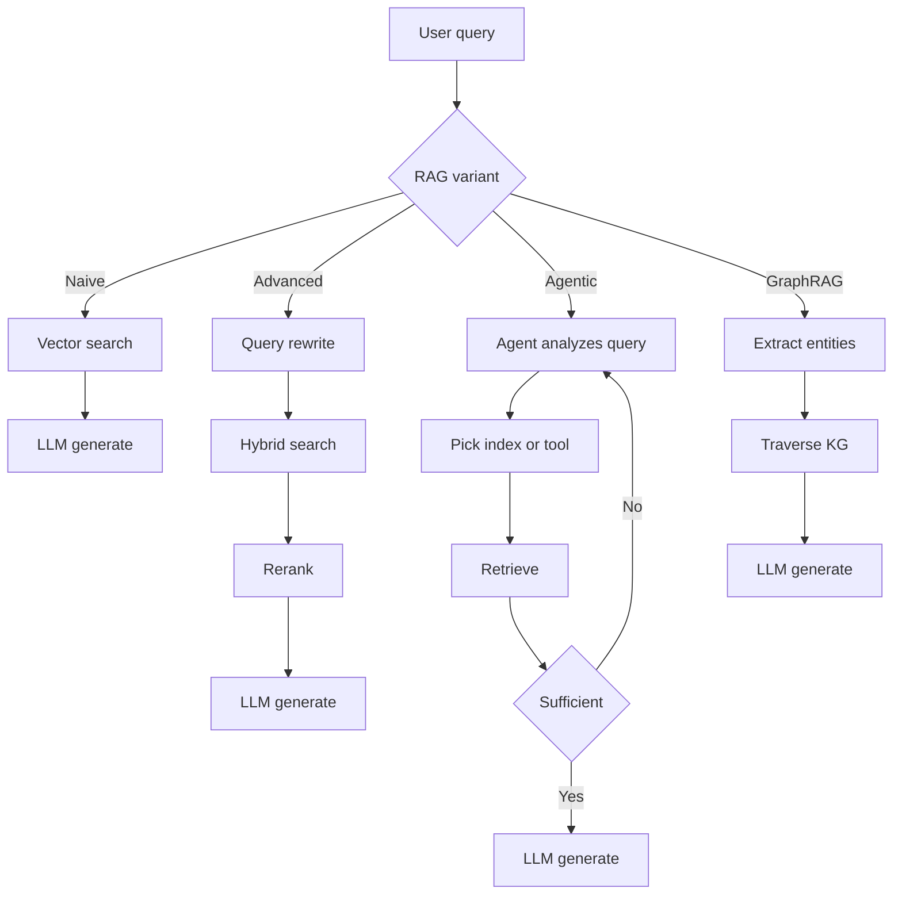
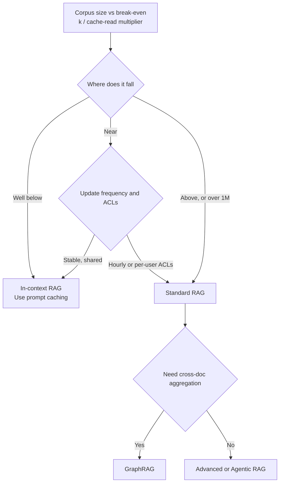

# RAG Fundamentals

How RAG evolved from naive vector search to agentic and graph-based retrieval. When to choose RAG vs. long context, and the three retrieval gaps that cause production failures.

Retrieval-Augmented Generation (RAG) is the architectural pattern of providing an LLM with external, verifiable context to ground its responses. It has evolved from "simple vector search" into a multi-stage reasoning pipeline: hybrid retrieval, reranking, contextual chunking, and agentic loops are now table stakes for production. Deeper material lives in [Chunking Strategies](02-chunking-strategies.md), [Vector Databases](04-vector-databases.md), [Reranking](06-reranking-strategies.md), [Contextual Retrieval](10-contextual-retrieval.md), [ColBERT Late Interaction](11-late-interaction-colbert.md), and the [GraphRAG reframe](07-graph-rag.md).

## Table of Contents

- [The Core Philosophy: Grounding vs. Training](#the-core-philosophy-grounding-vs-training)
- [The RAG Taxonomy](#the-rag-taxonomy)
- [RAG vs. Long Context (The Hybrid Era)](#rag-vs-long-context-the-hybrid-era)
- [The Retrieval Quality Gap](#the-retrieval-quality-gap)
- [Poisoned Sources](#poisoned-sources)
- [Interview Questions](#interview-questions)
- [Key Takeaways](#key-takeaways)
- [References](#references)

---

## The Core Philosophy: Grounding vs. Training

| Aspect | Fine-Tuning | RAG |
|--------|-------------|-----|
| **Knowledge Type** | Internalized (Weights) | Externalized (Context) |
| **Update Cycle** | High Cost (Retraining) | Low Cost (Re-embed changed docs) |
| **Attribution** | None (Black box) | Explicit (Citations) |
| **Privacy** | Hard to "Unlearn" | Easy to filter/delete |

**Rule of thumb**: Fine-tuning is for **Form** (style, tone, syntax); RAG is for **Fact** (knowledge, data, grounding).

---

## The RAG Taxonomy

Production RAG systems are categorized by their "Agentic Depth":

### 1. Naive RAG (Retrieve-then-Generate)
- **Flow**: User Query -> Vector Search -> Top-K -> LLM.
- **Status**: Deprecated for production due to "Retrieval Gap" and low precision.

### 2. Advanced RAG (Multi-Stage)
- **Flow**: Query Transformation -> Hybrid Search -> Reranking -> LLM.
- **Key Nuance**: Uses **RRF (Reciprocal Rank Fusion)** to combine keyword and semantic results.

### 3. Agentic RAG (Loop-based)
- **Flow**: Agent analyzes query -> Decides which tools/indices to search -> Evaluates results -> Re-retrieves if info is missing.
- **Techniques**: Self-RAG, Corrective RAG (CRAG).

### 4. GraphRAG (Structured context)
- **Flow**: Extract entities/relationships -> Build Knowledge Graph -> Traverse graph to find "connected knowledge."
- **Win**: Solves "Aggregative Questions" (e.g., "Summarize all legal risks across 50 documents").

The four variants by agentic depth:



---

## RAG vs. Long Context (The "Hybrid Era")

Frontier context windows have settled at about **1M tokens**: Claude Opus 5.5, Sonnet 5.5 and Fable 5.1 at 1M, the GPT-6 family at 1.05M, Gemini 3.8 Flash at 1,048,576 input tokens. The 2M windows of the Gemini 1.5 era did not become the norm. What changed in 2026 is not the window size but the **price of rereading it**.

- **In-Context RAG (ICR)**: For small, stable corpora, skip the vector DB and put everything in a cached prompt prefix.
- **Prompt caching** discounts reread tokens, but the discount now varies by model: cache reads are 0.1x input on most models, 0.05x on Claude Opus 5.5 and GPT-6.1 Sol, and 0.025x on Claude Fable 5.1 ($0.25 per 1M against $10 list). You still pay the cache write: 1.25x on OpenAI GPT-5.6 and later (fixed 30-minute TTL) and on Anthropic's 5-minute TTL, 2x on Anthropic's 1-hour TTL.
- **Long-context cliffs**: OpenAI bills the **entire request** at long-context rates once input passes 272K tokens (2x input and cache, 1.5x output; GPT-6 Sol goes from $2/$10 to $4/$15), xAI doubles every token once a Grok prompt reaches 200K, and Gemini 3.1 Pro Preview steps up from $2/$12 to $4/$18 above 200K. Anthropic Claude 4.6 and later stay flat to 1M. A 273K-token prompt on GPT-6 Sol costs roughly twice a 272K one, so pack context just under the threshold or retrieve instead.

### The Break-Even Moved

Ignoring cache writes, output tokens and latency, stuffing a cached corpus of **N** tokens costs about the same per query as sending **k** freshly retrieved tokens when:

```
N x cache_read_multiplier = k        =>        N_break_even = k / multiplier
```

With a retrieved context of 5K tokens (the same assumption [Production RAG at Scale](14-production-rag-at-scale.md#the-cache-read-break-even) uses):

| Cache-read multiplier | Example models (October 2026 list) | Break-even cached corpus |
|---|---|---|
| 0.1x | Sonnet 5.5, GPT-6 Sol, most others | ~50K tokens |
| 0.05x | Opus 5.5, GPT-6.1 Sol | ~100K tokens |
| 0.025x | Fable 5.1 | ~200K tokens |

Double the retrieved context (10K tokens of chunks) and every break-even doubles with it.

Below the break-even, in-context is cheaper per query and removes retrieval misses as a failure mode. Above it, retrieval wins on cost, and the gap widens with corpus size. Three things push the practical break-even lower than the formula: cache writes every time the prefix changes or expires (a corpus queried less often than the cache TTL pays the write again and again), prefill latency on hundreds of thousands of tokens even when cached, and long-context recall that still degrades on needle-style questions. Recompute this per model rather than quoting a fixed token threshold; a model swap changes it even at the same list price.

**Architectural Decision**:
- Corpus below the break-even for your model, stable, and visible to every user: **In-Context RAG** with caching.
- Corpus above the break-even, changing hourly, or permissioned per user: **Standard RAG**. Per-user access control alone forces retrieval, because a shared cached prefix cannot contain documents some users may not see.

Decision tree for picking between standard RAG and in-context RAG:



---

## The Retrieval Quality Gap

The "Retrieval Gap" is the #1 cause of RAG failure.
- **Gap 1: Semantic Mismatch**: Query says "fast cars," DB has "Porsche 911." Solved by better embeddings plus **Cross-Encoder Reranking**.
- **Gap 2: Missing Context**: Relevant info is in the DB, but the Retriever missed it. Solved by **Hybrid Search**.
- **Gap 3: Lost-in-the-Middle**: Info is in the prompt, but the LLM misses it. Solved by **Context Compression** and putting the strongest evidence first.

---

## Poisoned Sources

The three gaps assume the corpus is trustworthy. For web-grounded RAG it is not. In September 2026 researcher Ariel Simon (Vigilance Security) reported a campaign that flooded the web with fake support pages, posts and PDFs so that ChatGPT, Gemini and Google AI Overviews would return phishing phone numbers and login portals for airlines and banks, including Delta, Lufthansa, Chase and Bank of America. Nothing was jailbroken: the retriever did its job and ranked the attacker's pages.

Defenses that belong in the retrieval layer, not the prompt:
- **Source reputation as a ranking feature**: weight official domains and known publishers above fresh, low-authority pages for the same entity.
- **Verified-contact allowlists** for high-risk answer types (support numbers, payment portals, login URLs): answer only from a curated registry, or refuse and link to the official site.
- **Provenance in the answer**: cite the domain next to any contact detail so users can spot a mismatch.

See [LLM Security](../12-security-and-access/01-llm-security.md) for indirect prompt injection through retrieved content.

---

## Interview Questions

### Q: Why would you still use RAG if frontier models ship 1M-token contexts?

**Strong answer:**
Four reasons:
1. **Cost and Latency**: Even with prompt caching, rereading a large corpus on every query costs `N x cache-read rate`, and prefill on hundreds of thousands of tokens still adds TTFT (Time to First Token). The break-even corpus is roughly retrieved tokens divided by the cache-read multiplier: about 50K tokens at the common 0.1x, about 200K on Claude Fable 5.1 at 0.025x, for a 5K-token retrieved context. Above that, retrieving chunks is cheaper. On OpenAI, crossing 272K input also bills the whole request at 2x input and 1.5x output.
2. **Freshness**: RAG can access real-time APIs (stock prices, news) and changed documents without rewriting and re-caching a giant prefix.
3. **Scale**: Enterprise datasets (SharePoint, terabytes of logs) exceed any context window. RAG is the filter that finds the relevant 0.01% of data that *should* go into the window.
4. **Access control**: A cached prefix is shared across every user who hits it. If documents carry per-user permissions, you have to filter at retrieval time anyway.

### Q: What is "Agentic RAG" and how does it differ from "Advanced RAG"?

**Strong answer:**
Advanced RAG is a **deterministic pipeline** (Linear: Rewrite -> Search -> Rerank). Agentic RAG is a **stochastic loop**. In Agentic RAG, the model is given tools to decide *how* to retrieve. For example, if the agent finds that the retrieved documents are irrelevant, it can decide to "Search Google" or "Query the SQL database" instead. It essentially adds a "Reasoning step" before and after retrieval to ensure the context is sufficient to answer the prompt.

---

## Key Takeaways

- Naive RAG (vector search + top-K + LLM) is deprecated for production; ship Advanced RAG (hybrid + RRF + rerank) as the new baseline.
- Long context windows do not kill RAG: cost, latency, freshness, per-user permissions, and corpus scale all push you back to retrieval even at 1M context.
- Choose by break-even, not a fixed threshold: in-context with caching wins below roughly retrieved tokens divided by the cache-read multiplier (about 50K tokens at 0.1x and 200K at 0.025x for a 5K-token retrieved context); above it, use standard RAG; aggregative questions go GraphRAG.
- Web-grounded RAG needs source reputation and allowlists for high-risk answers like support numbers; poisoning attacks target the ranking, not the model.
- Most RAG failures are retrieval failures, not generation failures; diagnose the three gaps (semantic, missing context, lost-in-the-middle) before tuning prompts.
- Agentic RAG vs. Advanced RAG is a stochastic-loop vs. deterministic-pipeline choice; only adopt agentic when query patterns are too varied for a fixed pipeline.

---

## References
- Gao et al. "Retrieval-Augmented Generation for LLMs: A Survey" (2024 update)
- [Edge et al. "From Local to Global: A Graph RAG Approach to Query-Focused Summarization" (Microsoft Research, 2024)](https://arxiv.org/abs/2404.16130)
- [Lee et al. "Can Long-Context Language Models Subsume Retrieval, RAG, SQL, and More?" (Google DeepMind, 2024)](https://arxiv.org/abs/2406.13121)
- [Anthropic. "Introducing Contextual Retrieval" (Sep 2024)](https://www.anthropic.com/news/contextual-retrieval)

---

*Previous: [Prompt Injection Defense](../05-prompting-and-context/08-prompt-injection-defense.md) | Next: [Chunking Strategies](02-chunking-strategies.md)*
