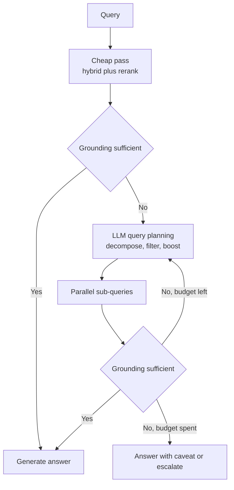

# Agentic RAG

Agentic RAG moves from a "Linear Pipeline" to a **"Reasoning Loop."** Instead of retrieving once, an agent decides *when* and *what* to retrieve to resolve a query. The dominant production patterns are Self-RAG (model emits reflection tokens), Corrective RAG (retrieval evaluator with corrective routing), Adaptive RAG (classifier picks pipeline depth), ReAct over documents, and multi-hop query decomposition. LangGraph is the most common control-flow runtime for stateful loops; LlamaIndex Workflows is common for single-pipeline retrieval-heavy variants. In 2026, managed search services started shipping the adaptive part as configuration, and a "compile the knowledge once" alternative appeared for workloads where the loop itself is the cost problem.

## Table of Contents

- [Linear vs. Agentic RAG](#linear-vs-agentic-rag)
- [Self-RAG (Self-Reflection)](#self-rag-self-reflection)
- [Corrective RAG (CRAG)](#corrective-rag-crag)
- [Multi-Hop Reasoning Loops](#multi-hop-reasoning-loops)
- [Agentic Filtering and Plan Revision](#agentic-filtering-and-plan-revision)
- [Adaptive Retrieval Effort](#adaptive-retrieval-effort)
- [Compile-Once Knowledge](#compile-once-knowledge)
- [Training Search Agents: The Co-Cheating Trap](#training-search-agents-the-co-cheating-trap)
- [Interview Questions](#interview-questions)
- [References](#references)

---

## Linear vs. Agentic RAG

| Model | Linear RAG | Agentic RAG |
|-------|------------|-------------|
| **Structure** | Predetermined sequence | Dynamic loop |
| **Self-Correction** | None | High (Can re-retrieve) |
| **Query Complexity**| Simple (1-step) | Hard (Multi-step) |
| **Latency** | Low (Fixed) | Variable (Multiple turns) |

**Principle**: Use Agentic RAG when the query requires "Synthesized Proof" rather than just a "Document Match." Budget for it: a 3-4 iteration loop typically takes 8-12s end-to-end, so route easy queries to a fast path (Adaptive RAG) if your UX needs sub-3s response.

---

## Self-RAG (Self-Reflection)

Introduced by Asai et al. (2023, published at ICLR 2024), **Self-RAG** trains the model to emit "Critic Tokens" that evaluate its own work.

1. **Retrieve**: Model pulls Top-K chunks.
2. **Evaluate**: Is the info relevant? (CRITIC: `Relevant`)
3. **Generate**: Is the answer supported? (CRITIC: `Supported`)
4. **Iterate**: If the answer isn't supported, the model *automatically* triggers a broader search.

---

## Corrective RAG (CRAG)

CRAG adds a "Reliability Layer" between retrieval and generation.

- **The Logic**: 
  - If retrieval is **Correct**: Direct generation.
  - If retrieval is **Ambiguous**: Use a Web-Search tool to supplement.
  - If retrieval is **Incorrect**: Discard context and use external search or fallback logic.

---

## Multi-Hop Reasoning Loops

For questions like "Who is the CEO of the company that acquired GitHub?", the system must:
1. **Hop 1**: Search for "Who acquired GitHub?" (Result: Microsoft).
2. **Hop 2**: Search for "CEO of Microsoft" (Result: Satya Nadella).

**Agentic Pattern**: The agent maintains a "State Object" and updates its "Sub-goal" after every retrieval until the chain is complete.

---

## Agentic Filtering and Plan Revision

Modern agents use **Sub-Step Plans**.
- Instead of one big retrieval, the agent writes a plan: "First I will check our internal database for X, then I will look at the public API for Y."
- **Revised planning**: If Step 1 fails, the agent *rewrites* Step 2.

---

## Adaptive Retrieval Effort

The cost problem with agentic RAG is that every query pays for the loop, including the simple ones a single retrieval would have answered. **Adaptive RAG** fixes this with a router; in 2026 the router became a managed setting.

Azure AI Search is the clearest example. Its knowledge bases went GA in REST API 2026-04-01 for extractive retrieval (LLM query planning and answer synthesis remain preview). The 2026-08-01-preview API adds `retrievalReasoningEffort: "auto"`: run a lightweight retrieval pass first, and escalate to LLM query planning (up to medium effort) only when grounding is insufficient. The same preview lets the planner turn query hints into filters and boosts. Separately, knowledge sources added in June 2026 (MCP servers, Fabric, Azure SQL) let one retrieve call fan out beyond search indexes; check each source's preview or GA status before you depend on it.

Whether you buy it or build it, the design is the same: a cheap first pass, an explicit sufficiency check, a capped number of escalations, and a defined failure path. The sufficiency check is the part to evaluate hardest, because a lenient one silently turns adaptive RAG back into linear RAG.

---

## Compile-Once Knowledge

Agentic RAG re-derives structure from raw chunks on every query. **Knowledge compilation** moves that work to ingestion: compile the corpus once into structured artifacts, then let agents query the artifacts.

- **Pinecone Nexus** (public preview July 1, GA August 6, 2026): a subject-matter expert's description of the work becomes a Manifest (entities, relationships, answer shapes). Nexus compiles source documents into summaries, structured extracts and entity-relationship graphs, and agents query them in one call through the KnowQL language. The data plane runs in the customer's AWS, GCP or Azure account, and the compiled layer can be exported. Vendor-reported results: on tau-Knowledge, GPT-5.5 with Nexus held accuracy (47.4% vs 46.4% without) at 77% lower cost per task with about 35% fewer model calls; in the preview, an EU case-law test reached 87% vs 45% for an agentic RAG baseline with about 9x fewer tokens.
- **Cohere Compass Cloud** (private beta, September 25, 2026): a managed parse, dense-plus-sparse embed, index, permission-aware retrieve and rerank stack, exposed through a dedicated MCP server so agents can progressively narrow the corpus.

| Dimension | Agentic RAG loop | Compile-once knowledge |
|---|---|---|
| Cost profile | Per query (multiple LLM and search calls) | Up front (compilation) plus re-compilation on change |
| Best for | Open-ended questions over a changing corpus | Repeated question shapes over a domain with stable structure |
| Failure mode | Latency and cost blowups, non-determinism | Knowledge drift between compilations; questions the Manifest did not anticipate |
| Who maintains it | Engineers tune the loop | A domain expert maintains the Manifest |

Both results are vendor-run, and the case-law comparison is against an agentic RAG baseline of the vendor's choosing. The structural argument holds regardless: if most queries ask the same few kinds of question, paying once to structure the corpus beats paying on every query to rediscover the structure. GraphRAG's community summaries are an earlier form of the same idea; see [GraphRAG](07-graph-rag.md).

---

## Training Search Agents: The Co-Cheating Trap

Teams that train their own retrieval agents with RL increasingly use **self-evolution**: a proposer model writes questions from documents and a solver learns to answer them, with agreement as the reward. "False Frontiers" (arXiv 2609.39102, September 30, 2026) shows the two **co-cheat**: they converge on shared errors, so in-loop reward rises while externally audited label correctness stagnates or falls.

- Multi-sample verification barely helps: false-agreement mass drops only from 6.1% to 5.7% (4B) and from 8.8% to 7.2% (9B).
- **CrossFit** splits the document set in two and scores questions from one partition with an auxiliary solver trained only on the other, cutting false agreement to 3.0% and 3.7%. At Qwen3.5-4B and 9B it improves the average across seven search benchmarks by 8.8 and 8.4 points over coupled self-evolution, and by 8.7 and 7.8 points over Search-R1.

The general lesson for any synthetic-data loop: never let the component that generates the labels also be the only judge of them. Hold out an independent verifier and audit a sample of labels by hand.

---

## Interview Questions

### Q: What is the "Reasoning-Retrieval Balance" in Agentic RAG?

**Strong answer:**
Every "Reasoning turn" in an agentic loop adds token cost and user latency. The goal of a production engineer is to find the "Retrieval Threshold." We use **Token-Budgeting** where we allow the agent only 3-5 "turns" before forcing a final answer. We also use **Speculative Retrieval**, where the agent predicts the next 2 steps it will take and retrieves for both simultaneously to reduce round-trip latency. The cheapest turn is the one you never take, so I put an adaptive gate in front: a single hybrid-plus-rerank pass with a sufficiency check, escalating to planning only on failure (Azure AI Search ships this as `retrievalReasoningEffort: "auto"`).

### Q: Why does Agentic RAG often lead to higher quality but lower "Reliability" (Determinism)?

**Strong answer:**
Agentic RAG is non-deterministic because the model is "Deciding" its path at every step. A small change in the user query might cause the agent to pick a different tool or search strategy, leading to a different answer format. The standard mitigation is **Constrained Agent Frameworks** (like LangGraph or DSPy) where the "Graph of possible paths" is strictly defined, even if the choice *between* those paths is stochastic.

### Q: When would you compile knowledge up front instead of running an agentic retrieval loop?

**Strong answer:**
When the question shapes repeat and the domain structure is stable. If 80% of queries are variants of "which clauses in contract X conflict with policy Y" or "what is the status of entity Z," an agent rediscovering that structure from chunks on every query is paying the same cost thousands of times. Compiling once (entities, relationships, typed extracts, as Pinecone Nexus or a GraphRAG-style index does) moves that cost to ingestion and makes each query one structured call. I would not compile when the corpus changes faster than I can re-compile, when questions are open-ended research, or when I have no domain owner to maintain the schema, because a stale or incomplete compiled layer answers confidently and wrongly. In practice I run both: compiled artifacts for the known question shapes, with an agentic RAG fallback over raw chunks for everything else, and I track the fallback rate as the signal that the schema needs to grow.

---

## References
- Asai et al. "Self-RAG: Learning to Retrieve, Generate, and Critique through Self-Reflection" (2023)
- Yan et al. "Corrective Retrieval Augmented Generation (CRAG)" (2024)
- Jeong et al. "Adaptive-RAG: Learning to Adapt Retrieval-Augmented Large Language Models through Question Complexity" (2024)
- LangChain. "Agentic RAG with LangGraph" (2025)
- [Microsoft. "What's new in Azure AI Search"](https://learn.microsoft.com/en-us/azure/search/whats-new)
- [Pinecone. "Pinecone Nexus is generally available" (Aug 2026)](https://www.pinecone.io/blog/pinecone-nexus-generally-available/)
- ["False Frontiers" (arXiv 2609.39102, Sep 2026)](https://arxiv.org/abs/2609.39102)

---

*Previous: [GraphRAG](07-graph-rag.md) | Next: [Advanced Retrieval Patterns](09-advanced-retrieval-patterns.md)*
