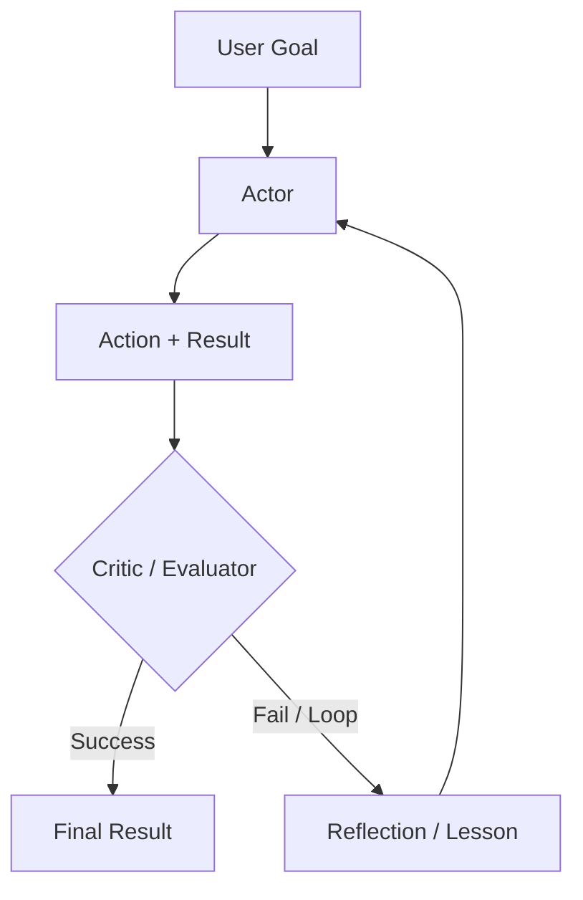

# Reasoning Loops: ReAct and Beyond

Reasoning Loops define the control flow of an agent. While **ReAct** was the 2023 baseline, current systems use more sophisticated patterns like **Plan-and-Solve**, **Self-Reflexion**, and **Inference-Time Scaling** running on top of reasoning-native models.

## Table of Contents

- [The Evolution of the Loop](#the-evolution-of-the-loop)
- [ReAct: The Classic Pattern](#react-reasoning--acting)
- [Self-Reflexion Loops](#self-reflexion-loops)
- [Plan-and-Solve](#plan-and-solve)
- [Flow Engineering (The LangGraph Pattern)](#flow-engineering-langgraph)
- [Interview Questions](#interview-questions)
- [References](#references)

---

## The Evolution of the Loop

| Era | Pattern | Core Philosophy |
|-----|---------|-----------------|
| **2023** | ReAct | Interleave thought and action. |
| **2024** | Reflexion | Evaluate errors and re-try. |
| **2025** | System 2 Loops | Use hidden CoT for reliable multi-step logic. |
| **2026** | Engineered harness loops | Thinking interleaved between tool calls, with the harness owning termination, verification, and budgets (see [Loop Engineering](12-loop-engineering.md)). |

---

## ReAct: Reasoning + Acting

The fundamental loop for 90% of agents:
1. **Thought**: "I need to find X."
2. **Action**: `search_engine("X")`
3. **Observation**: "X is at Y."
4. **Repeat**.

**Critique**: ReAct is fragile. If the search returns "No results," a naive ReAct agent will often try the same search again. Modern loops inject **"Negative Constraints"** (e.g., "Don't try search results we've already seen").

---

## Self-Reflexion Loops

Reflexion adds a **"Critic"** step to the loop.

**Benefit**: By storing these "Reflections" in short-term memory, the agent builds a "Mental Map" of what doesn't work during the current session.

---

## Plan-and-Solve

Instead of deciding one step at a time (greedy approach), the agent creates a **Static Plan** first, then executes it.

1. **Planner**: "I will do A, then B, then C."
2. **Executor**: Carries out the steps.
3. **Re-planner**: If step B fails, trigger a full re-plan rather than a local fix.

**Why?**: Planning reduces "Stochastic Errors." By committing to a path, the model is less likely to get distracted by noisy tool results.

---

## Flow Engineering (LangGraph)

Modern agentic systems have moved from "Chat interfaces" to **"State Machines."**

- **Cyclic Graphs**: Instead of a linear sequence, we define a graph where the model can loop back to a "Cleaning" node or a "Validation" node multiple times.
- **Micro-Agents**: Each node in the graph is a specialized "Prompt" or "Tool."

**Key Nuance**: The "Agent" is no longer just the LLM; the agent is the **Graph Execution Engine**.

---

## Interview Questions

### Q: When would you use a "Reasoning Loop" (ReAct) vs. a "Plan-and-Solve" architecture?

**Strong answer:**
I choose **ReAct** for **Exploratory** tasks where the environment is unpredictable (e.g., browsing a new website where you don't know the URL structure yet). The agent needs to react to every observation. I choose **Plan-and-Solve** for **Predictable** but complex workflows (e.g., generating a financial report from 5 known APIs). Planning prevents the model from "meandering" and allows for better parallelization of steps that don't depend on each other.

### Q: What is "Inference-Time Scaling" and how does it relate to Agentic Loops?

**Strong answer:**
Inference-Time Scaling (popularized by OpenAI's o1 in 2024) refers to spending more compute *during the response generation* rather than just during training. In current APIs it surfaces as an **effort** setting: GPT-6 Astra exposes five levels from low to max, and Claude Opus 5.5 and Fable 5.1 scale adaptive thinking with an effort parameter. In an agentic context, more thinking means the model weighs alternatives before committing to an action, which can cut the number of "Real World" tool calls and the failure rate. Two things I keep separate in an interview. First, vendors have not said their reasoning models run explicit tree search internally; if I want **Search Trees** (best-of-N, MCTS with a verifier), I build them in the harness, where I can see and score the branches. Second, effort is a cost and latency knob I tune per step, so I run the planner at high effort and the routine executor steps at low effort rather than paying maximum thinking on every tool call.

---

## References
- Yao et al. "ReAct: Synergizing Reasoning and Acting in Language Models" (2022). https://arxiv.org/abs/2210.03629
- Shinn et al. "Reflexion: Language Agents with Verbal Reinforcement Learning" (2023). https://arxiv.org/abs/2303.11366
- Wang et al. "Plan-and-Solve Prompting" (2023). https://arxiv.org/abs/2305.04091

---

*Next: [Tool Use and the Model Context Protocol (MCP)](03-tool-use-and-mcp.md)*
