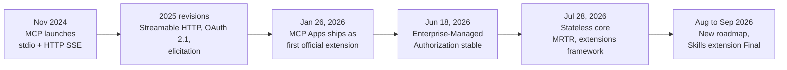
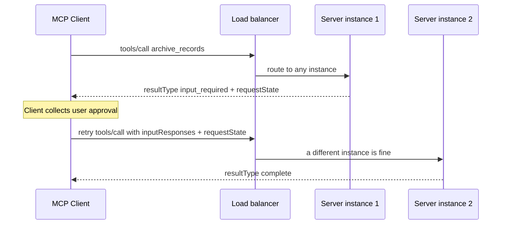
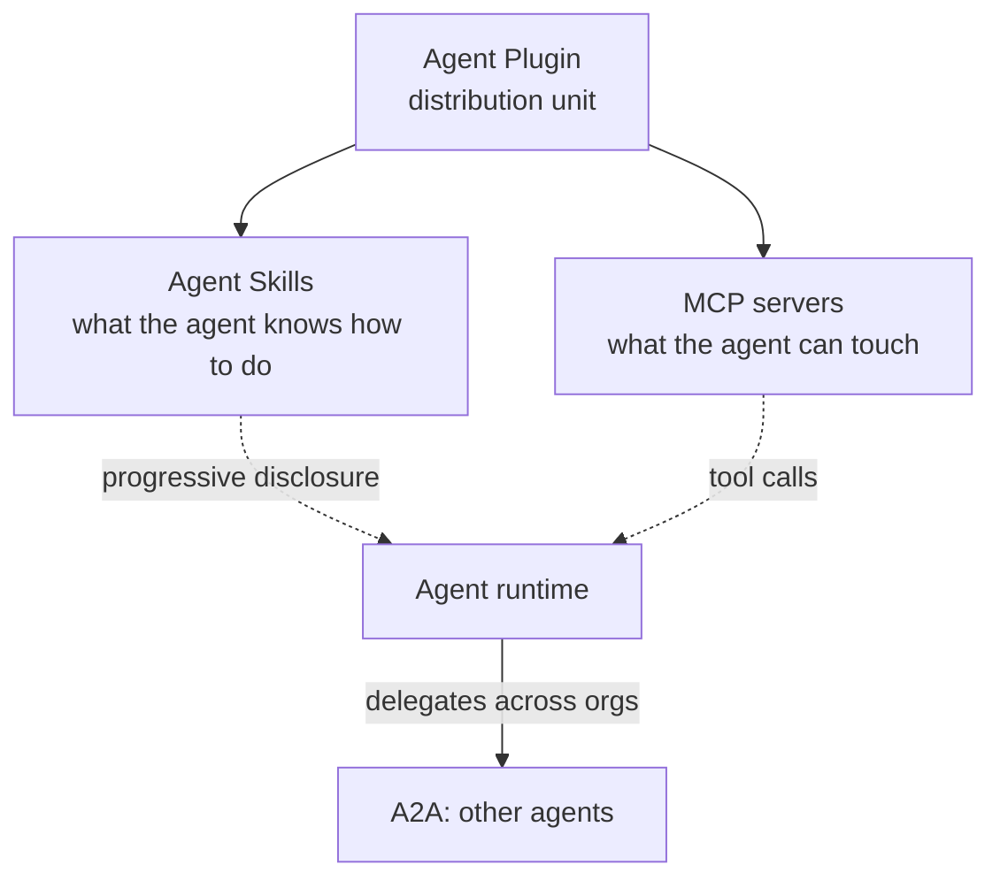
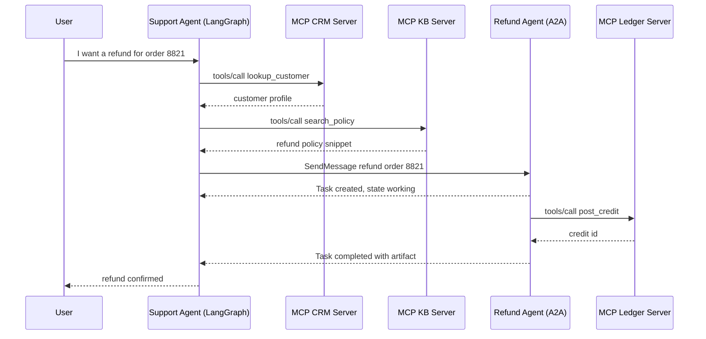
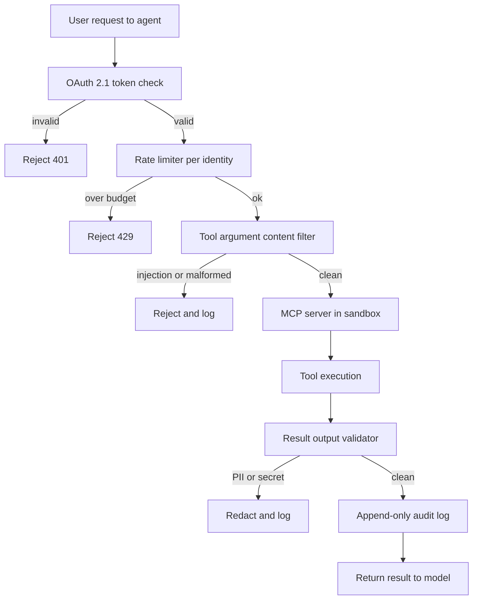

# Tool Use and MCP

Tools are the "hands" of an agent. The industry has standardized on the **Model Context Protocol (MCP)**, which replaces fragmented custom tool definitions with one communication layer that runs locally over stdio or remotely over Streamable HTTP. Streamable HTTP and OAuth 2.1 authorization arrived in the 2025 spec revisions (commentary often calls this "MCP 2.0", but no spec release carries that name, and the SDK 2.x majors of July 2026 are a separate numbering), and the **2026-07-28 revision** rebuilt the protocol core as stateless, the largest overhaul since MCP launched (see [the stateless rewrite](#mcp-2026-07-28-the-stateless-rewrite) below). In parallel, **Agent-to-Agent (A2A)** complements MCP's tool-access layer with agent coordination, and since August 2026 both protocols sit under the same Linux Foundation umbrella, the Agentic AI Foundation.

## Table of Contents

- [The Tool-Use Mechanism](#the-tool-use-mechanism)
- [Model Context Protocol (MCP)](#model-context-protocol-mcp)
- [Defining High-Precision Tools](#defining-high-precision-tools)
- [MCP vs. OpenAI Function Calling](#mcp-vs-openai-function-calling)
- [Streaming Tool Calls](#streaming-tool-calls)
- [The 2025 Revisions: Streamable HTTP and Auth](#the-2025-revisions-streamable-http-and-auth)
- [MCP 2026-07-28: The Stateless Rewrite](#mcp-2026-07-28-the-stateless-rewrite)
- [MCP Extensions and Ecosystem (October 2026)](#mcp-extensions-and-ecosystem-october-2026)
- [Agent Plugins](#agent-plugins)
- [Agent-to-Agent Protocol (A2A)](#agent-to-agent-protocol-a2a)
- [The Protocol Landscape: Tools, Agents, and Payments](#the-protocol-landscape-tools-agents-and-payments)
- [A2A v1.0 and MCP in Production](#a2a-v10-and-mcp-in-production)
- [Computer-Use Tools (Anthropic)](#computer-use-tools-anthropic)
- [Context7: Live Documentation MCP](#context7-live-documentation-mcp)
- [Interview Questions](#interview-questions)
- [References](#references)

---

## The Tool-Use Mechanism

Tool use occurs in a 3-step cycle:
1. **Schema Presentation**: The model is given a JSON schema of the tools.
2. **Intent & Extraction**: The model outputs a "Call" (e.g., `{"tool": "get_weather", "args": {"city": "Tokyo"}}`).
3. **Execution & Contextualization**: The system runs the function and feeds the result back into the prompt.

**Nuance**: Production stacks no longer "hardcode" tool definitions into the system prompt. They use **Dynamic Manifests** that fetch only necessary tools based on the user's intent.

Three provider-side changes in 2026 matter for harness code:

- **Forced tool use is gone on the newest Claude models.** Fable 5.1, Mythos 5.1, Opus 5.5, and Sonnet 5.5 return HTTP 400 for `tool_choice` of `any` or `tool`; only `auto` and `none` remain. The old "force a tool call to get JSON" extraction pattern must move to `auto` plus strict tool use, or to structured outputs.
- **Tools can change mid-conversation without losing the cache.** Anthropic's `inline-tools-2026-09-15` beta (September 22) defines, replaces, or removes tools inside a mid-conversation system message without invalidating the prompt cache, and can pin a fetched MCP tool list in an `mcp_tool_listing` block so a server cannot swap definitions mid-session.
- **Tool calling on GPT-6 Astra requires the Responses API**, and Astra drops `temperature`, `top_p`, and logprobs, so harnesses that tuned sampling or read logprobs for tool routing need another mechanism.

---

## Model Context Protocol (MCP)

Developed by Anthropic (released November 2024) and now the universal tool-integration standard across Anthropic, OpenAI, Google, Microsoft, and AWS, MCP allows models to interact with data and tools regardless of where they live. Governance moved to the Linux Foundation's Agentic AI Foundation in December 2025.

- **MCP Client**: The AI application (e.g., your agent code).
- **MCP Server**: A standalone process that exposes Tools (Functions), Resources (Data), and Prompts (Templates).
- **Communication**: Uses JSON-RPC over stdio (local) or Streamable HTTP (remote).

### Why MCP?
- **Security**: Tools run in their own process, not in the model logic.
- **Portability**: Write a "Postgres Tool" once, use it in Claude, GPT, or Llama.
- **Discoverability**: Standardized `tools/list`, `resources/read`, and `prompts/list` methods, plus the `server/discover` RPC that the 2026-07-28 revision made mandatory.

---

## Defining High-Precision Tools

A production-quality tool must include:

1. **Strict Type Validation**: Use Pydantic or Zod to enforce schemas before the call executes, and turn on the provider's strict tool mode so arguments are constrained to the schema at generation time.
2. **Detailed Docstrings**: Describe *when NOT* to use the tool.
3. **Confidence Thresholds**: Require the model to output a `confidence` score for the tool call. Treat it as a routing hint, not a calibrated probability.
4. **Deliberate, Model-Visible Errors**: Since MCP Python SDK 2.1.0, an unexpected exception in a handler is logged and the client sees only `Error executing tool <name>`; raise `ToolError` for messages the model should act on. That default is right (stack traces leak internals), but it means actionable errors must be designed, not leaked.

```python
# MCP Python SDK 2.x: `pip install mcp` now resolves to 2.x, and FastMCP was renamed MCPServer.
# Projects not ready to migrate should pin mcp<2 (v1 receives security and critical fixes only).
from mcp.server import MCPServer

mcp = MCPServer("analytics")

@mcp.tool()
def execute_sql(query: str) -> list[dict]:
    """Run ONE read-only SELECT against the analytics replica.
    Do NOT use for DDL or writes: DROP, DELETE, and UPDATE are rejected
    by the database role, not just by this docstring."""
    ...  # parameterize, enforce a row limit, run under a read-only role
```

---

## MCP vs. OpenAI Function Calling

| Feature | OpenAI Native | MCP |
|---------|---------------|-----|
| **Coupling** | High (OpenAI specific) | Low (Agnostic) |
| **Transport** | JSON in API body | JSON-RPC (Local/Remote) |
| **Data Access**| No native data "Resource" | Native `Resources` support |
| **Best For** | Prototyping | Enterprise Orchestration |

The comparison is less either/or than the table suggests. OpenAI's Responses API, its Agents SDK, and the managed Agents API (public beta September 10, 2026) all consume remote MCP servers, so function calling is the wire format inside a provider API and MCP is how the tool is packaged, secured, and reached.

---

## Streaming Tool Calls

Frontier models support **Partial Tool Speculation**.
Instead of waiting for the full JSON to generate, the system starts "prefetching" tool results as soon as the tool name and critical IDs are visible in the stream. This reduces perceived latency by **400-800ms**.

---

## The 2025 Revisions: Streamable HTTP and Auth

MCP spec revisions are dated, not numbered: 2024-11-05, 2025-03-26, 2025-06-18, 2025-11-25, and 2026-07-28 (current). The **2025-03-26** revision (March 2025) introduced the two changes that made remote MCP practical, and the 2025-06-18 revision hardened the auth model into the shape used today. "MCP 2.0 ratified in March 2026" is a common misdating of the same changes, one year late.

### 1. Streamable HTTP Transport
Launch-era MCP used stdio locally or HTTP with a separate Server-Sent Events channel remotely. **Streamable HTTP** replaced HTTP+SSE with a single endpoint: the client POSTs JSON-RPC messages to it, and the server answers with a plain JSON response, or with an SSE stream when it needs to send several messages.

```
[MCP Client] ──── POST /mcp (JSON-RPC) ────→ [MCP Server]
             ←─── JSON response, or an SSE stream ───
```

- Enables MCP servers deployed as cloud microservices (not just local processes)
- stdio remains the local transport; HTTP+SSE has been deprecated since 2025-03-26, and the 2026-07-28 revision moved it onto the spec's formal deprecation track

### 2. OAuth 2.1 Authorization
Remote MCP servers can require OAuth 2.1 with PKCE. Since 2025-06-18 the MCP server is an OAuth **resource server**: it advertises its authorization server through Protected Resource Metadata (RFC 9728), and clients must send the RFC 8707 `resource` parameter so every token is audience-bound to one server. A request without a token gets a challenge that tells the client where to start:

```http
HTTP/1.1 401 Unauthorized
WWW-Authenticate: Bearer resource_metadata="https://mcp.example.com/.well-known/oauth-protected-resource",
                         scope="files:read"
```

This enables enterprise MCP servers with fine-grained, per-server access control. The 2025-11-25 revision added Client ID Metadata Documents as a recommended registration mechanism and incremental scope consent, where a server answers HTTP 403 `insufficient_scope` with the scope it needs (step-up). The 2026-07-28 revision then deprecated Dynamic Client Registration in favor of those metadata documents and made clients validate the RFC 9207 `iss` parameter when the authorization server sends it, both covered below.

---

## MCP 2026-07-28: The Stateless Rewrite

On July 28, 2026 the MCP project finalized spec revision **2026-07-28**, the largest protocol overhaul since MCP launched, after a ten-week release-candidate freeze. The headline: **the protocol core is now stateless**. The `initialize` handshake and the `Mcp-Session-Id` header are gone; every request carries the protocol version and client capabilities in `_meta`, and servers identify themselves in result `_meta`. Cross-call state moves into explicit server-minted handles passed as ordinary tool arguments. The practical consequence is that a remote MCP server can now run as a horizontally scaled deployment behind a plain round-robin load balancer with zero shared session state, which previously required sticky sessions or a shared session store.

### How MCP Got Here



### Three Generations of MCP, Compared

| Dimension | Launch (Nov 2024) | Streamable HTTP era (2025 revisions) | 2026-07-28 revision |
|-----------|-------------------|--------------------------------------|---------------------|
| **Session model** | Stateful `initialize` handshake | Stateful, `Mcp-Session-Id` over Streamable HTTP | Stateless; version and capabilities ride in `_meta` on every request |
| **Transport** | stdio, HTTP+SSE | Adds Streamable HTTP | Streamable HTTP with mandatory `Mcp-Method` / `Mcp-Name` routing headers; HTTP+SSE formally deprecated |
| **Server-initiated requests** | Sampling, roots (server push) | Adds elicitation | Removed; replaced by Multi Round-Trip Requests (client retries with state) |
| **Mid-call user input** | None | `elicitation/create` push | `input_required` result + client retry with `requestState` |
| **Long-running work** | None | Experimental | Tasks official extension (poll-based handles) |
| **Server-rendered UI** | None | MCP Apps ships as an extension (Jan 2026) | MCP Apps folded into the formal extensions framework |
| **Auth** | None standardized | OAuth 2.1 + PKCE, Dynamic Client Registration; CIMD and step-up scope consent added in 2025-11-25 | OAuth hardened: RFC 9207 `iss` validation, issuer-bound credentials, CIMD replaces DCR; EMA extension for enterprise IdPs |
| **List caching** | None | None | Required `ttlMs` + `cacheScope` on list and read results; deterministic tool ordering for prompt-cache hits |
| **Stream recovery** | None | SSE `Last-Event-ID` resumability | Removed; clients re-issue the request, durable work uses Tasks |
| **Horizontal scaling** | Single process | Sticky sessions behind a load balancer | Any instance serves any request; no shared state |

### Multi Round-Trip Requests (MRTR)

The server-initiated request pattern (`elicitation/create`, `sampling/createMessage`, `roots/list`) is removed. When a server needs mid-call user input, it returns a result with `resultType: "input_required"`, an `inputRequests` array, and an opaque `requestState` blob; the client collects the input and retries the original request with `inputResponses` attached. Because the state rides in the retry, any server instance behind the load balancer can resume the interrupted call. This is what makes human-in-the-loop approval gates compatible with stateless horizontal scaling.



All results now carry a required `resultType` field (`complete` or `input_required`; extensions such as Tasks add further values); results from older servers that lack it are treated as `complete`.

### What Is Deprecated or Removed

The revision also adopts a formal feature lifecycle (Active, Deprecated, Removed) with a minimum twelve-month deprecation window and a public deprecated-features registry. For features newly deprecated in this revision (Roots, Sampling, Logging, DCR) the earliest removal is July 28, 2027; HTTP+SSE, deprecated back in March 2025, runs on an earlier clock.

| Feature | Status in 2026-07-28 | Migrate to |
|---------|----------------------|------------|
| `initialize` handshake, `Mcp-Session-Id` | Removed | Version and capabilities in `_meta` per request; `server/discover` RPC for probing |
| `elicitation/create`, `sampling/createMessage`, `roots/list` | Removed | Multi Round-Trip Requests |
| SSE stream resumability (`Last-Event-ID`) | Removed | Re-issue the request; Tasks extension for durable work |
| Roots | Deprecated | Pass directories via tool parameters, resource URIs, or server config |
| Sampling | Deprecated | Call the LLM provider API directly |
| Logging | Deprecated | stderr (stdio) or OpenTelemetry |
| HTTP+SSE transport | Formally deprecated | Streamable HTTP |
| Dynamic Client Registration (RFC 7591) | Deprecated | Client ID Metadata Documents (client ID is a URL hosting the client's metadata) |

The RPC mechanisms (`elicitation/create`, `sampling/createMessage`, `roots/list`) are removed from the core protocol while the features they served are deprecated with migration paths, which is why both kinds of rows appear above.

Two smaller but design-relevant transport changes: `Mcp-Method` and `Mcp-Name` HTTP headers are now mandatory on Streamable HTTP POSTs, so load balancers, gateways, and WAFs can route and filter MCP traffic without parsing JSON-RPC bodies; and list results (`tools/list`, `prompts/list`, `resources/list`) must declare `ttlMs` and `cacheScope`, giving clients a principled answer to caching tool catalogs.

### The Extensions Framework

The core is now deliberately small; everything else is an **extension**, identified by reverse-DNS ID, versioned independently of the core spec, and governed through an Extensions Track in the SEP process. The official extensions include:

| Extension | Status | What it does |
|-----------|--------|--------------|
| **Tasks** (`io.modelcontextprotocol/tasks`) | Official; redesigned poll-based lifecycle, contributed by AWS | A tool call can answer with a task handle; the client polls `tasks/get`, pushes mid-task input with `tasks/update`, cancels with `tasks/cancel`. The standard answer for work that outlives a request. |
| **MCP Apps** | Official since January 26, 2026 | A tool declares a `ui://` template; the host renders it in a sandboxed iframe (no DOM access, deny-by-default CSP), UI-to-host communication is postMessage-carried JSON-RPC, and UI-triggered actions go through the same tool-call consent path. Rendered by Claude, ChatGPT, VS Code, Goose, and Microsoft 365 Copilot, among others. |
| **Enterprise-Managed Authorization (EMA)** | Stable since June 18, 2026 | An organization provisions MCP server access centrally through its IdP: an OIDC or SAML assertion is exchanged (RFC 8693) for an ID-JAG, which a JWT bearer grant (RFC 7523) trades for an MCP access token, with no per-user consent screens. Okta is the first supported IdP; Claude and VS Code shipped support at launch. The ID-JAG grant itself is still an IETF OAuth working-group Internet-Draft (-04), not an RFC, so expect wire-level changes. |

### Migration Checklist

- Remove `initialize` / session-ID logic; send version and capabilities in `_meta`, and implement the `server/discover` RPC (now a MUST).
- Convert elicitation and sampling flows to MRTR: return `input_required` with `requestState`, accept retries with `inputResponses`.
- Move any cross-call state into explicit handles passed as tool arguments, or adopt the Tasks extension.
- Emit `Mcp-Method` / `Mcp-Name` headers, declare `ttlMs` / `cacheScope` on list results, and return tools in deterministic order.
- Plan the auth migration from DCR to Client ID Metadata Documents; validate `iss` per RFC 9207 and never reuse client credentials across issuers.
- Budget real work: the maintainers themselves warn that custom implementations face significant uplift.

Sources: modelcontextprotocol.io/specification/2026-07-28/changelog, blog.modelcontextprotocol.io

---

## MCP Extensions and Ecosystem (October 2026)

The roadmap items this chapter tracked through May 2026 have largely shipped. Status as of October 2026:

| Roadmap item (May 2026 framing) | Status (October 2026) |
|---------------------------------|--------------------|
| Transport scalability / stateless core | **Shipped** in the 2026-07-28 revision (see [the stateless rewrite](#mcp-2026-07-28-the-stateless-rewrite)). The August 22 roadmap goes further: Streamable HTTP as the single binding, spoken over stdin/stdout for local servers too |
| MCP Apps (server-rendered UIs) | **Shipped** January 26, 2026 as the first official extension; rendered by Claude, ChatGPT, VS Code, Goose, and Microsoft 365 Copilot, among others. The Apps SDK moved onto the v2 TypeScript packages in ext-apps 2.0.0 (September 8) with the wire protocol unchanged, so 2.x Views run in 1.x hosts and 2.x hosts render 1.x Views: SDK-level breaks without wire breaks, which is what the extensions framework was designed for |
| Tasks extension (long-running work) | **Shipped** as `io.modelcontextprotocol/tasks` in the 2026-07-28 revision, redesigned around poll-based task handles, but the extension repository still carries only pre-release tags (v0.2.0 to v0.2.2, September 23 to 30), so treat the interface as settling. The August 22 roadmap targets Tasks (SEP-2663) for eventual inclusion in the core protocol, after a composition review so tasks, subscriptions, and progress notifications share one lifecycle, cancellation model, and error surface |
| Enterprise authentication | **Shipped** June 18, 2026 as the Enterprise-Managed Authorization extension (Okta first IdP; Claude and VS Code at launch). Next is agent identity: DPoP sender-constrained tokens (SEP-1932) and Workload Identity Federation (SEP-1933) are still open drafts, though the TypeScript client 2.1.0 already ships DPoP |
| MCP Server Cards (pre-connection discovery) | Still experimental (SEP-2127, under review). Cards are now served at `GET <streamable-http-url>/server-card`, and clients find them through an entry in the domain's AI Catalog at `/.well-known/ai-catalog.json`, a cross-protocol index maintained by the Agent Card Working Group under the Linux Foundation that also lists A2A agent cards and Claude Code plugins. Distinct from the core `server/discover` RPC |
| MCP Registry | Still in preview (`registry.modelcontextprotocol.io`), API frozen at v0.1; GA timing unannounced. Release v1.8.1 (August 6) fixed a GitHub Pages organization-namespace takeover |
| Skills over MCP (new) | **Final** September 13, 2026 as the `io.modelcontextprotocol/skills` extension (SEP-2640); see below |

**Discovery now has two layers worth keeping straight:** pre-connection discovery through a domain's AI Catalog pointing at server cards (experimental; feeds registries, crawlers, and allowlisting) versus the in-protocol `server/discover` RPC (mandatory core since 2026-07-28; feeds version negotiation). Because the same catalog document indexes MCP servers and A2A agents, an enterprise platform can allowlist remote capabilities of both kinds from one place, but present it as direction, not standard.

### What the August 22 Roadmap Prioritizes

The core maintainers published a 6-to-12-month roadmap on August 22, 2026, with expedited SEP review for five areas. No date was given for the next spec revision.

| Priority area | What it means for builders |
|---------------|----------------------------|
| **Agentic messaging primitives** | Server-initiated events and webhooks (Triggers and Events WG); Tasks, subscriptions, and progress notifications converge on one lifecycle |
| **HTTP-native transport** | One binding (Streamable HTTP) everywhere, including over stdio for local servers; caching extended from `ttlMs` / `cacheScope` to ETags, including versioned tool-call results |
| **Agent identity and enterprise security** | An Agent Identity WG (forming) to finalize DPoP and a delegated identity model built on workload identity federation, ID-JAG, and RFC 8693 token exchange, coordinated with the IETF OAuth and WIMSE groups; attesting whether a human is present (interactive client vs headless agent) is under discussion |
| **Improved primitives** | Redesign the `tools/call` result shape (returning both `content` and `structuredContent` produced diverging implementations); an experimental server-side progressive discovery mechanism for large tool catalogs |
| **SDK developer experience** | A formal extension contract; an experiment that generates a Tier 1 SDK and quickstarts from the spec and conformance suite |

The two forward-looking interview questions this sets up: how a headless agent with its own identity reaches an MCP server, and how you serve a 2,000-tool catalog without blowing the context window.

### Skills over MCP

Agent Skills (`SKILL.md` folders) left beta on the Claude API on August 19, 2026, and the MCP skills extension (Final September 13) lets a server publish skills next to the tools they describe instead of copying them into a filesystem or plugin. Servers that declare it implement `skills/list` and `skills/get`, and skill files are read with ordinary `resources/read`. Each skill entry carries its frontmatter and a complete file manifest with a per-file SHA-256 digest and size.

The host rules are the part to learn, because they answer "how do you stop a remote server from silently changing the instructions my agent loads," the skill version of a tool rug pull:

- Hosts **must** verify size, digest, and frontmatter before use, and **must** bind any persisted approval to the whole manifest, so a changed, added, or removed file revokes approval.
- Hosts **must not** prefetch skill files and **must** treat skill content as untrusted.
- A skill's `allowed-tools` grants or any host-side code execution need explicit per-skill approval, and a cross-server read needs per-call approval naming both servers.

Adoption is early: Hugging Face's MCP server implements it and MCP Inspector 2.6.0 has partial support, while the official SDK pull requests were still open in late September. Skills are becoming versioned production artifacts elsewhere too (AWS added `update-skill` commands for its agent toolkit on September 30), so give them the same pinning and update review as package dependencies.

**Ecosystem scale:** SDK downloads run in the hundreds of millions per month. The protocol's own July 28 release post cited close to half a billion monthly across Tier 1 SDKs; Anthropic separately reported 400M monthly and a 4x increase across the year, so treat the aggregate as an order of magnitude rather than a precise figure and check the metric definition before quoting it. In August one connector directory alone listed **over 950 MCP servers**. At the July 28 final release AWS, Cloudflare, Google Cloud, Microsoft, and Netlify announced launch support. Microsoft rolled out MCP-based Federated Copilot Connectors manageable from the Microsoft 365 admin center, Apple made Xcode an MCP host for external coding agents, and Bloomberg has published a production case study of MCP as its internal agent-tool layer.

**The migration to the stateless revision is real but slow.** npm downloads for September 2026: about 231.9M for the v1 TypeScript SDK (`@modelcontextprotocol/sdk`) against about 30.6M for `@modelcontextprotocol/core`, 25.4M for `@modelcontextprotocol/server`, and 19.1M for `@modelcontextprotocol/client`. On a single-package comparison v2 is now roughly 8 to 13 percent of v1 volume, up from low single digits in mid-August, and v1 is still growing (about 207M in the 30 days to August 14). Plan for a long dual-version period: the C# SDK v2.2.0 (August 13) added an `HttpServerSessionMode` that lets a single endpoint serve both 2025-11-25 stateful clients and 2026-07-28 stateless clients, the pattern to copy if you operate a server fleet with mixed clients.

The SDK majors break code even where the wire protocol does not. In Python, `pip install mcp` has resolved to 2.x since 2.0.0 (July 28): `FastMCP` became `MCPServer`, a single `Client` replaced v1's transport-plus-`ClientSession` layering, and v1 gets security and critical fixes only, so tutorials that import `FastMCP` break on a fresh install. Agent frameworks followed within weeks (OpenAI Agents SDK 0.20.0 supports both majors; LangChain 1.4.0 gates MCP interrupt routing on the negotiated protocol era), which shows the blast radius of a major version in a dependency every framework shares. Tier 1 SDKs are now TypeScript, Python, C#, Go, Rust (promoted August 21), and Ruby (promoted September 28); Java is Tier 2, and Swift, PHP, and Kotlin are Tier 3. The conformance suite publishes frozen requirement sets for the revision (0.2.0-alpha.12 as of October 1).

**Governance**: MCP is governed under the Linux Foundation's Agentic AI Foundation (AAIF), which now hosts six projects (MCP, goose, AGENTS.md, agentgateway, A2A, and Agent Router, the former Envoy AI Gateway) and reported 247 member organizations on August 12. The Governance Working Group runs a Contributor Ladder and a delegation model allowing domain-specific working groups to accept SEPs (Specification Enhancement Proposals) without full core-maintainer review; the 2026-07-28 revision added a formal Extensions Track, and since September 28 SEP authors must discuss a proposal with the relevant working or interest group before opening the SEP pull request. AAIF also launched the first vendor-neutral MCP credential on September 14, the Model Context Protocol Associate (MCPA): $250, 90 minutes, aligned to 2026-07-28, with 24 percent of the exam on security and governance.

Sources: modelcontextprotocol.io (specification, roadmap, extensions), blog.modelcontextprotocol.io, github.com/modelcontextprotocol, aaif.io

---

## Agent Plugins

MCP standardizes how an agent reaches a tool. **Agent Plugins**, which reached 1.0.0 on August 6, 2026, standardizes how you *ship* a bundle of capability to an agent. It is a vendor-neutral packaging format governed by a technical steering committee drawn from Amazon, Cursor, Microsoft, OpenAI, and Vercel, and GitHub made it generally available across VS Code, Copilot CLI, the Copilot SDK, and the Copilot app on August 12. 1.0.0 is still the only published version; a 1.1.0 working draft opened August 19 with proposals for namespaced skill discovery, portable display names and icons, and per-server MCP extension data, all still inside the skills-plus-MCP boundary described below.

A plugin is a directory:

```
my-plugin/
├── plugin.json          # required manifest
├── skills/              # optional: Agent Skills (SKILL.md files)
│   └── code-review/
│       └── SKILL.md
├── mcp.json             # optional: MCP server declarations
└── com.example.client/  # optional: client-specific extras, namespaced
```

The `mcp.json` schema supports three server shapes (stdio with command, args, and env; Streamable HTTP; and SSE), and reserves two environment variables, `PLUGIN_ROOT` and `PLUGIN_DATA`, that the client injects at load time.

The design decision worth studying is what the spec **refuses** to standardize. Only two component types are portable: skills and MCP servers. Commands, hooks, subagents, rules, and LSP servers stay client-specific unless carried in a namespaced directory. That keeps the portable surface small enough that a plugin genuinely runs everywhere, and pushes the fast-moving, client-specific parts into namespaces where they cannot break interoperability.

### How the Three Layers Fit



| Layer | Standardizes | Unit | Governance |
|-------|--------------|------|------------|
| **Agent Skills** (`SKILL.md`) | Procedures and domain knowledge the agent applies | A folder with frontmatter plus optional scripts and assets; can also be served remotely through the MCP skills extension | agentskills.io |
| **MCP** | Access to tools, data, and resources | A server speaking JSON-RPC over stdio or Streamable HTTP | Linux Foundation, Agentic AI Foundation |
| **Agent Plugins** | Distribution and installation of the two above | A directory with `plugin.json` | Agent Plugins TSC |
| **A2A** | Delegation between agents across vendor or org boundaries | An agent endpoint described by an Agent Card (signing optional) | Linux Foundation, Agentic AI Foundation (since August 2026) |

The practical consequence for platform teams: enterprise administration now has one control point. GitHub reuses the existing `managed-settings.json` so plugin installation, marketplace access, and MCP server allowlists are all managed through the same file. If you are standing up an internal agent platform, the plugin is the unit you review, sign, and distribute, not the individual server.

**The security caveat that comes with it:** a plugin bundles instructions (skills) with capability (MCP servers), so installing one is closer to installing a package than adding a bookmark. Static analysis of skills has a hard detection ceiling, with published results showing 93% detection for data exfiltration but only 42% for natural-language prompt injection and **0% for host destruction**, because destructive skills use ordinary shell commands that look identical to legitimate ones. Adaptive attackers push further: the Pretext attack (arXiv 2609.39607) evaded an LLM-assisted skill scanner up to 97% of the time by moving payloads from code into natural language and splitting them across files. Review plugins like dependencies: pin versions, prefer signed sources, and never let a plugin widen the action surface of the agent that loads it.

**And verify the pin.** Plugin4Shell (AIR Security, September 17, 2026) showed Claude Code, Codex, GitHub Copilot, and Gemini CLI installing plugins pinned to a 40-hex commit SHA without checking that the checked-out tree matched the pin. Git prefers a branch whose name equals the SHA, so on hosts that accept hash-shaped branch names the repo owner could swap already-approved code, and background updates pulled it with no click. Claude Code (2.1.179) and Codex (0.146.0) fixed it; Copilot had no fix at disclosure. The control is to resolve the commit actually present in the working tree after checkout and abort on mismatch. The stakes keep rising as harness extensions gain power: Claude Code mods (2.1.287, October 1) are plugin-distributed TypeScript functions that can rewrite tool calls and approve or deny permission requests, and Anthropic warns they are not sandboxed, so plugin review is now part of the agent's trust boundary.

---

## Agent-to-Agent Protocol (A2A)

Google introduced the **Agent2Agent (A2A)** protocol in April 2025 to solve a problem MCP does not address: how do **agents from different vendors** communicate with each other (not just with tools)?

### What A2A Solves

MCP defines how an agent connects to **tools and data**. A2A defines how an **orchestrator agent delegates tasks to a specialist agent** from a different vendor or framework, even when they do not share memory, tools, or context.

### Technical Foundation

- Built on HTTP with three bindings in v1.0: **JSON-RPC, gRPC, and REST** (the same web foundation as MCP, for easy integration)
- Supports enterprise-grade authentication with parity to OpenAPI auth schemes
- **Agent Cards**: JSON metadata documents that describe an agent's capabilities, skills, and endpoint, served at `GET /.well-known/agent-card.json` (not `agent.json`). Signing them with JWS is optional

### A2A Task Lifecycle

The v1.0 methods are `SendMessage`, `SendStreamingMessage`, `GetTask`, `ListTasks`, `CancelTask`, and `SubscribeToTask`, with REST bindings such as `POST /message:send` and `GET /tasks/{id}`. There is no `POST /tasks` or `tasks.create`: the client sends a **message**, and the server decides whether to answer directly or create a **task**. That is the design choice interviewers probe.

```
[Client Agent] ── SendMessage (POST /message:send) ──→ [Remote Agent]
                                                        │ server decides: reply, or create a Task
               ←── Message, or Task {id, state: working} ┘
[Client Agent] ── SubscribeToTask / GetTask ──→
               ←── streamed status updates and artifacts
               ←── Task completed (final artifact)
```

A2A tasks support long-running operations with streaming status updates, making it suitable for enterprise workflows spanning minutes or hours.

**What v1.1 adds (unreleased).** Work on the `dev-1.1` branch includes a monotonically increasing `Task.generation` field (merged August 12, 2026). Clients use it to detect missed events, long-poll with `current_generation`, and do compare-and-set with `if_generation_match`, which fails with HTTP 412 or gRPC `ABORTED` on a mismatch. That is the textbook answer to several clients safely steering one long-running remote task without lost updates. The roadmap (September 15) also lists bidirectional streaming and an official A2A CLI for coding-harness integration.

### Industry Adoption

- Backed by 50+ technology partners at launch, including Atlassian, Salesforce, SAP, LangChain, and PayPal
- Donated to the **Linux Foundation** in June 2025, and accepted into the **Agentic AI Foundation** as a Growth Stage project on August 17, 2026, so MCP and A2A now share one neutral foundation; AAIF cites 150+ supporting organizations and native A2A support in Google Cloud, Amazon Bedrock AgentCore, and Microsoft Azure AI Foundry
- **Version 0.3** (July 2025) added gRPC support, signed Agent Cards, and extended Python SDK support. **v1.0.0** shipped March 12, 2026, and **v1.0.1** (May 28, 2026) is still the latest specification release as of October 2026; there is no protocol v1.2. Higher numbers belong to SDKs: a2a-python 1.2.1 (the 1.2 line added a multi-replica cluster mode), a2a-js 1.3.0, a2a-java 1.4.0.Final, and a2a-go v2.6.0
- NIST launched an "AI Agent Standards Initiative" in February 2026 partly in response to A2A/MCP momentum

Sources: github.com/a2aproject/A2A (releases, specification, roadmap), aaif.io/blog/a2a-joins-aaif

---

## The Protocol Landscape: Tools, Agents, and Payments

In production enterprise systems, multiple protocols operate at different layers simultaneously:

| Protocol | Layer | Purpose | Governed By |
|----------|-------|---------|-------------|
| **MCP** | Agent-to-Tool | Universal tool and data access | Linux Foundation (Agentic AI Foundation) |
| **A2A** | Agent-to-Agent | Cross-vendor agent delegation | Linux Foundation (Agentic AI Foundation, since August 2026) |
| **ACP** (Agent Communication Protocol) | Agent Communication | Lightweight async agent messaging (REST) | IBM-originated; merged into A2A in August 2025 |

### How They Complement Each Other

```
┌──────────────────────────────────────────┐
│            Enterprise System             │
│                                          │
│  ┌─────────┐  A2A   ┌─────────┐         │
│  │ Agent A  │◄──────►│ Agent B │         │
│  │(Vendor X)│        │(Vendor Y)│        │
│  └────┬─────┘        └────┬─────┘        │
│       │ MCP                │ MCP          │
│  ┌────▼─────┐        ┌────▼─────┐        │
│  │ DB Tool  │        │ API Tool │        │
│  │ Server   │        │ Server   │        │
│  └──────────┘        └──────────┘        │
└──────────────────────────────────────────┘
```

**Key insight**: MCP and A2A are complementary, not competing. MCP handles agent-to-tool connections; A2A handles agent-to-agent coordination. Production systems use both.

**ACP note**: The IBM-originated Agent Communication Protocol (ACP) team merged its work into A2A in August 2025 to develop a unified agent communication standard. New projects should target A2A as the primary agent-to-agent protocol.

### The Commerce Layer

Agents that buy things need a third layer: proving user intent, handling step-up authentication mid-checkout, and paying for metered tools. Four efforts cover it, at very different maturity:

| Protocol | Covers | Status (October 2026) |
|----------|--------|-----------------------|
| **UCP** (Universal Commerce Protocol) | Discovery, cart, and checkout across Shopping, Payment, and Common verticals | Release v2026-08-25 added an Actions primitive for out-of-band steps such as vendor-agnostic 3DS2, payment schedules and split payments, and delegated identity providers; a Lodging Booking draft merged September 24 |
| **Agentic Commerce Protocol** (OpenAI and Stripe) | Cart, product feed, orders, authentication, MCP | Still labeled beta; latest dated spec 2026-04-17 |
| **AP2** (Agent Payments Protocol, Google) | Payment mandates that prove what the user authorized | v0.2.0 (April 28, 2026); no release since |
| **x402** | Pay-per-call over HTTP using the 402 status code; cards and stablecoins | x402 Foundation launched under the Linux Foundation July 14, 2026; 50+ members by October 1 |

Watch the acronym collision: in older material "ACP" means IBM's Agent Communication Protocol (now part of A2A); in commerce material it means the OpenAI and Stripe Agentic Commerce Protocol. For system design, x402 is the piece most likely to touch a non-commerce agent: it is a standard way to meter and pay for API and MCP tool calls, which turns an agent's tool budget into real spend that needs the same caps as token spend.

---

## A2A v1.0 and MCP in Production

A2A v1.0.0 shipped on March 12, 2026 (not at Google Cloud Next in April, as often repeated), and the project did not move under the Agentic AI Foundation until August 2026, when AAIF counted 150+ supporting organizations. **Agent Card signing predates v1.0**: v0.3.0 already defined JWS (RFC 7515) signatures, and v1.0 added the normative signing procedure (RFC 8785 JSON canonicalization, with the signatures field excluded from the signed content) while keeping signing optional. That is what lets a client agent verify that a remote agent at `https://refunds.acme.com/.well-known/agent-card.json` actually belongs to ACME before issuing a task, provided ACME signs its card and the client checks the signature. Native A2A client/server support ships in Google ADK, LangGraph, CrewAI, LlamaIndex, Semantic Kernel, and Microsoft Agent Framework (AutoGen's successor).

### Composition Pattern: Support Agent Delegating Refunds

A LangGraph customer-support agent owns conversation state and a set of MCP tools (CRM, ticket search, knowledge base). When the user asks for a refund, that work belongs to a different team's Finance refund agent, which lives behind an A2A endpoint and enforces its own policy, audit log, and SOX controls. The support agent does not call the refund database directly; it sends an A2A message and lets the Finance agent decide, including whether to open a long-running task.



The Support agent never sees the ledger. The Refund agent owns ledger access through its own MCP server and enforces a different policy. The A2A task is asynchronous: the Support agent can yield to the user with a hold message while the refund processes and reattach when the artifact arrives.

### MCP 2026 Roadmap Highlights: Both Shipped

The two roadmap items this section tracked in mid-2026, transport scalability and enterprise-managed auth, have both landed. Transport scalability arrived not as session resumption but as the opposite design: the 2026-07-28 revision removed sessions from the protocol core entirely (see [the stateless rewrite](#mcp-2026-07-28-the-stateless-rewrite)). Enterprise-managed auth shipped as the Enterprise-Managed Authorization extension in June 2026. The RFC 8707 posture still holds and is now hardened further: MCP servers are OAuth Resource Servers, tokens are audience-bound to a specific server URI and cannot be replayed across servers. The next set of priorities is in the [August 22 roadmap](#what-the-august-22-roadmap-prioritizes).

### MCP Production Hardening

STDIO MCP servers implicitly assume that the process boundary is the trust boundary, and 2026 kept proving that assumption wrong. The launch path is itself an attack surface: in Chainlit (CVE-2026-45018, critical, fixed in 2.12.0) the MCP stdio endpoint checked only the executable name against an allowlist, so `npx -y -c <payload>` passed and ran arbitrary shell commands, and a missing `allowed_executables` setting meant allow-all. Allowlist the full command and its arguments, not the binary name. The architectural fix is two-step:

1. **Migrate STDIO MCP servers to HTTP transport with TLS** wherever possible. HTTP transport forces an explicit trust boundary (the network) and enables OAuth 2.1 Resource Server enforcement, which STDIO cannot provide. HTTP is not automatically safer, though: a local HTTP server bound to `0.0.0.0` without auth is reachable from any browser tab through DNS rebinding. mysql_mcp_server before 0.4.2 (CVE-2026-59971, CVSS 10.0) shipped exactly that in SSE mode, letting a victim's browser call `execute_sql` unauthenticated, while its default stdio mode was unaffected. Bind local servers to loopback, require auth, and validate `Origin` and `Host`.
2. **For STDIO servers that cannot migrate**, run each server in a dedicated container with no host filesystem mounts, no network egress, a strict CPU and memory budget, and a read-only image. Treat the container as the trust boundary; the blast radius of compromise is the container. Isolation without egress policy is not enough: ToolHive (CVE-2026-58197) let containerized MCP servers reach host services through `host.docker.internal`.

### State-Handle Hijacking: The Stateless Core's New Attack Surface

The 2026-07-28 stateless rewrite removed protocol-level sessions, so a server that needs cross-request state now mints an explicit handle (a cart ID, a workflow ID) and returns it as an ordinary tool argument. The revised security best-practices document names the resulting attack: **state-handle hijacking**, where an unauthorized party obtains or guesses a handle and uses it to read or modify another user's state.

The requirements follow directly, and they are worth memorizing because the failure mode is silent:

- A server implementing authorization **must verify every inbound request** and **must not treat possession of a state handle as authentication**. A handle is a name, not a credential.
- Handles **should be non-deterministic**, drawn from a secure random number generator.
- Handles **should be bound server-side to the authenticated user**, for example by keying state as `<user_id>:<handle>` where the user ID derives from the verified token rather than from anything the client sends.

The reason this matters more than it sounds: in the stateful era the session itself carried identity, so a sloppy server accidentally got some isolation for free. Statelessly, nothing is free. Every request must re-establish who is asking before the handle means anything.

**How bad is the field today?** The first large-scale dynamic audit of internet-facing MCP servers (arXiv 2608.00150, July 31, 2026) discovered over 21,000 publicly reachable instances, confirmed 640 as production, and dynamically tested 414 of them. It found **91.8% had no OAuth authentication at all**, and 687 tool instances exposed uncontrolled shell execution. Treat any MCP server reachable from the public internet as needing an authorization review before it needs a feature.

The advisory flow since then confirms it. Between August 15 and October 1, 2026 the GitHub Advisory Database published 73 reviewed advisories with MCP in the title (9 critical), led by arbitrary file read, write, or path traversal (about 24), authentication or authorization bypass (about 20), SSRF, and DNS rebinding or missing Origin checks (8). The popular community **mcp-atlassian** server (Jira and Confluence) took 25 on one day, September 22 (fixed in 0.22.0): the critical one (CVE-2026-77244) was an HTTP-transport token verifier that accepted any non-empty string, and several `upload_attachment` flaws read arbitrary server-local files and exfiltrated them as Jira or Confluence attachments. IBM's ContextForge sandbox server (CVE-2026-53710, CVSS 10.0, fixed in 1.0.2) showed that a regex-guarded Python sandbox is not a sandbox: dunder names built at runtime walked the class hierarchy to `subprocess.Popen` through the `execute_code` tool. Four rules fall out: verify tokens cryptographically, never by presence; treat upload and attachment tools as exfiltration channels; allowlist arguments, not executables; and give containers an egress policy, not just isolation.

### OAuth Mix-Up: The Multi-Server Client Is the Confused Deputy

On September 28 and 30, 2026 the official SDKs published advisories for an authorization-server mix-up (TypeScript CVE-2026-104850 / GHSA-6qxp-vccf-f47h and Python GHSA-qx49-fqc8-xw99, both CVSS 7.5). The SDK OAuth clients let the MCP server decide which authorization server received the client's credentials, so a malicious or compromised server could name its own authorization server and, with no user interaction, receive stored refresh tokens, client secrets, or a bundled provider's signed assertion. Fixed in TypeScript 1.31.0 / 2.2.0 and Python 1.30.0 / 2.2.0, but upgrading is not the whole fix:

- Machine-to-machine providers (client credentials, private-key JWT, cross-app access) must be given the expected issuer explicitly (`expectedIssuer`; Python `issuer=`, required in 3.0).
- Credentials persisted before the upgrade carry no issuer and stay exposed until they are tagged or cleared.
- New interactive sign-ins still go to whatever authorization server the MCP server names. The spec's RFC 9207 `iss` validation catches a swapped authorization response, but on its own it does not stop a client from sending stored credentials to a server-chosen issuer.

The design rule: **bind every credential to its issuer, and never let a resource server choose where secrets go.**

### SDK Defaults and Per-Tool Authorization

**Limits the SDKs now enforce by default.** A cluster of denial-of-service fixes (August 19 to September 30) changed defaults worth copying to any MCP endpoint: TypeScript 2.1.0 and Python cap request bodies at 4 MiB (HTTP 413) and TypeScript caps JSON-RPC batches at 100; Python 1.30.0 and 2.2.0 close legacy stateful sessions idle for 30 minutes and cap a server at 10,000 sessions (503 beyond), after CVE-2026-59951 showed unreclaimed stateful sessions exhausting memory; Go 1.8.0 bounds JSON nesting, SSE event size, and stdio line length. The client is attackable too: Python's client fetched any `$ref` in a server-declared `outputSchema` synchronously with no timeout (GHSA-rwrf-2pqf-9j8j), enabling SSRF and local file reads. Per-session server state is a DoS surface, which is the operational argument for the stateless revision, and tool output schemas are attacker-controlled input to the client.

**Per-tool authorization ahead of the spec.** The TypeScript server 2.1.0 (September 23) adds request-time scope challenges per tool, resource, and prompt (`requireScopes`), answering HTTP 403 `insufficient_scope` before the handler runs, and the TypeScript client 2.1.0 adds DPoP sender-constrained tokens (RFC 9449, following draft SEP-1932), so a stolen bearer token alone is not enough.

### Defense-in-Depth Checklist for Production MCP

- All remote MCP servers run behind OAuth 2.1 with PKCE and audience-bound tokens (RFC 8707), and verify signature, issuer, and audience on every request.
- Clients bind every stored credential to its issuer and refuse to send it to an authorization server the MCP server names.
- Write-capable and sensitive tools demand step-up scopes (403 `insufficient_scope`); high-value deployments use DPoP-bound tokens.
- Local HTTP servers bind to loopback and validate `Origin` and `Host`; request bodies are capped (4 MiB) and server sessions are capped and reclaimed.
- STDIO servers run inside a container with `network: none`, read-only root filesystem, no host volume mounts, and a `nproc` and `memory` cap; their launch commands are allowlisted with arguments.
- Every tool invocation is logged with user identity, bound token audience, tool name, argument hash, and result hash. Logs ship to an append-only store.
- A rate limiter sits in front of every MCP server, scoped by user identity. Burst budgets are tight for write-capable tools.
- Tool arguments pass through a content filter before reaching the server: pattern-based prompt-injection detection on string fields, schema validation on structured fields, hard rejection for shell metacharacters in tools that do not need them.
- Tool results pass through an output validator before being fed back to the model: PII detection, secret detection, size cap, content filter for known exfiltration markers.
- Dangerous tools (file write, shell execution, outbound HTTP) require a human approval step or a signed capability token rather than relying on the model to call them safely.

Request flow with all defensive layers:



The pipeline is deliberately conservative. Every layer can reject; only the result that survives all five gates reaches the model.

**Sources for this section:**
- [A2A v1.0.1 release](https://github.com/a2aproject/A2A/releases/tag/v1.0.1) and [A2A joins AAIF](https://aaif.io/blog/a2a-joins-aaif)
- [MCP roadmap](https://modelcontextprotocol.io/development/roadmap) and [The New MCP Roadmap (August 22, 2026)](https://blog.modelcontextprotocol.io/posts/mcp-roadmap/)
- [MCP TypeScript SDK OAuth mix-up advisory (GHSA-6qxp-vccf-f47h)](https://github.com/modelcontextprotocol/typescript-sdk/security/advisories/GHSA-6qxp-vccf-f47h)
- [GitHub Advisory Database: reviewed MCP advisories](https://github.com/advisories?query=type%3Areviewed+mcp)
- [RFC 8707: Resource Indicators for OAuth 2.0](https://www.rfc-editor.org/rfc/rfc8707)
- [Adversa AI: Top MCP Security Resources May 2026](https://adversa.ai/blog/top-mcp-security-resources-may-2026/)
- [Anthropic Constitutional Classifiers](https://www.anthropic.com/research/constitutional-classifiers)

---

## Computer-Use Tools (Anthropic)

Anthropic shipped computer use as a beta with Claude 3.5 Sonnet in October 2024. It reached general availability on the Claude API on August 19, 2026 (Google Cloud on August 20; still beta on Bedrock, Claude Platform on AWS, and Foundry) as a client **toolset**, `computer_toolset_20260801`: one tools-array entry that expands into 17 member tools (screenshot, zoom, clicks, drag, typing, key presses, scroll, wait), with per-member configs and no beta header. Display size now comes from the screenshots you return; the older `name`, `display_width_px`, `display_height_px`, and `display_number` fields are rejected.

| Tool | Capability | Notes |
|------|------------|-------|
| `bash` (`bash_20250124`) | Run shell commands | Persistent session across turns |
| `text_editor` (`text_editor_20250728`, name `str_replace_based_edit_tool`) | Read, create, and edit files | `view`, `create`, `str_replace`, `insert` |
| `computer_toolset_20260801` | Mouse, keyboard, screenshot, zoom | 17 members; batch actions; GA on Claude API and Google Cloud |
| `browser_toolset_20260801` | Drive a browser your application hosts | 31 members (4 opt-in); targets accessibility-tree element refs as well as pixels; Claude API and Google Cloud only |

```python
import anthropic

client = anthropic.Anthropic()

response = client.messages.create(  # GA: no beta namespace or beta header
    model="claude-opus-5-5",
    max_tokens=4096,
    tools=[
        {"type": "computer_toolset_20260801"},  # display size comes from your screenshots
        {"type": "text_editor_20250728", "name": "str_replace_based_edit_tool"},
        {"type": "bash_20250124", "name": "bash"},
    ],
    messages=[{"role": "user", "content": "Open Firefox, go to GitHub, and clone my repo."}],
)
```

**Migration trap:** Claude Opus 5.5 and Sonnet 5.5 return HTTP 400 for the older `computer_20251124` tool on the Claude API and Google Cloud (Bedrock still accepts it), and samples that target `claude-3-7-sonnet-20250219` or `claude-sonnet-4-20250514` point at retired models.

**Batch actions move the human gate.** Claude can now return several computer `tool_use` blocks in one turn. The executor runs them in order and halts at the first failure, answering each later block with `is_error` and "Not executed: an earlier computer action in this turn failed." One model round trip can therefore complete a multistep consequential action, which cuts per-step latency and cost but means a confirmation placed between model turns arrives too late. Anthropic's docs put the human check before each block runs: inspect every action in the batch when it arrives, and pause before each consequential one executes, including one in the middle of a batch. Treat a rejection like a failure: return `is_error` for that block, answer the rest of the batch with the halt text, and let the model replan.

**Element refs are the reliability lever for web tasks.** In the browser toolset, `read_page` returns the accessibility tree with references such as `[ref_2]`, and clicks, form input, and uploads can target refs instead of coordinates. Refs survive layout shifts but are scoped to a tab and go stale after navigation. Anthropic scans returned page text and screenshots for prompt injection, and its security guidance doubles as a least-privilege checklist: a fresh browser profile with no credentials, a network-layer domain allowlist that blocks loopback, link-local, and private ranges, http/https URLs only, and the opt-in members (`javascript_exec`, `file_upload`, `read_console`, `read_network`) left off unless the task needs them.

**Production safety rules for computer-use:**
1. Always run in a sandboxed VM (Docker + VNC, or E2B cloud)
2. Screenshot-validate critical state before destructive actions
3. Use HITL (Human-in-the-Loop) for irreversible actions (file deletion, form submission), checked before each such action executes, even mid-batch
4. Cap runaway loops in the harness, not the model: a maximum iteration count plus a spend ceiling enforced outside the agent (Claude Managed Agents sessions accept a hard budget that pauses with `budget_reached`). Anthropic's docs estimate roughly 1,000 to 1,800 input tokens per screenshot, so long sessions are input-dominated; resize screenshots to 2000 px or less per side, or keep 20 or fewer images per request

---

## Context7: Live Documentation MCP

One of the most practical MCP servers in 2026 is **Context7**. It resolves the "stale training data" problem for coding agents:

```
# Without Context7:
Agent: "I'll use langchain's `create_openai_tools_agent` function..."
(This API is from the 0.x line; LangChain is on 1.x)

# With Context7 MCP:
Agent -> MCP: resolve-library-id("langchain")
Agent -> MCP: query-docs(library_id, "create an agent with tools")
MCP -> Agent: Returns current 1.x docs
Agent: "I'll use the 1.x `create_agent` API..."
```

**Setup as a remote server (Claude Code `.mcp.json`):**
```json
{
  "mcpServers": {
    "context7": {
      "type": "http",
      "url": "https://mcp.context7.com/mcp",
      "headers": { "Authorization": "Bearer ${CONTEXT7_API_KEY}" }
    }
  }
}
```

Context7 also ships a guided installer (`npx ctx7 setup`) that creates the API key and configures the coding agent. Its two tools are `resolve-library-id` and `query-docs`; the agent calls them before writing code against a library whose API may have changed since the model's training cutoff. The shift from a local `npx` stdio server to a hosted HTTP endpoint with a bearer key is the same local-to-remote move the whole ecosystem is making.

---

## Interview Questions

### Q: How does MCP solve the "Too Many Tools" problem (Schema Overload)?

**Strong answer:**
MCP itself does not solve it. The protocol supplies the catalog (`tools/list`, which since 2026-07-28 must declare `ttlMs` and `cacheScope` so clients can cache it), and the client decides what the model sees. In 2023, loading 50 schemas degraded tool selection and burned context. The current answer has three parts. First, **deferred loading and tool search**: keep most tools out of the prompt, let the model search the catalog, and load a schema only when it is needed. Cursor reported (vendor figures) that moving MCP tools into dynamic context cut total tokens by 46.9% in sessions that called an MCP tool, because most tools are needed in a minority of conversations. Second, **cache-preserving changes**: adding a tool used to invalidate the prompt cache from that point, so dynamic loading fought caching. Anthropic's `inline-tools-2026-09-15` beta adds tools in a mid-conversation system message without busting the cache, and can pin a fetched MCP tool list so a server cannot swap definitions mid-session. Third, **server-side progressive discovery**, which the August 22 MCP roadmap lists as an experimental priority for catalogs in the thousands. Past roughly 30 tools I also split the surface by subagent or skill so each context carries only what it needs.

### Q: Why is it important to separate "Tool Logic" from the "Agent App" using MCP servers?

**Strong answer:**
Separation of concerns. If the tool logic (e.g., a Python scraper) lives in a separate MCP server, I can scale the scraping infrastructure independently of the LLM orchestrator. More importantly, it provides a **Security Sandbox**. If a model tries to perform an injection through a tool argument, it only affects the MCP server process, which can be containerized with zero network access to the core Agent state. The boundary cuts both ways, though: the 2026 advisories (OAuth mix-up, `outputSchema` `$ref` SSRF in the Python client) show the client must also treat every server as untrusted input.

### Q: How do MCP and A2A work together in a production multi-agent system?

**Strong answer:**
They address **different communication layers**. MCP is the agent-to-tool protocol: it gives any agent standardized access to databases, APIs, and files through MCP servers. A2A is the agent-to-agent protocol: it enables an orchestrator agent (from Vendor X) to delegate a task to a specialist agent (from Vendor Y) without sharing memory or context. In production, I use MCP for every tool connection and A2A when I need cross-vendor agent coordination. For example, a procurement orchestrator built on LangGraph uses MCP to query an inventory database, then sends an A2A `SendMessage` to a compliance agent hosted by a different team, which decides whether to open a long-running task. The key design principle is: MCP within an agent's own tool stack, A2A across organizational or vendor boundaries. Both now sit under the Agentic AI Foundation, which answers the "who controls the protocols we are betting on" governance question better than a single-vendor spec would.

### Q: Your agent connects to a dozen third-party MCP servers over OAuth. How do you stop one malicious server from stealing credentials meant for the others?

**Strong answer:**
This is the OAuth mix-up attack with the agent client as the confused deputy, and it was a live bug class in the official SDKs until late September 2026 (CVE-2026-104850 in TypeScript, GHSA-qx49-fqc8-xw99 in Python): the server could name its own authorization server and collect stored refresh tokens and client secrets. My controls:

1. **Issuer binding.** Every stored refresh token, client secret, or signed assertion records the issuer it came from, and the client refuses to present it anywhere else, whatever the server's metadata says. For machine-to-machine providers I configure the expected issuer explicitly rather than discovering it.
2. **Validate the authorization response.** Record the expected issuer before redirecting and check the RFC 9207 `iss` parameter on return; the 2026-07-28 spec requires this whenever the authorization server sends it.
3. **Audience-bound, short-lived tokens** (RFC 8707), so a token one server does obtain cannot be replayed to its siblings, plus DPoP where supported so a stolen token is useless without the key.
4. **An allowlist of acceptable authorization servers per MCP server**, held in a credential vault the model never sees.
5. **Post-patch hygiene.** Upgrading the SDK did not protect credentials saved before the upgrade, so I would tag or wipe those and force re-consent.

The principle: a resource server never gets to choose where secrets go.

---

## References
- Model Context Protocol. "Specification revision 2026-07-28: Changelog" (July 2026). https://modelcontextprotocol.io/specification/2026-07-28/changelog
- Model Context Protocol. "Authorization" (revision 2026-07-28). https://modelcontextprotocol.io/specification/2026-07-28/basic/authorization
- Model Context Protocol blog. "The New MCP Roadmap" (August 22, 2026). https://blog.modelcontextprotocol.io/posts/mcp-roadmap/
- Model Context Protocol. "Skills extension overview" (September 2026). https://modelcontextprotocol.io/extensions/skills/overview
- Model Context Protocol blog. "Enterprise-Managed Authorization" (June 2026). https://blog.modelcontextprotocol.io/posts/enterprise-managed-auth/
- Anthropic. "The Model Context Protocol Specification" (2025)
- A2A Project. "Agent2Agent Protocol Specification v1.0.1" (May 2026). https://github.com/a2aproject/A2A/releases/tag/v1.0.1
- Agentic AI Foundation. "A2A joins AAIF's open agentic stack" (August 2026). https://aaif.io/blog/a2a-joins-aaif
- Linux Foundation. "Agent2Agent Protocol Project" (2025)
- AIR Security. "Plugin4Shell" (September 2026). https://www.air.security/blog-posts/plugin4shell
- Anthropic. "Computer use tool" documentation. https://platform.claude.com/docs/en/agents-and-tools/tool-use/computer-use-tool
- NIST. "AI Agent Standards Initiative" (Feb 2026)
- JSON-RPC 2.0 Specification.
- Pydantic Documentation.

---

*Next: [Multi-Agent Orchestration](04-multi-agent-orchestration.md)*
