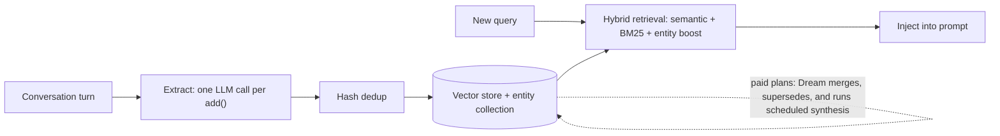

# Agentic Memory with Mem0

**Mem0** (and its peers Zep, Letta, Cognee) represents the shift from "passive logs" to **Active Memory**. These systems automatically digest conversations to create a persistent, evolving user profile that enhances personalization across every interaction. Pick Mem0 for the broadest standalone memory layer; Zep for temporal-aware production pipelines; Letta for long-running agents whose memory should be human-reviewable files (it moved from MemGPT-style paging to git-backed MemFS in 2026); Cognee for knowledge-graph-first RAG.

## Table of Contents

- [The Mem0 Philosophy](#the-mem0-philosophy)
- [How it Works: The Digest Loop](#how-it-works-the-digest-loop)
- [Self-Updating Memories](#self-updating-memories)
- [Integrating Mem0 with LangGraph](#integrating-mem0-with-langgraph)
- [Personalization at Scale](#personalization-at-scale)
- [Choosing a Memory Layer](#choosing-a-memory-layer)
- [Interview Questions](#interview-questions)
- [References](#references)

---

## The Mem0 Philosophy

Traditional memory stores *everything*.
Mem0 stores **Insights**.
Instead of storing "The user said they like blue coffee mugs, but only for work," Mem0 stores a short fact such as "Prefers blue coffee mugs at work," tagged with the user and linked to the entities it mentions.

---

## How it Works: The Digest Loop

Mem0's Python SDK changed its write path in v2.0.0 (April 16, 2026); the current release is v2.2.1 (September 25, 2026).



1. **Observe**: The agent sends conversation turns to `add()`.
2. **Extract**: A single LLM call identifies memorable facts and **adds** them. v2 is ADD-only: there is no compare-and-update or delete pass, only hash deduplication.
3. **Store**: Facts go into your existing vector store, with entity links in a parallel `{collection}_entities` collection.
4. **Retrieve**: Semantic similarity, BM25, and entity boosting are fused into one score.

**Where did conflict handling go?** The v1 loop compared each new fact with existing ones and updated or deleted conflicting records. In v2 that moved to the platform's **Dream** feature (launched August 4, 2026, Pro and Enterprise only), which merges and supersedes during extraction and runs scheduled synthesis off the request path. If you run the open-source SDK, contradictions ("lives in Berlin", later "moved to Lisbon") both persist, and you must resolve them at read time (prefer recency, show both) or run your own consolidation job.

---

## Self-Updating Memories

Modern agentic memory is **Recursive**.
- If a user mentions a task: "I need to finish the budget by Friday."
- On Thursday, the agent should recall this and ask: "How is the budget coming along?"
- This is achieved by **Periodic Reflection**: a scheduled job reviews active "Goal Nodes" and generates "Proactive Reminders." Sleep-time consolidation is now a product category: Mem0's Dream on paid plans, and Anthropic's Dreams research preview for Managed Agents memory stores, which writes a reorganized store with duplicates merged and stale entries replaced rather than editing the live one.

---

## Integrating Mem0 with LangGraph

In a state-machine architecture, Mem0 acts as an **External State Provider**.

```python
# Conceptual LangGraph node (Mem0 OSS SDK)
from mem0 import Memory

memory = Memory()

def memory_node(state: AgentState):
    # Pull the facts relevant to this turn, scoped to the user
    hits = memory.search(
        query=state["last_user_message"],
        filters={"user_id": state["user_id"]},
        top_k=5,
    )
    # Inject into the global reasoning state
    return {"user_profile": hits}

def remember_node(state: AgentState):
    memory.add(
        [{"role": "user", "content": state["last_user_message"]}],
        user_id=state["user_id"],
    )
    return {}
```

---

## Personalization at Scale

For enterprise apps (millions of users), Mem0 manages:
- **Consistency**: The AI "remembers" the user's name across the Web App, Mobile App, and Slack Bot.
- **Friction Reduction**: Not asking the same qualifying questions twice.

---

## Choosing a Memory Layer

| Layer | Substrate | Pick it when |
|-------|-----------|--------------|
| **Mem0 v2** | Facts in your vector store plus an entity index | Cross-session personalization; you want one LLM call per write and no extra database |
| **Zep / Graphiti** | Temporal knowledge graph (`valid_at` / `invalid_at` per edge) | Facts change over time and you need "what was true then?" queries |
| **Letta (MemFS)** | Git-backed Markdown files, no vector index by default | Long-running agents where humans review and version the memory |
| **Claude memory tool / Managed Agents memory stores** | Files mounted into the agent's workspace | You already run on Claude Managed Agents or Claude Code-style harnesses |
| **Cognee** | Knowledge graph built from documents | Memory that is mostly ingested knowledge rather than conversation |

**Evaluate on your own tasks, not vendor tables.** Mem0's DolphinBench (September 22, 2026; 600 tool-using tests over simulated histories of about 500K tokens per persona) is a useful harness, but its results are vendor-reported: Mem0 scored 70.67% versus 65.67% for built-in memory on the Hermes harness with GPT-5.6 Luna, and 32.33% versus 26.33% on Claude Code with Claude Sonnet 5, where Honcho scored higher at 35.83%. Always include a no-memory arm: MemTrapBench found every memory strategy it tested underperformed no memory.

---

## Interview Questions

### Q: Why use a dedicated service like Mem0 instead of a custom Python script that writes to Postgres?

**Strong answer:**
Scale and **Deduplication**, plus retrieval quality. A custom script often creates duplicate records or struggles with **Conflicting Identity Resolution** (e.g., the user is "Om" in Slack but "om.bharatiya" in Discord). Mem0 provides tested extraction prompts, entity linking, hybrid retrieval (semantic, BM25, and entity boosting fused into one score), and per-user scoping. The design question I would raise is **where conflict resolution lives**: Mem0 v2's open-source path is ADD-only, and merging or superseding moved to the paid Dream feature. So "use Mem0" still leaves me to choose between paying for consolidation, writing a nightly job, or resolving contradictions at read time with recency rules.

### Q: How do you handle "Memory Fatigue" where an agent brings up too many irrelevant past details?

**Strong answer:**
We use **Thresholded Relevance**. Mem0 returns a relevance score for every recalled fact, and we only inject facts above a threshold calibrated on our own eval set; the score is not comparable across versions (v2's fused score is not v1's cosine similarity), so recalibrate on upgrade. Additionally, we use **Negative Retrieval**: the agent is instructed to only use memory if it directly contradicts a potential hallucination or answers a current "Unknown." We also perform **Memory Pruning** where "Low-Value" memories (e.g., "The user mentioned it's raining") are automatically deleted after 24 hours. Finally, I measure task success with memory on and off, because MemTrapBench showed relevant, correct memories can still pull the model toward the wrong answer.

---

## References
- [Mem0: Building Production-Ready AI Agents with Scalable Long-Term Memory (arXiv 2504.19413)](https://arxiv.org/abs/2504.19413)
- [Mem0 v2.0.0 release notes](https://github.com/mem0ai/mem0/releases/tag/v2.0.0)
- [Mem0 releases (v2.2.1, September 25, 2026)](https://github.com/mem0ai/mem0/releases)
- [Letta repository (MemFS)](https://github.com/letta-ai/letta)
- [Zep: A Temporal Knowledge Graph Architecture for Agent Memory (arXiv 2501.13956)](https://arxiv.org/abs/2501.13956)
- [MemTrapBench (arXiv 2608.20202)](https://arxiv.org/abs/2608.20202)

---

*Next: [Semantic Caching](05-semantic-caching.md)*
