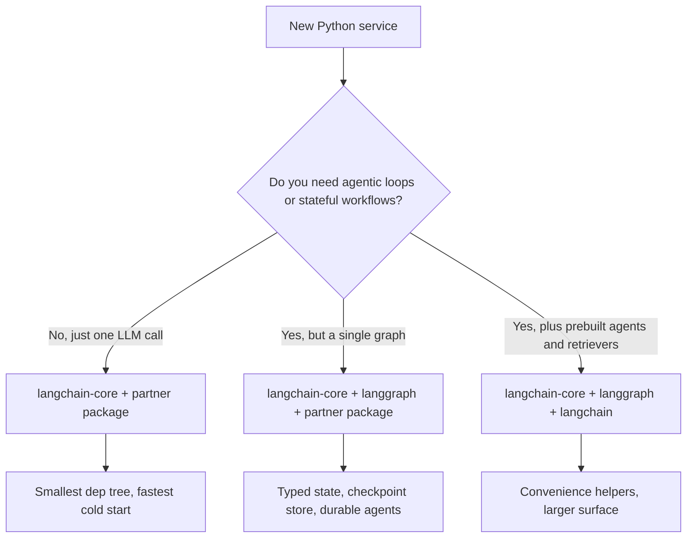

# LangChain Deep Dive

LangChain is no longer just a "prompting library." It has matured into a **Modular Ecosystem** for building production-grade LLM applications. LangGraph (which graduated to v1.0 in October 2025 and is the default runtime for all LangChain agents) handles the stateful orchestration. **LCEL (LangChain Expression Language)** remains the fastest way to build composable chains.

Version snapshot, with release dates because these numbers move monthly: `langchain` 1.4.3 (Sep 28, 2026), `langchain-core` 1.6.6 (Sep 29, 2026), `langgraph` 1.2.12 (Sep 21, 2026). On the JS side (as of Oct 1, 2026), `langchain` 1.5.15, `@langchain/core` 1.2.14 and `@langchain/langgraph` 1.4.18.

## Table of Contents

- [The LangChain Stack](#the-langchain-stack)
- [LCEL: Programming with Pipes](#lcel-programming-with-pipes)
- [Standard Abstractions (Core)](#standard-abstractions)
- [Managing Complexity (Community vs. Partner Packages)](#managing-complexity)
- [LangChain Modularity Push](#langchain-modularity-push)
- [Interview Questions](#interview-questions)
- [References](#references)

---

## The LangChain Stack

The ecosystem is now split into three distinct layers:
1. **LangChain Core**: Minimal abstractions for Prompts, Output Parsers, and Runnables. (Low dependency footprint).
2. **LangChain Community/Partner**: Integrations for 500+ databases, models, and tools.
3. **LangGraph**: The stateful orchestration layer (covered in the next chapter).

---

## LCEL: Programming with Pipes

LangChain Expression Language (LCEL) uses the `|` operator to create a **Directed Acyclic Graph (DAG)** of execution.

```python
# Standard RAG chain
chain = (
    {"context": retriever, "question": RunnablePassthrough()}
    | prompt
    | model.with_structured_output(Schema) 
)
```

**Why LCEL?**
- **Async by Default**: Every chain supports `.ainvoke()` and `.astream()`.
- **Parallelism**: Multiple branches run in parallel automatically.
- **Observability**: Automatically integrates with **LangSmith** for full-trace visualization.

---

## Standard Abstractions

### 1. Runnables
The "Base Class" for everything in LangChain. Runnables provide a unified interface for `.invoke`, `.batch`, and `.stream`.

### 2. Tools & Tool-Calling
LangChain has first-class support for **MCP (Model Context Protocol)**, and since `langchain` 1.4.0 (Sep 3, 2026) it lives in the core package rather than a separate adapter.
- The `langchain.mcp` namespace and `MCPAdapter` turn any MCP server's tools into LangChain tools.
- MCP elicitation requests are routed according to the protocol era the server negotiated (2025-era stateful sessions versus the stateless 2026-07-28 revision), so one agent can talk to old and new servers.
- The MCP Python SDK 2.0 (Jul 28, 2026) renamed `FastMCP` to `MCPServer`. Tutorials that `from mcp.server.fastmcp import FastMCP` break on a fresh install; pin `mcp<2` or port.

### 3. Output Parsers and Structured Output
While early systems used regex, modern code uses `.with_structured_output()`, which increasingly maps to the provider's **native JSON-schema structured output** rather than a tool call. The older trick of forcing a single tool call to get JSON is being retired:
- Claude Fable 5.1, Opus 5.5 and Sonnet 5.5 return HTTP 400 for `tool_choice` of type `any` or `tool`. `langchain-anthropic` 1.7.3 (Sep 22, 2026) routes `with_structured_output` to `method="json_schema"` for Fable and Opus 5.5, and 1.7.5 (Sep 29) adds Sonnet 5.5.
- GPT-6 Astra rejects custom `temperature`, `top_p` and `logprobs`, and its tool calling requires the Responses API. `langchain-openai` 1.6.3 (Sep 21) handles those constraints and exposes the inferred Responses API routing.

The lesson is not specific to LangChain: any wrapper that hard-codes sampling parameters or forced tool calls breaks on the newest frontier models, so upgrade partner packages before you upgrade model IDs.

---

## Managing Complexity

> [!TIP]
> **Production Best Practice**: Avoid `langchain-community` in critical paths. Use **Partner Packages** (e.g., `langchain-openai`, `langchain-pinecone`) to reduce dependency hell and improve stability.

---

## LangChain Modularity Push

The ecosystem has finished its long migration from the monolithic `langchain` import to a tiered structure with clean dependency boundaries. The split exists so teams can pick exactly the surface area they need without dragging in 500+ integrations.

### Package Tiering as Shipped

| Package | Purpose | Direct Dependencies |
|---------|---------|---------------------|
| `langchain-core` | Runnables, prompts, output parsers, tool abstractions | Pydantic, `tenacity`, almost nothing else |
| `langchain` | `create_agent`, middleware, reference retrievers, MCP adapter (`langchain.mcp`, since 1.4.0) | `langchain-core` |
| `langgraph` | Stateful graph orchestration, checkpointing, time-travel | `langchain-core` |
| `langchain-openai`, `langchain-anthropic`, `langchain-google-vertexai`, etc. | Provider partner packages | `langchain-core` + the provider SDK |
| `langchain-community` | Long tail of integrations (kept available, no longer recommended in production paths) | Lots |
| `langchain-classic` | Legacy v0 chains, retained for migration | `langchain-core` |

`langchain-core` is the only package that ships with a stable surface and a backwards-compatibility guarantee, per the v1 release messaging ([LangChain blog, Building with LangChain 1.0](https://blog.langchain.com/langchain-1-0/)).

### Standard JSON Schema Across Validation Libraries

The single biggest change for application code: `with_structured_output()`, `bind_tools()`, and `@tool` now accept any [JSON Schema](https://json-schema.org/) compatible object. That includes:

- **Pydantic v2** (the historical default)
- **[Zod 4](https://zod.dev/v4)** schemas passed directly in JavaScript / TypeScript LangChain (Zod 4 has built-in JSON Schema export)
- **[Valibot](https://valibot.dev/)** (functional, tree-shakeable TS validation)
- **[ArkType](https://arktype.io/)** (TypeScript types as runtime schemas)
- Plain dict / TypedDict in Python
- Hand-rolled JSON Schema documents

This is documented in the [LangChain v1 structured-output guide](https://docs.langchain.com/oss/python/langchain/structured-output) and the [JS structured-output guide](https://js.langchain.com/docs/how_to/structured_output). The practical effect: framework choice no longer drives validator choice, and teams that already standardized on Valibot or ArkType for their HTTP layer can reuse those schemas as LangChain tool definitions.

```python
# Python: TypedDict tool schema, no Pydantic in the path
# Needs langchain-anthropic >= 1.7.5 for Sonnet 5.5 (forced tool_choice returns 400)
from typing import TypedDict, Annotated
from langchain_anthropic import ChatAnthropic

class CreateInvoice(TypedDict):
    """Create an invoice for a customer."""
    customer_id: Annotated[str, ..., "Stripe customer id"]
    amount_cents: Annotated[int, ..., "Amount in cents, > 0"]

llm = ChatAnthropic(model="claude-sonnet-5-5")
structured = llm.with_structured_output(CreateInvoice)
```

```typescript
// TypeScript: Valibot schema reused for both HTTP and tool calling
import * as v from "valibot";
import { ChatAnthropic } from "@langchain/anthropic";
import { toJsonSchema } from "@valibot/to-json-schema";

const CreateInvoice = v.object({
  customer_id: v.pipe(v.string(), v.description("Stripe customer id")),
  amount_cents: v.pipe(v.number(), v.minValue(1)),
});

const llm = new ChatAnthropic({ model: "claude-sonnet-5-5" });
// @langchain/anthropic (1.5.12) still defaults to a forced tool call, which
// Fable 5.1, Opus 5.5 and Sonnet 5.5 reject with a 400: ask for native JSON-schema output.
const structured = llm.withStructuredOutput(toJsonSchema(CreateInvoice), {
  method: "jsonSchema",
});
```

### When to Use Just `langchain-core` vs Full LangChain



Recommended posture:

- **Library / SDK code**: depend only on `langchain-core`. Producers of reusable building blocks (vector stores, chunkers, custom tools) should never pull in `langchain` or partner packages as direct dependencies. The [LangChain integrations guide](https://docs.langchain.com/oss/python/integrations/providers) describes this as a hard rule for `langchain-community` contributors.
- **Application services**: `langchain-core` + the partner packages you actually call + `langgraph` if you have a multi-step workflow. Skip `langchain` (the package, not the brand) unless you are explicitly using a built-in retriever or legacy chain.
- **Notebooks and prototypes**: `langchain` is fine for the convenience.

The version pin matters. `langchain-core >= 1.0` is the supported floor for new code. Under LangChain's release policy, LangChain 0.3 and LangGraph 0.4 are in maintenance mode (security patches and critical fixes only) **until December 2026**, and the 1.x line is LTS until 2.0 ships. If you still run 0.3 in production, schedule the 1.x migration now: after December 2026 even security patches stop.

### Migration Notes for Existing Code

- `LLMChain`, `RetrievalQA`, `ConversationalRetrievalChain`, and `AgentExecutor` live in `langchain-classic` and are frozen. The replacement is an LCEL pipe or, more often, a `langgraph` graph ([LangChain v1 migration guide](https://docs.langchain.com/oss/python/migrate/langchain-v1)).
- Tool decorators import from `langchain_core.tools`, not `langchain.tools`.
- Output parsers that depend on Pydantic v1 must be ported. `langchain-core` v1.0 dropped the v1 shim ([release notes](https://github.com/langchain-ai/langchain/releases/tag/langchain-core%3D%3D1.0.0)).
- `langchain-core` 1.6.4 (Sep 21, 2026) deprecates the chat message history classes. Conversation state belongs in LangGraph checkpointers.
- Code that imported `langchain-mcp-adapters` can move to `langchain.mcp` on 1.4+; keep the adapter pinned until you have tested elicitation and auth flows against your servers.

---

## Interview Questions

### Q: What is the main benefit of LCEL over traditional Python "Chains" (sequences of function calls)?

**Strong answer:**
LCEL provides **Automatic Streaming and Parallelization**. In a traditional Python chain, I have to manually handle `asyncio.gather` for parallel steps and custom generators for streaming. LCEL's `Runnable` architecture handles this under the hood. If I define a `RunnableParallel` block, LangChain executes them simultaneously. More importantly, LCEL provides **Dynamic Routing** via `RunnableBranch`, making it easy to create complex logic without deeply nested if/else statements.

### Q: LangChain is often criticized for being "too bloated." How do you architect a lean production system with it?

**Strong answer:**
The key is to **Import only Core**. I use `langchain-core` for the abstractions and specific **Partner Packages** (like `langchain-anthropic`) for the model. I avoid `langchain-community` and the legacy `Chain` classes (like `LLMChain` or `RetrievalQA`) which are effectively deprecated. I build my logic using the **Runnable** primitives, which keeps the dependency tree small and the execution path transparent.

### Q: A structured-extraction chain worked on Claude Opus 5 and started failing with HTTP 400 after the team switched the model ID to Opus 5.5. What happened, and what is the fix?

**Strong answer:**
The chain was almost certainly getting structured output by **forcing a tool call** (`tool_choice` of type `tool` or `any`), which was the standard framework trick for two years. Fable 5.1, Opus 5.5 and Sonnet 5.5 reject forced tool choice with a 400, and thinking cannot be switched off on Opus 5.5 either. The immediate fix is to upgrade `langchain-anthropic` (1.7.3 reroutes `with_structured_output` to native JSON-schema output for Fable and Opus 5.5; 1.7.5 adds Sonnet 5.5) or call `with_structured_output(..., method="json_schema")` explicitly. The explicit form is the safer habit, because not every integration reroutes: the JS `@langchain/anthropic` still defaults to a forced tool call, so there you pass `method: "jsonSchema"` yourself. The process fix matters more: a model ID is a dependency, so a model swap goes through the same eval gate as a package upgrade, and partner packages get upgraded before the model ID changes, not after. I would also grep the codebase for hard-coded `temperature` and `tool_choice`, because GPT-6 Astra and the Anthropic Python SDK 1.x reject or remove sampling parameters too.

---

## References
- LangChain. "The LangChain Expression Language Specification" (2025)
- LangChain. "Release policy" (LangChain 0.3 and LangGraph 0.4 maintenance until December 2026): https://docs.langchain.com/oss/python/release-policy
- LangChain. `langchain==1.4.0` release notes (MCP in core, Sep 3, 2026): https://github.com/langchain-ai/langchain/releases/tag/langchain%3D%3D1.4.0
- Anthropic. "What's new in Claude Sonnet 5.5" (forced `tool_choice` returns 400): https://platform.claude.com/docs/en/models/sonnet-5-5/whats-new-sonnet-5-5
- Harrison Chase. "The Future of AI Orchestration" (2024 podcast/post)

---

*Next: [LangGraph Orchestration](02-langgraph-orchestration.md)*
