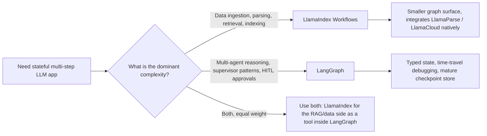

# LlamaIndex

While LangChain focuses on "Orchestration," **LlamaIndex** is the master of **Data-Centric AI**. It has evolved from a RAG library into a framework for **Workflows** and **Agentic Data Manipulation**, and the company behind it has since narrowed its commercial focus to document parsing and extraction (see [Strategic Signal](#strategic-signal-the-company-is-betting-on-parsing)).

## Table of Contents

- [The Data Framework Philosophy](#the-data-framework-philosophy)
- [LlamaIndex Workflows](#llamaindex-workflows)
- [Advanced Indexing: Beyond Vector Search](#advanced-indexing)
- [LlamaCloud and Managed Ingestion](#llamacloud-and-managed-ingestion)
- [Agents as Tools](#agents-as-tools)
- [LlamaIndex Workflows: Event-Driven Application Framework](#llamaindex-workflows-event-driven-application-framework)
- [Interview Questions](#interview-questions)
- [References](#references)

---

## The Data Framework Philosophy

LlamaIndex is built on the belief that **the data is more important than the model**.
- **The Node**: Every chunk of data is a "Node" with rich metadata (relationships, summaries, and parent-child links).
- **The Retriever**: LlamaIndex provides the most diverse set of retrievers (Summary, Knowledge Graph, Tree, and Keyword).

---

## LlamaIndex Workflows

In 2024, LlamaIndex introduced **Workflows**, its answer to LangGraph.
- **Event-Driven Architecture**: Nodes communicate by emitting `Events`.
- **Concurrency**: Workflows are natively async and handle large-scale parallel data processing better than linear chains.

```python
# Conceptual Workflow
class RAGWorkflow(Workflow):
    @step
    async def ingest(self, ev: StartEvent) -> RetrievalEvent:
        # Custom logic...
        return RetrievalEvent(results=nodes)
```

---

## Advanced Indexing

1. **Property Graphs**: Linking vector chunks to graph nodes for RAG.
2. **Context-Aware Splitters**: Grouping text by "Meaning" rather than "Token count" (using smaller LLMs to find optimal breakpoints).
3. **Dynamic Pathing**: The retriever decides *which* index to query based on the complexity of the question.

---

## LlamaCloud and Managed Ingestion

For enterprise scale, LlamaIndex focuses on **LlamaCloud**.
- **Managed Ingestion**: Handling PDF parsing, OCR, and Table extraction as a service.
- **Parsing as a Model**: Using vision-language models to "understand" layouts instead of rule-based parsers. LlamaParse and the newer LiteParse are the company's parsing products, and the Extract product turns parsed documents into typed records.

### Strategic Signal: The Company Is Betting on Parsing

On September 11, 2026, CEO Jerry Liu added a note to the `llama_index` README (PR #23020) saying the company's primary focus has shifted to LlamaParse, LiteParse and its ParseBench and ExtractBench benchmarks, with the open-source framework still available as an open toolkit. Release cadence matches: `llama-index` 0.14.22 (May 14), 0.14.23 (Jun 24), 0.14.24 (Aug 19) and 0.14.25 (Sep 21, 2026, dominated by a dependency fix for security alerts across integration packages), while `llama-index-workflows` keeps moving (2.25.0 on Sep 25, 2026). The blog output for August and September is almost entirely extraction: ExtractBench (Aug 11), a Turbo extraction tier in beta (Sep 3), LiteParse updates (Sep 22) and Extract v2.5 (Oct 1).

What it means for design: use LlamaIndex where it is strongest (ingestion, parsing, retrieval primitives) and keep it behind your own retrieval interface. Do not make it the general agent runtime for a system you expect to run for years; a slowing open-source cadence means fewer fixes for the integrations you depend on.

---

## Agents as Tools

LlamaIndex treats agents as **high-level retrievers**.
- You can "wrap" a complex LlamaIndex query engine as a tool and give it to a LangGraph agent.
- **Benefit**: The agent gets "Smart Data Access" without needing to know the technical details of the vector DB or Graph schema.

---

## LlamaIndex Workflows: Event-Driven Application Framework

The pitch in 2024 was "Workflows is our LangGraph." The pitch today is different: Workflows is a general-purpose event-driven framework for any AI application, with RAG as one possible use. Workflows now lives in its own `llama-index-workflows` package, which `llama-index-core` depends on and re-exports as `llama_index.core.workflow`; the docs present it as the primary application surface, with indexes and retrievers as building blocks called from inside steps ([LlamaIndex workflows docs](https://developers.llamaindex.ai/python/framework/understanding/workflows/)). One naming subtlety worth pinning down: the **Workflows** package reached 1.0 in mid-2025 and is now on a 2.x line as a standalone package (`llama-index-workflows` 2.25.0, Sep 25, 2026), while the core `llama-index` framework itself remains on the 0.x line (0.14.25, Sep 21, 2026). For how this kind of version churn breaks tutorials and how to survive it, see [Navigating Framework Churn](12-navigating-framework-churn.md).

### What Changed Architecturally

| Dimension | Pre-Workflows LlamaIndex | Workflows-First LlamaIndex |
|-----------|--------------------------|-----------------------------------|
| Primary abstraction | Query engine, chat engine | `Workflow` class with `@step` methods |
| Control flow | Linear; nested query engines | Steps consume / emit typed `Event` subclasses |
| State | Implicit in engine instances | Explicit `Context` with serializable state |
| Concurrency | Cooperative via async query engines | First-class: emit several events, fan out, join |
| Persistence | None | Context serializes to a dict (`to_dict` / `from_dict`) for resume |
| Streaming | Per-engine | `ctx.write_event_to_stream()` from any step |
| Human-in-the-loop | Manual | `InputRequiredEvent` / `HumanResponseEvent` pattern |

### The Event-Driven Mental Model

```python
from llama_index.core.workflow import (
    Workflow, step, Event, StartEvent, StopEvent, Context
)

class RetrievedEvent(Event):
    nodes: list

class JudgedEvent(Event):
    nodes: list
    keep: bool

class GraphRAG(Workflow):
    @step
    async def plan(self, ctx: Context, ev: StartEvent) -> RetrievedEvent:
        await ctx.store.set("query", ev.query)  # workflows 2.x: state lives on ctx.store
        nodes = await self.retriever.aretrieve(ev.query)
        return RetrievedEvent(nodes=nodes)

    @step
    async def judge(self, ctx: Context, ev: RetrievedEvent) -> JudgedEvent:
        keep = await self.relevance_judge(ev.nodes, await ctx.store.get("query"))
        return JudgedEvent(nodes=ev.nodes, keep=keep)

    @step
    async def answer(self, ctx: Context, ev: JudgedEvent) -> StopEvent:
        if not ev.keep:
            return StopEvent(result="No good evidence found.")
        return StopEvent(result=await self.llm.acomplete(...))
```

Two properties fall out of this design:

1. The engine dispatches purely on **event type**, so adding a new branch is adding a new `Event` subclass and a step that consumes it. No central router to edit.
2. **Concurrency is data-driven**: a step that emits three `RetrievedEvent`s automatically fans out three downstream `judge` invocations, and the joining step collects them with `ctx.collect_events`.

### Workflows vs LangGraph



| Dimension | LlamaIndex Workflows (2.x) | LangGraph (1.x) |
|-----------|----------------------------|-----------------|
| Control flow primitive | Event dispatch | Graph nodes and edges, plus a typed reducer state |
| State model | Free-form `Context` (dict-like) | Pydantic / TypedDict state with reducers |
| Resume / time travel | Serializable context, basic resume | First-class checkpoints, branch from any node ([LangGraph persistence docs](https://docs.langchain.com/oss/python/langgraph/persistence)) |
| Native integrations | LlamaParse, LlamaCloud, all LlamaHub loaders | LangSmith eval, all LangChain integrations |
| Best-fit complexity | Data-shaped: parse, embed, retrieve, refine | Logic-shaped: plan, act, reflect, delegate |
| Multi-agent helpers | `AgentWorkflow`, function-calling agents ([LlamaIndex AgentWorkflow](https://developers.llamaindex.ai/python/framework/understanding/agent/multi_agent/)) | `create_agent` (LangChain 1.x), supervisor and swarm packages, custom graphs |
| Streaming UI | `ctx.write_event_to_stream` + AG-UI protocol | `astream_events` v2, AG-UI protocol |

When you should reach for LlamaIndex Workflows over LangGraph:

- The hard part is **data ingestion**, not reasoning. LlamaCloud, LlamaParse, and the property-graph stack are all native, not adapter-bridged ([LlamaCloud overview](https://www.llamaindex.ai/llamacloud)).
- You want **document-driven parallelism**: parse 1000 PDFs, fan out an embedding step per chunk, join into one index update.
- You are building inside the **TypeScript** ecosystem on LlamaIndex.TS (check feature coverage against the Python core first; most investment goes to Python and to the hosted parsing products).

When LangGraph wins:

- The hard part is the **agent control loop** itself: many agents, supervisor patterns, durable interrupts, replay.
- You need **time-travel debugging** out of the box. LlamaIndex resume is good for crash recovery but not for branching from an arbitrary historical state the way LangGraph checkpoints do.
- You are already on the LangSmith eval stack and want trace-level integration without bridging.

### Real-World Posture

Plenty of senior architectures run both: LlamaIndex Workflows for the data plane (ingestion, indexing, hybrid retrieval, reranking) wrapped as a tool, and LangGraph for the agent control plane on top. This is the pattern called out in the [AIMultiple framework comparison](https://research.aimultiple.com/agentic-ai-frameworks/) and in LlamaIndex's own [hybrid integration cookbook](https://developers.llamaindex.ai/python/framework/understanding/workflows/).

If you only pick one for a new greenfield app, the question reduces to: **is your team going to spend more time on data plumbing or on agent orchestration?** The answer drives the framework.

---

## Interview Questions

### Q: LangChain and LlamaIndex now both have "Graph/Workflow" features. How do you choose?

**Strong answer:**
I choose **LlamaIndex Workflows** for **Data-Intensive** tasks where the main complexity is ingestion, multimodal parsing, and complex retrieval. Its event-driven architecture fits massive parallel data processing. I choose **LangGraph** for **Logic-Intensive** multi-agent systems where the complexity is in the "Reasoning" and "Human-in-the-loop" logic. In many senior architectures, we use **Both**: LlamaIndex for the RAG engine and LangGraph for the overall agentic supervisor. I also weigh vendor direction: LlamaIndex said in September 2026 that its focus is parsing and extraction, so I keep it on the data plane behind my own interface rather than betting the control plane on it.

### Q: What is the "Property Graph" in LlamaIndex and why is it superior to basic Vector RAG?

**Strong answer:**
A Property Graph combines the **Semantic flexibility** of vectors with the **Structural precision** of a database. In basic RAG, you might find a chunk about "Project Alpha," but you don't know who owns it. In a Property Graph, the vector chunk is a node linked to a `User` node and a `Timeline` node. This allows for **Global Reasoning** (e.g., "Find all documents written by Tom in the last month about Project Alpha"). Basic RAG would likely miss many related nodes because they don't contain the exact keyword "Alpha."

---

## References
- LlamaIndex. "Announcing Workflows 1.0: A Lightweight Framework for Agentic systems" (Jun 30, 2025): https://www.llamaindex.ai/blog/announcing-workflows-1-0-a-lightweight-framework-for-agentic-systems
- `llama_index` README focus note (PR #23020, Sep 11, 2026): https://github.com/run-llama/llama_index
- LlamaIndex. Integrations directory (LlamaHub has moved here): https://developers.llamaindex.ai/python/framework/community/integrations

---

*Next: [DSPy: Programming Language Models](05-dspy.md)*
