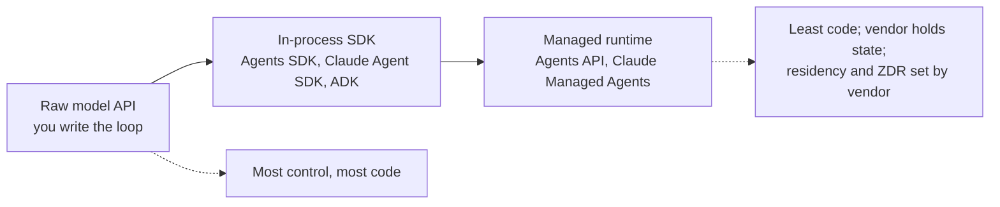

# Microsoft Agent Framework, CrewAI, and the Agent SDK Landscape

The multi-agent framework landscape consolidated over the past year. Microsoft folded AutoGen and Semantic Kernel into the **Microsoft Agent Framework**, which went GA (1.0) on April 2, 2026; AutoGen is now in maintenance mode and community-managed. CrewAI reached 1.15.23 (Sep 28, 2026) and added checkpointing and declarative Flows; it reports use by 60%+ of Fortune 500 companies (vendor claim). Every major lab ships its own agent SDK: Anthropic's Claude Agent SDK, OpenAI's Agents SDK, Google's ADK, and AWS's Strands Agents. In 2026 the labs also started renting the loop itself as a managed service: Claude Managed Agents, the OpenAI Agents API (public beta Sep 10, 2026), and Bedrock Managed Agents (preview Sep 29, 2026).

Version numbers in this chapter carry release dates because these SDKs ship every week or two. Pin them.

## Table of Contents

- [CrewAI: The Manager Perspective](#crewai-the-manager-perspective)
- [Microsoft Agent Framework (AutoGen's Successor)](#microsoft-agent-framework-autogens-successor)
- [The Agent SDK Landscape](#the-agent-sdk-landscape)
- [Managed Agent Runtimes](#managed-agent-runtimes)
- [Swarms and Peer-to-Peer Communication](#swarms-and-p2p)
- [Framework Comparison Matrix](#framework-comparison-matrix)
- [Interview Questions](#interview-questions)
- [References](#references)

---

## CrewAI: The Manager Perspective

CrewAI is built around the concept of a **Process**.
- **Role-Based Agents**: You define a "Researcher," a "Writer," and a "Manager."
- **Tasks**: Explicit goals with specific outputs.
- **Process Orchestration**: Sequential or Hierarchical (a manager agent delegates and validates). A consensus-based process has long been listed in CrewAI's docs as planned, so do not design around it.

### CrewAI Flows

CrewAI **Flows** add a **state-machine layer** on top of the classic Crew pattern:

```python
from crewai.flow.flow import Flow, listen, start

class ContentFlow(Flow):
    @start()
    def research_topic(self):
        # Returns research output
        return research_crew.kickoff({"topic": self.state["topic"]})
    
    @listen(research_topic)
    def write_article(self, research):
        # Triggered after research completes
        return writing_crew.kickoff({"research": research})
    
    @listen(write_article)
    def publish(self, article):
        # Final step
        return publisher.publish(article)
```

### CrewAI 1.14 and 1.15: Competing on Durability

| Release | Date | What changed |
|---|---|---|
| 1.14.0 | Apr 7, 2026 | Runtime state **checkpointing** (`CheckpointConfig`, `SqliteProvider`), an event system and executor refactor, SSRF protections and path/URL validation in RAG tools. **Breaking**: `CodeInterpreterTool` removed |
| 1.15.0 | Jun 25, 2026 | **Declarative Flow loading** (`FlowDefinition` with crew actions), DMN mode, token-usage aggregation across all LLM calls |
| 1.15.22 / 1.15.23 | Sep 16 / Sep 28, 2026 | Human-feedback and pause events in tracing, connection aliases, OpenRouter embeddings, native Gemini 3.8 Flash support |

The 1.13 line (spring 2026) added the enterprise pieces that still matter: documented SSO, an RBAC permissions matrix, A2A task delegation, and fixes for OpenAI models that dropped the `stop` parameter.

**Use cases**: CrewAI + Flows fits **business process automation** (content pipelines, data analysis workflows) where the structure is well-defined. CrewAI reports powering roughly 2 billion agentic executions (vendor figure). With checkpointing and declarative Flows, the old heuristic "CrewAI for speed, LangGraph for state" is weaker than it was; the remaining gaps are debugging depth (branch-from-checkpoint time travel) and ecosystem breadth.

---

## Microsoft Agent Framework (AutoGen's Successor)

### The Merger: AutoGen + Semantic Kernel = Agent Framework

Microsoft built the **Microsoft Agent Framework (MAF)** as the direct successor to both AutoGen and Semantic Kernel, with the same teams. MAF 1.0 went GA for .NET and Python on April 2, 2026 (Microsoft's announcement is dated April 3), billed as a stable API with long-term support. It ships roughly weekly: Python 1.19.0 on Sep 18 and .NET 1.23.0 on Oct 1, 2026. A Go SDK is in public preview.

**What the merger combines:**
- **From AutoGen**: Simple abstractions for single- and multi-agent conversation patterns (group chat, round-robin, handoffs)
- **From Semantic Kernel**: Enterprise-grade session management, type safety, filters, telemetry, and extensive model/embedding support

### Migration Path

The AutoGen README carries a **Maintenance Mode** banner: no new features, "community managed going forward," and new users are sent to MAF. The last `autogen-agentchat` release is 0.7.5 (Sep 30, 2025). Microsoft publishes migration guides from both AutoGen and Semantic Kernel. If starting a new project, use MAF directly.

### Key Capabilities

```python
# Microsoft Agent Framework (Python 1.x): handoff workflow with an approval gate
import os
from typing import Annotated

from agent_framework import FileCheckpointStorage, tool
from agent_framework.foundry import FoundryChatClient
from agent_framework.orchestrations import HandoffBuilder
from azure.identity import AzureCliCredential

client = FoundryChatClient(
    project_endpoint=os.environ["FOUNDRY_PROJECT_ENDPOINT"],
    model=os.environ["FOUNDRY_MODEL"],
    credential=AzureCliCredential(),
)

@tool(approval_mode="always_require")  # the workflow pauses for a human before this runs
def process_refund(order_number: Annotated[str, "Order number"]) -> str:
    """Process a refund for an order."""
    return f"Refund queued for {order_number}"

triage = client.as_agent(name="triage_agent", instructions="Route the customer to a specialist.")
refunds = client.as_agent(name="refund_agent", instructions="Handle refunds.", tools=[process_refund])

workflow = (
    HandoffBuilder(
        name="support",
        participants=[triage, refunds],
        checkpoint_storage=FileCheckpointStorage(storage_path="./checkpoints"),  # resume after restarts
    )
    .with_start_agent(triage)
    .build()
)
```

**Framework highlights:**
- **Unified .NET and Python**: Same programming model across both languages (Go in preview)
- **Workflows**: Sequential, concurrent, handoff, and group chat orchestrations, plus functional and graph-based workflows, with checkpointing and reconnectable background responses
- **Harness Agent**: An opinionated agent for long, multi-step tasks with planning and todo tracking, context compaction, file access and memory, tool approval, and observability built in
- **September 2026 additions** (Microsoft's Sep 24 update): AG-UI hosting (stable in Python, preview in .NET), Foundry and Cosmos DB memory providers (Python preview), CodeAct through a `HyperlightCodeActProvider` that runs model-written code in a Hyperlight micro-VM (Microsoft reports about 50% lower latency and more than 60% fewer tokens on its evaluated workload), channels for OpenAI Responses, Telegram, A2A and MCP, and a Durable Azure Functions extension
- **Protocols**: MCP and A2A interop both ship in 1.x
- **Multi-provider**: First-party connectors for Foundry, Azure OpenAI, OpenAI, Anthropic, Bedrock, Gemini and Ollama

---

## The Agent SDK Landscape

Every major AI lab now ships its own agent framework. The pattern across them in Q3 2026: harness-first APIs, durable state, and sandboxed code execution as built-ins.

### Claude Agent SDK (Anthropic)

The Claude Agent SDK (renamed from the Claude Code SDK) provides the same tools, agent loop, and context management that power Claude Code, available as a library in Python (`claude-agent-sdk` 0.2.163) and TypeScript (`@anthropic-ai/claude-agent-sdk` 0.3.287), versions as of Oct 1, 2026.

- **Built-in tools**: File reading, command execution, code editing, so agents work without custom tool implementation
- **Subagents**: Named subagent definitions with their own context and tool allowlists
- **Controls**: `max_turns`, `max_budget_usd`, `effort`, and permission modes including classifier-based `auto` and `dontAsk`
- **Deployment**: Claude API, Amazon Bedrock, Google Cloud (Vertex AI), and Microsoft Foundry
- **Gotcha**: The SDK bundles the Claude Code CLI, so a CLI release can change the default model under you. When Claude Code made Opus 5.5 (2.1.280, Sep 22) and Sonnet 5.5 (2.1.284, Sep 28) the defaults, the SDK's own CI broke and had to pin models. Always pass `model=` explicitly.

### OpenAI Agents SDK

OpenAI's lightweight framework for multi-agent workflows using native Python/TypeScript constructs. The last PyPI release in September was `openai-agents` 0.22.3 (Sep 17, 2026); 0.23.1 reached PyPI on Oct 2. JS `@openai/agents` is at 0.18.0 (Sep 10).

- **Handoff-based**: Agents delegate to each other with handoffs, no central supervisor needed
- **Guardrails**: Input and output guardrails; 0.22.1 (Sep 8) added MCP server-wide guardrails
- **MCP integration**: 0.20.0 supports MCP Python SDK v1 and v2 (apps with custom MCP HTTP auth must use the installed major's types or pin `mcp<2`)
- **Sandbox Agents** (since 0.14.0, Apr 2026): `SandboxAgent`, manifests, snapshots, and hosted sandbox clients
- **Testing utilities** (0.21.0, Aug 15): provider-neutral `agents.testing`, plus realtime and voice testing modules; requires OpenAI Python SDK 3.0+
- **Churn to plan for**: 0.20.0 (Aug 11) made `gpt-5.6-luna` the implicit default model, and 0.22.0 (Aug 19) broke apps that pass `organization` or `project` alongside an explicit client
- **Realtime agents**: `gpt-realtime-2.1` has been the default for realtime agents since 0.18.0 (Jul 7, 2026). There is no support for the full-duplex `gpt-live-1` (GA Sep 10) through 0.22.3. The original `gpt-realtime` and `gpt-realtime-mini` models shut down January 20, 2027, so pin a 2.1-family model

### OpenAI AgentKit (Partly Winding Down)

AgentKit (October 2025) bundled a visual **Agent Builder**, **ChatKit** (an embeddable, themeable chat UI), a **Connector Registry** (central governance for how data sources and tools connect across OpenAI products), and **Evals** around the Responses API and Agents SDK. Two of those pieces are going away:

- **Agent Builder** shuts down November 30, 2026 (deprecation announced June 3, 2026). OpenAI points users to the Agents SDK or ChatGPT Workspace Agents.
- The **Evals** platform goes read-only October 31 and shuts down November 30, 2026, with a migration guide to Promptfoo. OpenAI agreed to acquire Promptfoo in March 2026; it remains MIT-licensed and supports other providers. Reusable Prompts also shuts down on November 30, 2026.

**What it means**: OpenAI is consolidating on the two ends of the spectrum, code-first (Agents SDK) and fully managed (Agents API, below). The visual-builder middle was deprecated eight months after launch. Keep agent definitions in code you own; a canvas export is not a durable source of truth.

### OpenAI Apps SDK

The Apps SDK extends the **Model Context Protocol** so an MCP server can ship a UI alongside its tools. A developer defines both the logic and an interactive interface, and the app renders inside a client like ChatGPT. The MCP project standardized the same idea as the **MCP Apps** extension; its SDK reached 2.0.0 on Sep 8, 2026, moving to the v2 TypeScript SDK packages with an unchanged wire protocol, so 2.x views still render in 1.x hosts. See [Tool Use and MCP](../07-agentic-systems/03-tool-use-and-mcp.md).

### Google Agent Development Kit (ADK)

Google's framework optimized for the Google ecosystem but model-agnostic:

- **Versions**: Python 2.0 went GA May 19, 2026 and reached 2.10.0 on Sep 25 (2.11.0 hit PyPI Oct 2); Go 2.0 shipped Jun 30 (`google.golang.org/adk/v2`) and is now v2.5.0 (Sep 30); TypeScript 2.0.0 went GA Aug 21 and is now 2.2.0 (Sep 30), with its Workflow API still marked experimental; Java remains on 1.x (1.10.1, Sep 18). The Python 1.x line is still patched.
- **Graph workflows (2.0)**: Static and dynamic graphs, fan-out and fan-in (`JoinNode`), per-node retries and timeouts, schema validation, and human-in-the-loop pause and resume. ADK-TS 2.0 deprecates `SequentialAgent`, `ParallelAgent` and `LoopAgent` (they still run, with a warning).
- **A2A native**: Built-in Agent-to-Agent protocol support for cross-vendor orchestration
- **Vertex AI integration**: Deploy to Agent Engine Runtime for managed hosting

With ADK 2.0, Google joins Microsoft (MAF workflows) and LangGraph in offering graph workflows with agents as nodes, which narrows the old "LangGraph for graphs, lab SDKs for simple loops" split. The Claude Agent SDK and OpenAI Agents SDK still center on a single agent loop with subagents or handoffs.

### Other Agent SDKs

AWS **Strands Agents** is the most-downloaded lab SDK on PyPI (about 36.5M downloads in the month to Oct 1, 2026, CI-inflated like all such counts); its new harness packages moved their default model to Claude Opus 5 on Sep 22, another silent default change. The **Vercel AI SDK 7** (Jun 25, 2026) added a durable `WorkflowAgent` and an experimental `HarnessAgent` that runs Claude Code, Codex and other harnesses behind one API. Pydantic AI and Mastra are covered in [Pydantic AI and Mastra](11-pydantic-ai-and-mastra.md); Haystack 3 and Agno 3 in the [Framework Selection Guide](08-framework-selection-guide.md).

---

## Managed Agent Runtimes

The build-versus-rent spectrum for the agent loop now has three stops. With a raw model API you write the loop. With an in-process SDK the loop runs in your service. With a managed runtime the loop, its state, and often the sandbox run at the vendor.



| Runtime | Status | What you hand over | Billing | Constraints to check |
|---|---|---|---|---|
| **Claude Managed Agents** | Shipping; features added through Sep 2026 | Sessions; Anthropic-hosted or self-hosted sandboxes; memory stores; cron deployments (Jun 9); server-evaluated `auto` permission policy (Sep 10); agents-as-code via `ant apply` and a committed `claude-lock.json` (ant CLI 1.30.0, Sep 3) | Tokens plus $0.08 per session-hour of running time (idle is free); hard session budgets stop with `budget_reached` (Aug 7); no Batch discount | Claude models only |
| **OpenAI Agents API** | Public beta, Sep 10, 2026 | The Codex harness: durable sessions, compaction, recovery, subagents (`max_concurrent_subagents` defaults to 6); OpenAI-hosted or self-hosted sandboxes; hosted-browser computer use (Sep 29) | No API fee; model, tool and container rates (sandboxes $0.03, $0.12 or $0.48 per 20-minute session for 1, 4 or 16 GB) | US data residency only and no Zero Data Retention during the beta |
| **Bedrock Managed Agents** (powered by OpenAI) | Preview, Sep 29, 2026 | A customized Agents API running inside AWS, with a per-agent IAM role, CloudTrail logging and approval before consequential actions | No extra charge in preview | us-east-1, us-east-2 and us-west-2 only |
| **Foundry Agent Service** | Routines GA Sep 24, 2026 | Hosted agents with recurring, timer and event triggers | Azure consumption | Network egress controls still in preview |

Managed runtimes add a **second cost meter** (session or sandbox time) on top of tokens, so a cost-per-task model has to include runtime and idle behavior. They also concentrate risk: OpenAI's Sep 29 incident degraded the Agents API together with Responses, ChatGPT and Codex for about 5 hours 20 minutes, so a fallback has to cross vendors, not just models.

There is a middle option between running the loop yourself and renting it: **managed hosting for your own loop**. AWS's AgentCore Runtime V2 (announced Sep 18, 2026, enabled with `platformVersion V2`) restores each new instance from a snapshot of an initialized agent; AWS reports P75 cold starts of about 2 s versus roughly 5.4 to 30 s on the original runtime, billed at a higher rate over far fewer GB-hours (vendor-reported). Your framework, your loop, their servers.

---

## Swarms and P2P

Both frameworks (and the broader SDK landscape) have adopted **Swarm Patterns**.
- **The Handoff**: Instead of a central supervisor, agents "Hand off" the conversation to the most relevant expert. MAF implements handoff as a mesh where each agent gets injected handoff tools; the OpenAI Agents SDK does the same with its handoff primitive.
- **Example**: A "Sales Agent" realizes the user is asking a technical question and hands off the thread to the "Support Agent."
- **The catch**: a handoff is a tool call, so the receiving agent inherits whatever context the framework chooses to forward. MAF, for example, forwards user and agent messages but filters tool calls and results, so do not assume the next agent saw the previous agent's tool output.

---

## Framework Comparison Matrix

| Feature | CrewAI | MS Agent Framework | LangGraph | Claude Agent SDK | OpenAI Agents SDK | Google ADK |
|---------|--------|-------------------|-----------|-----------------|-------------------|------------|
| **Current release** | 1.15.23 (Sep 28) | py 1.19.0 (Sep 18), .NET 1.23.0 (Oct 1) | 1.2.12 (Sep 21) | py 0.2.163, TS 0.3.287 | py 0.22.3 (Sep 17), JS 0.18.0 | py 2.10.0 (Sep 25), TS 2.2.0 (Sep 30), Go 2.5.0 (Sep 30), Java 1.10.1 |
| **Core Abstraction** | Task/Process/Flow | Workflow/Agent | State/Graph | Agent loop + subagents | Handoff/Agent | Agent + graph workflow |
| **Architecture** | Declarative + State Machine | Graph Workflows | Cyclic state graph | Hierarchical Tree | Swarm Handoffs | Directed Graph |
| **Ease of Use** | High | Medium | Low | Medium | High | Medium |
| **Control** | Low-Medium | Medium-High | High | Medium | Low-Medium | Medium-High |
| **Durable state** | Checkpointing (1.14+) | Workflow checkpoints | Checkpointers, time travel | Session resume and fork | Sessions, serializable run state | Sessions, graph pause/resume (2.0) |
| **Best For** | Business Automations | Enterprise .NET/Python | Complex Orchestration | Coding/Tool Agents | Quick Multi-Agent | Google Cloud AI |
| **Multi-Language** | Python | .NET + Python (Go preview) | Python + TS | Python + TS | Python + TS | Python, TS, Go, Java |
| **MCP Support** | Yes | Yes | Yes (in `langchain` core since 1.4.0) | Native | Yes (MCP SDK v1 and v2) | Yes |
| **A2A Support** | Yes (1.13+) | Yes | Via tools | No (direct) | No (direct) | Native |

---

## Interview Questions

### Q: When would you use CrewAI instead of LangGraph?

**Strong answer:**
**Speed vs. Precision**, with a narrower gap than a year ago. I use **CrewAI** when I need to stand up a team of agents for a standard process (like content generation or data analysis) quickly; its role-and-task abstractions and Flows get there with little code, and since 1.14 it checkpoints state and since 1.15 it loads Flows declaratively. I switch to **LangGraph** when I need **Granular Control** over every state transition, branch-from-any-checkpoint debugging, multi-turn human-in-the-loop interrupts, or complex error-recovery logic that does not fit the "role-playing team" metaphor. On adoption, I quote the right metric: CrewAI has more GitHub stars (about 59.3K versus 42.6K), while LangGraph has roughly 18x the monthly PyPI downloads (43.7M versus 2.4M), so LangGraph is the one more teams actually depend on.

### Q: Microsoft moved AutoGen to maintenance mode in favor of the Agent Framework. How does this affect existing AutoGen deployments?

**Strong answer:**
Existing deployments keep running, but AutoGen is now community-managed with no new features, and its last `autogen-agentchat` release was 0.7.5 in September 2025. That makes it a security-patch question as much as a feature question: I would not want an unmaintained framework holding credentials and tool access for long. MAF has been GA with long-term support since April 2, 2026, and Microsoft publishes a migration guide: AutoGen's `AssistantAgent` maps to MAF's `Agent`, `GroupChat` maps to the workflow orchestrations, and Semantic Kernel's enterprise features (sessions, telemetry, filters) come along natively. I would migrate behind an eval harness that compares task success and tool-call traces before and after, starting with the agents that have the broadest permissions.

### Q: How do you prevent "Infinite Loops" where agents keep talking to each other without solving the task?

**Strong answer:**
We use **Termination Conditions** and **Max Conversational Turns**. We also implement a "Critic Agent" whose only job is to detect if the conversation is stagnant. If the Critic detects circularity, it triggers a user proxy to interrupt or force-switches the group chat manager to a different reasoning path. We also monitor **Token Velocity**: if an agent pair uses 100K tokens in 2 minutes without progress, we kill the session automatically. The platforms now make the spend cap a first-class control: Claude Managed Agents session budgets stop a session with `budget_reached`, the Claude Agent SDK takes `max_budget_usd`, MAF's handoff autonomous mode has per-agent turn limits, and LangGraph has recursion limits and checkpointing, so a killed loop can be inspected and resumed instead of lost.

### Q: When would you hand the agent loop to a managed runtime such as the OpenAI Agents API or Claude Managed Agents?

**Strong answer:**
When the hard parts I would otherwise build (durable sessions, context compaction, crash recovery, sandbox lifecycle, per-call permission evaluation) cost more than the lock-in, and when the runtime's data terms fit the workload. The second condition often decides it: the OpenAI Agents API beta is US-residency only with no Zero Data Retention, which rules it out for many regulated workloads regardless of features. I also model the second cost meter (session-hours or sandbox minutes on top of tokens) and the blast radius, since a vendor outage now takes down the model, the harness and the sandbox together. My usual shape is a vendor-neutral orchestrator I own, with managed runtimes as leaf agents behind an interface, and agent definitions kept as code in the repo (`ant apply` with a committed lockfile is the right instinct) so the runtime is replaceable.

---

## References
- CrewAI. Changelog and releases (1.14.0, 1.15.x): https://github.com/crewAIInc/crewAI/releases
- Microsoft. "Agent Framework Overview" (2026): https://learn.microsoft.com/en-us/agent-framework/overview/
- Microsoft. "Microsoft Agent Framework Version 1.0" (Apr 2026): https://devblogs.microsoft.com/agent-framework/microsoft-agent-framework-version-1-0/
- Microsoft Learn. "AutoGen to Microsoft Agent Framework Migration Guide": https://learn.microsoft.com/en-us/agent-framework/migration-guide/from-autogen/
- Anthropic. "Claude Agent SDK" (2026): https://code.claude.com/docs/en/agent-sdk/python
- OpenAI. "Agents SDK" releases: https://github.com/openai/openai-agents-python/releases
- OpenAI. "Agents API overview" (beta, Sep 2026): https://developers.openai.com/api/docs/guides/agents-api/overview
- OpenAI. Deprecations (Agent Builder, Evals, Reusable Prompts): https://developers.openai.com/api/docs/deprecations
- [OpenAI. "Introducing AgentKit" (2025)](https://openai.com/index/introducing-agentkit/)
- [OpenAI. "Apps SDK" (2025)](https://developers.openai.com/apps-sdk)
- Google. "Agent Development Kit" (2026): https://google.github.io/adk-docs
- OpenAI. Swarm (educational multi-agent repo, now replaced by the Agents SDK): https://github.com/openai/swarm

---

*Next: [Framework Selection Guide](08-framework-selection-guide.md)*
