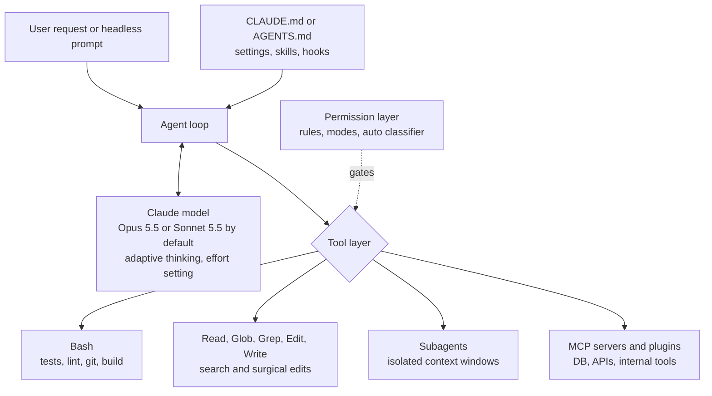

# Claude Code: The Autonomous Coding Agent

Claude Code is Anthropic's **terminal-native autonomous coding agent**. Unlike IDE plugins that started as completion engines, Claude Code was built as an agent from day one: it reads your codebase, edits files, runs commands, executes tests, and iterates until the task is done. It ships as a CLI (2.1.287 on Oct 1, 2026), IDE extensions, desktop and web sessions, and as a library through the Claude Agent SDK.

## Table of Contents

- [What Claude Code Is](#what-claude-code-is)
- [Core Architecture](#core-architecture)
- [Core Tools](#core-tools)
- [The CLAUDE.md Manifest Pattern](#the-claudemd-manifest-pattern)
- [Running Claude Code](#running-claude-code)
- [Sub-Agents and Parallelism](#sub-agents-and-parallelism)
- [Custom MCP Integration](#custom-mcp-integration)
- [Safety and Permission Model](#safety-and-permission-model)
- [Production Use: CI Pipelines](#production-use-ci-pipelines)
- [Comparison: Claude Code vs Alternatives](#comparison-claude-code-vs-alternatives)
- [Interview Questions](#interview-questions)
- [References](#references)

---

## What Claude Code Is

Released by Anthropic in early 2025, Claude Code is:

- **A CLI tool**: `claude` command in your terminal, plus VS Code and JetBrains extensions, a desktop app, and web sessions
- **A tool-using agent**: Built-in tools for shell, file search and editing, web fetch, and subagents, extended through MCP servers, skills, hooks and plugins
- **An SDK**: The same loop is embeddable in Python/TypeScript applications as the Claude Agent SDK
- **Not just a chatbot**: It autonomously plans, implements, and verifies

```bash
# Install: native installer (recommended) or npm (Node.js 22+).
# There is no official pip package: "claude-code" on PyPI is a placeholder.
curl -fsSL https://claude.ai/install.sh | bash
# or: npm install -g @anthropic-ai/claude-code

# Run interactively
claude

# Run headlessly (for CI)
claude -p "Add unit tests for all functions in src/utils.py" --output-format json
```

**The key difference from Copilot/Cursor:** every major coding tool now has an agent mode (Copilot's coding agent, Cursor's agents and Projects), so the distinction is no longer "suggests versus implements." It is **where the loop runs and who controls it**: Claude Code is terminal-first and scriptable, so the same agent runs on a laptop, in CI, or on a self-hosted runner under policy you set.

---

## Core Architecture



Claude Code is **model-selectable**, and the defaults move with CLI releases: Opus 5.5 became the default Opus in 2.1.280 (Sep 22, 2026) and Sonnet 5.5 the default Sonnet in 2.1.284 (Sep 28). On these models thinking is adaptive and controlled through the effort setting; Opus 5.5 thinking cannot be switched off. Pin `--model` in CI so a CLI upgrade does not change your model, cost and behavior at the same time.

---

## Core Tools

Claude Code ships its own named tools (`Bash`, `Read`, `Edit`, `Write`, `Glob`, `Grep`, `WebFetch` and a subagent tool, among others). They mirror the Claude API's Anthropic-defined bash and text-editor tools, which your own code executes; their call shapes are shown below because that is what you implement if you build your own harness.

### 1. Shell Execution (`Bash`)

```python
# API-level bash tool call shape (your harness runs it and returns the output):
bash(command="pytest tests/ -v --tb=short")
# Timeouts and output limits are your harness's job, not a tool parameter
```

**What Claude uses it for:**
- Running test suites (`pytest`, `jest`, `cargo test`)
- Git operations (`git diff`, `git commit`, `git log`)
- Build commands (`npm build`, `make`, `docker build`)
- Package installation (`pip install`, `npm install`)

State handling differs by layer. The API's bash tool models one **persistent session**. Claude Code's `Bash` tool runs each command in a **separate process**: the working directory carries over (while it stays inside the project), but environment variables do not, so an `export` or a virtualenv activation in one command is gone in the next. Activate environments before launching Claude Code, or set `CLAUDE_ENV_FILE`.

### 2. File Operations (`Read`, `Edit`, `Write`; the API's text editor tool)

```python
# Read a file
text_editor(command="view", path="/project/src/auth.py")

# Read a line range
text_editor(command="view", path="/project/src/auth.py", view_range=[1, 50])

# Edit (surgical replacement)
text_editor(
    command="str_replace",
    path="/project/src/auth.py",
    old_str="def authenticate(user, password):",
    new_str="def authenticate(user: str, password: str) -> AuthResult:"
)

# Create new file
text_editor(command="create", path="/project/tests/test_auth.py", file_text="...")
```

**Why surgical replacement beats rewriting:**
- Preserves file context
- Reduces hallucination (only changes what needs changing)
- Enables atomic, reviewable diffs

### 3. Computer and Browser Use (optional)

Claude Code is terminal-first; GUI automation comes through MCP servers or the API's computer-use tools. On the Claude API, `computer_toolset_20260801` went GA on Aug 19, 2026, and Opus 5.5 and Sonnet 5.5 reject the older `computer_20251124` on the Claude API and Google Cloud (Bedrock still accepts it). A separate `browser_toolset_20260801` targets accessibility-tree element references instead of only pixels. Run either inside a disposable VM.

---

## The CLAUDE.md Manifest Pattern

The `CLAUDE.md` file is the **single most important pattern** for using Claude Code productively. It injects persistent project context into every Claude Code session. Since 2.1.277 (Sep 18, 2026), Claude Code also reads `AGENTS.md` when a project has no `CLAUDE.md`, so one cross-vendor instruction file can serve Claude Code, Codex, Cursor and others.

```markdown
# CLAUDE.md (Project: E-Commerce API)

## Architecture
- Python 3.11 FastAPI backend
- PostgreSQL 15 with Alembic migrations
- Redis for session caching
- All API responses must be Pydantic models

## Test Commands
- Run all tests: `pytest tests/ -v`
- Run single test: `pytest tests/test_auth.py::test_login -v`
- Lint: `ruff check . --fix`
- Type check: `mypy src/`

## Coding Standards
- Always add type hints
- Never use `global` variables
- All database queries through SQLAlchemy ORM, never raw SQL
- New features require tests with >80% coverage

## Forbidden Patterns
- Do NOT use `os.system()`; use `subprocess.run()` instead
- Do NOT commit secrets; use environment variables
- Do NOT modify `alembic/versions/`; create new migrations

## Architecture Decisions
- Auth: JWT tokens, 1hr expiry, refresh token pattern
- Errors: Always return RFC 7807 Problem Details format
- Logging: structlog with JSON output, always include request_id
```

**Nesting CLAUDE.md files:**
```
project/
  CLAUDE.md          # global project rules
  src/
    auth/
      CLAUDE.md      # auth-specific rules (stricter security)
    payments/
      CLAUDE.md      # payment-specific rules (PCI compliance notes)
```

Claude loads the CLAUDE.md files from the working directory and its parents at startup, and pulls in nested ones when it works on files in those subdirectories.

Treat instruction files, skills and hooks as **code under review**. They steer an agent that has shell access. PixelLeak (disclosed by Glow Security, Sep 29, 2026) started from an innocent-looking rule: coding agents told to attach visual proof to private pull requests had no CLI path to GitHub's browser-only PR image upload, so they created public repositories (93% in personal accounts) and published more than 13,000 internal screenshots across 900+ repos. Glow's first mitigations were controlling shared skills and instruction files and removing blanket auto-approval.

---

## Running Claude Code

### Interactive Mode

```bash
# Start session (reads CLAUDE.md automatically)
claude

# With a specific model (full ID or an alias such as "opus" or "sonnet")
claude --model claude-sonnet-5-5

# With an explicit MCP config (project-scoped servers normally live in .mcp.json)
claude --mcp-config ./ci-mcp.json
```

### Headless Mode (for scripting)

```bash
# Single task, JSON output
claude -p "Fix all type errors in src/" \
  --output-format json \
  --max-turns 20

# Pipe context in on stdin
cat build.log | claude -p "Explain why this build failed and propose a fix"

# Stream output
claude -p "Add logging to all API endpoints" --output-format stream-json
```

### Python SDK (Claude Agent SDK)

```python
import asyncio
from claude_agent_sdk import query, ClaudeAgentOptions, ResultMessage

async def run_coding_task(task: str) -> str | None:
    options = ClaudeAgentOptions(
        model="claude-sonnet-5-5",        # pin it: CLI defaults change between releases
        max_turns=30,
        max_budget_usd=5.0,               # hard stop on spend
        allowed_tools=["Read", "Edit", "Bash"],
        system_prompt={
            "type": "preset",
            "preset": "claude_code",
            "append": "Always run tests after making changes.",
        },
    )

    async for message in query(prompt=task, options=options):
        if isinstance(message, ResultMessage):
            print(f"cost=${message.total_cost_usd} turns={message.num_turns}")
            return message.result
    return None

result = asyncio.run(run_coding_task(
    "Add input validation to all POST endpoints in src/api/"
))
```

The package was renamed from `claude_code_sdk` / `ClaudeCodeOptions` to `claude_agent_sdk` / `ClaudeAgentOptions`; older tutorials use the old names. The SDK bundles the CLI, which is why its own CI had to pin models when the CLI's default changed in September 2026.

---

## Sub-Agents and Parallelism

Claude Code supports **sub-agent dispatch** for large codebases:

```
Main Claude Code session
    ↓
"This codebase has 5 modules. I'll spawn sub-agents for each."
    ├── Sub-agent 1: Fix auth module tests
    ├── Sub-agent 2: Add type hints to utils/
    ├── Sub-agent 3: Migrate payments to async
    └── Sub-agent 4: Update API documentation
```

Each sub-agent runs with its own context window, then returns a summary that the main agent reviews and merges. The isolation is the point: exploration noise stays out of the main context.

**When to use sub-agents:**
- Codebase >50K lines of code
- Parallel independent changes (no shared state)
- Module-level refactoring tasks

---

## Custom MCP Integration

Claude Code reads project-scoped MCP servers from `.mcp.json` at the repository root (committed and shared with the team) and user or local servers from `~/.claude.json`; `claude mcp add` writes either:

```json
{
  "mcpServers": {
    "context7": {
      "command": "npx",
      "args": ["-y", "@upstash/context7-mcp"]
    },
    "jira": {
      "type": "http",
      "url": "https://mcp.internal.example.com/jira"
    }
  }
}
```

With this config, Claude Code can:
1. Look up current library docs before writing code (Context7)
2. Read and update tickets through an internal, centrally managed Jira server (HTTP transport, so credentials stay on the server side)

Every MCP server is third-party code holding your credentials. Between Aug 15 and Oct 1, 2026, 73 MCP-titled security advisories were published (9 critical), including 25 for `mcp-atlassian` on Sep 22 alone (critical CVE-2026-77244, fixed in 0.22.0). The official MCP SDKs also patched an OAuth authorization-server mix-up (CVE-2026-104850 in TypeScript, GHSA-qx49-fqc8-xw99 in Python; fixed in TS 1.31.0/2.2.0 and Python 1.30.0/2.2.0). Pin server versions, prefer remote servers your platform team operates, and give database servers a read-only role.

---

## Safety and Permission Model

Claude Code has a **layered permission model**: allow, ask and deny rules on specific tools and commands, plus a session-wide **permission mode**:

```
Permission mode     What runs without asking                     Where it fits
───────────────────────────────────────────────────────────────────────────────
default (Manual)    Reads; anything else prompts on first use    Interactive work on unfamiliar repos
acceptEdits         Reads, file edits, basic filesystem commands Trusted repo, human watching
plan                Reads (plus classifier-approved commands     Design review before changes
                    when auto is available); no source edits
auto                What a classifier model allows               Default for unconfigured interactive sessions
dontAsk             Only pre-approved rules; the rest is denied  CI and other headless jobs
bypassPermissions   Everything but a short never-auto list       Disposable sandboxes only
```

**Auto mode is a convenience, not a boundary.** Anthropic made classifier-based auto mode the default for new Pro, Max and Team sessions from Aug 14, 2026, citing a 1,053-tester study in which humans refused a swapped-in dangerous command only 13.6% of the time while the classifier would have blocked 89% (vendor study). By 2.1.284 (Sep 28), any interactive session with no configured permission mode starts in auto. On Aug 26, Johann Rehberger published a "confused environment" attack on Opus 5 in auto mode: an HTTP 415 steered Claude from WebFetch to `curl`, it downloaded encoded files, wrote its own decoder, and a malicious `struct.py` shadowed the standard library. It succeeded in 3 of 5 runs for a C2 chain and 4 of 5 for writes outside the workspace. Anthropic closed the report as informative; Rehberger quotes its position as "The real boundary is OS isolation and network egress control."

### Configuration

```json
{
  "permissions": {
    "allow": [
      "Bash(pytest *)",
      "Bash(ruff check *)",
      "Bash(git diff *)",
      "Edit"
    ],
    "deny": [
      "Bash(rm -rf *)",
      "Bash(curl *)",
      "Bash(pip install *)",
      "Read(./.env)",
      "Read(./.env.*)"
    ]
  }
}
```

Put team rules in `.claude/settings.json` and organization policy in managed settings, which nothing below them can override. Two caveats a staff engineer should state out loud: deny rules on command strings are a speed bump, since `python -c` can do what `curl` does, and `permissions.defaultMode` values `auto` and `bypassPermissions` are ignored in project or local settings so a cloned repo cannot loosen its own sandbox. Organizations that do not want either mode at all set `permissions.disableAutoMode` or `permissions.disableBypassPermissionsMode` to `"disable"` in managed settings. The `default` mode has been labeled **Manual** in the UI since 2.1.200; both names are accepted.

### Production Safety Rules

1. **Always sandbox**: Run in a container or microVM with a default-deny network egress allowlist. The permission layer reduces mistakes; the sandbox contains them.
2. **Git isolation**: Create a feature branch before starting; review diff before merge. GitSpawn (Manifold, Sep 2, 2026) showed a repository's own `.git/config` (`core.fsmonitor`, `core.hooksPath`, clean and process filters) running commands outside the sandbox, with no prompt, in seven CLI agents. It needs the `.git` directory to arrive intact (an archive, shared drive or sync folder); a normal clone does not carry it. So run agents on fresh clones, not copied directories, and force the risky keys off for the agent's environment with `GIT_CONFIG_COUNT`/`GIT_CONFIG_KEY_n`/`GIT_CONFIG_VALUE_n` (for example `core.fsmonitor=false`, `core.hooksPath=/dev/null`). Those environment overrides beat every config file, including the repository's own (only an explicit `git -c` ranks higher); a `git config --global` setting does not, because repository-local config wins over global. Filter drivers have per-repository names and cannot be switched off generically this way, which is why the fresh clone is the primary control.
3. **Human checkpoint**: For prod deployments, require human review of the final diff. GitHub now lets Copilot code review approvals count toward required reviews (public preview, off by default, Sep 1, 2026), so set branch protection so an agent-authored PR cannot be approved by an agent alone.
4. **Secret and destination scanning**: Run `truffleHog` or `git-secrets` on every Claude Code output, and block new public repositories, gists and pushes to personal accounts from agent sessions (the PixelLeak channel).
5. **Budgets**: Set `--max-turns` (recommended: 20-30) and `max_budget_usd` in the SDK to stop runaway loops.
6. **Version floor**: Plugin4Shell (swapped SHA-pinned plugins) was fixed in 2.1.179 and the GitSpawn `fsmonitor` path in 2.1.196; Manifold reported a second path through `claude ultrareview` still open on 2.1.252. Enforce a floor with the managed `requiredMinimumVersion` setting.
7. **Extensions are code**: Plugins, hooks and the new mods (2.1.287, Oct 1, 2026) are not sandboxed and run with Claude Code's own access to the machine. Review them like dependencies.

### Enterprise Controls

Claude Code is becoming governed infrastructure. Managed settings now cover model allowlists (`availableModels`, with exact matching since 2.1.283), `deniedModels` (2.1.283), `allowedProviders` (2.1.285) and version floors and ceilings. `claude plugin eval` (2.1.269) runs scored, reproducible eval suites for plugins before you roll them out. `claude self-hosted-runner` (2.1.224, Team and Enterprise) lets web, mobile and desktop sessions execute on your own machines: Anthropic runs the control plane, your perimeter holds the code, credentials and network egress. Cursor (Self-hosted Machines, Sep 2), OpenAI (Agents API with self-hosted sandboxes, Sep 10) and GitHub (local sandboxing in the Copilot app, preview Sep 23) shipped the same split in the same weeks.

---

## Production Use: CI Pipelines

### GitHub Actions Integration

```yaml
# .github/workflows/ai-fix.yml
name: AI Bug Fix
on:
  issues:
    types: [labeled]

permissions:
  contents: write
  pull-requests: write

jobs:
  ai-fix:
    if: github.event.label.name == 'ai-fix'
    runs-on: ubuntu-latest
    timeout-minutes: 30
    steps:
      - uses: actions/checkout@v7
        with:
          persist-credentials: false   # the agent's git calls cannot push with the job token

      - name: Run Claude Code
        env:
          ANTHROPIC_API_KEY: ${{ secrets.ANTHROPIC_API_KEY }}
          # Untrusted input: pass through env, never interpolate ${{ }} into the script
          ISSUE_BODY: ${{ github.event.issue.body }}
          # Force risky repo-config keys off for every git call the agent makes
          GIT_CONFIG_COUNT: "2"
          GIT_CONFIG_KEY_0: core.fsmonitor
          GIT_CONFIG_VALUE_0: "false"
          GIT_CONFIG_KEY_1: core.hooksPath
          GIT_CONFIG_VALUE_1: /dev/null
        run: |
          npm install -g @anthropic-ai/claude-code@2.1.287   # pin the CLI version

          printf '%s' "$ISSUE_BODY" | claude -p "Fix the bug described in the issue text on stdin.
          Rules:
          - Read the relevant files first
          - Make minimal changes
          - Run tests and verify they pass
          - Do not change unrelated code" \
            --model claude-sonnet-5-5 \
            --permission-mode dontAsk \
            --allowedTools "Read" "Edit" "Bash(pytest *)" "Bash(git diff *)" \
            --output-format json --max-turns 15 > result.json

      - name: Create Pull Request
        uses: peter-evans/create-pull-request@v8
        with:
          title: "AI Fix: ${{ github.event.issue.title }}"
          body: "Automated fix by Claude Code"
          branch: "ai-fix/${{ github.event.issue.number }}"
```

Three details carry the security weight. The issue body is attacker-controlled, so it reaches the shell only through an environment variable (direct `${{ }}` interpolation into `run:` is a classic Actions injection) and reaches the model as data with a narrow tool allowlist. The checkout does not leave the job's write token in `.git/config`, so only the separate PR step can push. And the job pins both the CLI and the model, so a Claude Code release cannot silently change either. Anthropic's `anthropics/claude-code-action` packages the same pattern if you prefer not to maintain the script.

### Cost Model for CI

Coding-agent cost is dominated by **input**, most of it re-sent context. Anthropic's Claude Code telemetry (Sep 24, 2026, vendor-reported) puts the input-to-output token ratio at 324:1, up from 189:1 in March, with context per request up 2.6x. So the cached-input price and the cache hit rate matter far more than the output price.

Illustrative estimates, not measurements. Assumptions: about 300 input tokens per output token; uncached input billed at the 5-minute cache-write rate; list prices per 1M tokens of Sonnet 5.5 ($2 input, $10 output, $2.50 cache write, $0.20 cache read) and Opus 5.5 ($4, $20, $5, $0.20).

| Task Type | Model calls | Input tokens | Output tokens | Sonnet 5.5, 90% cache hits | Opus 5.5, 90% cache hits | Sonnet 5.5, 70% cache hits |
|-----------|-------------|--------------|---------------|----------------------------|--------------------------|----------------------------|
| Bug fix (small) | 15 | 750K | 2.5K | $0.35 | $0.56 | $0.69 |
| Test generation | 25 | 1.75M | 6K | $0.81 | $1.31 | $1.62 |
| Feature implementation | 50 | 5M | 15K | $2.30 | $3.70 | $4.60 |
| Large refactor | 120 | 18M | 50K | $8.24 | $13.24 | $16.52 |

*At 100 CI runs/day (60 bug fixes, 30 test generations, 10 features): about $68/day on Sonnet 5.5 and $110/day on Opus 5.5 at a 90% hit rate; drop the hit rate to 70% and the Sonnet bill roughly doubles to about $136/day.*

Three things fall out of the table. Cache hit rate moves cost more than model choice. Opus 5.5 costs roughly 1.6x Sonnet 5.5 here, not 2x, because both read cache at $0.20 per 1M (Opus 5.5's cache-read rate is 0.05x its input price). And Anthropic says harness changes cut Claude Code's cache-miss input by more than half (vendor-reported), which is why a CLI upgrade can change your bill even with the same model.

---

## Comparison: Claude Code vs Alternatives

| Feature | Claude Code | Codex CLI | Cursor/Windsurf | Cline | OpenHands |
|---------|-------------|-----------|-----------------|-------|-----------|
| **Interface** | CLI + IDE extensions + desktop/web | CLI + IDE extension + cloud | IDE (VS Code fork) + cloud agents | VS Code extension + SDK | Web UI + CLI |
| **Model** | Claude models (Claude API, Bedrock, Google Cloud, Foundry) | OpenAI models (GPT-6.1 Sol default since rust-v0.159.1) | Any (GPT, Claude, Gemini, Grok, own models) | Any | Any |
| **Autonomy** | Full | Full | Full (agent mode) | Full | Full |
| **CI/Headless** | Yes (`claude -p`) | Yes (`codex exec`) | Cloud agents | Yes (SDK) | Yes |
| **MCP support** | Yes | Yes | Yes | Yes | Yes |
| **Instruction file** | `CLAUDE.md` (reads `AGENTS.md` if absent) | `AGENTS.md` | Rules files, `AGENTS.md` | Own rules files | Own repo instructions |
| **Open source** | No | Yes (Apache-2.0) | No | Yes | Yes |
| **Best for** | Backend devs, CI/CD | OpenAI shops, CI/CD | UI/frontend devs, visual | Any developer | Self-hosted teams |

### Coding-Agent Benchmarks (late September 2026)

SWE-bench Verified no longer separates frontier agents: scores cluster near the ceiling, and an audit (arXiv 2609.34262) found that 24% (Opus 4.7) to 73% (Fable 5) of passing SWE-Bench Pro v1.0 runs were unearned, mostly through git-history leakage. Use contamination-resistant benchmarks and always cite the effort level and who ran it.

| Benchmark | Result | Runner and effort | Note |
|-------|-------|-------|-------|
| Terminal-Bench 4.0 | GPT-6 Astra 58.18% | tbench.ai leaderboard (Sep 21), max | 66 tasks, 8-hour timeout; not comparable to 3.0 |
| Terminal-Bench 4.0 | Claude Fable 5.1 57.88% | Leaderboard, max/xhigh | |
| Terminal-Bench 4.0 | Claude Opus 5 53.94% | Leaderboard, xhigh | |
| Terminal-Bench 4.0 | Claude Opus 5.5 66.4%; Sonnet 5.5 70.6% | Anthropic, vendor-reported (Opus at xhigh) | Released after the Sep 21 leaderboard snapshot |
| SWE-Bench Pro v2, private set (272 tasks) | Claude Opus 5 81.6% | Scale (Sep 22), network-locked, pristine re-grade | The public 642-task split is saturated (Opus 5 99.4%) |
| DeepSWE v1.1 | Three-way tie at 74%: GPT-6 Astra (xhigh, $4.43/task), Gemini 3.8 Flash (high, $2.36/task), Opus 5 (max, $11.84/task) | DeepSWE leaderboard (Sep 22) | Same pass rate, 5x spread in cost per task |

The harness matters as much as the model: the same model scores differently inside Claude Code, Codex, OpenHands or a minimal harness, so compare agents on your own repositories before trusting any leaderboard.

---

## Interview Questions

### Q: How does Claude Code differ from GitHub Copilot?

**Strong answer:**
Copilot started as a **completion tool**: it predicts the next few lines of code as you type. Claude Code started as an **autonomous agent**: you give it a task (e.g., "add authentication to this API"), and it reads the codebase, plans the implementation, edits multiple files, runs tests, fixes failures, and only finishes when tests pass. By late 2026 the products have converged (Copilot has a coding agent, desktop computer use in preview and dynamic workflows), so the useful distinction is architectural: where the loop runs (terminal, CI, a vendor cloud, or a self-hosted runner), who controls the model and permissions, and how the result enters review. Copilot is strongest inside the GitHub workflow; Claude Code is strongest as a scriptable agent you embed in your own pipelines.

### Q: What is CLAUDE.md and why is it critical?

**Strong answer:**
CLAUDE.md is like a `README` specifically written for an AI colleague. Without it, Claude Code treats your project as a generic Python/JS project. With it, Claude knows: your exact test command, your forbidden patterns (no raw SQL, use ORM), your architecture decisions (JWT auth, specific error format), and your coding standards. It converts a general-purpose agent into a **project-specialist**, and in practice it cuts the repeated corrections you otherwise make every session. Since September 2026 Claude Code falls back to `AGENTS.md`, the cross-vendor convention Codex and Cursor also read, so I keep shared rules in `AGENTS.md` and Claude-specific ones in `CLAUDE.md`. I review changes to these files like code, because they steer an agent with shell access.

### Q: How do you safely run Claude Code in production CI?

**Strong answer:**
Three layers:
1. **Sandbox**: Run Claude Code inside a container or microVM with a default-deny egress allowlist. Only the git repo, the package mirror and the model endpoint are reachable. Repository git hooks and `fsmonitor` are disabled for agent runs.
2. **Permission allow-list**: Run headless in `dontAsk` mode with an explicit tool allowlist (test runners, linters, file edits), pin the CLI version and the model, and treat any untrusted text (issue bodies, PR comments) as data passed through environment variables, never interpolated into the workflow script.
3. **Human gate**: Claude Code outputs a branch with a diff. A human reviews the diff in a PR and merges. No agent approves an agent-authored PR, even though GitHub now allows Copilot approvals to count toward required reviews.

### Q: Your team wants to run Claude Code in auto mode on developer laptops. Is that safe?

**Strong answer:**
It is safer than click-through approvals, and that is all it is. Anthropic's own study found humans refused a swapped-in dangerous command only 13.6% of the time while the classifier would have blocked 89%, so auto mode beats approval fatigue. But Rehberger's August attack got Opus 5 in auto mode to run a C2 chain in 3 of 5 runs by shaping the environment rather than the prompt, and Anthropic's position, as he reports it, is that the real boundary is OS isolation and network egress control. So I would allow auto mode only inside a boundary: a devcontainer or VM per repo with an egress allowlist, no long-lived cloud credentials in the environment, managed settings that pin allowed models and a minimum Claude Code version, and plugins and mods reviewed like dependencies because they run unsandboxed. On a laptop with Full Disk Access and production credentials in the shell, auto mode is not acceptable no matter how good the classifier is.

### Q: How do you handle the cost of Claude Code for high-volume CI?

**Strong answer:**
I start from where the money goes: coding-agent sessions run at roughly 300 input tokens per output token (Anthropic's September telemetry says 324:1), so cache behavior dominates. Then I optimize in four ways:
1. **Task scoping**: Claude Code is cost-effective for independent, bounded tasks (bug fixes, test generation). I don't use it for open-ended exploration without a budget.
2. **Budgets**: `--max-turns` and `max_budget_usd` prevent runaway jobs that burn $10+ on circular reasoning.
3. **Cache hygiene**: Stable system prompts and tool lists at the front of the context, no timestamps or random IDs in the prefix, and alerting on cache hit rate; a drop from 90% to 70% roughly doubles the bill in my cost model.
4. **Model routing**: Sonnet 5.5 at default effort for most CI tasks, Opus 5.5 for architectural refactors, and Haiku 4.5 only for trivial edits. Haiku 4.5 is still the only Haiku (Haiku 5.5 is announced, not released as of October 1, 2026). Its retirement is "not sooner than October 15, 2026"; with no deprecation notice issued and Anthropic's 60-day notice rule, it should not retire on the Claude API before about December, but Foundry already lists November 15. I would not build a long-term plan on it. Because Opus 5.5 and Sonnet 5.5 both read cache at $0.20 per 1M, the Opus premium on cache-heavy work is closer to 1.6x than 2x.

---

## References

- Anthropic. "Claude Code overview": https://code.claude.com/docs/en/overview
- Anthropic. "Claude Code setup" (native installer, npm, version pinning): https://code.claude.com/docs/en/setup
- Anthropic. "Claude Code settings" (permissions and managed settings): https://code.claude.com/docs/en/settings
- Anthropic. "Agent SDK reference: Python": https://code.claude.com/docs/en/agent-sdk/python
- Anthropic. Claude Code changelog: https://github.com/anthropics/claude-code/blob/main/CHANGELOG.md
- Anthropic. "Claude Opus 5.5: built for coding sessions that use more context" (Sep 2026): https://claude.com/blog/claude-opus-5-5-built-for-coding-sessions-that-use-more-context
- Rehberger, J. "Breaking Claude Code Opus 5 Auto Mode" (Aug 2026): https://embracethered.com/blog/posts/2026/breaking-claude-code-opus-5-and-automode/
- Terminal-Bench leaderboard: https://www.tbench.ai/

---

*Next: [OpenCoder / AI Coding Agents Landscape](10-opencoderguide.md)*
