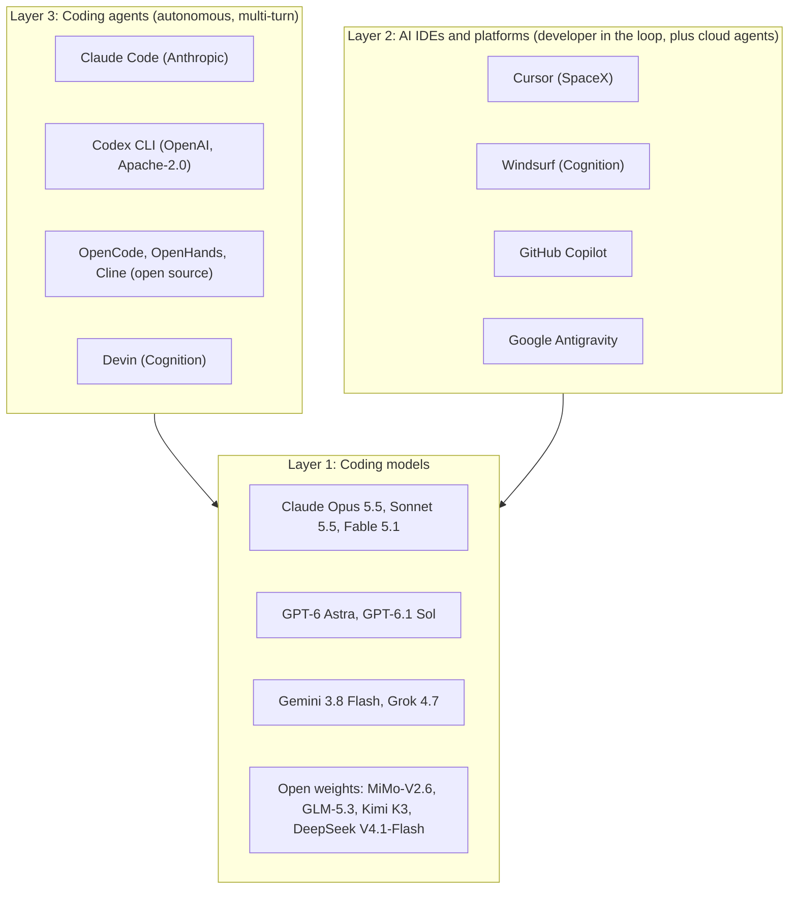

# OpenCoder: AI Coding Agents Landscape

The AI coding agent landscape has exploded and then consolidated. By October 2026 it has three clear shapes: terminal agents backed by labs or large communities (Claude Code, Codex CLI, OpenCode, Gemini CLI), IDE agents owned by companies that also build models (Cursor has been part of SpaceX since August 2026; Windsurf has been part of Cognition since July 2025), and a split architecture where the vendor runs the control plane while your infrastructure runs the code. This guide covers open-weight coding models, agentic IDEs, open-source agents, and how to choose the right tool for your engineering workflow.

## Table of Contents

- [The AI Coding Landscape (2026)](#the-ai-coding-landscape-2026)
- [Open-Weight Coding Models](#open-weight-coding-models)
- [AI-Native IDEs](#ai-native-ides)
- [Open-Source Coding Agents](#open-source-coding-agents)
- [Benchmark Deep Dive](#benchmark-deep-dive)
- [Cost Comparison](#cost-comparison)
- [Selection Guide](#selection-guide)
- [Production Architecture](#production-architecture)
- [Interview Questions](#interview-questions)
- [References](#references)

---

## The AI Coding Landscape (2026)

The coding AI landscape has three distinct layers:



The layers are blurring. IDE vendors train their own models (Cursor's Composer, Cognition's SWE-2, which Cognition says is post-trained from Kimi K3), lab agents ship IDE extensions, and the Vercel AI SDK 7's experimental `HarnessAgent` treats whole coding harnesses as pluggable dependencies.

---

## Open-Weight Coding Models

These models can be self-hosted, fine-tuned, and deployed without any API dependency. Read the license before the model card: in 2026 several "open" coding-capable models carry commercial gates.

### The Current Open-Weight Frontier (October 2026)

| Model | Released | Total / active params | License | Coding-relevant notes |
|-------|----------|-----------------------|---------|-----------------------|
| Xiaomi MiMo-V2.6-Pro / -Flash | Sep 21, 2026 | 1.02T / 42B; 309B / 15B | MIT | 1M context; top open model on the Artificial Analysis Intelligence Index v4.3.2 (46) |
| Z.ai GLM-5.3 | Weights Aug 28, 2026 | 744B / 40B | MIT, plus a security review for MaaS providers above US$10B revenue in 12 months | AA 45; API $1.40/$4.40 per 1M; 211/272 on the SWE-Bench Pro v2 private set |
| Moonshot Kimi K3 | July 2026 | 2.8T / 104B active | Custom: a separate agreement for companies that run any MaaS business and whose total revenue (with affiliates) exceeds US$20M over 12 months | AA 44; 214/272 on SWE-Bench Pro v2 private; base for Cognition SWE-2 and Fireworks Ember-1 |
| Z.ai GLM-5.3-Flash | Aug 26, 2026 | 320B / 18B | MIT | AA 42; API $0.15/$0.50 per 1M |
| DeepSeek V4.1-Flash | Sep 10, 2026 | 552B backbone; 8B active in prefill, 16B in decode | MIT | AA 39; vendor-reported DeepSWE v1.1 74.2 at max effort |
| Qwen3.8-Flash-Next | Aug 26, 2026 | 125B / 6B plus a 51B n-gram table | Qwen Community License 1.0 | Any MaaS or AI coding-assistant **business** needs a separate license from Qwen, with no revenue floor; purely internal use is exempt |
| Qwen3.8-27B | 2026 | 27B dense | Apache 2.0 | Single-GPU class; also the base of Ternary Bonsai 2 27B (1.72 bits per weight, 5.95 GB) |
| IBM Granite 4.2 | Aug 25, 2026 | 3B / 8B / 30B dense | Apache 2.0 | 128K context (extendable to 512K); vendor-reported SWE-bench Verified 57 for the 30B |
| MiMo-V2.6-Distill-Qwen-9B | Sep 21, 2026 | 9B | MIT | Vendor-reported 61.1% SWE-bench Verified, 44.6% SWE-bench Pro |

**The license trap**: under the Qwen Community License 1.0, a startup building a coding agent on Qwen3.8-Flash-Next needs Alibaba's permission from day one, which is stricter than the license on Qwen's own 2.4T flagship (gate above US$50M revenue). Mistral Medium 3.5's Modified MIT license grants no rights above US$20M monthly revenue. Put license review in the model-selection checklist, next to evals.

### Older Small Models Still Used for Completions

The 2024-era coder models remain popular for low-latency fill-in-the-middle (FIM) completion on modest hardware, where agentic capability does not matter. The HumanEval+ numbers below are as reported in the Qwen2.5-Coder technical report (arXiv 2409.12186, Tables 5 and 16), except StarCoder2, which comes from its Hugging Face model cards. They are far behind current frontier models on agentic tasks.

| Model | Parameters | Context | HumanEval+ | License |
|-------|------------|---------|------------|---------|
| Qwen2.5-Coder-32B-Instruct | 32B | 128K | 87.2% | Apache 2.0 |
| Qwen2.5-Coder-7B-Instruct | 7B | 128K | 84.1% | Apache 2.0 |
| Qwen2.5-Coder-1.5B-Instruct | 1.5B | 32K | 66.5% | Apache 2.0 |
| DeepSeek-Coder-V2-Lite-Instruct | 16B MoE (2.4B active) | 128K | 75.6% | DeepSeek model license |
| StarCoder2-15B / 7B / 3B | 15B / 7B / 3B | 16K | 37.8% (15B base; 63.4% for StarCoder2-15B-Instruct-v0.1) | BigCode OpenRAIL-M |

```python
# Self-hosted with vLLM (use vLLM >= 0.30.0: earlier releases have
# published RCE and engine-kill advisories)
from vllm import LLM

model = LLM(
    model="Qwen/Qwen2.5-Coder-32B-Instruct",
    tensor_parallel_size=2,  # 2× A100 80GB
)
response = model.generate("def fibonacci(n: int) -> list[int]:")
```

### Open Model Selection Guide

```
Low-latency completions (< 100ms) on a laptop or single GPU?
  → Qwen2.5-Coder-1.5B/7B or StarCoder2-3B (FIM-trained, mature tooling)

Agentic coding, single GPU, permissive license?
  → Qwen3.8-27B (Apache 2.0) or Granite 4.2 30B

Agentic coding on one 8-GPU node?
  → GLM-5.3-Flash or MiMo-V2.6-Flash (MIT); DeepSeek V4.1-Flash needs H200/B200-class memory

Best self-hosted quality, multi-node budget?
  → MiMo-V2.6-Pro, GLM-5.3 or Kimi K3 (check each license gate)

Building a coding-assistant product to sell?
  → Read the license first: Qwen Community License 1.0 requires a separate license
```

---

## AI-Native IDEs

### Cursor

**Website:** cursor.com | **Base:** VS Code fork | **Pricing:** Pro from $20/mo, Teams and Enterprise plans

Cursor is the leading AI-native IDE, and since August 14 to 15, 2026 it is **part of SpaceX** (reported at about $60B in SpaceX stock). Grok 4.6 and 4.7 launched on Cursor's own blog. The acquisition announcement said nothing about continued access to third-party models or about data-use commitments, and two weeks later the model question got a concrete answer: on Aug 28, 2026 OpenAI told SpaceX it would wind down its contract supplying OpenAI models to Cursor, with a proposed shutoff of **November 12, 2026**, and would not supply future models (GPT-6 Astra included) while Cursor is under SpaceX ownership. The notice covers only OpenAI's models; treat continued access to the others, and data use, as contract questions, not assumptions. Cursor earned AIUC-1 agent certification on Aug 13, 2026.

| Feature | Description |
|---------|-------------|
| **Agent** | Multi-file agentic editing; Composer is now the name of Cursor's own coding model |
| **Tab** | Predictive completions |
| **Cloud agents** | Run on Cursor's infrastructure or, since Sep 2, 2026, on **Self-hosted Machines** (your own machines or team pools on AWS Lambda, Coder, Cloudflare, Daytona, Modal, Namespace, Vercel or E2B) |
| **Projects** (beta, Sep 10, 2026) | A coordinator agent plans work and delegates to parallel subagents, up to thousands; Cursor says new Projects users merge 30% more PRs (vendor-reported) |
| **Rollouts and Security Review** (Sep 23, 2026) | A monitor on every PR that tracks change health per environment as it deploys, and a PR scanner for exploitable bugs (Teams and Enterprise) |
| **Rules** | Project-level AI instructions in `.cursor/rules`, and `AGENTS.md` |
| **Model choice** | Anthropic, Google, xAI Grok and Cursor's own models; OpenAI models until the proposed Nov 12, 2026 shutoff (OpenAI says it will not supply GPT-6 Astra or later models) |

**Best for**: Frontend/full-stack developers who want agentic editing within a familiar GUI, and teams that want cloud agents without running the orchestration themselves.

**Limitations**: Closed-source; code goes to Cursor's servers unless you use Privacy Mode and self-hosted machines; ownership by a frontier-model company raises model-neutrality and data-governance questions for some buyers.

### Windsurf (Cognition)

**Website:** windsurf.com | **Base:** VS Code fork | **Pricing:** Free tier plus paid plans

Windsurf was built by Codeium and has been owned by **Cognition**, the maker of Devin, since July 2025. Cognition raised more than $2B at a $48B valuation (Sep 8, 2026), reports more than $1B in annualized revenue run rate (vendor-reported), and shipped SWE-2, its own flagship coding model, available only inside Devin.

| Feature | Description |
|---------|-------------|
| **Cascade** | Windsurf's agentic editing mode |
| **Flows** | Shared agent-and-developer sessions where Cascade tracks your edits and actions as context; not to be confused with CrewAI Flows |
| **Model choice** | Multiple vendors' frontier models plus Cognition's own |
| **Free tier** | Free credits for individuals |

**Best for**: Teams that want a Cursor-like experience with a free tier and model flexibility, and shops already buying Devin.

### GitHub Copilot (Microsoft/OpenAI)

| Feature | Status (October 2026) |
|---------|---------------------|
| Completions | Still the market leader by install base |
| Coding agent | Assign an issue, get a PR (Copilot Workspace's preview ended in 2025) |
| Code review approvals | Copilot reviews can count toward required approvals (public preview, off by default, Sep 1, 2026); admins choose which paths it may approve; its approval is dismissed on new commits |
| Computer use and dynamic workflows | Public preview Oct 1, 2026 in the Copilot CLI and app; workflows are code-defined stages with checkpoints for human review |
| HydraFusion | Research preview (Sep 30, 2026): cascade (cheap model drafts, a quality gate escalates) and cross-family critique modes |
| Local sandboxing | Per-project filesystem, network and credential limits in the Copilot app (public preview, Sep 23, 2026, off by default) |
| Model | Auto model selection with efficiency, balance and intelligence tiers; OpenAI, Anthropic and Google models available |
| Enterprise features | IP protection, org policies, code referencing controls |

**Best for**: Enterprise teams already on Microsoft/GitHub ecosystem.

**2026 reality**: Many developers prefer Cursor or Claude Code for agentic work, but Copilot's enterprise controls and GitHub integration keep it dominant in large orgs. Two governance notes: Copilot was unpatched for Plugin4Shell at disclosure (Sep 17, 2026), and from Oct 1, 2026 credit-card and PayPal customers pay upfront for assigned seats.

### Google Antigravity

Antigravity is Google's agentic development platform, an **agent-first workspace** rather than a text editor. Antigravity 2.0 (May 19, 2026) made it a product family: a desktop app for coordinating multiple local agents, the IDE, an **Antigravity CLI** and an SDK.

| Feature | Detail |
|---------|--------|
| **Agent Manager** | A dedicated view to launch, watch, and steer multiple async coding agents instead of editing files one at a time |
| **Planning + artifacts** | Agents produce a plan and reviewable artifacts (diffs, task lists, live browser sessions) before and during execution |
| **Built-in browser** | Agents can run and visually test the UI they build |
| **Model optionality** | Gemini models by default, with support for Anthropic Claude and open models |
| **Enterprise** | Included in eligible Gemini Enterprise Standard and Plus subscriptions since Aug 20, 2026, with sandbox and policy limits on browser and MCP permissions, budget caps, central audit logging, Workforce Identity Federation, and extensions for VS Code, Visual Studio, JetBrains, Zed and Xcode |
| **API agent** | `antigravity-preview-09-2026` replaced `antigravity-preview-05-2026` on Sep 17 (the May version shuts down Oct 5, 2026) with breaking tool changes: PascalCase parameters, line-range edits instead of full rewrites, new `find_by_name` and `grep_search` tools |

Google positions the Antigravity CLI as the successor to Gemini CLI; it replaced Gemini CLI for free, Google AI Pro and Ultra users in June 2026. Gemini CLI is still maintained (v0.62.0, Sep 29, 2026) for Gemini Code Assist Standard and Enterprise and paid API keys.

**Best for**: Developers who want to operate at the "task" level (delegate a goal, review the plan and result) rather than the "edit" level, and Google Cloud shops that want one licensed harness across IDE, CLI and SDK.

---

## Open-Source Coding Agents

### OpenCode

**GitHub:** github.com/anomalyco/opencode | **License:** MIT

The most-starred open-source coding agent (211.3K stars, Oct 1, 2026; v1.18.34 on Sep 30; about 9.6M npm downloads in the prior month). A terminal agent with a TUI that works with any provider, including local models, and supports MCP. It is the default answer to "open-source Claude Code with model choice."

### Codex CLI (OpenAI)

**GitHub:** github.com/openai/codex | **License:** Apache-2.0

OpenAI's open-source terminal agent (127.5K stars; rust-v0.159.3 on Sep 30, 2026; about 88.8M npm downloads in the prior month). Key 2026 facts:

- **Default model**: GPT-6.1 Sol since rust-v0.159.1 (Sep 29), including Amazon Bedrock catalogs. A CLI upgrade swapped the model for everyone who had not pinned one.
- **DevDay (Sep 29)**: reusable cloud environments, a `/agents` view for parallel tasks, Code Review for GitHub PRs and GitLab MRs, Codex Security Cloud, and an **Ultrafast** tier (available on GPT-6 Astra, coming to Sol; OpenAI says up to 8x faster generation in Codex; global processing or US residency only, no EU endpoint).
- **Security fixes**: GitSpawn in 0.131.0, Plugin4Shell in 0.146.0.
- **Headless**: `codex exec` for CI.

### OpenHands (formerly OpenDevin)

**GitHub:** github.com/OpenHands/OpenHands (moved from `All-Hands-AI/OpenHands`) | **License:** MIT

OpenHands now ships as **Agent Canvas** (v1.24.0, Sep 25, 2026, shipping roughly weekly): a self-hosted control center that runs the open-source OpenHands agent, or any agent that speaks the Agent Client Protocol (Claude Code, Codex, Gemini), against interchangeable backends. Older tutorials that mount the Docker socket into `docker.all-hands.dev/all-hands-ai/openhands` describe the previous architecture.

```bash
# Docker sandbox option from the upstream README (pin the tag you tested)
export PROJECTS_PATH="$HOME/projects"   # only these folders are visible to the agent
mkdir -p "$PROJECTS_PATH" "$HOME/.openhands"
docker run -it --rm \
  -p 127.0.0.1:8000:8000 \
  -e AGENT_CANVAS_ALLOW_LAN_SESSION_KEY=true \
  -v "$HOME/.openhands:/home/openhands/.openhands" \
  -v "${PROJECTS_PATH}:/projects" \
  ghcr.io/openhands/agent-canvas:1.24.0
# UI at http://localhost:8000/canvas; models are configured as LLM profiles in the UI.
# Publish only on 127.0.0.1: on a LAN or public interface, drop the session-key
# injection flag and follow the upstream self-hosting hardening guide.
```

**Architecture:**
```
Agent Canvas (web UI, automations: schedules, webhooks, Slack, GitHub, Linear)
    ↓
Agent Server (OpenHands SDK)
    ├── OpenHands agent, or an ACP agent (Claude Code, Codex, Gemini)
    └── Backend: local process, Docker (one container per conversation),
        a VM, or OpenHands Cloud / Enterprise
```

**Key features:**
- **Any LLM**: LLM profiles cover Claude, GPT, Gemini and open-weight models through OpenAI-compatible endpoints
- **Swappable execution backends**: The same UI drives agents on a laptop, in per-conversation Docker containers, or on a shared team server
- **Automations**: Scheduled or webhook-triggered agent runs, which is the CI-integration story
- **Harness-neutral**: Because it can drive Claude Code or Codex over ACP, it competes as an orchestration layer, not only as an agent

### Aider (Legacy)

**GitHub:** github.com/Aider-AI/aider | **License:** Apache 2.0

Aider pioneered the terminal-first, git-native coding agent: it commits changes as it goes, keeps a repository map of files not in context, and separates an architect mode from the editing model. It has **gone quiet**: the last PyPI release is 0.86.2 (Feb 12, 2026) and the last commit was May 22, 2026. An unmaintained harness does not learn newer models' API constraints (recent Claude and GPT-6 models reject custom sampling parameters, for example) or ship security fixes, so prefer OpenCode or Codex CLI for new work.

```bash
# 2025-era usage, shown for its git-native workflow; claude-3-7-sonnet-20250219
# was retired Feb 19, 2026, and current Claude models may reject the sampling
# parameters Aider sends
pip install aider-chat
aider --model claude-3-7-sonnet-20250219
/add src/auth.py src/models.py
> Add JWT authentication to the User model
```

### Cline (VS Code Extension)

**GitHub:** github.com/cline/cline | **License:** Apache 2.0

Open-source VS Code extension for autonomous coding, now at v4.1.22 with an SDK for embedding it elsewhere:

```
VS Code
  └── Cline Extension
        ├── Any model (Claude, GPT, Gemini, Ollama)
        ├── File system access (read/write any file)
        ├── Terminal (bash commands)
        ├── Browser (playwright)
        └── MCP servers (any MCP tool)
```

**Key differentiators:**
- **MCP-native**: Full MCP support out of the box
- **Permission per action**: Shell commands and file edits ask for approval by default, with configurable auto-approve
- **Model flexibility**: Supports any OpenAI-compatible API endpoint (including local Ollama)
- **Free**: Open-source, no subscription (you pay for the model API)

**Best for**: Developers who want Cursor-like experience for free, with full model flexibility.

---

## Benchmark Deep Dive

### Current Coding Benchmarks

SWE-bench Verified stopped separating frontier agents: scores cluster near the ceiling, and a September 2026 audit (arXiv 2609.34262) found that 24% (Opus 4.7) to 73% (Fable 5) of passing SWE-Bench Pro v1.0 runs were unearned, mostly through access to reference solutions in git history. A companion study (arXiv 2609.27891) found performance drops when SWE-bench repositories are rewritten in behavior-preserving ways, a sign of memorized repository cues. Current numbers to cite, always with the effort level and who ran them:

| Benchmark | Results | Runner | Why it matters |
|-----------|---------|--------|----------------|
| SWE-Bench Pro v2, private set (272 tasks) | Claude Opus 5 222 (81.6%), Kimi K3 214 (78.7%), GLM-5.3 211, Gemini 3.8 Flash 211, Inkling 184 | Scale, Sep 22, 2026; network-locked sandbox, pristine re-grade | Clean measurement; open-weight Kimi K3 and GLM-5.3 are within about 3 to 4 points of Opus 5. The public 642-task split is saturated (Opus 5 99.4%) |
| Terminal-Bench 4.0 | GPT-6 Astra 58.18% (max), Claude Fable 5.1 57.88% (max/xhigh), Claude Opus 5 53.94% (xhigh) | tbench.ai leaderboard, Sep 21 | Released after that snapshot, vendor-reported only: Opus 5.5 66.4% (xhigh), Sonnet 5.5 70.6% (Anthropic) |
| DeepSWE v1.1 (113 commissioned tasks) | 74% three-way tie: GPT-6 Astra (xhigh, $4.43/task), Gemini 3.8 Flash (high, $2.36/task), Opus 5 (max, $11.84/task) | DeepSWE leaderboard, Sep 22 | Same pass rate, 5x spread in cost per task |

> [!NOTE]
> Scores are highly sensitive to the backend model, the effort level and the harness. The same model can move several points between Claude Code, Codex, OpenHands and a minimal harness, so evaluate agents on your own repositories with the SWE-Bench Pro v2 discipline: no network except the model endpoint, and re-grade every diff on a clean image.

### Historical: HumanEval+ and LiveCodeBench (2025 snapshot)

Both are retired as frontier signals: HumanEval is saturated, and Artificial Analysis now lists LiveCodeBench among its legacy evaluations. The tables are kept as a record of the 2025 state of the art. The GPT-4o, Qwen and DeepSeek HumanEval+ rows are from the Qwen2.5-Coder technical report; StarCoder2-15B is the base model, from its model card.

| Model | HumanEval+ Score |
|-------|-----------------|
| Claude 3.7 Sonnet | 93.6% |
| GPT-4o (2024-08-06) | 86.0% |
| Qwen2.5-Coder-32B-Instruct | 87.2% |
| DeepSeek-Coder-V2-Instruct | 82.3% |
| StarCoder2-15B | 37.8% |

| Model | LiveCodeBench Score |
|-------|---------------------|
| o3 (high) | 68.1% |
| Claude 3.7 Sonnet | 54.2% |
| GPT-4.5 | 38.7% |
| Qwen2.5-Coder-32B | 43.2% |
| DeepSeek-R1 | 57.0% |

---

## Cost Comparison

### Closed API vs. Open Self-Hosted

**Scenario: 1,000 agentic bug-fix tasks/day.** Per task: about 15 model calls, 750K input tokens (mostly re-sent context, 90% served from cache, the uncached 10% billed at the cache-write rate where one exists) and 2.5K output tokens. These are illustrative estimates from list prices, not measurements; quality is the Artificial Analysis Intelligence Index v4.3.2.

| Approach | Cost per task | Monthly (30 days) | AA Index | Notes |
|----------|---------------|-------------------|----------|-------|
| Claude Sonnet 5.5 (API) | ~$0.35 | ~$10,500 | 56 | Cache read $0.20 per 1M |
| Claude Opus 5.5 (API) | ~$0.56 | ~$16,800 | 58 | Same $0.20 cache read, so only ~1.6x Sonnet here |
| GPT-6.1 Sol (API) | ~$0.28 | ~$8,400 | 52 | Cache read $0.10 per 1M (0.05x) |
| GPT-6 Astra (API) | ~$1.74 | ~$52,000 | 53 | Cache read $1 per 1M; reserve for the hardest tasks |
| DeepSeek V4.1-Flash (API, peak list, no cache discount assumed) | ~$0.23 | ~$6,900 | 39 | Off-peak hours are half price; check the provider's cache-hit rate |
| Self-hosted GLM-5.3-Flash (one 8×H100 node, 24/7) | Depends on utilization | ~$16,000 infra | 42 | $2.77/GPU-hr (Silicon Data H100 index, Oct 1, 2026), before engineering and on-call time |

**Key insights**:
- For agentic coding, **input dominates** (Anthropic's telemetry puts Claude Code at 324:1 input to output), so the cache-read price and your hit rate move the bill more than the headline input price.
- Self-hosting only wins at sustained high utilization, and the comparison is now against cheap, cache-friendly APIs, not 2025 list prices. The stronger reasons to self-host are data control, fine-tuning on internal code, and independence from vendor model swaps.
- Check the license before you build: Qwen3.8-Flash-Next cannot back a commercial coding assistant without a separate license.

---

## Selection Guide

### Quick Decision Tree

```
What is your primary need?

├─ IDE coding assistance (completions + chat + agent)?
│  ├─ Microsoft ecosystem / enterprise? → GitHub Copilot
│  ├─ Want best quality and cloud agents? → Cursor
│  └─ Want free + model choice? → Windsurf or Cline
│
├─ Autonomous agent for standalone coding tasks?
│  ├─ Best quality, Claude models acceptable? → Claude Code
│  ├─ OpenAI shop, or want an open-source CLI from a lab? → Codex CLI
│  ├─ Need open source with any model? → OpenCode (terminal) or OpenHands (web UI)
│  └─ VS Code embedded, MCP-native? → Cline
│
├─ Self-hosted model for custom deployment?
│  ├─ Best quality? → MiMo-V2.6-Pro, GLM-5.3 or Kimi K3 (check licenses)
│  ├─ One node? → GLM-5.3-Flash or MiMo-V2.6-Flash
│  ├─ Single GPU, Apache 2.0? → Qwen3.8-27B or Granite 4.2 30B
│  └─ Fast completions / edge? → Qwen2.5-Coder-1.5B/7B or StarCoder2-3B
│
└─ CI/CD pipeline integration?
   ├─ Best results? → Claude Agent SDK or `claude -p` (headless), `codex exec`
   ├─ Open-source? → OpenHands automations (webhook-triggered) or OpenCode
   └─ Managed loop? → OpenAI Agents API or Claude Managed Agents (check residency and ZDR)
```

### Comparison Matrix

| Dimension | Claude Code | Codex CLI | Cursor | OpenCode | OpenHands | Cline |
|-----------|-------------|-----------|--------|----------|-----------|-------|
| Autonomy | Full | Full | Full (agent) | Full | Full | Full |
| Model lock | Claude | OpenAI by default | Any | Any | Any | Any |
| Open Source | No | Yes | No | Yes | Yes | Yes |
| CI/Headless | Yes | Yes | Cloud agents | Yes | Yes | Yes (SDK) |
| GUI | CLI, IDE, desktop | CLI, IDE, cloud | Full IDE | Terminal | Web UI | VS Code |
| MCP | Yes | Yes | Yes | Yes | Yes | Yes |
| Self-hosted execution | Yes (self-hosted runner) | Yes | Yes (Self-hosted Machines) | Yes | Yes | Yes |
| Price | Subscription or API | Subscription or API | From $20/mo | Free + API | Free + API | Free + API |

---

## Production Architecture

### Enterprise Coding Agent Platform

Here's how to build an internal AI coding platform. The 2026 shape is a **split plane**: the agent vendor (or your own orchestrator) runs planning and model calls, while execution, credentials and network egress stay inside your perimeter. Claude Code self-hosted runners, Cursor Self-hosted Machines, OpenAI Agents API self-hosted sandboxes and Copilot's local sandboxing all shipped between August and September 2026.

```
┌────────────────────────────────────────────────────────────┐
│             ENTERPRISE CODING AGENT PLATFORM               │
├────────────────────────────────────────────────────────────┤
│                                                            │
│  Developer                                                 │
│     ↓ (Jira ticket / PR description)                       │
│  ┌──────────────────────────────────┐                      │
│  │        TASK INTAKE LAYER         │                      │
│  │  • Parse task from Jira/GitHub   │                      │
│  │  • Classify: simple/complex      │                      │
│  │  • Route to model tier + budget  │                      │
│  └──────────────┬───────────────────┘                      │
│                 │                                          │
│    Simple fix   │   Complex feature                        │
│        ↓        │        ↓                                 │
│  ┌──────────┐   │  ┌──────────────────┐                    │
│  │ Mid-tier │   │  │ Frontier model,  │                    │
│  │  model   │   └→ │ same harness     │                    │
│  └────┬─────┘      └────────┬─────────┘                    │
│       │                     │                              │
│       └──────────┬──────────┘                              │
│                  ↓                                         │
│  ┌──────────────────────────────────┐                      │
│  │   EXECUTION PLANE (your infra)   │                      │
│  │  • Container/microVM per task    │                      │
│  │  • Egress allowlist, no prod keys│                      │
│  └──────────────┬───────────────────┘                      │
│                 ↓                                          │
│  ┌──────────────────────────────────┐                      │
│  │         REVIEW LAYER             │                      │
│  │  • Git diff → PR creation        │                      │
│  │  • Auto-run CI tests             │                      │
│  │  • Human review (required)       │                      │
│  └──────────────────────────────────┘                      │
│                 ↓                                          │
│         Merge to main (human approved)                     │
│                                                            │
└────────────────────────────────────────────────────────────┘
```

### Key Production Decisions

| Decision | Options | Recommendation |
|----------|---------|----------------|
| Model for agent | Claude Opus 5.5 / Sonnet 5.5, GPT-6.1 Sol, GPT-6 Astra, open-weight (GLM-5.3, Kimi K3, MiMo-V2.6) | Pin a model per task class (for example Sonnet 5.5 or GPT-6.1 Sol by default, a frontier model for hard tasks) and re-run your eval set on every release |
| Task intake | Manual, Jira webhook, GitHub label | GitHub label triggers Actions workflow |
| Code execution | Local, Docker, microVM, self-hosted runner | Container or microVM inside your perimeter with an egress allowlist |
| Human review | PR, Slack approval, automated | Required human PR review, never auto-merge; agent approvals do not count toward required reviews |
| Cost control | Max turns, budgets, model routing, caching | Turn and spend budgets per task, cache hit-rate alerts, cheaper model for simple tasks |
| Version policy | Float, pin, pin with floor | Pin agent CLI versions with a security floor (Claude Code >= 2.1.196, Codex >= 0.146.0 for the GitSpawn and Plugin4Shell fixes) |

---

## Interview Questions

### Q: How do you choose between Claude Code, Cursor, and OpenHands?

**Strong answer:**
It depends on three axes:

1. **Interface need**: If developers want GUI (see changes in context), use Cursor or Windsurf. If the task is scripted/headless (bug fixing, test generation in CI), use Claude Code, Codex CLI or OpenHands.

2. **Model control**: If you need to use any model (or your own fine-tuned model), use OpenCode or OpenHands. If you're okay with Claude only and want best-in-class results, use Claude Code; Codex CLI is the equivalent for OpenAI shops.

3. **Open-source and vendor requirements**: Enterprise security teams often require open-source tools they can audit. OpenCode (MIT), OpenHands (MIT) and Codex CLI (Apache-2.0) are the answer. Ownership is now part of the review too: Cursor is part of SpaceX and Windsurf part of Cognition, both of which build their own models. That risk is no longer hypothetical: OpenAI is winding down its model supply to Cursor (proposed shutoff Nov 12, 2026) after the SpaceX deal. I would ask for contractual commitments on third-party model access and data use, and keep model routing for batch and CI work in a layer we control.

For a typical startup, I'd recommend: Cursor for daily development, Claude Code or Codex for batch tasks (PRs from GitHub issues), and OpenHands or OpenCode for self-hosted CI pipelines.

### Q: Why are open-weight coding models important for enterprise?

**Strong answer:**
Three reasons:

1. **Data control**: Enterprise APIs offer no-training terms and zero data retention, but some healthcare (HIPAA), finance (SOX), and government teams still cannot let proprietary code leave the network. An open-weight model on-prem solves this.

2. **Customization**: Open weights can be domain-specialized on an internal DSL or codebase. That path matters more now that OpenAI is winding down self-serve fine-tuning (active customers lose new jobs on January 6, 2027); trace-to-fine-tune pipelines such as LangSmith Fine-Tuning target open-weight models on Fireworks or Baseten.

3. **Independence**: No silent model swaps on someone else's release schedule, and no per-platform retirement calendar.

The quality gap has narrowed sharply: on Scale's clean SWE-Bench Pro v2 private set, Kimi K3 (78.7%) and GLM-5.3 (77.6%) sit within about 3 to 4 points of Claude Opus 5 (81.6%). The cost argument is weaker than it used to be, because cache-heavy agent workloads are cheap on APIs, and the licenses need reading: Qwen3.8-Flash-Next cannot back a commercial coding assistant without a separate license.

### Q: How would you design the testing strategy for an AI coding agent in CI?

**Strong answer:**
I'd use a three-tier evaluation:

**1. Functional tests** (automated, every run):
```
Agent output → Run pytest → Pass rate metric
```

**2. Ground truth comparison** (weekly):
```
Known bug → Agent fix → Compare to expert fix
Metric: Semantic similarity of diff (not byte-exact)
```

**3. Human evaluation** (sample 5% of agent PRs):
```
Senior engineer rates: Correctness, Style, Safety, 1-5 scale
```

I also track **regression rate**: if an agent fix introduces a new failing test, that's a hard failure. The agent should run the full test suite and only succeed if it improves or maintains the passing rate. And I harden the harness the way SWE-Bench Pro v2 does: the sandbox reaches only the model endpoint, git history that contains the fix is stripped, and every diff is re-graded on a pristine image, because agents that can find the answer will.

### Q: GitHub now lets Copilot code review approvals count toward required reviews. Would you turn it on?

**Strong answer:**
Only narrowly. The feature (public preview since Sep 1, 2026, off by default) lets admins choose which paths Copilot may approve, and its approval is dismissed on new commits like a human's. I would allow it for low-risk paths (docs, generated clients, test-only changes) where it removes real review toil, and exclude infrastructure, auth, payments, CI configuration and the agent instruction files themselves. The hard rule is separation of duties: an agent-authored PR must not be approved by an agent alone, because the same blind spots that produced a bug tend to approve it. I would also log every agent approval for audit and sample them for human re-review, and treat any increase in post-merge incidents on approved paths as a signal to narrow the scope.

---

## References

- Scale. SWE-Bench Pro v2 (Sep 2026): https://scale.com/leaderboard
- Terminal-Bench leaderboard: https://www.tbench.ai/
- arXiv 2609.34262. "Maintaining Benchmarks Against Increasingly Capable Agents: Detection and Remediation of Unearned Passes" (Sep 2026): https://arxiv.org/abs/2609.34262
- OpenCode: https://github.com/anomalyco/opencode
- Codex CLI: https://github.com/openai/codex
- Gemini CLI: https://github.com/google-gemini/gemini-cli
- Google. "Introducing Google Antigravity CLI": https://antigravity.google/blog/introducing-google-antigravity-cli
- Cursor. "Joining SpaceX" (Aug 2026): https://cursor.com/blog/joining-spacex
- OpenAI. "Our decision on Cursor following its acquisition by SpaceX" (Aug 28, 2026): https://openai.com/index/our-decision-on-cursor-following-its-acquisition-by-spacex/
- GitHub. "Copilot code review can now approve pull requests" (Sep 1, 2026): https://github.blog/changelog/2026-09-01-copilot-code-review-can-now-approve-pull-requests/
- Cognition blog: https://cognition.com/blog
- Qwen2.5-Coder: https://qwenlm.github.io/blog/qwen2.5-coder/
- DeepSeek-Coder-V2: https://github.com/deepseek-ai/DeepSeek-Coder-V2
- StarCoder2: https://huggingface.co/blog/starcoder2
- OpenHands: https://github.com/OpenHands/OpenHands
- Aider: https://aider.chat/
- Cline: https://github.com/cline/cline
- Cursor: https://cursor.com/
- Windsurf: https://windsurf.com/
- Google Antigravity: https://developers.googleblog.com/build-with-google-antigravity-our-new-agentic-development-platform/
- LiveCodeBench: https://livecodebench.github.io/

---

*Previous: [Claude Code](09-claude-code.md) | Next: [Framework Selection Guide](08-framework-selection-guide.md)*
