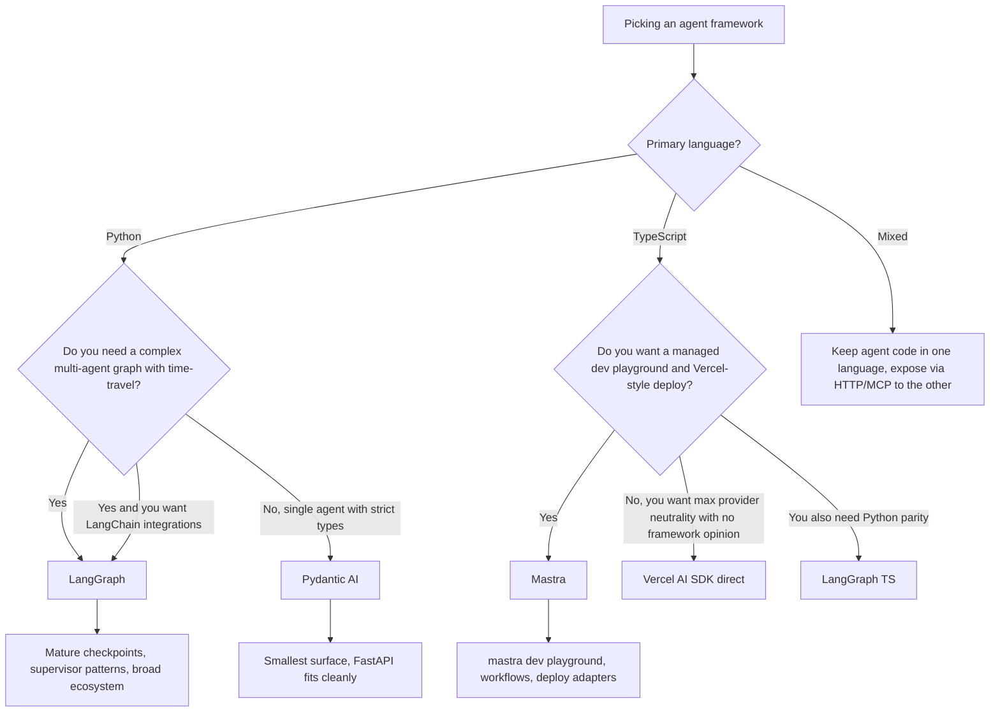

# Pydantic AI and Mastra: Typed Agent Frameworks (2026)

The agent framework debate has stopped being "LangGraph or LlamaIndex." Two newer entrants now own meaningful production share for teams that prioritize type safety over breadth: **Pydantic AI** in the Python world (about 5.3M PyPI downloads in the month to Oct 1, 2026) and **Mastra** in the TypeScript world (about 6.9M npm downloads of `@mastra/core` from Aug 31 to Sep 29, 2026). Both reject the "string in, string out" surface that older frameworks accepted, and both bet that a fully typed agent is easier to test, evaluate, and operate than a clever-but-untyped one.

## Table of Contents

- [What These Frameworks Are](#what-these-frameworks-are)
- [Pydantic AI: Typed Agents in Python](#pydantic-ai-typed-agents-in-python)
- [Mastra: TypeScript-First Agents](#mastra-typescript-first-agents)
- [Comparison with LangGraph](#comparison-with-langgraph)
- [Choosing a Framework](#choosing-a-framework)
- [Production References](#production-references)
- [Interview Questions](#interview-questions)
- [References](#references)

---

## What These Frameworks Are

Both Pydantic AI and Mastra grew out of frustration with framework lock-in and untyped prompt-stitching. They focus on the same set of ideas:

- The agent loop is **defined by code**, not by a YAML / JSON graph.
- Tool calls, structured outputs, and human-in-the-loop checkpoints are all **typed at the function signature**.
- Provider portability is a hard requirement: swap Anthropic for OpenAI for Google by changing one line.
- Evals, tracing, and deployment are first-class, not bolted on.

The differences are mostly stack-shaped: one targets Python services that already use Pydantic for HTTP validation; the other targets Next.js / Node teams that want a Vercel-style developer experience.

---

## Pydantic AI: Typed Agents in Python

### Current State

[Pydantic AI](https://ai.pydantic.dev/) shipped v1.0 in September 2025 and **v2.0.0 stable on June 23, 2026** after seven betas (the v2 beta forked from v1.100.0); it reached **2.52.0 on Sep 30, 2026**, while 1.x patch releases continue (1.107.7 the same day) ([PyPI release history](https://pypi.org/project/pydantic-ai/#history)). The library is built by the team behind Pydantic itself, which also runs [Pydantic Logfire](https://pydantic.dev/logfire). It is open source under MIT.

V2 is **harness-first**: a *capability* is a composable unit that bundles tools, lifecycle hooks, instructions and model settings, and a first-party Pydantic AI Harness library supplies more of them, including `StepPersistence` for save and resume. Breaking and behavior changes to check when upgrading from 1.x:

- `openai:` model strings now use the **Responses API**; use `openai-chat:` to stay on Chat Completions.
- `end_strategy` defaults to `'graceful'`, and a bare install ships fewer provider extras.
- `builtin_tools` is renamed `native_tools`, and the `grok:` prefix becomes `xai:`.
- The Outlines integration and the FastMCP back-compat shim are removed, the `vertexai` extra is gone (Vertex AI comes through the `google` extra), and A2A support moved upstream to the `fasta2a` package.
- Default instrumentation is v5, with `gen_ai.aggregated_usage` attributes, so dashboards built on older attribute names need updating.

Key surface area:

- `Agent` class parameterized by an output type and a list of typed tools.
- Provider adapters for Anthropic, OpenAI, Google, xAI, Mistral, Groq, Cohere, Ollama, and any OpenAI-compatible endpoint.
- Native OpenTelemetry tracing, exported either to Logfire or any OTLP collector.
- `pydantic_evals` for declarative eval suites with LLM-judge and code-graded scorers.
- A `Graph` API for explicit state machines when the simple `Agent` loop is not enough.

### Why Teams Pick It

```python
from dataclasses import dataclass
from pydantic import BaseModel, Field
from pydantic_ai import Agent, RunContext

class RefundDecision(BaseModel):
    approved: bool
    amount_cents: int = Field(ge=0)
    reason: str

@dataclass
class Deps:
    orders: OrdersRepo  # your data-access layer

agent = Agent(
    "anthropic:claude-sonnet-5-5",
    deps_type=Deps,
    output_type=RefundDecision,
    instructions="You are a refund analyst. Approve only if policy allows.",
)

@agent.tool
async def lookup_order(ctx: RunContext[Deps], order_id: str) -> dict:
    """Look up an order by id."""
    return await ctx.deps.orders.get(order_id)

result = await agent.run("Refund order 1234", deps=Deps(orders=db))
assert isinstance(result.output, RefundDecision)
```

Three properties make this attractive in production:

1. **The return type is enforced.** `result.output` is a `RefundDecision` or the call fails. There is no silent string drift.
2. **Tools are functions, not dicts.** A schema is generated from the Python signature and docstring at registration time, so you cannot accidentally drift the LLM-facing schema from the implementation.
3. **Dependency injection is explicit.** `ctx.deps` is a typed container, which makes the agent trivial to unit-test with mocks.

The [Pydantic AI evals docs](https://ai.pydantic.dev/evals/) describe a typical loop where the same Pydantic model used for the production schema is used for both the LLM output type and the eval scorer's `expected_output`.

**Structured output on the newest models**: Claude Fable 5.1, Opus 5.5 and Sonnet 5.5 reject forced tool choice, and GPT-6 Astra needs the Responses API for tools. Any framework output mode built on a forced tool call has to adapt, so after a model upgrade, check which output mode your version uses. Pydantic AI's `NativeOutput` marker requests the provider's native JSON-schema output instead of a tool call.

### When Pydantic AI Is the Right Choice

- The service is **Python** and already uses Pydantic for HTTP validation (FastAPI is the canonical case).
- You want **strict schemas** end to end: HTTP boundary, LLM tool call, LLM output, database row.
- You want **provider portability** without writing your own adapter layer.
- You are happy to write the agent loop as imperative Python rather than as a graph definition.

### When It Is Not

- You want a **declarative graph** for multi-agent coordination with supervisor patterns. The `Graph` API exists but is more bare-bones than LangGraph. (For a long-running single agent, v2's `StepPersistence` narrows the gap.)
- You want **time-travel debugging** with branch-from-any-node semantics.
- You need the breadth of the LangChain integration ecosystem (vector stores, document loaders, etc).

---

## Mastra: TypeScript-First Agents

### Current State

[Mastra](https://mastra.ai/) was founded by the team behind Gatsby (graduated YC W25), announced a **$13M seed** led by Lightspeed in October 2025 ([TechCrunch coverage](https://techcrunch.com/2025/10/16/mastra-typescript-agent-framework-seed/)), and **shipped v1.0 on January 20, 2026**. `@mastra/core` reached **1.74.0 on Oct 1, 2026**, with about **28.5K GitHub stars** and about **6.9M npm downloads** from Aug 31 to Sep 29, 2026 ([mastra-ai/mastra](https://github.com/mastra-ai/mastra)).

**License**: Mastra moved from Elastic License v2 to **Apache 2.0** on July 9, 2025. Everything outside `ee/` directories is Apache 2.0; code in `ee/` directories is under the source-available Mastra Enterprise Edition License. Check which packages you import before embedding Mastra in a commercial product.

Key surface area:

- `Agent`, `Workflow`, and `Tool` primitives, all defined as TypeScript with full inference.
- A built-in **local dev server** (`mastra dev`) with a playground UI, eval runner, and trace viewer.
- Tight integration with the **AI SDK** from Vercel for streaming, multi-step tool calls, and provider switching.
- Out-of-the-box memory and RAG with `libsql` / `pgvector` adapters.
- One-command deploy to **Mastra Cloud**, Vercel, Cloudflare Workers, or a Node server.

### Why Teams Pick It

```typescript
import { Agent } from "@mastra/core/agent";
import { createTool } from "@mastra/core/tools";
import { anthropic } from "@ai-sdk/anthropic";
import { z } from "zod";

const lookupOrder = createTool({
  id: "lookup-order",
  description: "Look up an order by id",
  inputSchema: z.object({ orderId: z.string() }),
  outputSchema: z.object({ status: z.string(), totalCents: z.number() }),
  execute: async ({ orderId }) => ordersDb.get(orderId),
});

export const refundAgent = new Agent({
  name: "refund-agent",
  model: anthropic("claude-sonnet-5-5"),
  instructions: "You are a refund analyst. Approve only if policy allows.",
  tools: { lookupOrder },
});
```

Three properties make this attractive:

1. **Inferred types end to end.** The Zod schemas drive the tool's runtime validation, the LLM-facing JSON Schema, and the TypeScript type of the input that `execute` receives. One source of truth. (Mastra 1.x passes the validated input as the first argument; 0.x tutorials destructure `{ context }` instead, a common copy-paste break.)
2. **`mastra dev` is the killer feature.** It boots a local UI that lets you call any agent, replay any trace, run any eval, and inspect any tool input/output without writing a frontend.
3. **First-class workflows.** `createWorkflow` defines a typed graph of steps (each a Mastra tool or agent), with branching, suspend / resume, and human-in-the-loop, all type-checked.

The [Generative.inc Mastra guide](https://generative.inc/blog/mastra-typescript-agent-framework) walks through how teams replace Python orchestration with Mastra entirely when the rest of the stack is already TypeScript.

### When Mastra Is the Right Choice

- The team is **TypeScript-first** and the rest of the app is Next.js / Node / Bun / Cloudflare Workers.
- You want **Vercel-style DX**: a single CLI, a local playground, opinionated deployment.
- Streaming UI matters and you want to lean on the AI SDK's `useChat` and `streamText` primitives.
- You want **suspend / resume workflows** with human approval steps wired in by default.

### When It Is Not

- You need a **large library of prebuilt agents** or community integrations. The ecosystem is small compared to LangChain.
- Your team and most of your AI tooling is **Python**. Bridging TS to Python services across an HTTP layer is fine but adds latency.
- You need **academic-style** custom inference behavior (custom decoding, etc). Stay in Python.

---

## Comparison with LangGraph

| Dimension | Pydantic AI 2.x | Mastra 1.x | LangGraph 1.x |
|-----------|-------------------|---------------------|----------------|
| Language | Python | TypeScript | Python and TypeScript |
| License | MIT | Apache 2.0 (`ee/` directories source-available) | MIT |
| Primary unit | Typed `Agent` with `output_type`, composed from capabilities | Typed `Agent` and `Workflow` | Graph of nodes over typed state |
| Schema source | Pydantic v2 | Zod | JSON Schema (Pydantic, Zod, Valibot, ArkType) |
| Provider neutrality | Built-in adapters | Through Vercel AI SDK | Through LangChain partner packages |
| Multi-agent | Manual or `Graph` API | `Workflow` + agent-as-tool | `create_supervisor`, swarm, custom graphs |
| State persistence | `pydantic_graph` checkpoints; Harness `StepPersistence` (v2) | Workflow snapshot + storage adapters | First-class checkpoint stores (Postgres, Redis, SQLite, in-memory) |
| Time-travel debugging | No | Replay in local playground | Yes, branch from any checkpoint |
| Eval framework | `pydantic_evals` | Mastra evals (built-in) | LangSmith or external |
| Tracing | OTLP / Logfire | OTLP / Mastra Cloud | LangSmith or OTLP |
| Coupling | None to LangChain | None to LangChain | Tight to LangChain ecosystem |
| Ecosystem size | Small but growing | Small but growing | Large (LangChain integrations) |



---

## Choosing a Framework

Three decision drivers, in order of weight:

1. **Language of the existing service.** Pydantic AI and LangGraph (Python) for Python services. Mastra and LangGraph TS for TypeScript services. Crossing the boundary is almost always a worse trade than picking the right side.
2. **Shape of the complexity.** If the agent is essentially "LLM + a few tools + strict output type," Pydantic AI or Mastra is enough and cheaper to operate. If you have many cooperating agents with branching, retries, and approvals, LangGraph's graph + checkpoint model pulls ahead.
3. **Ecosystem coupling.** LangGraph buys you LangChain integrations, LangSmith eval, and the rest of that surface. Pydantic AI and Mastra buy you cleaner type guarantees and faster cold paths but you wire your own integrations.

A useful heuristic: if the longest thing on the page is the tool list, pick Pydantic AI or Mastra. If the longest thing on the page is the state machine, pick LangGraph.

---

## Production References

Adoption signals as of early October 2026, plus public case studies:

- **Pydantic AI**
  - About 5.3M PyPI downloads in the month to Oct 1, 2026, roughly on par with DSPy and about twice CrewAI's count (download counts are inflated by CI and transitive installs; read them as relative signals).
  - The common adoption path is FastAPI shops, because the same Pydantic model serves the HTTP boundary and the LLM output type.
- **Mastra**
  - About 6.9M npm downloads of `@mastra/core` from Aug 31 to Sep 29, 2026, close to `@openai/agents` (7.3M) and well behind the Vercel AI SDK itself (`ai`, 104.6M), which Mastra builds on.
- **LangGraph** (for reference)
  - [LinkedIn's SQL Bot](https://www.linkedin.com/blog/engineering/ai/practical-text-to-sql-for-data-analytics), [Uber's coding assistants](https://www.uber.com/en-IN/blog/genie-uber-genai-on-call-copilot/), [Klarna](https://www.klarna.com/), [Elastic](https://www.elastic.co/) AI Assistant, [Replit](https://replit.com/), and dozens more on the [LangChain customer page](https://www.langchain.com/built-with-langgraph).

---

## Interview Questions

### Q: When would you choose Pydantic AI over LangGraph for a Python service?

**Strong answer:**
I would choose Pydantic AI when the agent is essentially one LLM with a typed output and a few tools, and the rest of the service is already Pydantic-shaped (FastAPI, SQLModel, etc.). The win is that the same Pydantic model defines the HTTP response, the LLM output, and the eval scorer's expected shape, so there is no schema drift. LangGraph is worth the heavier surface when I need a real multi-agent graph with checkpoint-based time travel, supervisor patterns, or the LangChain integration ecosystem. The deciding question I ask is whether the most complicated part of the design is the tool list or the state machine. Tool list, Pydantic AI. State machine, LangGraph.

### Q: Is Mastra a Vercel AI SDK replacement?

**Strong answer:**
No, though the overlap has grown. Mastra builds on top of the Vercel AI SDK for the actual provider calls and streaming. The AI SDK itself now has agents: AI SDK 6 added `ToolLoopAgent` and tool approvals, and AI SDK 7 (Jun 25, 2026) added a durable `WorkflowAgent` that survives restarts, deploys and delayed approvals, plus an experimental `HarnessAgent` that runs Claude Code or Codex behind one API. What Mastra still adds is **memory**, **RAG**, **evals**, typed **workflows** with suspend / resume, and the **`mastra dev` playground**. If you need a durable tool loop in a Next.js app, the AI SDK alone is now enough. If you want those batteries and a local playground without writing them yourself, Mastra is the layer that adds them.

### Q: Pydantic AI 2.0 changed what the `openai:` model prefix means. Why should a staff engineer care about a one-line default like that?

**Strong answer:**
Because nothing in my code changed and the wire protocol did. In v2, `openai:gpt-6.1-sol` goes through the Responses API instead of Chat Completions (`openai-chat:` keeps the old path). That can change tool-call formatting, how reasoning items and caching behave, which parameters are accepted, and what my traces record, and v2 also moved default instrumentation to new `gen_ai` attributes, so dashboards can silently go blank. It is the same class of break as an SDK changing its default model. The defense is the same too: pin the framework version, run the eval suite and a trace-shape check on every upgrade, and set behavior-defining options explicitly instead of inheriting defaults.

### Q: What does "typed agent framework" actually buy you in production?

**Strong answer:**
Three things. First, **fewer bad inputs leak through**. The LLM-facing schema is derived from the same Pydantic / Zod definition that validates the runtime payload, so if the LLM hallucinates a field, the parse step rejects it before any downstream code runs. Second, **clean unit tests**. A typed tool is just a function with a Pydantic / Zod boundary, so I can test it without any LLM in the loop. Third, **schema-aware evals**. The eval framework can compare two typed objects field by field rather than diffing strings, which catches subtle regressions like a field becoming optional or an enum gaining a new value.

---

## References

- Pydantic AI v2.0.0 release notes (Jun 23, 2026): https://github.com/pydantic/pydantic-ai/releases/tag/v2.0.0
- Pydantic AI documentation: https://ai.pydantic.dev/
- Pydantic AI evals: https://ai.pydantic.dev/evals/
- Mastra repository: https://github.com/mastra-ai/mastra
- Mastra blog, license change from ELv2 to Apache 2.0 (Jul 2025): https://mastra.ai/blog/apache-license
- Mastra documentation: https://mastra.ai/
- TechCrunch, "Mastra raises $13M seed for TypeScript agent framework" (October 2025): https://techcrunch.com/2025/10/16/mastra-typescript-agent-framework-seed/
- Generative.inc Mastra guide: https://generative.inc/blog/mastra-typescript-agent-framework
- LangGraph 1.x docs: https://docs.langchain.com/oss/python/langgraph/
- LangChain "Built with LangGraph" customer list: https://www.langchain.com/built-with-langgraph
- Vercel AI SDK: https://ai-sdk.dev/
- Vercel. "AI SDK 7" (Jun 2026): https://vercel.com/blog/ai-sdk-7
- AIMultiple "Agentic AI frameworks compared" (2026): https://research.aimultiple.com/agentic-ai-frameworks/

---

*Next: See the [Framework Selection Guide](08-framework-selection-guide.md) for cross-framework selection criteria.*
