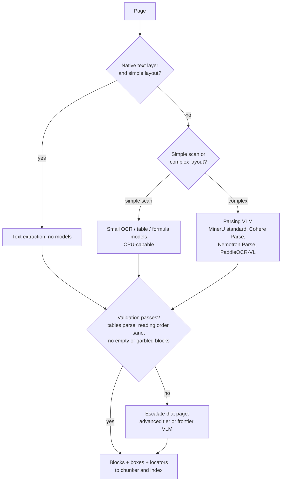

# OCR and Layout Analysis

Document parsing is no longer a two-way choice between classic OCR engines and frontier multimodal LLMs. A middle tier of **specialist document-parsing VLMs** (small vision-language models trained to turn pages into structure) now returns Markdown, tables, bounding boxes and reading order at a fraction of frontier cost per page. The design question has moved from "which model reads best?" to "which tier does each page need, and what does a page cost at my volume?"

## Table of Contents

- [The Three Tiers: OCR Engines, Parsing VLMs, Frontier VLMs](#the-three-tiers-ocr-engines-parsing-vlms-frontier-vlms)
- [Vision-LLM Layout Extraction](#vision-llm-layout-extraction)
- [Tiered Parsing and Block-Level Locators](#tiered-parsing-and-block-level-locators)
- [Reading Order and Logical Structure](#reading-order-and-logical-structure)
- [Handling Low-Quality Scans and Handwriting](#handling-low-quality-scans-and-handwriting)
- [Cost and Latency Tradeoffs](#cost-and-latency-tradeoffs)
- [Interview Questions](#interview-questions)
- [References](#references)

---

## The Three Tiers: OCR Engines, Parsing VLMs, Frontier VLMs

| Feature | Classic OCR engines (Tesseract, AWS Textract, Azure AI Document Intelligence, Google Document AI) | Document-parsing VLMs (Cohere Parse, MinerU, PaddleOCR-VL, Nemotron Parse 2.0, DeepSeek-OCR 2) | Frontier VLMs (Claude Opus 5.5 / Sonnet 5.5, GPT-6 Sol, Gemini 3.8 Flash) |
|---------|-------------------------------------------|----------------------------------------|--------------------------------------------------------|
| **Primary mechanism** | Character recognition plus layout rules or models | Small VLM trained to transcribe pages into structure | General visual-token understanding |
| **Reading order** | Simple; breaks on complex layouts | Predicted explicitly | Implicit; usually right, not auditable |
| **Geometry** | Per-word boxes with confidence | Per-block boxes (text, table, figure) with reading order | Not a per-word audit layer |
| **Tables** | Separate table APIs; weak on merged cells | Inline HTML or Markdown | Markdown or HTML on request |
| **Failure mode** | Misreads characters; does not invent text | Can hallucinate on degraded pages | Can produce fluent, plausible, wrong text |
| **Cost driver** | CPU or per-page API fee | Pages per second per GPU, or ~$1.50 per 1,000 pages via API | Tokens: roughly $4 (Gemini 3.8 Flash, intro) to $23 (Claude Opus 5.5) per 1,000 pages at October 2026 list prices |

**How big is the quality gap?** On ParseBench, a document-parsing benchmark that Cohere ran for its own launch (vendor-run, August 2026), the averages were: GPT-5.5 84.4, Claude Opus 4.8 84.3, Gemini 3.5 Flash 81.8, Cohere Parse 79.2, LlamaParse (cost-effective mode) 78.3, Google Document AI 57.3, AWS Textract 53.3. Read that as: the top frontier models lead Cohere Parse by about five points, and classic OCR services trail both by twenty-plus. That last gap most likely reflects what a parsing benchmark rewards (tables, reading order, structured output) more than raw character accuracy, so do not read it as "Textract cannot read".

**Parsing VLMs moved fast in 2026.** Most are open weights; Cohere Parse is API or single-tenant only. Scores below come from different benchmarks and different runners, so do not compare them across rows:

| Model | Released | Notes |
|-------|----------|-------|
| DeepSeek-OCR 2 | January 27, 2026 | Apache 2.0 |
| PaddleOCR-VL | 1.5 on January 29, 2026 | Jina's comparison puts version 1.6 at 96.34 on OmniDocBench v1.6; Apache 2.0 |
| Chandra OCR 2 | March 18, 2026 | 85.8 on olmOCR-Bench; code Apache 2.0, but weights under Datalab's modified OpenRAIL-M: free for research, personal use and startups under $2M funding or revenue, not for use that competes with Datalab's API; otherwise a paid license |
| Surya OCR 2 | May 27, 2026 | Code Apache 2.0; weights under a modified OpenRAIL-M: free for research, personal use and startups under $5M funding or revenue; otherwise a paid license |
| NVIDIA Nemotron Parse 2.0 | August 3, 2026 | Under 1B parameters; layout classes, bounding boxes, reading order, chart-to-table; OpenMDW-1.1 |
| Cohere Parse (`parse-v5.0`) | August 27, 2026 | Closed weights; 2.3B-parameter VLM, API at $1.50 per 1,000 pages; Markdown with HTML tables, or ordered blocks with bounding boxes |
| jina-ocr-v1 | September 14, 2026 | Built on DeepSeek-OCR (3.4B total, ~570M active MoE); 91.14 on OmniDocBench v1.6, 83.4 on olmOCR-Bench; **CC BY-NC 4.0, so not for commercial use without a license** |
| MinerU 4.0 | September 16, 2026 | Toolkit with quality tiers and an agent-oriented CLI (see below); MinerU Open Source License (Apache 2.0 plus terms): commercial use allowed, a separate license above 100M monthly active users or $20M monthly revenue, and online services must credit MinerU |

Check the license before the benchmark. A parser you cannot ship is not a candidate, and "open weights" covers everything from Apache 2.0 to non-commercial to revenue-capped terms that a growing company can outgrow.

---

## Vision-LLM Layout Extraction

The baseline workflow is still **Screenshot-to-Markdown**:
1. **Rasterize**: Convert PDF pages to images (pages with a usable native text layer may not need this at all).
2. **Visual Prompting**: Ask the model to "Transcribe the following page into GitHub-flavored Markdown, preserving tables and headers."
3. **Structured Recovery**: Use the model's spatial awareness to rebuild the logical hierarchy.

For RAG, ask for **blocks, not just Markdown**. A list of typed blocks (heading, paragraph, table, figure, caption) with page number, bounding box and reading-order index lets you chunk on real boundaries, keep tables atomic, and cite a region of a page instead of a whole document. Parsing VLMs return this natively (Cohere Parse's `blocks` output, Nemotron Parse 2.0's layout classes and boxes); with a frontier VLM you have to request it with structured outputs and validate it.

---

## Tiered Parsing and Block-Level Locators

Most pages in a real corpus are easy. Paying frontier-VLM prices for a born-digital PDF with a clean text layer is waste, so route each page to the cheapest tier that passes validation.

MinerU 4.0 (September 16, 2026) builds this into the tool. It replaces backend selection with four quality tiers: **flash** (no models; native PDF text and digital documents), **basic** (small OCR, formula and table models; runs on CPU), **standard** (small models plus a VLM; the default) and **advanced** (more inference for hard documents). It also parses DOCX, PPTX, XLSX, EPUB, OFD, HTML and CSV natively without converting to PDF.

**Locators make citations verifiable.** MinerU 4.0's `mineru` CLI (parse, read, find, search, watch) returns stable locators such as `doc:{id}/tier:{tier}/page:{page}/block:{block}` and reads long documents progressively (the first 10 pages plus a continuation request), so an agent can cite a block and a reviewer can open exactly that region. Parsing is local unless `--remote` is passed. Docling followed the same direction with pluggable VLM backends: NVIDIA Nemotron Parse 2.0 in v2.128.0 (September 16) and MinerU 2.5 Pro in v2.130.0 (September 22).

Store the parser name, version and tier on every block. Docling changed its reading-order algorithm in v2.132.0 (October 1, 2026); a parser upgrade can reorder text and move chunk boundaries, which silently changes retrieval. Re-parse a sample and diff before upgrading in production.

---

## Reading Order and Logical Structure

> [!IMPORTANT]
> A common failure in naive RAG is breaking a paragraph across a column.
> Vision models avoid this by "seeing" the column gutter and sequencing the text correctly, unlike rule-based parsers that might read straight across both columns.

Parsing VLMs predict reading order as an explicit output, which you can check (for example, flag pages where the predicted order jumps between columns more than once). Frontier VLMs usually get it right but give you nothing to audit, so for multi-column legal and scientific documents prefer a parser that emits an order index.

---

## Handling Low-Quality Scans and Handwriting

Modern vision models are far more robust than character-level OCR to:
- **Skew and rotation**: usually handled without a deskew pass, though a cheap deskew still helps small parsing models.
- **Bleed-through**: semantic context helps the model ignore text from the back of the page.
- **Handwritten annotations**: can be extracted into a separate `annotations` field.

Robust is not the same as reliable. On degraded pages the dangerous failure is a fluent, plausible transcription of text that is not there. For high-stakes fields (amounts, dates, IDs), run a classic OCR pass as a cross-check and flag tokens the VLM produced that OCR cannot find on the page, and route low-confidence handwriting to human review rather than trusting any single model.

---

## Cost and Latency Tradeoffs

Frontier rows assume about 1.7K input tokens (page image plus prompt) and 800 output tokens per page at October 1, 2026 list prices, before reasoning tokens; Batch APIs halve them.

| Option | Use Case | Throughput | Cost (1K pages) |
|--------|----------|------------|-----------------|
| **Self-hosted parsing VLM** (MinerU, PaddleOCR-VL, Nemotron Parse 2.0, DeepSeek-OCR 2) | PII-sensitive, on-prem, high volume | Varies by model; for scale, jina-ocr-v1 reports 2.57 pages/s on one A100 at concurrency 32 (vendor-reported) | GPU $/hr ÷ (pages/s x 3.6); about $0.22 at $2/GPU-hr and 2.5 pages/s, at full utilization |
| **Cohere Parse API** | Managed specialist parser | 4.5 pages/s per GPU; 36 pages/s per 8xH100 node (vendor-reported) | $1.50 |
| **Gemini 3.8 Flash** | High-volume frontier fallback | 1-2 s / page | ~$4 at the intro price; ~$9 from January 1, 2027 |
| **Claude Sonnet 5.5 / GPT-6 Sol** | Hard pages, legal precision | 3-5 s / page | ~$11 |
| **Claude Opus 5.5** | Hardest pages only | 3-5 s / page | ~$23 |

Cohere also sells single-tenant deployment (Model Vault) and says it cuts inference cost 23% versus the API at 50% GPU utilization and up to 61% at full utilization (vendor-reported). The utilization caveat applies to every self-hosted row: a GPU pool sized for peak ingestion and idle the rest of the day costs several times the full-utilization number.

---

## Interview Questions

### Q: Why would you still use AWS Textract or Azure AI Document Intelligence when vision LLMs exist?

**Strong answer:**
Three reasons survive, and one does not.

1. **Word-level geometry with confidence scores.** Redaction tools, form-field mapping and human review UIs need a box and a confidence for every word. Parsing VLMs now give block-level boxes and reading order, so the "only OCR gives you boxes" argument has narrowed to word-level work.
2. **Failure mode.** OCR misreads characters, but it does not invent fluent text. For compliance workloads I use OCR output as a check on the VLM: any VLM token that OCR cannot find on the page gets flagged.
3. **Procurement and compliance.** A managed, certified service inside the existing cloud contract is sometimes the only thing a regulated buyer can approve quickly.

What no longer holds is "OCR services are better at structure". On Cohere's vendor-run ParseBench, Textract averaged 53.3 and Google Document AI 57.3, against roughly 78 to 84 for specialist parsers and frontier models. So the pattern is hybrid: OCR for words and geometry, a VLM for structure, and a cross-check between them.

### Q: How do you handle a 500-page PDF with vision models efficiently?

**Strong answer:**
I use a **routed, parallel map-reduce** pattern.
1. **Route**: Pages with a clean native text layer skip the vision model entirely; the rest go to a parsing VLM, and only pages that fail validation escalate to a frontier model.
2. **Map**: Spin up parallel workers (AWS Lambda, Modal, or a GPU pool) to process 10 pages each. With 50 workers at 1-2 seconds per page, each worker finishes in 10-20 seconds, so wall-clock time drops from 8-17 minutes sequential to well under a minute, as long as the provider's rate limits allow 50 concurrent requests.
3. **Consolidate**: A final pass stitches blocks across page boundaries, repairs tables split over two pages, and checks header continuity.
4. **Index**: Store blocks with page, box and locator metadata so every chunk can cite its source region.

### Q: You need to parse 5M pages a month for RAG ingestion. Frontier VLM, specialist API, or self-hosted?

**Strong answer:**
I would price all three, then route instead of picking one.

- **Frontier VLM for everything**: about $57K a month on Claude Sonnet 5.5 or GPT-6 Sol at list price (roughly half with a Batch API), or about $21K on Gemini 3.8 Flash at its intro price, doubling to about $43K when the intro price ends on January 1, 2027.
- **Specialist API**: 5M pages at Cohere Parse's $1.50 per 1,000 is $7,500 a month.
- **Self-hosted parsing VLM**: at 2.5 pages per second per GPU, 5M pages is about 556 GPU-hours, roughly $1,500 a month at the $2.77 per H100-hour Silicon Data index (October 1, 2026), assuming full utilization. Real cost is higher once the pool is sized for peak and someone owns it, and the license must allow commercial use (jina-ocr-v1's CC BY-NC 4.0 does not).

The design: self-host or use the specialist API for the bulk, validate every page, and escalate the few percent that fail (charts, handwriting, dense tables) to a frontier model. At 5% escalation that is about 250K frontier pages, under $3K a month. Before committing, I would run 500 of our own pages through each option, because the frontier-versus-specialist comparison cited above (ParseBench) is vendor-run and shows a five-point frontier advantage that may or may not show up on our documents.

---

## References
- Cohere. "Introducing Cohere Parse" and changelog (August 2026)
- Jina AI. "jina-ocr-v1: Faster Document Parsing on Low-Budget GPUs" and model card (September 2026)
- OpenDataLab. MinerU 4.0 release notes (September 2026)
- NVIDIA. Nemotron Parse 2.0 model card (August 2026)
- Docling. Release notes, v2.128.0 to v2.132.0 (September to October 2026)
- OpenDataLab. OmniDocBench (v1.6)
- Allen Institute for AI. olmOCR-Bench

---

*Related: [Multi-Modal RAG](../06-retrieval-systems/12-multimodal-rag.md) | [Case Study: Document Intelligence](../16-case-studies/10-document-intelligence.md)*
