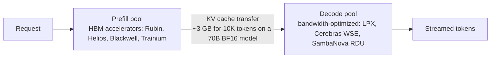
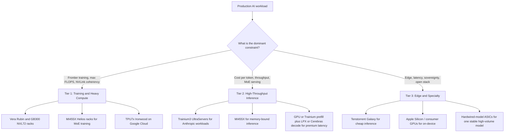

# LLM Infrastructure

Building production LLM systems requires understanding deployment options, scaling patterns, and operational concerns. This chapter covers the infrastructure layer.

## Table of Contents

- [Deployment Options](#deployment-options)
- [Serving Architecture](#serving-architecture)
- [Scaling Patterns](#scaling-patterns)
- [Cost Management](#cost-management)
- [Monitoring and Alerting](#monitoring-and-alerting)
- [Disaster Recovery](#disaster-recovery)
- [AI Accelerator Landscape](#ai-accelerator-landscape)
- [Interview Questions](#interview-questions)
- [References](#references)

---

## Deployment Options

### API vs Self-Hosted

| Factor | API Providers | Self-Hosted |
|--------|---------------|-------------|
| Setup time | Minutes | Days to weeks |
| Operational burden | None | Significant |
| Cost at low volume | Lower | Higher (fixed costs) |
| Cost at high volume | Higher | Lower (scale economics) |
| Latency control | Limited | Full control |
| Data privacy | Data leaves your infra | Data stays local |
| Model selection | Provider's models | Any open model |
| Customization | Fine-tuning via API | Full control |

### When to Use API Providers

```python
# Decision framework
def should_use_api(requirements: dict) -> bool:
    # Strong signals for API
    if requirements["time_to_market"] == "urgent":
        return True
    if requirements["query_volume"] < 100_000_per_month:
        return True
    if requirements["team_ml_expertise"] == "low":
        return True
    
    # Strong signals for self-hosted
    if requirements["data_residency"] == "strict":
        return False
    if requirements["latency_p99_ms"] < 100:
        return False
    if requirements["query_volume"] > 10_000_000_per_month:
        return False
    
    # Default to API for simplicity
    return True
```

### Self-Hosting Options

| Option | Complexity | Performance | Use Case |
|--------|------------|-------------|----------|
| vLLM | Medium | Excellent | Default open-source production engine |
| SGLang | Medium | Excellent | Prefix-heavy and agentic traffic (radix cache), structured output |
| TensorRT-LLM | Medium-High | Best (NVIDIA) | Peak NVIDIA throughput; the PyTorch backend has been the default since 1.0, so no per-model engine build |
| NVIDIA Dynamo / llm-d | High | Fleet-level | Orchestration above the engines: KV-aware routing, disaggregated prefill and decode |
| TGI (Hugging Face) | Medium | Very good | In maintenance mode; Hugging Face now recommends vLLM or SGLang for new deployments |
| Ollama | Low | Good | Development, small scale |
| llama.cpp | Low | Good | CPU inference, edge |

**Pin and patch the engine.** Serving engines are now a CVE-dense dependency. vLLM published 20+ advisories between August 11 and September 28, 2026, including a model-load RCE that ran a malicious repo's processor code even with `trust_remote_code=False` (CVE-2026-90553) and a single unauthenticated request that kills the engine for every tenant (CVE-2026-93592), both fixed in 0.28.0. Baseline on vLLM 0.30.0 or later. SGLang's critical advisories CVE-2026-7301, 7302 and 7304 list affected versions up to 0.5.12 with no patched version recorded, so pin 0.5.13 or later, verify against the advisories, and keep its ZMQ sockets inside the pod. Version and feature detail lives in [Serving Infrastructure](../04-inference-optimization/06-serving-infrastructure.md); the security view is in [LLM Security](../12-security-and-access/01-llm-security.md#securing-the-ai-stack-itself).

**Mirror the weights you serve.** Most open-weight pipelines pull checkpoints from Hugging Face, which NVIDIA confirmed on September 3, 2026 it is acquiring for $12.93B (no closing date disclosed). Regardless of how that deal closes, serving from a mirrored, reviewed internal registry removes a supply-chain and availability dependency and is the control that blunts malicious-repo attacks like CVE-2026-90553.

---

## Serving Architecture

### Single Model Serving

```
┌─────────────┐     ┌─────────────┐     ┌─────────────┐
│   Client    │────▶│   Gateway   │────▶│  LLM Server │
└─────────────┘     └─────────────┘     └─────────────┘
                           │
                           ▼
                    ┌─────────────┐
                    │    Cache    │
                    └─────────────┘
```

### Multi-Model Serving

```
                    ┌────────────────────────────────┐
                    │         Load Balancer          │
                    └───────────────┬────────────────┘
                                    │
            ┌───────────────────────┼───────────────────────┐
            │                       │                       │
            ▼                       ▼                       ▼
    ┌───────────────┐       ┌───────────────┐       ┌───────────────┐
    │  OpenAI Pool  │       │  Claude Pool  │       │  Open-weight  │
    │  (API calls)  │       │  (API calls)  │       │ (self-hosted) │
    └───────────────┘       └───────────────┘       └───────────────┘
```

### Model Router Pattern

```python
class ModelRouter:
    def __init__(self):
        self.models = {
            "simple": GPT6Luna(),
            "complex": ClaudeOpus55(),
            "code": ClaudeSonnet55(),
            "long_context": Gemini38Flash(),
            "vision": GPT6Sol()
        }
        self.classifier = QueryClassifier()
    
    async def route(self, request: Request) -> Response:
        # Classify request type
        request_type = self.classifier.classify(request)
        
        # Route to appropriate model
        model = self.models[request_type]
        
        # Execute with fallback
        try:
            return await model.generate(request)
        except RateLimitError:
            return await self.fallback(request, request_type)
    
    async def fallback(self, request: Request, original_type: str) -> Response:
        # Define fallback order
        fallbacks = {
            "simple": ["complex", "long_context"],
            "complex": ["simple"],
            "code": ["complex"]
        }
        
        for fallback_type in fallbacks.get(original_type, []):
            try:
                return await self.models[fallback_type].generate(request)
            except Exception:
                continue
        
        raise ServiceUnavailableError("All models unavailable")
```

---

## Scaling Patterns

### Horizontal Scaling

```python
# Kubernetes HPA config for LLM service
hpa_config = """
apiVersion: autoscaling/v2
kind: HorizontalPodAutoscaler
metadata:
  name: llm-service-hpa
spec:
  scaleTargetRef:
    apiVersion: apps/v1
    kind: Deployment
    name: llm-service
  minReplicas: 2
  maxReplicas: 20
  metrics:
  - type: Resource
    resource:
      name: cpu
      target:
        type: Utilization
        averageUtilization: 70
  - type: Pods
    pods:
      metric:
        name: requests_per_second
      target:
        type: AverageValue
        averageValue: 100
"""
```

CPU utilization is a fine signal for a stateless API proxy and a poor one for GPU serving pods, where CPU sits idle while the GPU saturates. Scale GPU pods on queue depth, KV-cache utilization, or TTFT against the SLO, and let the engine shed load instead of queuing without bound: vLLM 0.29 added `--max-num-queued-reqs` and `--max-num-queued-tokens` admission control for exactly this.

**Cold start limits how fast you can scale.** A GPU pod that spends minutes loading weights cannot absorb a spike, however good the scaling signal. Engines now attack load time directly: vLLM 0.30 added Fast Start (`--load-format ipc_cache`), a per-GPU daemon that keeps post-quantized, tensor-parallel-sharded weights resident and maps them into a restarted engine over CUDA IPC. Managed agent runtimes use snapshots: AWS's AgentCore Runtime V2 (announced September 18, 2026) restores each instance from a snapshot of an initialized agent, with P75 cold starts of about 2 s against roughly 5.4 s to 30 s on the original runtime (vendor-reported), billed at a higher rate on far fewer GB-hours. Measure time-to-ready, not time-to-schedule, and keep enough warm capacity to cover the gap.

### GPU Scaling for Self-Hosted

| Scale | GPUs | Suggested Setup |
|-------|------|-----------------|
| Dev/Test | 1 | Single L4 or L40S |
| Small prod | 2-4 | H100 or H200 with tensor parallel |
| Medium prod | 4-8 | 8x H200 or B200 with tensor parallel |
| Large prod | 8+ | Multi-node, or rack-scale NVL72 (GB300, Vera Rubin) for large MoE models |

Size by memory, not FLOPS: weights plus KV cache at your target concurrency and context length decide the GPU count, and MoE models need every expert resident.

### Queue-Based Architecture

For high-throughput async workloads:

```
┌─────────────┐     ┌─────────────┐     ┌─────────────┐
│  Producers  │────▶│    Queue    │────▶│  Consumers  │
└─────────────┘     │  (Redis/    │     │  (LLM       │
                    │   SQS)      │     │   Workers)  │
                    └─────────────┘     └─────────────┘
                                               │
                                               ▼
                                        ┌─────────────┐
                                        │  Results    │
                                        │  Store      │
                                        └─────────────┘
```

```python
class AsyncLLMProcessor:
    def __init__(self):
        self.queue = RedisQueue("llm_requests")
        self.results = RedisResults("llm_results")
    
    async def submit(self, request: Request) -> str:
        request_id = generate_id()
        await self.queue.enqueue({
            "id": request_id,
            "request": request.to_dict()
        })
        return request_id
    
    async def get_result(self, request_id: str, timeout: int = 300) -> Response:
        return await self.results.wait_for(request_id, timeout)
    
    # Worker process
    async def worker_loop(self):
        while True:
            job = await self.queue.dequeue()
            try:
                result = await self.llm.generate(job["request"])
                await self.results.store(job["id"], result)
            except Exception as e:
                await self.results.store_error(job["id"], str(e))
```

---

## Cost Management

### Cost Tracking

```python
class CostTracker:
    # USD per 1M tokens, standard-tier list prices as of October 2026.
    # Load these from config in production: rates, cache multipliers and tiers change often.
    PRICING = {
        "claude-opus-5-5": {"input": 4.00, "cached_input": 0.20, "output": 20.00},
        "claude-sonnet-5-5": {"input": 2.00, "cached_input": 0.20, "output": 10.00},
        "gpt-6-sol": {"input": 2.00, "cached_input": 0.20, "output": 10.00},
        "gpt-6-luna": {"input": 0.10, "cached_input": 0.01, "output": 0.50},
    }
    
    def calculate_cost(
        self,
        model: str,
        input_tokens: int,
        output_tokens: int,
        cached_tokens: int = 0
    ) -> float:
        # Omitted for brevity: cache-write premiums, service-tier multipliers, and
        # long-context rates (OpenAI bills the whole request higher above 272K input)
        pricing = self.PRICING[model]
        uncached = input_tokens - cached_tokens
        input_cost = (
            uncached * pricing["input"] + cached_tokens * pricing["cached_input"]
        ) / 1_000_000
        output_cost = (output_tokens / 1_000_000) * pricing["output"]
        return input_cost + output_cost
    
    def track(self, request_id: str, model: str, tokens: dict):
        cost = self.calculate_cost(
            model,
            tokens["input"],
            tokens["output"],
            tokens.get("cached", 0)
        )
        
        self.metrics.record(
            "llm_cost",
            cost,
            tags={"model": model, "request_id": request_id}
        )
        
        return cost
```

### Cost Optimization Strategies

| Strategy | Savings | Implementation |
|----------|---------|----------------|
| Model routing | 50-80% | Route simple queries to cheap models |
| Prompt caching | 90%+ on the cached prefix | Stable prefix; provider cache reads cost 0.1x input or less |
| Response caching | 30-70% on repeat-heavy traffic | Exact-match and semantic caches |
| Prompt optimization | 10-30% | Shorter prompts, structured output |
| Batch and Flex tiers | 50% | Batch endpoints or a Flex tier for async work |
| Self-hosting | Variable | At scale, can be cheaper; GPU rental prices rose in 2026 |

The pricing structure behind these levers (cache write premiums, long-context cliffs, service tiers, residency surcharges) is covered in [FinOps and Token Economics](04-finops-and-token-economics.md).

### Budget Alerts

```python
class BudgetManager:
    def __init__(self, daily_budget: float, alert_threshold: float = 0.8):
        self.daily_budget = daily_budget
        self.alert_threshold = alert_threshold
    
    async def check_and_alert(self):
        today_cost = await self.get_today_cost()
        utilization = today_cost / self.daily_budget
        
        if utilization >= 1.0:
            await self.alert("CRITICAL: Daily budget exceeded", today_cost)
            # Consider enabling cost controls
            await self.enable_rate_limiting()
        elif utilization >= self.alert_threshold:
            await self.alert("WARNING: Approaching daily budget", today_cost)
    
    async def enable_rate_limiting(self):
        # Reduce throughput to stay within budget
        self.rate_limiter.set_rate(
            requests_per_minute=self.calculate_safe_rate()
        )
```

Keep your own budgets well below provider-side caps, which fail closed for the whole organization. Anthropic's usage tiers carry hard monthly spend caps, and hitting one returns HTTP 429 with `enforced_spend_limit_reached` and no `retry-after` until the 1st of the next month (UTC). Your alert should fire long before a provider cutoff takes down every feature at once.

---

## Monitoring and Alerting

### Key Metrics

```python
LLM_METRICS = {
    # Latency
    "ttft_seconds": "Time to first token",
    "total_latency_seconds": "Total request time",
    
    # Throughput
    "requests_per_second": "Request rate",
    "tokens_per_second": "Token generation rate",
    
    # Resources
    "gpu_utilization": "GPU compute usage",
    "gpu_memory_utilization": "GPU memory usage",
    "kv_cache_utilization": "KV cache usage",
    
    # Quality (sampled)
    "quality_score": "LLM-as-judge score",
    "faithfulness_score": "RAG faithfulness",
    
    # Errors
    "error_rate": "Failed requests percentage",
    "rate_limit_hits": "Rate limit rejections",
    "refusal_rate": "Safety refusals by category (some are billed)",
    
    # Caching
    "cache_hit_rate": "Share of input tokens read from the prompt cache",
    
    # Cost
    "cost_per_request": "Average cost per request",
    "daily_cost": "Total daily spend"
}
```

### Alert Configuration

```yaml
alerts:
  - name: high_error_rate
    condition: error_rate > 0.05
    for: 5m
    severity: critical
    
  - name: high_latency
    condition: p99_latency > 10s
    for: 5m
    severity: warning
    
  - name: cost_spike
    condition: hourly_cost > 2 * avg_hourly_cost
    for: 1h
    severity: warning
    
  - name: quality_degradation
    condition: avg_quality_score < 3.5
    for: 30m
    severity: warning
    
  - name: gpu_memory_pressure
    condition: gpu_memory_utilization > 0.95
    for: 5m
    severity: warning
```

---

## Disaster Recovery

### Multi-Provider Failover

```python
class MultiProviderClient:
    def __init__(self):
        self.providers = [
            OpenAIClient(),
            AnthropicClient(),
            GoogleClient()
        ]
        self.primary = 0
    
    async def generate(self, request: Request) -> Response:
        # Try primary provider first
        try:
            return await self.providers[self.primary].generate(request)
        except (RateLimitError, ServiceError) as e:
            return await self.failover(request, e)
    
    async def failover(self, request: Request, original_error: Exception) -> Response:
        for i, provider in enumerate(self.providers):
            if i == self.primary:
                continue
            try:
                response = await provider.generate(request)
                # Log failover for monitoring
                self.log_failover(self.primary, i, original_error)
                return response
            except Exception:
                continue
        
        raise AllProvidersUnavailable("All LLM providers failed")
```

The failover target has to be a different vendor, because outages take out a vendor's whole surface at once. OpenAI's September 29, 2026 incident degraded the API (including the Agents API), ChatGPT and Codex for about 5 hours 20 minutes, and Anthropic's status feed records at least 12 major or critical incidents between August 16 and September 29, 2026. Error classification, streaming failover and conversation-state pitfalls are covered in [AI Gateways and Model Routing](03-ai-gateways-and-model-routing.md#fallback-and-reliability).

### Model Lifecycle Is a DR Concern

A model that disappears on schedule is an outage you can see coming, and the calendar is now dense and inconsistent across platforms:

| Risk | 2026 example | Control |
|------|--------------|---------|
| Same model, different retirement dates per platform | Claude Sonnet 4 retired on the Claude API on June 15 but reaches Bedrock EOL on October 14; Claude Opus 4.1 retired on the Claude API on August 5 but runs on Bedrock until January 8, 2027, at higher extended-access prices from October 8 | Key the model registry on (model, platform), not model alone |
| Idle standby loses access | Bedrock models in Legacy block new customers, and existing customers may lose access after 15 days of inactivity | Exercise DR and seasonal models on a schedule, not only during an incident |
| Short notice windows | Bedrock models launched from September 7, 2026 get a Legacy notice of 6 months or 45 days; Anthropic gives 60 days; OpenAI states 6 months for GA models, 3 for specialized variants and as little as 2 weeks for previews, yet retired `gpt-5.4-cyber` on October 1 with 20 days' notice | Track notice class per model; do not plan on the stated minimum; keep a qualified fallback ready |
| Open-weight hosts drop models | Groq retired Llama 3.3 70B and Llama 3.1 8B for free and developer tiers on August 16 with 60 days' notice | Route open-weight models across at least two hosts |
| Alias rerouting | DeepSeek announced on September 10 that `deepseek-v4-pro` would route to V4.1-Flash from September 14, then reversed the plan a day later | Pin dated snapshots; alert when a response's model ID changes |

### Graceful Degradation

```python
class GracefulDegradation:
    def __init__(self):
        self.cache = ResponseCache()
        self.fallback_responses = FallbackResponses()
    
    async def handle_outage(self, request: Request) -> Response:
        # Level 1: Try cache
        cached = await self.cache.get_similar(request.query)
        if cached and cached.similarity > 0.9:
            return Response(
                content=cached.response,
                metadata={"source": "cache", "degraded": True}
            )
        
        # Level 2: Try fallback responses
        fallback = self.fallback_responses.get(request.intent)
        if fallback:
            return Response(
                content=fallback,
                metadata={"source": "fallback", "degraded": True}
            )
        
        # Level 3: Graceful error
        return Response(
            content="I am currently experiencing issues. Please try again later or contact support.",
            metadata={"source": "error", "degraded": True}
        )
```

---

## AI Accelerator Landscape

The hardware picture moved faster in 2026 than at any earlier point in the AI build-out. The capacity announcements add up to **over a trillion dollars in committed cloud spend**, the supply chain is no longer single-vendor, the largest buyers are building inference-specific silicon, and the binding constraints by October are memory and power rather than chip designs. This section is the snapshot a senior architect should carry into capacity-planning conversations; the dates matter, because this market reprices every quarter.

### NVIDIA: Vera Rubin NVL72 and Blackwell Ultra

**Vera Rubin NVL72** is the new flagship. NVIDIA announced the full-production ramp on May 31, 2026, and by its August 26 earnings report Rubin racks were running at CoreWeave, Google Cloud, Microsoft Azure, OCI and Nebius ([NVIDIA Vera Rubin NVL72](https://www.nvidia.com/en-us/data-center/vera-rubin-nvl72/)). The **B300** ("Blackwell Ultra"), shipping in volume since January 2026 ([NVIDIA newsroom announcement](https://nvidianews.nvidia.com/news/nvidia-blackwell-ultra-ai-factory-platform-paves-way-for-age-of-ai-reasoning)), is now the volume workhorse.

| Spec | Vera Rubin NVL72 | B300 / GB300 NVL72 |
|------|------------------|---------------------|
| HBM per GPU | 288 GB HBM4 at 19.2 TB/s | 288 GB HBM3e at ~8 TB/s |
| Rack | 72 Rubin GPUs + 36 Vera CPUs | 72 Blackwell Ultra GPUs + 36 Grace CPUs |
| Total HBM per rack | 20.7 TB at ~1,400 TB/s | ~20 TB at up to 576 TB/s |
| Aggregate NVLink bandwidth per rack | 216 TB/s | ~130 TB/s |
| Peak FP4 per rack | 3,600 PFLOPS NVFP4 inference (50 per GPU) | 1,440 PFLOPS sparse, 1,080 dense (~15 per GPU dense) |
| Status | Full-production ramp since May 31, 2026; first clouds live | ~60,000 racks projected for 2026 (Jensen Huang, GTC 2026 keynote) |

Same 288 GB per GPU, far more bandwidth: Rubin's gain shows up in decode-heavy and long-context serving more than in model capacity per GPU.

The strategic pitch is "AI factories": the NVL72 is sold as the smallest unit of a coherent, NVLink-domain inference and training cell rather than as individual cards. For frontier model training and the largest reasoning-model inference workloads, NVL72-class racks (GB300 today, Rubin as it ramps) are the default.

Read the cost claims with the operating point attached. NVIDIA claims Rubin delivers one-tenth the cost per million tokens of GB200 NVL72 (vendor figure). SemiAnalysis's AgentX benchmark on DeepSeek V4 Pro shows how much the answer depends on the SLO and ownership model: about 67x GB300's throughput per TCO at 170 tok/s per user under ownership costs, but only about 62% more tokens than GB300 for the same 3-year rental cost at an 80 tok/s P90 target (analyst figures). Compare accelerators on a throughput-versus-interactivity Pareto curve at your SLO, never on a batch-1 headline.

The trade-off has stayed the same: highest absolute performance, highest absolute price, deepest software lock-in. CUDA, NCCL, and TensorRT-LLM all assume NVIDIA. If you architect around them, you have committed.

### Cross-Chip Prefill and Decode

The premium-latency pattern of 2026 splits one request across two kinds of silicon: HBM-rich GPUs or accelerators for compute-bound prefill, bandwidth-optimized parts for decode.

- **NVIDIA Groq 3 LPX** entered full production on August 24, 2026: 256 LPUs and 128 GB of SRAM per rack, with Nebius the first cloud. Paired with Vera Rubin, NVIDIA supports Rubin-prefill plus LPX-decode, attention-FFN splits, and LPX as a speculative drafter. The catch is capacity: The Register estimates a single LPX rack tops out around batch 12 at 100K-token inputs because SRAM is small, which is why premium-latency tiers are priced separately. The technology came from NVIDIA's non-exclusive license with Groq (December 24, 2025; terms undisclosed, reported at about $17-20B, with a DOJ investigation reported). GroqCloud continues independently and raised a $350M Series A at a $3.5B valuation on August 17, 2026.
- **AWS Trainium plus Cerebras** (announced March 13, 2026): Trainium servers for prefill and Cerebras CS-3 systems for decode, linked over EFA, to be sold only through Amazon Bedrock.
- **AMD Helios plus Cerebras** (announced July 23, 2026): Helios racks for prefill, the wafer-scale engine for decode, offered first through Cerebras Cloud in H2 2026 (announced).
- **Intel plus SambaNova** (April 8, 2026 blueprint): GPUs for prefill, SambaNova RDUs for decode, Xeon 6 for agent tool execution. SambaNova was not acquired; it raised a $1B first close at an $11B valuation on July 8, 2026.



The design question is whether the KV transfer erases the win. Llama-3.1-70B in BF16 stores 320 KiB of KV per token, so a 10K-token prompt hands decode about 3 GB, roughly 65 ms at 400 Gb/s added to TTFT. Disaggregation pays when it raises **goodput** (request rate meeting both TTFT and inter-token-latency SLOs), not peak throughput.

### AMD MI455X and Helios Rack

[AMD's MI400 series](https://www.amd.com/en/products/accelerators/instinct/mi400.html) is the credible second source; the volume part is the **MI455X**, built into the 72-GPU **Helios** rack.

| Spec | MI455X / Helios |
|------|-----------------|
| Memory | HBM4, **432 GB** per GPU |
| Memory bandwidth | 23.3 TB/s per GPU |
| Peak FP4 | ~40 PFLOPS MXFP4 per GPU; 2.9 exaFLOPS per Helios rack |
| Rack solution | **Helios**: 72 MI455X GPUs, 18 EPYC Venice CPUs, Pensando networking |
| Software | ROCm 7.x with PyTorch / vLLM / SGLang first-class support |

The 432 GB per GPU is the headline: 50% above the 288 GB on both B300 and Rubin, while bandwidth and FP4 compute are near Rubin parity. For MoE serving (where the limiting factor is keeping expert weights resident) and for KV-cache-heavy long-context workloads, that memory advantage is real. AMD has also closed most of the software gap; ROCm 7.x is no longer the disqualifier it was in 2023, and quantized checkpoints now port across vendors (SGLang requantizes NVFP4 checkpoints to MXFP4 at load on AMD).

The frontier labs have committed. AMD said Helios is in production (July 23, 2026); OpenAI expects to bring Helios online from Q4 2026, and Anthropic agreed on July 22 to deploy up to 2 GW of MI450-series GPUs, with the first gigawatt from H1 2027. The catch is **deployment maturity at scale**: those deployments land from late 2026 into 2027, so plan on AMD as 2027 second-source capacity rather than today's bulk. Hyperscalers (Meta, Microsoft, Oracle Cloud) are running mixed fleets.

### Google TPU and Custom Inference Silicon

Google, OpenAI and Meta now split training silicon from inference silicon, and AMD is buying its way into fixed-model inference:

| Owner | Part | Status | Notes |
|-------|------|--------|-------|
| Google | TPU7x (Ironwood) | GA March 31, 2026 | TPU 8t (training) and 8i (inference) announced April 2026, no availability dates |
| OpenAI (with Broadcom) | Jalapeño | Shipping late 2026, volume 2027 (announced) | Inference-only; 13.4 PFLOPS MXFP4 and 216 GB HBM4 per chip (The Register, Hot Chips) |
| Meta | MTIA 400 | Disclosed at Hot Chips, August 2026 | Training-first; 12 PFLOPS MXFP4, 288 GB HBM3e (The Register); inference-focused MTIA 450 expected 2027 |
| AMD (Taalas) | Hardwired-model ASICs | Acquisition announced August 6, 2026; close expected Q4 pending approval | Weights etched into silicon: Taalas HC1 served Llama 3.1 8B at about 17,000 tok/s (vendor figure); anything beyond a LoRA-sized change needs a chip re-spin |

Taalas marks the far end of the flexibility-versus-efficiency trade-off: it only makes sense for one stable, very high-volume model.

### AWS Trainium3 and the Anthropic $100B+ Deal

On April 20, 2026, Anthropic and Amazon announced a deal for **up to 5 gigawatts** of capacity to train and serve Claude, anchored on Trainium: Anthropic committed **more than $100B over ten years** to AWS, and Amazon invested $5B with up to $20B more to follow. Anthropic said nearly 1 GW of Trainium2 and Trainium3 capacity would come online by the end of 2026 ([Anthropic announcement](https://www.anthropic.com/news/anthropic-amazon-compute)).

Key numbers:

| Spec | Trainium3 |
|------|-----------|
| Process node | 3nm |
| Configuration | **Trn3 UltraServer** with **144 chips** per system |
| Peak perf vs T2 | **~4.4x** in target workloads |
| Memory | HBM3e |
| Networking | NeuronLink across the UltraServer; EFA across the cluster |

The strategic implication: AWS now has a credible vertically-integrated AI fabric (Trainium silicon + Annapurna networking + EC2 + Bedrock). For inference-heavy workloads on Anthropic models, the price/performance is competitive with NVIDIA on H200-class hardware.

The constraint: Trainium runs the **AWS Neuron SDK**, not CUDA. Porting a stack means rebuilding kernels, retesting numerics, and re-tuning batching. Worth it at scale, painful at small scale.

### Cerebras IPO (May 2026)

Cerebras priced its IPO at **$185/share** on May 13, 2026 and raised about **$5.55B**. The stock opened at $350 on May 14, briefly valuing the company above $100B, and closed its first day at $311.07, a valuation of about **$67B** ([SiliconANGLE](https://siliconangle.com/2026/05/13/cerebras-stock-almost-doubles-initial-offering-price-biggest-tech-ipo-years-raised-55b/)).

What changed in the market around it:

- **AWS partnered with Cerebras** two months before the IPO ([Amazon announcement](https://press.aboutamazon.com/aws/2026/3/aws-and-cerebras-collaboration-aims-to-set-a-new-standard-for-ai-inference-speed-and-performance-in-the-cloud)). The announced offering is a cross-chip split sold through Bedrock (Trainium prefill, CS-3 decode), promised "in the next couple of months", and AWS said open-weight models and Amazon Nova would follow on Cerebras hardware later in 2026. Check current Bedrock availability before designing around it.
- The Cerebras Cloud API has been used as a quick second source for teams whose primary stack is GPU-based and want a latency edge without porting.

Since the IPO, wafer-scale has stopped being the only route to extreme per-user speed. OpenAI previews **GPT-5.6 Sol Ultrafast** on Cerebras at up to 750 output tok/s for select customers (pipelined across CS-3 systems at layer boundaries), but NVIDIA says GPT-6 Astra's Ultrafast tier runs on Blackwell GPUs, and in an Artificial Analysis run NVIDIA's LPX served Gemma 4 31B at 100K context at about 3,400 output tok/s against 882 tok/s for Cerebras (per The Register). Cerebras introduced the **CS-4** on August 18, 2026 (three WSE-3 Turbo processors per system) and said first shipments would begin in Q3 2026; it has also announced CS-5 for 2027. Confirm actual delivery before planning around either. Treat "fastest tokens per user" as a contested, separately priced tier, not a single-vendor niche.

The IPO is structurally important because it changes the financing thesis: there is now a public-market path for a non-NVIDIA inference vendor, which makes it cheaper for the next entrants to raise.

### Tenstorrent Galaxy Blackhole

[Tenstorrent's Galaxy](https://tenstorrent.com/hardware/galaxy) reached general availability on **April 28, 2026** ([Tenstorrent announcement](https://tenstorrent.com/newsroom/tenstorrent-enables-ai-at-scale-with-industry-leading-performance)).

| Spec | Galaxy Blackhole |
|------|------------------|
| Per-server | **32 Blackhole chips** |
| Per-chip | RISC-V cores and Tensix tiles |
| Peak BlockFP8 | **~23 PFLOPS** per server |
| Memory | 1 TB GDDR6 at 16 TB/s, plus 6.2 GB of on-chip SRAM |
| List price | **$160,000** per 32-chip server on Tenstorrent's product page in October 2026 (launched at $110,000 in April) |
| Architecture | Fully open RISC-V control plane, open firmware, open compiler |

The open-source RISC-V story matters for two audiences:

- **Hyperscalers and sovereign clouds** that want a non-CUDA stack with full visibility into firmware and toolchain.
- **Research labs** building custom kernels who hit walls with CUDA's closed bits.

Even at $160K, a Galaxy server costs a small fraction of an NVL72-class rack. It is not a frontier-training competitor. It is an inference and small-fine-tuning competitor that wins on hardware cost for models that fit in its memory.

### Stargate and the Scale of Cloud Commitments

The capacity story is no longer just about chips; it is about the buildings around them.

- **Stargate** (OpenAI's infrastructure platform with Oracle and SoftBank) reached nearly **7 GW** of planned capacity and over **$400B** of planned investment when five new US sites joined the Abilene, Texas flagship in September 2025, against a **$500B, 10 GW** target ([OpenAI announcement](https://openai.com/index/five-new-stargate-sites/)).
- Across all partners, Sam Altman put OpenAI's data center commitments at about **$1.4 trillion over eight years** (November 2025, [TechCrunch](https://techcrunch.com/2025/11/06/sam-altman-says-openai-has-20b-arr-and-about-1-4-trillion-in-data-center-commitments/)).

The architectural implication for senior engineers: **announced gigawatts are not deliverable gigawatts**. A Jefferies estimate (via The Register, September 30, 2026) puts US datacenter deployments at about 16-18 GW in 2026, with a practical ceiling in the low 20s of GW for 2027, capped by advanced packaging and power. Micron says HBM and DRAM demand exceeds supply through 2028 (per The Register), so memory, not logic, gates accelerator supply and makes host-DRAM KV offload tiers more expensive.

The squeeze shows in rental prices. Silicon Data's B200 index was up 27.6% year to date entering September and stood at $5.86 per GPU-hour on October 1, 2026 (H100: $2.77). Per-token API prices kept falling over the same period (GPT-6 Sol launched on September 22 at $2/$10 per 1M tokens, against $5/$30 list for GPT-5.6 Sol), so in 2026 the self-host break-even moved toward APIs for teams that rent their GPUs. Multi-vendor and multi-region capacity contracts matter more than they did when GPUs were getting cheaper every quarter.

### A Three-Tier Fleet Strategy



| Tier | What It Serves | Default Hardware | Why |
|------|----------------|-------------------|-----|
| **Tier 1: Training and Heavy Compute** | Frontier model training, reasoning-heavy inference, multi-trillion-parameter MoE | **Vera Rubin NVL72**, **GB300 NVL72**, **MI455X Helios**, **TPU7x** | Need NVLink-class coherency and the largest HBM pools available |
| **Tier 2: High-Throughput Inference** | API products, RAG backends, agent platforms | **Trainium3**, **MI455X**, **B300**, cross-chip prefill/decode (**Rubin + LPX**, **Trainium + Cerebras**, **Helios + Cerebras**) for the premium-latency slice | Optimize for goodput at the SLO and predictable P99, often MoE-aware |
| **Tier 3: Edge and Specialty** | Latency-critical, sovereign, open-source-firmware mandated, low total spend | **Tenstorrent Galaxy**, **Apple Silicon**, consumer GPUs, hardwired-model ASICs | $/perf, open stack, regulatory locality |

The framing that matters in 2026: **no senior architect designs a serious AI product around a single vendor anymore**. The capacity is too contested, the price moves too fast, and the failure modes are too correlated within a single vendor's stack. Multi-vendor is the new default.

### Take-Aways for Capacity Planning

- Plan around **memory per accelerator** as much as FLOPS. MoE serving is bottlenecked on expert residency, and memory is now the supply constraint as well.
- Treat **CUDA lock-in as a real cost**. ROCm 7.x is good enough for most production serving. Neuron is good enough for Anthropic and any team willing to do the porting work. Open RISC-V is good enough for cost-sensitive inference.
- The hyperscaler choice now drives the chip choice as much as the other way around. AWS = Trainium + Cerebras + NVIDIA. Microsoft = NVIDIA + Maia. Google = TPU7x + NVIDIA (among the first Vera Rubin clouds). Oracle = NVIDIA at scale. The labs build their own: OpenAI runs NVIDIA, expects AMD Helios online from Q4 2026, and plans its own Jalapeño from late 2026 (announced).
- **API $/token keeps falling** (for constant capability, a16z's [LLMflation analysis](https://a16z.com/llmflation-llm-inference-cost/) measured about 10x per year through 2024), but **GPU-hours got more expensive in 2026**. On September 7, a 12-month B200 term priced at $5.39 per GPU-hour against $5.73 for 3 months (Silicon Data), so longer terms are now the cheaper way to rent, the opposite of the old "wait for spot to fall" assumption.
- **Evaluate hardware on Pareto curves under agentic traffic** (multi-turn, long context, high prefix reuse), at your interactivity SLO. MLPerf Inference v6.1 (September 16, 2026) added end-to-end RAG and edge agentic benchmarks for the same reason.

---

## Interview Questions

### Q: How would you design infrastructure for 1M LLM queries per day?

**Strong answer:**

"At 1M queries per day, that is about 12 queries per second on average, with peaks potentially 3-5x higher. Here is my approach:

**Architecture:**
- Load balancer distributing across multiple API endpoints
- Model router for cost optimization (route simple queries to cheaper models)
- Redis cache for frequent queries
- Queue-based processing for async workloads

**Cost optimization is critical at this scale:**
- Route 60-70% of simple queries to a small model (GPT-6 Luna, Claude Haiku 4.5)
- Keep the static prefix stable for provider prompt caching, and add semantic caching (30%+ hit rate target)
- Use batch or Flex tiers for non-urgent requests (50% discount)
- At this volume, self-hosting becomes cost-competitive for the high-volume narrow tasks

**Reliability:**
- Multi-provider setup with automatic failover across vendors, not just models
- Rate limiting per user to prevent abuse
- Queue-based architecture for handling spikes
- Graceful degradation when providers are unavailable

**Monitoring:**
- Real-time cost tracking with budget alerts
- Latency percentiles (p50, p95, p99)
- Quality metrics sampled continuously
- Error rate and rate-limit hit tracking

At 1M queries with 2K input and 2K output tokens each, a $2/$10 mid-tier model (GPT-6 Sol or Claude Sonnet 5.5 list price) costs about $24K/day: $4K of input and $20K of output. Routing 65% of traffic to GPT-6 Luna ($0.10/$0.50) brings that to roughly $9K/day, and caching the static prefix trims the input share further. Output dominates the bill here, so capping output length is the next lever."

### Q: When would you self-host vs use API providers?

**Strong answer:**

"My decision framework considers several factors:

**Use API providers when:**
- Volume is under 1M queries/month (cost crossover point)
- Time-to-market is critical
- Team lacks GPU infrastructure expertise
- You want the latest models immediately
- Workload is variable and hard to predict

**Self-host when:**
- Data cannot leave your infrastructure (compliance, security)
- Volume exceeds 10M queries/month (significant savings)
- You need latency under 100ms P99
- You need custom model weights or fine-tuning
- You want full control over model behavior

**Hybrid approach often works best:**
- Self-host for high-volume predictable workloads
- API for spikes and specialized models
- API as fallback for self-hosted failures

The hidden costs of self-hosting: GPU procurement/rental, engineering time for ops, model updates, monitoring infrastructure, and patching a serving engine that now ships security advisories every few weeks. Factor in at least 1-2 dedicated engineers for infrastructure. The 2026 market also moved against renters: GPU-hour prices rose while small API models fell to $0.10/$0.50 per 1M tokens (GPT-6 Luna), which undercuts most self-hosted open-weight serving for routing and classification. Today the self-host case rests on data control, latency, or customization more often than on price."

### Q: How would you evaluate a new accelerator or serving platform for your fleet?

**Strong answer:**

"I would not start from the vendor's headline tokens per second, which is usually a batch-1 number nobody sees in production. I would:

1. **Replay my own traffic shape.** Agentic workloads are multi-turn, long-context and prefix-heavy, so I would use a trace replay or an agentic benchmark such as SemiAnalysis's AgentX rather than a synthetic single-turn load.
2. **Plot the Pareto curve** of total throughput against per-user interactivity, and read it at my SLO. The same Rubin-versus-GB300 comparison came out at about 67x per TCO at 170 tok/s per user under ownership costs and about 1.6x on 3-year rental at 80 tok/s P90 (analyst figures). The operating point decides the answer.
3. **Check memory first:** weights plus KV cache at my concurrency, expert residency for MoE, and for disaggregated setups the KV transfer cost between pools (about 3 GB per 10K-token prompt on a 70B BF16 model).
4. **Price the software path.** Kernel maturity can flip results: NVIDIA's own Dynamo recipe for one model ran BF16 80% faster than NVFP4 on Marlin kernels. I would test with the engine version I would actually run.
5. **Assess supply and lock-in:** delivery dates, rental term structure, second-source options, and how much CUDA-specific code I would be committing to.

Then I would run a shadow slice of production on it before any capacity commitment."

---

## References

- vLLM: https://docs.vllm.ai/
- SGLang: https://github.com/sgl-project/sglang
- TensorRT-LLM: https://github.com/NVIDIA/TensorRT-LLM
- NVIDIA Dynamo: https://github.com/ai-dynamo/dynamo
- Text Generation Inference (maintenance mode): https://github.com/huggingface/text-generation-inference
- NVIDIA Vera Rubin NVL72: https://www.nvidia.com/en-us/data-center/vera-rubin-nvl72/
- NVIDIA Groq 3 LPX: https://nvidianews.nvidia.com/news/nvidia-groq-3-lpx-now-in-full-production-with-world-class-speed-for-agentic-ai
- SemiAnalysis, Vera Rubin NVL72 agentic inference: https://newsletter.semianalysis.com/p/vera-rubin-nvl72-agentic-inference
- Amazon Bedrock model lifecycle: https://docs.aws.amazon.com/bedrock/latest/userguide/model-lifecycle.html
- Silicon Data B200 rental index: https://www.silicondata.com/products/silicon-index/b200
- OpenAI Pricing: https://developers.openai.com/api/docs/pricing
- Anthropic Pricing: https://platform.claude.com/docs/en/about-claude/pricing

---

*Next: [CI/CD for LLM Applications](02-cicd.md)*
