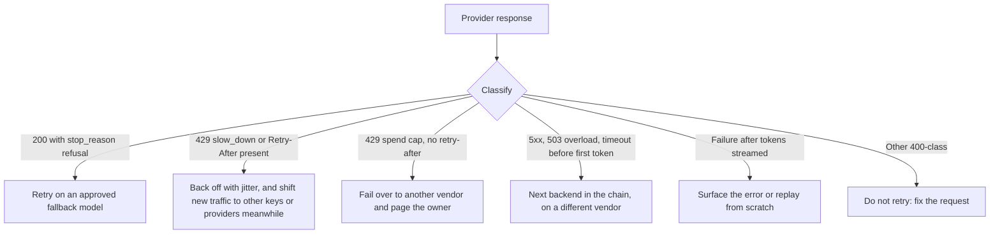

# AI Gateways and Model Routing

The case for a routing layer is now empirical, not aspirational. Per Datadog's 2026 State of AI Engineering, **69% of companies run three or more models in production**, and **rate-limit / capacity errors are the single largest production failure mode** (about 5% of requests fail, and roughly 60% of those failures are capacity-driven). Datadog's own framing: operational complexity, not model intelligence, is now the primary barrier to reliable AI at scale.

Once you depend on multiple models and your traffic is non-trivial, a single provider becomes a single point of failure, and rate limits, not model quality, are what page you at 2am. An **AI gateway** is the standard mitigation. This chapter covers what it does, how routing and fallback work, the 2026 tool landscape, and when you actually need one.

## Table of Contents

- [What an AI Gateway Is](#what-an-ai-gateway-is)
- [Routing Strategies](#routing-strategies)
- [Fallback and Reliability](#fallback-and-reliability)
- [The 2026 Tool Landscape](#the-2026-tool-landscape)
- [Architecture Patterns](#architecture-patterns)
- [Securing the Gateway](#securing-the-gateway)
- [Do You Need a Gateway Yet?](#do-you-need-a-gateway-yet)
- [Interview Questions](#interview-questions)
- [References](#references)

---

## What an AI Gateway Is

An AI gateway (also LLM gateway, LLM proxy, or LLM router) is a **control plane between your applications and model providers**, exposing one consistent (almost always OpenAI-compatible) API and centralizing the cross-cutting concerns that would otherwise be smeared across every service.

| Job | What it does |
|-----|--------------|
| Unified API | One OpenAI-shaped interface across providers; no per-provider glue |
| Model routing | Picks which model/deployment serves each request |
| Fallback chains | On a retryable failure, tries the next provider/model in an ordered list |
| Load balancing | Spreads traffic across keys, regions, deployments, providers |
| Retries with backoff | Exponential backoff plus jitter, honoring `Retry-After` |
| Rate-limit handling | Detects 429s, cools down throttled deployments, reroutes |
| Virtual keys + budgets | Per-key/team keys with dollar budgets and hard caps |
| Spend tracking | Token- and dollar-level attribution per key/team/model |
| Observability | Centralized traces: who called, what was tried, why it failed, what won |
| Caching | Exact-match and semantic caching to cut cost and latency |
| Guardrails / PII | Prompt/response filtering and redaction at the choke point |

The mental model: a gateway converts an `N providers x M concerns` glue problem in application code into a single policy-enforced choke point. The cost is one extra network hop and a component you must keep highly available, which is the central tension below.

---

## Routing Strategies

Routing strategies form a ladder of increasing complexity and overhead. As a rough sense of scale (vendor/practitioner figures, order-of-magnitude only): rule-based routing adds under ~1ms, embedding/semantic routing ~5ms, and heavier ML classifiers or an LLM-as-router ~50-100ms, all against typical model latencies of 500-2000ms.

| Strategy | Decides by | Best for | Overhead | Failure modes |
|----------|-----------|----------|----------|---------------|
| Static / manual | Hard-coded model per route | Simple, predictable workloads | ~0ms | Brittle; no adaptation to outages or price changes |
| Task-based | Task type maps to a model | Known task taxonomy | <1ms | Misclassification; taxonomy goes stale |
| Cost-based | Cheapest model meeting constraints | Cost ceilings, batch work | <1ms | Can starve quality; cheapest may rate-limit |
| Latency-based | Lowest observed/expected latency | Real-time UX | ~1-5ms | Herding onto one fast endpoint; cold-start skew |
| Capability-based | Required capability (long context, vision, tools) | Heterogeneous needs | 1-5ms | Over-provisioning to the "best" model |
| Semantic | Embed the request, match to a route | Intent dispatch, mixed difficulty | ~5-50ms | Embedding drift; ambiguous tail; threshold tuning |
| LLM-as-router | A small LLM classifies and picks | The ambiguous tail embeddings miss | ~50-100ms | Adds an LLM call with its own cost and failure surface |
| Cascade | Cheap model first, escalate on low confidence | Cost-quality at scale | Sequential | Double-spend on escalated queries; noisy confidence |
| KV-cache-aware (self-hosted) | Which replica already holds the prompt's prefix in KV cache | Self-hosted fleets with shared prefixes and multi-turn agents | Low | Hot-spotting on popular prefixes; stale cache index |

Three notes that matter in practice. **Semantic routing** picks a route by embedding similarity without calling an LLM; a common production pattern is a two-stage hybrid that handles the confident majority semantically and sends the ambiguous tail to an LLM-as-router (vLLM Semantic Router, at v0.4.0 since September 27, 2026, is an open-source implementation).

**Cascades** are the highest-leverage cost play: RouteLLM (UC Berkeley / LMSYS, ICLR 2025) reported reaching ~95% of a frontier model's quality while routing only a fraction of calls to it, with cost reductions in the 45-85% range. Read that range as a benchmark-specific ceiling, not a guarantee; the escalation rate is the live cost variable, and a cascade that escalates most traffic saves little. The tier gaps are wide: OpenAI shipped no GPT-6 Terra, so inside the GPT-6 family the step from Luna ($0.10/$0.50) to Sol ($2/$10) is 20x, and an escalated request pays for both calls, about 21x a Luna-only one. Cascades are now a shipping product pattern too: GitHub's HydraFusion (research preview, September 30, 2026) runs an efficient drafter, a quality gate, and escalation to a stronger model if needed, or has a critic from a different model family review the draft before a single revision.

**KV-cache-aware routing** moves the decision below the provider layer for self-hosted fleets: the Kubernetes Gateway API Inference Extension's endpoint picker (moved into the llm-d project in August 2026) and NVIDIA Dynamo's router send each request to the replica whose cache already holds its prefix, and Google reports under 1% routing overhead for its multi-cluster GKE Inference Gateway.

Routing and fallback compose: route for cost/quality/latency on the happy path, fall back across providers for reliability on the unhappy path. A cascade is essentially quality-driven routing with reliability fallback built in.

---

## Fallback and Reliability

This is the section that answers the Datadog data directly: rate limits cause most production failures, and fallback machinery is the antidote.

**Fallback chains** retry a request against the next provider/model whenever the primary returns a *retryable* failure (429 rate limit, 5xx, timeout, model-not-found). Retry 429 and 5xx-class errors only after classifying them; never retry 400-class client errors, which just waste quota.

**Retries done right** follow three rules: exponential backoff (wait longer each failure), jitter (randomize the wait so clients do not retry in lockstep and create a thundering herd that worsens the outage), and honor `Retry-After` (OpenAI and Anthropic send it on ordinary rate-limit 429s; use `max(retry_after, computed_backoff)`). Ignoring `Retry-After` is the most common backoff bug.

**Branch on the error code, not just the status.** Not every 429 means "try again soon." Since September 2, 2026, OpenAI returns 429 with code `slow_down` when traffic ramps too fast (ramp gradually and honor `Retry-After`) and 503 on temporary model overload. Anthropic's monthly spend cap returns 429 with `error_code: enforced_spend_limit_reached` and no `retry-after`: no retry succeeds before the 1st of the next month, so fail over and page the owner. And on Claude Fable 5.1, a safety-classifier refusal arrives as HTTP 200 with `stop_reason: "refusal"` and a `stop_details` category. Treat it as a routing signal rather than a success; Anthropic's beta server-side `fallbacks: "default"` retries on the model it recommends for that category (Fable 5.1's permitted targets are Claude Opus 4.8 and Opus 5).

**Fail over across vendors, not just models.** Outages take out a vendor's whole surface at once. OpenAI's September 29, 2026 incident degraded the API (including the Agents API), ChatGPT and Codex for about 5 hours 20 minutes, and Anthropic's status feed records at least 12 major or critical incidents between August 16 and September 29, 2026. A chain that only steps to a sibling model on the same provider does not survive that.

**Streaming failover has a window.** You can fail over cleanly only before the first token. Envoy AI Gateway 1.1 (August 21, 2026) added `streamIdleTimeout`, which moves to the next backend if no token arrives in time. After tokens have streamed, the choice is to replay from scratch (duplicate output the client must discard) or surface the error.

**Conversation state does not always transfer.** Claude Fable 5.1, Opus 5.5 and Sonnet 5.5 bind thinking blocks to the model and the conversation: blocks the fallback model cannot read are dropped silently, and on accounts created on or after August 31, 2026, a changed prefix before a thinking block returns 400. Sonnet 5.5 blocks are also bound to the producing account. A gateway that moves a multi-turn agent to another model or account mid-conversation, or rewrites history to inject reminders, loses reasoning or hard-fails. Fail over at turn boundaries, keep conversations append-only, and evaluate the fallback path as a first-class configuration. The same models reject forced `tool_choice` (`any` or `tool`) with a 400, so a gateway that translates requests between providers must not pass it through.

**Lifecycle diverges per platform.** Claude Opus 4.1 retired on the Claude API on August 5, 2026 but runs on Bedrock until January 8, 2027 (at higher extended-access prices from October 8); Grok 4 was retired from the xAI API on May 15, and the `grok-4` slug now silently resolves to `grok-4.3` and bills at its rates, yet Azure Foundry still lists Grok 4 as GA. Key the gateway's model registry on (model, platform), or a multi-cloud fallback can land on a model that is retired, repriced, or a different version. The model behind a fixed ID can change too: OpenAI fixed an image-encoding bug in `gpt-6-sol` and `gpt-6-luna` on September 25, 2026 without changing either ID. Log the model ID each response reports and alert when it changes, which catches alias rerouting, and rerun evals on a schedule against the IDs you route to, which catches same-ID changes.

**Circuit breakers** track endpoint health globally and open when the failure rate crosses a threshold, so you stop hammering a dead or throttled provider on every request. Pair with cooldowns that park a failing deployment for a fixed window before auto-recovery.

**Load balancing** across multiple keys, regions, and providers multiplies your effective rate-limit headroom, which is the most direct structural fix for capacity failures.

The caution to internalize: **blind retries amplify outages** by adding load during a failure. Backoff, jitter, circuit breakers, error-code classification, and `Retry-After` are what separate a gateway that fixes rate limits from one that worsens them. See [Reliability Patterns](../13-reliability-and-safety/03-reliability-patterns.md).

---

## The 2026 Tool Landscape

Treat versions and exact feature claims as point-in-time, and note that several comparison figures below come from vendor marketing.

- **LiteLLM** (open-source, self-hosted proxy plus SDK) is the de-facto standard: 100+ providers behind an OpenAI-format API, routing strategies (latency, usage, cost, least-busy), ordered fallbacks, virtual keys with dollar budgets, and native OpenTelemetry. The common critique is that YAML config strains at enterprise-governance scale. Its popularity also makes it a prime target; see [Securing the Gateway](#securing-the-gateway).
- **OpenRouter** (managed aggregator) gives the fastest breadth and zero ops across 400+ models, with pass-through provider pricing (a documented BYOK fee applies). Stripe agreed to acquire it (announced August 19, 2026; OpenRouter says routing stays provider-neutral). It added US in-region routing (us.openrouter.ai, September 9) alongside EU routing for Business and Enterprise plans, a Batch API at generally 50% off on 70+ models (September 22), and an Auto Router that routes on the last 7 days of marketplace spend. The tradeoffs are an external hop, data leaving your perimeter, and now a payments company in your vendor-risk review.
- **Portkey** (managed, with a self-host tier) positions as a full control plane: routing, fallbacks, token-level observability, semantic caching, and guardrails.
- **Cloudflare AI Gateway** (managed, edge) is strong on observability and caching with sequential provider fallback, but lighter on routing logic and budget enforcement. Cloudflare's managed retrieval service, AI Search, went GA on October 1, 2026, one sign that gateways are absorbing retrieval and grounding.
- **Kong AI Gateway** (API-management platform) brings LLM routing (including semantic), retry/fallback, semantic caching, and a PII sanitizer into a mature gateway; best when you already run Kong.
- **Envoy AI Gateway** (open-source, Kubernetes-native) reached a stable 1.x API (v1.0.0 on June 23, v1.1.0 on August 21, 2026): token counting across providers, per-request upstream credentials (`credentialOverride`), stream-idle failover before the first token, MCP routing with default-deny backend selection, and OpenTelemetry GenAI semantic conventions. It joined the Agentic AI Foundation in September 2026 under the name Agent Router, next to agentgateway, which proxies agent (MCP and A2A) traffic.
- **Kubernetes inference gateways** for self-hosted models: the Gateway API Inference Extension plus llm-d (KV-cache-aware and latency-predictive endpoint picking) and NVIDIA Dynamo's router. These pick a replica, not a provider, and sit under a provider-level gateway.
- **Cloud-native** routers (AWS Bedrock intelligent prompt routing, Google Vertex) integrate tightly with their clouds; strict per-account rate limits still make a multi-provider layer useful.

**Self-hosted vs managed**, the core tradeoffs: self-hosted (LiteLLM, Kong, Envoy) keeps data in your perimeter, gives full control, and is required for strict compliance, but *you* must make the proxy highly available or it becomes the single point of failure. Managed (OpenRouter, Portkey, Cloudflare) is near-zero ops and fast to adopt, but data transits a third party and you inherit their availability as a hard dependency.

---

## Architecture Patterns

- **Where it sits:** between application services and providers, as a horizontally scaled service or sidecar. All LLM traffic flows through it, so it inherits the reliability requirements of any critical-path infrastructure.
- **The network-hop tax:** the gateway adds one hop. Mitigate by co-locating it with your app (same region/VPC/cluster) so the hop is sub-millisecond, keeping the proxy thin, and caching aggressively so hits skip the provider entirely. The hop is modest against 500-2000ms model latency, but real under load.
- **Do not let the gateway become the SPOF:** this is the central architectural risk. Run multiple stateless replicas behind a load balancer, externalize shared state (Redis for rate-limit and usage counters, a database for keys and spend), and health-check the replicas. A gateway that centralizes everything but runs as one instance has simply *moved* your single point of failure.
- **Multi-region:** deploy replicas per region, route region-locally, and use cross-region/cross-provider fallback so a regional outage fails over elsewhere.
- **Residency routing:** in-region processing is now selectable per request or per endpoint (Anthropic's `inference_geo`, OpenAI's residency endpoints and `us.`/`eu.` regional API domains, Bedrock and Google Cloud regional endpoints, us. and eu.openrouter.ai), and residency typically carries about a 10% price premium (OpenRouter states no surcharge). The gateway is the right place to pin residency per tenant, so only residency-bound traffic pays the premium, and to make sure a fallback chain never leaves the required geography.
- **Caching and observability:** exact-match for identical prompts, semantic caching for near-duplicates, and OpenTelemetry spans carrying user/key, models attempted, failure reasons, the winning fallback, per-step latency, and exact cost. This is what makes the rate-limit failure mode visible instead of mysterious. See [Observability](../14-evaluation-and-observability/02-observability.md).

---

## Securing the Gateway

A gateway concentrates every provider key, every prompt and every response in one process, which makes it the highest-value target in the AI stack. LiteLLM's 2026 advisories show the pattern:

| Advisory | What happened | Fixed in |
|----------|---------------|----------|
| CVE-2026-37004 (critical, CVSS 9.8) | Unauthenticated template injection in the `/prompts/test` endpoint allowed OS command execution | 1.83.7 |
| CVE-2026-49468 (critical) | Host-header authentication bypass | 1.84.0 |
| CVE-2026-84377 (medium, CVSS 6.5) | Any authenticated proxy user could point `api_base`, `base_url`, `model_list` or fallbacks at their own host, so the proxy sent the operator's stored provider keys there (plus SSRF) | Per-line patches 1.88.6 through 1.96.2; workaround `general_settings.allow_client_side_credentials=false` |
| GHSA-92x9-889m-jgmw | Compromised litellm 1.82.7 and 1.82.8 releases on PyPI | Never install those versions; pin by hash |

The design rules that follow:

- **Never let a caller choose where credentials go.** Allowlist upstream hosts and strip client-supplied routing parameters (`api_base`, fallbacks) at the edge. It is the same issuer-binding rule as the MCP OAuth mix-up fix in [Access Control](../12-security-and-access/02-access-control.md#agent-and-tool-authorization).
- **Keep long-lived secrets out of the proxy where you can.** Inject per-request credentials from a vault (Envoy's `credentialOverride`), use workload identity instead of static provider keys (OpenAI made mTLS and X.509 workload identity federation GA on August 29, 2026), and give the remaining keys short lifetimes (OpenAI added key expiration on September 10).
- **Treat the gateway as supply chain.** Pin versions and hashes, install from a mirrored index, subscribe to its advisories, and never expose admin or test endpoints to the internet.
- **Assume it will be breached and limit the blast radius:** separate gateway deployments per trust zone, provider keys scoped per gateway, and spend caps per key so a stolen credential has a ceiling.

---

## Do You Need a Gateway Yet?

**Probably not** (use a thin in-app abstraction) when you have a single provider, a prototype, or one or two providers behind a small wrapper that still fits in your head. Direct SDK calls are simpler with fewer moving parts. This is the same thin-layer idea argued in [Navigating Framework Churn](../09-frameworks-and-tools/12-navigating-framework-churn.md).

**You do** when several of these hold: 3+ models or multiple providers (the 69% majority); multiple teams sharing model access who need virtual keys, budgets, and spend attribution; rate-limit errors actually hitting you; scattered retry/fallback/key-management logic already in your codebase (the smell that adoption stops being premature); or you cannot answer "which provider served this request?" or "what did each team spend?" without a side project.

**Build vs buy:** a thin in-app abstraction is best at 1-2 providers; self-hosting an open-source gateway (LiteLLM first) is best when you need data residency or deep control and have platform-team bandwidth; buying managed is best when you want the capabilities without owning the infra and can accept the external dependency.

**Rollout** in order: start in shadow/observe mode, move non-critical workloads first, add virtual keys and budgets to get attribution before enforcement, add fallback chains targeting your worst rate-limit offenders, then layer in caching and routing once reliability is solid, and make the gateway highly available before it becomes load-bearing.

---

## Interview Questions

### Q: Rate-limit errors are your top production failure. How does a gateway help, and how could it make things worse?

**Strong answer:**
A gateway helps by load-balancing across multiple keys, regions, and providers (which multiplies rate-limit headroom) and by failing over to an alternate provider on a 429 through an ordered fallback chain, so a single provider's throttling stops being a hard outage. It also makes the failure visible: centralized traces show which provider was tried and why it failed. It makes things worse if retries are naive: blind, immediate retries add load during the exact moment the provider is overloaded, a thundering herd that deepens the outage. The fixes are exponential backoff with jitter, honoring the provider's `Retry-After` header, and a circuit breaker that stops hammering a dead endpoint globally rather than retrying per request. I would also classify by error code, not status: OpenAI's `slow_down` 429 means ramp more gently, while Anthropic's spend-cap 429 will not clear until next month and should trigger failover and a page, not retries. Fallbacks should cross vendors, since a provider outage usually takes down every model it serves. And the gateway itself must be highly available with externalized state, or it just relocates the single point of failure.

### Q: When is a full gateway overkill, and what would you do instead?

**Strong answer:**
For a single provider or a prototype, a gateway is overkill; it adds a network hop and an HA burden for capabilities you do not need yet. I would use a thin in-app abstraction: depend on the provider SDK behind a small interface of my own, with a basic fallback chain and backoff. I would adopt a real gateway once I cross into multiple providers, multiple teams needing budgets and spend attribution, or recurring rate-limit pain, which is roughly when retry and key-management logic starts getting copy-pasted across services. Even then I would roll it out in shadow mode first and make it highly available before it became load-bearing.

### Q: Your gateway holds every provider key. How do you secure it?

**Strong answer:**
I treat it as the crown-jewel service, because one bug exposes every key at once; LiteLLM had an unauthenticated RCE (CVE-2026-37004, CVSS 9.8) and a flaw that let any authenticated user redirect calls, with the operator's stored keys, to their own host (CVE-2026-84377). First, callers never choose destinations: I allowlist upstream hosts and strip `api_base`-style parameters at the edge. Second, I minimize standing secrets: workload identity or mTLS to providers where supported, vault-injected per-request credentials elsewhere, short key lifetimes, and a separate key and spend cap per gateway deployment so a leak has a ceiling. Third, supply chain: pinned versions and hashes from a mirrored index (two LiteLLM releases on PyPI were malicious), advisory tracking with a patch SLA, and admin endpoints on a private network. Finally, I log every upstream destination and alert on any host outside the allowlist, which is how a redirect attack would show up.

### Q: How do you fail over a long-running agent conversation to another provider?

**Strong answer:**
Carefully, because agent state is not portable the way a single request is. I fail over at turn boundaries, not mid-stream: before the first token, a stream-idle timeout can move to the next backend cleanly, but after tokens flow I either replay from scratch or surface the error. Reasoning state is model-bound on the newest Claude models: thinking blocks another model cannot read are dropped, and a changed prefix can return a 400 on newer accounts, so the fallback model gets the visible transcript and tool results, not the hidden reasoning, and I keep the conversation append-only. Request shapes differ too (the newest Claude models reject forced `tool_choice`), so the gateway translates per target rather than passing parameters through. I evaluate the fallback path as its own configuration, cross vendors so a single outage cannot take out both legs, and keep the model registry keyed by model and platform so failover never lands on a retired or repriced deployment.

---

## References

- Datadog, [State of AI Engineering 2026](https://www.datadoghq.com/state-of-ai-engineering/) and the [press release](https://www.datadoghq.com/about/latest-news/press-releases/datadog-state-of-ai-engineering-report-2026/)
- [LiteLLM routing docs](https://docs.litellm.ai/docs/routing) and [load balancing](https://docs.litellm.ai/docs/proxy/load_balancing)
- RouteLLM, [LMSYS blog](https://www.lmsys.org/blog/2024-07-01-routellm/) and [GitHub](https://github.com/lm-sys/routellm)
- [Envoy AI Gateway v1.1.0 release notes](https://github.com/envoyproxy/ai-gateway/releases/tag/v1.1.0)
- [Kong AI Gateway docs](https://developer.konghq.com/ai-gateway/)
- [OpenRouter BYOK docs](https://openrouter.ai/docs/guides/overview/auth/byok) and [OpenRouter joining Stripe](https://openrouter.ai/blog/announcements/openrouter-is-joining-stripe/)
- LiteLLM advisories [GHSA-6wvf-77m9-58rm](https://github.com/advisories/GHSA-6wvf-77m9-58rm) (CVE-2026-37004) and [GHSA-3cv6-jpf6-8222](https://github.com/advisories/GHSA-3cv6-jpf6-8222) (CVE-2026-84377)
- [Gateway API Inference Extension v1.6.0](https://github.com/kubernetes-sigs/gateway-api-inference-extension/releases/tag/v1.6.0)
- Anthropic, [refusals and fallback](https://platform.claude.com/docs/en/build-with-claude/refusals-and-fallback) and [rate limits](https://platform.claude.com/docs/en/api/rate-limits)
- OpenAI, [API changelog](https://developers.openai.com/api/docs/changelog)

---

*Previous: [CI/CD for LLM Applications](02-cicd.md) · Next: [FinOps and Token Economics](04-finops-and-token-economics.md)*
