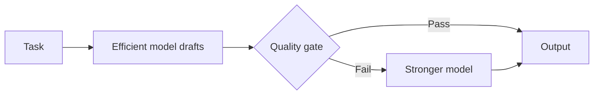

# Ensemble Methods for LLM Reliability

Ensemble methods are critical for production reliability. This chapter covers multi-model coordination patterns that improve accuracy and reduce hallucinations.

## Table of Contents

- [Why Ensembles Matter](#why-ensembles-matter)
- [Evaluation Ensembles](#evaluation-ensembles)
- [Generation Ensembles](#generation-ensembles)
- [Multi-Agent Patterns](#multi-agent-patterns)
- [Ensemble vs Arbitration](#ensemble-vs-arbitration)
- [Cost-Accuracy Tradeoffs](#cost-accuracy-tradeoffs)
- [Interview Questions](#interview-questions)
- [References](#references)

---

## Why Ensembles Matter

Single-model outputs are unreliable for high-stakes applications:
- Models hallucinate facts
- Reasoning can be flawed
- Outputs vary from one sample to the next
- Single-judge evaluations are biased

Ensembles improve reliability through redundancy and diversity.

### Ensemble Methods Taxonomy

| Category | Purpose | Methods |
|----------|---------|---------|
| Evaluation | Reduce judge bias | Panel of Judges, Pairwise Comparison |
| Generation | Improve output quality | Self-Consistency, Best-of-N |
| Verification | Reduce hallucinations | Multi-Agent Debate, Fact Checking |
| Synthesis | Combine perspectives | Mixture of Agents |
| Escalation | Spend strong-model compute only where needed | Cascade, Cross-Family Critique |

---

## Evaluation Ensembles

### Panel of LLM Judges (PoLL)

Multiple diverse models score the same output:

```python
class PanelOfJudges:
    """
    Production implementation of PoLL pattern.
    Key insight: Diversity of judges matters more than individual judge quality.
    """
    def __init__(self, judges: list, aggregation: str = "mean"):
        # Use diverse model families, not just different sizes
        # Good: [Claude Sonnet 5.5, GPT-6.1 Sol, Gemini 3.8 Flash, GLM-5.3]
        # Bad: [GPT-6 Astra, GPT-6.1 Sol, GPT-6 Luna] - same family bias
        self.judges = judges
        self.aggregation = aggregation
    
    async def evaluate(self, question: str, answer: str, rubric: str) -> dict:
        # Parallel evaluation for latency
        judgments = await asyncio.gather(*[
            judge.score(question, answer, rubric) 
            for judge in self.judges
        ])
        
        scores = [j["score"] for j in judgments]
        
        # Track inter-judge agreement for confidence
        agreement = 1 - (np.std(scores) / max(np.mean(scores), 0.01))
        
        if self.aggregation == "mean":
            final_score = np.mean(scores)
        elif self.aggregation == "median":  # More robust to outliers
            final_score = np.median(scores)
        elif self.aggregation == "trimmed_mean":  # Drop highest and lowest
            final_score = np.mean(sorted(scores)[1:-1])
        
        return {
            "score": final_score,
            "confidence": agreement,
            "individual_scores": scores,
            "needs_review": agreement < 0.7  # Flag for human review
        }
```

**When to use:** High-stakes evaluations, benchmark creation, when single-judge bias is unacceptable.

**Agreement is not accuracy.** Judges fail in correlated ways, so a panel that agrees can be confidently wrong together. A September 2026 study (arXiv 2609.29769) compared Jev, a decision model that returns typed scores instead of text, with LLM rubric judges: the LLM judges cost 16 to 325x more and took 28 to 350x longer, yet on Jev's most confident errors about 96% of LLM verdicts repeated the same wrong answer, and no cascade beat the best single judge by more than 2.7 points. Panels reduce variance and cascades cut cost; neither reliably catches a blind spot the judges share. Keep a human-labeled gold set and measure the panel against it, not against itself.

### Pairwise Comparison with Positional Debiasing

LLM judges show position bias, often favoring whichever answer appears first, and its size varies by judge and task (Zheng et al., 2023; Wang et al., 2023). Always run both orderings:

```python
async def pairwise_compare_debiased(model, response_a: str, response_b: str, criteria: str) -> dict:
    """
    Critical: Models have significant positional bias.
    Always run both orderings and aggregate.
    """
    # Run both orderings in parallel
    result_ab, result_ba = await asyncio.gather(
        model.compare(first=response_a, second=response_b, criteria=criteria),
        model.compare(first=response_b, second=response_a, criteria=criteria)
    )
    
    # If A wins in both positions -> Strong signal for A
    if result_ab["winner"] == "first" and result_ba["winner"] == "second":
        return {"winner": "A", "confidence": "high"}
    
    # If B wins in both positions -> Strong signal for B
    elif result_ab["winner"] == "second" and result_ba["winner"] == "first":
        return {"winner": "B", "confidence": "high"}
    
    # Winner depends on position -> Positional bias detected
    else:
        return {
            "winner": "tie",
            "confidence": "low",
            "note": "Positional bias detected"
        }
```

---

## Generation Ensembles

### Self-Consistency (Majority Voting)

Generate multiple reasoning paths, vote on the final answer:

```python
class SelfConsistencyDecoder:
    """
    Key parameters:
    - k (sample count): 5-10 for most tasks, 15-20 for hard math
    - temperature: 0.5-0.8 for reasoning tasks, where the API still accepts it
    
    Too low temperature = not enough diversity
    Too high temperature = too much noise
    """
    
    def __init__(self, model, k: int = 7, temperature: float | None = 0.7):
        self.model = model
        self.k = k
        self.temperature = temperature  # None for models with fixed sampling
    
    async def generate_with_consistency(self, prompt: str) -> dict:
        # Pass temperature only if the target model accepts it
        sampling = {} if self.temperature is None else {"temperature": self.temperature}
        
        # Generate k reasoning paths in parallel
        responses = await asyncio.gather(*[
            self.model.generate(prompt, **sampling)
            for _ in range(self.k)
        ])
        
        # Extract final answers (task-specific)
        answers = [self.extract_answer(r) for r in responses]
        
        # Majority voting
        answer_counts = Counter(answers)
        majority_answer, majority_count = answer_counts.most_common(1)[0]
        
        # Confidence = proportion of votes for winner
        confidence = majority_count / self.k
        
        # Get best reasoning path that led to majority answer
        best_reasoning = self.select_best_reasoning(
            responses, answers, majority_answer
        )
        
        return {
            "answer": majority_answer,
            "confidence": confidence,
            "num_paths": self.k,
            "reasoning": best_reasoning,
            "vote_distribution": dict(answer_counts)
        }
    
    def extract_answer(self, response: str) -> str:
        # Task-specific answer extraction
        # For math: extract the final number
        # For code: extract the function
        # Implement based on your task
        pass
```

**Best for:** Math, logic, coding with verifiable answers. The original paper's (Wang et al.) headline gains over greedy chain-of-thought ranged from +3.9 points (ARC-challenge) to +17.9 (GSM8K), measured on 2022-era models with no built-in reasoning. Do not carry those numbers over to a current reasoning model; measure the gain on your own eval set before paying k times the cost.

### Sampling Controls Are Disappearing

The classic recipe tunes temperature for diversity. On frontier APIs that knob is going away:

| Platform | Status (October 2026) |
|----------|-----------------------|
| Claude API | Returns 400 for non-default sampling values on Opus 4.7 and later and on Sonnet 5 and later; the Anthropic Python SDK 1.0 (August 20, 2026) removed `temperature`, `top_p`, and `top_k` from Messages methods, so passing them raises `TypeError` |
| Gemini API | `temperature`, `top_p`, and `top_k` deprecated on July 21, 2026; Gemini 3.8 Flash controls reasoning with `thinking_level` instead of `thinking_budget` |
| OpenAI GPT-6 Astra | No custom `temperature` or `top_p`, and no `logprobs` |

What this changes for ensembles:

- **Diversity comes from elsewhere.** Default sampling on these models is already stochastic, so k samples still disagree. When they do not disagree enough, vary the prompt, the reasoning effort, or the model family instead of the temperature.
- **Confidence comes from votes, not logprobs.** With no logprobs on Astra, vote share across samples (or a judge score) is the confidence signal.
- **Do not ask the newest Claude models to write out their reasoning.** A prompt that demands a `<thinking>` section or a `reasoning` field in JSON can be refused under the `reasoning_extraction` category, and those refusals have been billed since September 24, 2026. Vote on final answers; if you need the path, ask for a short explanation, or set `thinking: {type: "adaptive", display: "summarized"}` and read the summarized thinking (at the default `display: "omitted"` these models return empty thinking blocks).

### Best-of-N with Reward Model

Generate N candidates, score with reward model, return best:

```python
class BestOfNSampler:
    """
    Key considerations:
    1. N selection: N=4-8 for interactive, N=16-64 for batch
    2. Reward model ensemble reduces (does not prevent) reward hacking
    3. Monitor sample diversity - if too similar, BoN is wasted compute
    """
    
    def __init__(self, generator, reward_models: list, n: int = 8):
        self.generator = generator
        self.reward_models = reward_models  # Ensemble for robustness
        self.n = n
    
    async def generate_best(self, prompt: str) -> dict:
        # Generate N candidates in parallel
        candidates = await asyncio.gather(*[
            self.generator.generate(prompt, temperature=0.8)  # drop on fixed-sampling models
            for _ in range(self.n)
        ])
        
        # Score with reward model ensemble
        scored_candidates = []
        for candidate in candidates:
            rm_scores = await asyncio.gather(*[
                rm.score(prompt, candidate) for rm in self.reward_models
            ])
            
            # Conservative aggregation makes reward hacking harder
            # Use 25th percentile instead of mean
            conservative_score = np.percentile(rm_scores, 25)
            
            scored_candidates.append({
                "response": candidate,
                "score": conservative_score,
                "rm_agreement": 1 - np.std(rm_scores) / np.mean(rm_scores)
            })
        
        # Select best by conservative score
        best = max(scored_candidates, key=lambda x: x["score"])
        
        # Compute diversity metric
        diversity = self.compute_diversity(candidates)
        
        return {
            "response": best["response"],
            "score": best["score"],
            "n_sampled": self.n,
            "diversity_score": diversity,
            "low_diversity_warning": diversity < 0.3
        }
    
    def compute_diversity(self, candidates: list) -> float:
        # Embed candidates and compute average pairwise distance
        embeddings = [embed(c) for c in candidates]
        similarities = []
        for i in range(len(embeddings)):
            for j in range(i + 1, len(embeddings)):
                similarities.append(cosine_similarity(embeddings[i], embeddings[j]))
        return 1 - np.mean(similarities)  # Higher = more diverse
```

**Best for:** Open-ended generation, creative tasks. The gain is bounded by the scorer: against a proxy reward model, best-of-n improves true quality at first and can then degrade it as n grows (Gao et al., 2022), so check selections against human ratings and keep N modest.

---

## Multi-Agent Patterns

### Multi-Agent Debate

Multiple models critique each other iteratively:

```python
class MultiAgentDebate:
    """
    Pattern: Multiple models debate to reduce hallucinations.
    
    Most effective when:
    1. Models have different biases (diverse model families)
    2. 2-3 rounds is optimal (more = diminishing returns)
    3. Explicit "devil's advocate" prompting improves results
    """
    
    def __init__(self, debaters: list, rounds: int = 2):
        self.debaters = debaters
        self.rounds = rounds
    
    async def debate(self, question: str) -> dict:
        # Round 0: Initial positions
        positions = await asyncio.gather(*[
            debater.generate(f"Answer this question with reasoning: {question}")
            for debater in self.debaters
        ])
        
        debate_history = [{"round": 0, "positions": positions}]
        
        # Debate rounds
        for round_num in range(1, self.rounds + 1):
            new_positions = []
            
            for i, debater in enumerate(self.debaters):
                other_positions = [p for j, p in enumerate(positions) if j != i]
                
                critique_prompt = f"""
Question: {question}

Your previous answer: {positions[i]}

Other perspectives:
{self.format_positions(other_positions)}

Consider the other perspectives. If they raise valid points, update your answer.
If you still disagree, explain why with specific reasoning.
Provide your final answer.
"""
                new_position = await debater.generate(critique_prompt)
                new_positions.append(new_position)
            
            positions = new_positions
            debate_history.append({"round": round_num, "positions": positions})
        
        # Final synthesis
        final_answer = await self.synthesize(question, debate_history)
        
        return {
            "answer": final_answer,
            "rounds": self.rounds,
            "consensus_reached": self.check_consensus(positions),
            "debate_history": debate_history
        }
```

**Best for:** Fact verification, reducing hallucinations in complex answers.

### Mixture of Agents (MoA)

Layered architecture where multiple models feed into aggregators:

```
┌─────────────────────────────────────────────────────────────────┐
│                    MIXTURE OF AGENTS (MoA)                       │
├─────────────────────────────────────────────────────────────────┤
│                                                                  │
│  Layer 1 (Proposers):                                           │
│  ┌─────────┐  ┌─────────┐  ┌─────────┐  ┌─────────┐            │
│  │ Claude  │  │  GPT-6  │  │ Gemini  │  │ Llama   │            │
│  └────┬────┘  └────┬────┘  └────┬────┘  └────┬────┘            │
│       │            │            │            │                   │
│       └────────────┴─────┬──────┴────────────┘                  │
│                          │                                       │
│  Layer 2 (Aggregator):   ▼                                      │
│  ┌──────────────────────────────────────────────────┐           │
│  │  "Given these perspectives: [R1, R2, R3, R4]    │           │
│  │   Synthesize the best answer..."                │           │
│  └────────────────────────┬─────────────────────────┘           │
│                           │                                      │
│                           ▼                                      │
│                    [Final Output]                                │
└─────────────────────────────────────────────────────────────────┘
```

```python
class MixtureOfAgents:
    def __init__(self, proposers: list, aggregator):
        self.proposers = proposers
        self.aggregator = aggregator
    
    async def generate(self, prompt: str) -> str:
        # Layer 1: Get diverse proposals
        proposals = await asyncio.gather(*[
            proposer.generate(prompt) for proposer in self.proposers
        ])
        
        # Layer 2: Aggregate
        aggregation_prompt = f"""
Given the following question and multiple expert responses, 
synthesize the best possible answer.

Question: {prompt}

Expert responses:
{self.format_proposals(proposals)}

Synthesize the best answer, combining the strongest elements from each response.
"""
        
        final_answer = await self.aggregator.generate(aggregation_prompt)
        return final_answer
```

**Best for:** Complex synthesis, report generation, multi-domain problems.

### Cascades and Cross-Family Critique

Two cheaper patterns are now showing up in developer tools. GitHub's HydraFusion, a research preview in VS Code and the Copilot app since September 30, 2026, orchestrates several models in one of three modes:

- **Single:** one model, the baseline.
- **Cascade:** an efficient model drafts, a quality gate decides, and the work escalates to a stronger model only when the gate fails it. Cost tracks the escalation rate, not the strong model's price.
- **Critique:** a critic from a different model family reviews the draft and the drafter revises once. One round keeps the cost bounded, and a critic from another family is less likely to share the drafter's blind spots.



The cascade is only as good as its gate. If the gate is a judge from the same family as the drafter, expect it to wave through the drafter's characteristic mistakes (the correlated-error result above), so prefer gates that check something verifiable: tests pass, schema validates, citations resolve.

---

## Ensemble vs Arbitration

### Conceptual Distinction

| Aspect | Ensemble Learning | Model Arbitration |
|--------|------------------|-------------------|
| **Goal** | Combine ALL outputs | SELECT single best output |
| **Mechanism** | Aggregation (voting, averaging) | Selection (scoring, ranking) |
| **Relationship** | Collaborative | Competitive |
| **Final Output** | Composite from all models | Output of single winner |
| **When to Use** | Want robustness, reduced variance | Want best quality |

### Decision Framework

```
Is there a single "correct" answer format?
├── Yes (classification, math)
│   └── Use Ensemble (voting/averaging)
│
└── No (creative writing, open QA)
    └── Use Arbitration (best-of-N)
        └── Do you have reliable scoring?
            ├── Yes → Reward model selection
            └── No → LLM-as-judge or human
```

---

## Cost-Accuracy Tradeoffs

### Ensemble Cost Matrix

| Method | Cost Multiplier | Latency | Expected Effect | When to Use |
|--------|-----------------|---------|---------------|-------------|
| Single Model | 1x | 1x | Baseline | Low-stakes, high-volume |
| Self-Consistency k=3 | 3x | 1x (parallel) | Modest; a three-way split has no majority | Reasoning, latency-sensitive |
| Self-Consistency k=10 | 10x | 1x (parallel) | Larger on verifiable answers, with diminishing returns as k grows | Math, accuracy-critical |
| Best-of-N (N=8) | 8x + scoring | 1x (parallel) | Bounded by the scorer; can degrade against a hackable reward model | Creative generation |
| Panel of Judges (3) | 3x eval | 1x (parallel) | Bias reduction | Evaluation tasks |
| Multi-Agent Debate | 6x | 3x | Hallucination ↓ | Fact-critical |
| Mixture of Agents | 5-8x | 2x | Better synthesis | Complex reports |
| Cascade with quality gate | 1x + gate + (escalation rate x strong model) | 1x, 2x on escalation | Near strong-model quality if the gate is reliable | High volume with a verifiable gate |
| Cross-family critique (one round) | ~3x | ~3x (sequential) | Catches family-specific errors | Code review, fact-critical drafts |

The effect column is directional on purpose. Effect sizes depend on the model and the task, so measure each method against a single-model baseline on your own eval set before paying the multiplier.

### When NOT to Use Ensembles

| Situation | Why Not | Alternative |
|-----------|---------|-------------|
| Simple factual lookup | No diversity benefit | Single RAG call |
| Latency < 500ms required | Ensemble adds latency | Single model + caching |
| Cost is primary constraint | Ensembles multiply cost | Model distillation |
| Models highly correlated | No diversity = no benefit | Get diverse models first |

---

## Interview Questions

### Q: When would you use Self-Consistency vs Best-of-N?

**Strong answer:**

"These serve different purposes:

**Self-Consistency** is for tasks with extractable, verifiable answers:
- Math problems: Extract final number, majority vote
- Classification: Vote on labels
- Short-form QA: Vote on answer

The key is you can compare answers for equality. Where the API exposes temperature, 0.5-0.8 provides diversity while maintaining coherence; on models with fixed sampling (newer Claude models, GPT-6 Astra) or deprecated sampling parameters (Gemini since July 2026) I rely on default sampling and add prompt or model variation if the samples agree too readily. I use k=5-10 for most tasks.

**Best-of-N** is for open-ended generation where there is no single right answer:
- Creative writing
- Explanations
- Code that could be written many ways

Here I need a reward model or judge to score candidates since I cannot just compare for equality. N=8-16 typically. The challenge is avoiding reward hacking, so I use reward model ensembles with conservative aggregation.

I would not use Self-Consistency for creative writing (no extractable answer) or Best-of-N for math (just use voting, simpler)."

### Q: How do you prevent reward hacking in Best-of-N?

**Strong answer:**

"Reward hacking is when the model exploits weaknesses in the reward model rather than genuinely improving quality.

**My mitigations:**

1. **Reward model ensemble**: Use 3+ diverse reward models. A sample that hacks one RM is unlikely to hack all of them.

2. **Conservative aggregation**: Instead of using the mean score, use the 25th percentile or minimum. This selects samples that score well across all RMs, not just one.

3. **Diversity monitoring**: Track sample diversity. If diversity drops too low, the model may be exploiting a narrow reward hack. I vary the prompts or reasoning effort, or the temperature where the API still accepts it.

4. **Human calibration**: Periodically validate that RM-selected samples actually match human preferences.

5. **Multiple dimensions**: Score on multiple criteria (quality, safety, relevance) and require good scores on all, not just composite. A summed rubric lets strong criteria hide a failing one: a September 2026 rubric-RL study (arXiv 2609.38847) saw rubric coverage rise while appropriateness on held-out physician criteria fell below the untrained model, and counting a dimension only when all of its criteria pass raised appropriateness by 10.8 points without losing coverage. The same gate works for selecting among N samples.

The key insight is that any single reward signal can be gamed. Ensembles make gaming much harder."

### Q: Your panel of three LLM judges agrees on 95% of verdicts. Is that good news?

**Strong answer:**

"Not by itself. High agreement tells me the panel is consistent, not that it is right. Judges share training data and blind spots, so their errors correlate. A September 2026 comparison of a cheap decision-model judge against LLM rubric judges (arXiv 2609.29769) found that on the cheap judge's most confident errors, about 96% of LLM verdicts repeated the same wrong answer, and cascades added at most 2.7 points over the best single judge.

**What I would check:**
1. **Accuracy against a human-labeled gold set**, stratified by the criteria that matter. Agreement among judges is not a substitute.
2. **Where the panel disagrees with humans together.** Those cases show the shared blind spot, and they are what I add to the gold set.
3. **Real diversity.** Different model families, and for binary checklist criteria, a different judge type (a typed decision model rather than another LLM). Three judges from one family is one judge at three times the cost.
4. **Position and length bias**, by swapping orderings and controlling for length.

If the panel is accurate on the gold set, 95% agreement means I can probably drop to one or two judges and save money. If it is not, the agreement was hiding the problem."

---

## References

- Verga et al. "Replacing Judges with Juries: Evaluating LLM Generations with a Panel of Diverse Models" (2024)
- Wang et al. "Self-Consistency Improves Chain of Thought Reasoning in Language Models" (ICLR 2023): https://arxiv.org/abs/2203.11171
- Gao, Schulman, and Hilton. "Scaling Laws for Reward Model Overoptimization" (2022): https://arxiv.org/abs/2210.10760
- Du et al. "Improving Factuality and Reasoning in Language Models through Multiagent Debate" (2023)
- Wang et al. "Mixture-of-Agents Enhances Large Language Model Capabilities" (2024)
- Zheng et al. "Judging LLM-as-a-Judge with MT-Bench and Chatbot Arena" (2023)
- Wang et al. "Large Language Models are not Fair Evaluators" (2023)
- Rao and Callison-Burch. "JEV vs. LLMs as Rubric Judges: Cheaper, Faster, and Wrong in the Same Places" (arXiv 2609.29769, 2026): https://arxiv.org/abs/2609.29769
- GitHub changelog, HydraFusion in VS Code and the GitHub Copilot app (September 30, 2026): https://github.blog/changelog/2026-09-30-hydrafusion-in-vs-code-and-the-github-copilot-app
- Liu et al. "Scoring Higher, Answering Worse: Mitigating Reward Hacking in Rubric-Based RL via Protocol-Level Rubrics" (arXiv 2609.38847, 2026): https://arxiv.org/abs/2609.38847

---

*Previous: [Guardrails and Safety](01-guardrails.md) · Next: [Reliability Patterns](03-reliability-patterns.md)*
