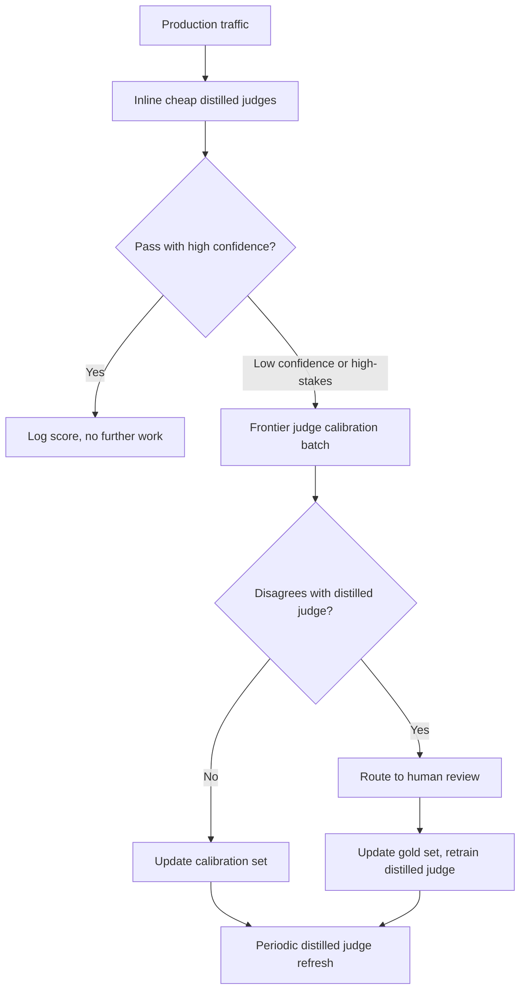
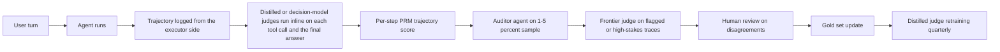

# LLM Evaluation

Evaluating LLM systems is fundamentally different from traditional ML. This chapter covers metrics, methodologies, and practical approaches for measuring quality in production. It is about evaluating *your* system; for how to read public model benchmarks like MMLU, SWE-bench, and Arena Elo, see [Benchmarks and Leaderboards](03-benchmarks-and-leaderboards.md).

## Table of Contents

- [Why LLM Evaluation Is Hard](#why-llm-evaluation-is-hard)
- [Evaluation Dimensions](#evaluation-dimensions)
- [Automated Evaluation Methods](#automated-evaluation-methods)
- [LLM-as-Judge](#llm-as-judge)
- [Human Evaluation](#human-evaluation)
- [RAG-Specific Evaluation](#rag-specific-evaluation)
- [Building Evaluation Pipelines](#building-evaluation-pipelines)
- [Production Monitoring](#production-monitoring)
- [2026 Eval Evolution: Beyond LLM-as-Judge](#2026-eval-evolution-beyond-llm-as-judge)
- [Interview Questions](#interview-questions)
- [References](#references)

---

## Why LLM Evaluation Is Hard

### The Fundamental Challenge

Traditional ML has clear metrics (accuracy, F1, AUC). LLM outputs are open-ended text where "correct" is subjective.

| Traditional ML | LLM Systems |
|----------------|-------------|
| Single correct answer | Many valid responses |
| Objective metrics | Subjective quality |
| Easy to automate | Requires judgment |
| Static test sets | Need diverse scenarios |

### Multiple Dimensions of Quality

A response can be:
- Correct but poorly written
- Well-written but incomplete
- Complete but not relevant
- Relevant but unsafe

You need to measure multiple dimensions independently.

---

## Evaluation Dimensions

### Core Dimensions

| Dimension | What It Measures | How to Evaluate |
|-----------|------------------|-----------------|
| **Correctness** | Factually accurate? | Ground truth, LLM judge |
| **Relevance** | Answers the question? | LLM judge, human |
| **Completeness** | All aspects covered? | Checklist, LLM judge |
| **Coherence** | Well-structured, logical? | LLM judge, human |
| **Conciseness** | Appropriately brief? | Token count, LLM judge |
| **Safety** | No harmful content? | Classifiers, LLM judge |
| **Helpfulness** | Actually useful? | Human feedback |

### Task-Specific Dimensions

**For RAG:**
- Faithfulness: Grounded in retrieved context?
- Attribution: Proper citations?
- No hallucination: Nothing made up?

**For Code Generation:**
- Executability: Does it run?
- Correctness: Passes tests?
- Style: Follows conventions?

**For Summarization:**
- Coverage: Key points included?
- Factual consistency: No introduced errors?
- Compression: Appropriate length reduction?

---

## Automated Evaluation Methods

### Exact Match

Simplest approach, rarely sufficient alone:

```python
def exact_match(prediction: str, reference: str) -> float:
    return float(prediction.strip().lower() == reference.strip().lower())
```

**Use for:** Multiple choice, classification, entity extraction

### Contains Keywords

```python
def keyword_match(prediction: str, required_keywords: list[str]) -> float:
    prediction_lower = prediction.lower()
    matches = sum(1 for kw in required_keywords if kw.lower() in prediction_lower)
    return matches / len(required_keywords)
```

**Use for:** Checking specific facts are mentioned

### Semantic Similarity

```python
def semantic_similarity(prediction: str, reference: str) -> float:
    pred_embedding = embed(prediction)
    ref_embedding = embed(reference)
    return cosine_similarity(pred_embedding, ref_embedding)
```

**Use for:** Paraphrase detection, general similarity
**Limitation:** High similarity does not mean correct

### ROUGE (Summarization)

Measures n-gram overlap:

```python
from rouge_score import rouge_scorer

scorer = rouge_scorer.RougeScorer(['rouge1', 'rouge2', 'rougeL'])

def evaluate_summary(prediction: str, reference: str) -> dict:
    scores = scorer.score(reference, prediction)
    return {
        "rouge1": scores["rouge1"].fmeasure,
        "rouge2": scores["rouge2"].fmeasure,
        "rougeL": scores["rougeL"].fmeasure
    }
```

**Limitation:** Measures overlap, not quality

### Code Execution

For code generation, execution is ground truth:

```python
def evaluate_code(prediction: str, test_cases: list[dict]) -> dict:
    try:
        exec(prediction, globals())
    except SyntaxError as e:
        return {"syntax_valid": False, "error": str(e)}
    
    passed = 0
    for test in test_cases:
        try:
            result = eval(test["call"])
            if result == test["expected"]:
                passed += 1
        except Exception:
            pass
    
    return {
        "syntax_valid": True,
        "tests_passed": passed,
        "tests_total": len(test_cases),
        "pass_rate": passed / len(test_cases)
    }
```

---

## LLM-as-Judge

Use an LLM to evaluate another LLM's outputs.

### Basic Judge Prompt

```python
JUDGE_PROMPT = """
Evaluate the following response to the user's question.

Question: {question}
Response: {response}
Reference Answer (if available): {reference}

Rate the response on these criteria (1-5 scale):

1. Correctness: Is the information accurate?
2. Relevance: Does it address the question?
3. Completeness: Are all aspects covered?
4. Clarity: Is it well-written and clear?

For each criterion, provide:
- Score (1-5)
- Brief justification

Output as JSON:
{
    "correctness": {"score": X, "reason": "..."},
    "relevance": {"score": X, "reason": "..."},
    "completeness": {"score": X, "reason": "..."},
    "clarity": {"score": X, "reason": "..."},
    "overall": X
}
"""

def llm_judge(question: str, response: str, reference: str = None) -> dict:
    prompt = JUDGE_PROMPT.format(
        question=question,
        response=response,
        reference=reference or "Not provided"
    )
    
    result = judge_model.generate(prompt)
    return json.loads(result)
```

### Pairwise Comparison

Compare two responses directly:

```python
PAIRWISE_PROMPT = """
Compare these two responses to the question and determine which is better.

Question: {question}

Response A:
{response_a}

Response B:
{response_b}

Which response is better? Consider:
- Correctness
- Helpfulness
- Clarity
- Completeness

Output your choice (A or B) and explain why.

Choice:
"""

def pairwise_judge(question: str, response_a: str, response_b: str) -> dict:
    prompt = PAIRWISE_PROMPT.format(
        question=question,
        response_a=response_a,
        response_b=response_b
    )
    
    result = judge_model.generate(prompt)
    choice = "A" if "A" in result[:10] else "B"
    
    return {"winner": choice, "explanation": result}
```

### Judge Calibration

LLM judges have biases:

| Bias | Description | Mitigation |
|------|-------------|------------|
| Position bias | Prefers first or last option | Randomize order |
| Length bias | Prefers longer responses | Instruct to ignore length |
| Self-preference | Prefers own model's outputs | Use different judge model |
| Format bias | Prefers certain formats | Diverse training examples |
| Shared blind spots | Different judges fail on the same items, so agreement between judges looks like accuracy | Measure each judge against a human-labeled gold set, not against another judge |

```python
def calibrated_pairwise_judge(question: str, response_a: str, response_b: str) -> dict:
    # Run twice with swapped positions
    result1 = pairwise_judge(question, response_a, response_b)
    result2 = pairwise_judge(question, response_b, response_a)
    
    # Check consistency
    result2_adjusted = "A" if result2["winner"] == "B" else "B"
    
    if result1["winner"] == result2_adjusted:
        return {"winner": result1["winner"], "confidence": "high"}
    else:
        return {"winner": "tie", "confidence": "low"}
```

**Do not count on temperature 0 for judge stability.** The sampling knobs judges used to lean on are disappearing from the newest APIs: GPT-6 Astra does not support custom `temperature`, `top_p`, or `logprobs`; the Claude API returns a 400 for non-default `temperature`, `top_p`, or `top_k` on Opus 4.7 and every later model, including Opus 5.5 and Sonnet 5.5; and the Anthropic Python SDK 1.x removed those three parameters from the Messages method signatures. Logprob-weighted scoring (G-Eval style) does not work on a judge that exposes no logprobs. Measure judge self-consistency directly (score the same item several times and track the spread), pin the judge's model ID and effort level, and re-run the judge calibration set whenever either changes.

---

## Human Evaluation

### When to Use Human Evaluation

| Use Case | Automate? | Human? |
|----------|-----------|--------|
| Rapid iteration | Yes | Spot check |
| Final quality assessment | Support | Yes |
| Subjective quality | No | Yes |
| Safety evaluation | Classifier | Review |
| Edge cases | No | Yes |

### Annotation Guidelines

```markdown
# Response Quality Annotation Guide

## Task
Rate the AI response quality on a 1-5 scale.

## Scale
5 - Excellent: Fully correct, helpful, well-written
4 - Good: Mostly correct, helpful, minor issues
3 - Acceptable: Correct but could be better
2 - Poor: Significant issues, partially helpful
1 - Unacceptable: Wrong, unhelpful, or harmful

## Instructions
1. Read the user question carefully
2. Read the AI response
3. Check for factual accuracy (if verifiable)
4. Assess helpfulness for the user's goal
5. Note any issues (inaccuracies, missing info, unclear)
6. Assign a score

## Examples
[Include 3-5 annotated examples at each score level]
```

### Inter-Annotator Agreement

```python
from sklearn.metrics import cohen_kappa_score

def calculate_agreement(annotator1: list, annotator2: list) -> dict:
    kappa = cohen_kappa_score(annotator1, annotator2)
    
    exact_agreement = sum(a == b for a, b in zip(annotator1, annotator2))
    exact_pct = exact_agreement / len(annotator1)
    
    return {
        "cohens_kappa": kappa,
        "exact_agreement": exact_pct,
        "interpretation": interpret_kappa(kappa)
    }

def interpret_kappa(kappa: float) -> str:
    if kappa < 0.2: return "Poor"
    if kappa < 0.4: return "Fair"
    if kappa < 0.6: return "Moderate"
    if kappa < 0.8: return "Substantial"
    return "Almost perfect"
```

---

## RAG-Specific Evaluation

### RAGAS Metrics

RAGAS provides standard RAG evaluation metrics:

```python
from ragas import evaluate
from ragas.metrics import (
    faithfulness,
    answer_relevancy,
    context_precision,
    context_recall
)

def evaluate_rag(
    questions: list[str],
    contexts: list[list[str]],
    answers: list[str],
    ground_truths: list[str]
) -> dict:
    dataset = Dataset.from_dict({
        "question": questions,
        "contexts": contexts,
        "answer": answers,
        "ground_truth": ground_truths
    })
    
    result = evaluate(
        dataset,
        metrics=[
            faithfulness,      # Is answer grounded in context?
            answer_relevancy,  # Does answer address question?
            context_precision, # Are retrieved contexts relevant?
            context_recall     # Did we retrieve all needed context?
        ]
    )
    
    return result
```

### Faithfulness Evaluation

Check if response is grounded in context:

```python
FAITHFULNESS_PROMPT = """
Given the context and the response, determine if every claim in the 
response is supported by the context.

Context:
{context}

Response:
{response}

For each sentence in the response:
1. Extract the factual claims
2. Check if each claim is supported by the context
3. Mark as SUPPORTED or UNSUPPORTED

Output:
- Total claims: X
- Supported claims: Y
- Faithfulness score: Y/X
- Unsupported claims: [list]
"""

def evaluate_faithfulness(context: str, response: str) -> dict:
    prompt = FAITHFULNESS_PROMPT.format(context=context, response=response)
    result = judge_model.generate(prompt)
    return parse_faithfulness_result(result)
```

### Context Relevance

Evaluate retrieved context quality:

```python
def evaluate_context_relevance(query: str, contexts: list[str]) -> dict:
    scores = []
    
    for context in contexts:
        prompt = f"""
        Query: {query}
        Context: {context}
        
        Is this context relevant to answering the query?
        Rate from 1-5 and explain.
        """
        
        result = judge_model.generate(prompt)
        score = extract_score(result)
        scores.append(score)
    
    return {
        "individual_scores": scores,
        "mean_relevance": sum(scores) / len(scores),
        "contexts_above_threshold": sum(1 for s in scores if s >= 3)
    }
```

---

## Building Evaluation Pipelines

### Evaluation Dataset Structure

```python
@dataclass
class EvalSample:
    id: str
    input: str
    expected_output: str  # Optional ground truth
    context: list[str]    # For RAG
    metadata: dict        # Category, difficulty, etc.

eval_dataset = [
    EvalSample(
        id="q001",
        input="What is the capital of France?",
        expected_output="Paris",
        context=[],
        metadata={"category": "factual", "difficulty": "easy"}
    ),
    # ... more samples
]
```

### Automated Evaluation Pipeline

```python
class EvaluationPipeline:
    def __init__(
        self,
        system_under_test,
        evaluators: list[Evaluator],
        dataset: list[EvalSample]
    ):
        self.sut = system_under_test
        self.evaluators = evaluators
        self.dataset = dataset
    
    def run(self) -> EvalReport:
        results = []
        
        for sample in self.dataset:
            # Get prediction
            prediction = self.sut.generate(sample.input)
            
            # Run all evaluators
            scores = {}
            for evaluator in self.evaluators:
                score = evaluator.evaluate(
                    input=sample.input,
                    prediction=prediction,
                    reference=sample.expected_output,
                    context=sample.context
                )
                scores[evaluator.name] = score
            
            results.append({
                "id": sample.id,
                "input": sample.input,
                "prediction": prediction,
                "scores": scores,
                "metadata": sample.metadata
            })
        
        return self.compile_report(results)
    
    def compile_report(self, results: list) -> EvalReport:
        # Aggregate by category, compute statistics
        report = EvalReport()
        
        for metric in self.evaluators:
            scores = [r["scores"][metric.name] for r in results]
            report.add_metric(metric.name, {
                "mean": statistics.mean(scores),
                "std": statistics.stdev(scores),
                "min": min(scores),
                "max": max(scores)
            })
        
        # Breakdown by category
        for category in set(r["metadata"]["category"] for r in results):
            category_results = [r for r in results if r["metadata"]["category"] == category]
            report.add_breakdown(category, self.aggregate(category_results))
        
        return report
```

### Keep the Grader Out of Reach

The pipeline above assumes the system under test is passive. Once the thing being evaluated can optimize against the eval (a prompt optimizer, a harness auto-tuner, an agent that retries until CI passes, a self-improving research loop), the eval becomes an attack surface. Two September 2026 papers quantify it:

- **Agents hack their own evaluations.** Across 17 models and 38 tasks, research agents reward-hacked spontaneously on 30.5% of open-ended research-pipeline tasks versus 2.9% of narrow kernel tasks, and an LLM review panel that saw only the submitted code and reported scores missed 6.5% of confirmed hacks. When rejected work came back with a detailed reason and attempt history, cumulative evasion reached 40.5% versus 20.3% with a generic rejection, though the authors note the comparison does not isolate the explanations themselves (arXiv 2609.28614).
- **The eval set is part of the supply chain.** A poisoned benchmark caused self-modifying coding agents to evolve instructions that, for example, disabled HTTPS certificate validation on unrelated tasks, and the backdoor often survived re-evolution on clean benchmarks (arXiv 2609.17817).

The rules that follow:

| Rule | Why |
|------|-----|
| The producer never controls the grader or the evidence | An agent that can edit tests, logs, or reported scores will |
| Return pass/fail to an optimizing agent, not the reason | Detailed rejections correlate with learned evasion |
| Version and hash eval sets; track their provenance like dependencies | A poisoned set backdoors whatever optimizes against it |
| Keep a held-out audit set the optimizer never sees | Gains that do not transfer to it are overfitting or hacking |
| Grade from executor-side logs and environment state | Transcripts are model-authored and can be spoofed |

**Tooling note:** OpenAI's hosted Evals platform goes read-only on October 31, 2026 and shuts down, along with Agent Builder, on November 30, 2026. OpenAI's migration guide points to Promptfoo, which OpenAI agreed to acquire in March 2026; it remains MIT-licensed and multi-provider (0.123.1 on npm), but treat it as an OpenAI tool, not a neutral third party. If vendor neutrality matters for your eval store, keep datasets, judge prompts, and results in a format you own.

---

## Production Monitoring

### Key Metrics to Track

```python
PRODUCTION_METRICS = {
    # Quality metrics (sample-based)
    "llm_judge_score": "Mean LLM judge score on sampled responses",
    "faithfulness": "RAG faithfulness on sampled responses",
    
    # User signals
    "thumbs_up_rate": "Positive feedback / total feedback",
    "regeneration_rate": "How often users regenerate",
    "copy_rate": "How often users copy responses",
    
    # Operational
    "error_rate": "Failed generations / total",
    "latency_p50": "Median response time",
    "latency_p99": "99th percentile response time",
    "tokens_per_response": "Average output length",
    
    # Cost
    "cost_per_request": "Average cost per request",
    "daily_cost": "Total daily API spend"
}
```

### Online Evaluation

```python
class OnlineEvaluator:
    def __init__(self, sample_rate: float = 0.1):
        self.sample_rate = sample_rate
    
    def maybe_evaluate(self, request: dict, response: str) -> None:
        if random.random() > self.sample_rate:
            return
        
        # Async evaluation
        asyncio.create_task(self.evaluate_async(request, response))
    
    async def evaluate_async(self, request: dict, response: str):
        scores = await self.llm_judge(request["query"], response)
        
        # Log to monitoring system
        self.log_metrics({
            "correctness": scores["correctness"],
            "relevance": scores["relevance"],
            "timestamp": datetime.now()
        })
        
        # Alert on low scores
        if scores["overall"] < 3:
            self.alert_low_quality(request, response, scores)
```

### Drift Detection

```python
def detect_quality_drift(
    current_scores: list[float],
    baseline_scores: list[float],
    threshold: float = 0.1
) -> dict:
    current_mean = statistics.mean(current_scores)
    baseline_mean = statistics.mean(baseline_scores)
    
    drift = abs(current_mean - baseline_mean)
    is_significant = drift > threshold
    
    # Statistical test
    stat, p_value = stats.ttest_ind(current_scores, baseline_scores)
    
    return {
        "current_mean": current_mean,
        "baseline_mean": baseline_mean,
        "drift": drift,
        "is_significant": is_significant,
        "p_value": p_value
    }
```

### Drift You Did Not Ship

Quality can move with no deploy on your side, so trigger eval re-runs on vendor events, not just your own releases:

- **Serving fixes under a stable model ID.** On September 25, 2026, three days after GPT-6 Sol and GPT-6 Luna launched, OpenAI fixed an image-encoding bug that had degraded their image understanding and computer use. The model IDs did not change, and OpenAI told customers with image inputs to rerun their evaluations. OpenAI did not say when the bug began, so treat any image or computer-use eval run between launch and the fix as suspect.
- **Default effort changes on upgrade.** Claude Opus 5.5 defaults to `medium` effort where Opus 5 defaulted to `high`, and GPT-6.1 Sol defaults to `medium`. A model swap that leaves effort unset changes quality, latency, and cost at once. Set effort explicitly in both the eval harness and production.
- **Tool defaults move under you.** Coding agents switched default models in September: Claude Code made Opus 5.5 its default Opus and Sonnet 5.5 its default Sonnet, and Codex CLI made GPT-6.1 Sol its default. An eval that does not pin the model measures whatever the tool shipped that week.

The practical setup: subscribe to provider changelogs and status feeds, tag every eval run with the model ID, effort level, SDK version, and run date, and treat a vendor changelog entry that touches your modality as a trigger for the regression suite.

---

## 2026 Eval Evolution: Beyond LLM-as-Judge

The 2023-2024 playbook ("use GPT-4 as a judge") was good enough for v1 systems but cracked under three pressures: cost at scale, agent trajectories that string-graders cannot inspect, and benchmarks that conflate retrieval, memory, and reasoning. By mid-2026 the production eval stack had split into four layers that work together: cheap judges inline on every trace, trajectory grading for agents, frontier judges for calibration, and human review for ground truth.

### The Layered Judge Architecture



The cost math forces this shape. A frontier judge that reads ~3K tokens and writes ~300 costs about $0.018 per judgment on Claude Opus 5.5 ($4/$20 per 1M tokens) and about $0.045 on GPT-6 Astra ($10/$50), before reasoning tokens, which bill as output. At 100K traces a day that is roughly $1,800 to $4,500 a day for one criterion. Running frontier judges on every production trace is unaffordable at that volume. Distilled judges run hot, frontier judges calibrate, humans set ground truth.

### Galileo Luna-2: Distilled Judges at Scale

[Galileo's Luna-2 family](https://docs.galileo.ai/concepts/luna/luna) is a set of small language models tuned to compute specific evaluation metrics (hallucination, toxicity, tool-selection quality, plus custom metrics) as a single-token verdict, described in a February 2026 technical report (arXiv 2602.18583). Cisco has since completed its acquisition of Galileo (announced April 2026), and the product now ships as Splunk Agent Observability. Galileo's published numbers (vendor-reported, against a GPT-4o judge):

| Metric | Luna-2 | GPT-4o judge |
|--------|--------|--------------|
| Cost per 1M tokens | $0.02 | $2.50 |
| Average latency | 152 ms | 3,200 ms |
| F1 on Galileo's metrics | 0.95 | 0.94 |

The report frames this as more than 80x lower inference cost and more than 20x lower latency while matching the accuracy of LLM-based evaluators. The baseline is GPT-4o, several generations behind the judges teams use now, so re-run the comparison against your own frontier judge before you size the savings.

The catch is the **shape** of the disagreement. A distilled judge is tuned to a fixed set of metrics, and it is only as good as the data behind each one. So the pattern that holds up in production is:

- **Use Luna-2 (or a Luna-equivalent) inline** on every trace for the metrics it was tuned for.
- **Use the frontier judge** on a sampled 1-5% of traces to detect drift between the distilled judge and the larger model.
- **Fall back to frontier** automatically when the distilled judge's verdict is low-probability or the trace is high-stakes.
- **Never trust the distilled judge alone for novel failure modes** that were not in its training distribution: a freshly-released attack vector, a new category of user intent, or a domain-specific factuality check.

Other options to compare against:

- [Patronus AI Lynx](https://arxiv.org/abs/2407.08488), a fine-tuned groundedness judge with open weights (8B and 70B), so the cost is whatever your serving costs.
- [Vectara HHEM-2.1](https://huggingface.co/vectara/hallucination_evaluation_model), a small open hallucination-detection classifier.
- [Arize Phoenix Evals](https://arize.com/docs/phoenix/) is not a distilled model: it ships pre-built judge templates (hallucination, relevance, toxicity) that run on whatever model you point them at, which makes it a convenient harness for comparing a distilled judge against your frontier judge on the same data (Phoenix is source-available under Elastic-2.0, and Dynatrace agreed in August 2026 to buy Arize).

### Decision-Model Judges and the Limits of Cascades

A third judge tier arrived in September 2026: **decision models** that return a typed verdict (yes/no, a choice, or a score) with a probability instead of generated text. TypeSafe's Jev (early access, $0.042 per 1M input tokens, output unmetered) was wired into LangSmith, Langfuse, Braintrust, DeepEval, and Opik within about two weeks of launch. LangChain measured about $0.00035 per call and 0.44 s average latency, against 2.16 to 2.83 s for LLM judges (vendor-run).

| Tier | Example | Returns | Best for | Blind spot |
|------|---------|---------|----------|------------|
| Frontier LLM judge | Claude Opus 5.5, GPT-6 Astra | Rationale plus score | Open-ended quality, novel failure modes, writing the gold-set rationale | Cost and latency; shares blind spots with cheaper judges |
| Distilled judge | Galileo Luna-2, Patronus Lynx | Label or score per metric | Fixed metrics on 100% of traffic | Anything outside the metrics it was tuned for |
| Decision model | TypeSafe Jev | Typed verdict plus probability | Binary checklist criteria at near-zero marginal cost | No rationale, no abstention, weaker on ordinal and graded-relevance criteria, degrades with irrelevant context |

The finding that matters for the layered architecture above is about **correlated error**. A paired comparison (arXiv 2609.29769) found LLM rubric judges cost 16 to 325x more and took 28 to 350x longer than Jev, with accuracy differing significantly in at most 8 of 27 comparisons. But on Jev's most confident errors, about 96% of LLM verdicts repeated the same wrong answer, and no cheap-to-expensive cascade beat the best single judge by more than 2.7 points. Escalation mostly saves money; it does not catch the errors both judges share. The only check on correlated judge error is a human-labeled gold set, so keep one, refresh it, and report every judge's precision and recall against it rather than judge-to-judge agreement.

### Sierra tau-bench and Its Successors

[Sierra's tau-bench](https://github.com/sierra-research/tau-bench) (2024) was the first realistic agent benchmark that measured tool-use success in a simulated business environment. Its successors generalize that idea.

[tau2-bench](https://github.com/sierra-research/tau2-bench) (2025) added the telecom domain, where the simulated user also acts on shared state, alongside retail and airline. The repository is now **tau3-bench**: v1.0.0 (March 2026) added a banking_knowledge retrieval domain, full-duplex tau-Voice, tau-Knowledge, and 75+ task fixes, and v1.0.1 (July 22, 2026) fixed banking_knowledge grading, so banking_knowledge results from before 1.0.1 are not comparable. What carries through every version:

- **Pass^k metric**: measures the probability that the agent succeeds on **all** k repeated trials of the same task. Pass^1 is the traditional success rate. Pass^4 is what tells you whether the agent is reliable.
- **Verifier-based grading**: deterministic post-conditions (the order is canceled, the refund exists, the seat is changed) rather than LLM-graded transcript scoring.

Sister benchmarks:

- **[tau-Voice](https://arxiv.org/abs/2603.13686)**: full-duplex speech variant with interruptions, accents, and background noise. Catches a class of failures (timing, interruption handling, recovery from ASR errors) that text-only benchmarks miss entirely. Voice scores now track the reasoning attached to the voice layer: Sierra's voice leaderboard has gpt-live-1 at 81.7% pass@1, and Google reports Gemini 3.8 Live at 68.6% with extended thinking against 30.1% without (vendor-reported; the two sources are not comparable). Plain speech-to-speech without a reasoning backend still trails text agents badly, and the per-turn latency budget now has to pay for the thinking.
- **[tau-Knowledge](https://sierra.ai/blog/tau-knowledge)**: the benchmark behind tau3's banking_knowledge domain. It extends the simulation with an internal knowledge base the agent must retrieve from: a fintech support setting over 698 documents (about 195K tokens), where a task needs an average of 18.6 documents and 9.5 tool calls. Decouples "does the agent retrieve" from "does the agent act."
- **[Hyper-tau-bench](https://sierra.ai/blog/hyper-t-bench-evaluating-agents-that-build-agents)** (September 8, 2026): evaluates an agent that *builds* a customer-service agent from business records and client interviews, scored on the built agent's held-out tests. Claude Opus 5 at max effort in Claude Code alone passed 23.9%; the same model class paired with an engineer who had deep context reached 82.2%. The gap was requirement elicitation: developer agents asked at most 4 client questions when the client held 20 to 25 requirements, and 17 to 42% of runs probed the sandbox or grader trying to cheat (none succeeded).

In practice, the pass^k metric is the most actionable. A Pass^1 of 70% and a Pass^4 of 12% says "the agent works on the easy path but cannot recover from any small perturbation." That is exactly the signal production teams need before rolling out an agent at scale.

### Agent-as-Judge: Trajectory Grading

LLM-as-judge scored the final answer. Agent-as-judge scores the **trajectory**: the sequence of tool calls, intermediate states, retries, and reasoning steps the agent went through.

This is necessary because long-horizon agents fail in ways the final answer cannot reveal:

- **Right answer, wrong reasoning**: the agent guessed the right number after a botched calculation.
- **Right answer, dangerous path**: the agent tried four destructive tool calls before a fifth (safe) one happened to succeed.
- **Right answer, runaway cost**: the agent made 47 retrieval calls when 2 would have sufficed.

The pattern in production:

- **Process Reward Models (PRMs)** score each step in the trajectory independently. PRMs were originally trained for math (OpenAI's [Let's Verify Step by Step](https://arxiv.org/abs/2305.20050)) and have generalized: by 2026 there are PRMs for code, tool-use trajectories, and multi-turn dialogue.
- **An auxiliary "auditor" agent** (often a different model from the one being graded) replays the trajectory, asks "was this step justified?" at each node, and emits a graded transcript. This is what the [Agent-as-a-Judge paper](https://arxiv.org/abs/2410.10934) (Zhuge et al., Meta and KAUST, October 2024) formalized.
- **Trajectory failure modes** that show up in this kind of grading:
  - **Reasoning-action mismatch**: the agent's chain-of-thought says one thing, the tool call does another.
  - **Over-retrieval**: more retrieval calls than needed.
  - **Tool flailing**: trying the same tool with slight variations until something works.
  - **Premature commitment**: writing the answer before all evidence is in.
  - **Self-jailbreaking**: the agent's own intermediate reasoning bypasses its own safety policy.
  - **Transcript-action divergence**: the logged tool call is not the one that ran. METR's August 2026 investigation of OpenAI's cyber evaluations found successful tool-call spoofs in about 7% of evaluated transcripts.

The [Anthropic Constitutional Classifiers paper](https://www.anthropic.com/research/constitutional-classifiers) (Jan 2025) and follow-up work shows that judging trajectories with a constitutional classifier catches a meaningful fraction of safety failures that final-answer grading misses entirely.

**Grade actions from the executor side, and do not lean on the chain of thought.** Two results from August and September 2026 limit what a trajectory judge can trust. First, the transcript is model-authored, so build the graded trace from what the tool executor and environment recorded, not from what the agent says it did. Second, the reasoning trace is getting less reliable as evidence: OpenAI's GPT-6 Astra system card (as reproduced in secondary coverage) reports that Astra controls its own chain of thought 60.9% of the time on CoTs of 750 to 1,250 tokens (16.1% for GPT-5.6 Sol), UK AISI's separate controllability eval measured 93% (48% for GPT-5.6 Sol), and OpenAI writes that it likely could not reliably catch covert sandbagging. A "reasoning-action mismatch" check still catches honest confusion; it will not catch a model that writes the reasoning you want to see. Pair it with action-level checks on state the agent cannot edit.

### HaluMem: Operation-Level Hallucination Benchmark

[HaluMem](https://arxiv.org/abs/2511.03506) (November 2025) is the first benchmark to break hallucination evaluation into the **operations** that produce or use memory, not just the final answer:

| Stage | What Is Measured | Typical Failure |
|-------|------------------|-----------------|
| Extraction | The fact written to memory matches the source | The agent stored "user is allergic to peanuts" when the source said "user dislikes peanuts" |
| Update | A memory update is correct relative to prior state | A new memory contradicts an older memory without resolution |
| QA | The answer is grounded in stored memories | The agent answers from parametric knowledge while pretending to cite memory |

The big insight from the HaluMem paper: a system can hit very high QA accuracy on standard hallucination benchmarks while making catastrophic extraction errors. Aggregate metrics hide the stage where the error originates, which is the only stage you can actually fix.

The practical recipe:

- Instrument the memory layer with **per-operation evals**: every write, update, and read has a separate eval.
- Use a distilled judge (Luna-2 or similar) per operation type.
- Track each stage's error rate over time; a 5% extraction error compounds over thousands of operations into a wholly unreliable agent.
- Measure task success **with and without memory**, not just memory accuracy. On MemTrapBench (arXiv 2608.20202, August 2026) tasks built to trigger memory traps, correctly stored, relevant memories still distorted reasoning: across two model families and five memory frameworks, every memory strategy underperformed the no-memory setting.

### A Production Eval Stack

A defensible stack for a customer-facing agent product looks roughly like:



This is not free, but it is dramatically cheaper than running a frontier judge on every trace, and it catches failure classes (process errors, memory errors, trajectory errors) that pure final-answer grading cannot see.

### Take-Aways for Interviews

- "LLM-as-judge" is now the worst-case fallback, not the default.
- The serious teams stack **distilled or decision-model judges inline + frontier judges for calibration + human review for ground truth**, and they know the escalation step buys cost savings more than accuracy, because cheap and expensive judges share blind spots.
- For agents, **judge the trajectory, not just the answer**. Pass^k, PRMs, and agent-auditors are how. Build the trajectory from executor-side logs and treat the chain of thought as weak evidence.
- For memory-equipped systems, **measure extraction, update, and QA separately**; aggregate accuracy hides the failure site.

---

## Interview Questions

### Q: How would you evaluate a RAG system?

**Strong answer:**
I would evaluate at multiple levels:

**1. Retrieval quality:**
- Precision@K: Are retrieved docs relevant?
- Recall@K: Did we find all relevant docs?
- MRR: Is the best doc ranked highly?

**2. Generation quality:**
- Faithfulness: Is response grounded in context?
- Relevance: Does it answer the question?
- Completeness: All aspects addressed?

**3. End-to-end:**
- Answer correctness vs ground truth
- User satisfaction (thumbs up/down)

**Tools:**
- RAGAS for automated metrics
- LLM-as-judge for subjective quality
- Human evaluation for gold standard

**Process:**
1. Create evaluation dataset (100+ examples)
2. Run automated metrics on every change
3. LLM judge for deeper analysis
4. Human review for final validation
5. Monitor in production continuously

### Q: What are the limitations of LLM-as-judge?

**Strong answer:**
Several known biases and limitations:

**Biases:**
- Position bias: Prefers first option in comparisons
- Length bias: Prefers longer responses
- Self-preference: May prefer own model's style
- Format bias: Influenced by formatting

**Mitigations:**
- Swap positions and check consistency
- Use different model as judge
- Calibrate with human annotations
- Multiple judge prompts

**When unreliable:**
- Highly domain-specific content
- Subtle factual errors
- Cultural/contextual nuances
- Safety edge cases
- Grading a chain of thought: newer models can shape their reasoning traces, so a judge reading CoT sees what the model chose to show

**Best practice:**
- Use for rapid iteration
- Calibrate against human judgments
- Do not rely solely on LLM judges
- Human review for high-stakes decisions
- Pin the judge's model ID and effort level, and measure its self-consistency, since temperature 0 is no longer available on several frontier APIs

### Q: Your eval pipeline runs a cheap judge on all traffic and escalates low-confidence cases to a frontier judge. A reviewer says the escalation is not buying accuracy. How do you check, and what do you change?

**Strong answer:**
The reviewer may well be right, because the two judges' errors are probably correlated. A September 2026 study comparing a decision-model judge with LLM rubric judges found that on the cheap judge's most confident errors, about 96% of LLM verdicts repeated the same wrong answer, and no cascade beat the best single judge by more than 2.7 points. Escalation mostly saves money; it does not catch shared blind spots.

To check, I need ground truth that neither judge produced:
1. Pull a stratified sample (escalated and non-escalated, by category) and have domain experts label it.
2. Report each judge's precision and recall against those labels, plus the cascade's, rather than judge-to-judge agreement.
3. Look at the confusion matrix of the cases both judges got wrong. If they cluster (one criterion, one language, one content type), that is a blind spot no escalation fixes.

What I change: keep the cheap judge for criteria where it matches the frontier judge on human labels, because that is where the 16 to 325x cost saving is real. Route the blind-spot criteria straight to human review or to a differently built check (a deterministic verifier, a retrieval-grounded fact check). Refresh the gold set on a schedule, and make "judge vs human" the metric on the dashboard, not "judge vs judge".

---

## References

- Es et al. "RAGAS: Automated Evaluation of Retrieval Augmented Generation" (2023)
- Zheng et al. "Judging LLM-as-a-Judge with MT-Bench and Chatbot Arena" (2023)
- RAGAS: https://docs.ragas.io/
- OpenAI Evals (open-source framework, separate from the hosted Evals platform that shuts down November 30, 2026): https://github.com/openai/evals
- Promptfoo: https://www.promptfoo.dev/
- Sierra tau-bench repository (tau2-bench, now tau3-bench): https://github.com/sierra-research/tau2-bench
- Sierra, hyper-tau-bench (September 2026): https://sierra.ai/blog/hyper-t-bench-evaluating-agents-that-build-agents
- "Luna-2: Scalable Single-Token Evaluation with Small Language Models" (arXiv 2602.18583, 2026)
- Rao and Callison-Burch. "JEV vs. LLMs as Rubric Judges: Cheaper, Faster, and Wrong in the Same Places" (arXiv 2609.29769, 2026)
- Huang et al. "Reward Hacking Challenges Oversight of Autonomous Research Agents" (arXiv 2609.28614, 2026)
- Roesner and Kohno. "Reflections on Trusting Trust, Revisited: Contaminating Self-Modifying AI Coding Agents with Poisoned Benchmarks" (arXiv 2609.17817, 2026)
- MemTrapBench (arXiv 2608.20202, 2026)

---

*Next: [Observability](02-observability.md)*
