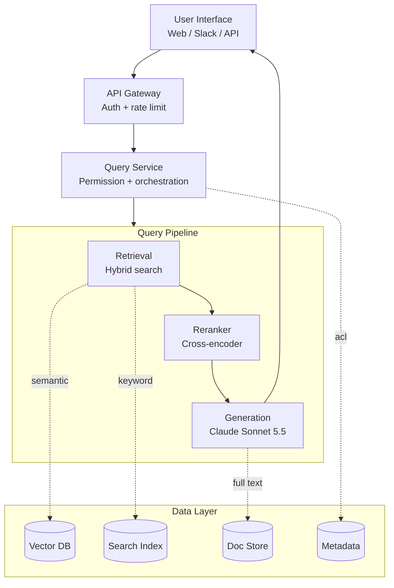
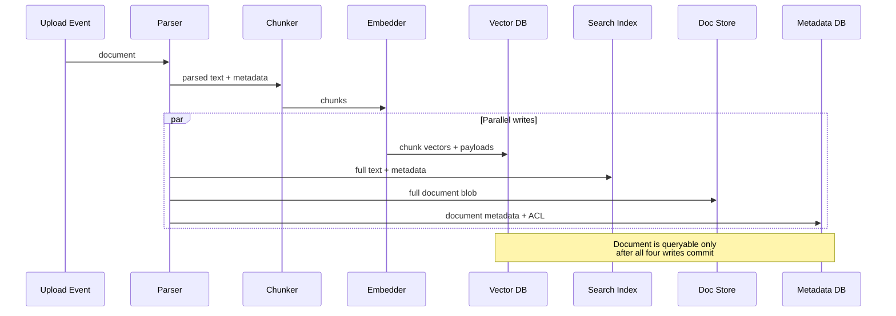
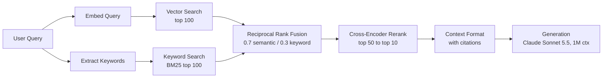

# Case Study: Enterprise RAG System

This case study walks through designing a production RAG system for enterprise document search. It covers requirements gathering, architecture decisions, and implementation details.

## Table of Contents

- [Problem Statement](#problem-statement)
- [Requirements Analysis](#requirements-analysis)
- [System Architecture](#system-architecture)
- [Component Deep Dives](#component-deep-dives)
- [Scaling Considerations](#scaling-considerations)
- [Cost Analysis](#cost-analysis)
- [Lessons Learned](#lessons-learned)
- [Interview Walkthrough](#interview-walkthrough)

---

## Problem Statement

### Scenario

A financial services company wants to build an AI-powered search system for their internal documentation:
- 500,000 documents (policies, procedures, research reports)
- 5,000 employees across multiple departments
- Documents updated daily
- Strict compliance and audit requirements
- Need to answer questions with cited sources

### Current Pain Points

- Employees spend 2+ hours/day searching for information
- Keyword search returns too many irrelevant results
- Knowledge is siloed across departments
- New employees take months to become productive

---

## Requirements Analysis

### Functional Requirements

| Requirement | Priority | Notes |
|-------------|----------|-------|
| Natural language Q&A | P0 | Core feature |
| Source citations | P0 | Compliance requirement |
| Multi-document reasoning | P1 | Connect information across docs |
| Follow-up questions | P1 | Conversational context |
| Document summarization | P2 | Quick overview of long docs |

### Non-Functional Requirements

| Requirement | Target | Rationale |
|-------------|--------|-----------|
| Latency (P95) | < 5 seconds | User experience |
| Accuracy | > 90% | Trust and adoption |
| Availability | 99.9% | Business critical |
| Concurrent users | 500 | Peak usage |
| Document freshness | < 1 hour | Policy updates |

### Security Requirements

- Role-based access control (RBAC)
- Audit logging of all queries
- No data leaves the company's cloud boundary: model calls go through private endpoints (Bedrock, Google Cloud or Foundry) under zero data retention, and US-only processing where compliance requires it (about a 10% premium; see [Cost Analysis](#cost-analysis))
- PII detection and handling

---

## System Architecture

### High-Level Architecture

```
┌─────────────────────────────────────────────────────────────────────────┐
│                           User Interface                                │
│  (Web App, Slack Bot, API)                                             │
└─────────────────────────────┬───────────────────────────────────────────┘
                              │
                              ▼
┌─────────────────────────────────────────────────────────────────────────┐
│                          API Gateway                                    │
│  • Authentication    • Rate Limiting    • Request Routing              │
└─────────────────────────────┬───────────────────────────────────────────┘
                              │
                              ▼
┌─────────────────────────────────────────────────────────────────────────┐
│                        Query Service                                    │
│  • Query understanding   • Permission check   • Orchestration          │
└─────────────────────────────┬───────────────────────────────────────────┘
                              │
        ┌─────────────────────┼─────────────────────┐
        │                     │                     │
        ▼                     ▼                     ▼
┌───────────────┐   ┌───────────────┐   ┌───────────────┐
│   Retrieval   │   │   Reranking   │   │  Generation   │
│   Service     │   │   Service     │   │   Service     │
│               │   │               │   │               │
│ • Hybrid      │   │ • Cross-      │   │ • LLM         │
│   search      │   │   encoder     │   │ • Prompt      │
│ • Filtering   │   │ • Scoring     │   │   building    │
└───────┬───────┘   └───────────────┘   └───────────────┘
        │
        ▼
┌─────────────────────────────────────────────────────────────────────────┐
│                        Data Layer                                       │
│                                                                         │
│  ┌─────────────┐  ┌─────────────┐  ┌─────────────┐  ┌─────────────┐   │
│  │  Vector DB  │  │ Search Index│  │  Doc Store  │  │  Metadata   │   │
│  │  (Qdrant)   │  │ (Elastic)   │  │   (S3)      │  │  (Postgres) │   │
│  └─────────────┘  └─────────────┘  └─────────────┘  └─────────────┘   │
│                                                                         │
└─────────────────────────────────────────────────────────────────────────┘

┌─────────────────────────────────────────────────────────────────────────┐
│                      Ingestion Pipeline                                 │
│  Document Upload → Parse → Chunk → Embed → Index → Store Metadata      │
└─────────────────────────────────────────────────────────────────────────┘
```

Rendered as a flow diagram (the layered system fans out through the query pipeline and converges through the data layer):



### Technology Choices (October 2026)

| Component | Choice | Rationale |
|-----------|--------|-----------|
| **Primary LLM** | Claude Sonnet 5.5 ($2 / $10 per 1M tokens) | Flat pricing to 1M tokens, so multi-document contexts carry no long-context surcharge; zero data retention available; reachable through Bedrock, Google Cloud and Foundry private endpoints; retirement not before September 28, 2027 |
| **Hard cross-document analysis** | Claude Opus 5.5 ($4 / $20) or GPT-6.1 Sol ($2 / $10) | Escalation path for the few percent of queries that need multi-step reasoning across many documents. Keep GPT-6.1 Sol prompts under 272K input tokens, above which OpenAI bills the whole request at $4 / $15 |
| **Summarization and bulk tier** | Gemini 3.8 Flash ($0.75 / $3.75 introductory; $1.50 / $7.50 from January 1, 2027) | Cheap 1M-token context for document summaries and ingestion-time enrichment. Budget on the 2027 price |
| **Embeddings** | text-embedding-3-large ($0.13 per 1M) | Proven and unchanged. If you expect to change models, Cohere Embed 5 (Pro and Fast) and the Voyage 4 family each share one embedding space across sizes, so you can index with the large model and query with the cheap one without re-indexing |
| **Vector DB** | Qdrant 1.19 (self-hosted) | Performance, payload filtering and on-prem compliance. The `memory` setting (pinned, cached, cold) replaces `on_disk` and `always_ram` for tiering |
| **Reranker** | Qwen3-Reranker-8B (self-hosted, Apache 2.0) or an API reranker (Cohere Rerank 4, Voyage rerank-3) | The API rerankers accept 32K tokens per document, which removes the old 512-token truncation of long chunks |

> [!NOTE]
> **Shift: bigger retrieval units, priced deliberately.** With 1M-token windows on the main frontier models, teams retrieve whole document sections (10K to 50K tokens) for multi-document questions instead of hunting for the perfect 512-token chunk. The bill scales with it: at 1.5M queries a month, every extra 10K input tokens per query costs about $30,000 a month on Sonnet 5.5. Route by query type: small chunks for lookups, large sections only for synthesis questions. Pricing rules differ by vendor too: Claude 4.6 and later bill flat to 1M, while OpenAI reprices the whole request above 272K input tokens.

---

## Component Deep Dives

### Document Ingestion Pipeline

```python
class IngestionPipeline:
    def __init__(self):
        self.parser = DocumentParser()
        self.chunker = SemanticChunker(
            chunk_size=512,
            chunk_overlap=50
        )
        self.embedder = OpenAIEmbedder(model="text-embedding-3-large")
        self.vector_db = QdrantClient()
        self.metadata_db = PostgresClient()
    
    async def ingest(self, document: Document, user_context: UserContext):
        # 1. Parse document
        parsed = self.parser.parse(document)
        
        # 2. Extract metadata
        metadata = self.extract_metadata(parsed, document)
        
        # 3. Chunk
        chunks = self.chunker.chunk(parsed.text)
        
        # 4. Generate embeddings (batch)
        embeddings = await self.embedder.embed_batch([c.text for c in chunks])
        
        # 5. Store in vector DB with metadata
        points = [
            {
                "id": f"{document.id}_{i}",
                "vector": embedding,
                "payload": {
                    "document_id": document.id,
                    "chunk_index": i,
                    "text": chunk.text,
                    "department": metadata.department,
                    "access_level": metadata.access_level,
                    "created_at": metadata.created_at.isoformat()
                }
            }
            for i, (chunk, embedding) in enumerate(zip(chunks, embeddings))
        ]
        
        await self.vector_db.upsert(collection_name="documents", points=points)
        
        # 6. Store full document
        await self.doc_store.put(document.id, parsed.text)
        
        # 7. Store metadata
        await self.metadata_db.insert_document(document.id, metadata)
        
        # 8. Index in Elasticsearch for keyword search
        await self.es_client.index(
            index="documents",
            id=document.id,
            body={"text": parsed.text, **metadata.to_dict()}
        )
```

The code reads as a linear sequence, but four of the writes happen in parallel. A sequence diagram makes the fanout explicit, which matters for understanding partial-failure modes:



### Query Processing

```python
class QueryService:
    def __init__(self):
        self.retriever = HybridRetriever()
        self.reranker = CrossEncoderReranker()  # self-hosted Qwen3-Reranker or an API reranker
        self.generator = LLMGenerator()
        self.guardrails = GuardrailPipeline()
    
    async def process_query(
        self,
        query: str,
        user_context: UserContext,
        conversation_history: list[Message] = None
    ) -> QueryResponse:
        
        # 1. Input guardrails
        guardrail_result = self.guardrails.check_input(query)
        if not guardrail_result.passed:
            return QueryResponse(
                answer="I cannot help with that request.",
                blocked=True,
                reason=guardrail_result.reason
            )
        
        # 2. Query understanding (optional: rewrite query)
        processed_query = await self.understand_query(query, conversation_history)
        
        # 3. Retrieve candidates with permission filtering
        candidates = await self.retriever.search(
            query=processed_query,
            filters=self.build_permission_filter(user_context),
            top_k=50
        )
        
        # 4. Rerank
        reranked = await self.reranker.rerank(
            query=processed_query,
            documents=candidates,
            top_k=10
        )
        
        # 5. Build context
        context = self.build_context(reranked)
        
        # 6. Generate answer
        answer = await self.generator.generate(
            query=query,
            context=context,
            conversation_history=conversation_history
        )
        
        # 7. Output guardrails
        guardrail_result = self.guardrails.check_output(answer, context)
        if not guardrail_result.passed:
            answer = self.fallback_response()
        
        # 8. Build response with citations
        return QueryResponse(
            answer=answer,
            sources=[self.format_source(doc) for doc in reranked[:5]],
            confidence=self.calculate_confidence(reranked)
        )
    
    def build_permission_filter(self, user_context: UserContext) -> dict:
        return {
            "should": [
                {"key": "access_level", "match": {"value": "public"}},
                {"key": "department", "match": {"value": user_context.department}},
                {"key": "access_list", "match": {"any": [user_context.user_id]}}
            ]
        }
```

### Hybrid Retrieval

```python
class HybridRetriever:
    def __init__(self, vector_weight: float = 0.7, keyword_weight: float = 0.3):
        self.vector_db = QdrantClient()
        self.es_client = ElasticsearchClient()
        self.embedder = OpenAIEmbedder()
        self.vector_weight = vector_weight
        self.keyword_weight = keyword_weight
    
    async def search(
        self,
        query: str,
        filters: dict,
        top_k: int = 50
    ) -> list[Document]:
        
        # Parallel retrieval
        vector_results, keyword_results = await asyncio.gather(
            self.vector_search(query, filters, top_k * 2),
            self.keyword_search(query, filters, top_k * 2)
        )
        
        # Reciprocal Rank Fusion
        fused = self.rrf_fusion(
            [vector_results, keyword_results],
            weights=[self.vector_weight, self.keyword_weight],
            k=60
        )
        
        return fused[:top_k]
    
    async def vector_search(self, query: str, filters: dict, top_k: int):
        query_embedding = await self.embedder.embed(query)
        
        # Query API: Qdrant 1.19 removed the legacy /search endpoint from its REST schema
        response = await self.vector_db.query_points(
            collection_name="documents",
            query=query_embedding,
            query_filter=filters,
            limit=top_k
        )
        results = response.points
        
        return [
            Document(
                id=r.payload["document_id"],
                chunk_id=r.id,
                text=r.payload["text"],
                score=r.score,
                metadata=r.payload
            )
            for r in results
        ]
    
    def rrf_fusion(self, result_lists: list, weights: list, k: int = 60) -> list:
        scores = defaultdict(float)
        docs = {}
        
        for results, weight in zip(result_lists, weights):
            for rank, doc in enumerate(results):
                rrf_score = weight / (k + rank + 1)
                scores[doc.chunk_id] += rrf_score
                docs[doc.chunk_id] = doc
        
        sorted_ids = sorted(scores.keys(), key=lambda x: scores[x], reverse=True)
        return [docs[id] for id in sorted_ids]
```

The hybrid retrieval flow at a glance. Two parallel retrievers, then RRF fuses them with weighted ranks, then a cross-encoder reranks the top candidates before context formatting:



### Generation with Long Context

```python
import anthropic

class LongContextGenerator:
    """
    Claude Sonnet 5.5 over whole document sections. Documents sit in the
    system prompt, ahead of the conversation, so follow-up questions over the
    same documents hit the prompt cache (reads bill at $0.20 per 1M on
    Sonnet 5.5, 0.1x the input price).
    """
    def __init__(self):
        # Use AsyncAnthropicBedrockMantle, AsyncAnthropicVertex or AsyncAnthropicFoundry
        # instead to keep traffic on a private cloud endpoint
        self.client = anthropic.AsyncAnthropic()

    async def generate(
        self,
        query: str,
        context_docs: list[Document],
        conversation_history: list[dict] | None = None
    ) -> str:
        instructions = (
            "You are an enterprise knowledge assistant. "
            "Answer only from the provided documents. "
            "Cite every claim using [[DocName:PageNumber]] format."
        )
        doc_blocks = [
            {"type": "text", "text": f"<document name='{d.name}'>\n{d.text}\n</document>"}
            for d in context_docs
        ]
        doc_blocks[-1]["cache_control"] = {"type": "ephemeral"}  # cache through the last document

        # No temperature: Sonnet 5.5 rejects non-default sampling values,
        # and the Python SDK 1.x removed them from the method signature
        response = await self.client.messages.create(
            model="claude-sonnet-5-5",
            max_tokens=4096,
            system=[{"type": "text", "text": instructions}, *doc_blocks],
            output_config={"effort": "medium"},
            messages=[
                # History holds only prior questions and answers, never the documents,
                # so the cached system-plus-documents prefix stays byte-identical
                *(conversation_history or []),
                {"role": "user", "content": f"Question: {query}"},
            ],
        )
        # Adaptive thinking is on by default, so keep only the text blocks
        return "".join(b.text for b in response.content if b.type == "text")
```

> [!TIP]
> **Production choice vs. newest release**
> Sonnet 5.5 shipped September 28, 2026. Teams with prompts and guardrails tuned on Sonnet 5 or Sonnet 4.6 should run their eval set before switching, because the upgrade is not drop-in:
> - **Request shape**: forced `tool_choice` (`any` or `tool`) returns 400, `thinking: {type: "disabled"}` returns 400 (the lowest setting is `between_tools`), and non-default `temperature` returns 400 (already true on Sonnet 5).
> - **Behavior**: effort levels were recalibrated, so re-run the effort sweep instead of carrying settings over.
> - **Deadlines**: anything still pinned to Sonnet 4.5 has to move regardless; it retires November 30, 2026 on the Claude API and Foundry.
> - **SDK**: Anthropic's Python SDK 1.0 (August 20, 2026) moved to `httpx2`, and httpx-based tracing and test mocks can silently miss calls. Verify span counts after upgrading.

---

## Scaling Considerations

### Handling 500K Documents

```python
# Sharding strategy for Qdrant
qdrant_config = {
    "collection": "documents",
    "vectors": {
        "size": 3072,  # text-embedding-3-large
        "distance": "Cosine"
    },
    "optimizers": {
        "indexing_threshold": 20000  # Build index after 20K points
    },
    "replication_factor": 2,  # High availability
    "shard_number": 4  # Distribute across nodes
}
```

### Handling 500 Concurrent Users

```
Load Balancer
     │
     ├──► Query Service (replica 1)
     ├──► Query Service (replica 2)
     ├──► Query Service (replica 3)
     └──► Query Service (replica 4)
            │
            ├──► Vector DB (3-node cluster)
            ├──► LLM API (with retry/fallback)
            └──► Elasticsearch (3-node cluster)
```

### Caching Strategy

```python
class QueryCache:
    def __init__(self):
        self.exact_cache = Redis(ttl=3600)  # 1 hour
        self.semantic_cache = SemanticCache(threshold=0.95, ttl=1800)
    
    async def get_or_compute(self, query: str, user_context: UserContext) -> QueryResponse:
        # Check exact cache
        cache_key = self.make_key(query, user_context.permissions)
        cached = await self.exact_cache.get(cache_key)
        if cached:
            return cached
        
        # Check semantic cache
        similar = await self.semantic_cache.find_similar(query, user_context.permissions)
        if similar:
            return similar
        
        # Compute
        response = await self.query_service.process_query(query, user_context)
        
        # Cache result
        await self.exact_cache.set(cache_key, response)
        await self.semantic_cache.add(query, user_context.permissions, response)
        
        return response
```

---

## Cost Analysis

### Monthly Cost Estimate (500 Users, 100 Queries/User/Day, October 2026 List Prices)

| Component | Calculation | Monthly Cost |
|-----------|-------------|--------------|
| LLM (Claude Sonnet 5.5, US-only processing at 1.1x) | 1.5M queries × (2K input tokens × $2.20/1M + 500 output tokens × $11/1M) | ~$14,850 |
| Embeddings | ~75M query tokens plus re-embedding ~2% of the corpus daily (~50M tokens a day, ~1.5B a month) at $0.13/1M | ~$200 |
| Reranking (Voyage rerank-3) | 1.5M queries × 50 candidates × ~400 tokens × $0.05/1M | ~$1,500 |
| Vector DB (Qdrant) | 3-node cluster | ~$1,500 |
| Elasticsearch | 3-node cluster | ~$2,000 |
| Compute (Query Service) | 4 instances | ~$1,000 |
| **Total** | | **~$21,000/month** |

Model lines use Claude API list prices; Bedrock and Google Cloud price Claude on their own rate cards, so confirm the regional rate on the platform you deploy to. The embedding and reranking lines also send document text to a vendor, so they count against the cloud-boundary requirement: reach them through a private endpoint in your cloud or self-host them. Two assumptions carry this table. First, 2K-token contexts: if 20% of queries pull 20K-token sections for synthesis, add about $12,000 a month (300K queries × 18K extra tokens × $2.20/1M). Second, 500 output tokens: Sonnet 5.5 runs adaptive thinking by default and thinking bills as output, so measure real output per query before trusting the LLM line.

### Cost Optimization Opportunities

1. **Response caching**: 30% cache hit rate → ~$4,500 savings on LLM
2. **Prompt caching**: Cache the static system prompt and instructions; cache reads bill at 0.1x the input price
3. **Model routing**: Route simple lookups to a cheaper tier (Claude Haiku 4.5 at $1 / $5, or Gemini 3.8 Flash) → up to 40% LLM savings; Haiku 5.5 is announced but not yet released, so plan the migration
4. **Residency only where required**: Pin US-only processing for the departments that need it and run the rest on global endpoints → recovers up to ~$1,350 (the 10% uplift)
5. **Batch re-embedding**: Run nightly re-embedding through OpenAI's Batch API → 50% off that line
6. **Self-hosted reranker**: Replace the API reranker with Qwen3-Reranker → eliminates ~$1,500 of API spend, but one dedicated H100 runs about $2,000 a month at the October 1 Silicon Data index ($2.77 per GPU-hour), so this saves money only on GPU capacity you already have. It is also the default if compliance rules out sending candidate passages to a reranking API

---

## Lessons Learned

### What Worked Well

1. **Hybrid search**: Combined semantic + keyword significantly improved recall
2. **Reranking**: 15% improvement in top-5 precision
3. **Clear citations**: Built trust with users
4. **Permission filtering at retrieval**: No post-hoc filtering needed

### Challenges Encountered

1. **Table extraction**: PDFs with complex tables required custom parsing
2. **Acronyms**: Domain-specific acronyms needed expansion
3. **Freshness**: 1-hour freshness required streaming ingestion
4. **Long documents**: 100+ page documents needed hierarchical chunking

### What We Would Do Differently

1. Start with better document parsing earlier
2. Build evaluation pipeline before scaling
3. Implement query logging from day one
4. Create feedback loop with users sooner

---

## Interview Walkthrough

### How to Present This in an Interview

**Opening (2 min):**
"I will design an enterprise RAG system for internal document search. Let me clarify a few requirements first..."

**Requirements (3 min):**
- Ask about scale, latency, accuracy targets
- Clarify security requirements
- Understand document types and update frequency

**High-Level Design (5 min):**
- Draw the architecture diagram
- Explain key components
- Justify technology choices

**Deep Dive (10 min):**
- Retrieval strategy (hybrid search, why)
- Security (permission filtering at query time)
- Generation (prompt engineering, citations)
- Scaling (sharding, caching, replicas)

**Tradeoffs (5 min):**
- Cost vs latency (model selection)
- Context size vs cost (whole sections help synthesis but multiply input spend)
- Accuracy vs latency (reranking adds time)
- Freshness vs cost (streaming vs batch)

**Monitoring (2 min):**
- Key metrics (latency, accuracy, user feedback)
- How to detect issues
- Continuous improvement loop

---

*Next: [Case Study: Conversational AI Agent](02-conversational-agent.md)*
