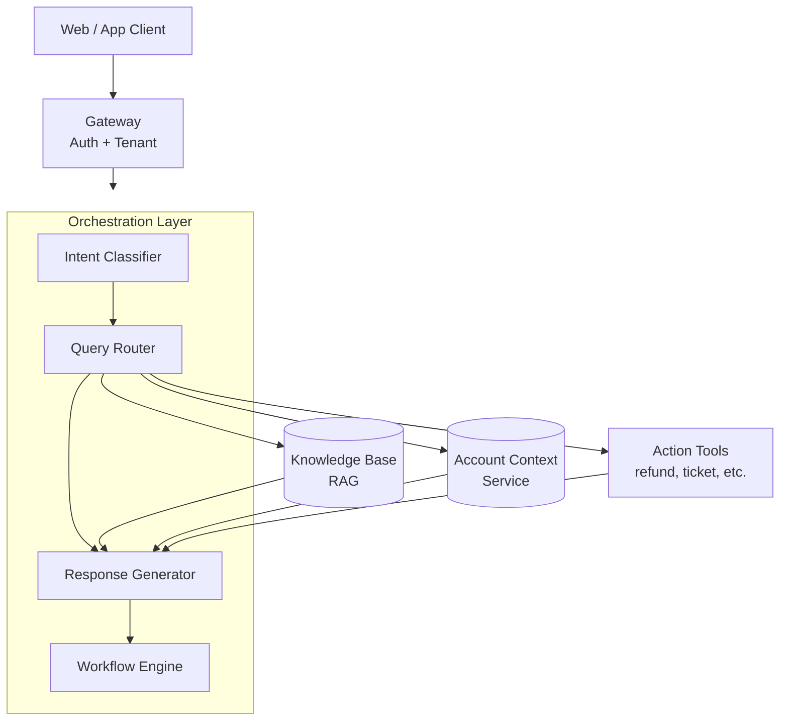
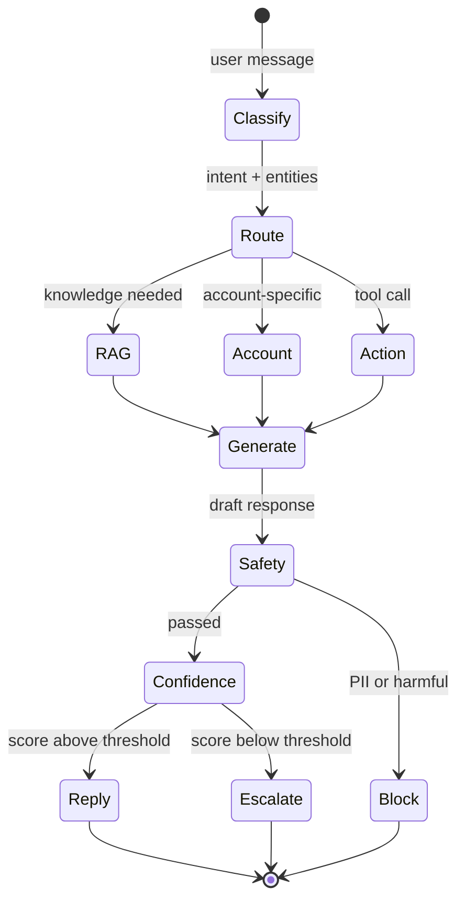
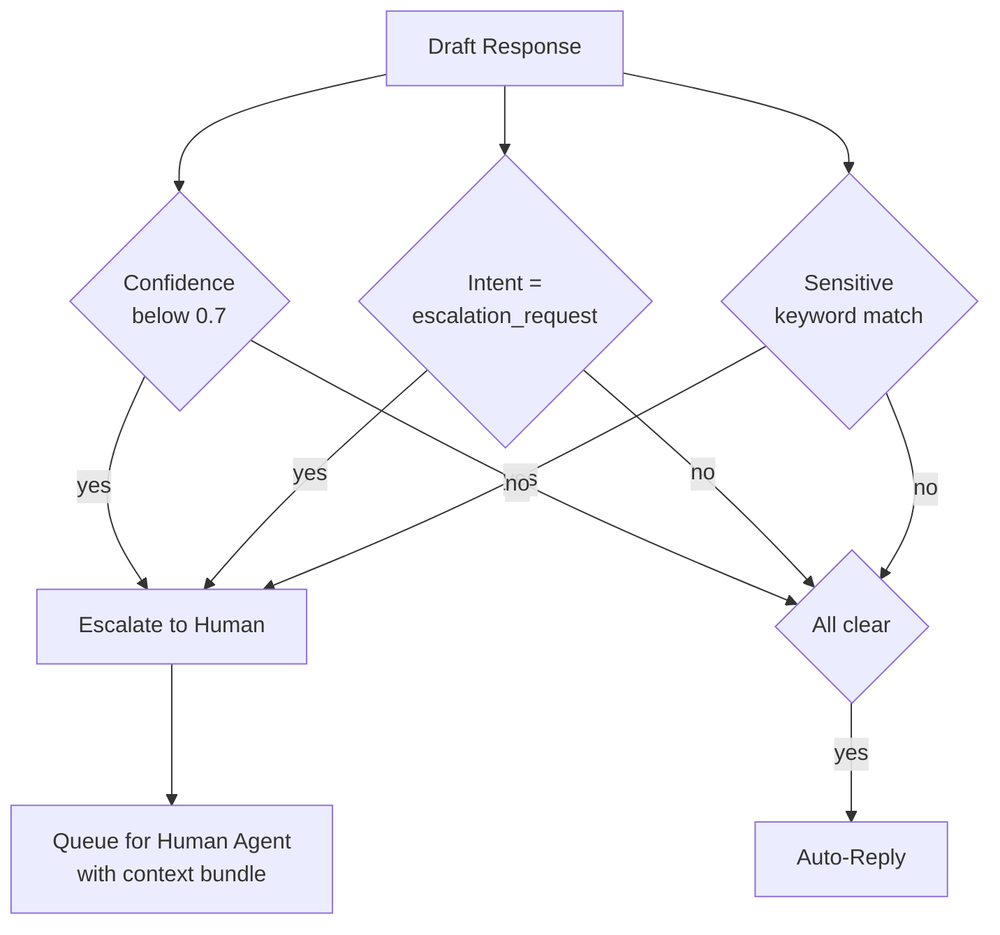

# Case Study: Customer Support Conversational Agent

This case study walks through designing a production customer support agent for a B2B SaaS company.

## Table of Contents

- [Problem Statement](#problem-statement)
- [Requirements Analysis](#requirements-analysis)
- [Architecture Design](#architecture-design)
- [Component Deep Dives](#component-deep-dives)
- [Reliability Patterns](#reliability-patterns)
- [Evaluation and Monitoring](#evaluation-and-monitoring)
- [Cost Analysis](#cost-analysis)
- [Lessons Learned](#lessons-learned)
- [Interview Walkthrough](#interview-walkthrough)

---

## Problem Statement

**Company:** B2B SaaS platform with 50K enterprise customers

**Current state:**
- 500K support tickets per month
- Average response time: 4 hours
- Customer satisfaction (CSAT): 72%
- Support team: 100 agents

**Goal:**
- Reduce response time to < 5 minutes for common queries
- Improve CSAT to > 85%
- Handle 60% of tickets without human intervention
- Maintain quality for escalated tickets

---

## Requirements Analysis

### Functional Requirements

| Requirement | Description | Priority |
|-------------|-------------|----------|
| Query understanding | Classify intent, extract entities | P0 |
| Knowledge retrieval | Search product docs, FAQs, past tickets | P0 |
| Account context | Access user's subscription, history | P0 |
| Response generation | Natural, accurate, helpful responses | P0 |
| Conversation memory | Multi-turn context | P0 |
| Action execution | Create tickets, trigger workflows | P1 |
| Human escalation | Handoff with full context when needed | P0 |
| Billing inquiries | Handle sensitive financial data | P1 |

### Non-Functional Requirements

| Requirement | Target | Rationale |
|-------------|--------|-----------|
| Latency (TTFT) | < 1s | User expectation for chat |
| Latency (full) | < 5s | Maintain engagement |
| Availability | 99.9% | Business-critical |
| Accuracy | > 95% | Customer trust |
| Escalation rate | < 40% | Cost efficiency |
| CSAT | > 85% | Business goal |

### Security Requirements

- No PII in logs
- Tenant isolation (customers only see their data)
- Audit trail for all actions
- SOC 2 compliance
- Tell users they are talking to an AI: the EU AI Act's Article 50 transparency duties have applied since August 2, 2026, and the Commission's guidelines say general public awareness of AI does not make an interaction obvious

---

## Architecture Design

### High-Level Architecture

```
┌─────────────────────────────────────────────────────────────────┐
│                      CUSTOMER SUPPORT AGENT                      │
├─────────────────────────────────────────────────────────────────┤
│                                                                  │
│  ┌─────────────┐     ┌─────────────┐     ┌─────────────┐        │
│  │   Web/App   │────▶│   Gateway   │────▶│    Auth     │        │
│  │   Client    │     │             │     │  + Tenant   │        │
│  └─────────────┘     └──────┬──────┘     └─────────────┘        │
│                             │                                    │
│                             ▼                                    │
│  ┌──────────────────────────────────────────────────────────┐   │
│  │                   ORCHESTRATION LAYER                     │   │
│  │  ┌────────────────────────────────────────────────────┐  │   │
│  │  │  Intent        Query          Response    Workflow │  │   │
│  │  │  Classifier → Router →        Generator → Engine   │  │   │
│  │  └────────────────────────────────────────────────────┘  │   │
│  └──────────────────────────────────────────────────────────┘   │
│                             │                                    │
│         ┌───────────────────┼───────────────────┐               │
│         ▼                   ▼                   ▼               │
│  ┌─────────────┐     ┌─────────────┐     ┌─────────────┐        │
│  │  Knowledge  │     │   Account   │     │   Action    │        │
│  │    Base     │     │   Context   │     │   Tools     │        │
│  │   (RAG)     │     │   Service   │     │             │        │
│  └─────────────┘     └─────────────┘     └─────────────┘        │
│                                                                  │
└─────────────────────────────────────────────────────────────────┘
```

Rendered as a layered flow. The orchestration layer dispatches to three parallel context sources, then assembles them in the response generator:



### Conversation Flow

```
User Message
    │
    ▼
┌─────────────────┐
│ Intent Classify │─── billing, technical, account, general, escalation
└────────┬────────┘
         │
         ▼
┌─────────────────┐
│ Query Routing   │─── Which knowledge sources? Which tools?
└────────┬────────┘
         │
    ┌────┴────┬────────────┐
    ▼         ▼            ▼
┌───────┐ ┌───────┐ ┌──────────┐
│  RAG  │ │Account│ │ Actions  │
│ Query │ │Context│ │ (if any) │
└───┬───┘ └───┬───┘ └────┬─────┘
    │         │          │
    └────┬────┴──────────┘
         │
         ▼
┌─────────────────┐
│    Generate     │
│    Response     │
└────────┬────────┘
         │
         ▼
┌─────────────────┐
│  Safety Check   │─── PII, harmful, off-topic
└────────┬────────┘
         │
         ▼
┌─────────────────┐
│  Confidence     │─── Low confidence? Escalate
│    Check        │
└────────┬────────┘
         │
         ▼
    Response / Escalation
```

A turn is a state machine. The two gates that matter for cost and trust are *safety* (must pass before leaving the system) and *confidence* (decides escalation vs auto-reply):



---

## Component Deep Dives

### Intent Classification

```python
INTENT_SCHEMA = {
    "type": "object",
    "properties": {
        "intent": {"type": "string",
                   "enum": ["billing", "technical", "account", "general", "escalation_request"]},
        "entities": {"type": "array", "items": {
            "type": "object",
            "properties": {"type": {"type": "string"}, "value": {"type": "string"}},
            "required": ["type", "value"],
            "additionalProperties": False,
        }},
        "confidence": {"type": "number"},
    },
    "required": ["intent", "entities", "confidence"],
    "additionalProperties": False,
}

class IntentClassifier:
    async def classify(self, message: str, history: list[dict]) -> dict:
        # Smallest tier: GPT-6 Luna ($0.10 / $0.50 per 1M tokens). Track p95
        # latency and use the lowest reasoning effort that holds accuracy.
        result = await client.responses.create(
            model="gpt-6-luna",
            instructions="Classify the customer's latest message.",
            input=[*history[-4:], {"role": "user", "content": message}],
            text={"format": {"type": "json_schema", "name": "intent",
                             "schema": INTENT_SCHEMA, "strict": True}},
        )
        return json.loads(result.output_text)
```

### Knowledge Base (Hybrid Retrieval Plus Rerank)

```python
class SupportKnowledgeBase:
    async def retrieve(self, query: str, tenant_id: str, top_k: int = 8) -> list[dict]:
        # Long-context models tempt teams to skip reranking and pass 50 chunks.
        # At 500K conversations a month, a reranker (about $0.001 per turn) is
        # far cheaper than paying for 40 extra chunks of input on every turn.
        candidates = await self.sources.search(
            query, filters={"tenant_id": tenant_id}, limit=50
        )
        return await self.reranker.rerank(query, candidates, top_k=top_k)
```

### Response Generation (Tiered: Claude Haiku 4.5 and Sonnet 5.5)

The 2025 version of this design toggled extended thinking per request on one model. That knob is gone on the newest models: Sonnet 5.5 runs adaptive thinking by default and returns 400 on `thinking: {type: "disabled"}`, and depth is set with `output_config.effort`. Haiku 4.5 rejects the effort parameter. The per-request dial is now **model routing plus effort**.

```python
class ResponseGenerator:
    ROUTINE_MODEL = "claude-haiku-4-5"   # $1 / $5 per 1M; no thinking unless enabled
    COMPLEX_MODEL = "claude-sonnet-5-5"  # $2 / $10 per 1M; adaptive thinking on by default

    async def generate(self, query: str, context: list[dict]) -> dict:
        is_complex = self.detect_complexity(query)  # billing disputes, multi-account issues
        request = {
            "model": self.COMPLEX_MODEL if is_complex else self.ROUTINE_MODEL,
            "max_tokens": 4096,
            "system": SUPPORT_SYSTEM_PROMPT,
            "messages": [{"role": "user", "content": f"Context: {context}\nQuery: {query}"}],
        }
        if is_complex:
            request["output_config"] = {"effort": "medium"}
        response = await self.anthropic.messages.create(**request)
        text = "".join(b.text for b in response.content if b.type == "text")
        return {"response": text, "model": request["model"]}
```

Budget latency per path, not per system. Thinking tokens arrive before the first visible token, and ~1K of them take seconds at typical output speeds, so the complex path cannot meet the 1-second TTFT target. Give complex billing turns their own latency target and stream a status line while the model works, or send `thinking: {type: "between_tools"}` on routes that do not need up-front reasoning and measure whether quality holds.

> [!NOTE]
> **Production wisdom: budget for forced migrations.** Support teams spend months tuning guardrails around one model's tone and refusal patterns, and that tuning does not transfer for free. Sonnet 4.5 retires November 30, 2026. Haiku 4.5 has a Claude API retirement floor of October 15, 2026 (no notice issued yet, and Anthropic gives at least 60 days) and retires on Foundry November 15, while Haiku 5.5 is announced but not released. Keep a regression set of real conversations with expected tone, escalation and refusal behavior, and run it on every model change.

---

## Reliability Patterns

### Confidence-Based Escalation

```python
class EscalationHandler:
    def __init__(self, confidence_threshold: float = 0.7):
        self.threshold = confidence_threshold
    
    async def check_escalation(
        self,
        response: dict,
        intent: str,
        user_request: str
    ) -> dict:
        should_escalate = False
        reason = None
        
        # Low confidence
        if response["confidence"] < self.threshold:
            should_escalate = True
            reason = "low_confidence"
        
        # Explicit escalation request
        if intent == "escalation_request":
            should_escalate = True
            reason = "user_requested"
        
        # Sensitive topics
        if await self.is_sensitive(user_request):
            should_escalate = True
            reason = "sensitive_topic"
        
        if should_escalate:
            return await self.create_escalation(response, reason)
        
        return {"escalate": False, "response": response}
    
    async def is_sensitive(self, message: str) -> bool:
        sensitive_keywords = [
            "legal", "lawsuit", "lawyer",
            "refund", "cancel subscription",
            "competitor", "data breach"
        ]
        return any(kw in message.lower() for kw in sensitive_keywords)
```

The escalation decision combines three independent signals. Any one of them triggers handoff. Visualizing it as a decision tree makes the OR semantics obvious and easy to extend with a fourth signal:



### Multi-Turn Memory

```python
class ConversationMemory:
    def __init__(self, max_turns: int = 10):
        self.max_turns = max_turns
        self.redis = Redis()
    
    async def get_history(self, session_id: str) -> list[dict]:
        key = f"conversation:{session_id}"
        history = await self.redis.get(key)
        if history:
            return json.loads(history)
        return []
    
    async def add_turn(
        self,
        session_id: str,
        user_message: str,
        assistant_message: str
    ):
        history = await self.get_history(session_id)
        
        history.append({"role": "user", "content": user_message})
        history.append({"role": "assistant", "content": assistant_message})
        
        # Trim to max turns
        if len(history) > self.max_turns * 2:
            history = history[-(self.max_turns * 2):]
        
        await self.redis.setex(
            f"conversation:{session_id}",
            3600,  # 1 hour TTL
            json.dumps(history)
        )
```

---

## Evaluation and Monitoring

### Quality Metrics

```python
class QualityMonitor:
    def __init__(self, sample_rate: float = 0.05):
        self.sample_rate = sample_rate
        self.judge = LLMJudge()
    
    async def evaluate(self, conversation: dict):
        if random.random() > self.sample_rate:
            return
        
        scores = await self.judge.evaluate(
            query=conversation["user_message"],
            response=conversation["assistant_message"],
            context=conversation["context"],
            criteria={
                "relevance": "Does the response address the user's question?",
                "accuracy": "Is the information correct based on the context?",
                "helpfulness": "Would this response help the user?",
                "tone": "Is the tone professional and empathetic?"
            }
        )
        
        # Record metrics
        for criterion, score in scores.items():
            metrics.record(f"quality_{criterion}", score)
```

> [!WARNING]
> **Check that your traces still see the model calls.** OpenAI's Python SDK 3.0 (August 12, 2026) and Anthropic's Python SDK 1.0 (August 20, 2026) both moved to `httpx2`. Anthropic's migration guide warns that OpenTelemetry's HTTPX instrumentation, Sentry's httpx integration, respx, pytest-httpx and vcrpy can silently miss SDK requests unless `httpx2.alias_httpx()` runs before anything imports httpx. A sampling monitor like the one above then reports healthy numbers on a shrinking sample. Upgrade the SDKs as a set and compare span counts against request counts before and after.

### Dashboard Metrics

| Metric | Target | Actual |
|--------|--------|--------|
| Latency (TTFT) | < 1s | 0.8s |
| Latency (full) | < 5s | 3.2s |
| Accuracy | > 95% | 94.3% |
| Escalation rate | < 40% | 38% |
| CSAT | > 85% | 87% |
| Resolution rate | > 60% | 62% |

---

## Cost Analysis

### Per-Conversation Cost Breakdown (October 2026 List Prices)

Assumes 4 turns per conversation and about 3K input tokens per turn (system prompt, retrieved chunks, account context, history).

| Component | Cost | Notes |
|-----------|------|-------|
| Intent classification | $0.0003 | GPT-6 Luna ($0.10 / $0.50): one call per turn, ~500 in / 50 out |
| Retrieval and reranking | $0.0040 | Query embeddings plus 50 candidates × ~400 tokens reranked per turn (Voyage rerank-3, $0.05 per 1M tokens): ~$0.001 per turn |
| Generation, routine path | $0.0136 | Claude Haiku 4.5 on 80% of conversations: 4 × (3K in / 250 out) = $0.017, weighted 0.8 |
| Generation, complex path | $0.0148 | Claude Sonnet 5.5 on 20%: same turns plus ~1K thinking tokens per turn = $0.074, weighted 0.2 |
| Quality sampling | $0.0013 | 5% of conversations scored by a mid-tier judge |
| **Total** | **~$0.034** | **Per conversation, before prompt caching** |

The complex path is 20% of traffic and over 40% of the model spend, mostly thinking tokens billed at the output rate. Prompt caching the static system prompt and tool definitions trims the input share (cache reads bill at 0.1x on both models).

### Monthly Cost Projection

| Item | Calculation | Cost |
|------|-------------|------|
| Conversations | 500K × $0.034 | $17,000 |
| Infrastructure | Fixed | $2,000 |
| Human escalations | 190K × $5 (human cost) | $950,000 |
| **Total** | | $969,000 |
| **Savings vs all-human** | 500K × $5 - $969K | ~$1.53M/month |

Model spend is under 2% of the total. The lever that matters is the escalation rate: every point of escalation moved to a correct auto-resolution saves about $25,000 a month (5K conversations × $5), more than the entire model bill.

---

## Lessons Learned

### What Worked

1. **Intent-based routing** reduced latency by focusing retrieval on relevant sources
2. **Confidence-based escalation** maintained quality while reducing human load
3. **Account context** made responses more personalized and accurate
4. **Structured outputs and pinned prompt versions** improved consistency more than sampling settings did. Temperature is no longer a dependable knob: the newest Claude models return 400 on non-default values, and GPT-6 Astra does not accept the parameter

### What Did Not Work Initially

1. **Single model for everything** - routing to different models for different tasks improved quality
2. **Too high escalation threshold** - started at 0.9 confidence, causing too many escalations
3. **Full conversation history** - exceeded context limits, switched to summarization

### Recommendations

1. Start with high escalation rate and lower gradually as confidence improves
2. Monitor CSAT by escalation reason to identify weak areas
3. Retrain embeddings on support-specific vocabulary
4. Build feedback loop: agents tag escalated conversations for training data

---

## Interview Walkthrough

**Interviewer:** "Design an AI customer support system for a SaaS company."

**Strong response pattern:**

1. **Clarify requirements** (2 min)
   - "What's the ticket volume? What channels? What's the current CSAT?"

2. **State constraints explicitly**
   - "Key constraints: accuracy over speed, escalation without lost context, tenant isolation"

3. **High-level architecture** (3 min)
   - Draw the flow: intent → routing → RAG → generation → safety → response/escalation

4. **Deep dive on critical component** (5 min)
   - "Let me detail the confidence-based escalation..."

5. **Address reliability** (3 min)
   - "For reliability, I would use self-consistency for billing queries and a multi-provider fallback. The fallback has to cross vendors: Anthropic's status feed shows at least 12 major or critical incidents from mid-August to late September 2026, and one OpenAI incident on September 29 degraded its API for over 5 hours, so a 99.9% target cannot rest on one provider"

6. **Metrics and monitoring** (2 min)
   - "Key metrics: CSAT, resolution rate, escalation rate, accuracy sampling"

7. **Cost consideration** (1 min)
   - "At 500K conversations/month, cost per conversation matters. Model routing helps."

---

## References

- Anthropic Customer Support Agent Guide: https://platform.claude.com/docs/en/about-claude/use-case-guides/customer-support-chat
- LangChain Agents: https://docs.langchain.com/oss/python/langchain/agents

---

*Next: [Financial Analysis Case Study](03-financial-analysis.md)*
