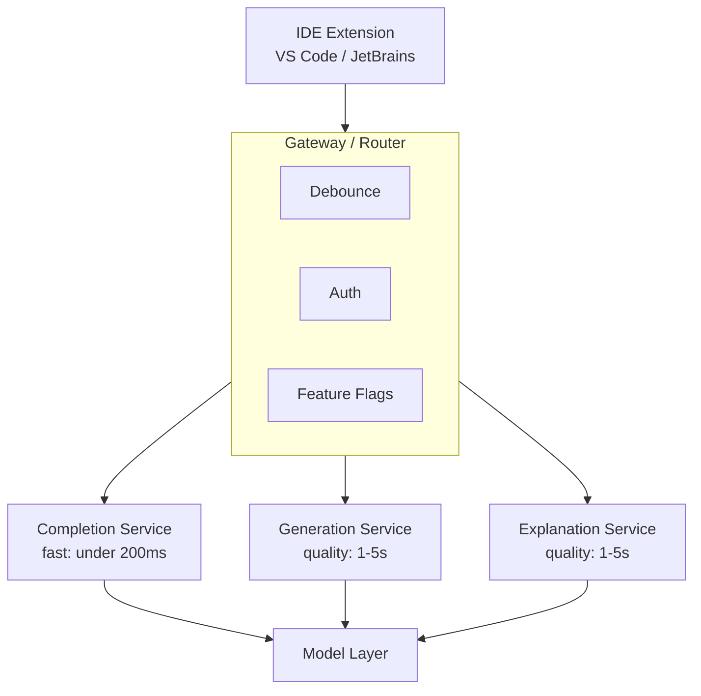
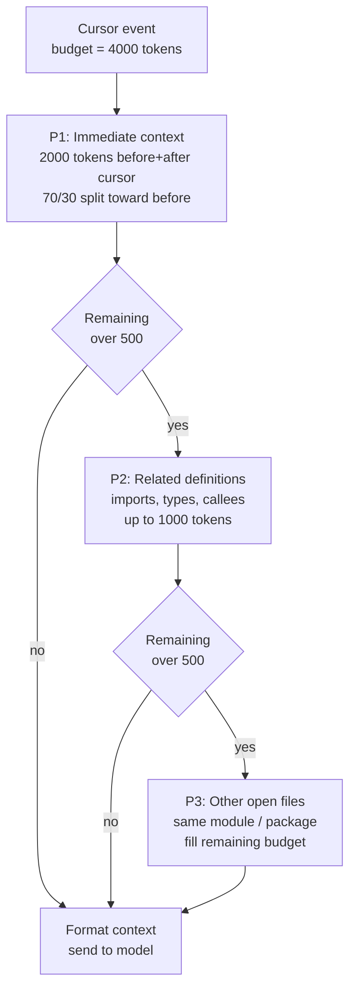
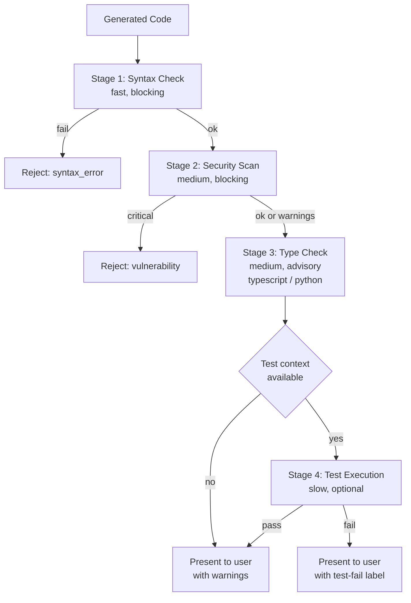

# Case Study: AI Code Assistant

This case study covers designing a production code assistant that provides real-time suggestions, code generation, and debugging help.

## Table of Contents

- [Problem Statement](#problem-statement)
- [Requirements Analysis](#requirements-analysis)
- [Architecture Design](#architecture-design)
- [Code Generation Pipeline](#code-generation-pipeline)
- [Quality Assurance](#quality-assurance)
- [Performance Optimization](#performance-optimization)
- [Results and Metrics](#results-and-metrics)
- [Interview Walkthrough](#interview-walkthrough)

---

## Problem Statement

**Company:** Developer tools company building IDE extension

**Goal:**
- Real-time code completion as developers type
- Multi-line code generation from natural language
- Code explanation and debugging assistance
- Support for 20+ programming languages

**Constraints:**
- Latency < 200ms for completions (typing flow)
- Latency < 3s for generation (acceptable pause)
- Security: no code leaves customer infrastructure (enterprise option)
- Cost: sustainable at scale (millions of developers)

---

## Requirements Analysis

### Functional Requirements

| Feature | Description | Latency Target |
|---------|-------------|----------------|
| Inline completion | Complete current line/block | < 200ms |
| Multi-line generation | Generate function/class from comment | < 3s |
| Code explanation | Explain selected code | < 5s |
| Error fixing | Suggest fixes for errors | < 2s |
| Refactoring | Suggest improvements | < 5s |
| Documentation | Generate docstrings | < 2s |

### Quality Requirements

| Dimension | Target | Measurement |
|-----------|--------|-------------|
| Acceptance rate | > 30% | Suggestions accepted / shown |
| Syntax correctness | > 99% | Compiles/parses successfully |
| Security | 0 vulnerabilities | SAST scan pass rate |
| Relevance | > 85% | User ratings |

---

## Architecture Design

### High-Level Architecture

```
┌─────────────────────────────────────────────────────────────────┐
│                    CODE ASSISTANT ARCHITECTURE                   │
├─────────────────────────────────────────────────────────────────┤
│                                                                  │
│  ┌─────────────┐                                                │
│  │     IDE     │                                                │
│  │  Extension  │                                                │
│  └──────┬──────┘                                                │
│         │                                                        │
│         ▼                                                        │
│  ┌─────────────────────────────────────────────────────────┐    │
│  │                    GATEWAY / ROUTER                      │    │
│  │  ┌──────────┐  ┌──────────┐  ┌──────────┐              │    │
│  │  │ Debounce │  │  Auth    │  │ Feature  │              │    │
│  │  │          │  │          │  │  Flags   │              │    │
│  │  └──────────┘  └──────────┘  └──────────┘              │    │
│  └─────────────────────────┬───────────────────────────────┘    │
│                            │                                     │
│         ┌──────────────────┼──────────────────┐                 │
│         ▼                  ▼                  ▼                 │
│  ┌─────────────┐    ┌─────────────┐    ┌─────────────┐         │
│  │  Completion │    │ Generation  │    │ Explanation │         │
│  │   Service   │    │  Service    │    │  Service    │         │
│  │  (fast)     │    │ (quality)   │    │ (quality)   │         │
│  └──────┬──────┘    └──────┬──────┘    └──────┬──────┘         │
│         │                  │                  │                  │
│         └──────────────────┼──────────────────┘                 │
│                            ▼                                     │
│                    ┌─────────────┐                              │
│                    │   Model     │                              │
│                    │   Layer     │                              │
│                    └─────────────┘                              │
│                                                                  │
└─────────────────────────────────────────────────────────────────┘
```

The architecture as a flow. Three service tiers split by latency vs quality (completion is sub-200ms, generation and explanation are quality-prioritized) all share one model layer:



### Context Assembly

```python
class CodeContextAssembler:
    """
    Assemble context for code completion.
    Challenge: Balance context richness with latency.
    """
    
    def __init__(self, max_tokens: int = 4000):
        self.max_tokens = max_tokens
    
    def assemble(
        self,
        cursor_position: dict,
        file_content: str,
        open_files: list[dict],
        project_context: dict
    ) -> str:
        context_parts = []
        remaining_tokens = self.max_tokens
        
        # Priority 1: Immediate context (before and after cursor)
        immediate = self.get_immediate_context(
            file_content, cursor_position, tokens=2000
        )
        context_parts.append(immediate)
        remaining_tokens -= count_tokens(immediate)
        
        # Priority 2: Related imports and definitions
        if remaining_tokens > 500:
            related = self.get_related_definitions(
                file_content, cursor_position, tokens=min(1000, remaining_tokens)
            )
            context_parts.append(related)
            remaining_tokens -= count_tokens(related)
        
        # Priority 3: Other open files (same module/package)
        if remaining_tokens > 500:
            other_files = self.get_relevant_open_files(
                open_files, cursor_position, tokens=remaining_tokens
            )
            context_parts.append(other_files)
        
        return self.format_context(context_parts)
    
    def get_immediate_context(
        self,
        content: str,
        cursor: dict,
        tokens: int
    ) -> str:
        lines = content.split("\n")
        cursor_line = cursor["line"]
        
        # Get lines before cursor (more important)
        before_ratio = 0.7
        before_tokens = int(tokens * before_ratio)
        after_tokens = tokens - before_tokens
        
        # Expand outward from cursor
        before_lines = lines[:cursor_line]
        after_lines = lines[cursor_line:]
        
        # Truncate to fit
        before_text = self.truncate_to_tokens(
            "\n".join(before_lines), before_tokens, from_end=True
        )
        after_text = self.truncate_to_tokens(
            "\n".join(after_lines), after_tokens, from_end=False
        )
        
        return f"{before_text}\n<CURSOR>\n{after_text}"
```

Context assembly is a priority-driven budget allocation. The model only sees what survives the 4000-token cap, so the order matters: immediate code first (always fits), then related definitions, then other open files only if budget remains:



---

## Code Generation Pipeline

### Completion Service

Reasoning models are the wrong tool for keystroke-level completions: thinking tokens alone blow a 200ms budget. Inline completion runs on a small fill-in-the-middle (FIM) model that you host, which also satisfies the "no code leaves customer infrastructure" option.

```python
class InlineCompletion:
    """
    Sub-200ms FIM completions from a small self-hosted model inside the
    customer VPC. Served by vLLM (pin >= 0.30.0) with speculative decoding
    set at server start, e.g.
    vllm serve <checkpoint> --speculative-config '{"method": "eagle3", ...}'
    """
    def __init__(self, client):
        self.client = client   # OpenAI-compatible client for the in-VPC server
        self.model = "fim-8b"  # your FIM-tuned checkpoint of an Apache 2.0 base

    async def complete(self, prefix: str, suffix: str) -> str:
        resp = await self.client.completions.create(
            model=self.model,
            prompt=self.build_fim_prompt(prefix, suffix),  # sentinel tokens are model-specific
            max_tokens=64,
            temperature=0.0,
            stop=["\n\n"],
        )
        return resp.choices[0].text
```

**Base model and license.** Candidates are small permissively licensed models such as IBM Granite 4.2 (3B and 8B dense, Apache 2.0), or Qwen3.8-27B (Apache 2.0) if the latency budget allows. Read the license before the benchmark: Qwen3.8-Flash-Next ships under Qwen Community License 1.0, which requires a separate license for any coding-assistant business regardless of revenue, and that is exactly this product. On the serving side, speculative decoding has moved past Medusa: vLLM supports EAGLE-3, MTP, draft-model and DFlash methods, and Inco AI reports 2.7x to 3.4x speedups for DFlash 2 on Qwen3.8-27B (vendor-reported).

### Generation Service (Agentic Refactors)

```python
class AgenticGeneration:
    """
    Claude Sonnet 5.5 for multi-file refactors, run as a tool-using agent.
    """
    async def refactor_module(self, folder_path: str):
        agent = CodingAgent(
            model="claude-sonnet-5-5",
            effort="medium",  # start here and sweep; thinking: disabled returns 400
            tools=["ls", "read_file", "write_file", "test_runner"],
        )
        
        # Agent explores codebase, understands dependencies, and applies fix
        return await agent.run(f"Refactor {folder_path} to use async/await.")
```

> [!TIP]
> **Production choice (October 2026).** Claude Sonnet 5.5 ($2 / $10) is the default for in-IDE agentic work. On Terminal-Bench 4.0, Anthropic reports 70.6% for Sonnet 5.5 and 66.4% for Opus 5.5 (xhigh effort); both are vendor-reported, and neither model appears on the tbench.ai leaderboard, whose September 21, 2026 update tops out at 58.18% (GPT-6 Astra, max effort). The 2025 "toggle thinking" pattern does not carry over: `thinking: {type: "disabled"}` returns 400 on Sonnet 5.5, so effort is the dial, with `between_tools` as the lowest thinking setting. Price capability per task, not per token: on DeepSWE v1.1, GPT-6 Astra (xhigh), Gemini 3.8 Flash (high) and Claude Opus 5 (max) tie at 74% pass@1, at $4.43, $2.36 and $11.84 per task.

### Model Provider Strategy

Enterprise buyers now ask who owns the model behind the assistant, and model suppliers ask who owns the assistant. Cursor became part of SpaceX in August 2026 (a deal reported at about $60 billion in stock), and Grok model launches now appear on Cursor's blog. Two weeks later, on August 28, OpenAI told SpaceX it would wind down its contract supplying OpenAI models to Cursor, with a proposed shutoff of November 12, 2026, and that it would not supply future models, including GPT-6 Astra (which shipped September 3), while Cursor is under SpaceX ownership. A change of ownership is set to take a frontier model family out of a leading coding product on about 11 weeks' notice. That makes **model neutrality a product requirement** in both directions:

- Route every model call through a gateway with per-tenant model allowlists, so an enterprise can exclude a provider without a code change, and losing a provider is a routing change rather than a rewrite. Keep the eval suite runnable against at least two model families so a forced swap starts from measured quality. The same gateway serves the code-stays-in-VPC tenants: it sends their generation and refactor traffic to models in the tenant's own Bedrock, Google Cloud or Foundry account, or to a self-hosted open-weight model, never to a vendor's public endpoint.
- Track each provider's data-use and retention terms per tenant. Discounted endpoints that let the vendor use your traffic (Meta's Muse Spark 1.3 contributor tier at $0.10 / $0.20, for example) must be opt-in.
- Expect assurance questions beyond SOC 2. AIUC-1 is one emerging answer: an agent-specific security, safety and reliability certification, audited with adversarial testing and kept only through at least quarterly testing plus an annual audit (Cursor announced its certification on August 13, 2026).

---

## Quality Assurance

### Multi-Stage Verification

The verifier is a fail-fast gauntlet. Cheap checks (syntax) run first and block hard; expensive checks (test execution) run last and only when context allows. Any blocking failure short-circuits the rest:



```python
class CodeVerifier:
    """
    Verify generated code before presenting to user.
    """
    
    async def verify(self, code: str, language: str, context: str) -> VerificationResult:
        results = {}
        
        # Stage 1: Syntax check (fast, blocking)
        syntax_ok = self.check_syntax(code, language)
        if not syntax_ok:
            return VerificationResult(passed=False, reason="syntax_error")
        
        # Stage 2: Security scan (medium, blocking)
        security = await self.security_scan(code, language)
        if security.has_critical:
            return VerificationResult(passed=False, reason="security_vulnerability")
        results["security"] = security
        
        # Stage 3: Type check if applicable (medium)
        if language in ["typescript", "python"]:
            type_result = await self.type_check(code, context, language)
            results["types"] = type_result
        
        # Stage 4: Test execution if available (slow, optional)
        if self.has_test_context(context):
            test_result = await self.run_tests(code, context)
            results["tests"] = test_result
        
        return VerificationResult(
            passed=True,
            details=results,
            warnings=security.warnings if security else []
        )
    
    def check_syntax(self, code: str, language: str) -> bool:
        parsers = {
            "python": self.parse_python,
            "javascript": self.parse_javascript,
            "typescript": self.parse_typescript,
            # ... other languages
        }
        
        parser = parsers.get(language)
        if not parser:
            return True  # Cannot verify, assume OK
        
        try:
            parser(code)
            return True
        except SyntaxError:
            return False
    
    async def security_scan(self, code: str, language: str) -> SecurityResult:
        # Run static analysis
        if language == "python":
            result = await self.run_bandit(code)
        elif language in ["javascript", "typescript"]:
            result = await self.run_eslint_security(code)
        else:
            result = await self.run_semgrep(code, language)
        
        return result
```

### Acceptance Optimization

```python
class AcceptanceOptimizer:
    """
    Learn from user acceptance patterns to improve suggestions.
    """
    
    def __init__(self):
        self.feedback_store = FeedbackStore()
    
    async def record_feedback(
        self,
        suggestion_id: str,
        accepted: bool,
        edited: bool,
        context_hash: str
    ):
        await self.feedback_store.record({
            "suggestion_id": suggestion_id,
            "accepted": accepted,
            "edited": edited,
            "context_hash": context_hash,
            "timestamp": datetime.now()
        })
    
    async def should_show_suggestion(
        self,
        suggestion: str,
        confidence: float,
        user_context: dict
    ) -> bool:
        # Historical acceptance rate for similar suggestions
        historical_rate = await self.get_historical_rate(
            user_context["user_id"],
            user_context["language"],
            confidence
        )
        
        # Threshold based on user preferences
        threshold = user_context.get("suggestion_threshold", 0.3)
        
        # Only show if likely to be accepted
        return (confidence * historical_rate) > threshold
```

---

## Performance Optimization

### Latency Optimization

| Technique | Impact | Implementation |
|-----------|--------|----------------|
| Request debouncing | -50ms | 150ms debounce in IDE |
| Connection pooling | -30ms | Persistent HTTP/2 |
| Model warm-up | -100ms | Pre-loaded models |
| Speculative decoding | -40% | Draft model + verify |
| Edge caching | -80ms | CDN for common patterns |

### Caching Strategy

```python
class CompletionCache:
    """
    Multi-level cache for completions.
    """
    
    def __init__(self):
        self.local_cache = LRUCache(max_size=10000)  # In-memory
        self.redis_cache = Redis()  # Distributed
    
    def get_cache_key(self, context: str) -> str:
        # Hash context for cache key
        # Include language and cursor position
        return hashlib.sha256(context.encode()).hexdigest()[:16]
    
    async def get(self, context: str) -> str | None:
        key = self.get_cache_key(context)
        
        # Check local first
        local = self.local_cache.get(key)
        if local:
            return local
        
        # Check distributed
        remote = await self.redis_cache.get(f"completion:{key}")
        if remote:
            self.local_cache.set(key, remote)
            return remote
        
        return None
    
    async def set(self, context: str, completion: str):
        key = self.get_cache_key(context)
        
        # Set in both caches
        self.local_cache.set(key, completion)
        await self.redis_cache.setex(
            f"completion:{key}",
            3600,  # 1 hour TTL
            completion
        )
```

---

## Results and Metrics

### Performance Results

| Metric | Target | Achieved |
|--------|--------|----------|
| Completion latency (p50) | < 200ms | 145ms |
| Completion latency (p99) | < 500ms | 380ms |
| Generation latency (p50) | < 3s | 2.1s |
| Syntax correctness | > 99% | 99.5% |
| Security (0 high severity) | 100% | 99.8% |
| Acceptance rate | > 30% | 34% |

### Cost Analysis (October 2026)

| Request type | Assumption | Cost per 1M requests | Notes |
|--------------|------------|----------------------|-------|
| **Inline completion, self-hosted 8B model** | ~2K in / 30 out; ~15 completions/s per H100 within the 200ms SLO | ~$50 | H100 at $2.77 per GPU-hour (Silicon Data index, October 1, 2026). Measure your own throughput; prefix caching across keystrokes raises it |
| **Inline completion via API (GPT-6 Luna)** | Same tokens at $0.10 / $0.50 per 1M | ~$215 | Overflow path when the self-hosted pool saturates; not available to code-stays-in-VPC tenants |
| **Multi-line generation (Claude Sonnet 5.5)** | 8K in / 500 out, up-front thinking off (`between_tools`) to hold the 3s budget | ~$21,000 | $0.021 per request; letting it think ~1K tokens adds about $0.01 and seconds of latency |
| **Agentic refactor (Claude Sonnet 5.5)** | ~750K in at 90% cache hits, ~6K out | ~$390,000 | $0.39 per task; derivation in the [Autonomous Coding Agent cost breakdown](07-autonomous-coding-agent.md#cost-breakdown) |

*Blended (98% completions, 2% agentic refactors): about $7,850 per 1M requests, and over 99% of it is the agentic tasks. The completion fleet is a rounding error; the agent's prompt-cache hit rate is the budget. At a 50% hit rate the same refactor costs about $1.08, nearly three times as much.*

---

## Interview Walkthrough

**Interviewer:** "Design an AI code assistant for an IDE."

**Strong response:**

1. **Clarify requirements** (1 min)
   - "What's the target latency for completions vs generations?"
   - "Enterprise deployment with on-prem option?"
   - "Do enterprise customers exclude any model providers or require specific data-use terms?"
   - "What languages need support?"

2. **Identify the key challenge** (1 min)
   - "The core tension is latency vs quality. Completions need < 200ms for typing flow, but good code requires rich context and verification."

3. **Two-tier architecture** (3 min)
   - "I would separate completions (fast) from generations (quality):"
   - "Completions: smaller model, minimal context, speculative decoding"
   - "Generations: frontier model, best-of-N, syntax and security verification"

4. **Context assembly** (2 min)
   - "Context is critical. I prioritize: immediate code > imports/definitions > open files"
   - "For completions, I cap at 2K tokens for speed"
   - "For generations, I can use 8K+ tokens for better understanding"

5. **Quality assurance** (2 min)
   - "Every suggestion runs through: syntax check, security scan, optionally type check"
   - "For generations, I use best-of-N with 8 candidates, filter invalid, score and select"
   - "This catches security vulnerabilities before they reach the developer"

6. **Latency optimization** (2 min)
   - "Request debouncing in IDE, connection pooling, model warm-up"
   - "Speculative decoding for 40% latency reduction"
   - "Caching common patterns (imports, boilerplate)"

---

## References

- GitHub Copilot Architecture: https://github.blog/
- Codestral: https://mistral.ai/news/codestral/
- CodeLlama: https://ai.meta.com/blog/code-llama-large-language-model-coding/

---

*Next: [Content Moderation Case Study](05-content-moderation.md)*
