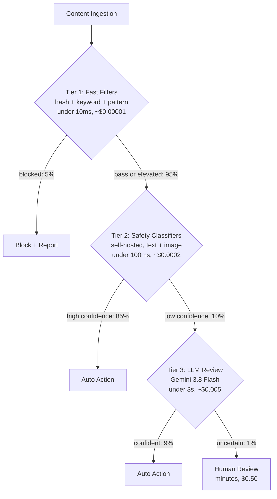
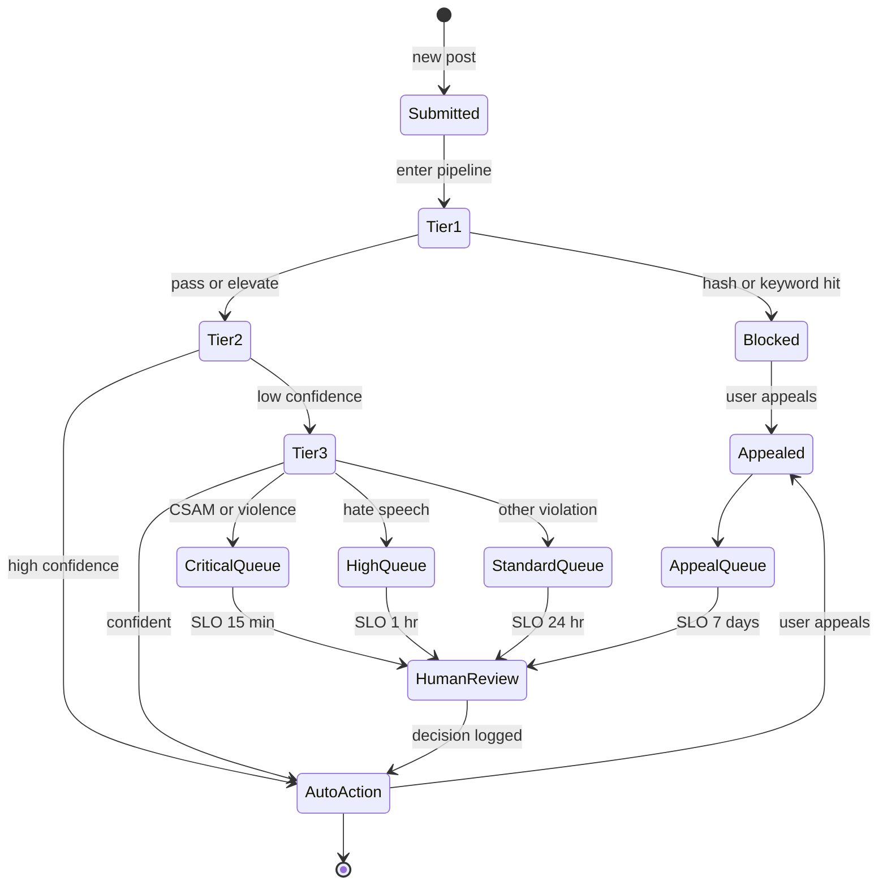

# Case Study: Content Moderation at Scale

This case study covers designing an AI-powered content moderation system for a social platform handling millions of posts daily.

## Table of Contents

- [Problem Statement](#problem-statement)
- [Requirements Analysis](#requirements-analysis)
- [Architecture Design](#architecture-design)
- [Classification Pipeline](#classification-pipeline)
- [Human-in-the-Loop](#human-in-the-loop)
- [Adversarial Robustness](#adversarial-robustness)
- [Results and Metrics](#results-and-metrics)
- [Interview Walkthrough](#interview-walkthrough)

---

## Problem Statement

**Company:** Social media platform with 50M daily active users

**Current state:**
- 10M posts per day
- 500 human moderators
- Average review time: 4 hours
- False positive rate: 15%
- Harmful content reaching users: 2%

**Goals:**
- Reduce harmful content exposure to < 0.1%
- Review priority content in < 15 minutes
- Reduce false positive rate to < 5%
- Scale without linear moderator growth

---

## Requirements Analysis

### Content Categories

| Category | Severity | Action | Latency |
|----------|----------|--------|---------|
| CSAM | Critical | Block + Report | Immediate |
| Violence/Gore | High | Block + Review | < 1 min |
| Hate speech | High | Block + Review | < 5 min |
| Harassment | Medium | Review + Warn | < 15 min |
| Spam | Medium | Deprioritize | < 1 hour |
| Misinformation | Medium | Label + Review | < 1 hour |
| Adult content | Low | Age-gate | < 1 hour |

### Accuracy Requirements

| Metric | Target | Rationale |
|--------|--------|-----------|
| Recall (harmful) | > 99% | Minimize harm exposure |
| Precision | > 95% | Minimize false positives |
| Latency (critical) | < 1 min | Prevent spread |
| Latency (standard) | < 15 min | Balance resources |

---

## Architecture Design

### High-Level Architecture

```
┌─────────────────────────────────────────────────────────────────┐
│                  CONTENT MODERATION PIPELINE                     │
├─────────────────────────────────────────────────────────────────┤
│                                                                  │
│  ┌─────────────┐                                                │
│  │   Content   │                                                │
│  │   Ingestion │                                                │
│  └──────┬──────┘                                                │
│         │                                                        │
│         ▼                                                        │
│  ┌─────────────────────────────────────────────────────────┐    │
│  │                   TIER 1: FAST FILTERS                   │    │
│  │  ┌──────────┐  ┌──────────┐  ┌──────────┐              │    │
│  │  │  Hash    │  │ Keyword  │  │  Known   │              │    │
│  │  │ Matching │  │ Blocklist│  │ Patterns │              │    │
│  │  └──────────┘  └──────────┘  └──────────┘              │    │
│  └──────────────────────────┬──────────────────────────────┘    │
│                             │                                    │
│         ┌───────────────────┼───────────────────┐               │
│         │ Blocked           │ Pass              │ Elevated      │
│         ▼                   ▼                   ▼               │
│  ┌─────────────┐    ┌─────────────────────────────────────┐    │
│  │   Block +   │    │          TIER 2: ML MODELS          │    │
│  │   Report    │    │  ┌────────┐  ┌────────┐  ┌────────┐│    │
│  └─────────────┘    │  │ Vision │  │  Text  │  │ Multi- ││    │
│                     │  │ Model  │  │ Model  │  │ modal  ││    │
│                     │  └────────┘  └────────┘  └────────┘│    │
│                     └──────────────────┬──────────────────┘    │
│                                        │                        │
│         ┌──────────────────────────────┼──────────────────┐    │
│         │ High Confidence              │ Low Confidence   │    │
│         ▼                              ▼                   │    │
│  ┌─────────────┐              ┌─────────────────────────┐ │    │
│  │ Auto Action │              │    TIER 3: LLM REVIEW   │ │    │
│  └─────────────┘              │  (nuanced cases)        │ │    │
│                               └────────────┬────────────┘ │    │
│                                            │               │    │
│                        ┌───────────────────┼──────────────┐│    │
│                        │ Confident         │ Uncertain    ││    │
│                        ▼                   ▼              ││    │
│                 ┌─────────────┐    ┌─────────────┐       ││    │
│                 │ Auto Action │    │   Human     │       ││    │
│                 └─────────────┘    │   Review    │       ││    │
│                                    └─────────────┘       ││    │
│                                                          ││    │
└──────────────────────────────────────────────────────────┘│    │
```

The tiered pipeline as a decision tree. Each tier escalates only what it cannot decide cheaply; percentages are shares of all posts. The cost per decision spans roughly 1:50,000 from Tier 1 to Tier 4, so getting routing right is the main lever for unit economics:



### Processing Tiers

| Tier | Method | Latency | Cost per decision | Coverage (share of all posts) |
|------|--------|---------|-------------------|-------------------------------|
| 1 | Hash/keyword/pattern | < 10ms | ~$0.00001 | 5% blocked |
| 2 | Self-hosted safety classifiers | < 100ms | ~$0.0002 | 85% auto-decided |
| 3 | LLM review (Gemini 3.8 Flash) | < 3s | ~$0.005 | 10% reviewed, 9% decided |
| 4 | Human review | Minutes | $0.50 | 1% escalated |

---

## Classification Pipeline

### Tier 1: Fast Filters

```python
class FastFilters:
    """
    Immediate blocking for known harmful content.
    No false positives for matches.
    """
    
    def __init__(self):
        self.hash_db = PhotoDNADatabase()  # CSAM detection
        self.keyword_filter = KeywordBlocklist()
        self.pattern_matcher = RegexPatterns()
    
    async def filter(self, content: Content) -> FilterResult:
        # CSAM hash matching (highest priority)
        if content.has_media:
            hash_match = await self.hash_db.check(content.media_hashes)
            if hash_match:
                return FilterResult(
                    action="block_report",
                    reason="csam_hash_match",
                    confidence=1.0,
                    tier=1
                )
        
        # Keyword blocklist
        if content.text:
            keyword_match = self.keyword_filter.check(content.text)
            if keyword_match and keyword_match.severity == "critical":
                return FilterResult(
                    action="block_review",
                    reason=f"keyword_{keyword_match.category}",
                    confidence=0.99,
                    tier=1
                )
        
        # Pattern matching (phone numbers in suspicious context, etc)
        pattern_match = self.pattern_matcher.check(content.text)
        if pattern_match:
            return FilterResult(
                action="elevate",
                reason=f"pattern_{pattern_match.type}",
                confidence=pattern_match.confidence,
                tier=1
            )
        
        return FilterResult(action="continue", tier=1)
```

### Tier 2: Self-Hosted Safety Classifiers

```python
class SafetyClassifiers:
    """
    Cheap, fast, high volume: every post that clears Tier 1 lands here.
    An open multimodal safety model (for example Llama Guard 4 12B) plus
    in-house classifiers fine-tuned on your own policy labels, served on
    your GPUs. Escalate to Tier 3 only on low confidence.
    """
    async def classify(self, content: Content) -> dict:
        scores = await asyncio.gather(
            self.policy_model.score(text=content.text, images=content.images),
            self.spam_model.score(content),
            self.nsfw_vision_model.score(content.images),
        )
        verdict = self.combine(scores)  # per-category thresholds tuned on human labels
        return {"verdict": verdict.label, "confidence": verdict.confidence, "tier": 2}
```

### Tier 3: Nuanced LLM Review (Gemini 3.8 Flash)

```python
from google.genai import types

class NuanceReviewer:
    """
    Native multimodal review for the ~10% of posts the classifiers are unsure
    about: sarcasm, regional slang, text on a protest sign, meme context.
    Gemini 3.8 Flash reads text inside images, so no separate OCR call here.
    """
    async def review(self, content: Content, context: dict) -> dict:
        parts = [
            POLICY_PROMPT,
            content.text,
            *[types.Part.from_bytes(data=img, mime_type="image/jpeg") for img in content.images],
        ]
        response = await self.client.aio.models.generate_content(
            model="gemini-3.8-flash",
            contents=parts,
            config=types.GenerateContentConfig(
                response_mime_type="application/json",
                response_schema=ReviewResult,
                thinking_config=types.ThinkingConfig(thinking_level="low"),
            ),
        )
        return json.loads(response.text)
```

---

## Human-in-the-Loop

### Review Queue Management

Every piece of content traverses a lifecycle from submission to a terminal state. The lifecycle as a state machine makes SLOs concrete: each priority lane has a different target time-to-terminal, and an appeal can transition back to pending:



```python
class ReviewQueueManager:
    """
    Prioritize and route content to human moderators.
    """
    
    def __init__(self):
        self.queues = {
            "critical": PriorityQueue(),  # CSAM, violence - human SLO 15 min
            "high": PriorityQueue(),      # Hate speech - human SLO 1 hour
            "standard": PriorityQueue(),  # Other violations - human SLO 24 hours
            "appeals": PriorityQueue()    # User appeals - SLO 7 days
        }
    
    async def enqueue(self, content: Content, result: ReviewResult):
        priority = self.calculate_priority(content, result)
        
        item = ReviewItem(
            content_id=content.id,
            content=content,
            ai_analysis=result,
            priority=priority,
            enqueued_at=datetime.now()
        )
        
        queue_name = self.get_queue(result.severity)
        await self.queues[queue_name].put(item)
        
        # Alert if critical
        if queue_name == "critical":
            await self.alert_moderators(item)
    
    def calculate_priority(self, content: Content, result: ReviewResult) -> float:
        priority = 0.0
        
        # Severity weight
        severity_weights = {"critical": 100, "high": 50, "medium": 20, "low": 5}
        priority += severity_weights.get(result.severity, 0)
        
        # Reach weight (viral content prioritized)
        priority += min(content.reach_score * 10, 50)
        
        # Confidence inverse (less confident = higher priority)
        priority += (1 - result.confidence) * 30
        
        return priority
```

### Moderator Interface

```python
class ModeratorDecision:
    async def submit(
        self,
        moderator_id: str,
        content_id: str,
        decision: str,
        reason: str,
        notes: str = None
    ):
        # Record decision
        await self.store_decision({
            "content_id": content_id,
            "moderator_id": moderator_id,
            "decision": decision,
            "reason": reason,
            "notes": notes,
            "ai_recommendation": await self.get_ai_result(content_id),
            "decided_at": datetime.now()
        })
        
        # Execute action
        await self.execute_action(content_id, decision)
        
        # Update ML models with feedback
        await self.feedback_loop.record(
            content_id=content_id,
            ai_prediction=await self.get_ai_result(content_id),
            human_decision=decision
        )
```

---

## Adversarial Robustness

### Evasion Techniques and Defenses

| Evasion Technique | Defense |
|-------------------|---------|
| Character substitution (h@te) | Normalization + homoglyph mapping |
| Image text (text in images) | OCR pipeline |
| Invisible characters | Unicode normalization |
| Context manipulation | Multi-turn analysis |
| Encoded content | Decoding pipeline |
| Adversarial images | Robust vision models |
| AI-generated imagery passed off as real | Read provenance metadata and watermark detectors; label per policy |

### Defensive Pipeline

```python
class AdversarialDefense:
    def __init__(self):
        self.normalizer = TextNormalizer()
        self.ocr = OCRPipeline()
        self.decoder = ContentDecoder()
    
    def preprocess(self, content: Content) -> Content:
        processed = content.copy()
        
        # Normalize text
        if processed.text:
            processed.text = self.normalizer.normalize(processed.text)
            processed.text = self.decoder.decode_obfuscation(processed.text)
        
        # Extract text from images
        if processed.has_images:
            for image in processed.images:
                extracted_text = self.ocr.extract(image)
                if extracted_text:
                    processed.text = f"{processed.text}\n[IMAGE TEXT]: {extracted_text}"
        
        return processed
    
    def normalize(self, text: str) -> str:
        # Homoglyph normalization
        text = self.homoglyph_map(text)
        
        # Unicode normalization
        text = unicodedata.normalize("NFKC", text)
        
        # Remove zero-width characters
        text = re.sub(r"[\u200b-\u200f\u2028-\u202f]", "", text)
        
        # Leetspeak normalization
        text = self.leetspeak_decode(text)
        
        return text
```

### Provenance and AI-Generated Content

Two 2026 rule sets turn content provenance into a pipeline requirement for a platform this size:

| Rule | Timing | What it means for the pipeline |
|------|--------|--------------------------------|
| California AI Transparency Act, as amended by AB 2713 (signed September 30, 2026) | Large-platform duties apply from January 1, 2027 | Detect provenance data and digital signatures, show users whether they are present and which GenAI system or capture device made the content, let users inspect or download that data, and do not knowingly strip standards-compliant provenance data on upload, distribution or download |
| EU AI Act Article 50 and the marking Code of Practice | In force since August 2, 2026; systems already on the market have until December 2, 2026 to mark output | Generators must mark output in a machine-readable way; the Code asks signatories for signed metadata plus an imperceptible watermark (text under 200 tokens is exempt from watermarking) and a free detection tool, with watermark-detection interoperability due February 2, 2027. More uploads will arrive carrying markers your pipeline can read |

The engineering consequence: image and video transcoders in the ingestion path, which usually discard metadata, must carry provenance through, and the moderation record should store detected provenance next to the classifier verdicts. Treat provenance as a signal, not a verdict: absent metadata proves nothing, because most content was never marked. If the platform also ships its own image generator, the AI Act's new Article 5 prohibition on generating non-consensual intimate imagery and CSAM applies from December 2, 2026, including to general-purpose generators without adequate safeguards.

---

## Results and Metrics

### Performance Comparison

| Metric | Before | After | Improvement |
|--------|--------|-------|-------------|
| Harmful content exposure | 2% | 0.08% | 96% reduction |
| Review latency (critical) | 4 hours | 8 minutes | 30x faster |
| False positive rate | 15% | 4.2% | 72% reduction |
| Moderator efficiency | 50/day | 200/day | 4x increase |

### Cost Analysis (October 2026, per Day at 10M Posts)

| Component | Calculation | Daily Cost | Notes |
|-----------|-------------|------------|-------|
| Tier 1 filters | 10M × ~$0.00001 | ~$100 | CPU hash and pattern matching |
| Tier 2 classifiers | 9.5M × ~$0.0002 | ~$1,900 | About 28 self-hosted H100s around the clock at $2.77 per GPU-hour (Silicon Data index, October 1, 2026), sized for peak load |
| Tier 3 LLM review | 1M × ~$0.005 | ~$5,000 | Gemini 3.8 Flash, ~2.5K in (policy prompt plus image) / ~150 out at the January 2027 list price ($1.50 / $7.50); about half at the introductory price |
| Human review | 100K × $0.50 | ~$50,000 | 500 moderators × 200 decisions/day |
| **Total** | | **~$57,000/day** | Human review is ~88% |

**Why not send everything to the LLM?** At ~$0.005 per post, LLM review of all 10M posts would cost about $50,000 a day, as much as the whole human review budget, and would add seconds of latency to every post. Tier 2 classifiers cost about 25x less per post and answer in milliseconds. Flash-tier prices move fast in both directions, so re-run this comparison when they change; Gemini 3.8 Flash doubles on January 1, 2027.

> [!TIP]
> **Production wisdom:** Native multimodal LLMs remove the separate OCR step at Tier 3, because the model reads text inside images directly. Keep normalization and OCR in front of Tiers 1 and 2: hash lists, keyword filters and small classifiers cannot read an image, and text-in-image evasion targets exactly those cheap layers.

---

## Interview Walkthrough

**Interviewer:** "Design a content moderation system for a social media platform."

**Strong response:**

1. **Clarify scale and requirements** (1 min)
   - "What's the volume? What content types? What's acceptable false positive rate?"
   - "Any regulatory requirements (CSAM reporting, GDPR, provenance display under California's AI Transparency Act from January 2027)?"

2. **Multi-tier architecture** (3 min)
   - "I would use a cascade of increasing sophistication:"
   - "Tier 1: Hash matching, keyword filters - instant, certain"
   - "Tier 2: ML classifiers - fast, specialized"
   - "Tier 3: LLM review - nuanced, context-aware"
   - "Tier 4: Human review - final arbiter"
   - "Each tier handles what the previous cannot"

3. **Prioritization is key** (2 min)
   - "Not all harmful content is equal. CSAM and violence need immediate action. Hate speech is priority but not instant. Spam can wait."
   - "Priority queue based on severity, reach, and confidence"

4. **Human-in-the-loop design** (2 min)
   - "Humans for low-confidence decisions and appeals"
   - "AI decides about 99% automatically, which keeps human review at a size 500 moderators can staff"
   - "Feedback loop: human decisions improve ML models"

5. **Adversarial robustness** (2 min)
   - "Users will evade detection. Defenses include:"
   - "Text normalization for obfuscation"
   - "OCR for text in images"
   - "Continuous model updates as evasion evolves"

6. **Metrics** (1 min)
   - "Primary: harmful content exposure rate (target < 0.1%)"
   - "Secondary: false positive rate (user experience)"
   - "Operational: review latency, moderator throughput"

---

## References

- Meta Content Moderation: https://transparency.meta.com/
- Google Perspective API (sunsetting; service ends December 31, 2026, so do not build new dependencies on it): https://perspectiveapi.com/
- OpenAI Moderation: https://developers.openai.com/api/docs/guides/moderation

---

*Next: [Real-Time AI Search Case Study](06-real-time-search.md). For current model prices, see the [LLM Pricing Reference](../02-model-landscape/03-pricing-and-costs.md).*
