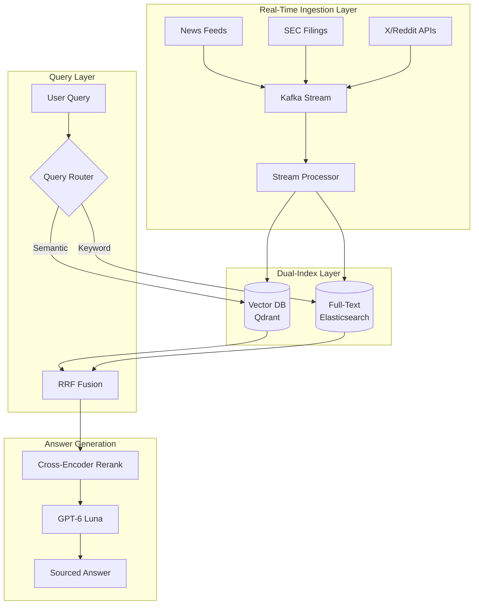

# Case Study: Real-Time AI Search Engine

## The Problem

A fintech startup needs to build a **real-time market intelligence platform** that lets analysts ask natural language questions about live market data, news, and company filings.

**Constraints given in the interview:**
- Data freshness: queries must reflect information from the last 5 minutes
- Scale: 10,000 concurrent users, 50,000 queries/hour
- Accuracy: financial data cannot be hallucinated
- Latency: p95 response time under 3 seconds

---

## The Interview Question

> "Design a system that lets users ask 'What is the sentiment around Tesla in the last hour?' and get an accurate, sourced answer in under 3 seconds."

---

## Solution Architecture



---

## Key Design Decisions

### 1. Why Kafka for Ingestion?

The interviewer wants to know you understand **streaming vs batch**.

**Answer:** Kafka gives durable, replayable streams with independent consumer groups. We have one consumer writing to the vector DB and another to Elasticsearch. If the vector indexing falls behind, the full-text index still serves queries. This is the **dual-write pattern** for resilience. Kafka's exactly-once semantics cover Kafka-to-Kafka processing, not writes to external stores, so each sink consumer treats delivery as at-least-once and makes it effectively-once with idempotent upserts keyed by document ID.

### 2. Why Hybrid Search (Vector + Full-Text)?

**Answer:** Financial queries mix semantic ("sentiment around Tesla") with keyword ("TSLA 10-K filing"). Pure vector search would miss exact ticker matches. We use **Reciprocal Rank Fusion (RRF)** to combine results.

### 3. Why a Small Model Instead of a Frontier Model?

**Answer:** For a 3-second p95 latency target at 50K queries/hour, we need fast, cheap synthesis. GPT-6 Luna ($0.10 / $0.50 per 1M tokens) or Gemini 3.8 Flash at low thinking covers it; the reranker handles accuracy, and the LLM only synthesizes already-verified content. Two cautions. Both can spend tokens thinking before they answer, so check the default and set the lowest reasoning effort or thinking level that holds quality, or thinking time eats the latency budget. And measure time to first token and tokens per second on your own prompts rather than quoting vendor figures. If p95 still slips at peak, price a paid speed tier (OpenAI's Fast tier bills 2x, where offered for the model) against the alternatives; it is often cheaper than moving every query to a bigger model.

---

## Handling the Freshness Requirement

The hardest part of this problem is ensuring the index reflects data from the last 5 minutes.

**Solution: TTL-Based Indexing**

```python
# Each document gets a timestamp field
doc = {
    "content": "Tesla announces new factory...",
    "timestamp": datetime.now(UTC).isoformat(),
    "source": "Reuters",
    "ttl_hours": 24  # A sweeper job deletes points older than this
}

# Query filters to last N minutes (Qdrant Query API; the legacy search
# endpoint is gone from the REST schema as of Qdrant 1.19)
def search_recent(query: str, minutes: int = 60, limit: int = 50):
    cutoff = datetime.now(UTC) - timedelta(minutes=minutes)
    return qdrant.query_points(
        collection_name="market_docs",
        query=embed(query),
        query_filter=models.Filter(must=[
            models.FieldCondition(key="timestamp", range=models.DatetimeRange(gte=cutoff))
        ]),
        limit=limit,
    ).points
```

Create a datetime payload index on `timestamp`; without one, Qdrant has to read payloads to evaluate the range filter, and time-filtered queries slow down as the collection grows.

---

## Cost Analysis

Assumes 50K queries/hour during market hours (about 10 hours a day, 22 trading days), so about 11M queries a month, each with ~4K input and ~300 output tokens.

| Component | Monthly Cost (at 50K queries/hour) |
|-----------|-----------------------------------|
| Kafka (MSK) | $2,500 |
| Qdrant (managed) | $1,800 |
| Elasticsearch | $2,000 |
| GPT-6 Luna (generation): 44B input × $0.10/1M + 3.3B output × $0.50/1M | $6,050 |
| Cross-encoder reranking | $800 |
| **Total** | **$13,150/month** |

The generation line assumes list prices and no prompt caching. If the same queries ran around the clock (36M a month), generation alone would be about $19,800.

---

## Interview Follow-Up Questions

**Q: How do you prevent hallucinated financial data?**

A: Three layers: (1) The LLM only summarizes retrieved content, never generates facts. (2) Every claim must cite a source document. (3) A post-generation validator checks that any number in the response exists verbatim in a source.

**Q: What if Kafka falls behind during a news spike?**

A: We implement backpressure with consumer lag monitoring. If lag exceeds 2 minutes, we shed load on the ingestion side using sampling. Real-time queries hit a "recent" index with only the last hour of data; batch jobs backfill the full index.

**Q: Someone floods X and Reddit with fake posts to move your sentiment answers. What stops it?**

A: Treat retrieval as an attack surface, because answer poisoning is already happening: in September 2026 a security researcher reported a phishing campaign that flooded the web with posts, PDFs and fake support pages to get ChatGPT, Gemini and Google AI Overviews to show fraudulent phone numbers for airlines and banks. Defenses: (1) score source reputation at ingestion (account age, follower graph, burst detection on near-duplicate posts) and store it as a filterable field; (2) cap the share of any answer that can come from low-reputation social sources, and show the source mix; (3) never let social posts be the citation for a number, a filing date or a contact detail; only primary sources such as SEC filings and wire services can carry those.

---

## Key Takeaways for Interviews

1. **Real-time AI search requires streaming infrastructure**, not batch ETL
2. **Hybrid search (semantic + keyword) outperforms pure vector** for structured domains
3. **Latency budgets drive model selection**: use fast models for synthesis, save expensive models for reasoning
4. **Freshness is a filter, not a feature**: implement at the index level, not the prompt level
5. **Fresh sources are the easiest to poison**: weight by source reputation and keep facts tied to primary sources

---

*Related chapters: [Hybrid Search](../06-retrieval-systems/05-hybrid-search.md), [Serving Infrastructure](../04-inference-optimization/06-serving-infrastructure.md)*
