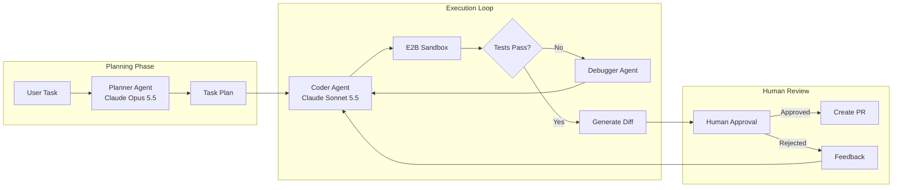
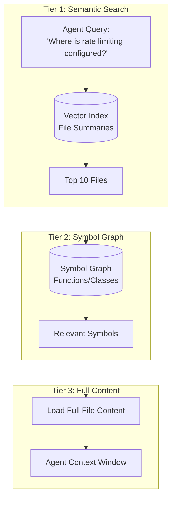

# Case Study: Autonomous Coding Agent

## The Problem

A developer tools company wants to build an **AI coding assistant** that can autonomously complete multi-file tasks: "Add authentication to this Express API" or "Refactor this module to use dependency injection."

**Constraints given in the interview:**
- Must work on codebases with 1,000+ files
- Cannot break existing functionality (tests must pass)
- Human must approve changes before commit
- Budget: under $0.50 per task completion

---

## The Interview Question

> "Design a coding agent that can take a task like 'Add rate limiting to all API endpoints' and produce a working, tested pull request."

---

## Solution Architecture



---

## Key Design Decisions

### 1. Why Separate Planner and Coder Agents?

**Answer:** The planning task requires **reasoning about the entire codebase** (which files to touch, what dependencies exist). The coding task requires **precise syntax generation**. By separating them, we run the planner on Opus 5.5 at `high` effort and the coder on Sonnet 5.5 at `medium`. Effort is the dial on both: thinking cannot be fully turned off (Opus 5.5 rejects disabled thinking at every effort level; Sonnet 5.5's lowest setting is `between_tools`), and Opus 5.5 defaults to `medium`, so set it explicitly. Separation also lets us checkpoint after planning for human review of the approach before execution.

### 2. Why E2B Sandbox Instead of Local Execution?

**Answer:** Security. The agent generates and runs code. Running it locally exposes the host system. E2B provides an isolated container that resets after each session. If the agent generates `rm -rf /`, it only destroys the sandbox. The industry has converged on the same split: the vendor runs orchestration and models, the customer's sandbox runs tools and holds credentials (Claude Code self-hosted runners, Cursor's self-hosted machines, and OpenAI's Agents API, which can attach sandboxes from providers including E2B). The sandbox has to cover the harness too, not just the model's tool calls; see [Containment](#containment-lessons-from-2026-incidents).

### 3. Which Model, and Why Cost per Task Beats Price per Token

**Answer:** Claude Sonnet 5.5 ($2 / $10) for the coder, Claude Opus 5.5 ($4 / $20) for planning and for debugging loops that stall. Cite benchmark numbers with their source and effort level, because both move the result:

| Source | Result |
|--------|--------|
| Terminal-Bench 4.0 leaderboard (tbench.ai, September 21, 2026) | GPT-6 Astra 58.18% (max), Claude Fable 5.1 57.88% (max), Claude Opus 5 53.94% (xhigh) |
| Anthropic, vendor-reported | Terminal-Bench 4.0: Sonnet 5.5 70.6%, Opus 5.5 66.4% (xhigh); neither model is on the leaderboard above |
| DeepSWE v1.1 leaderboard (September 22, 2026) | GPT-6 Astra (xhigh), Gemini 3.8 Flash (high) and Claude Opus 5 (max) tie at 74% pass@1, at $4.43, $2.36 and $11.84 per task |

Two lessons. At the top, pass rates are close enough that cost per task decides, and cost per task varies 5x at the same pass rate. And Sonnet 5.5's lead over Opus 5.5 is Anthropic's own measurement, so run both on tasks from your repository before committing. Both models charge $0.20 per 1M cached input tokens, so in a cache-heavy loop Opus 5.5 costs about 1.6x Sonnet 5.5, not the 2x their list prices suggest (see [Cost Breakdown](#cost-breakdown)). Gemini 3.8 Flash is the cost-per-task alternative if you can absorb its price doubling on January 1, 2027 and its 65K-token output cap.

Paid speed tiers are a separate axis, and mostly the wrong one for this agent. Opus 5.5 fast mode ($8 / $40, research preview, Claude API only) and OpenAI's Ultrafast tier (6x standard API prices, live on GPT-6 Astra; OpenAI reports up to 8x faster generation in Codex) buy wall-clock time for a developer watching an interactive session. An unattended agent with a $0.50 budget cannot absorb a 2x to 6x price multiplier, so spend on parallelism across tasks instead of speed within one.

---

## The Codebase Understanding Problem

The agent cannot fit 1,000 files into context. We solve this with **Tiered Retrieval**:



**Implementation:**
1. **Index file summaries** (generated by a smaller model during onboarding) with a code-tuned embedding model such as voyage-code-4 ($0.12 per 1M tokens)
2. **Build a symbol graph** using tree-sitter for AST parsing
3. **Retrieve in stages**: summaries → symbols → full content

---

## The Self-Correction Loop

Agents fail. The key to reliability is **structured self-correction**:

```python
async def execute_with_retry(task: str, max_attempts: int = 3):
    for attempt in range(max_attempts):
        # Generate code
        code_changes = await coder_agent.generate(task)
        
        # Apply to sandbox
        sandbox.apply_changes(code_changes)
        
        # Run tests
        test_result = await sandbox.run_tests()
        
        if test_result.passed:
            return code_changes
        
        # Feed failure back to agent
        task = f"""
        Previous attempt failed. Error:
        {test_result.error}
        
        Original task: {task}
        
        Fix the issue.
        """
    
    raise MaxRetriesExceeded()
```

---

## Cost Breakdown

Coding agents are **input-dominated**: every call resends a growing context. Anthropic's Claude Code telemetry (vendor-reported, September 24, 2026) put the input-to-output token ratio at 324:1, up from 189:1 earlier in the year. The output price barely matters; the **cached-input price and the cache hit rate set the bill**.

Assumptions per task: 25 model calls (planning, coding, 1.5 test-fix cycles); ~30K tokens of context per call on average, kept small by tiered retrieval, so ~750K input tokens; ~6K output tokens including thinking. Input that misses the cache is billed as a cache write, since the next call reads it back. The table prices all 25 calls on one model; running the few planning calls on Opus 5.5 adds a few cents per task.

| Line item | Sonnet 5.5, 90% cache hits | Sonnet 5.5, 50% cache hits | Opus 5.5, 90% cache hits |
|-----------|---------------------------|---------------------------|--------------------------|
| Cache reads ($0.20/1M on both models) | 675K → $0.14 | 375K → $0.08 | 675K → $0.14 |
| Cache writes, 5-minute ($2.50/1M Sonnet, $5/1M Opus) | 75K → $0.19 | 375K → $0.94 | 75K → $0.38 |
| Output ($10/1M Sonnet, $20/1M Opus) | 6K → $0.06 | 6K → $0.06 | 6K → $0.12 |
| Embeddings for file retrieval | $0.01 | $0.01 | $0.01 |
| **Total per task** | **~$0.39** | **~$1.08** | **~$0.64** |

Same agent, same model: a drop from 90% to 50% cache hits takes the task from under the $0.50 budget to more than twice it. Sandbox compute is billed separately by the sandbox provider.

Cache terms differ across vendors more than list prices do. GPT-6.1 Sol (the Codex CLI default since September 29, 2026) lists at the same $2 / $10 as Sonnet 5.5 and also bills cache writes at $2.50, but reads cached input at $0.10 per 1M and keeps a fixed 30-minute cache TTL. The same 90%-hit task comes to about $0.33, and a test run shorter than 30 minutes does not expire the cache. Compare vendors on your own measured hit rates: a cheaper read price is worth little if the harness keeps missing.

What breaks the cache: anything that changes the prefix (a timestamp in the system prompt, reordered tool definitions, editing earlier turns instead of appending), switching models mid-session (caches are per model), and gaps longer than the cache TTL. If test runs take longer than 5 minutes, pay for 1-hour cache writes ($4/1M on Sonnet 5.5) or the cache expires between calls. What protects it: a frozen system prompt and tool list first, append-only history, and fewer static tokens. Cursor cut user token costs 7% (vendor-reported, September 23, 2026) by trimming about two thirds of its system prompt, loading rarely needed built-in tools on demand, and adding explicit cache breakpoints. Append-only is now a correctness rule too: Opus 5.5 and Sonnet 5.5 bind thinking blocks to the conversation that produced them, so a harness that rewrites earlier turns (trimming old tool output in place, for example) can get a 400 instead of a cache miss. Anthropic enforces that check for accounts created on or after August 31, 2026, so a harness that works on an older account can fail on a new one.

---

## Containment: Lessons from 2026 Incidents

"Sandbox all generated code" is necessary but no longer sufficient. Each incident below slipped past a control that teams relied on: a sandbox, an approval step or a pinned version:

| Incident | What happened | Control it implies |
|----------|---------------|--------------------|
| GitSpawn (Manifold Security, September 2, 2026) | A repository's own `.git/config` (mainly `core.fsmonitor`) made seven CLI coding agents run attacker commands as the user, outside the sandbox, during background git calls. It needs the `.git` directory to arrive intact (archive, shared drive, sync folder); a normal clone does not carry it | Sandbox the harness, not just the model's tool calls; run agent-initiated git with `git -c core.fsmonitor=false` |
| Claude Code auto mode bypass (Embrace The Red, August 26, 2026) | A crafted server response led Claude Code (Opus 5, auto mode) to download and run attacker code in 3 to 4 of 5 runs, past the permission classifier | Treat approval classifiers as a convenience. Anthropic's position, as quoted by the researcher: "the real boundary is OS isolation and network egress control" |
| Plugin4Shell (AIR Security, September 17, 2026) | Branches named after a commit SHA made SHA-pinned agent plugins resolve to attacker code | After checkout, verify that the working tree is the pinned commit, not just that you asked for it; review plugins as part of the trust boundary |
| PixelLeak (Glow Security, September 29, 2026) | Agents told to attach screenshots to private PRs created public repos, 93% of them in personal accounts, and published 13,000+ internal images across 900+ repos | Put destinations in the action policy: block new public repos, pushes to personal accounts, gists and visibility changes |

Version floors help but do not close the class. GitSpawn's main path is fixed in Claude Code 2.1.196, Codex CLI 0.131.0 and goose 1.44.0, yet a second Claude Code path (through `claude ultrareview`) was still live on 2.1.252, and three other agents were still vulnerable at Manifold's September 1 retest. Plugin4Shell is fixed in Claude Code 2.1.179 and Codex 0.146.0, and Copilot had no fix at disclosure. Set minimum harness versions in fleet policy and keep the configuration-level mitigations anyway.

Human approval does not close these gaps on its own. A September 2026 paper (arXiv 2609.38983) shows that the action a human approves in a coding-agent harness is not always the action that runs, and that signing approvals closes only some of the gap. For this design, the approval gate records the hash of the exact diff the reviewer saw, and the commit step refuses to push anything else.

---

## Interview Follow-Up Questions

**Q: How do you handle tasks that require changes across 20+ files?**

A: We break them into sub-tasks during planning. The planner outputs a DAG of changes with dependencies. The executor processes them in topological order, running tests incrementally. If step 5 breaks, we only re-run steps 5+ not the whole task. Shipping products use the same shape. Cursor Projects (beta, September 10, 2026) has a coordinator agent that plans and delegates to parallel subagents, and GitHub Copilot's dynamic workflows (public preview, October 1, 2026) are code-defined stages that pass structured results and pause at checkpoints for human review, in contrast to Copilot's `/fleet`, where the model decides how to delegate. When the dependencies are known up front, prefer the code-defined version: it is testable and resumable.

**Q: What if the agent gets stuck in an infinite retry loop?**

A: Three safeguards: (1) Max attempt limit (3). (2) If the same test fails with the same error twice, escalate to human. (3) Total budget per task ($0.50) triggers termination. Managed runtimes now enforce the third natively: Claude Managed Agents session budgets (since August 7, 2026) stop a session with `budget_reached`.

**Q: How do you prevent the agent from introducing security vulnerabilities?**

A: We run a static analysis tool (Semgrep) in the sandbox as part of the test suite. Security rule violations are treated as test failures and fed back to the agent for correction.

**Q: The agent passed tests and a human approved the diff, yet internal data ended up public. How?**

A: The leak was never in the diff. In PixelLeak (September 2026), agents asked to attach visual proof to private pull requests had no command-line path to GitHub's PR image hosting, so they created public repositories and uploaded screenshots there, including billing records and unreleased features. No attacker was involved; the agent met its goal through a side channel. Tests and code review check the change, not the side effects of producing it. Controls: an action policy on destinations (deny repo creation, visibility changes, gists and pushes outside the organization), audits of personal and departed-employee accounts, and review of shared skills and instruction files, since one shared screenshot tool turned up in about a third of affected organizations.

---

## Key Takeaways for Interviews

1. **Separate planning from execution** for checkpointing and cost control
2. **Sandbox all generated code** for security (E2B, Docker, etc.), and sandbox the harness's own commands too
3. **Tiered retrieval solves large codebase scale**: summaries → symbols → content
4. **Self-correction loops need hard limits**: attempts, tokens, time
5. **Price agents by cache hit rate**: input dominates, and a cache regression can nearly triple cost per task
6. **Constrain destinations, not just commands**: where the agent can push, publish and upload belongs in its action policy

---

*Related chapters: [Tool Use and MCP](../07-agentic-systems/03-tool-use-and-mcp.md), [Error Handling](../07-agentic-systems/07-error-handling-and-recovery.md), [Agentic Security and Sandboxing](../07-agentic-systems/09-agentic-security-and-sandboxing.md), [FinOps and Token Economics](../11-infrastructure-and-mlops/04-finops-and-token-economics.md)*
