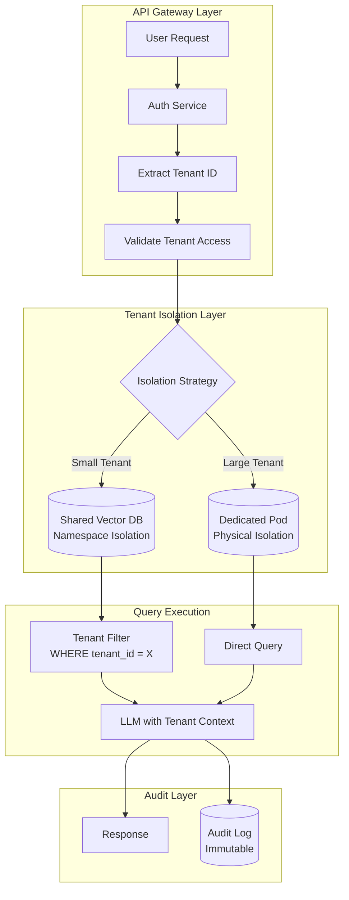
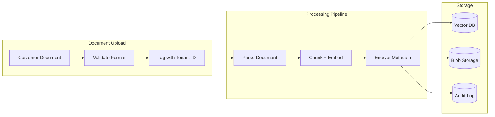

# Case Study: Multi-Tenant AI SaaS Platform

## The Problem

A B2B startup is building an **AI-powered document analysis platform** where each customer uploads their own contracts, and the AI answers questions about them. Customers include competitors who must never see each other's data.

**Constraints given in the interview:**
- 500 enterprise customers, each with 10,000-100,000 documents
- Absolute data isolation: Customer A's data cannot leak to Customer B
- Shared infrastructure for cost efficiency
- Compliance: SOC 2 Type II, GDPR
- Query latency under 2 seconds

---

## The Interview Question

> "Design a multi-tenant RAG system where Coca-Cola and Pepsi can both be customers, and there is zero risk of cross-tenant data leakage."

---

## Solution Architecture



---

## Key Design Decisions

### 1. Hybrid Isolation: Namespace vs Physical

**Answer:** Pure physical isolation (one database per tenant) is expensive. Pure namespace isolation (shared database with tenant_id filter) has leakage risk if a filter bug occurs. We use a **tiered approach**:

| Tier | Tenant Size | Isolation Method | Why |
|------|-------------|------------------|-----|
| Standard | <50K docs | Namespace in shared Qdrant | Cost efficient |
| Premium | 50K-500K docs | Dedicated Qdrant collection | Performance isolation |
| Enterprise | >500K docs | Dedicated Qdrant pod, or a data plane in the customer's own cloud | Physical + regulatory |

Two details matter in the shared tier. Keyword search scores with corpus statistics, so in a shared collection one tenant's documents shift another tenant's BM25 ranking; Qdrant 1.19 added per-tenant IDF statistics for sparse and BM25 search to fix exactly this. And the customer-cloud option is now a product, not a custom project: Pinecone's BYOC went GA on September 23, 2026 on AWS, Google Cloud and Azure, with vectors, documents and request payloads staying in the customer's account.

### 2. Defense in Depth for Data Isolation

**Answer:** We never trust a single layer. Our isolation stack:

1. **API Gateway**: Validates tenant_id from JWT, rejects cross-tenant requests
2. **Database Layer**: Row-level security (RLS) enforces tenant_id filter at DB level
3. **Application Layer**: ORM wrapper automatically injects tenant filter
4. **LLM Layer**: System prompt explicitly states "You are answering for Tenant X only". This frames answers; it is not a control, and isolation must never depend on it
5. **Output Layer**: Post-generation filter scans for any document IDs not belonging to tenant
6. **Inference Layer**: If you self-host models, the prefix cache is shared state. vLLM isolates tenants with a per-request `cache_salt`, and in September 2026 one code path that dropped the salt reopened a cross-tenant prefix-cache membership oracle until 0.30.0 (GHSA-935w-9g4m-p28p). Pin vLLM >= 0.30.0 and test the salt on every endpoint you expose. See [Access Control](../12-security-and-access/02-access-control.md) for the cache-isolation details

### 3. Why Not One Vector DB Per Tenant?

**Answer:** 500 tenants × $100/month per managed instance = $50K/month just for databases. By using namespace isolation for 80% of tenants, we reduce this to $8K/month. The remaining 20% on dedicated infrastructure pay a premium tier price.

---

## The Data Ingestion Pipeline



**Critical:** The tenant_id is attached at the **earliest possible point** (upload validation) and travels with the document through every stage. It is not derived or looked up later.

---

## Handling the Compliance Requirements

### SOC 2 Type II

| Control | Implementation |
|---------|----------------|
| Access logging | Every query logged with tenant_id, user_id, timestamp |
| Encryption at rest | AES-256 for blob storage, database-native for vector DB |
| Encryption in transit | TLS 1.3 everywhere |
| Access reviews | Automated quarterly reports from audit logs |

### GDPR Right to Deletion

```python
async def delete_tenant_data(tenant_id: str):
    # 1. Delete from vector DB
    await vector_db.delete(filter={"tenant_id": tenant_id})
    
    # 2. Delete from blob storage
    await blob_storage.delete_prefix(f"tenants/{tenant_id}/")
    
    # 3. Anonymize audit logs (cannot delete for compliance)
    await audit_log.anonymize(tenant_id=tenant_id)
    
    # 4. Generate deletion certificate
    return generate_deletion_certificate(tenant_id)
```

### Data Residency

EU tenants often contract for in-region processing, and model vendors now price it as a line item of about +10% per token: regional Claude endpoints on Bedrock and Google Cloud, OpenAI's data-residency endpoints and Mistral's EU inference all carry roughly that premium, and Anthropic's US-only `inference_geo` setting bills 1.1x. Pin geography per tenant at the gateway and charge it to the tier that needs it, rather than paying 10% on every tenant's traffic.

---

## Cost Analysis (500 Tenants)

| Component | Monthly Cost |
|-----------|--------------|
| Shared Vector DB (Qdrant Cloud) | $2,500 |
| Dedicated pods (20 enterprise tenants) | $4,000 |
| LLM costs (pooled; GPT-6 Luna by default, a $2 / $10 model for hard questions; volume-dependent) | $8,000 |
| Blob storage (S3) | $1,500 |
| Audit logging (CloudWatch) | $500 |
| **Total** | **$16,500/month** |
| **Per tenant average** | **$33/month** |

---

## Interview Follow-Up Questions

**Q: What if a bug in your ORM bypasses the tenant filter?**

A: Defense in depth. Even if the ORM fails, the database enforces RLS (Row-Level Security). The query `SELECT * FROM documents` internally becomes `SELECT * FROM documents WHERE tenant_id = current_tenant()`. This is enforced at the Postgres level, not the application level.

**Q: How do you handle a tenant who wants to export all their data?**

A: We provide a data portability API that streams all documents with their embeddings and metadata. The export is triggered by an admin, logged in the audit trail, and delivered to a customer-controlled S3 bucket (not our infrastructure).

**Q: What if the LLM hallucinates information from its training data that matches a competitor's confidential info?**

A: This is a real risk. We mitigate by: (1) Using only retrieval-grounded generation (the LLM cannot answer without retrieved docs). (2) Filtering outputs for any content that does not trace back to the tenant's uploaded documents. (3) Offering a "private model" tier where we fine-tune a tenant-specific model on their data only. Build that tier on open weights (one LoRA adapter per tenant on a shared base model) or a cloud provider's tuning service, not OpenAI's self-serve fine-tuning, which stops accepting new jobs on January 6, 2027.

**Q: A customer asks whether their users can pay for AI usage with their own ChatGPT plan. Do you support it?**

A: OpenAI announced Sign in with ChatGPT at DevDay on September 29, 2026, as a limited trial for selected partners: OAuth 2.0 with PKCE plus OpenID Connect, and an optional scope that lets eligible ChatGPT Plus and Pro users run eligible Responses API requests on their own plan. That scope is documented for open-source apps and selected private clients, so a hosted SaaS has to apply for it. It moves inference cost off our books, but for this product I would not make it the default. Tenant contract data would be processed under an individual user's ChatGPT relationship that the tenant's admin does not control, rate limits become per user plan instead of per tenant, and those requests are tied to one vendor's models. If we offer it at all, it is per tenant, off by default, enabled by the tenant admin, and logged like any other model route.

---

## Key Takeaways for Interviews

1. **Multi-tenancy is about layers**: never rely on a single isolation mechanism
2. **Tiered isolation balances cost and security**: not all tenants need dedicated infrastructure
3. **Tenant ID must be immutable and early**: tag at upload, not at query time
4. **Compliance is an architecture concern**: design for audit, deletion, and portability from day one
5. **Shared inference is shared state**: prefix caches and ranking statistics leak across tenants unless they are partitioned per tenant

---

*Related chapters: [LLM Security](../12-security-and-access/01-llm-security.md), [Access Control & Multi-Tenant Isolation](../12-security-and-access/02-access-control.md)*
