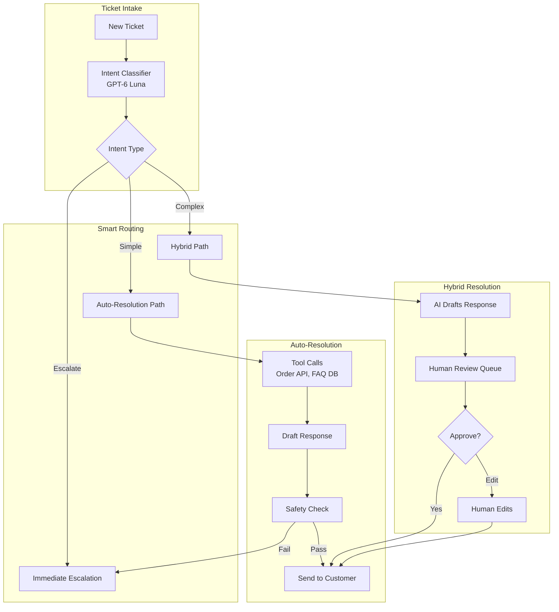
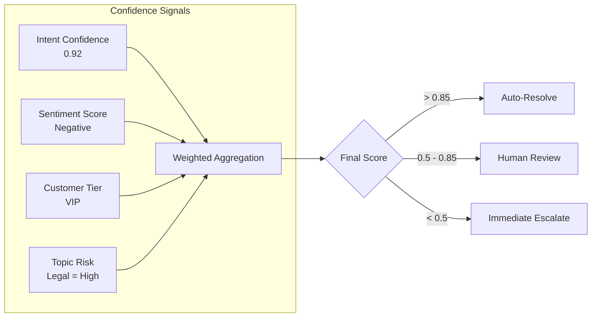
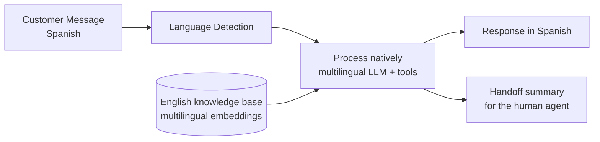

# Case Study: AI-Powered Customer Support

## The Problem

An e-commerce company handles **2 million support tickets per month**. They want an AI system that can automatically resolve 60% of tickets without human intervention, while handing complex issues to humans with full context.

**Constraints given in the interview:**
- 24/7 operation across 12 languages
- Must integrate with existing Zendesk and Salesforce
- Cannot make false promises (refunds, shipping dates)
- Human agents must be able to take over mid-conversation
- Cost target: $0.05 per resolved ticket
- EU customers must be told they are talking to an AI (EU AI Act Article 50, applicable since August 2, 2026)

---

## The Interview Question

> "Design a customer support AI that handles 'Where is my order?' automatically but knows when to escalate 'I want to sue you for fraud' to a human."

---

## Solution Architecture



---

## Key Design Decisions

### 1. Three-Tier Routing (Auto / Hybrid / Escalate)

**Answer:** Not all tickets are equal. We classify into three paths:

| Path | Criteria | Example | Human Involvement |
|------|----------|---------|-------------------|
| **Auto** | High confidence, low risk | "Where is my order?" | None |
| **Hybrid** | Medium confidence or medium risk | "I want a refund" | Reviews AI draft |
| **Escalate** | Legal, threats, VIP, low confidence | "This is fraud" | Full human handling |

### 2. Tool-Based Resolution, Not Pure Generation

**Answer:** The AI does not "know" where the order is. It calls the Order API tool. This is critical for accuracy:

```python
@tool
def get_order_status(order_id: str) -> dict:
    """Retrieve real-time order status from OMS."""
    order = oms_client.get_order(order_id)
    return {
        "status": order.status,
        "shipped_date": order.shipped_at,
        "estimated_delivery": order.eta,
        "tracking_url": order.tracking_url
    }
```

The LLM orchestrates tools but never fabricates data.

### 3. Why Safety Check Before Send?

**Answer:** Even auto-resolved tickets go through a safety filter:

1. **Promise Detection**: Flags statements like "I guarantee" or "We will pay"
2. **Sentiment Mismatch**: Catches if AI sounds happy when customer is angry
3. **PII Leak**: Ensures no internal notes or other customer data appear
4. **Competitor Mention**: Flags if AI recommends a competitor
5. **Contact Allowlist**: Any phone number, URL or payment link in a draft must match a verified allowlist. In September 2026 a security researcher reported a phishing campaign that seeded fake support pages and PDFs to get ChatGPT, Gemini and Google AI Overviews to show fraudulent support numbers for airlines and banks; a support bot that retrieves from the open web or from customer-supplied text can repeat the same bait

---

## The Escalation Intelligence

The hardest part is knowing **when** to escalate. We use a confidence score with multiple signals:



**Key insight:** A VIP customer asking a simple question still goes to Hybrid path because the cost of a mistake is higher.

---

## Multilingual Support

12 languages without 12 separate models, and without a translation pivot:



**Why not translate to English and back?**

Earlier versions of this design pivoted through English to keep one prompt and one knowledge base. Current small models (GPT-6 Luna, Gemini 3.8 Flash, Claude Haiku 4.5) handle the major languages directly, so the pivot now costs more than it saves: two extra model calls per turn, more latency, and lost tone, which the escalation logic needs for its sentiment signal. Keep the knowledge base in English and retrieve across languages with a multilingual embedding model (Cohere Embed 5 covers 100+ languages). Translate only where a human needs it, such as the handoff summary for an agent who does not read the customer's language. Validate the long-tail languages on your own eval set; quality is not uniform across all 12.

---

## Human Takeover (Mid-Conversation)

When a human takes over, they need full context:

```python
def handoff_to_human(conversation_id: str, agent_id: str):
    conversation = get_conversation(conversation_id)
    
    # Generate summary for human agent
    summary = llm.generate(f"""
    Summarize this conversation for a human agent:
    - Customer issue
    - What AI already tried
    - Why escalation happened
    
    Conversation:
    {conversation.messages}
    """)
    
    # Create handoff package
    return {
        "summary": summary,
        "customer_sentiment": conversation.sentiment,
        "attempted_solutions": conversation.tool_calls,
        "full_transcript": conversation.messages,
        "customer_tier": conversation.customer.tier
    }
```

Treat the escalation reason as product data, not just routing data. Anthropic's write-up of its own inbound-sales agent (September 30, 2026, vendor-reported) is a useful reference: every conversation ends in one of three ways (direct checkout, a hand-off to a sales rep with the full conversation plus an explanation of why, or a quick informational answer), and Anthropic reports that the share of conversations needing a human fell by about half. Recording the reason at hand-off time is what makes escalations analyzable. Two practices from that write-up carry over directly: goal-oriented instructions outperformed long lists of granular rules, and every agent change was saved as a version so new sessions could be pointed back to an earlier one.

---

## Cost Analysis

October 2026 list prices; assumes ~3 turns per ticket at ~4K input tokens per turn.

| Component | Cost per Ticket |
|-----------|-----------------|
| Intent classification (GPT-6 Luna, $0.10 / $0.50 per 1M) | $0.0001 |
| Tool calls (Order API, FAQ search) | $0.001 |
| Response generation (GPT-6 Luna: 3 × 4K in, ~750 out per turn including reasoning) | $0.0023 |
| Safety check (classifier plus a GPT-6 Luna pass) | $0.0005 |
| Handoff summary translation (when the agent needs it) | $0.0005 |
| **Average total** | **~$0.0044** |

At a 60% auto-resolution rate: **about $0.007 per resolved ticket**, well under the $0.05 target. Model spend is no longer the constraint at 2M tickets a month (under $10,000 in tokens). The money is in escalations and in wrong answers: a single wrong refund promise can cost more than a month of intent classification (about $200). Spend the headroom on a stronger model for the Hybrid path's drafts (a $2 / $10 model such as Claude Sonnet 5.5 or GPT-6 Sol) rather than squeezing the auto path further.

---

## Interview Follow-Up Questions

**Q: What if the AI keeps apologizing but never actually helps?**

A: We track "resolution effectiveness" not just "response sent." If a customer replies again within 24 hours on the same issue, that ticket is marked as "unresolved" and the AI pattern is flagged for review. We also run weekly analysis: "What phrases correlate with customer follow-ups?"

**Q: How do you handle a customer who insists on talking to a human?**

A: Explicit escalation phrases ("talk to a human", "speak to manager") trigger immediate handoff regardless of confidence score. We never argue with escalation requests.

**Q: What about customers who try to jailbreak the support AI?**

A: Input sanitization plus a narrow, tool-scoped design. Assume the system prompt will leak, since summarizing tool output is still free-form generation, so nothing secret goes in it. The real protection is that tools are scoped to the authenticated customer (the order tool can only read that customer's orders) and refunds or account changes go through the Hybrid path, so a successful jailbreak yields words, not actions. The system prompt stays narrow for answer quality: "You help with order issues for [Company]. You cannot discuss other topics."

---

## Key Takeaways for Interviews

1. **Tiered routing balances automation with risk**: not every ticket should be auto-resolved
2. **Tool-based grounding prevents hallucination**: the AI retrieves facts, it does not generate them
3. **Confidence is multi-dimensional**: intent clarity + sentiment + customer tier + topic risk
4. **Human handoff needs context**: summarize, do not just dump the transcript
5. **Escalation reasons are product feedback**: log why every handoff happened and work down the top reasons

---

*Related chapters: [Human-in-the-Loop Patterns](../07-agentic-systems/08-human-in-the-loop-patterns.md), [Guardrails Implementation](../13-reliability-and-safety/01-guardrails.md)*
