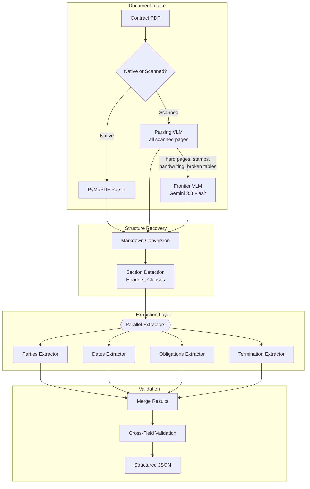
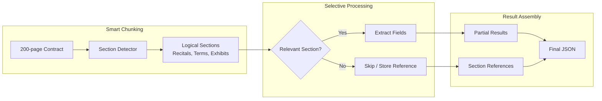

# Case Study: Document Intelligence Pipeline

## The Problem

A legal tech company needs to process **50,000 contracts per month**, extracting key terms (parties, dates, obligations, termination clauses) and loading them into a searchable database.

**Constraints given in the interview:**
- Documents range from 2 to 200 pages
- Mix of scanned PDFs and native digital
- Multi-language (English, German, French, Spanish)
- Extraction accuracy: 95%+ on key fields
- Cost target: under $0.50 per document

---

## The Interview Question

> "Design a pipeline that takes a 100-page contract PDF and extracts structured data like parties, effective date, termination conditions, and payment terms into JSON."

---

## Solution Architecture



---

## Key Design Decisions

### 1. Tiered Parsing: A Parsing VLM for Every Page, a Frontier VLM for Hard Pages

**Answer:** Scanned contracts often have stamps, handwritten annotations, and complex layouts (tables, multi-column). Traditional OCR (Tesseract) produces garbled output. Vision-language models "see" the layout and produce clean Markdown with tables preserved. In 2026 the choice is no longer OCR versus a frontier model: specialized parsing VLMs sit in between, return reading order and bounding boxes, and cost a fraction of a frontier call.

| Method | 100-page Scanned Contract | Cost per 100 Pages | Benchmark Signal |
|--------|---------------------------|--------------------|------------------|
| Tesseract | Noisy, broken tables | ~$0.02 (CPU) | Not competitive on layout |
| AWS Textract | Better text, still struggles with layout | ~$0.15 | ParseBench 53.3 (Cohere-run) |
| Parsing VLM via API (Cohere parse-v5.0) | Markdown with HTML tables, or blocks with bounding boxes | $0.15 ($1.50 per 1,000 pages) | ParseBench 79.2 (vendor-run) |
| Parsing VLM, self-hosted (MinerU 4.0, PaddleOCR-VL, NVIDIA Nemotron Parse 2.0) | Reading order, layout classes, bounding boxes | GPU time only | OmniDocBench v1.6 and olmOCR-Bench; check each license (jina-ocr-v1, for example, is CC BY-NC) |
| Frontier VLM (Gemini 3.8 Flash) | Clean Markdown; strongest fallback for stamps and handwriting | ~$0.30 introductory, ~$0.62 from January 1, 2027 | ParseBench for frontier VLMs: GPT-5.5 84.4, Gemini 3.5 Flash 81.8 (Cohere-run; 3.8 Flash not listed) |

The frontier row assumes ~1.1K input and ~600 output tokens per page. At the January 2027 list price, running every scanned page through Gemini 3.8 Flash alone would blow the $0.50 budget on a 100-page scan. So the pipeline routes: every scanned page goes through the parsing VLM, and only the ~15% of pages that come back low-confidence or fail layout checks (stamps, handwriting, broken tables) escalate to the frontier VLM. MinerU 4.0 builds the same idea into its parser with four quality tiers, from model-free extraction for digital PDFs up to an "advanced" tier for hard documents. All ParseBench numbers here come from Cohere's launch post (vendor-run), so treat the 3- to 5-point gap between frontier VLMs and Cohere Parse as indicative and re-measure on your contracts.

### 2. Parallel Extractors vs Single-Pass

**Answer:** A single prompt asking for all fields produces worse results than specialized extractors. Each extractor has a focused prompt and schema:

```python
parties_schema = {
    "type": "object",
    "properties": {
        "party_a": {"type": "object", "properties": {
            "name": {"type": "string"},
            "role": {"type": "string"},
            "address": {"type": "string"}
        }},
        "party_b": {"type": "object", "properties": {...}}
    }
}

# Each extractor runs in parallel
async def extract_all(document: str):
    results = await asyncio.gather(
        extract_parties(document, parties_schema),
        extract_dates(document, dates_schema),
        extract_obligations(document, obligations_schema),
        extract_termination(document, termination_schema)
    )
    return merge_results(results)
```

### 3. Cross-Field Validation

**Answer:** Extraction errors often reveal themselves through inconsistencies:
- If `effective_date` is after `termination_date`, something is wrong
- If `party_a` name appears in `obligations` but spelled differently, flag for review
- If `payment_amount` is extracted but `payment_frequency` is null, incomplete

---

## Handling 200-Page Documents

The context window challenge:



**Key insight:** Not all 200 pages contain extractable fields. Exhibits (attached original documents) are stored as references, not processed. The "Terms and Conditions" section is often 80% of the document but contains most key fields.

---

## Multilingual Handling

German contracts use different structures than English ones. We maintain language-specific extractors:

```python
EXTRACTORS = {
    "en": {
        "parties": EnglishPartiesExtractor(),
        "dates": StandardDatesExtractor(),
        "termination": EnglishTerminationExtractor()
    },
    "de": {
        "parties": GermanPartiesExtractor(),  # Handles "GmbH", "AG" patterns
        "dates": GermanDatesExtractor(),       # DD.MM.YYYY format
        "termination": GermanTerminationExtractor()  # "Kündigung" patterns
    }
}
```

---

## Cost Breakdown

October 2026 prices, with Gemini 3.8 Flash at its January 1, 2027 list rate.

| Stage | Cost per 100-page Doc |
|-------|----------------------|
| Parsing, scanned only: parsing VLM on all pages ($0.15) plus Gemini 3.8 Flash on ~15 hard pages (~$0.09) | $0.24 |
| Section detection (GPT-6 Luna, ~50K tokens in) | $0.01 |
| Field extraction (4 parallel on GPT-6 Luna; ~10% of documents escalate low-confidence fields to a $2 / $10 model) | $0.03 |
| Validation | $0.01 |
| **Total (scanned)** | **$0.29** |
| **Total (native PDF)** | **$0.05** |

Average (60% native, 40% scanned): **about $0.15 per document** (under the $0.50 target). The scanned path costs about 6x the native one, almost all of it parsing, so the cheapest lever is getting native PDFs from the source system wherever possible.

---

## Interview Follow-Up Questions

**Q: What if the extraction confidence is low?**

A: We output a confidence score per field. Fields below 0.8 are flagged for human review. The UI shows a "review queue" where humans validate only uncertain fields, not entire documents. This reduces human effort to an average of 30 seconds per document. Every extracted field also carries its source location (page plus the parser's block ID and bounding box), so the reviewer sees the highlighted clause instead of hunting for it. Parsers now emit these locators directly; MinerU 4.0, for example, returns stable page and block references meant for verifiable citations.

**Q: How do you handle contracts with non-standard layouts?**

A: We maintain a "layout library" of known contract templates. The section detector first tries to match against known templates. If no match, it falls back to heuristic detection (looking for numbered sections, ALL CAPS headers, etc.). Unknown layouts are flagged and added to the library after human review.

**Q: What about contracts where key terms are defined in exhibits?**

A: We detect cross-references ("as defined in Exhibit A") and resolve them. The extraction prompt includes relevant exhibit content when the main document references it. This prevents "null" extractions when the answer is in an attachment.

---

## Key Takeaways for Interviews

1. **Route pages by difficulty**: parsing VLMs beat traditional OCR on layout, and only the hard pages need a frontier VLM
2. **Parallel specialized extractors outperform single-pass** for structured extraction
3. **Cross-field validation catches extraction errors** before they reach the database
4. **Not all pages need processing**: detect relevant sections, skip exhibits

---

*Related chapters: [OCR and Layout](../10-document-processing/01-ocr-and-layout.md), [Structured Generation](../05-prompting-and-context/06-structured-generation.md)*
