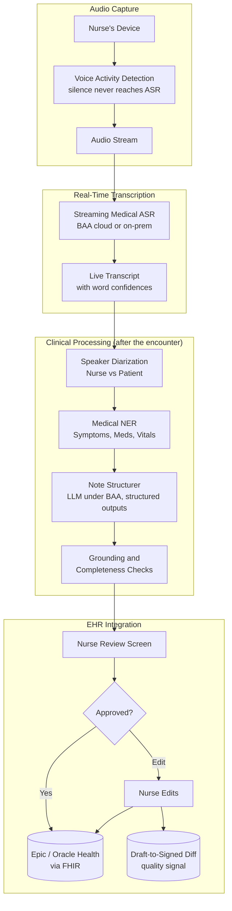
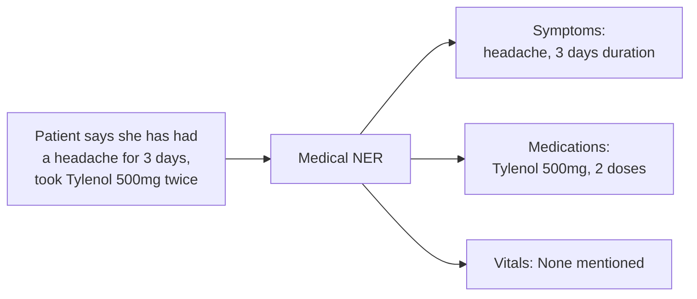

# Case Study: Voice AI Assistant for Healthcare

## The Problem

A hospital network wants a **voice-based AI assistant** that helps nurses document patient encounters. The nurse speaks naturally; the AI shows a live transcript and produces a structured clinical note for review.

**Constraints given in the interview:**
- HIPAA compliance (PHI handling)
- Works in noisy hospital environments
- Real-time transcription (under 500ms latency)
- Must use medical terminology correctly
- Integration with existing EHR (Epic or Oracle Health, formerly Cerner)
- Patient consent to recording, and disclosure of AI use where state law requires it (Texas has required health-care providers to disclose AI use since January 1, 2026)

This is the **ambient scribe** pattern, now a mainstream product category: EHR vendors are building it in (Epic's AI Charting), and published outcome studies set realistic expectations (see [Measuring Success](#measuring-success)).

---

## The Interview Question

> "Design a voice assistant that a nurse can speak to during a patient visit, and it generates a structured clinical note in the EHR."

---

## Solution Architecture



---

## Key Design Decisions

### 1. Where ASR Runs: Cloud Under a BAA, or On-Prem

**Answer:** HIPAA does not require on-premises processing. It requires safeguards and a **business associate agreement (BAA)** with every vendor that handles PHI, and most commercial ambient scribes are cloud-delivered. So the choice turns on hospital policy, ward connectivity, cost, and accuracy, not legality:

| Option | Examples | HIPAA posture | Cost | Watch for |
|--------|----------|---------------|------|-----------|
| Cloud streaming STT under a BAA | OpenAI `gpt-live-transcribe` ($0.017/min); AssemblyAI Universal-3.5 Pro Realtime ($0.45/hr); ElevenLabs Scribe v2 Realtime ($0.39/hr) | BAA plus zero retention. OpenAI's file-transcription endpoint retains no data, but streaming runs on a separate Realtime endpoint, so confirm its retention; ElevenLabs signs a BAA only on Enterprise and requires zero retention | Per minute, no GPUs | Confirm the exact endpoint is in BAA scope; streaming redaction gaps (AssemblyAI redacts final turns only, and no audio) |
| Medical-tuned cloud STT | ElevenLabs Scribe v2 Medical (GA September 11, 2026); Deepgram `nova-3-pharma` (September 17, 2026) | Same BAA requirement | Per minute | Better clinical vocabulary; validate on your own ward recordings |
| On-prem streaming model | NVIDIA `nemotron-3.5-asr-streaming-0.6b` (OpenMDW license, commercial use allowed; chunk size selectable from 80 to 1,120 ms) | No audio leaves the network | GPU fleet plus operations; cheap only at high utilization | You own updates, scaling, failover, and the accuracy eval |

**Our choice:** medical cloud STT under a BAA with zero retention by default, and the on-prem streaming model for sites whose security policy forbids audio egress or whose ward connectivity is unreliable. Both sit behind one interface, so a site can switch without touching the rest of the pipeline. The on-prem model's chunk size is the latency dial: smaller chunks cut delay and cost accuracy.

**Why not Whisper Large v3 on local GPUs**, the default for this design a couple of years ago:

- It is not natively streaming, so meeting a 500 ms transcript budget means chunking workarounds.
- It now trails open models on accuracy: 5.78% average WER on the Open ASR Leaderboard (October 2026 snapshot) against 4.31% for Qwen3-ASR-1.7B and 4.70% for parakeet-tdt-0.6b-v2.
- It **hallucinates in silence**. The Careless Whisper study (FAccT 2024) found entirely fabricated phrases in about 1% of transcriptions, 38% of them harmful, and disproportionately for speakers with long non-vocal stretches. A clinical encounter is full of pauses while the nurse examines the patient.

OpenAI's hosted Whisper is going away too: `whisper-1`, along with the `gpt-4o-*-transcribe` models, shuts down February 26, 2027 (replacements: `gpt-transcribe` and `gpt-live-transcribe`).

### 2. Speaker Diarization: Who Said What

**Answer:** The note must distinguish "Patient reports headache" from "Nurse observes patient grimacing." We use:

```python
# Pyannote for speaker diarization
diarization = pipeline("audio.wav")
# Output: [(0.0, 1.5, "SPEAKER_0"), (1.5, 4.2, "SPEAKER_1"), ...]

# Map speakers based on voice profile
roles = identify_roles(diarization, known_nurse_voiceprint)
# Output: {"SPEAKER_0": "nurse", "SPEAKER_1": "patient"}
```

The nurse's device enrolls their voiceprint at setup for role identification. A voiceprint is a **biometric identifier** under Illinois BIPA and Texas law, so enrollment needs written consent, a retention schedule, and deletion when the nurse leaves. Never enroll patients. If you use a vendor's built-in diarization instead, check its lifecycle: OpenAI's `gpt-4o-transcribe-diarize` shuts down February 26, 2027.

### 3. Medical NER for Structured Extraction

**Answer:** We need structured data, not just prose. Medical NER extracts:



We use a fine-tuned BioBERT model for NER, not the LLM, because NER needs to be fast and deterministic.

---

## Handling Noisy Environments

Hospitals are loud, and the dangerous failure is not a garbled word but a confident sentence nobody said. We use multiple strategies:

1. **Directional microphones** on nurse devices focus on nearby speech
2. **VAD gating**: silence and non-speech never reach the ASR, which keeps long pauses, where hallucinated phrases concentrate, away from the model
3. **Speaker isolation**: suppress background voices so the next bed's conversation does not enter the note (AssemblyAI's Voice Focus, for example, adds $0.10/hr)
4. **Confidence thresholds**: if ASR confidence is <0.7, we flag the span for nurse review rather than guessing
5. **Vocabulary biasing**: medical terms and the unit's formulary go to the ASR as keyterms (Gemini 3.5 Transcribe, for example, accepts up to 1,000 biasing terms)

---

## The Structured Note Format

The LLM produces SOAP-format notes:

```python
note_prompt = f"""
Generate a clinical SOAP note from this encounter transcript.

Transcript:
{transcript_with_speakers}

Extracted entities:
- Symptoms: {symptoms}
- Medications: {medications}
- Vitals: {vitals}

Output format:
S (Subjective): Patient's reported symptoms
O (Objective): Nurse's observations and measurements
A (Assessment): Clinical impression
P (Plan): Next steps, orders
"""
```

Generate into a JSON schema with the provider's structured outputs rather than parsing prose, and run a **grounding check** before review: every clinical statement in the draft must point to a transcript span, and unsupported statements are highlighted on the review screen. The note model runs under the same BAA and zero-retention terms as the ASR; keep the model name in configuration, because hosted model lines turn over several times a year.

---

## EHR Integration (FHIR)

The output must be machine-readable for the EHR:

```json
{
  "resourceType": "DocumentReference",
  "status": "current",
  "type": {
    "coding": [{"system": "http://loinc.org", "code": "34746-8", "display": "Nurse note"}]
  },
  "subject": {"reference": "Patient/12345"},
  "author": [{"reference": "Practitioner/nurse789"}],
  "content": [{
    "attachment": {
      "contentType": "text/plain",
      "data": "base64-encoded-soap-note"
    }
  }],
  "context": {
    "encounter": {"reference": "Encounter/visit456"}
  }
}
```

---

## Latency Budget

The constraint says "real-time," but only one path needs to be real time. Splitting the budget is the staff-level move:

| Path | Budget | What sets it |
|------|--------|--------------|
| Live transcript on the nurse's screen | Partials under 500 ms | Streaming STT partials. Measure p95, not median: AssemblyAI publishes P50 546 ms and P95 1,024 ms for its realtime model (vendor-reported), so a 500 ms requirement has to apply to partial transcripts, not finalized text |
| Draft note ready after the encounter ends | Under 60 seconds | Diarization, NER, LLM structuring, and grounding checks run once on the full transcript |
| Nurse review and sign | Human time | The review screen, not the model, is the bottleneck |

Generating the note **asynchronously** after the encounter, rather than sentence by sentence, gives the structurer the whole conversation (corrections, later vitals) and removes the LLM from the latency-critical path entirely.

---

## Measuring Success

**Quality: the draft-to-signed diff.** Every nurse edit is a labeled correction. Track edit distance per SOAP section, per unit, and per nurse; a jump after a vendor or model change is the regression alarm. Pair it with the grounding check's unsupported-statement rate.

**Value depends on adoption, not licenses.** A JAMA study across five academic health systems (April 2026, as summarized in trade coverage) found ambient scribes cut documentation by 16.0 minutes per 8-hour shift on average and 27.3 minutes for heavy users (half or more of visits), but only 32% of adopters were heavy users and after-hours EHR time did not fall significantly. An earlier JAMA Network Open study (October 2025, n=263) found burnout fell from 51.9% to 38.8% after 30 days. Both studied ambulatory physicians and advanced practice clinicians, not inpatient nurses, so measure your own: minutes documented per shift, after-hours charting, and usage per nurse.

---

## Interview Follow-Up Questions

**Q: How do you handle medical abbreviations and jargon?**

A: We maintain a custom vocabulary list that maps abbreviations (PRN, BID, SOB) to full terms. This is injected into both the ASR model (for better recognition) and the LLM prompt (for correct expansion in notes).

**Q: What if the nurse makes a correction mid-sentence?**

A: We detect correction patterns ("actually, I mean...", "no wait, it's...") and use only the corrected version. The LLM is instructed to prefer later statements when conflicts exist, which is another reason to structure the note after the encounter rather than live.

**Q: How do you ensure the AI does not miss critical information?**

A: We have a "completeness check" that verifies the note includes all extracted entities. If NER found "chest pain" but the SOAP note does not mention it, we flag for nurse review. We also run a "safety critical" detector that escalates mentions of suicidal ideation, abuse, or other mandatory reporting triggers.

**Q: Six months after launch, how do you prove the system is safe and worth paying for?**

A: Safety: the grounding check's unsupported-statement rate, the draft-to-signed edit distance by section, and a monthly human audit of a sample of signed notes against audio, with extra scrutiny on encounters with long silences, where ASR hallucination concentrates. Value: documentation minutes per shift and after-hours charting per nurse, segmented by how often each nurse actually uses the tool, because published savings are concentrated in heavy users. If adoption is low, the fix is workflow and training, not a better model.

---

## Key Takeaways for Interviews

1. **HIPAA means a BAA, not a server room**: cloud ASR under a BAA with zero retention can meet HIPAA; on-prem is a policy or connectivity choice
2. **Silence is a hazard**: gate the ASR with VAD, because speech models hallucinate during pauses
3. **Diarization is essential**: who said what matters clinically, and nurse voiceprints need biometric consent
4. **Hybrid extraction**: fast NER for structure, LLM for prose generation, grounded in transcript spans
5. **Always have human review**, and log the draft-to-signed diff as the quality metric

---

*Related chapters: [Real-Time Voice Agents](../18-voice-and-audio-agents/01-realtime-voice-agents.md), [Model Taxonomy](../02-model-landscape/01-model-taxonomy.md), [Reliability Patterns](../13-reliability-and-safety/03-reliability-patterns.md)*
