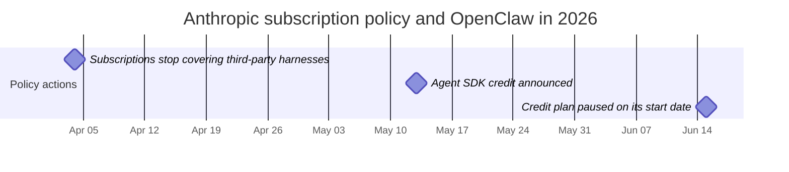

# OpenClaw Deep Dive: The Open-Source Personal AI Agent

OpenClaw is an **open-source, self-hosted personal AI agent** that executes tasks through LLMs using messaging platforms as its primary interface. You talk to it via WhatsApp, Telegram, Slack, Discord, or Signal, and it talks back by running shell commands, controlling your browser, managing calendars, processing emails, and orchestrating multi-step workflows.

## Table of Contents

- [What Is OpenClaw](#what-is-openclaw)
- [History: Clawdbot to Moltbot to OpenClaw](#history)
- [Architecture Deep Dive](#architecture)
- [The AgentSkills System](#the-agentskills-system)
- [LLM Provider Configuration](#llm-provider-configuration)
- [Messaging Platform Integrations](#messaging-platform-integrations)
- [Security Model](#security-model)
- [Deployment Patterns](#deployment-patterns)
- [Performance Optimization and Scaling](#performance-optimization-and-scaling)
- [Real-World Use Cases](#real-world-use-cases)
- [Limitations and When NOT to Use OpenClaw](#limitations-and-when-not-to-use-openclaw)
- [The 2026 Anthropic Subscription-Policy Incident](#the-2026-anthropic-subscription-policy-incident)
- [Comparison with Alternatives](#comparison-with-alternatives)
- [Getting Started: Quick Setup Guide](#getting-started)
- [System Design Interview Angle](#system-design-interview-angle)
- [References](#references)

---

## What Is OpenClaw

OpenClaw is:

- **A personal AI agent**: Not a chatbot, but an autonomous agent that acts on your behalf
- **Self-hosted**: Runs on your machine, VPS, or Raspberry Pi, so you control your data
- **Messaging-native**: Lives in chat apps you already use (WhatsApp, Telegram, Slack, Discord, Signal, iMessage, Teams, and 20+ others)
- **LLM-agnostic**: Works with Claude, GPT, Gemini, Muse Spark, DeepSeek, or local models (recent releases added GPT-6.1 Sol, GPT-6 Astra, Fable 5.1 and Muse Spark 1.3)
- **Skill-extensible**: About 50 bundled skills (bundled plugins ship more), a public registry (ClawHub), and a simple format for writing custom ones
- **Open source**: MIT-licensed, with about 391K GitHub stars and 82K forks on October 1, 2026
- **Foundation-governed**: Stewarded by the OpenClaw Foundation, an independent 501(c)(3) that employs the core team and signs releases. There is no paid tier, hosted service or token, and the README says OpenAI is "a donor, not an owner" (Amazon, Red Hat, NVIDIA and GitHub are among the other donors and infrastructure supporters)
- **Two release trains**: Calendar-versioned builds (2026.9.7 on September 30, 2026) and gateway-only extended-stable builds that the project treats as its LTS line (2026.8.35 on October 2). Pin production gateways to the extended-stable train

```
# The simplest way to start (macOS / Linux / WSL2)
curl -fsSL https://openclaw.ai/install.sh | bash

# Or via npm (Node 24.16+ or 26.1+; Node 26 recommended)
# --allow-scripts needs npm 11.16+; drop it on older npm
npm install -g openclaw@latest --allow-scripts=openclaw
openclaw onboard --install-daemon
openclaw gateway status
```

**The key difference from chatbots:**
- A plain chat assistant: You type, it replies with text
- OpenClaw: You type, it **does things**: runs commands, edits files, sends emails, controls smart home devices, manages your calendar

The chat assistants are closing that gap from the other side. OpenAI dots (announced September 29, 2026) and Meta Muse (September 8) give hosted assistants their own cloud computers, and Anthropic is folding Cowork into the Claude app, with Claude asking for approval before it acts. OpenClaw's distinguishing traits are now self-hosting, model choice and messaging reach, not the ability to act.

---

## History

### The Naming Timeline

| Date | Name | Event |
|------|------|-------|
| November 2025 | **Clawdbot** | Peter Steinberger publishes first prototype, built in roughly one hour |
| January 2026 | 2,000 stars | Early adopters discover the project |
| January 27, 2026 | **Moltbot** | Renamed after Anthropic trademark complaints (lobster theme preserved) |
| January 30, 2026 | **OpenClaw** | Renamed again; Steinberger found "Moltbot" awkward to say |
| February 2026 | 145,000+ stars | Explosive growth, surpasses many established open-source projects |
| February 14, 2026 | (no rename) | Steinberger joins OpenAI, citing access to resources needed to scale |
| March 2026 | 250,000+ stars | Overtakes React on GitHub; one of the fastest-growing OSS projects ever |
| September 30, 2026 | ~391,000 stars | Stewarded by the independent OpenClaw Foundation; extended-stable (LTS-equivalent) gateway builds alongside calendar releases |

### The Creator

Peter Steinberger is an Austrian software engineer who previously spent 13 years building PSPDFKit, a PDF toolkit used by developers worldwide, before selling the company in 2024. He describes himself as a "vibe coder" and famously said he ships code he does not read, embodying the new AI-first development philosophy where the human provides intent and the AI provides implementation.

### Why It Went Viral

OpenClaw hit a nerve because it solved a real problem: LLMs are powerful but stateless. Every conversation starts from zero. OpenClaw gives LLMs **persistence** (memory across sessions), **agency** (the ability to act, not just talk), and **reach** (integration with the apps you already use). The fact that it was self-hosted and open source meant anyone could run it without trusting a third-party service with their data.

---

## Architecture

### High-Level Overview

```
                         OPENCLAW ARCHITECTURE
 ============================================================

  Messaging Platforms              OpenClaw Gateway           LLM Providers
 ┌──────────────┐              ┌─────────────────────┐     ┌──────────────┐
 │  WhatsApp    │──┐           │                     │     │  Anthropic   │
 │  (Baileys)   │  │           │   GATEWAY            │     │  (Claude)    │
 ├──────────────┤  │  Channel  │   ┌──────────────┐  │     ├──────────────┤
 │  Telegram    │──┼──Adapters─┼──>│  Router      │  │     │  OpenAI      │
 │  (grammY)    │  │           │   │  (sessions,  │  │     │  (GPT-6)     │
 ├──────────────┤  │           │   │   bindings)  │  │     ├──────────────┤
 │  Slack       │──┤           │   └──────┬───────┘  │     │  Google      │
 │  (Bolt)      │  │           │          │          │     │  (Gemini)    │
 ├──────────────┤  │           │   ┌──────▼───────┐  │     ├──────────────┤
 │  Discord     │──┤           │   │ Agent Runtime│──┼────>│  DeepSeek    │
 │  (discord.js)│  │           │   │ (AI loop,    │  │     ├──────────────┤
 ├──────────────┤  │           │   │  tool calls, │  │     │  Local/      │
 │  Signal      │──┤           │   │  memory)     │  │     │  Ollama      │
 │  (signal-cli)│  │           │   └──────┬───────┘  │     └──────────────┘
 ├──────────────┤  │           │          │          │
 │  iMessage    │──┤           │   ┌──────▼───────┐  │     Tools & Skills
 │  (imsg)      │  │           │   │  Tool Layer  │  │     ┌──────────────┐
 ├──────────────┤  │           │   │  (skills,    │──┼────>│  Shell exec  │
 │  Teams       │──┘           │   │   browser,   │  │     │  Browser     │
 │  IRC, Matrix │              │   │   files,     │  │     │  File I/O    │
 │  20+ more... │              │   │   cron)      │  │     │  Calendar    │
 └──────────────┘              │   └──────────────┘  │     │  Email       │
                               │                     │     │  100+ more   │
                               │   ┌──────────────┐  │     └──────────────┘
                               │   │  Memory &    │  │
                               │   │  State       │  │     Storage
                               │   │  (sessions,  │──┼────>┌──────────────┐
                               │   │   workspace) │  │     │  ~/.openclaw/│
                               │   └──────────────┘  │     │  (state,     │
                               └─────────────────────┘     │   memory,    │
                                                           │   config)    │
                                localhost:18789             └──────────────┘
```

### Core Components

**1. The Gateway**

The Gateway is a long-running WebSocket server (default: `localhost:18789`) that serves as the single source of truth for sessions, routing, and channel connections. It handles:

- Accepting connections from all messaging platforms via channel adapters
- Routing messages to the correct agent
- Session management and state persistence
- Authentication and access control
- Hot-reloading configuration changes

**2. Channel Adapters**

When a message arrives from any platform, a channel adapter normalizes it into a standard internal format. Each adapter wraps a platform-specific library:

| Platform | Adapter Library | Protocol |
|----------|----------------|----------|
| WhatsApp | Baileys | WebSocket (unofficial) |
| Telegram | grammY | Bot API |
| Slack | Bolt | Events API |
| Discord | discord.js | Gateway API |
| Signal | signal-cli | signal-cli daemon (native or container) |
| iMessage | imsg (official plugin; BlueBubbles support was removed) | JSON-RPC over stdio |
| IRC | irc-framework | IRC protocol |
| Matrix | matrix-js-sdk | Matrix protocol |
| Microsoft Teams | Bot Framework | REST API |

**3. Agent Runtime**

The Agent Runtime is the AI loop. For each incoming message, it:

1. Assembles context from session history, workspace memory, and relevant skills
2. Sends the assembled prompt to the configured LLM
3. Receives tool calls from the model
4. Executes tool calls against the system capabilities
5. Returns results to the model for next iteration
6. Persists updated state (memory, files, session history)

**4. Multi-Agent Routing**

OpenClaw supports running multiple agents inside one Gateway process. Each agent gets its own workspace, agentDir, sessions, and tool configuration. Agents are declared under `agents.entries`, and inbound messages are routed to them by top-level `bindings` that match on channel, account or peer:

```json5
{
  agents: {
    entries: {
      work: { workspace: "~/.openclaw/workspace-work" },
      home: { workspace: "~/.openclaw/workspace-home" },
      devops: { workspace: "~/.openclaw/workspace-devops" },
    },
  },
  bindings: [
    { agentId: "work", match: { channel: "slack", accountId: "*" } },
    { agentId: "home", match: { channel: "whatsapp", accountId: "personal" } },
    { agentId: "home", match: { channel: "telegram", accountId: "*" } },
    { agentId: "devops", match: { channel: "discord", accountId: "*" } },
  ],
}
```

Run `openclaw agents list --bindings` to see which agent each route resolves to. Older configs that used an `agents.list` array are migrated by `openclaw doctor --fix`.

This means you can have a work assistant on Slack, a personal assistant on WhatsApp, and a DevOps bot on Discord, all running from one Gateway, with completely isolated memory and permissions.

---

## The AgentSkills System

### How Skills Work

Skills are the mechanism by which OpenClaw gains capabilities beyond basic conversation. Each skill is a directory containing a `SKILL.md` file with YAML frontmatter (metadata) and Markdown instructions (behavior). Only `name` and `description` are required; an optional `metadata.openclaw` block gates the skill on what the host actually has.

```
~/.openclaw/skills/
  weather/
    SKILL.md           # Required: metadata + instructions
    scripts/
      fetch_weather.py # Optional: executable scripts
    references/
      api_docs.md      # Optional: supplementary docs

  email-manager/
    SKILL.md
    scripts/
      process_inbox.py
```

### SKILL.md Format

```yaml
---
name: weather-lookup
description: >
  Fetch current weather and forecasts for any location. Use when the user
  asks about temperature, rain, wind, or whether to bring an umbrella.
metadata: {"openclaw": {"requires": {"bins": ["curl"]}, "os": ["darwin", "linux"]}}
---

# Weather Lookup Skill

When the user asks about weather:

1. Use the web_search tool to find current conditions
2. Extract temperature, humidity, wind, and forecast
3. Present in a concise, readable format
4. Include both metric and imperial units

## Example Response Format

"Currently 72F (22C) and partly cloudy in San Francisco.
Forecast: Clear skies through Thursday, rain expected Friday."
```

There is no trigger-keyword field. The `description` is what the model matches against, so write it as "what this does, and when to use it."

### Skill Resolution Order

Skills can live in multiple locations. When a name collision occurs, the most local copy wins:

```
Priority (highest first):
  1. <workspace>/skills/             # Project-specific skills
  2. <workspace>/.agents/skills/     # Project agent skills
  3. ~/.agents/skills/               # Personal agent skills
  4. ~/.openclaw/skills/             # Managed/local skills (state directory)
  5. Per-agent workshop skills       # Under the agent's directory
  6. Bundled skills                  # Ship with OpenClaw
  7. skills.load.extraDirs, plugins  # Extra directories and plugin-provided skills
```

A non-empty per-agent allowlist (`agents.entries.<id>.skills`) is the final set for that agent; it replaces `agents.defaults.skills` rather than merging with it.

### Selective Injection

OpenClaw does **not** inject every skill's instructions into every prompt. Two filters run first: load-time gating drops skills whose `metadata.openclaw` requirements are not met (missing binaries, env vars or config keys, wrong OS), and the agent's skill allowlist drops the rest. The eligible skills go into the system prompt as a compact XML list of name, description and location, which the docs put at about 24 tokens per skill plus the length of those fields. The full `SKILL.md` body is read on demand, and a `skills_search` tool finds skills that did not fit the prompt budget. This is the same progressive-disclosure design as Agent Skills elsewhere: the per-skill cost is small but it is paid on every turn. A rough estimate: 200 eligible skills with one- or two-sentence descriptions add 10K-15K tokens of standing prompt, which is why the allowlist matters.

### Creating a Custom Skill

```bash
# Create the skill directory
mkdir -p ~/.openclaw/skills/deploy-checker
cd ~/.openclaw/skills/deploy-checker

# Create the SKILL.md
cat > SKILL.md << 'EOF'
---
name: deploy-checker
description: >
  Monitor deployment status across staging and production: health endpoints,
  recent commits, and CI status. Use when asked whether staging or prod is up,
  or what was deployed last.
metadata: {"openclaw": {"requires": {"bins": ["curl", "git"]}}}
---

# Deploy Checker

When asked about deployment status:

1. Run `curl -s https://staging.myapp.com/health` to check staging
2. Run `curl -s https://myapp.com/health` to check production
3. Check recent git log: `git log --oneline -5`
4. Report status in a clear format

## Response Format

Staging: [UP/DOWN] - version X.Y.Z - deployed 2h ago
Production: [UP/DOWN] - version X.Y.Z - deployed 1d ago
Last 3 commits: ...
EOF
```

### Community Skills Ecosystem

The OpenClaw skills ecosystem has grown rapidly, with community-maintained collections containing thousands of skills across categories like DevOps, home automation, content creation, data analysis, and more. The public registry is ClawHub, and `openclaw skills install @owner/<slug>` installs from it. However, this openness carries risk: the docs tell you to treat third-party skills as untrusted code, read them before enabling, and prefer sandboxed runs, and the early catalog had incidents with malicious scripts.

---

## LLM Provider Configuration

### Configuration File

OpenClaw reads its configuration from `~/.openclaw/openclaw.json` (JSON5 format: comments and trailing commas allowed). The Gateway watches this file and applies changes automatically via hot reload.

The official provider plugins (Anthropic, OpenAI, Google, DeepSeek, Ollama and many others) need only credentials, which `openclaw onboard` stores or which come from environment variables such as `ANTHROPIC_API_KEY`, `OPENAI_API_KEY` and `DEEPSEEK_API_KEY`; a few, DeepSeek among them, first need a one-line `openclaw plugins install`. Model references use `provider/model`. The `models.providers` block is for custom base URLs, proxies and self-hosted OpenAI-compatible servers:

```json5
{
  // Default model plus a cross-vendor fallback chain
  agents: {
    defaults: {
      model: {
        primary: "anthropic/claude-sonnet-5-5",
        fallbacks: ["openai/gpt-6-sol", "deepseek/deepseek-flash"],  // deepseek-flash = V4.1-Flash
      },
    },
  },

  // Custom provider: an internal OpenAI-compatible gateway
  models: {
    mode: "merge",
    providers: {
      "corp-gateway": {
        baseUrl: "https://llm-gateway.internal.example.com/v1",
        apiKey: "${CORP_GATEWAY_KEY}",  // env var substitution
        api: "openai-completions",
        models: [{ id: "qwen3.8-27b", name: "Qwen3.8 27B", maxTokens: 4096 }],
      },
    },
  },
}
```

Two details that bite. For Ollama, use the native URL (`http://localhost:11434`), not the OpenAI-compatible `/v1` path: the docs warn that `/v1` breaks tool calling and models emit raw tool-call JSON as text. And fallbacks attach to the configured default; a per-agent model is strict (no fallback) unless that agent's entry lists its own `fallbacks`.

### Provider Selection Strategy

| Provider | Best For | Trade-offs |
|----------|----------|------------|
| Anthropic (Claude) | Complex reasoning, coding tasks, long-context (1M context at flat pricing) | Higher cost, best quality: Opus 5.5 lists at $4/$20 per 1M tokens and Fable 5.1 at $10/$50. Thinking cannot be disabled on Opus 5.5 |
| OpenAI (GPT-6 family) | General-purpose; GPT-6 Luna ($0.10/$0.50) for cheap routing, GPT-6 Sol or GPT-6.1 Sol ($2/$10) as the workhorse | Requests above 272K input tokens are billed entirely at long-context rates |
| Google (Gemini) | Budget-conscious testing, generous free tier; Gemini 3.8 Flash at an introductory $0.75/$3.75 through December 31, 2026 | Price doubles to $1.50/$7.50 on January 1, 2027; Flash-tier reasoning trails the top Claude and GPT models (AA Intelligence Index v4.3: 41 vs 58 for Opus 5.5) |
| DeepSeek | Cheapest hosted option: V4.1-Flash (`deepseek-flash`) at $0.30/$1.20 per 1M in peak hours and half that off-peak; V4-Pro still served at $1.32/$3.96 peak; 1M context; best for high-volume cache-friendly workloads | Peak windows (01:00-04:00 and 06:00-10:00 UTC, weekdays) double the price; legacy model names are served by newer models, so pin and verify; MIT weights also self-hostable |
| Local (Ollama) | Privacy-critical, offline use | Requires powerful hardware, lower quality |

### Model Routing Within OpenClaw

You can configure different models for different agents, allowing cost optimization:

```json5
{
  agents: {
    defaults: {
      model: "openai/gpt-6-luna",  // Cheap default
    },
    entries: {
      coding: {
        workspace: "~/.openclaw/workspace-coding",
        // Premium for code, with its own fallback (per-agent models are strict otherwise)
        model: { primary: "anthropic/claude-sonnet-5-5", fallbacks: ["openai/gpt-6.1-sol"] },
      },
      reminders: {
        workspace: "~/.openclaw/workspace-reminders",
        model: "google/gemini-3.8-flash",  // Cheap for simple tasks
      },
    },
  },
  // Route channels or peers to these agents with top-level bindings (see Multi-Agent Routing)
}
```

`agents.defaults.utilityModel` covers the other cost leak: short internal calls such as session titles and progress narration. Left unset, OpenClaw uses the primary provider's declared small model where one exists.

---

## Messaging Platform Integrations

OpenClaw supports 20+ messaging platforms through its channel adapter architecture. Telegram ships in the core install and is the docs' recommended first channel (a bot token, no plugin). Most other channels are official plugins installed on demand (`openclaw plugins install @openclaw/<id>`, or during `openclaw onboard`), and a few, such as WeChat, are maintained outside the repo. Each plugin is code that runs inside your Gateway, so review it as you would a skill.

### Supported Platforms

| Platform | Library | Status | Notes |
|----------|---------|--------|-------|
| WhatsApp | Baileys | Stable | Unofficial API; personal account required |
| Telegram | grammY | Stable | Official Bot API; most reliable channel |
| Slack | Bolt | Stable | Workspace app installation required |
| Discord | discord.js | Stable | Bot token required |
| Signal | signal-cli | Stable | Requires linked device; native daemon or container |
| iMessage | imsg | Stable | macOS only; official plugin over JSON-RPC (BlueBubbles support was removed) |
| Google Chat | Chat API | Stable | Workspace admin approval |
| Microsoft Teams | Bot Framework | Supported | Official plugin; beta in early 2026, now one of the README's headline channels |
| IRC | irc-framework | Stable | Classic protocol support |
| Matrix | matrix-js-sdk | Stable | Federated, self-hosted friendly |
| Mattermost | API | Stable | Self-hosted Slack alternative |
| LINE | Messaging API | Stable | Popular in Japan/SE Asia |
| Feishu (Lark) | Open API | Stable | Popular in China |
| Twitch | TMI.js | Stable | Chat-only |
| WeChat | openclaw-weixin (external plugin) | Beta | Maintained outside the OpenClaw repo |
| Nostr | NIP-04 | Beta | Encrypted DMs on a decentralized protocol |
| WebChat | Built-in | Stable | Browser-based fallback |
| A2A | A2A 1.0 JSON-RPC (bundled plugin) | Supported | Not a chat app: lets external agents message your OpenClaw agents, so apply the same allowlists you would to a human sender |

### Unified Context Across Channels

A critical architectural decision: the Gateway maintains **one unified memory system** across all channels. If you tell your agent something on WhatsApp, it remembers when you message from Slack. This means your AI agent has consistent context regardless of which app you use to reach it.

```
          WhatsApp ──┐
          Telegram ──┤     ┌─────────────────────┐
          Slack    ──┼────>│  Shared Memory Pool  │
          Discord  ──┤     │  (per-agent, cross-  │
          Signal   ──┘     │   channel sessions)  │
                           └─────────────────────┘
```

---

## Security Model

### Security Philosophy

OpenClaw's security model assumes a "personal assistant" threat model: one trusted operator, potentially multiple agents. The priorities are:

1. **Identity first**: Who can talk to the bot?
2. **Scope next**: Where is the bot allowed to act?
3. **Model last**: Assume the model can be manipulated, limit blast radius

### Permission Layers

```
 Layer 1: Channel Authentication
 ─────────────────────────────────
 Who can message the bot?
 Configured per-channel with allowlists.
 Unknown DM senders get a pairing code
 by default, not a response.

 Layer 2: Agent Tool Allow/Deny
 ─────────────────────────────────
 Which tools can this agent use?
 Configured per-agent in agents.entries.<id>.tools.

 Layer 3: Sandbox Tool Policy
 ─────────────────────────────────
 Separate from agent permissions.
 Even if agent allows a tool, sandbox may block it.

 Layer 4: Elevated Access
 ─────────────────────────────────
 Some tools require host-level access.
 Gated globally and per agent with allowFrom
 lists; the agent gate can only narrow the
 global one, and a sender must pass both.
```

### Sandbox Isolation

Sandboxing is **off by default**: tools for the main session run on the host unless you configure it. Turn it on for non-main sessions (sub-agents, cron jobs, isolated tasks) at minimum, or for everything:

```json5
// ~/.openclaw/openclaw.json
{
  agents: {
    defaults: {
      sandbox: {
        mode: "non-main",          // "off" (default) | "non-main" | "all"
        backend: "docker",
        scope: "session",          // one container per session; "agent" shares one per agent
        workspaceAccess: "none",   // the agent workspace is not visible inside the sandbox
        docker: {
          image: "openclaw-sandbox:bookworm-slim",
          network: "none",         // no egress
          readOnlyRoot: true,
          capDrop: ["ALL"],
        },
      },
    },
  },
}
```

With `network: "none"` (the Docker backend's default), a sandboxed sub-agent cannot make outbound requests, cannot exfiltrate data, and cannot reach external services, even if running malicious code. The trade-off is that `non-main` leaves your primary conversation, the one with the most context and the most permissions, on the host.

### Critical Security Warnings

**Loopback is the first line of defense**: Host installs bind the Gateway to loopback, so network reachability does much of the security work. If the Gateway sits behind an improperly configured reverse proxy that forwards all requests to localhost, every external caller arrives from loopback, and anything the Gateway grants to local connections it now grants to the internet. Container images bind to an exposed interface and rely on the generated gateway token instead. Always keep gateway authentication on for remote deployments, and remember the project supports one trusted operator per gateway, not mutually hostile tenants.

**Skill supply chain**: The community skills catalog has had incidents with malicious packages. Always review third-party skills before installation. Pin skill versions, and pin them by content, not by ref: Plugin4Shell (AIR Security, September 2026) showed that agents installing a SHA-pinned plugin could resolve to attacker code: a repo owner could create a branch named after the SHA and make it the default, and the agents never verified the commit they actually checked out. The MCP skills extension (`io.modelcontextprotocol/skills`, final September 13, 2026) takes the same view: a SHA-256 file manifest, where any changed, added or removed file revokes approval. Use the sandbox for untrusted skills.

### Hardening Checklist

```
[x] Run `openclaw security audit` after every config change
[x] Set state directory permissions to 700
[x] Configure channel allowlists (do not leave open)
[x] Keep DM pairing on; approve senders explicitly
[x] Enable sandbox for sub-agents and cron jobs (mode: "non-main" or "all")
[x] Pin the gateway to the extended-stable release train
[x] Use environment variables for API keys, never hardcode
[x] Put Gateway behind authenticated reverse proxy for remote access
[x] Review all third-party skills before installation
[x] Set up monitoring for unusual tool invocations
[x] Restrict elevated tool access to specific users
[x] Run Gateway as non-root user
[x] Enable TLS for WebSocket connections
```

---

## Deployment Patterns

### Option 1: Local Install (Fastest Start)

```bash
# Install the CLI, then let onboarding set up keys, channels and the background service
npm install -g openclaw@latest --allow-scripts=openclaw
openclaw onboard --install-daemon
openclaw gateway status
openclaw security audit
```

**Requirements**: Node.js 24.16+ or 26.1+ (Node 26 recommended), 512MB RAM, macOS, Linux or Windows (WSL2 or PowerShell installer).

### Option 2: Docker (Recommended for Production)

The repo's `./scripts/docker/setup.sh` builds or pulls the image, runs onboarding, and writes a gateway token to `.env`. If you manage compose yourself, a minimal service along the same lines:

```yaml
# docker-compose.yml
services:
  openclaw-gateway:
    image: ghcr.io/openclaw/openclaw:extended-stable  # LTS-style train; :latest tracks stable
                                                      # releases; -browser variants bundle Chromium
    restart: unless-stopped
    ports:
      - "127.0.0.1:18789:18789"               # keep the port off public interfaces
    volumes:
      - ./openclaw-state:/home/node/.openclaw # Config, state and memory
    environment:
      - OPENCLAW_GATEWAY_TOKEN=${OPENCLAW_GATEWAY_TOKEN}  # the image binds to an exposed interface
      - ANTHROPIC_API_KEY=${ANTHROPIC_API_KEY}
      - OPENAI_API_KEY=${OPENAI_API_KEY}
    mem_limit: 2g
    logging:
      driver: json-file
      options:
        max-size: "10m"
        max-file: "3"
```

```bash
docker compose up -d
docker compose logs -f openclaw-gateway  # Watch logs
```

### Option 3: Cloud VPS (Always-On)

OpenClaw is lightweight: any machine with 512MB RAM and 1 CPU core is sufficient. A $4-6/month VPS works.

**Quick deploy options:**
- **DigitalOcean**: 1-Click App with security hardening built in
- **Railway**: One-click deploy button from GitHub README (~5 min)
- **Contabo**: Free 1-click OpenClaw add-on for VPS plans
- **AWS Lightsail**: $3.50/month instance runs it comfortably
- **Raspberry Pi**: Runs well on Pi 4 with 4GB RAM

### Production Architecture

```
                    PRODUCTION DEPLOYMENT
 ====================================================

  Internet
     │
     ▼
 ┌───────────────┐
 │  Cloudflare   │     SSL termination
 │  (CDN/WAF)    │     DDoS protection
 └───────┬───────┘
         │
         ▼
 ┌───────────────┐
 │  Nginx        │     Reverse proxy
 │  (with auth)  │     Rate limiting
 └───────┬───────┘     WebSocket upgrade
         │
         ▼
 ┌───────────────────────────────────────┐
 │  Docker                              │
 │  ┌─────────────────────────────────┐ │
 │  │  openclaw-gateway               │ │
 │  │  (main process)                 │ │
 │  └────────────┬────────────────────┘ │
 │               │                      │
 │  ┌────────────▼────────────────────┐ │
 │  │  openclaw-sandbox               │ │
 │  │  (isolated sub-agents)          │ │
 │  │  network: none                  │ │
 │  └─────────────────────────────────┘ │
 │                                      │
 │  Volume: ./openclaw-state (700)      │
 └──────────────────────────────────────┘
         │
         ▼
    LLM APIs
    (Anthropic, OpenAI, etc.)
```

### Nginx Configuration for Remote Access

```nginx
# /etc/nginx/sites-available/openclaw
server {
    listen 443 ssl http2;
    server_name openclaw.yourdomain.com;

    ssl_certificate /etc/letsencrypt/live/openclaw.yourdomain.com/fullchain.pem;
    ssl_certificate_key /etc/letsencrypt/live/openclaw.yourdomain.com/privkey.pem;

    location / {
        proxy_pass http://127.0.0.1:18789;
        proxy_http_version 1.1;
        proxy_set_header Upgrade $http_upgrade;
        proxy_set_header Connection "upgrade";
        proxy_set_header Host $host;
        proxy_set_header X-Real-IP $remote_addr;

        # Basic auth for web interface
        auth_basic "OpenClaw";
        auth_basic_user_file /etc/nginx/.htpasswd;
    }
}
```

---

## Performance Optimization and Scaling

### Memory Guidelines

| Deployment | Recommended RAM | Rationale |
|------------|----------------|-----------|
| Personal, light use | 512MB - 1GB | Few skills, short conversations |
| Personal, daily use | 4GB | Moderate skill count, browser automation |
| Team or high-frequency | 8GB | Multiple agents, concurrent sessions |
| Production standard | 16GB | Full skill suite, heavy automation |

### Context Window Management

Two costs grow with history. Attention compute grows quadratically with context length, which shows up as latency on long prompts. The bill grows too: every turn re-sends the whole conversation, so input tokens per conversation grow roughly with the square of the turn count unless the stable prefix is served from the prompt cache. Practical optimizations:

- **Limit context window**: 100K tokens is enough for most tasks
- **Start new conversations**: Long history accumulates hundreds of messages; restart periodically
- **Disable unused skills**: Each loaded skill adds to the context budget
- **Keep the prefix cacheable**: Put SOUL.md, AGENTS.md and skill descriptions first and keep them stable between turns. Cache reads cost 0.1x input on most Claude models (0.05x on Opus 5.5, 0.025x on Fable 5.1) and 0.1x on OpenAI's GPT-5.6 and GPT-6 models (0.05x on GPT-6.1 Sol), so a warm prefix is close to free and a cold one is billed at full input price

### Skill Optimization

```
 DO: Enable only skills you actively use
 DO: Write concise SKILL.md descriptions
 DO: Say in the description when to use the skill
 DO: Set a per-agent skill allowlist

 DON'T: Enable everything "just in case"
 DON'T: Write verbose skill instructions
 DON'T: Load 50+ skills simultaneously
```

Each enabled skill adds context the agent must evaluate on every turn. If you have not used a skill in the past week, disable it.

### Latency Reduction

1. **Reduce thinking**: The `thinkingDefault` setting controls internal reasoning. For real-time interactions, skipping chain-of-thought cuts response time substantially. The newest Claude models no longer let you switch it off (Opus 5.5 always thinks; Sonnet 5.5's lowest setting is `between_tools`, and `disabled` returns HTTP 400), so lower the effort level instead or route latency-sensitive agents to a model that allows it
2. **Use faster models**: Route simple tasks (reminders, lookups) to smaller models
3. **Co-locate providers**: Use an LLM provider and region close to your server
4. **Monitor with Docker**: `docker stats` on the gateway container for real-time resource usage

---

## Real-World Use Cases

### 1. Development Workflow Orchestrator

A supervisor agent named "Patch" coordinates 5-20 parallel Claude Code instances via Telegram. The developer sends high-level instructions from their phone, and the supervisor spins up coding agents, assigns tasks, reviews output, runs tests, and merges code.

```
Developer (phone)
     │
     ▼ Telegram message: "Fix auth bug and add rate limiting"
┌─────────────┐
│  Patch      │ (OpenClaw supervisor agent)
│  Agent      │
└──────┬──────┘
       │ Spawns parallel workers
       ├──> Claude Code instance 1: Fix auth bug
       ├──> Claude Code instance 2: Add rate limiting
       └──> Claude Code instance 3: Update tests
              │
              ▼
       Results merged, tests pass
       PR created automatically
```

### 2. Email Triage at Scale

One developer used the himalaya CLI integration to give OpenClaw access to an email account with 15,000 messages. The agent processed the backlog: unsubscribing from spam, categorizing by urgency, and drafting replies for review.

### 3. Home Automation Hub

An agent named "Claudette" controls an entire house through Home Assistant, using the ha-mcp skill to access all Home Assistant entities. It controls Philips Hue lights, Elgato devices, and adjusts boiler settings based on weather forecasts, all via WhatsApp commands.

### 4. Content Production Pipeline

Multi-agent content workflows using parallel Discord-based workers:
- Agent 1: Research and outline
- Agent 2: Write draft
- Agent 3: Generate thumbnails and social media assets
- Supervisor: Review, edit, and publish

### 5. CI/CD Monitoring

An always-on agent watches GitHub Actions, GitLab CI, or Jenkins and alerts via Telegram when builds fail, tests error out, or deployments finish. It can also auto-triage failures and open issues.

### 6. Automated Client Onboarding

When a new client signs on, an agent kicks off a full workflow: creates a project folder, sends a welcome email, schedules a kickoff call, and adds follow-up reminders to the task list.

---

## Limitations and When NOT to Use OpenClaw

### Known Limitations

**Over-autonomy**: OpenClaw's autonomy can become a liability. You ask it to do one thing, and it may wander through reasoning loops, invoke tools repeatedly, or reinterpret your objective mid-execution. Outcomes require manual review.

**Configuration complexity**: Running OpenClaw well involves managing environments, permissions, tool connectors, and execution sandboxes. Many users report spending more time configuring than using the system.

**Memory fragility**: Session history now lives in a per-agent SQLite store and survives Gateway restarts, but the model only remembers across sessions what was written to the workspace memory files. A fresh `/new` session loads `MEMORY.md` plus today's and yesterday's daily notes; anything else has to be found by memory search, and a `MEMORY.md` that outgrows the bootstrap budget stays intact on disk but is truncated in the copy injected into context. The default background "dreaming" sweep that distills daily notes into `MEMORY.md` is convenient, and it is also a write path into every future prompt, so a poisoned note can persist.

**Resource consumption**: The container can use 2GB+ of RAM with many skills loaded. Long conversation history compounds this.

**Unofficial APIs**: WhatsApp integration uses Baileys (unofficial). This can break with WhatsApp updates and may violate terms of service. Similar risks exist for other unofficial adapters.

### When NOT to Use OpenClaw

| Scenario | Why Not | Better Alternative |
|----------|---------|-------------------|
| Multi-tenant SaaS | Not designed for hostile multi-user isolation | Custom agent framework with proper tenant boundaries |
| High-stakes automation | Unpredictable execution paths, hard to audit | Deterministic workflow engines (Temporal, Prefect) |
| Real-time systems | LLM latency (1-5s per turn) is too slow | Event-driven architecture |
| Regulated industries | No compliance certifications, audit trails are basic | Enterprise AI platforms with SOC2/HIPAA |
| Teams > 10 people | Single-operator trust model does not scale | Shared agent platforms with proper RBAC |
| Ambiguous real-world tasks | Works best in tightly scoped environments where mistakes are cheap | Human operators |

---

## The 2026 Anthropic Subscription-Policy Incident

OpenClaw's reliance on Claude Pro and Claude Max subscriptions to power agent work was, until April 2026, treated as a cost-control feature: users could run OpenClaw against their existing personal Claude plan instead of paying API rates. Starting April 4, 2026, Anthropic stopped letting subscription usage limits cover third-party harnesses such as OpenClaw. That usage could continue only as pay-as-you-go extra usage billed at API rates, and Anthropic tied the change to capacity, pointing at third-party tools that bypassed prompt caching. For heavy agent workloads the effective price jumped several-fold: press estimates put the subscription discount for that kind of usage at 5x or more against API rates.

The promised reversal is still unsettled. On May 13, Anthropic announced a monthly Agent SDK credit, due June 15, for programmatic use: $20 on Pro, $100 on Max 5x and $200 on Max 20x, covering the Agent SDK, `claude -p`, Claude Code GitHub Actions and third-party apps that authenticate through the Agent SDK, with usage beyond the credit billed at API rates only when extra usage is enabled. On June 15, the day it was due, Anthropic paused the plan. Its help center, last updated June 16, says Agent SDK, `claude -p` and third-party app usage still draw from the subscription's usage limits. OpenClaw's own Anthropic provider docs say the credit is unavailable while Anthropic revises it. In practice OpenClaw reaches a Pro or Max plan through Claude Code's own credentials, either the Claude CLI backend or a `claude setup-token` token, and that usage draws on the plan's limits; for shared production automation, OpenClaw's docs recommend an Anthropic API key with pay-as-you-go billing.

### Timeline of the Incident



### What It Means Architecturally

The incident was not a security event. It was a product-policy event with security and reliability consequences. Three lessons follow:

**Provider policy is part of your architecture.** Within ten weeks, Anthropic changed what subscriptions cover for third-party harnesses, announced a replacement scheme, and paused that scheme on its start date. If your agent platform's economics depend on a specific provider plan, a change to what that plan covers is a price shock overnight, and requests simply stop if no fallback billing is enabled. The provider's policy team is on your critical path. Treat their Terms of Service as a runtime dependency, not a legal artifact.

**Multi-provider abstraction is operational hygiene, not optimization.** OpenClaw users with a second provider configured per agent could reroute when the Claude economics changed. Users who had hard-coded a single provider in every agent definition could only pay the new rate or stop. The abstraction layer is cheap to build and the failure mode it covers is real. Ordinary outages make the same point: Anthropic logged at least 12 major or critical incidents between August 16 and September 29, 2026, and OpenAI had an outage of about 5 hours 20 minutes across the API, ChatGPT and Codex on September 29. A fallback that stays inside one vendor does not cover either.

**Self-host backstops matter for personal-data agents.** Keep at least one fallback path that no vendor's plan terms can switch off, such as a local model served through Ollama or vLLM, and accept lower quality on that path in exchange for availability. The lesson is not that local models are competitive with frontier models; it is that having a working fallback path, even at degraded quality, is part of a serious deployment.

### Vendor-Risk Checklist

- Every agent definition routes through a provider-abstraction layer; no agent hard-codes a single provider model name.
- The configuration includes a documented fallback provider per agent, with a tested switchover script.
- For personal-data or revenue-critical agents, at least one fallback path uses a self-hostable model (Ollama, vLLM, or a tenant-isolated cloud provider).
- The deployment's runbook treats provider Terms of Service and Acceptable Use as monitored documents, with subscription to provider security advisories and policy update mailing lists.
- Cost budgets in the agent config are set against the realistic worst case (direct API rates), not the optimistic case.
- A weekly canary test invokes each provider through the abstraction layer and alerts on 4xx changes, surfacing policy shifts before they hit production traffic.

**Sources:**
- [Axios: Anthropic blocks OpenClaw third-party agents](https://www.axios.com/2026/04/06/anthropic-openclaw-subscription-openai)
- [VentureBeat: Agent SDK credit announcement (May 13, 2026)](https://venturebeat.com/technology/anthropic-reinstates-openclaw-and-third-party-agent-usage-on-claude-subscriptions-with-a-catch)
- [Claude Help Center: Use the Claude Agent SDK with your Claude plan (pause notice, June 15, 2026)](https://support.claude.com/en/articles/15036540-use-the-claude-agent-sdk-with-your-claude-plan)
- [OpenClaw docs: Anthropic provider](https://docs.openclaw.ai/providers/anthropic)

---

## Comparison with Alternatives

| Feature | OpenClaw | Hermes Agent | Claude Code | Open Interpreter |
|---------|----------|-------------|-------------|-----------------|
| **Primary interface** | Messaging apps | Messaging apps | Terminal/CLI | Terminal/CLI |
| **Architecture** | Gateway + Channel Adapters | Learning loop + Skill memory | Agentic CLI | Codex-derived harness (Rust rewrite, July 2026); the original Python REPL lives on as a community fork |
| **LLM support** | Any (Claude, GPT, Gemini, local) | Any | Claude only | Any; tuned for low-cost open models |
| **Messaging platforms** | 20+ (WhatsApp, Telegram, Slack, etc.) | 6 (Telegram, Discord, Slack, WhatsApp, Signal, email) plus the CLI, from one gateway process | Terminal first; Telegram, Discord and iMessage through channels (research preview), and Slack through Claude in Slack | None (terminal only) |
| **Memory** | Cross-session per assistant | Multi-level (session, persistent, skill) | CLAUDE.md you write plus auto memory Claude writes per repository (on by default in local sessions) | Session only |
| **Skills/Plugins** | ~50 bundled plus plugin-shipped skills; ClawHub registry | Self-learning skill system | MCP tools, skills, plugins | Skills (for example a QA skill for browser and app testing) |
| **Self-hosted** | Yes (required) | Yes (required) | Runs locally; models hosted by Anthropic or a cloud provider; self-hosted runners for Team and Enterprise | Yes |
| **GitHub stars (Oct 2026)** | ~391K | ~251K | ~149K (issues and plugins repo; not open source) | ~68K |
| **Best for** | Multi-channel personal AI assistant | Personal agent that learns over time | Software development | Coding with low-cost models |
| **Weakest at** | Predictability, enterprise use | Platform reach | Non-coding tasks | Maturity (a months-old rewrite) |

### Choosing the Right Tool

```
Need multi-channel messaging?          --> OpenClaw
Need an agent that learns from usage?  --> Hermes Agent
Need autonomous coding specifically?   --> Claude Code
Need a coding agent on cheap models?   --> Open Interpreter (Rust rewrite)
Need always-on without running infra?  --> Managed persistent agents (OpenAI dots, Meta Muse)
Need enterprise-grade reliability?     --> Custom solution or managed harness (Claude Managed Agents,
                                           OpenAI Agents API, Bedrock Managed Agents)
```

---

## Getting Started

### Minimal Setup (5 Minutes)

```bash
# 1. Clone the repository
git clone https://github.com/openclaw/openclaw.git
cd openclaw

# 2. Use the prebuilt image (skip to build locally as openclaw:local)
export OPENCLAW_IMAGE="ghcr.io/openclaw/openclaw:latest"

# 3. Run setup: onboarding prompts for your LLM API key,
#    and a gateway token is generated and written to .env
./scripts/docker/setup.sh

# 4. Check logs
docker compose logs -f openclaw-gateway
```

### Connect Your First Channel (Telegram)

Telegram is the easiest channel to set up:

```bash
# Fastest path: the CLI writes the token into your config
# (with the Docker setup, run CLI commands as: docker compose run --rm openclaw-cli <command>)
openclaw channels add --channel telegram --token <bot-token-from-BotFather>
```

Or by hand:

```json5
// ~/.openclaw/openclaw.json
{
  channels: {
    telegram: {
      enabled: true,
      botToken: "${TELEGRAM_BOT_TOKEN}",  // From @BotFather
      dmPolicy: "pairing",                // unknown senders get a pairing code, not a reply
    },
  },
  agents: {
    defaults: {
      model: "anthropic/claude-sonnet-5-5",  // key comes from ANTHROPIC_API_KEY or onboarding
    },
  },
}
```

Then message the bot once and approve yourself: `openclaw pairing list telegram`, then `openclaw pairing approve telegram <CODE>` (codes expire after an hour). For a locked-down bot, use `dmPolicy: "allowlist"` with `allowFrom: ["tg:<your-user-id>"]` instead.

### Install Your First Skill

```bash
# Install a community skill from ClawHub (read its SKILL.md and scripts first)
openclaw skills install @owner/weather
openclaw skills update --all

# Or create your own (see AgentSkills section above)
cd ~/.openclaw/skills
mkdir my-skill && cat > my-skill/SKILL.md << 'EOF'
---
name: my-first-skill
description: A simple greeting skill
---
When the user says hello, respond warmly and offer to help.
EOF
```

### Verify Everything Works

```bash
# Open the Control UI at http://127.0.0.1:18789/ and sign in with the token from .env
# (npm installs: `openclaw gateway status` and `openclaw dashboard`)

# Check logs for errors
docker compose logs openclaw-gateway --tail 50

# Confirm the channel is live
openclaw channels status --probe

# After pairing, send a test message via Telegram to your bot
# It should respond within 2-5 seconds
```

---

## System Design Interview Angle

### Prompt: "Design a Personal AI Assistant Platform Like OpenClaw"

This is an excellent system design question because it covers messaging systems, agent orchestration, security, multi-tenancy, and real-time communication.

### Requirements Gathering

**Functional:**
- Users interact via messaging platforms (WhatsApp, Slack, Telegram)
- The agent can execute tasks: run commands, manage files, send emails, control devices
- Memory persists across sessions and channels
- Support for multiple isolated agents per user
- Extensible skill/plugin system

**Non-functional:**
- Low latency (< 5s response time including LLM inference)
- Self-hostable (user controls their data)
- Secure (sandboxed execution, permission controls)
- Reliable (24/7 uptime for always-on assistant)

### High-Level Design

```
                     SYSTEM DESIGN

 ┌──────────────────────────────────────────────────────┐
 │                   API Gateway                         │
 │  ┌────────────┐  ┌────────────┐  ┌────────────┐     │
 │  │ WhatsApp   │  │ Telegram   │  │ Slack      │     │
 │  │ Webhook    │  │ Webhook    │  │ Events API │     │
 │  └─────┬──────┘  └─────┬──────┘  └─────┬──────┘     │
 │        └───────────────┼───────────────┘             │
 │                        ▼                              │
 │              ┌─────────────────┐                     │
 │              │ Message Router  │                     │
 │              │ (user lookup,   │                     │
 │              │  agent binding) │                     │
 │              └────────┬────────┘                     │
 └───────────────────────┼──────────────────────────────┘
                         │
          ┌──────────────▼──────────────┐
          │       Agent Orchestrator     │
          │  ┌───────────────────────┐  │
          │  │ Context Assembler     │  │
          │  │ (memory + skills +    │  │
          │  │  session history)     │  │
          │  └───────────┬───────────┘  │
          │              ▼              │
          │  ┌───────────────────────┐  │
          │  │ LLM Router           │  │
          │  │ (model selection,    │  │
          │  │  fallback, caching)  │  │
          │  └───────────┬───────────┘  │
          │              ▼              │
          │  ┌───────────────────────┐  │
          │  │ Tool Executor        │  │
          │  │ (sandboxed, gated,   │  │
          │  │  audited)            │  │
          │  └───────────────────────┘  │
          └─────────────────────────────┘
                         │
          ┌──────────────▼──────────────┐
          │       Storage Layer          │
          │  ┌──────┐ ┌──────┐ ┌─────┐ │
          │  │Memory│ │State │ │Audit│ │
          │  │Store │ │Store │ │ Log │ │
          │  └──────┘ └──────┘ └─────┘ │
          └─────────────────────────────┘
```

### Key Design Decisions

**1. Why a single Gateway process (not microservices)?**

OpenClaw runs as a single process because the personal assistant use case does not need horizontal scaling. One user means one Gateway. This eliminates distributed system complexity (service discovery, inter-service auth, eventual consistency) and keeps deployment simple enough for a Raspberry Pi.

**2. Why channel adapters, not a unified messaging API?**

Each messaging platform has unique constraints (message size limits, media support, typing indicators, read receipts). A thin adapter per platform preserves platform-specific features while normalizing the core message format. This is the Adapter Pattern from Gang of Four.

**3. How to handle tool execution safety?**

The defense-in-depth approach: (a) Agent-level tool allowlists define what tools an agent can theoretically use. (b) Sandbox-level policy separately gates what tools can actually execute. (c) Elevated access requires per-user, per-channel authorization. (d) Docker isolation for sub-agents ensures that even if a malicious prompt tricks the model, the blast radius is contained.

**4. How to manage memory without a vector database service?**

OpenClaw keeps memory as plain Markdown files in the agent workspace (`MEMORY.md` for curated facts, `memory/YYYY-MM-DD.md` for daily notes), and those files are the source of truth. The default memory engine indexes them in an embedded SQLite store with keyword, vector and hybrid search, so there is no separate vector database to run; LanceDB and Honcho backends are optional plugins. For a single-user agent, a few hundred files fit comfortably in an embedded index. The design point for an interview: humans can read, diff and fix the memory, and the index is rebuildable from it.

**5. How to handle multi-channel session continuity?**

All channels route through the same Router, which maps platform-specific user IDs to a unified internal user identity. The memory store is keyed by agent (not channel), so switching from WhatsApp to Slack mid-conversation maintains context. This is conceptually similar to how a CRM links email, phone, and chat to one customer record.

### Scaling Discussion

| Scale | Architecture | Notes |
|-------|-------------|-------|
| 1 user | Single process on VPS | OpenClaw's default design |
| 10 users | Multiple Gateway instances, one per user | Each user self-hosts their own |
| 1,000 users | Managed multi-tenant platform | Requires complete redesign: proper isolation, shared infra, billing |
| 100K+ users | Distributed system with agent pools | Need horizontal scaling, queue-based dispatch, shared skill registry |

The architectural jump from "personal assistant" to "multi-tenant platform" is significant. OpenClaw intentionally does not cross this boundary, which is both a strength (simplicity) and a limitation (does not scale to a SaaS product without major rearchitecting).

The hosted products that launched in September 2026 show what the far end of that table looks like. OpenAI dots, Meta Muse and Microsoft Copilot Autopilot each give every agent its own VM (or a computer inside the customer tenant) plus its own identity, and they replace per-message approval with declarative rules: dots, for example, can allow, block or require approval per action, auto-reviews anything that touches accounts or shares information, and drops to read-only research when no task is active. Credentials live in a vault the model never reads. In an interview, contrast this with OpenClaw's single-process, single-operator design: the jump to 100K users is not a scaling exercise on the Gateway, it is a change in the trust model.

### Follow-up Questions an Interviewer Might Ask

**Q: How would you add a vector database for long-term memory?**
For one user, you mostly do not need to: an embedded index (OpenClaw's SQLite engine does hybrid search) is enough. At platform scale, add a RAG pipeline: when the agent saves a memory, embed it and store it in a vector DB (Qdrant, Weaviate) partitioned per tenant; on each turn, retrieve the top-K relevant memories and inject them into the context. Two cautions. Keep the human-readable files as the source of truth so the index can be rebuilt after an embedding-model change. And measure whether retrieval helps at all: MemTrapBench (arXiv 2608.20202, August 2026, a work-in-progress preprint) builds tasks where faithfully stored, relevant memories distort reasoning, and on those every memory strategy it tested (two model families, five frameworks) underperformed using no memory. Gate memory writes and evaluate recall against a no-memory baseline.

**Q: How would you make this multi-tenant?**
Isolate at the container level: each tenant gets their own Gateway container with separate storage volumes, network namespace, and API key configuration. Use Kubernetes with per-tenant namespaces. Add a routing layer in front that maps tenant domains to containers.

**Q: How would you handle rate limiting to control LLM costs?**
Three levels: (a) per-user message rate limiting at the Gateway, (b) per-agent token budget tracked in the orchestrator, (c) model routing that sends simple queries to cheaper models. Alert the user when they approach their budget, and allow configurable daily/monthly caps. Make the cap pause the agent rather than just alert (Claude Managed Agents' session budgets stop with `budget_reached`), and budget against cache-miss list prices, since a cold prompt cache can multiply the bill for a long-history agent.

---

## References

- OpenClaw Official Documentation: https://docs.openclaw.ai
- OpenClaw GitHub Repository and releases: https://github.com/openclaw/openclaw
- OpenClaw Wikipedia: https://en.wikipedia.org/wiki/OpenClaw
- OpenClaw Skills Documentation: https://docs.openclaw.ai/tools/skills
- OpenClaw Security Architecture: https://docs.openclaw.ai/gateway/security
- OpenClaw Configuration Reference: https://docs.openclaw.ai/gateway/configuration
- OpenClaw Multi-Agent Routing: https://docs.openclaw.ai/concepts/multi-agent
- OpenClaw Sandboxing: https://docs.openclaw.ai/gateway/sandboxing
- OpenClaw Docker Install: https://docs.openclaw.ai/install/docker
- Milvus Blog: Complete Guide to OpenClaw: https://milvus.io/blog/openclaw-formerly-clawdbot-moltbot-explained-a-complete-guide-to-the-autonomous-ai-agent.md
- DigitalOcean: What is OpenClaw: https://www.digitalocean.com/resources/articles/what-is-openclaw
- awesome-openclaw-agents (Community Skills): https://github.com/mergisi/awesome-openclaw-agents

---

*Next: [Computer-Use Agents](04-computer-use-agents.md). See also the [Claude Code Deep Dive](../09-frameworks-and-tools/09-claude-code.md) for comparison with Anthropic's coding-focused agent approach.*
