# Real-Time Voice Agents

A voice agent is a soft-real-time media system wrapped around an LLM. The reasoning is the easy part; the hard part is **timing**: get audio in, decide when the human actually stopped talking, think, and get audio back out fast enough that the conversation feels alive. Miss the timing and users talk over the agent, repeat themselves, and hang up. This chapter covers the three architectures, turn-taking and barge-in, latency and cost per minute, telephony, session limits, evaluation, and regulation.

A scoping note: read this if you are building telephony, support, or voice-first products. If you are not, the [agent fundamentals](../07-agentic-systems/01-agent-fundamentals.md) and [tool-use](../17-tool-use-and-computer-agents/01-tool-use-landscape.md) chapters cover the parts that transfer. Model names, prices, and latency figures below are an October 2026 snapshot and move monthly. Numbers marked **vendor-reported** come from the vendor; per-minute figures marked **derived** are arithmetic from list prices.

## Table of Contents

- [The Three Architectures](#the-three-architectures)
- [Choosing an Architecture](#choosing-an-architecture)
- [The Stack](#the-stack)
- [Turn Detection and Barge-In](#turn-detection-and-barge-in)
- [Latency Budgets](#latency-budgets)
- [Cost per Minute](#cost-per-minute)
- [Telephony](#telephony)
- [Session Limits and State](#session-limits-and-state)
- [Tools Mid-Conversation](#tools-mid-conversation)
- [Production Concerns](#production-concerns)
- [Evaluation](#evaluation)
- [Regulation and Disclosure](#regulation-and-disclosure)
- [Honest Maturity](#honest-maturity)
- [Interview Questions](#interview-questions)
- [References](#references)

---

## The Three Architectures

Until mid-2026 the standard framing had two shapes: a chained pipeline or a single speech-to-speech model. OpenAI's voice-agent guide now lists three, and Google, LiveKit, and a cluster of September 2026 papers have converged on the same third shape.

**1. Chained pipeline (cascade):** `mic -> VAD -> streaming STT -> turn detection -> LLM -> streaming TTS -> speaker`. Audio becomes **text** at each boundary, and every stage is a swappable component, often from a different vendor.

**2. Single speech-to-speech model (S2S):** one model hears audio, reasons, calls tools, and emits audio, with text only as a transcription side channel. Current examples: OpenAI's Realtime API (`gpt-realtime-2.1` and `-2.1-mini`, July 6, 2026), Google's `gemini-3.8-live` (GA September 15, 2026), Amazon Nova 2 Sonic (Bedrock scheduled Nova Sonic v1's end of life for September 14, 2026), and xAI's `grok-voice-think-fast-2.0`, which speaks Realtime-compatible events. These are **turn-based**, not full duplex: the Realtime API detects turns with `server_vad` or `semantic_vad`, then responds.

**3. Full-duplex voice front end with a delegated backend (talker and thinker):** a duplex speech model listens while it speaks and owns the timing (when to answer, backchannel, pause, or yield), and hands reasoning and tool calls to a separate text model. OpenAI's `gpt-live-1` (API GA September 10, 2026) is the reference: **Responses delegation** runs an OpenAI model as the backend (OpenAI's guide suggests `gpt-6-luna` to start and `gpt-6-sol` for harder work), and **client delegation** sends tasks to any agent you run. Gemini 3.8 Live Extended Thinking sits between shapes 2 and 3: one model, but it reasons in the background while it keeps talking. LiveKit Agents 1.8.1 (September 10) added a `DuplexModel` interface, and preprints such as arXiv 2609.19334 (a duplex front end that emits a delegation token to a text backend) formalize the split.

```mermaid
flowchart TB
    subgraph P["1. Chained pipeline"]
        direction LR
        P1[Caller audio] --> P2[VAD and audio<br/>turn detector]
        P2 --> P3[Streaming STT]
        P3 --> P4[Text LLM<br/>and tools]
        P4 --> P5[Streaming TTS]
        P5 --> P6[Agent audio]
    end
    subgraph S["2. Single speech-to-speech model"]
        direction LR
        S1[Caller audio] --> S2[S2S model: hears,<br/>reasons, calls tools, speaks]
        S2 --> S3[Agent audio]
        S2 -.-> S4[Transcript<br/>side channel]
    end
    subgraph D["3. Duplex front end plus delegated backend"]
        direction LR
        D1[Caller audio] --> D2[Duplex voice model:<br/>listens while speaking,<br/>backchannels, yields]
        D2 --> D3[Agent audio]
        D2 -->|task plus context revision| D4[Backend agent:<br/>reasoning and tools]
        D4 -->|result or progress update| D2
        D4 --> D5[(Authoritative<br/>app state)]
    end
```

| Dimension | Chained pipeline | Single S2S model | Duplex front end + backend |
|-----------|------------------|------------------|----------------------------|
| **Turn-taking** | Runtime-controlled: VAD, audio turn model, interruption classifier | Turn-based (`server_vad` / `semantic_vad` on Realtime) | The voice model decides when to speak, backchannel, or yield |
| **Reference latency** | Pipecat's illustrative breakdown: 1.044 s | 0.70 to 1.21 s to first audio for reasoning-capable models (Artificial Analysis) | OpenAI reports 0.798 s turn-taking vs 1.41 s for `gpt-realtime-2.1` (vendor-reported); Artificial Analysis measured 1.34 s with an Astra backend |
| **Reasoning and tools** | Any text model and tool stack | The speech model's own reasoning; effort is a latency dial | Any backend, including your existing text agent; tools run while the voice keeps talking |
| **Controllability** | Text at every hop; swap any component; verbatim scripts through TTS | One vendor model; voice and logic share one prompt | Speaking style and business rules are separate prompts; the duplex model cannot read a script word for word (per LiveKit's `DuplexModel` docs) |
| **Cost model** | Sum of per-minute components (about $0.05 to $0.14 per minute bundled) | Audio tokens; on the Realtime API the whole conversation is re-sent on every response | $0.05 per session minute (GPT-Live), billed per second including silence, plus backend tokens |
| **Prosody and code-switching** | Affect is lost at the STT boundary and re-synthesized from text; code-switching is bounded by each component | Hears and produces tone, laughter, and emphasis; handles mid-sentence code-switching more naturally | Native prosody and backchannels in the voice layer; the backend sees text only |
| **Observability** | Text artifacts at every boundary | Needs a transcription stream for logs | Backend calls are text and loggable; the voice layer needs transcription |
| **Failure to design for** | Endpointing tax; serial first-chunk latencies | Session limits; opaque reasoning failures | Stale backend results after the caller corrects themselves; lossy, compacted voice context |

**Anthropic has no speech API.** Claude takes text and images and returns text, so in a voice stack it is the LLM in a chained pipeline or the backend behind a duplex front end (GPT-Live client delegation, or the LLM option on platforms such as ElevenLabs Agents and Retell).

---

## Choosing an Architecture

Pick a **chained pipeline** when you need verbatim language (consent scripts, legal disclosures, payment terms), per-component audit and redaction, a domain-specific STT model, or the cheapest per-minute path at high volume. It remains the default wherever an auditor will read the transcript.

Pick a **single S2S model** when the task is shallow and naturalness matters most: companions, coaching, translation, simple lookups. Price is no longer the objection it was: at $3 / $12 per 1M audio tokens, Gemini 3.8 Live works out to about $0.005 per minute of input audio and $0.018 per minute of output audio. On the Realtime API, re-sending the conversation makes long calls more expensive per minute. On any token-billed S2S model, read the usage metadata from a long test call before trusting a per-minute conversion.

Pick a **duplex front end with a backend** when you already have a text agent with tools, guardrails, and business rules, or when the task needs real reasoning. On tau-Voice-style benchmarks, task success tracks the reasoning attached to the voice layer: Google reports Gemini 3.8 Live Extended Thinking at 68.6% against 30.1% for the base model (vendor-reported). The split also gives you a clean place for authority: the backend owns state and tool permissions, and the voice layer owns timing.

**Hybrids are normal.** A duplex front end plus a TTS path for scripted disclosures, because a duplex model paraphrases rather than reads, and the framework can stop its playout but not its generation. An S2S core plus a parallel STT stream for logging and evaluation.

**A reality check that applies to all three:** none wins latency by default. Transport, endpointing configuration, codec, sample rate, and now reasoning effort dominate, and a well-tuned cascade matches S2S in many deployments.

---

## The Stack

| Layer | Current options (October 2026) | Notes |
|-------|--------------------------------|-------|
| **Orchestration** | LiveKit Agents 1.8.3 and Pipecat 1.12.0 (open source); Vapi, Retell, Bland, ElevenLabs Agents, Deepgram Voice Agent (managed) | LiveKit puts nine S2S providers behind one interface, so "few S2S vendors" no longer holds |
| **S2S and duplex models** | `gpt-live-1`, `gpt-realtime-2.1` / `-2.1-mini`, `gemini-3.8-live` / `-extended-thinking`, Nova 2 Sonic, `grok-voice-think-fast-2.0`; Azure Voice Live (Realtime-compatible, serves `gpt-realtime-2.1`, does not list `gpt-live-1`) | Open full duplex: NVIDIA PersonaPlex (7B, built on Moshi; vendor-reported 0.170 s turn-taking) |
| **Streaming STT** | Deepgram Flux, AssemblyAI Universal-3.5 Pro Realtime, ElevenLabs Scribe v2 Realtime, OpenAI `gpt-live-transcribe`, Gemini 3.5 Transcribe Live, Cartesia Ink-2; self-hosted NVIDIA `nemotron-3.5-asr-streaming-0.6b` | `whisper-1` and the `gpt-4o-*-transcribe` models shut down February 26, 2027 |
| **Turn detection** | LiveKit audio `TurnDetector`, Pipecat Smart Turn v3, STT-native end of turn (Deepgram Flux, Cartesia Ink-2) | LiveKit's transcript-based detector is deprecated |
| **TTS** | ElevenLabs Eleven v4 Turbo (about 100 ms median inference) and Flash v2.5 (about 75 ms), Deepgram Flux TTS (first audio "as low as 80 ms"), Cartesia Sonic 3.6, Gemini 3.8 Flash and Flash-Lite TTS, `gpt-4o-mini-tts`; all latencies vendor-reported | `tts-1`, `tts-1-hd`, and the `gpt-4o-mini-tts` snapshots shut down January 6, 2027, and OpenAI names `gpt-realtime-2.1-mini` as the replacement, so an OpenAI-only cascade ends its TTS stage on a speech-to-speech model. Open: Chatterbox Flash (MIT), Kokoro-82M (Apache 2.0), Voxtral-4B-TTS (CC BY-NC, so no commercial self-hosting) |
| **Transport** | WebRTC (UDP, Opus) for the client leg; WebSocket for server-to-model; SIP for the phone network | WebRTC handles loss better because UDP avoids head-of-line blocking |

**STT accuracy has a new baseline.** The Open ASR Leaderboard's October 1 snapshot uses a new 8-dataset average that is not comparable to 2025 numbers. Proprietary leaders sit at 3.59% to 4.34% average WER (Zoom, Azure, ElevenLabs Scribe v2, AssemblyAI Universal-3.5 Pro); Qwen3-ASR-1.7B leads the open models at 4.31% (Apache 2.0), parakeet-tdt-0.6b-v2 scores 4.70% at about 6,000x real time, and whisper-large-v3 scores 5.78%. Two cheap accuracy levers: bias toward your keyterms (names, SKUs), and pass the agent's last question to the STT as context (AssemblyAI reports 8.9% lower WER, vendor-reported).

**Streaming transcripts.** Streaming STT emits partials every ~50 ms while the user is talking, so transcription overlaps speech. Distinguish three STT latencies: partial transcript, final transcript, and endpointing. Voice agents optimize the last.

---

## Turn Detection and Barge-In

**Voice Activity Detection (VAD)** classifies each frame as speech or silence and adds about 10 to 50 ms. Silero VAD is still the open default (v6.2.3, September 23, 2026). VAD alone cannot tell a mid-sentence pause from the end of a turn.

**Endpointing moved from text to audio.** A fixed silence timeout taxes every turn: 800 ms of required silence adds nearly a second before the pipeline starts. The 2025 answer was a small transformer reading the partial transcript; the 2026 answer reads the audio itself, which hears intonation and trailing-off that a transcript loses:

| Detector | How it works | Facts |
|----------|--------------|-------|
| LiveKit `TurnDetector` (`v1` on LiveKit Inference, `v1-mini` on CPU) | Audio end-of-turn model, 14 languages | With it on, default delays drop to `min_delay` 0.3 s and `max_delay` 2.5 s (from 0.5 and 3.0). The text turn detector is deprecated and slated for removal in Agents 2.0 |
| Pipecat Smart Turn v3 | 8M parameters on a Whisper Tiny encoder | About 12 ms on CPU (vendor-reported); BSD-2 |
| Deepgram Flux | STT with built-in end of turn | `eot_threshold` defaults to 0.7; `eager_eot_threshold` (0.3 to 0.9) is off by default; about 260 ms detection (vendor-reported) |
| Cartesia Ink-2 | STT with turn events | Emits `turn.eager_end` and `turn.resume` |

**Separate proposing from deciding.** When VAD, an audio turn model, and the STT can each declare a turn over, one arbiter must decide. Pipecat 1.8.0 (August 26) introduced exactly this arbitration and, along the way, fixed a hidden flat ~0.5 s delay on every turn: a reminder to instrument your own framework, not just the models.

**Speculative generation trades LLM spend for latency.** Start the LLM on an eager end-of-turn signal and throw the result away if the caller keeps talking. Deepgram says eager end of turn raises LLM calls 50% to 70% (vendor-reported). LiveKit runs preemptive generation by default, and Pipecat 1.9.0 holds speculative responses until the turn is confirmed. The rule: speculative tokens are fine, speculative side effects are not. Hold any tool call that changes state until the turn is confirmed (Deepgram's `defer_until_eot` does this for its agent API).

**Barge-in is a protocol, not a VAD event.** When the caller starts talking over the agent:

1. **Classify the overlap.** "Uh-huh" is a backchannel, not an interruption. LiveKit's adaptive interruption model (on by default since 1.5.0) reports 86% precision and 100% recall at 500 ms of overlap, rejects 51% of VAD-triggered barge-ins, and resumes playback after a false one (vendor-reported). Plain VAD barge-in is now the baseline to beat.
2. **Stop playout everywhere.** Cancel your TTS stream and flush the carrier's buffer too: on Twilio Media Streams, send `clear`, or the caller keeps hearing buffered audio after you stopped.
3. **Trim history to what was heard.** If the agent was cut off mid-sentence, the LLM context should contain only the words the caller heard. Deepgram Flux TTS returns `text_spoken` on interrupt for exactly this.
4. **Decide what happens to in-flight work.** With GPT-Live, backend work keeps running after an interruption and your app decides whether to finish or cancel it. On Gemini Live, sending client content with `turn_complete=true` interrupts generation unconditionally.

With a duplex model, the model handles barge-in itself. LiveKit can stop playout, but cannot make the model stop generating early.

---

## Latency Budgets

In natural human conversation the gap between speakers averages **~200 ms**. Production agents are nowhere near that, and the honest 2026 numbers are worth knowing:

| Measurement | Value | Source |
|-------------|-------|--------|
| Illustrative cascade turn | 1.044 s: endpointing 0.200 + STT 0.125 + LLM 0.336 + turn completion 0.024 + TTS 0.359 | Pipecat 1.9.0 release notes (an example, not a benchmark) |
| Time to first audio, reasoning-capable S2S | Grok Voice Think Fast 2.0 0.70 s; Gemini 3.8 Live 1.18 s; `gpt-realtime-2.1` (high) 1.21 s; GPT-Live-1 with an Astra backend at medium 1.34 s | Artificial Analysis (independent) |
| GPT-Live turn-taking | 0.798 s vs 1.41 s for `gpt-realtime-2.1` | OpenAI (vendor-reported) |
| Voice-tuned LLM, time to first answer token | Mercury Voice (a diffusion reasoning model, enterprise GA September 29, 2026): 320 ms median, 750 ms p95 on production voice prompts | Inception (vendor-reported) |

A per-turn budget for a tuned, fully streaming cascade:

| Stage | Typical budget | Notes |
|-------|---------------|-------|
| Network transport (one way) | 30-80 ms | WebRTC/UDP; each SIP or carrier hop adds more |
| VAD frame decision | 10-50 ms | Runs continuously |
| Endpointing / turn decision | 200-300 ms | Set by your turn detector and delays |
| STT final transcript | 50-150 ms after speech ends | Partials already streamed during speech |
| **LLM time to first token** | **150-400 ms, more with reasoning** | Usually the long pole; reasoning effort is now the dial |
| TTS time to first audio | 75-360 ms | First chunk only; vendor figures are single-stream |
| **End to end (time to first audio)** | **~0.8-1.1 s** | Sub-700 ms needs a non-reasoning fast path |

**Streaming removes the whole-duration terms, not the first-chunk terms.** Without streaming you wait for the full transcript, the full LLM response, and the full audio. With streaming those disappear, but endpointing, final transcript, LLM first token, and TTS first audio still run in series after the caller stops, which is why Pipecat's example is a sum.

The levers, in order of impact:

- **Stream everything.** Partial transcripts, token streaming, and chunked TTS that starts on the first clause.
- **Tune endpointing.** An audio turn detector instead of a long silence timeout, plus eager end of turn with speculative generation if you can afford the extra LLM calls. In Pipecat's example, endpointing and TTS are each 20% to 35% of the turn.
- **Keep reasoning off the speaking path.** Acknowledge immediately, then delegate. Reasoning effort is now a latency dial: `gpt-realtime-2.1` exposes it, and Pipecat defaults GPT-5.x voice calls to effort `none`. Check that your backend can actually go low: GPT-6 Astra has no `none` effort, Claude Opus 5.5 cannot disable thinking, and Sonnet 5.5's floor is `between_tools`.
- **Choose TTS by time to first audio at your concurrency.** Voxtral-4B-TTS measures 70 ms at concurrency 1 and 552 ms at concurrency 32 on an H200 (vendor-reported), so a single-stream number is not a capacity plan.
- **Count connection setup.** It lands on the first turn. LiveKit 1.8.2 cut agent startup by up to 800 ms, and OpenAI's Realtime API supports WARP, an IETF-draft bundle that cuts WebRTC round trips (mostly native clients today, since browsers support it only partially).

Measure what the caller experiences: OpenAI's voice guide recommends median and p95 time to a **useful** spoken answer, tracked separately from "let me check that" acknowledgments.

---

## Cost per Minute

Voice is billed on three different meters, and mixing them up is the most common costing error:

| Option | List price | Per minute | What drives the bill |
|--------|------------|------------|----------------------|
| **`gpt-live-1`** | $0.05 per session minute, billed per second | $0.05 plus backend tokens | Session time, including silence and backend wait; close idle sessions |
| **`gpt-realtime-2.1`** | Audio $32 in / $0.40 cached / $64 out per 1M | ~$0.019 per minute of caller audio, ~$0.077 per minute of agent audio (derived) | The whole conversation is re-sent on every response, so cost per minute rises with call length unless the cached rate applies |
| **`gpt-realtime-2.1-mini`** | Audio $10 / $0.30 / $20 per 1M | ~$0.006 / ~$0.024 (derived) | Same re-send behavior |
| **Gemini 3.8 Live** (and Extended Thinking) | Audio $3 in / $12 out per 1M; text $0.75 / $4.50 | ~$0.005 in / ~$0.018 out | Thinking tokens bill as output |
| **xAI Grok voice** | $0.08 per minute | $0.08 | Flat per minute; text inputs billed separately |
| **Streaming STT** | `gpt-live-transcribe` $0.017/min; Deepgram Flux $0.0077/min ($0.0065 promotional); AssemblyAI Universal-3.5 Pro Realtime $0.45/hr; ElevenLabs Scribe v2 Realtime $0.39/hr; Gemini 3.5 Transcribe Live ~$0.009/min | $0.0065-0.017 | AssemblyAI bills idle socket time |
| **TTS** | Gemini 3.8 Flash TTS $0.50 in / $9 out per 1M (promotional to December 31, then $1 / $18); Flash-Lite TTS $6 per 1M audio out (then $12); `gpt-4o-mini-tts` $12 per 1M audio tokens (snapshots shut down January 6, 2027) | Varies | Budget for the January 1, 2027 Gemini doubling |
| **Bundled platforms** | Vapi $0.05/min plus providers at cost (~$0.08-0.13 before telephony); Retell ~$0.13 in a worked example; Bland $0.12-0.14; ElevenLabs Agents $0.08 ($0.16 burst); Deepgram Voice Agent $0.075 ($0.050 bringing your own LLM and TTS); Cartesia $0.06 | $0.05-0.14 | Platform fee plus model choice |
| **Streaming translation** | `gpt-realtime-translate` $0.034/min; Gemini 3.5 Live Translate (preview) about $0.037/min | $0.034-0.037 per session minute | One session per target language, so sessions scale with speakers times languages |
| **Hosting and telephony** | LiveKit Cloud and Pipecat Cloud ~$0.01/min; Twilio Media Streams $0.0044/min vs ConversationRelay $0.07/min | | |

The Realtime arithmetic: caller audio is 1 token per 100 ms (600 per minute) and agent audio 1 token per 50 ms (1,200 per minute). Audio input costs 8x text input ($32 vs $4) and audio output about 2.7x text output ($64 vs $24). Cached audio input is $0.40, 98.75% below the fresh rate, so prefix caching decides whether a long Realtime call stays cheap.

**A 5-minute call** with 2.5 minutes of caller speech and 2 minutes of agent speech (derived, model costs only): GPT-Live is $0.25 plus backend tokens; `gpt-realtime-2.1` is about $0.20 of fresh audio plus the re-sent conversation; Gemini 3.8 Live is about $0.06 of fresh audio if you stream the caller's audio for the whole call, plus whatever accumulated context its usage metadata shows billed per turn; Grok is $0.40. On a bundled platform the same call is $0.40 to $0.65 before telephony. Raw model audio is no longer the dominant cost; platform fees, backend reasoning tokens, and idle session time are. See [FinOps and Token Economics](../11-infrastructure-and-mlops/04-finops-and-token-economics.md).

---

## Telephony

**The phone network is narrowband.** Twilio Media Streams audio is fixed at 8 kHz mu-law. Models trained on 16 kHz audio can misbehave on it: Pipecat's Smart Turn v3 gave wrong predictions on 8 kHz Twilio audio until the pipeline resampled to 16 kHz first. Check the sample rate at every hop. Vonage's WebSocket interface supports L16 at 8, 16, or 24 kHz.

**You can now terminate SIP at the model vendor.** OpenAI accepts SIP trunks directly (`sip.api.openai.com`, with an EU endpoint), with TLS signaling and SRTP media; GPT-Live trunks require Opus with SDES-SRTP. Calls are accepted, rejected, transferred (`refer`), and hung up through the API, and DTMF key presses arrive on a separate server-side connection. Outbound calls ring for at most 3 minutes and stay connected for at most 2 hours. GPT-Live also accepts raw G.711 mu-law or A-law at 8 kHz over WebSocket, and xAI's voice API supports SIP. The tradeoff: removing your media relay removes a hop, and also removes the place where you would record, redact, and enforce consent, so decide where those live before you cut it.

**Answering-machine detection is a separate audio path.** GPT-Live delegation does not forward audio to the backend, so voicemail detection needs its own audio-capable detector running beside the call (OpenAI suggests a parallel Realtime session). Frameworks now ship this as a component: Pipecat 1.12.0 rebuilt its voicemail detector as a classifier with a 1-second decision timeout, and ElevenLabs Agents added Twilio answering-machine detection.

**Barge-in on the phone** needs the carrier buffer flushed (see above), and Twilio ConversationRelay's `interruptSensitivity` defaults to `high`, which is worth tuning on noisy lines. **DTMF is the reliable fallback for digits**: let callers key in account numbers and dates instead of speaking them.

---

## Session Limits and State

Every vendor caps something, and a long call will hit it:

| Platform | Limit | What to build |
|----------|-------|---------------|
| **OpenAI Realtime API** | 60-minute session; the whole conversation is re-sent on every response | Trim and summarize; reconnect with seeded state for longer calls |
| **OpenAI GPT-Live** | 128K context. Past 90% it starts a replacement voice engine seeded with your instructions plus at most 8,192 tokens of history, including a summary of older turns. Instructions up to 16,384 tokens. No published maximum duration, though an `expired` close reason exists. Outbound SIP calls max 2 hours | Keep slots, bookings, and verified identity in application state; version the context |
| **Gemini Live (3.8)** | Without context compression, 15 minutes audio-only and 2 minutes audio plus video; a single connection lasts about 10 minutes with a GoAway warning; resumption tokens are valid for 2 hours | Turn on sliding-window compression for long calls; build reconnect and resume |
| **Amazon Nova 2 Sonic** | 8-minute connection limit (AWS documents a renewal pattern) | Connection renewal with state handoff |

**Treat the voice model's context as a cache, not the system of record.** OpenAI's GPT-Live docs say as much: compacted conversation history is not your booking record. Anything the business depends on (what the caller confirmed, what was booked, who they proved they are) belongs in application state that survives compaction, reconnects, and model swaps. Two client-side traps from September: on Gemini 3.8 Live Extended Thinking, `turnComplete` no longer means the model is idle (check `interaction_status`), and GPT-Live has no "end of spoken response" event. State machines written for the older APIs break on both.

Durable memory across calls belongs in the text layer; see [Agent Memory and State](../07-agentic-systems/05-agent-memory-and-state.md).

---

## Tools Mid-Conversation

**Asynchronous tools are now a platform default, not a trick.** Gemini 3.8 Live makes tool calls non-blocking by default (scheduling modes `SILENT`, `WHEN_IDLE`, `INTERRUPTED`; Extended Thinking allows only async). `gpt-realtime-2` speaks preambles while it works. LiveKit 1.6.0 added async tools with filler phrases and a cancellable flag, Pipecat supports async function calls, and ElevenLabs Agents turned parallel tool calls on by default (September 21). "Say something while the tool runs" is solved. The design questions moved:

- **Cancellation.** The caller changes their mind while a lookup or booking is in flight. Every tool needs a cancel path, and the voice layer needs to know what was canceled.
- **Duplicates.** A speculative turn and the confirmed turn both fire the same tool. Use idempotency keys per logical action (LiveKit offers `on_duplicate="confirm"`).
- **Stale results.** The caller corrects a date while the backend is searching with the old one. Stamp every delegation with a context revision and drop results whose revision is stale; OpenAI's GPT-Live migration guide recommends exactly this.
- **Spoken claims vs completed actions.** OpenAI advises turning off parallel tool calls during GPT-Live migration and verifying that spoken confirmations match completed actions. "Your appointment is booked" must be generated from the booking result, not from the model's intent.

When you migrate from a single S2S prompt to GPT-Live, split the prompt: speaking style goes in the voice session's instructions; business rules, tools, and authority go in the backend.

---

## Production Concerns

**Entity capture is the dominant failure.** Once the agent mishears a name, email, or confirmation code, everything downstream fails. The September 2026 tau-Elicitation preprint (arXiv 2609.13602) measured four voice setups at 0.14 to 0.41 robust exact success on capturing names, IDs, and dates, on tasks a text agent passes completely; only 24% to 37% of verified capture errors were repaired. A spell, read-back, correct, and confirm scaffold added 14 to 31 points of robust Pass^3 at a cost of 21 to 28 seconds per call. Defenses: confirmation scaffolds for critical slots, DTMF for digits, keyterm biasing, routing low-confidence spans to a clarifying question, and accepting the extra seconds where an error is expensive.

**Privacy and retention differ by endpoint and vendor:**

| Vendor | What to know |
|--------|--------------|
| OpenAI | `/v1/realtime` keeps data 30 days for abuse monitoring and is eligible for zero data retention; `/v1/live/sessions` is eligible with limitations; file transcription (`/v1/audio/transcriptions`) keeps nothing, but streaming transcription runs on a separate Realtime endpoint, so check the one you call |
| Vapi | HIPAA mode and zero data retention cannot both be on; HIPAA costs $2,000 per month |
| ElevenLabs | A BAA is Enterprise-only and requires zero retention |
| Deepgram | Flux rejects entity redaction requests; Nova streaming supports them |
| AssemblyAI | Streaming redacts final turns only, not partials, and does not redact audio |
| LiveKit | 1.7.0 extended PII redaction to audio recordings |

Your STT and platform choice constrains your compliance posture, so check redaction on partial transcripts and recordings, not just final text.

**Security.** Audio is an injection channel. Preprints report 79% to 96% success for imperceptible audio injection across 13 audio-language models, including unauthorized actions by commercial voice agents (AudioHijack, arXiv 2604.14604), 69.1% for injection piggybacked on concurrent speech against Gemini 3 Pro (arXiv 2607.28165), and 48.7% for jailbreaks delivered through spoken interruptions (DuplexJail). Put tool authorization in deterministic backend policy, never in the voice model's prompt. And a voice is never an authenticator: cloned voices are cheap (ElevenLabs Eleven v4 clones from 10 seconds of audio), the FBI warned in May 2025 about AI voice messages impersonating senior US officials, and Pindrop reports $12.5B in contact-center fraud losses for 2024 (vendor-reported). Verify identity out of band.

**Observability.** LiveKit 1.8.0 moved to OpenTelemetry GenAI semantic conventions (a breaking rename of attributes) with a `realtime_inference` span and PII stripped in process before export. Pipecat 1.9.0 added a per-stage latency breakdown. GPT-Live's usage events are cumulative snapshots, so summing them overcounts, and backend usage is reported separately. Pin dashboard queries to framework versions, because attribute names change.

---

## Evaluation

**Use OpenAI's crawl, walk, run progression:** synthetic speech first, then replayed human recordings, then an independent simulated caller. Verify task outcomes against backend state (was the booking made, with the right date), not against the transcript. Add acoustic stress (noise, accents, 8 kHz audio) and per-language packs.

**Metrics that catch real failures:** median and p95 time to a useful spoken answer; false barge-in rate; p95 endpointing delay; exact entity-capture rate; task success verified in the backend; handoff rate. Sierra's readiness checklist covers latency, turn-taking, hearing, context, action, guardrails, and handoff.

| Benchmark | What it measures | Current numbers |
|-----------|------------------|-----------------|
| **tau-Voice** (Sierra, arXiv 2603.13686, March 2026) | Tool-using tasks over full-duplex voice with noise, accents, interruptions | Text agent 85%; voice 31-51% on clean audio and 26-38% under realistic conditions; 79-90% of failures were agent behavior |
| **tau-bench voice leaderboard** (Sierra) | Retail, airline, telecom, banking | `gpt-live-1` 81.7% pass@1 (paired with GPT-6 Astra at medium effort, per launch coverage), Pine Voice Preview 75.4%, `grok-voice-think-fast-1.0` 67.3% |
| **Vendor-reported** | Same family of tasks | Google: Gemini 3.8 Live Extended Thinking 68.6% vs 30.1% base, and GPT-Live-1 with Astra 67.9% in Google's table. OpenAI: GPT-Live 83.6% first attempt vs 45.7% for `gpt-realtime-2.1`, with an Astra backend. Not comparable with the leaderboard or with each other |
| **tau-Elicitation** (arXiv 2609.13602, preprint) | Exact capture of names, IDs, dates | 0.14-0.41 robust exact success |
| **tau-Multilingual** (arXiv 2609.35820, preprint) | Non-English tasks | Spanish, Portuguese, Hindi within 3.2 points of English; Korean -14.7, Mandarin -8.4 |
| **APEX-Voice** (arXiv 2609.34973, preprint) | Professional multi-step workflows | No frontier voice system above 25% Pass@1; best Reliable@3 10.8%; stateful coordination is the main failure |
| **Artificial Analysis speech-to-speech** | Reasoning, conversational dynamics, latency | Big Bench Audio is saturated (top scores 97.6% to 99.7%); Conversational Dynamics: StepAudio 3 98.9%, GPT-Live-1 97.3%, Gemini 3.8 Live 96.1% |

Note which backend produced a duplex score: the same voice layer scores very differently depending on the model behind it. Tooling has caught up partly: the OpenAI Agents SDK added voice testing modules in v0.21.0 (with no GPT-Live support as of v0.22.3), and Pipecat ships a scripted-eval CLI with LLM judges. See [Evaluating Agentic Systems](../07-agentic-systems/10-evaluating-agentic-systems.md).

---

## Regulation and Disclosure

| Rule | Status | What it means for a voice agent |
|------|--------|---------------------------------|
| **EU AI Act Article 50** | Applies since August 2, 2026. Machine-readable marking of synthetic audio has a grace period to December 2, 2026, only for systems placed on the market before August 2 | Disclose that the caller is talking to an AI at the first interaction. The Commission's July 20 guidelines say agents must also disclose on whose behalf they act, and that general public awareness of AI does not make an interaction obvious |
| **EU Code of Practice on marking** (final June 10, 2026) | Voluntary route to compliance | At least two marking layers (signed metadata plus an imperceptible watermark); audio disclaimers are allowed for audio-only content |
| **US FCC 24-17** (February 2024) | In force | AI-generated voices are "artificial or prerecorded voice" under the TCPA, so outbound AI calls need prior express consent (written consent for telemarketing); keep a consent ledger per call |
| **FCC 24-84** (August 2024) | Proposed rule; no final rule found | Would require AI disclosure when collecting consent and at the start of each call; disclose anyway |
| **FCC consent revocation** (vote reported September 30, 2026) | Reported in trade press; read the final order | Per-category opt-outs, including spoken or key-press opt-outs, so the agent must recognize "stop calling me about X" |
| **California AB 2905** | Operative January 1, 2025 | A live natural voice must disclose an AI-generated voice before an autodialed message plays |
| **Texas TRAIGA** | In effect January 1, 2026 | Disclosure duties for government agencies and health-care providers; voiceprints are biometric identifiers |
| **Companion-chatbot laws** | Enacted in California (SB 243), New York, New Hampshire, and Hawaii; laws in eight more states take effect during 2027 (Connecticut, Oregon, and Washington on January 1) | AI disclosure and minor protections if your voice product is a companion |

**Design consequence:** a spoken disclosure in the greeting that names the AI and the business it acts for, generated from a fixed script (through TTS if your duplex model cannot read verbatim), plus a watermark on all synthetic audio. Gemini Live already embeds SynthID in its audio. Treat watermarks as a compliance signal, not a fraud control: published attacks strip common audio watermarks (AudioSeal, WavMark, SilentCipher, Perth), and detectors cover only their own vendor's output.

**Voice cloning and avatars.** Keep a consent record for any cloned voice (Gemini Flash-Lite TTS voice replication requires consent verification; Tennessee's ELVIS Act protects voice likeness). Voice agents are also gaining faces: Google's Live Avatar reportedly went GA in Gemini Enterprise on September 25, and Tavus reports that 48% of participants in its own study believed its Griffin avatar was a real person after a one-minute call (vendor-reported). Every disclosure duty above applies to an avatar agent. See [Multimodal Generation](../19-multimodal-generation/01-multimodal-generation.md#provenance-and-safety) and [AI Governance and Compliance](../13-reliability-and-safety/04-ai-governance-and-compliance.md).

---

## Honest Maturity

What works well in October 2026: duplex turn-taking that handles backchannels and interruptions; audio turn detection that beats silence thresholds; asynchronous tools with spoken progress; direct SIP to model vendors; and raw audio prices low enough that the platform fee, not the model, dominates many bills.

What is still hard: exact capture of names, IDs, and dates; stateful multi-step workflows (no system above 25% Pass@1 on APEX-Voice); non-English quality outside the major European languages; session and connection limits on long calls; verbatim compliance language on duplex models; and audio prompt injection.

Deployments reflect that. Taco Bell runs Omilia's voice ordering at about 890 restaurants (July 2026) and now picks stores selectively, after a viral "18,000 waters" order slowed an earlier rollout in 2025; a Metrigy survey reported in July found 80% of consumers prefer a human order-taker. The production pattern is order-sanity limits, a per-store and per-daypart switch back to humans, and intervention rate as the gating metric.

**The capability gap narrowed, but only with reasoning attached.** The March 2026 tau-Voice paper found voice agents retaining roughly 30% to 45% of the equivalent text agent's task ability under realistic conditions. By May, Sierra reported a frontier of 67% (`grok-voice-think-fast-1.0`), about 79% of text, up from 30% for `gpt-realtime-1.0` in August 2025. The September leaders pair a voice layer with a reasoning backend or a thinking mode; plain speech-to-speech without reasoning still sits near the old range (Gemini 3.8 Live base: 30.1%, Google-reported). **Voice is still not "a text agent plus a microphone."** The remaining gap is mostly hearing the exact entity and keeping state across a long call, so design for it: confirm critical slots explicitly, keep authoritative state in the backend, keep a human-handoff path, and evaluate under noise, interruptions, and 8 kHz audio.

---

## Interview Questions

### Q: Walk me through the latency budget of a voice agent. Where do the milliseconds go, and what is the single biggest lever?

**Strong answer:**
Humans leave about a 200 ms gap between turns; production agents land around 0.8 to 1.3 s. Pipecat's illustrative cascade is a good anchor at 1.044 s: endpointing 200 ms, final transcript 125 ms, LLM first token 336 ms, turn completion 24 ms, TTS first audio 359 ms. Independent measurements of reasoning-capable speech-to-speech models run 0.70 to 1.34 s to first audio, so S2S is not automatically faster. Streaming is mandatory, but it removes the whole-duration terms, not the first-chunk terms: after the caller stops, endpointing, final transcript, first token, and first audio still run in series. So the biggest lever after streaming is endpointing: an audio turn detector instead of a silence timeout, plus eager end of turn with speculative generation if I can afford 50% to 70% more LLM calls, holding side-effecting tools until the turn is confirmed. Then I keep reasoning off the speaking path (acknowledge, then delegate, and pick a backend that actually supports low effort), and choose TTS by first-audio latency at my real concurrency. I measure median and p95 time to a useful answer, separately from acknowledgments.

### Q: Chained pipeline, single speech-to-speech model, or a duplex front end with a backend: how do you choose?

**Strong answer:**
I start from what the call must guarantee. If I need verbatim disclosures, per-stage audit and redaction, or a domain STT model, I use a chained pipeline, because text at every boundary gives me logs, swappable parts, and policy hooks. If the task is shallow and naturalness matters most, a single speech-to-speech model is simplest, and Gemini 3.8 Live, at roughly $0.005 per minute of caller audio and $0.018 per minute of agent audio, makes it cheap; on the Realtime API I watch for cost growing with call length and the 60-minute session cap. If I already have a text agent with tools and rules, or the task needs real reasoning, I put a duplex front end like GPT-Live in front of it: $0.05 per session minute plus backend tokens, natural turn-taking, and a clean split where the backend owns state and tool authority. The price of that split is engineering: compacted voice context, stale results when the caller corrects themselves, and no verbatim scripts, so I keep authoritative state in the app, version every delegation, and route required disclosures through TTS. In every case I keep tool authorization outside the voice model, because audio prompt injection works.

---

## References

- OpenAI, [Voice agents guide](https://developers.openai.com/api/docs/guides/voice-agents), [GPT-Live conversations](https://developers.openai.com/api/docs/guides/live-conversations), [GPT-Live migration](https://developers.openai.com/api/docs/guides/live-migration), [voice latency and cost](https://developers.openai.com/api/docs/guides/voice-latency-cost), and [SIP](https://developers.openai.com/api/docs/guides/voice-sip)
- Google, [Gemini 3.8 Live model page](https://ai.google.dev/gemini-api/docs/models/gemini-3.8-live) and [Live API session management](https://ai.google.dev/gemini-api/docs/live-api/session-management)
- Sierra, "tau-Voice: Benchmarking Full-Duplex Voice Agents on Real-World Domains" (arXiv:2603.13686), the [tau-Voice benchmarking post](https://sierra.ai/blog/tau-voice-benchmarking-real-time-voice-agents-on-real-world-tasks), and the [tau-bench leaderboard](https://taubench.com/)
- LiveKit, [turn detector docs](https://docs.livekit.io/agents/build/turns/turn-detector/), [adaptive interruption handling](https://livekit.com/blog/adaptive-interruption-handling), and [Agents releases](https://github.com/livekit/agents/releases)
- Pipecat, [releases](https://github.com/pipecat-ai/pipecat/releases) and [Smart Turn v3](https://huggingface.co/pipecat-ai/smart-turn-v3)
- Deepgram, [Flux TTS overview](https://developers.deepgram.com/docs/flux-tts/overview) and [changelog](https://developers.deepgram.com/changelog)
- Hugging Face, [Open ASR Leaderboard](https://huggingface.co/spaces/hf-audio/open_asr_leaderboard)
- Artificial Analysis, [speech-to-speech leaderboard](https://artificialanalysis.ai/speech-to-speech)
- Twilio, [Media Streams WebSocket messages](https://www.twilio.com/docs/voice/media-streams/websocket-messages)
- FCC, [Declaratory Ruling FCC 24-17 on AI-generated voices](https://docs.fcc.gov/public/attachments/FCC-24-17A1.pdf)
- European Commission, [Article 50 transparency guidelines](https://digital-strategy.ec.europa.eu/en/library/guidelines-transparency-obligations-providers-and-deployers-ai-systems) and [Code of Practice on AI-generated content](https://digital-strategy.ec.europa.eu/en/policies/code-practice-ai-generated-content)
- Cekura, [voice AI evaluation metrics](https://www.cekura.ai/blogs/voice-ai-evaluation-metrics)

---

*Previous: [Safety and Governance](../17-tool-use-and-computer-agents/07-safety-and-governance.md) · Next: [Multimodal Generation](../19-multimodal-generation/01-multimodal-generation.md)*
